# Java 热门面试题 200 道

## 6319.说说 Java 中 HashMap 的原理？

### 回答重点

`HashMap` 是基于哈希表的数据结构，用于存储**键值对**（`key-value`）。其核心是将键的哈希值映射到数组索引位置，通过**数组 + 链表**（在 Java 8 及之后是**数组 + 链表 + 红黑树**）来处理哈希冲突。

`HashMap` 使用键的 `hashCode()` 方法计算哈希值，并通过 `indexFor` 方法（JDK 1.7 及之后版本移除了这个方法，直接使用 `(n - 1) & hash`）确定元素在数组中的存储位置。哈希值是经过一定扰动处理的，防止哈希值分布不均匀，从而减少冲突。

`HashMap` 的默认初始容量为 16，负载因子为 0.75。也就是说，当存储的元素数量超过 16 × 0.75 = 12 个时，`HashMap` 会触发扩容操作，容量x2并重新分配元素位置。这种扩容是比较耗时的操作，频繁扩容会影响性能。

### 扩展知识

#### **HashMap 的红黑树优化**：

从 Java 8 开始，为了优化当多个元素映射到同一个哈希桶（即发生哈希冲突）时的查找性能，当链表长度超过 8 时，链表会转变为红黑树。红黑树是一种自平衡二叉搜索树，能够将最坏情况下的查找复杂度从 O(n) 降低到 O(log n)。

如果树中元素的数量低于 6，红黑树会转换回链表，以减少不必要的树操作开销。

#### **hashCode() 和 equals() 的重要性**：

`HashMap` 的键必须实现 `hashCode()` 和 `equals()` 方法。`hashCode()` 用于计算哈希值，以决定键的存储位置，而 `equals()` 用于比较两个键是否相同。在 `put` 操作时，如果两个键的 `hashCode()` 相同，但 `equals()` 返回 `false`，则这两个键会被视为不同的键，存储在同一个桶的不同位置。

**误用 `hashCode()` 和 `equals()`** 会导致 `HashMap` 中的元素无法正常查找或插入。

* [428. Java 中的 hashCode 和 equals 方法之间有什么关系？](https://www.mianshiya.com/question/1780933294574039042)

#### **默认容量与负载因子的选择**：

默认容量是 16，负载因子为 0.75，这个组合是在性能和空间之间找到的平衡。较高的负载因子（如 1.0）会减少空间浪费，但增加了哈希冲突的概率；较低的负载因子则会增加空间开销，但减少哈希冲突。

**如果已知 `HashMap` 的容量需求，建议提前设定合适的初始容量，以减少扩容带来的性能损耗**。

#### 哈希冲突链表法图解

当要塞入一个键值对的时候，会根据一个 hash 算法计算 key 的 hash 值，然后通过数组大小 `n-1 & hash` 值之后，得到一个数组的下标，然后往那个位置塞入这键值对。

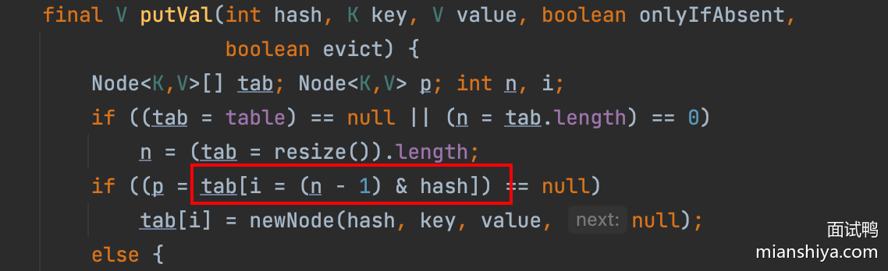

hash 算法是可能产生冲突的，且数组的大小是有限的，所以很可能通过不同的 key 计算得到一样的下标，因此为了解决键值对冲突的问题，采用了链表法，如下图所示：


在 JDK1.7 及之前链表的插入采用的是头插法，即每当发生哈希冲突时，新的节点总是插入到链表的头部，老节点依次向后移动，形成新的链表结构。


在多线程环境下，头插法可能导致链表形成环，特别是在并发扩容时（rehashing）。当多个线程同时执行 put() 操作时，如果线程 A 正在进行头插，线程 B 也在同一时刻操作链表，可能导致链表结构出现环路，从而引发死循环，最终导致程序卡死或无限循环。

**举个例子：**

假如此时线程 1 和 2 同时在插入，同时触发了扩容：


```java
void transfer(Entry[] newTable) {
  Entry[] src = table; 
  int newCapacity = newTable.length;
  for (int j = 0; j < src.length; j++) { 
      Entry<K,V> e = src[j];   
      if (e != null) {
          src[j] = null; 
          do { 
              Entry<K,V> next = e.next; 
             int i = indexFor(e.hash, newCapacity);//线程1执行到这没cpu时间片，线程2继续执行
             e.next = newTable[i]; 
             newTable[i] = e;  
             e = next;   
         } while (e != null);
     }
 }
}
```

假设此时，线程 1 中 e 是 A，next 为 B，刚要开始搬运，时间片到了，此时停止操作（停止在源码中注释那一行）。

而线程 2 开始扩容，且成功扩容完毕，此时：


待线程 2 扩容完毕后，线程 1 得到了时间片要开始执行了，它开始执行以下代码：

```java
e.next = newTable[i];  // A.next = null
newTable[i] = e;   
e = next;  
```

此时 `A.next = null`，因为线程 1 的 newTable 是新建的，此时上面还没有数据，所以 A.next 为 null，且被放到数组上，e 变成 B。


此时继续执行以下代码（看注释）：

```java
  do { 
     Entry<K,V> next = e.next;  // e 为 B，e.next 为 A
     int i = indexFor(e.hash, newCapacity);
     e.next = newTable[i]; // B.next = A
     newTable[i] = e;  // newTable[i] = B
     e = next;        // e = A  
 } while (e != null);

```

由于线程 2 的操作，`e.next` 已经变成了 A，hashmap 变成如下结构：


由于 `e != null` 继续循环执行以下代码：

```java
  do { 
     Entry<K,V> next = e.next;  // e 为 A，e.next 为 null
     int i = indexFor(e.hash, newCapacity);
     e.next = newTable[i]; // A.next = B
     newTable[i] = e;  // newTable[i] = A
     e = next;        // e = null  
 } while (e != null); // e ==null 跳出循环，此时成环。

```


在 JDK1.8 的时候，改成了尾插法，即新的节点插入到链表的尾部，保持插入的顺序。并且引入了红黑树。


当链表的长度大于 8 且数组大小大于等于 64 的时候，就把链表转化成红黑树，当红黑树节点小于 6 的时候，又会退化成链表。


## 461.Java 中 ConcurrentHashMap 1.7 和 1.8 之间有哪些区别？

### 回答重点

JDK 1.7 `ConcurrentHashMap` 采用的是**分段锁**，即每个 `Segment` 是独立的，可以并发访问不同的 `Segment`，默认是 16 个 `Segment`，所以最多有 16 个线程可以并发执行。

而 JDK 1.8 移除了 `Segment`，锁的粒度变得更加细化，锁只在链表或红黑树的**节点级别**上进行。通过 CAS 进行插入操作，只有在更新链表或红黑树时才使用 `synchronized`，并且只锁住链表或树的头节点，进一步减少了锁的竞争，并发度大大增加。

并且 JDK 1.7 `ConcurrentHashMap` 只使用了**数组 + 链表**的结构，而 JDK 1.8 和 `HashMap`一样引入了红黑树。

除此之外，还有扩容的区别以及 `size` 方法的计算也不一样。

### 扩展知识

#### ConcurrentHashMap 1.7 简单图解

我们来看下大致的结构。


原理就是先通过 key 的 hash 判断得到 Segment 数组的下标，将这个 Segment 上锁，然后再次通过 key 的 hash 得到 Segment 里 HashEntry 数组的下标，下面这步其实就是 HashMap 一致了，所以我说差别就是引入了一个 Segments 数组。

因此可以简化的这样理解：每个 Segment 数组存放的就是一个单独的 HashMap。


可以看到，图上我们有 6 个 Segment，那么等于有六把锁，因此共可以有六个线程同时操作这个 ConcurrentHashMap，并发度就是 6，相比于直接将 put 方法上锁，并发度就提高了，这就是**分段锁**。

具体上锁的方式来源于 Segment，**这个类实际继承了 ReentrantLock**，因此它自身具备加锁的功能。

可以看出，1.7 的分段锁已经有了细化锁粒度的概念，它的一个缺陷是 Segment 数组一旦初始化了之后不会扩容，只有 HashEntry 数组会扩容，这就导致并发度过于死板，不能随着数据的增加而提高并发度。

#### ConcurrentHashMap 1.8 简单图解

1.8 ConcurrentHashMap 做了更细粒度的锁控制，可以理解为 1.8 HashMap 的数组的每个位置都是一把锁，这样扩容了锁也会变多，并发度也会增加。


思想的转变就是把粒度更加细化。不分段了，我直接把 Node 数组的每个节点分别上一把锁，这样并发度不就更高了吗？

并且 1.8 也不借助于 ReentrantLock 了，直接用 synchronized，这也侧面证明，都 1.8 了 synchronized 优化后的速度已经不下于 ReentrantLock 了。

具体实现思路也简单：当塞入一个值的时候，先计算 key 的 hash 后的下标，如果计算到的下标还未有 Node，那么就通过 cas 塞入新的 Node。如果已经有 node 则通过 synchronized 将这个 node 上锁，这样别的线程就无法访问这个 node 及其之后的所有节点。

然后判断 key 是否相等，相等则是替换 value ，反之则是新增一个 node，这个操作和 HashMap 是一样的。

#### 扩容的区别

##### **JDK 1.7 中的扩容**：

- **基于 Segment**：`ConcurrentHashMap` 是由多个 `Segment` 组成的，每个 `Segment` 中包含一个 `HashMap`。当某个 `Segment` 内的 `HashMap` 达到扩容阈值时，单独为该 `Segment` 进行扩容，而不会影响其他 `Segment`。
- **扩容过程**：每个 `Segment` 维护自己的负载因子，当 `Segment` 中的元素数量超过阈值时，该 `Segment` 的 `HashMap` 会扩容，整体的 `ConcurrentHashMap` 并不是一次性全部扩容。

##### **JDK 1.8 中的扩容**：

- **全局扩容**：`ConcurrentHashMap` 取消了 `Segment`，变成了一个全局的数组（类似于 `HashMap`）。因此，当 `ConcurrentHashMap` 中任意位置的元素超过阈值时，整个 `ConcurrentHashMap` 的数组都会被扩容。
- **基于 CAS 的扩容**：在扩容时，`ConcurrentHashMap` 采用了类似 `HashMap` 的方式，但通过**CAS 操作**确保线程安全，避免了锁住整个数组。在扩容时，多个线程可以同时帮助完成扩容操作。
- **渐进式扩容**：JDK 1.8 的 `ConcurrentHashMap` 引入了渐进式扩容机制，扩容时并不是一次性将所有数据重新分配，而是多个线程共同参与，逐步迁移旧数据到新数组中，降低了扩容时的性能开销。

##### 渐进式扩容分析

当 put 的时候，发现当前 node hash 值是 -1，则表明当前的节点正在扩容，则会触发协助扩容机制：


其实大家大致理解下就够了：

扩容无非就是搬迁 Node，假设当前数组长度为 32，那就可以分着搬迁，31-16 这几个下标的 Node 都由线程 A 来搬迁，然后线程 B 来搬迁 15-0 这几个下标的 Node。

简单说就是会维护一个 transferIndex 变量，来的线程死循环 cas 争抢下标，如果下标已经分配完了，那自然就不需要搬迁了，如果 cas 抢到了要搬运的下标，那就去帮忙搬就好了，就是这么个事儿。

#### size 逻辑的区别

1.7 有个尝试的思想，当调用 size 方法的时候不会加锁，而是先尝试三次不加锁获取 sum。

如果三次总数一样，说明当前数量没有变化，那就直接返回了。如果总数不一样，那说明此时有线程在增删 map，于是加锁计算，这时候其他线程就操作不了 map 了。

```java
if (retries++ == RETRIES_BEFORE_LOCK) {
       for (int j = 0; j < segments.length; ++j)
           ensureSegment(j).lock(); // force creation
}
   ...再累加数量

```

而 1.8 不一样，它就是直接计算返回结果，具体采用的是类似 LongAdder 的思想，累加不再是基于一个成员变量，而是搞了一个数组，每个线程在自己对应的下标地方进行累加，等最后的时候把数组里面的数据统一一下，就是最终的值了。

所以这是一个分解的思想，分而治之。


在 put 的时候，就会通过 addCount 方法维护 counterCells 的数量，当然 remove 的时候也会调用此方法。


总而言之，就是平日的操作会维护 map 里面的节点数量，会先通过 CAS 修改 baseCount ，如果成功就直接返回，如果失败说明此时有线程在竞争，那么就通过 hash 选择一个 CounterCell 对象就行修改，最终 size 的结果就是 baseCount + 所有 CounterCell 。

这种通过 counterCell 数组来减少并发下场景下对单个成员变量的竞争压力，提高了并发度，提升了性能，**这也就是 LongAdder 的思想**。

## 455.为什么 JDK 1.8 对 HashMap 进行了红黑树的改动？

### 回答重点

在 JDK 1.8 之前，`HashMap` 使用链表来解决哈希冲突。当哈希冲突较多时，链表中的元素增多，查找、插入和删除的时间复杂度从 O(1) 退化为 O(n)。

因此在 JDK 1.8 引入红黑树，将链表长度超过一定阈值（默认 8）时的链表转换为红黑树，避免性能急剧下降。当链表长度降到 6 以下时，红黑树会重新退化为链表，保持简单高效。

红黑树是一种平衡二叉搜索树，插入、删除、查找操作的时间复杂度为 O(log n)，在元素多的情况下远优于链表的 O(n)。

### 扩展知识

#### **链表与红黑树的转换时机**

除了链表长度影响树化，实际上还与数组长度有关。

##### **链表到红黑树的转换机制**：

- 如果某个桶中的元素数量**大于等于** 8，且数组长度**大于等于** 64 时，链表转换为红黑树；
- 如果数组长度小于 64，则选择扩容而不是转换为红黑树。

`binCount` 从 0 开始计算，大于等于 7 则触发 `treeifyBin`（树化方法）：


`treeifyBin` 内还需判断数组的大小：


#### 为什么数组要大于等于 64 才转红黑树？

主要原因有以下两点：

- 避免频繁的树化
- 减少内存占用

当数组容量较小的时候，哈希冲突大，但是扩容后的 HashMap 自然会减少哈希冲突。如果在小数组上过早地进行链表转红黑树，可能会因为很快的扩容导致不必要的树化开销。

刚树化了没多久就扩容了，冲突就少了，此时不就白白树化了？所以设计上设置了数组大小需要大于 64 才允许链表转为红黑树，防止频繁的树化。

红黑树相比链表需要更多的内存，尤其是在节点较少的情况下，红黑树的额外指针和结构占用更大。为了节省内存，HashMap 选择只有在数组容量达到一定规模后才树化，防止红黑树在小规模数据中带来额外的内存负担。

#### 不能抛弃链表，直接使用红黑树吗？

来看下源码的注释:


因为**红黑树节点的大小是普通节点大小的两倍**，所以为了节省内存空间不会直接只用红黑树，只有当节点到达一定数量才会转成红黑树，这里定义的是 8。

为什么是 8 呢？这个其实 HashMap 注释上也有说，和泊松分布有关系。

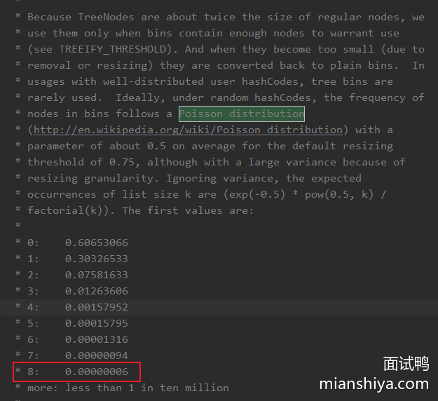

简单翻译下就是在默认阈值是 0.75 的情况下，冲突节点长度为 8 的概率为 0.00000006，也就概率比较小（毕竟红黑树耗内存，且链表长度短点时遍历的还是很快的）。

这就是基于时间和空间的平衡了，红黑树占用内存大，所以节点少就不用红黑树，如果万一真的冲突很多，就用红黑树，选个参数为 8 的大小，就是为了平衡时间和空间的问题。

#### 为什么节点小于等于 6 要从红黑树转成链表？

链表树化的节点是 8，除此之外，当树节点数小于等于 6 时候，又会从红黑树转为链表。

这个操作是为了平衡时间和空间，节点太少链表遍历也很快，没必要成红黑树，变成链表节约内存。

为什么定了 6 而不是小于等于 8 就变？

是因为要留个缓冲余地，避免反复横跳。举个例子，一个节点反复添加，从 8 变成 9 ，链表变红黑树，又删了，从 9 变成 8，又从红黑树变链表，再添加，又从链表变红黑树？

所以余一点，毕竟树化和反树化都是有开销的。

## 456. JDK 1.8 对 HashMap 除了红黑树还进行了哪些改动？

### 回答重点

- **改进了哈希函数的计算**：JDK 1.8 中优化了哈希函数，使得哈希值的分布更加均匀，减少了哈希冲突的发生。通过在生成哈希值时使用“扰动函数”，确保哈希值的高低位都能参与到桶的选择中。
- **扩容机制优化**：JDK 1.8 改进了扩容时的元素迁移机制。在扩容过程中不再对每个元素重新计算哈希值，而是根据原数组长度的高位来判断元素是留在原位置，还是迁移到新数组中的新位置。这一改动减少了不必要的计算，提升了扩容效率。
- **头插法变为尾插法**：头插法的好处就是插入的时候不需要遍历链表，直接替换成头结点，但是缺点是扩容的时候会逆序，而逆序在多线程操作下可能会出现环，产生死循环，于是改为尾插法。

### 扩展知识

#### 哈希函数的优化

1.7是这样实现的：

```JAVA
static final int hash(Object key) {
    int h;
    return (key == null) ? 0 : (h = key.hashCode()) ^ (h >>> 16);
}
```

具体而言就是 1.7 的操作太多了，经历了四次异或，所以 1.8 优化了下，它将 key 的哈希码的高 16 位和低 16 位进行了异或，得到的 hash 值同时拥有了高位和低位的特性，使得哈希码的分布更均匀，不容易冲突。

这也是 JDK 开发者根据速度、实用性、哈希质量所做的权衡来做的实现：


#### 扩容机制优化

- [451. Java 中 HashMap 的扩容机制是怎样的？](https://www.mianshiya.com/bank/1788408712975282177/question/1780933294750199809#heading-2)

#### 头插法和尾插法

1.7 是头插法，头插法的好处就是插入的时候不需要遍历链表，直接替换成头结点，但是缺点是扩容的时候会逆序，而逆序在多线程操作下可能会出现环，然后就死循环了。


然后 1.8 是尾插法，每次都从尾部插入的话，扩容后链表的顺序还是和之前一致，所以不可能出现多线程扩容成环的情况。

再延伸一下，**改成尾插法之后 HashMap 就不会死循环了吗？**

好像还是会，这次是红黑树的问题，我在网上看到这篇文章，有兴趣的可以深入了解下：

https://blog.csdn.net/qq_33330687/article/details/101479385

## 444. Java 中有哪些集合类？请简单介绍

### 回答重点

Java 中的集合类主要分为两大类：Collection 接口和 Map 接口。前者是存储对象的集合类，后者存储的是键值对（key-value）。


Collection 接口下又分为 List、Set 和 Queue 接口。每个接口有其具体实现类。以下是主要的集合类：

#### List 接口：

- ArrayList：基于动态数组，查询速度快，插入、删除慢。
- LinkedList：基于双向链表，插入、删除快，查询速度慢。
- Vector：线程安全的动态数组，类似于 ArrayList，但开销较大。

#### Set 接口：

- HashSet：基于哈希表，元素无序，不允许重复。
- LinkedHashSet：基于链表和哈希表，维护插入顺序，不允许重复。
- TreeSet：基于红黑树，元素有序，不允许重复。

所以网上有些说 Set 是无序集合非常不准确，因为需要看具体的实现类。

#### Queue 接口：

- PriorityQueue：基于优先级堆，元素按照自然顺序或指定比较器排序。
- LinkedList：可以作为队列使用，支持 FIFO（先进先出）操作。

#### Map 接口：

存储的是键值对，也就是给对象（value）设置了一个 key，这样通过 key 可以找到那个 value。


- HashMap：基于哈希表，键值对无序，不允许键重复。
- LinkedHashMap：基于链表和哈希表，维护插入顺序，不允许键重复。
- TreeMap：基于红黑树，键值对有序，不允许键重复。
- Hashtable：线程安全的哈希表，不允许键或值为 null。
- ConcurrentHashMap：线程安全的哈希表，适合高并发环境，不允许键或值为 null。

> 这题一般会在面试刚开始的时候被问，主要用于暖场热身，不需要说的那么详细，大致讲下，面试官会根据你回答的点继续挖的。

PS：可尝试结合类图，对常见的实现类关系重点记忆，面试时可对自己擅长的实现类详细介绍或引导，也可做一定的取舍。


注意类图中“接口-->抽象类 -->实现类”的整体框架，可以体现一点 Java 的设计理念，可根据此记忆也可根据此在面试的时候详细说明，可延展出 Java 的接口和抽象类的区别。

### 扩展：LinkedHashMap

[什么是 Java 的 LinkedHashMap？](https://www.mianshiya.com/bank/1788408712975282177/question/1780933294783754241)

### 扩展：TreeMap

[什么是 Java 的 TreeMap？](https://www.mianshiya.com/bank/1788408712975282177/question/1780933294796337153)

## 594. MySQL 索引的最左前缀匹配原则是什么？

### 回答重点

MySQL 索引的最左前缀匹配原则指的是在使用**联合索引**时，查询条件必须从索引的最左侧开始匹配。如果一个联合索引包含多个列，查询条件必须包含第一个列的条件，然后是第二个列，以此类推。

**底层原理**：因为联合索引在 B+ 树中的排列方式遵循“从左到右”的顺序，例如联合索引` (first_name, last_name, age)` 会按照 `(first_name, last_name, age) `的顺序在 B+ 树中进行排序。

MySQL 在查找时会优先使用 `first_name` 作为匹配依据，然后依次使用 `last_name` 和 `age`。因此，组合索引能够从左到右依次高效匹配，跳过最左侧字段会导致无法利用该索引。

按照 `(first_name, last_name, age)` 的顺序在 B+ 树中的排列方式(大致的示意图)如下

```scss
                        (Alice, Black, 35)
                              |
      -------------------------------------------------------------
      |                |                     |                |
    (Alice, Brown, 25)  (Alice, Smith, 30) (Bob, Smith, 20) (Bob, White, 19)   
```

### 扩展知识

#### 举例说明

假设当前表有一个联合索引（a,b,c）。

以下查询条件 **符合** 最左匹配原则：

```sql
where a=1;
where a=1, b=2;
where a=1, b=2, c=3;
```

以下查询条件 **不符合** 最左匹配原则：

```sql
where b=2;
where c=3;
where b=2, c=3;
```

再来看下这个查询：

```sql
where a=1, c=3;
```

这个查询可能可以用上联合索引（a,b,c），在 5.6版本之前，即使用上也只能利用 a=1 这个条件来过滤。但是在 MySQL 5.6 版本后有个优化，即**索引下推**，可以在引擎层面，查询得到 a=1 的数据之后，利用 c 过滤掉不符合的数据，再返回给 server 层。

- [596. MySQL 的索引下推是什么？](https://www.mianshiya.com/bank/1791003439968264194/question/1780933295459037186)

#### 注意范围查询

在理解范围查询不同点之前，需要**理解联合索引的顺序**。

**例如联合索引（a,b,c），在 B+树的中排序是：先按 a 的值排序，如果 a 的值相同，则按 b 的值排序，如果 b 的值相同，再按 c 的值排序。**

类似下图的排序：


**如果遇到范围查询(>、<)，就会停止匹配**。

```sql
where a>1, b=2, c=3;
```

所谓的停止匹配指的是：a 可以用上联合索引，但是 b 和 c 却不行。因为 a 需要先经过范围查询，此时经过筛选得到 b 和 c 的数据是无序的。比如 a 为 1 和 a 为 2 数据之间 b 和 c 是无序的，因此无法利用索引查询。

**如果遇到如 >=、<=、BETWEEN、前缀like（xx%）的范围查询，则不会停止匹配**。因为这些查询包含一个等值判断，可以直接定位到某个数据，然后往后扫描即可。

例如：

```sql
where a>=1, b=2, c=3;
```

查询可以定位到 a=1 这条数据，然后往后遍历即可，而定**位到的 a=1 数据内，b 和 c 是有序的，因此可以利用索引查询**。

而以下的查询则可以全部用上联合索引：

```sql
where a=1, b=2, c>3;
```

因为 a 和 b 是等值查询的情况下，c 是有序的，有序就可以用上索引。

> 补充说明：拿 `where a>=1, b=2`，再来理解一下。因为 a = 1 这个条件，再加上 b = 2，mysql 可以直接定位到 a=1 and b=2 这条数据，然后再往后遍历，因此说用上了 b（因为确实利用了 b 的条件快速定位到第一条记录）。但是要注意往后遍历即 扫描 a > 1 的情况是用不到 b 的。

#### MySQL 8 都不需要最左匹配就能用上联合索引了？

> 以下实验基于 MySQL8.0.26 版本

为了故事顺利的发展，我们先建个表

```sql
CREATE TABLE `t1` (
  `f1` int NOT NULL AUTO_INCREMENT,
  `f2` int NOT NULL,
  `f3` int NOT NULL,
  PRIMARY KEY (`f1`),
  KEY `idx_f2_f3` (`f2`,`f3`)
) ENGINE=InnoDB AUTO_INCREMENT=1 DEFAULT CHARSET=utf8mb4 COLLATE=utf8mb4_0900_ai_ci
```

很简单的一张表，一个主键索引，一个联合索引`idx_f2_f3`。

此时插入一波数据

```sql
INSERT INTO t1 (f2,f3) VALUES
  (1,1), (1,2), (1,3), (1,4), (1,5),
  (2,1), (2,2), (2,3), (2,4), (2,5);
INSERT INTO t1(f2,f3) SELECT f2, f3 + 5 FROM t1;
INSERT INTO t1(f2,f3) SELECT f2, f3 + 10 FROM t1;
INSERT INTO t1(f2,f3) SELECT f2, f3 + 20 FROM t1;
INSERT INTO t1(f2,f3) SELECT f2, f3 + 40 FROM t1;
```

这个时候表里一共有160条数据，**f2 的值基数很低，只有1、2这两个值，基数为2**。

数据准备完了，咱们可以开始操作一下了，此时执行：


先执行了一下`ANALYZE TABLE t1;` 更新了一下表的统计信息，防止 MySQL 误判。

简单执行了一个 f2 为条件的联合索引查询，且结果只要求返回 f2 和 f3，所以从这个联合索引可以直接得到值，不需要回表。

这个查询的 explain 结果相信大家也都能理解，用上了 `idx_f2_f3`，且 type 是ref，说明用上了这个索引查询。

现在我们换一个查询条件，让 f3 作为条件来查询，这个时候就不是最左匹配原则了，讲道理应该用不上索引查询。


看看这结果，好像不太对？type 是 range，这是基于索引的范围扫描，所以用上了索引！

但是我的查询条件 `f3=1` 明明是等值呀？怎么就用上了范围扫描呢？

还有 Extra 里面显示的`Using index for skip scan`又是啥？

#### Using index for skip scan

让我们直接进行一个官方文档的查询！


在优化里面的范围优化里确实有`Skip Scan Range Access Method`，它就是产生上述 Extra 的原因。

好了，可以忘了官网这个截图了，基于我展示的例子我来解释下。

根据我们所认知的最左匹配原则，执行

- where f3 =1

是无法在`idx_f2_f3`上利用 type 是 ref 的查询方式来查询的。

因为只有带上索引左边的查询条件才能用上索引，例如：

- where f2=1 and f3 =1

那如果无法利用索引进行查询，最终只有一个选择，全表扫描：要么全表扫描主键索引，要么全表扫描二级索引。

MySQL 就意识到这效率确实低，能不能找个优化点呢？

所以就在 8.0.13 版本引入了`Skip Scan Range Access Method`，它在一定条件下，利用了范围扫描来替代了全表扫描的发生。

具体原理如下：

1. 先统计一下索引最左字段 f2 的基数即唯一值，这里一共有 1 和 2 两个值。
2. 然后将 f2 的值拼入查询条件中构造 `where f2=1 and f3=1` 和 `where f2=2 and f3=1`这样的条件进行查询。

这波是不是小秀？

你 SQL 不带索引最左的条件是吧，我自个儿给你拼上去！

所以一条查询就变成了多次查询，所以 type 就变成了 range 了。

**因此最终还是没有逃出最左匹配原则**，只是 MySQL 隐式的构造了查询条件，使得看起来好像不需要最左匹配原则而已。

这个优化的中文名叫：**跳过扫描范围访问**(我直译的，哈哈哈)

#### 跳过扫描范围访问的局限性

不要高兴的太早，这个优化其实有很大的局限性！

它要求最左条件的基数很低，因为它需要列举最左条件的值来构造查询，假如最左条件有上万个，那还不如直接进行全表扫描了对吧。

其实也不需要上万个，我来改一下表里的数据来做一次实验。


我直接把 f2 的值随机化了，这样 f2 的基数就变大了，可以看到此时再执行查询语句就用不上了`Using index for skip scan`了。

变成了一个基于二级索引的**全表扫描**。

除了上面这个关键点之外，还有很多局限性，我根据官网的内容做了一下翻译(和一点便于理解的小修改)：

- 需要联合索引
- 查询不能跨表
- 查询不能使用 GROUP BY 或者 DISTINCT
- 查询只能用一个索引，即索引需要覆盖查询的值，不能回表
- 查询条件必须是常量，包括 IN() 运算符。

还有两条我不翻译了，我觉得讲的是废话...有点兴趣的自己去看看吧，文末会放链接。

总而言之，能用上这个优化的场景很有限，就**基数很低**这一个限制我就觉得很大了。

所以这也不是什么万能药，就当一个知识点咱们知晓下，到时候遇到特殊场景能用上的时候装一下，或者在面试官问你最左匹配的时候，提一下，我知道那个 MySQL 8.0.13 版本啊，它做了个优化.....

## 608. 数据库的脏读、不可重复读和幻读分别是什么？

### 回答重点

**1）脏读（Dirty Read）**：

- 一个事务读取到另一个事务未提交的数据。如果该未提交事务最终被回滚，那么第一个事务读取的数据就是不一致的（脏的）。

**2）不可重复读（Non-repeatable Read）**：

- 在同一事务中，读取同一数据两次，但由于其他事务的提交，读取的结果不同。例如，事务 A 读取了一行数据，事务 B 修改并提交了这行数据，导致事务 A 再次读取时得到不同的值。

**3）幻读（Phantom Read）**：

- 在同一事务中，执行相同的查询操作，返回的结果集由于其他事务的插入而发生变化。例如，事务 A 查询符合某条件的记录，事务 B 插入了新记录并提交，导致事务 A 再次查询时看到不同的记录数量。

### 扩展知识

#### 1.四种事务隔离级别

##### 1.1 READ UNCOMMITTED

读未提交，也叫未提交读，该隔离级别的事务可以看到其他事务中未提交的数据。该隔离级别因为可以读取到其他事务中未提交的数据，而未提交的数据可能会发生回滚，因此我们把该级别读取到的数据称之为脏数据，把这个问题称之为脏读。

##### 1.2 READ COMMITTED

读已提交，也叫提交读，该隔离级别的事务能读取到已经提交事务的数据，因此它不会有脏读问题。但由于在事务的执行中可以读取到其他事务提交的结果，所以在不同时间的相同 SQL 查询中，可能会得到不同的结果，这种现象叫做不可重复读。

##### 1.3 REPEATABLE READ

可重复读，MySQL 默认的事务隔离级别。可重复读可以解决“不可重复读”的问题，但还存在幻读的问题。所谓的幻读指的是，在同一事务的不同时间使用相同 SQL 查询时，会产生不同的结果。例如，一个 SELECT 被执行了两次，但是第二次返回了第一次没有返回的一行，那么这一行就是一个“幻像”行。

> 注意：幻读和不可重复读的侧重点是不同的，不可重复读侧重于数据修改，两次读取到的同一行数据不一样；而幻读侧重于添加或删除，两次查询返回的数据行数不同。

##### 1.4 SERIALIZABLE

序列化，事务最高隔离级别，它会强制事务排序，使之不会发生冲突，从而解决了脏读、不可重复读和幻读问题，但因为执行效率低，所以真正使用的场景并不多。

#### **几种读与隔离级别的关系**：

脏读、不可重复读和幻读是不同隔离级别下可能发生的问题：

- 读未提交允许脏读。
- 读已提交防止脏读，但可能出现不可重复读。
- 可重复读防止脏读和不可重复读，但仍可能出现幻读。
- 串行化防止所有三种问题，但性能开销较大。

#### 注意不可重复读与幻读的区别

幻读是指在事务期间，对于数据总量的突然增加或减少，将别的事务提交的读取到了（针对于数据的数量），不可重复读是指对于同一条数据，在事务执行期间，里面的字段内容发生了变化，读取到了别的事务提交修改的数据。（针对于数据的内容）。

## 590. MySQL 的存储引擎有哪些？它们之间有什么区别？

[590-mysql-的存储引擎有哪些它们之间有什么区别](mysql.md#590-mysql-的存储引擎有哪些它们之间有什么区别)

## 595. MySQL 的覆盖索引是什么？

[595. MySQL 的覆盖索引是什么](mysql.md#595-mysql-的覆盖索引是什么)

## 591.MySQL 的索引类型有哪些？

[591.MySQL 的索引类型有哪些？ ](mysql.md#591-mysql-的索引类型有哪些)

## 596.MySQL 的索引下推是什么？

[596.MySQL 的索引下推是什么](mysql.md#596-mysql-的索引下推是什么)

## 592. MySQL InnoDB 引擎中的聚簇索引和非聚簇索引有什么区别？

[592. MySQL InnoDB 引擎中的聚簇索引和非聚簇索引有什么区别](mysql.md#592-mysql-innodb-引擎中的聚簇索引和非聚簇索引有什么区别)

## 593. MySQL 中的回表是什么？

[593. MySQL 中的回表是什么](mysql.md#593-mysql-中的回表是什么)

## 598. MySQL 中使用索引一定有效吗？如何排查索引效果？

[598. MySQL 中使用索引一定有效吗？如何排查索引效果？ ](mysql.md#598-mysql-中使用索引一定有效吗如何排查索引效果)

## 5208. RabbitMQ 怎么实现延迟队列？

[5208. RabbitMQ 怎么实现延迟队列？ ](消息队列.md#5208rabbitmq-怎么实现延迟队列)

## 599. MySQL 中的索引数量是否越多越好？为什么？

[599. MySQL 中的索引数量是否越多越好？为什么？ ](mysql.md#599-mysql-中的索引数量是否越多越好为什么)

## 1702. 为什么 RocketMQ 不使用 Zookeeper 作为注册中心呢？而选择自己实现 NameServer？

[1702. 为什么 RocketMQ 不使用 Zookeeper 作为注册中心呢？而选择自己实现 NameServer？](消息队列.md#1702为什么-rocketmq-不使用-zookeeper-作为注册中心呢而选择自己实现-nameserver)

## 600. 请详细描述 MySQL 的 B+ 树中查询数据的全过程

[600. 请详细描述 MySQL 的 B+ 树中查询数据的全过程  ](mysql.md#600-请详细描述-mysql-的-b-树中查询数据的全过程)

## 1369. RabbitMQ 中消息什么时候会进入死信交换机？

[1369. RabbitMQ 中消息什么时候会进入死信交换机？ ](消息队列.md#1369rabbitmq-中消息什么时候会进入死信交换机)

## 601. 为什么 MySQL 选择使用 B+ 树作为索引结构？

[601. 为什么 MySQL 选择使用 B+ 树作为索引结构？](mysql.md#601-为什么-mysql-选择使用-b-树作为索引结构)

## 1368. RabbitMQ 中无法路由的消息会去到哪里？

[1368. RabbitMQ 中无法路由的消息会去到哪里？ ](消息队列.md#1368-rabbitmq-中无法路由的消息会去到哪里)

## 1215. Kafka为什么要抛弃 Zookeeper？

[1215. Kafka为什么要抛弃 Zookeeper？ ](消息队列.md#1215kafka为什么要抛弃-zookeeper)

## 589. 详细描述一条 SQL 语句在 MySQL 中的执行过程。

[589. 详细描述一条 SQL 语句在 MySQL 中的执行过程](mysql.md#589-详细描述一条-sql-语句在-mysql-中的执行过程)

## 1212. Kafka 中 Zookeeper 的作用？

[1212. Kafka 中 Zookeeper 的作用？ ](消息队列.md#1212-kafka-中-zookeeper-的作用)

## 602. MySQL 是如何实现事务的？

[602. MySQL 是如何实现事务的？](mysql.md#602-mysql-是如何实现事务的)

## 536. 为什么 Java 8 移除了永久代（PermGen）并引入了元空间（Metaspace）？

### 回答重点

Java 8 移除永久代并引入元空间，主要是为了解决 PermGen 固定大小、容易导致内存溢出、GC 效率低的问题。元空间使用本地内存，具备更灵活的内存分配能力，提升了垃圾收集和内存管理的效率。

### 扩展知识

PermGen 的局限性
固定大小：永久代的内存空间大小在 JVM 启动时是固定的，容易出现 内存溢出（OutOfMemoryError），尤其是在动态加载大量类时。
类和方法的存储限制：永久代用于存放类的元数据（类信息、方法等），其容量受限，导致某些应用特别是在大量动态生成类或使用大量第三方库时，容易出现内存管理问题。
GC 效率低：永久代内大部分存放的类的元数据是都是被使用的，不是垃圾对象，因此无法被回收，回收的效率很低。
Metaspace 的改进
使用本地内存：元空间使用的是 本地内存（Native Memory），而不是 JVM 的堆内存，这样使得内存的分配更加灵活，避免了 PermGen 固定大小带来的局限性。
自动调整大小：元空间可以根据应用的需要自动扩展大小，从而降低了出现 OutOfMemoryError 的风险，提升了内存使用的灵活性和效率。
性能提升：元空间（在堆外）减少了 GC 对类元数据的影响，避免了频繁回收 PermGen 时的停顿，改善了 JVM 的整体性能。
如何监控和调整元空间的大小
JVM 提供了 -XX:MetaspaceSize 和 -XX:MaxMetaspaceSize 的参数来控制元空间的初始和最大大小。如果不设置，元空间会根据需要动态扩展，通常情况下不需要手动调整，但对于特定的大型应用，建议进行调优以避免内存问题。

## 1155. 说一下 Kafka 中关于事务消息的实现？

[1155. 说一下 Kafka 中关于事务消息的实现？ ](消息队列.md#1155说一下-kafka-中关于事务消息的实现)

## 9498. MySQL 事务的二阶段提交是什么？

[9498. MySQL 事务的二阶段提交是什么？ ](mysql.md#9498mysql-事务的二阶段提交是什么-)

## 1142. 说一下 RocketMQ 中关于事务消息的实现？

[ 1142. 说一下 RocketMQ 中关于事务消息的实现？ ](消息队列.md#1142-说一下-rocketmq-中关于事务消息的实现)

## 603. MySQL 中长事务可能会导致哪些问题？

[603. MySQL 中长事务可能会导致哪些问题？ ](mysql.md#603-mysql-中长事务可能会导致哪些问题)

## 1141. RocketMQ 的事务消息有什么缺点？你还了解过别的事务消息实现吗？

[ 1141. RocketMQ 的事务消息有什么缺点？你还了解过别的事务消息实现吗？ ](消息队列.md#1141-rocketmq-的事务消息有什么缺点你还了解过别的事务消息实现吗)

## 604. MySQL 中的 MVCC 是什么？

[604. MySQL 中的 MVCC 是什么](mysql.md#604-mysql-中的-mvcc-是什么)

## 606. MySQL 中的事务隔离级别有哪些？

[606. MySQL 中的事务隔离级别有哪些？ ](mysql.md#606-mysql-中的事务隔离级别有哪些)

## 1088. 说一下消息队列的模型有哪些？

[ 1088. 说一下消息队列的模型有哪些？](消息队列.md#1088-说一下消息队列的模型有哪些)

## 607. MySQL 默认的事务隔离级别是什么？为什么选择这个级别？

[607. MySQL 默认的事务隔离级别是什么？为什么选择这个级别？ ](mysql.md#607-mysql-默认的事务隔离级别是什么为什么选择这个级别)

## 1416. 谈谈你了解的最常见的几种设计模式，说说他们的应用场景

回答重点
工作中常用的就是单例模式、简单工厂、策略、模板等设计模式。

例如，需要确保某个类只有一个实例，并提供一个全局访问点的时候，就能用到单例模式，比如配置管理器或者全局缓存，像常见的数据库连接池等其实都用上了单例模式。

而且很多时候设计模式在工作中都是组合使用的，比如支付场景，需要对接不同的支付渠道：支付宝、微信、易宝支付、连连支付等等。

不同渠道对应不同策略，天然适合策略模式。

```java
public interface PayService {
	void pay(PayDto payDto);
}

public class AliPayService implements PayService {
	public void pay(PayDto payDto) {
      // ....
	}
}
public class WechatPayService implements PayService {
	public void pay(PayDto payDto) {
      // ....
	}
}
```

并且在不同支付渠道对接过程中会发现大部分流程都是一样的，例如先需要前置的参数检查，然后进行核心的支付逻辑，最后有一些后置的检查等等。这样一致的流程就能抽象成一个模板方法，让不同渠道的实现类都继承它，这就运用了模板方法。

```java
public abstract class AbstractPayService implements PayService {
  
    //模板方法
    @Override
	public void pay(PayDto payDto) {
        paramValidate(payDto);
        doPay(payDto);
        afterProcess()
	}

	private void paramValidate(PayDto payDto) {
        .....
	}

	private void afterProcess() {
        .....
	}

    // 不同支付渠道的具体实现
	public abstract void doPay(PayDto payDto);
}

public class AliPayService extends AbstractPayService {
	public void doPay(PayDto payDto) {
      // ....
	}
}
public class WechatPayService extends AbstractPayService {
	public void doPay(PayDto payDto) {
      // ....
	}
}

```

还有个简单工厂模式可以用在选择支付渠道的时候，创建一个支付工厂方法，传入了 ALIPAY 得到支付宝的支付实现类，传入 WECHAT 得到微信的实现类，这不就是工厂方法吗？

```java
@Component
public class PayServiceFactory {

	@Resource
	private Map<String, PayService> payServiceMap;
  

	public PayService getPayService(String channel) {
        return payServiceMap.get(channel);
	}
}
```

以上都是一些比较常用的设计模式，还有的话例如适配器模式，可以用在老接口对接的场景，进行接口的适配兼容。

## 609. MySQL 中有哪些锁类型？

[609. MySQL 中有哪些锁类型？ ](mysql.md#609-mysql-中有哪些锁类型)

## 1220. 什么是策略模式？一般用在什么场景？

### 回答重点

策略模式是一种行为型设计模式，它定义了一系列算法，并将每个算法封装起来，使它们可以相互替换，让算法独立于使用它的客户端（调用方）而变化。

很多情况下，我们代码里有大量的 `if else、switch` 等，可以通过使用策略模式，避免大量条件语句的使用，实现算法的分离和独立变化。

它的主要目的是为了解耦多个策略，并方便调用方在针对不同场景灵活切换不同的策略。

**策略模式的特点**:

1. **算法封装**：将算法的实现与使用算法的代码分离，通过封装提高代码的灵活性和可扩展性。
2. **动态替换**：可以在运行时选择和替换算法。
3. **遵循开闭原则**：新增策略无需修改现有代码。

#### 一般用在什么场景？

1. **多种算法可互换**：需要动态选择算法，例如排序算法的选择。
2. **避免条件语句**：通过策略模式替代代码中大量的 `if-else` 或 `switch` 语句。
3. **与上下文独立**：客户端不需要知道具体的算法实现细节，只需依赖抽象策略。

**典型场景**：

* **支付系统**：支持多种支付方式（如微信、支付宝、信用卡）。
* **数据压缩**：提供不同的压缩算法。
* **日志策略**：根据日志级别动态选择记录策略。

### 扩展知识

#### 策略模式的组成

1. **策略接口（Strategy）**：定义算法的通用接口。
2. **具体策略（ConcreteStrategy）**：实现具体的算法。
3. **上下文类（Context）**：持有策略接口的引用，调用具体策略的方法。

#### Java 示例

```java
// 策略接口
interface Strategy {
    void execute();
}

// 具体策略A
class ConcreteStrategyA implements Strategy {
    @Override
    public void execute() {
        System.out.println("Executing Strategy A");
    }
}

// 具体策略B
class ConcreteStrategyB implements Strategy {
    @Override
    public void execute() {
        System.out.println("Executing Strategy B");
    }
}

// 上下文类
class Context {
    private Strategy strategy;

    public void setStrategy(Strategy strategy) {
        this.strategy = strategy;
    }

    public void executeStrategy() {
        if (strategy != null) {
            strategy.execute();
        } else {
            System.out.println("No strategy set");
        }
    }
}

// 客户端
public class Main {
    public static void main(String[] args) {
        Context context = new Context();

        Strategy strategyA = new ConcreteStrategyA();
        Strategy strategyB = new ConcreteStrategyB();

        context.setStrategy(strategyA);
        context.executeStrategy(); // Output: Executing Strategy A

        context.setStrategy(strategyB);
        context.executeStrategy(); // Output: Executing Strategy B
    }
}

```

## 610. MySQL 的乐观锁和悲观锁是什么？

[610. MySQL 的乐观锁和悲观锁是什么？](mysql.md#610-mysql-的乐观锁和悲观锁是什么)

## 1221. 什么是责任链模式？一般用在什么场景？

### 回答重点

责任链模式是一种行为型设计模式，将多个对象连接成一条链，并且沿着这条链传递请求，让多个对象都有机会处理这个请求，请求会顺着链传递，直到某个对象处理它为止。

它主要避免了请求发送者和接受者之间的耦合，增强了系统的灵活性和可扩展性。

**责任链模式的特点**：

1. **解耦请求发送者与接收者**：请求发送者无需知道请求是由哪个处理器处理的。
2. **动态组合处理器**：可以灵活地动态改变链的结构。
3. **请求沿链传递**：请求可以由链中的一个或多个处理器处理。

#### 一般用在什么场景？

1. **请求需要多个处理器**：例如日志记录的不同级别处理。
2. **动态指定处理流程**：请求的处理方式不固定，依赖于运行时的链条结构。
3. **消除条件分支**：用责任链代替代码中的 `if-else` 或 `switch-case` 语句。

**典型场景**：

* 事件处理系统（如 GUI 的事件冒泡机制）。
* 审批流程（如多级审批）。
* 日志系统（如不同级别的日志记录）。

在很多场景都能看到责任链模式，比如 Spring 拦截器的 Chain 也是责任链模式。

### 扩展知识

#### 责任链模式的组成

1. **处理器接口（Handler）**：定义处理请求的通用方法和设置下一个处理器的方法。
2. **具体处理器（ConcreteHandler）**： 实现处理器接口，并处理具体的请求。

#### Java 示例

```java
// 处理器接口
abstract class Handler {
    protected Handler nextHandler;

    public void setNextHandler(Handler nextHandler) {
        this.nextHandler = nextHandler;
    }

    public abstract void handleRequest(String request);
}

// 具体处理器A
class ConcreteHandlerA extends Handler {
    @Override
    public void handleRequest(String request) {
        if ("A".equals(request)) {
            System.out.println("ConcreteHandlerA handled request: " + request);
        } else if (nextHandler != null) {
            nextHandler.handleRequest(request);
        } else {
            System.out.println("No handler for request: " + request);
        }
    }
}

// 具体处理器B
class ConcreteHandlerB extends Handler {
    @Override
    public void handleRequest(String request) {
        if ("B".equals(request)) {
            System.out.println("ConcreteHandlerB handled request: " + request);
        } else if (nextHandler != null) {
            nextHandler.handleRequest(request);
        } else {
            System.out.println("No handler for request: " + request);
        }
    }
}

// 客户端
public class Main {
    public static void main(String[] args) {
        Handler handlerA = new ConcreteHandlerA();
        Handler handlerB = new ConcreteHandlerB();

        handlerA.setNextHandler(handlerB);

        handlerA.handleRequest("A"); // Output: ConcreteHandlerA handled request: A
        handlerA.handleRequest("B"); // Output: ConcreteHandlerB handled request: B
        handlerA.handleRequest("C"); // Output: No handler for request: C
    }
}

```

## 611. MySQL 中如果发生死锁应该如何解决？

[611. MySQL 中如果发生死锁应该如何解决？](mysql.md#611-mysql-中如果发生死锁应该如何解决)

## 1193. 什么是模板方法模式？一般用在什么场景？

### 回答重点

模板方法模式是一种行为型设计模式，它在一个抽象类中定义了一个算法（业务逻辑）的骨架，具体步骤的实现由子类提供，它通过将算法的不变部分放在抽象类中，可变部分放在子类中，达到代码**复用**和**扩展**的目的。

* **复用**：所有子类可以直接复用父类提供的模板方法，即上面提到的不变的部分。
* **扩展**：子类可以通过模板定义的一些扩展点就行不同的定制化实现。

**模板方法模式的特点**:

1. **算法骨架**：在基类中定义一个算法的固定执行步骤（模板方法），具体实现步骤交给子类完成。
2. **复用代码**：子类复用基类中定义的通用逻辑，仅需实现特定步骤。
3. **遵循开闭原则**：基类的骨架逻辑对扩展开放，对修改关闭。

#### 一般用在什么场景？

1. **定义算法骨架**：有一个固定的流程，但某些步骤需要根据具体情况自定义。
2. **复用公共逻辑**： 多个子类共享相同的算法结构，仅需重写特定步骤。
3. **控制执行顺序**：需要对子类执行方法的顺序进行控制时。

**典型场景**：

* 数据处理流程（如读取数据、处理数据、输出结果）。
* Web 请求处理（如解析请求、处理逻辑、返回响应）。

在 Java 中有很多应用场景，例如 `JdbcTemplate` 就是使用了模板方法来处理数据库的操作。

再比如 `HttpServlet` 类的 `service` 方法也用了模板方法，`doGet、doPost` 等方法都是需要子类实现的。

### 扩展知识

#### 模板方法模式的组成

1. **抽象类（AbstractClass）**：定义模板方法，包含算法的骨架。声明需要子类实现的抽象方法。
2. **具体类（ConcreteClass）**： 实现抽象方法，为算法的某些步骤提供具体实现。
3. **模板方法（TemplateMethod）**：调用一系列步骤方法，构成算法的完整逻辑。

#### Java 示例

```java
// 抽象类
abstract class DataProcessor {
    // 模板方法
    public final void process() {
        readData();
        processData();
        writeData();
    }

    protected abstract void readData(); // 读取数据
    protected abstract void processData(); // 处理数据

    protected void writeData() { // 写入数据
        System.out.println("Writing data to output.");
    }
}

// 具体实现类A
class CSVDataProcessor extends DataProcessor {
    @Override
    protected void readData() {
        System.out.println("Reading data from CSV file.");
    }

    @Override
    protected void processData() {
        System.out.println("Processing CSV data.");
    }
}

// 具体实现类B
class JSONDataProcessor extends DataProcessor {
    @Override
    protected void readData() {
        System.out.println("Reading data from JSON file.");
    }

    @Override
    protected void processData() {
        System.out.println("Processing JSON data.");
    }
}

// 客户端
public class Main {
    public static void main(String[] args) {
        DataProcessor csvProcessor = new CSVDataProcessor();
        csvProcessor.process();

        DataProcessor jsonProcessor = new JSONDataProcessor();
        jsonProcessor.process();
    }
}

```

## 613. MySQL 中 count(*)、count(1) 和 count(字段名) 有什么区别？

[613. MySQL 中 count(*)、count(1) 和 count(字段名) 有什么区别？](mysql.md#613-mysql-中-countcount1-和-count字段名-有什么区别)

## 1191. 什么是观察者模式？一般用在什么场景？

### 回答重点

观察者模式（发布订阅模式）是一种行为型设计模式，**用于定义对象之间的一种一对多的依赖关系**，使得一个对象状态发生变化时，所有依赖它的对象都会收到通知并自动更新。

它的目的就是将观察者和被观察者代码解耦，使得一个对象或者说事件的变更，让不同观察者可以有不同的处理，非常灵活，扩展性很强，是事件驱动编程的基础。

**观察者模式的特点**：

1. **松耦合**：观察者和被观察者之间是松耦合的，便于扩展和维护。
2. **动态订阅**：可以动态添加或移除观察者，灵活性高。
3. **单向通信**：被观察者通知观察者，观察者不能反向修改被观察者的状态。

#### 一般用在什么场景？

1. **事件驱动系统**：在用户操作界面中，通过监听事件（如按钮点击）触发响应。
2. **系统间通信**：系统中某个模块发生变化时，需要通知多个依赖模块。
3. **分布式系统**：数据更新时通知所有订阅者，例如推送通知、实时数据同步。

**典型场景**：

* GUI 事件处理系统（如按钮点击、窗口关闭事件）。
* 数据模型与视图同步更新（如 MVC 架构中的数据绑定）。
* 股票价格更新通知订阅者。

### 扩展知识

#### 观察者模式的组成

* Subject（主题/被观察者）：状态发生变化时，通知所有注册的观察者。
* Observer（观察者）：接收来自主题的更新通知，并进行相应的操作。
* ConcreteSubject（具体主题）：实现具体的主题对象，保存需要被观察的状态。
* ConcreteObserver（具体观察者）：实现具体的观察者对象，更新自己以与主题的状态同步。

#### Java 示例

```java
import java.util.ArrayList;
import java.util.List;

// 观察者接口
interface Observer {
    void update(String message);
}

// 被观察者接口
interface Subject {
    void addObserver(Observer observer);
    void removeObserver(Observer observer);
    void notifyObservers();
}

// 具体被观察者
class ConcreteSubject implements Subject {
    private List<Observer> observers = new ArrayList<>();
    private String state;

    @Override
    public void addObserver(Observer observer) {
        observers.add(observer);
    }

    @Override
    public void removeObserver(Observer observer) {
        observers.remove(observer);
    }

    @Override
    public void notifyObservers() {
        for (Observer observer : observers) {
            observer.update(state);
        }
    }

    public void setState(String state) {
        this.state = state;
        notifyObservers();
    }
}

// 具体观察者
class ConcreteObserver implements Observer {
    private String name;

    public ConcreteObserver(String name) {
        this.name = name;
    }

    @Override
    public void update(String message) {
        System.out.println(name + " received update: " + message);
    }
}

// 客户端
public class Main {
    public static void main(String[] args) {
        ConcreteSubject subject = new ConcreteSubject();

        Observer observer1 = new ConcreteObserver("Observer1");
        Observer observer2 = new ConcreteObserver("Observer2");

        subject.addObserver(observer1);
        subject.addObserver(observer2);

        subject.setState("New State 1");
        subject.setState("New State 2");
    }
}

```

## 616. MySQL 中如何进行 SQL 调优？

[616. MySQL 中如何进行 SQL 调优？](mysql.md#616-mysql-中如何进行-sql-调优-)

## 1150. 什么是代理模式？一般用在什么场景？

### 回答重点

代理模式（Proxy Pattern）是一种结构型设计模式，**在不改变原始对象的前提下**，通过引入一个代理对象**来控制对原始对象的访问**，实现额外的功能。例如控制权限、延迟加载、缓存等。

这个模式在我们业务中太常见了，例如动态代理就是代理模式，Spring AOP 就是动态代理，RPC 框架也是使用了动态代理才使得调用远程方法和本地方法一样。

所以，统一报错、监控、限流、鉴权等等，需要跟业务解耦的功能，我们基本上都是使用代理类进行统一处理的。

**代理模式的特点**:

1. **间接访问**：客户端通过代理访问实际对象，代理对象负责对实际对象的控制。
2. **功能增强**：代理对象可以在访问实际对象之前或之后添加额外的功能。
3. **解耦性**：客户端不直接与实际对象交互，通过代理对象可以透明地扩展实际对象的功能。

#### 一般用在什么场景？

1. **访问控制**：对实际对象的访问需要进行权限验证时。
2. **性能优化**： 通过代理实现缓存或延迟加载以提高系统性能。
3. **远程访问(rpc 调用)**： 客户端需要访问远程对象时，通过代理封装远程调用的细节。
4. **日志记录**：在方法调用时添加日志记录功能。

**典型场景**：

* **远程代理**：为远程对象提供本地代表。
* **权限代理**：控制对对象的访问权限。
* **智能引用**：在访问对象时增加一些附加行为，如引用计数、日志记录等。

### 扩展知识

#### 代理模式的分类

1. **静态代理**：在编译时创建代理类，代理类与目标类实现相同的接口。
2. **动态代理**：在运行时动态生成代理类，适用于无需事先定义代理类的场景。

* [430. JDK 动态代理和 CGLIB 动态代理有什么区别？](https://www.mianshiya.com/question/1780933294599204866)

#### Java 示例

```java
// 接口
interface Subject {
    void request();
}

// 真实对象
class RealSubject implements Subject {
    @Override
    public void request() {
        System.out.println("RealSubject: Handling request.");
    }
}

// 代理对象
class ProxySubject implements Subject {
    private RealSubject realSubject;

    @Override
    public void request() {
        if (realSubject == null) {
            realSubject = new RealSubject(); // 延迟初始化
        }
        System.out.println("Proxy: Logging before delegating request.");
        realSubject.request();
        System.out.println("Proxy: Logging after delegating request.");
    }
}

// 客户端
public class Main {
    public static void main(String[] args) {
        Subject proxy = new ProxySubject();
        proxy.request();
    }
}
```

## 768. 说说 Spring 启动过程？

### 回答重点

1）加载配置文件，初始化容器：

Spring 启动时首先会读取配置文件（如 XML 配置文件、Java Config 类等），包括配置数据库连接、事务管理、AOP 配置等。

2）实例化容器：

Spring 根据配置文件中的信息创建容器 ApplicationContext，在容器启动阶段实例化 BeanFactory，并加载容器中的 BeanDefinitions。

3）解析 BeanDefinitions：

Spring 容器会解析配置文件中的 BeanDefinitions，即声明的 Bean 元数据，包括 Bean 的作用域、依赖关系等信息。

4）实例化 Bean：

Spring 根据 BeanDefinitions 实例化 Bean 对象，将其放入容器管理。

5）注入依赖：

Spring 进行依赖注入，将 Bean 之间的依赖关系进行注入，包括构造函数注入、属性注入等。

6）处理 Bean 生命周期初始化方法：

* Spring 调用 Bean 初始化方法（如果有定义的话），对 Bean 进行初始化。
* 如果 Bean 实现了 `InitializingBean` 接口，Spring 会调用其 `afterPropertiesSet` 方法。

7）处理 BeanPostProcessors：

容器定义了很多 BeanPostProcessor，处理其中的自定义逻辑，例如 postProcessBeforeInitialization 会在 Bean 初始化前调用， postProcessAfterInitialization 则在之后调用。

Spring AOP 代理也在这个阶段生成。

8）发布事件：

Spring 可能会在启动过程中发布一些事件，比如容器启动事件。

9）完成启动：

当所有 Bean 初始化完毕、依赖注入完成、AOP 配置生效等都准备就绪时，Spring 容器启动完成。

### 扩展知识

#### Spring 启动过程的详细分解

##### **加载配置文件，初始化 Spring 容器**

Spring 启动过程的第一步是初始化 Spring 容器。Spring 容器可以通过多种方式初始化，常见的包括：

* 使用 `ClassPathXmlApplicationContext` 读取 XML 配置文件。
* 使用 `AnnotationConfigApplicationContext` 加载基于注解的配置类。

示例：

```java
ApplicationContext context = new ClassPathXmlApplicationContext("applicationContext.xml");
// 或者使用注解配置
ApplicationContext context = new AnnotationConfigApplicationContext(AppConfig.class);
```

##### 实例化容器加载 Bean 定义

在初始化容器时，Spring 会扫描所有的 Bean 定义。对于基于注解的配置，Spring 会扫描指定包下的所有带有 @Component、@Service、@Controller 等注解的类，并加载它们的定义到容器中。对于 XML 配置，Spring 会解析 <bean> 元素并加载定义，得到 BeanDefinitions。

示例：

```java
@Configuration
@ComponentScan(basePackages = "com.example.service")
public class AppConfig {
}
```

##### 实例化 Bean

Spring 通过 ApplicationContext 或 BeanFactory 实例化每个 Bean。在此阶段，Spring 会创建 Bean 的实例，但不会立即注入依赖。这个过程类似于类的构造函数调用。

##### 注入依赖

在实例化之后，Spring 会注入依赖项。依赖常见有以下三种方式：

构造函数注入：通过构造函数来注入依赖。
Setter 注入：通过 Setter 方法注入依赖。
字段注入：通过 @Autowired 注解直接注入字段。
示例：

```java
@Service
public class UserService {

    @Autowired
    private UserRepository userRepository;

    // 或者通过构造函数注入
    @Autowired
    public UserService(UserRepository userRepository) {
        this.userRepository = userRepository;
    }
}

```

##### 处理 Bean 生命周期初始化方法

Spring 支持两种初始化回调机制：

实现 InitializingBean 接口，并在 afterPropertiesSet() 方法中执行初始化逻辑。
使用 @PostConstruct 注解的方法作为初始化回调。
示例：

```java
@Service
public class UserService implements InitializingBean {

    @Override
    public void afterPropertiesSet() throws Exception {
        // 初始化逻辑
    }
  
    @PostConstruct
    public void init() {
        // 另一种初始化方法
    }
}

```

##### 处理 BeanPostProcessors

在所有 Bean 初始化完成之前，Spring 容器会调用所有注册的 BeanPostProcessor。BeanPostProcessor 允许对每个 Bean 进行自定义的处理操作，比如修改 Bean 属性或者进行额外的初始化。

示例：

```java
@Component
public class CustomBeanPostProcessor implements BeanPostProcessor {

    @Override
    public Object postProcessBeforeInitialization(Object bean, String beanName) throws BeansException {
        // Bean 初始化前的处理
        return bean;
    }

    @Override
    public Object postProcessAfterInitialization(Object bean, String beanName) throws BeansException {
        // Bean 初始化后的处理
        return bean;
    }
}

```

##### **发布事件**

发布事件的时机可以是任何时候，取决于事件的类型，例如 Spring 会在容器启动完成时发布 ContextRefreshedEvent，以通知所有监听器容器已经准备就绪。

##### **容器启动完成**

当所有的 Bean 完成初始化后，Spring 容器正式启动完成。如果是 Web 应用，Spring 容器会开始监听 HTTP 请求并处理业务逻辑。

#### **Spring 启动过程中的重要组件**

##### **`ApplicationContext`**

`ApplicationContext` 是 Spring 容器的核心接口，负责初始化、配置和管理 Bean。常用的实现类有：

* `ClassPathXmlApplicationContext`：从类路径中加载 XML 配置文件。
* `AnnotationConfigApplicationContext`：加载基于注解的 Java 配置类。
* `WebApplicationContext`：为 Web 应用程序设计的应用上下文。

##### **`BeanDefinition`**

每个 Bean 在 Spring 中都对应一个 `BeanDefinition`，其中包含 Bean 的元数据（如类名、作用域、依赖关系等）。Spring 会根据 `BeanDefinition` 创建和管理 Bean 实例。

## 652. Redis 集群的实现原理是什么？

### 回答重点

Redis 集群（Redis cluster）是通过多个 Redis 实例组成的，**每个实例存储部分的数据（即每个实例之间的数据是不重复的）**。

具体是采用哈希槽（Hash Slot）机制来分配数据，将整个键空间划分为 16384 个槽（slots）。每个 Redis 实例负责一定范围的哈希槽，数据的 key 经过哈希函数计算后对 16384 取余即可定位到对应的节点。

客户端在发送请求时，会通过集群的任意节点进行连接，如果该节点存储了对应的数据则直接返回，反之该节点会根据请求的键值计算哈希槽并路由到正确的节点。

简单来说，集群就是通过多台机器分担单台机器上的压力。

（**如果不理解集群原理，可以看下扩展知识中的两个示例**）

### 扩展知识

#### Redis 集群中节点之间的信息如何同步？

Redis 集群内每个节点都会保存集群的完整拓扑信息，包括每个节点的 ID、IP 地址、端口、负责的哈希槽范围等。

节点之间使用 Gossip 协议进行状态交换，以保持集群的一致性和故障检测。每个节点会周期性地发送 PING 和 PONG 消息，交换集群信息，使得集群信息得以同步。

**Gossip 的优点**：

- **快速收敛**：Gossip 协议能够快速传播信息，确保集群状态的迅速更新。
- **降低网络负担**：由于信息是以随机节点间的对话方式传播，避免了集中式的状态查询，从而降低了网络流量。

#### Gossip 协议

**Gossip 主要特点**：

1. **分布式信息传播**：每个节点定期向其他节点发送其状态信息，确保所有节点对集群的状态有一致的视图。
2. **低延迟和高效率**：Gossip 协议设计为轻量级的通信方式，能够快速传播信息，减少单点故障带来的风险。
3. **去中心化**：没有中心节点，所有节点平等地参与信息传播，提高了系统的鲁棒性。

**工作原理**：

1. **状态报告**：每个节点在特定的时间间隔内，向随机选择的其他节点发送其自身的状态信息，包括节点的主从关系、槽位分布等。
2. **信息更新**：接收到状态信息的节点会根据所接收到的数据更新自己的状态，并将更新后的状态继续传播给其他节点。
3. **节点检测**：通过周期性交换状态信息，节点可以检测到其他节点的存活状态。如果某个节点未能在预定时间内响应，则该节点会被标记为故障节点。
4. **容错处理**：在检测到节点故障后，集群中的其他节点可以采取措施（如重新分配槽位）以保持系统的高可用性。

#### Redis 集群分片原理图示

Redis 集群会将数据分散到 16384 （2 ^ 14）个哈希槽中，集群中的每个节点负责一定范围的哈希槽，在 Redis 集群中，使用 CRC16 哈希算法计算键的哈希槽，以确定该键应存储在哪个节点。

集群哈希槽分片如下图所示：


每个节点会拥有一部分的槽位，然后对应的键值会根据其本身的 key，映射到一个哈希槽中，其主要流程如下：

- 根据键值的 key，按照 CRC 16 算法计算一个 16 bit 的值，然后将 16 bit 的值对 16384 进行取余运算，最后得到一个对应的哈希槽编号。
- 根据每个节点分配的哈希槽区间，对应编号的数据落在对应的区间上，就能找到对应的分片实例。

为了方便大家理解，我这里画一个对应的关系图，以三个节点为例：


这里还有一点需要强调下，redis 客户端可以访问集群中任意一台实例，正常情况下这个实例包含这个数据。

但如果槽被转移了，客户端还未来得及更新槽的信息，当前实例没有这个数据，则返回 MOVED 响应给客户端，将其重定向到对应的实例（因 Gossip 集群内每个节点都会保存集群的完整拓扑信息）

#### Redis 集群中存储 key 示例

假设我们有一个 Redis 集群，包含三个主节点（Node1、Node2、Node3），它们分别负责以下哈希槽：

- Node1: 哈希槽 0-5460
- Node2: 哈希槽 5461-10922
- Node3: 哈希槽 10923-16383

现在要存储一个键为 `user:1001` 的数据。

##### 计算哈希槽

1. 使用 CRC16 哈希算法计算 `user:1001` 的 CRC16 值。
2. 假设计算结果为 12345。
3. 然后，计算该值对应的哈希槽：
   - 哈希槽 = 12345 % 16384 = 12345。

##### 确定目标节点

- 12345 落在 Node3 的负责范围（10923-16383），因此，`user:1001` 会被存储在 Node3 中。

#### Redis 集群中请求 key 示例（客户端直接连接的并不是对应 key 的节点）

如果客户端连接的是集群的 Node1，但需要访问存储在 Node3 的键 `user:1001`，查询过程如下：

##### 查询过程

1）**计算哈希槽**：

- 客户端使用 CRC16 算法计算 `user:1001` 的哈希值（假设为 12345）。
- 计算哈希槽：12345 % 16384 = 12345。

2）**查询请求**：

- 因为客户端连接的是集群中的 node1，所以客户端发送查询命令 `GET user:1001` 到 Node1。

3）**Node1 响应**：

- Node1 检测到请求的键 `user:1001` 属于 Node3，返回一个 `MOVED` 错误，指示客户端请求的键在另一个节点上。`MOVED` 错误会中返回目标节点的信息（例如，Node3 的 IP 和端口）

4）**重新连接**：

- 客户端根据返回的目标节点信息，建立与 Node3 的连接。

5）**再次发送查询请求**：

- 客户端向 Node3 发送 `GET user:1001`。

6）**获取结果**：

- Node3 查询到 `user:1001` 的值（假设为 `{"name": "面试鸭", "age": 18}`），并返回结果。

#### 为什么 Redis 哈希槽节点的数目是 16384 呢？

github 上有人向作者提问过：

**1）首先是消息大小的考虑**。

正常的心跳包需要带上节点完整配置数据，心跳还是比较频繁的，所以需要考虑数据包的大小，如果使用 16384 数据包只要 2k，如果用了 65535 则需要 8k。

实际上槽位信息使用一个长度为 16384 位的数组来表示，节点拥有哪个槽位，就将对应位置的数据信息设置为 1，否则为 0。

心跳数据包就包含槽位信息如下图所示：


这里我们看到一个重点，即在消息头中最占空间的是 myslots[CLUSTER_SLOTS/8]。

- 当槽位为65536时，这块的大小是: 65536÷8÷1024=8kb
- 当槽位为16384时，这块的大小是: 16384÷8÷1024=2kb

如果槽位为 65536 ，这个 ping 消息的消息头就太大了，浪费带宽。

2）**集群规模的考虑**。

集群不太可能会扩展超过 1000 个节点，16384 够用且使得每个分片下的槽又不会太少。

## 612.如何使用 MySQL 的 EXPLAIN 语句进行查询分析？

[612.如何使用 MySQL 的 EXPLAIN 语句进行查询分析？](mysql.md#612-如何使用-mysql-的-explain-语句进行查询分析)

## 584. 你了解的 Spring 都用到哪些设计模式？

### 回答重点

工厂模式，从名字就能看出来是 BeanFactory，整个 Spring IOC 就是一个工厂。

模板方法，例如 JdbcTemplate、RestTemplate，名字是 xxxTemplate 的都是模板。

代理模式，AOP 整个都是代理模式。

单例模式，默认情况下 Bean 都是单例的。

责任链模式，比如 Spring MVC 中的拦截器，多个拦截器串联起来就形成了责任链。

观察者模式，在 Spring 中的监听器实现。

适配器模式，在 Spring MVC 中提到的 handlerAdapter 其实就是适配器。

### 扩展知识

#### 单例模式

首先，需要区分单例模式与 Spring 中的单例 Bean。根据单例模式的定义：

> Ensure a class only has one instance, and provide a global point of access to it.
> 确保一个类只有一个实例，并提供一个全局的方法访问它。

显然，Spring 中的 singleton bean 并不是严格的单例模式，singleton bean 只保证在每个容器中，相同 ID 的 bean 是单例的。例如，在多数据源的应用中，会实例化多个 DataSource 对象。

当然，Spring 中也使用了单例模式，例如：

* org.springframework.transaction.TransactionDefinition#withDefaults
* org.springframework.aop.TruePointcut#INSTANCE
* org.springframework.aop.interceptor.ExposeInvocationInterceptor#ADVISOR
* org.springframework.core.annotation.AnnotationAwareOrderComparator#INSTANCE
* org.springframework.core.OrderComparator#INSTANCE

#### 建造者模式

> Separate the construction of a complex object from its representation so that the same construction process can create different representations.
> 将复杂对象的构建与其表示分离，使得相同的构建过程可以创建不同的表示。

* org.springframework.beans.factory.support.BeanDefinitionBuilder
* org.springframework.web.util.UriComponentsBuilder
* org.springframework.http.ResponseEntity.HeadersBuilder
* org.springframework.http.ResponseEntity.BodyBuilder

#### 工厂模式

> Define an interface for creating an object, but let subclasses decide which class to instantiate. Factory Method lets a class defer instantiation to subclasses.
> 定义创建对象的接口，但让子类决定要实例化的类。工厂方法让类将实例化推迟到子类。

* 在 Spring 中，ApplicationContext 与 BeanFactory 的 getBean 方法可以视为工厂方法，它隐藏了 Bean 的创建过程和具体实现。
* org.springframework.beans.factory.FactoryBean
* @Bean 注解的静态方法及实例方法
* ObjectFactory 和 ObjectProvider

前两种工厂主要封装了第三方 Bean 的创建过程，后两种工厂可以延迟创建 Bean，解决循环依赖及单例注入多例的问题。

#### 适配器模式

> Convert the interface of a class into another interface clients expect. Adapter lets classes work together that couldn't otherwise because of incompatible interfaces.
> 将一个类的接口转换为另一个客户希望的接口。适配器使得原本由于接口不兼容而不能一起工作的类可以一起工作。

* org.springframework.web.servlet.HandlerAdapter – 因为控制器有各种不同的实现方式，比如常见的 @RequestMapping 注解的控制器，传统基于 Controller 接口的实现，以及基于 RouterFunction 接口的较新实现。它们的处理方法不一样，为了统一调用，必须适配成 HandlerAdapter 接口。
* org.springframework.beans.factory.support.DisposableBeanAdapter – 由于销毁方法有多种实现，因此需要将它们适配为 DisposableBean 接口来统一调用销毁方法。
* 在 AOP 中需要将 AspectJMethodBeforeAdvice、AspectJAfterReturningAdvice 统一转换为 MethodInterceptor 环绕通知：
  * org.springframework.aop.framework.adapter.MethodBeforeAdviceAdapter 将 @Before 的 AspectJMethodBeforeAdvice 适配为 MethodBeforeAdviceInterceptor。
  * org.springframework.aop.framework.adapter.AfterReturningAdviceAdapter 将 @AfterReturning 的 AspectJAfterReturningAdvice 适配为 AfterReturningAdviceInterceptor。

#### 组合模式

> Compose objects into tree structures to represent part-whole hierarchies. Composite lets clients treat individual objects and compositions of objects uniformly.
> 将对象组合成树形结构来表示部分-整体层次结构。组合模式使得客户可以一致地处理单个对象和对象组合。

composite 对象的作用是，将分散的调用集中起来，统一调用入口。其特征是，与具体实现相同的接口，当调用 composite 对象的接口方法时，实际上是委托具体的实现来完成任务。

* org.springframework.web.method.support.HandlerMethodArgumentResolverComposite
* org.springframework.web.method.support.HandlerMethodReturnValueHandlerComposite
* org.springframework.web.servlet.handler.HandlerExceptionResolverComposite
* org.springframework.web.servlet.view.ViewResolverComposite

#### 装饰器模式

> Attach additional responsibilities to an object dynamically. Decorators provide a flexible alternative to subclassing for extending functionality.
> 动态地为对象增加新的职责。装饰器提供了扩展功能的灵活替代方法。

* org.springframework.web.util.ContentCachingRequestWrapper

#### 代理模式

> Provide a surrogate or placeholder for another object to control access to it.
> 提供一个对象的代理或占位符，以控制对它的访问。

装饰器模式注重功能增强，避免使用子类继承方式扩展功能，而代理模式更注重控制目标的访问。

* org.springframework.aop.framework.JdkDynamicAopProxy
* org.springframework.aop.framework.ObjenesisCglibAopProxy

#### 责任链模式

> Avoid coupling the sender of a request to its receiver by giving more than one object a chance to handle the request. Chain the receiving objects and pass the request along the chain until an object handles it.
> 通过为多个对象提供处理请求的机会，避免将请求的发送者与接收者耦合。将这些接收对象串联起来，直到有对象处理请求为止。

* org.springframework.web.servlet.HandlerInterceptor
* org.aopalliance.intercept.MethodInvocation

#### 观察者模式

> Define a one-to-many dependency between objects so that when one object changes state, all its dependents are notified and updated automatically.
> 定义对象之间的一对多依赖关系，当一个对象的状态发生变化时，所有依赖它的对象都会自动得到通知并更新。

* org.springframework.context.ApplicationListener
* org.springframework.context.event.ApplicationEventMulticaster
* org.springframework.context.ApplicationEvent

#### 策略模式

> Define a family of algorithms, encapsulate each one, and make them interchangeable. Strategy lets the algorithm vary independently from clients that use it.
> 定义一系列算法，将每个算法封装起来，使它们可以互换。策略模式使得算法可以独立于使用它的客户而变化。

* org.springframework.beans.factory.support.InstantiationStrategy
* org.springframework.core.annotation.MergedAnnotations.SearchStrategy
* org.springframework.boot.autoconfigure.condition.SearchStrategy

#### 模板方法模式

> Define the skeleton of an algorithm in an operation, deferring some steps to subclasses. Template Method lets subclasses redefine certain steps of an algorithm without changing the algorithm's structure.
> 定义算法的框架，将某些步骤推迟到子类中。模板方法模式允许子类在不改变算法结构的前提下重新定义算法的某些步骤。

* 大多数以 Template 命名的类，如 JdbcTemplate、TransactionTemplate。
* 许多以 Abstract 命名的类，如 AbstractApplicationContext。

## 653.Redis 集群会出现脑裂问题吗？

### 回答重点

Redis 集群存在脑裂问题的风险，特别是在**网络分区**的情况下，可能会导致同一集群内出现多个主节点，导致数据不一致。

### 扩展知识

#### 什么是脑裂

脑裂是指在分布式系统中，由于网络分区或其他问题导致系统中的多个节点（特别是主节点）误以为自己是唯一的主节点。这种情况会导致多个主节点同时提供写入服务，从而引起数据不一致。

分布式系统就像一个团队在干活，如果发生了脑裂，就好比这个团队突然因为某些原因，比如通信出了问题，分成了几个小团体。

每个小团体都以为自己是整个团队，都在按自己的方式工作，各自为政，对同一件事有不同的决策和做法，就像有的说要这么干，有的说要那么干。

这样一来，整个系统就乱套了，数据也可能变得不一致，服务也变得不正常了，这就是分布式系统中的脑裂。

导致脑裂出现原因主要是**网络分区**。

#### Redis 中的脑裂

例如发生了网络分区，主节点与哨兵、从节点分区了。


此时哨兵发现联系不上主节点，于是发起选举，选了新的主节点，此时 Redis 就出现了两个主节点：


这就发生了脑裂，此时客户端写数据应该写到哪台上呢？**写哪都会导致数据不一致**。

#### Redis 中如何避免脑裂问题的发生呢？

这里需要了解两个参数：

- `min-slaves-to-write`：设置主节点在至少有指定数量的从节点确认写操作的情况下才执行写操作
- `min-salves-max-lag`：设置从节点的最大延迟（以秒为单位），如果从节点的延迟超过这个值，则该从节点不会被计入 `min-slaves-to-write` 的计数中

举个例子：当 `min-slaves-to-write` 设置为 2，`min-slaves-max-lag` 设置为 10 秒时，**主节点只有在至少有 2 个从节点延迟不超过 10 秒的情况下才会接受写操作**。

这两个参数就使得发生脑裂的时候，如果某个主节点跟随的从节点数量不够或延迟较大，就无法被写入，这样就能避免脑裂导致的数据不一致。

建议集群部署奇数个节点，例如集群数为 5，那么可以设置 `min-slaves-to-write` 为 3，`min-slaves-max-lag` 为 5-10 秒。

#### 脑裂问题能完全避免吗？

**并不能**。即使配置了以上两个参数也可能会因为脑裂导致数据不一致。

举个例子，假设某个主节点临时出了问题，哨兵判断它主观下线，然后开始发起选举。

在选举进行的时候，主节点恢复了，此时它还是跟着很多从节点，假设 `min-slaves-max-lag` 配置了 10s，可能此时从节点和主节点延迟的时间才 6s，因此此时主节点还是可以被写入。

而等选举完毕了，选出新的主节点，旧的主节点被哨兵操作需要 salveof 新主，此时选举时间内写入的数据会被覆盖，因此就导致了数据不一致的问题。

## 1133. 请描述简单工厂模式的工作原理。

### 回答重点

简单工厂模式（Simple Factory Pattern）不属于 GoF 23 种经典设计模式之一，但是在实际开发中非常常见，它的作用是利用一个工厂作为入口，将多个对象的创建和使用分离。**它根据传入的参数来创建并返回不同类型的对象实例**。

来看下具体的代码实现就很清晰了：

```java
// 产品接口
public interface Product {
    void use();
}

// 具体产品A
public class ConcreteProductA implements Product {
    @Override
    public void use() {
        System.out.println("Using ConcreteProductA");
    }
}

// 具体产品B
public class ConcreteProductB implements Product {
    @Override
    public void use() {
        System.out.println("Using ConcreteProductB");
    }
}

// 简单工厂类
public class SimpleFactory {
    public static Product createProduct(String type) {
        switch (type) {
            case "A":
                return new ConcreteProductA();
            case "B":
                return new ConcreteProductB();
            default:
                throw new IllegalArgumentException("Unknown product type");
        }
    }
}

// 客户端代码
public class Client {
    public static void main(String[] args) {
        Product productA = SimpleFactory.createProduct("A");
        productA.use(); // Output: Using ConcreteProductA

        Product productB = SimpleFactory.createProduct("B");
        productB.use(); // Output: Using ConcreteProductB
    }
}


```

它的优点：

* 将对象的创建集中在工厂类中，便于管理和维护
* 屏蔽了底层的创建细节，对使用者来说更方便

缺点：

* 如果一个工厂类集中所有产品的创建逻辑，那么职责过重，不符合单一职责原则
* 新增一个产品类型，工厂类都需要被修改，不符合开闭原则

## 586. Spring 有哪几种事务传播行为?

### 回答重点

从源码来看，一共有 7 种事务传播行为：


- PROPAGATION_REQUIRED（默认） 如果当前存在事务，则用当前事务，如果没有事务则新起一个事务
- PROPAGATION_SUPPORTS 支持当前事务，如果不存在，则以非事务方式执行
- PROPAGATION_MANDATORY 支持当前事务，如果不存在，则抛出异常
- PROPAGATION_REQUIRES_NEW 创建一个新事务，如果存在当前事务，则挂起当前事务
- PROPAGATION_NOT_SUPPORTED 不支持当前事务，始终以非事务方式执行
- PROPAGATION_NEVER 不支持当前事务，如果当前存在事务，则抛出异常
- PROPAGATION_NESTED 如果当前事务存在，则在嵌套事务中执行，内层事务依赖外层事务，如果外层失败，则会回滚内层，内层失败不影响外层。

### 扩展知识

#### 应用场景

**REQUIRED**：

- 应用场景：常见的业务逻辑调用。比如，在订单创建时调用库存减少的方法，它们都应该共享同一个事务。
- 优点：事务复用，性能开销较小，适用于大多数业务逻辑。

**REQUIRES_NEW**：

- 应用场景：日志记录、通知服务等。即使主事务失败，独立事务的操作也应该成功执行。
- 优点：事务隔离，防止主要事务的失败影响到辅助操作。

**SUPPORTS**：

- 应用场景：可选的事务支持。比如，某个方法可以在事务外部或内部执行。
- 优点：灵活处理事务的加入或不加入。

**NOT_SUPPORTED**：

- 应用场景：需要明确禁止事务的场景，比如读取配置信息、不需要事务控制的数据查询。
- 优点：避免不必要的事务开销。

**MANDATORY**：

- 应用场景：必须在现有事务中执行的场景。常用于确保方法调用链的一致性。
- 缺点：强依赖外部事务，如果没有事务，则会失败。

**NEVER**：

- 应用场景：需要保证绝对没有事务的场景，比如某些不允许在事务中执行的数据库操作。
- 缺点：与 `MANDATORY` 相反，依赖于没有事务的环境。

**NESTED**：

- 应用场景：需要部分回滚或局部事务的业务逻辑。比如，订单中的部分操作可能会失败，但不希望整个订单回滚。
- 优点：灵活处理子事务，局部回滚而不影响整体事务。

#### Spring 中使用事务传播行为

在 Spring 中，通过 `@Transactional` 注解设置事务传播行为，例如：

```java
@Transactional(propagation = Propagation.REQUIRES_NEW)
public void methodA() {
    // 该方法会启动一个新事务
}

```

#### 事务传播行为使用示例

**REQUIRED（默认行为）** `REQUIRED` 是 Spring 的默认事务传播行为，意味着方法会加入现有事务中，如果没有事务就创建一个新事务。通常用于大多数业务逻辑中，确保整个业务过程处于同一个事务中。

```java
@Service
public class OrderService {

    @Autowired
    private InventoryService inventoryService;

    @Transactional(propagation = Propagation.REQUIRED)
    public void placeOrder(Order order) {
        // 保存订单
        saveOrder(order);
  
        // 调用库存减少操作，使用同一个事务
        inventoryService.reduceInventory(order);
    }

    private void saveOrder(Order order) {
        // 保存订单逻辑
    }
}

@Service
public class InventoryService {

    @Transactional(propagation = Propagation.REQUIRED)
    public void reduceInventory(Order order) {
        // 减少库存的逻辑
    }
}

```

在这个例子中，`OrderService` 和 `InventoryService` 使用了 `REQUIRED`，意味着 `reduceInventory()` 方法和 `placeOrder()` 方法运行在同一个事务中。如果其中一个方法抛出异常，整个事务都会回滚。

**REQUIRES_NEW** `REQUIRES_NEW` 强制启动一个新事务，无论是否存在当前事务。如果有现有事务，它将被挂起，直到新事务完成。

```java
@Service
public class PaymentService {

    @Autowired
    private LogService logService;

    @Transactional(propagation = Propagation.REQUIRED)
    public void processPayment(Order order) {
        // 执行支付逻辑
        process(order);
  
        // 记录日志，独立事务
        logService.logPayment(order);
    }

    private void process(Order order) {
        // 支付处理逻辑
    }
}

@Service
public class LogService {

    @Transactional(propagation = Propagation.REQUIRES_NEW)
    public void logPayment(Order order) {
        // 记录支付日志逻辑，使用独立事务
    }
}

```

在这个例子中，`PaymentService` 的 `processPayment()` 和 `LogService` 的 `logPayment()` 在不同的事务中执行。如果 `processPayment()` 方法抛出异常，`logPayment()` 仍然会提交，因为它运行在独立的事务中。

**SUPPORTS** `SUPPORTS` 表示方法可以支持事务，但不强制要求。如果当前有事务，它将在事务中执行；如果没有事务，它将以非事务方式执行。

```java
@Service
public class AccountService {

    @Transactional(propagation = Propagation.REQUIRED)
    public void transferFunds(Account fromAccount, Account toAccount, BigDecimal amount) {
        // 转账逻辑
        withdraw(fromAccount, amount);
        deposit(toAccount, amount);
    }

    @Transactional(propagation = Propagation.SUPPORTS)
    public BigDecimal getBalance(Account account) {
        // 获取余额，如果存在事务，则在事务中执行；否则无事务执行
        return account.getBalance();
    }

    private void withdraw(Account fromAccount, BigDecimal amount) {
        // 扣款逻辑
    }

    private void deposit(Account toAccount, BigDecimal amount) {
        // 存款逻辑
    }
}

```

`getBalance()` 方法可以在事务内或非事务中执行。如果 `transferFunds()` 调用了 `getBalance()`，它将在 `REQUIRED` 事务中执行；否则，它以非事务方式执行。

**NOT_SUPPORTED** `NOT_SUPPORTED` 表示该方法不支持事务，如果当前有事务，它将挂起该事务，并在非事务环境中执行。

```java
@Service
public class ReportService {

    @Transactional(propagation = Propagation.REQUIRED)
    public void generateMonthlyReport() {
        // 生成月度报告，支持事务
        generateReportData();
  
        // 发送报告邮件，无事务
        sendReportEmail();
    }

    private void generateReportData() {
        // 生成报告数据逻辑
    }

    @Transactional(propagation = Propagation.NOT_SUPPORTED)
    public void sendReportEmail() {
        // 发送邮件逻辑，挂起现有事务
    }
}

```

在这个例子中，`generateMonthlyReport()` 方法中的 `generateReportData()` 运行在事务中，而 `sendReportEmail()` 运行在非事务环境中，即使 `generateMonthlyReport()` 已经有事务，它也会挂起现有事务。

**MANDATORY** `MANDATORY` 表示该方法必须在已有事务中运行，如果没有现有事务则抛出异常。

```java
@Service
public class TransactionalService {

    @Transactional(propagation = Propagation.REQUIRED)
    public void performAction() {
        // 执行主要操作
        performSecondaryAction();
    }

    @Transactional(propagation = Propagation.MANDATORY)
    public void performSecondaryAction() {
        // 必须在事务内执行
    }
}

```

在这个例子中，`performSecondaryAction()` 必须在一个事务中运行。如果它被独立调用而没有事务，则抛出异常。如果 `performAction()` 方法已经启动了一个事务，那么 `performSecondaryAction()` 可以正常运行。

**NEVER** `NEVER` 表示该方法不允许在事务中运行，如果当前存在事务，则抛出异常。

```java
@Service
public class TransactionFreeService {

    @Transactional(propagation = Propagation.NEVER)
    public void executeWithoutTransaction() {
        // 执行逻辑，不能在事务中执行
    }
}

```

如果在事务上下文中调用 `executeWithoutTransaction()` 方法，会抛出异常，因为它要求不在任何事务中执行。

**NESTED** `NESTED` 表示如果当前存在事务，则在该事务中创建一个嵌套事务（支持保存点），子事务可以独立回滚而不影响主事务。

```java
@Service
public class NestedTransactionService {

    @Transactional(propagation = Propagation.REQUIRED)
    public void mainOperation() {
        // 执行主操作
        try {
            nestedOperation();
        } catch (Exception e) {
            // 嵌套事务回滚，不影响主事务
        }
    }

    @Transactional(propagation = Propagation.NESTED)
    public void nestedOperation() {
        // 嵌套事务操作
        // 可以在这里回滚嵌套事务
        throw new RuntimeException("嵌套事务回滚");
    }
}

```

在这个例子中，`mainOperation()` 是主事务，而 `nestedOperation()` 是嵌套事务。如果 `nestedOperation()` 失败，它只会回滚嵌套事务，主事务 `mainOperation()` 不会受影响。

## 655.Redis 中如何实现分布式锁？

### 回答重点

在 Redis 中实现分布式锁的常见方法是通过`set ex nx` 命令 + lua 脚本组合使用。确保多个客户端不会获得同一个资源锁的同时，也保证了安全解锁和意外情况下锁的自动释放。

### 扩展知识

#### 理解 Redis 实现的分布式锁

如果基于 Redis 来实现分布锁，需要利用 `set ex nx` 命令 + lua 脚本。

1）加锁：`SET lock_key uniqueValue EX expire_time NX` 2）解锁：使用 lua 脚本，先通过 get 获取 key 的 value 判断锁是否是自己加的，如果是则 del。

lua 脚本如下：

```java
if redis.call("GET",KEYS[1]) == ARGV[1]
then
    return redis.call("DEL",KEYS[1])
else
    return 0
end

```

我们来一一理解一下。

首先**锁需要有过期机制**。假设某个客户端加了锁之后宕机了，锁没有设置过期机制，会使得其他客户端都无法抢到锁。

`EX expire_time` 就是设置了锁的过期，单位是秒。还一个 `PX`， 也是过期时间，单位是毫秒。

然后，在 2.6.12 版本之前只有 `SETNX` 即 SET if Not eXists，它表示如果 key 已存在，则什么都不会做，返回 0，如果不存在则会设置它的值，返回 1。

那个时候 `SETNX` 和过期时间的设置就无法保证原子性，如果客户端在发送完 `SETNX` 之后就宕机了，还没来得及设置过期时间，一样会导致锁不会被释放。

因此 2.6.12 版本之后，优化了 SET 命令，使得可以执行 `set ex px`。

最后，再解释下什么是 `uniqueValue`，翻译过来就是一个唯一的值。

之所以要设置唯一值是为了**防止被别的客户端给释放了**。

我们来看下这个场景：

1. 客户端 1 加锁成功，然后执行业务逻辑，但执行的时间超过了锁的过期时间
2. 此时锁已经过期被释放了，客户端 2 加锁成功
3. 客户端 2 执行业务逻辑
4. 客户端 1 执行完了，执行释放锁的逻辑，即删除锁。

客户端 2 一脸懵，我还在执行着呢，怎么锁被人释放了？？

所以每个客户端加锁（客户端可能是每个线程），需要是设置一个唯一标识，比如一个 uuid，防止锁被别的客户端误释放了。

因为需要先判断锁的值和唯一标识是否一致，一致后再删除释放锁，这里就涉及到两步操作，只有使用了 lua 脚本才能保证原子性，这也是为什么释放锁需要用 lua 脚本的原因。

#### 单点故障问题

单台 Redis 实现分布式锁存在单点故障问题，如果采用主从读写分离架构，如果一个客户端在主节点上锁成功，但是主节点突然宕机，由于主从延迟导致从节点还未同步到这个锁，此时可能有另一个客户端抢到新晋升的主节点，此时会导致两个客户端抢到锁，产生了数据不一致。

基于这个情况，Redis 推出了 Redlock。

#### Redlock 红锁

Redlock 是 Redis 官方推荐的一种实现分布式锁的算法，适用于集群环境下。

**Redlock 的基本思想**：

- 部署多个 Redis 实例（通常为 5 个）。
- 客户端在大多数实例（如至少 3 个）上请求锁，并在一定时间内获得成功，表示加锁成功。
- 使用 Redlock 可以提供更高的容错性，即使部分 Redis 实例故障，仍然可以获得锁。

**Redlock 的实现流程**：

- 客户端尝试在每个 Redis 实例上加锁，必须在有限时间内（通常为锁的过期时间）完成所有实例的加锁。
- 如果大多数实例（N/2 + 1）加锁成功，则表示加锁成功。
- 否则，客户端将释放所有已经加锁的实例，重新尝试。

**Redlock 的缺点包括**：

- **复杂性**：实现 Redlock 需要多个 Redis 实例，增加了系统的复杂性和维护成本。
- **时间同步依赖**：Redlock 依赖于多个节点的系统时间的一致性。如果节点之间的时间不同步（例如发生时间回拨），可能导致锁的有效性受到影响。
- **不适用于高并发**：在高并发场景下，因需要访问多个实例同时尝试获取锁，可能会导致锁获取的性能下降。
- **锁的续期问题**：在长时间的操作中，可能需要手动续期锁，因为涉及多个实例，增加了实现的复杂度和风险。
- [Redis 的 Red Lock 是什么？你了解吗？](https://www.mianshiya.com/bank/1791375592078610434/question/1780933295664558082)

#### Redis 分布锁注意事项以及其它常见分布式锁的实现

- [Redis 分布锁注意事项以及其它常见分布式锁的实现](https://www.mianshiya.com/question/1800458377811533825)
- [Redisson 分布式锁的原理](https://www.mianshiya.com/question/1833406734003052546)
- [10745. Redisson 看门狗（watch dog）机制了解吗？](https://www.mianshiya.com/bank/1791375592078610434/question/1869931978230796290)

## 630. MySQL 中如何解决深度分页的问题？

[630-mysql-中如何解决深度分页的问题](mysql.md#630-mysql-中如何解决深度分页的问题)

## 9492.说说 Springboot 的启动流程？

### 回答重点

Spring Boot 的启动流程可以总结为以下几个核心步骤（回答不要太发散，说出核心点即可，示例为 springboot 2.7.6 版本）：

#### 1. **启动 main() 方法**

* 应用从 `main()` 方法启动，并通过 `SpringApplication.run()` 引导应用启动。

#### 2. **创建SpringApplication**

* 应用会创建`SpringApplication` 对象，推断应用类型、设置初始化器、设置启动监听器、确定主应用类。

#### 3. **准备环境（ConfigurableEnvironment）**

* Spring Boot 在启动过程中准备应用环境，加载配置文件、系统环境变量以及命令行参数。

#### 4. **创建并刷新 ApplicationContext**

* 创建应用上下文，加载配置类和自动配置类，注册 Bean 并执行依赖注入等初始化操作。

#### 5. **在刷新上下文时启动嵌入式 Web 服务器**

* 对于 Web 应用，Spring Boot 会自动启动嵌入式 Web 容器（如 Tomcat），并注册相关的 Servlet 和 Filter。

#### 6. **发布应用已启动事件**

* 对应监听 stated 事件逻辑会被触发。

#### 7. **执行 CommandLineRunner 和 ApplicationRunner**

* 在应用启动完成后，执行实现了 `CommandLineRunner` 和 `ApplicationRunner` 接口的初始化逻辑。

#### 8. **发布 ready 事件、应用启动完成**

* 触发 `ApplicationReadyEvent`，应用进入运行状态，处理业务请求或任务。


### 扩展知识

详细分析 Spring Boot 启动流程（2.7.6版本）

#### 启动入口：`main()` 方法

Spring Boot 应用的启动从包含 **`@SpringBootApplication`** 注解的 `main()` 方法开始。`@SpringBootApplication` 是一个组合注解，包含了以下三个核心注解：

* **`@SpringBootConfiguration`**：相当于 `@Configuration`，表示该类是 Spring 配置类。
* **`@EnableAutoConfiguration`**：启用自动配置功能。
* **`@ComponentScan`**：启用组件扫描，默认扫描当前包及其子包下的 Spring 组件（如 `@Service`、`@Controller`、`@Repository` 等）。

```java
@SpringBootApplication
public class MyApplication {
    public static void main(String[] args) {
        SpringApplication.run(MyApplication.class, args);
    }
}
```

最终这个方法会触发:

```java
public static ConfigurableApplicationContext run(Class<?>[] primarySources, String[] args) {
        return new SpringApplication(primarySources).run(args);
}
```

因此上述图中分了两块，分别是` new SpringApplication()` 和 `run`。

#### 创建 `SpringApplication` 实例

**`SpringApplication`** 是 Spring Boot 启动的核心类，它负责引导整个 Spring 应用的启动流程。在 `run()` 方法中，会创建 `SpringApplication` 对象，并根据类路径中的依赖和配置进行初始化。

```java
public SpringApplication(ResourceLoader resourceLoader, Class<?>... primarySources) {
    this.resourceLoader = resourceLoader;
    Assert.notNull(primarySources, "PrimarySources must not be null");
    this.primarySources = new LinkedHashSet<>(Arrays.asList(primarySources));
    //推断应用类型
    this.webApplicationType = WebApplicationType.deduceFromClasspath();
    this.bootstrapRegistryInitializers = new ArrayList<>(
                    getSpringFactoriesInstances(BootstrapRegistryInitializer.class));
    //设置初始化器
    setInitializers((Collection) getSpringFactoriesInstances(ApplicationContextInitializer.class));
    // 设置启动监听器
    setListeners((Collection) getSpringFactoriesInstances(ApplicationListener.class));
    // 确定主应用类
    this.mainApplicationClass = deduceMainApplicationClass();
}

```

**推断应用类型**：Spring Boot 会根据类路径中的依赖自动判断应用是 Web 应用、Reactive 应用还是普通的非 Web 应用。常见的应用类型包括：

* **Servlet 应用**：如果类路径中存在 `javax.servlet.Servlet`。
* **Reactive 应用**：如果类路径中存在 `org.springframework.web.reactive.DispatcherHandler`。
* **None 类型**：不包含 Web 服务器，仅适用于普通的非 Web 应用。

#### `run` 方法详解

创建完 `SpringApplication` 对应后，SpringBoot 启动后续所有逻辑都在这个 `run` 方法里面。这个方法也是 Spring Boot 应用的核心启动流程，它负责启动应用、初始化上下文、执行各种初始化逻辑，并通知相关的监听器和组件。

我把源码关键信息都打上了注释：

```java
public ConfigurableApplicationContext run(String... args) {
    // 记录启动的开始时间，用于统计启动耗时
    long startTime = System.nanoTime();

    // 创建 DefaultBootstrapContext，用于在启动过程中保存共享的对象
    DefaultBootstrapContext bootstrapContext = createBootstrapContext();
    ConfigurableApplicationContext context = null;

    // 配置系统属性 "java.awt.headless"，适用于没有显示器的服务器环境
    configureHeadlessProperty();

    // 获取 SpringApplicationRunListeners，这些监听器可以监听应用的启动过程
    SpringApplicationRunListeners listeners = getRunListeners(args);

    // 通知所有监听器，Spring Boot 应用程序即将启动
    listeners.starting(bootstrapContext, this.mainApplicationClass);

    try {
        // 解析传入的命令行参数
        ApplicationArguments applicationArguments = new DefaultApplicationArguments(args);

        // 准备环境，加载配置文件、环境变量、命令行参数等
        ConfigurableEnvironment environment = prepareEnvironment(listeners, bootstrapContext, applicationArguments);

        // 配置环境，决定是否忽略 Java 的 `BeanInfo` 类，以加快启动速度
        configureIgnoreBeanInfo(environment);

        // 打印 Banner（欢迎信息），通常会在控制台或日志中展示
        Banner printedBanner = printBanner(environment);

        // 创建应用上下文（ApplicationContext），可以是不同类型的 Web 或非 Web 上下文
        context = createApplicationContext();

        // 设置应用启动监控器，用于收集应用启动过程中的统计数据
        context.setApplicationStartup(this.applicationStartup);

        // 准备应用上下文，注入环境、事件监听器、命令行参数等
        prepareContext(bootstrapContext, context, environment, listeners, applicationArguments, printedBanner);

        // 刷新上下文，启动 Spring 的核心容器，完成 Bean 的初始化等过程，其间会触发内嵌的 web 容器
        refreshContext(context);

        // 上下文刷新后的回调操作，可以用于自定义初始化逻辑
        afterRefresh(context, applicationArguments);

        // 计算应用启动耗时
        Duration timeTakenToStartup = Duration.ofNanos(System.nanoTime() - startTime);

        // 如果配置了日志，输出启动耗时等信息
        if (this.logStartupInfo) {
            new StartupInfoLogger(this.mainApplicationClass).logStarted(getApplicationLog(), timeTakenToStartup);
        }

        // 通知监听器，应用上下文已启动完成
        listeners.started(context, timeTakenToStartup);

        // 执行 CommandLineRunner 或 ApplicationRunner 接口中的代码
        callRunners(context, applicationArguments);
    }
    catch (Throwable ex) {
        // 处理启动过程中发生的异常
        handleRunFailure(context, ex, listeners);
        throw new IllegalStateException(ex);
    }

    try {
        // 计算到应用完全准备好所需的时间
        Duration timeTakenToReady = Duration.ofNanos(System.nanoTime() - startTime);

        // 通知监听器，应用已经完全准备好
        listeners.ready(context, timeTakenToReady);
    }
    catch (Throwable ex) {
        // 处理应用准备过程中的异常
        handleRunFailure(context, ex, null);
        throw new IllegalStateException(ex);
    }

    // 返回创建好的应用上下文
    return context;
}
```

##### run源码总结：

1. **启动时间记录**: 通过 `System.nanoTime()` 记录应用启动的时间，用于统计整个启动过程的耗时。
2. **`DefaultBootstrapContext`**: 创建一个用于启动过程中共享对象的上下文，提供基础的启动支持。
3. **`configureHeadlessProperty()`**: 配置 `java.awt.headless` 属性，以适应在无图形界面的环境（如服务器）中运行。
4. **`getRunListeners()`**: 获取启动监听器，监听应用的各个生命周期事件。
5. **`listeners.starting()`**: 通知所有监听器，应用程序开始启动。
6. **命令行参数解析**: 通过 `DefaultApplicationArguments` 对命令行参数进行解析。
7. **环境准备**: 调用 `prepareEnvironment()` 来加载配置文件、环境变量、命令行参数等，生成 `ConfigurableEnvironment`。
8. **`configureIgnoreBeanInfo()`**: 配置环境参数，决定是否忽略 Java 的 `BeanInfo` 类，优化性能。
9. **打印 Banner**: 调用 `printBanner()` 打印应用启动时的 Banner。
10. **创建 `ApplicationContext`**: 根据应用类型创建相应的 `ApplicationContext`，用于管理应用 Bean。
11. **`prepareContext()`**: 将环境、监听器、启动参数等注入到上下文中，并进行应用上下文的准备工作。
12. **`refreshContext()`**: 刷新 Spring 容器，完成 Bean 的创建与初始化，其间会触发内嵌的 web 容器。
13. **`afterRefresh()`**: 刷新上下文后的回调，执行自定义逻辑。
14. **日志记录启动耗时**: 通过 `StartupInfoLogger` 记录应用的启动耗时。
15. **通知应用启动完成**: `listeners.started()` 通知监听器，应用启动已完成。
16. **执行 CommandLineRunner 和 ApplicationRunner**: 调用实现 `CommandLineRunner` 或 `ApplicationRunner` 接口的 Bean，执行启动后的初始化逻辑。
17. **异常处理**: 在启动和运行过程中捕获异常并进行处理。

---

> 接下来再对一些细节进行补充

#### 启动监听器

**启动监听器**（`ApplicationListener`）在 Spring Boot 启动过程中起到监听特定事件的作用。Spring Boot 中的事件机制会触发不同的生命周期事件，比如：

* **`ApplicationStartingEvent`**：在应用启动时触发。
* **`ApplicationEnvironmentPreparedEvent`**：在环境变量和配置文件准备完成时触发。
* **`ApplicationPreparedEvent`**：在 Spring 容器（`ApplicationContext`）准备完成时触发。

这些事件都可以通过 `ApplicationListener` 进行监听，**使得可以在应用启动过程中进行自定义处理**。

#### 准备环境 `ConfigurableEnvironment`

在启动过程中，Spring Boot 通过 **`ConfigurableEnvironment`** 准备应用的环境变量。它会读取配置文件（如 `application.properties` 或 `application.yml`），并加载系统环境变量、命令行参数等。Spring Boot 使用 `PropertySource` 来管理这些配置属性。

**激活配置文件**：Spring Boot 支持通过 `spring.profiles.active` 激活不同的配置文件，以实现开发、测试、生产环境的灵活切换。

#### 创建 `ApplicationContext`

创建 **`ApplicationContext`** ，会注册所有配置类和自动配置类

Spring Boot 使用 **`@EnableAutoConfiguration`** 自动加载符合条件的配置类。自动配置机制基于条件注解（如 `@ConditionalOnClass`、`@ConditionalOnMissingBean` 等），在满足条件时自动注入相应的 Bean（**自动装配**）。

* **加载配置类**：包括开发者定义的 `@Configuration` 类以及 Spring Boot 提供的自动配置类（如 `DataSourceAutoConfiguration`、`WebMvcAutoConfiguration` 等）。
* **注册 BeanPostProcessor**：Spring 的 Bean 生命周期会经过 `BeanPostProcessor` 的处理，这包括依赖注入、AOP 代理等操作。

#### 刷新 `ApplicationContext`

它负责完成以下工作：

* **创建并初始化所有单例 Bean**：Spring 容器会创建并初始化所有定义的单例 Bean。这里包括开发者定义的 Bean 以及自动配置注入的 Bean。
* **处理 BeanPostProcessor**：在 Bean 初始化之前和之后，Spring 通过 `BeanPostProcessor` 对 Bean 进行加工，例如为某些 Bean 创建 AOP 代理对象。
* **事件发布与监听**：在容器刷新过程中，Spring 会发布 `ContextRefreshedEvent`，通知监听器应用上下文刷新完成。

#### 启动嵌入式 Web 服务器（如 Tomcat）

对于 Web 应用，Spring Boot 会自动启动嵌入式 Web 服务器（默认是 Tomcat）。这一步是在刷新 `refresh()` 方法的最后阶段进行的，主要包括以下操作：

* **注册内置的 Servlet 和 Filter**：Spring Boot 会自动注册 `DispatcherServlet`、`ErrorPageFilter` 等 Servlet 和 Filter。
* **启动嵌入式 Web 容器**：Spring Boot 根据应用的类型自动选择 Web 容器，并绑定到指定的端口上监听 HTTP 请求。

#### 执行 `CommandLineRunner` 和 `ApplicationRunner`

Spring Boot 在应用启动完成后，会调用实现了 **`CommandLineRunner`** 或 **`ApplicationRunner`** 接口的 Bean。这两个接口适合在应用启动后执行一些初始化逻辑。

**示例：CommandLineRunner**

```java
@Component
public class MyStartupRunner implements CommandLineRunner {
  @Override
  public void run(String... args) throws Exception {
      System.out.println("Mianshiya Application started, 刷题刷刷刷！");
  }
}
```

## 658. Redis 实现分布式锁时可能遇到的问题有哪些？

### 回答重点

1. 业务未执行完，锁已到期
2. 单点故障问题
3. 主从问题不同步问题
4. 网络分区问题
5. 时钟漂移问题
6. 锁的可重入性问题
7. 误释放锁问题

### 扩展知识

#### 业务未执行完，锁已到期

为了避免持有锁的客户端崩溃或因网络问题断开连接时，锁无法被正常释放，需要给锁设置过期时间。

那么就有可能出现业务还在执行，锁已到期的情况。

可以设置一种续约机制（Redisson 中的看门狗机制），线程 a 在执行的时候，设置一个超时时间，并且启动一个守护线程，守护线程每隔一段时间就去判断线程 a 的执行情况，如果 a 还没有执行完毕并且 a 的时间快过期了，就重新设置一下超时时间，即继续续约。

锁的过期时间的设置也需要好好评估一下。

如果设置太长，业务结束了它还在阻塞的话，会影响 Redis 的性能。如果设置太短，就出现刚说的问题，因此要保证是设置一个合理的时间**使得在大多数情况下任务能够在锁过期之前完成**。

#### 单点故障问题

如果 Redis 单机部署，当实例宕机或不可用，整个分布式锁服务将无法正常工作，阻塞业务的正常执行。

#### 主从问题

如果线上 Redis 是主从+哨兵部署的，则分布式锁可能会有问题。

因为 Redis 的主从复制过程是异步实现的，如果 Redis 主节点获取到锁之后，还没同步到其他的从节点，此时 Redis 主节点发生宕机了，这个时候新的主节点上没锁的数据，因此其他客户端可以获取锁，就会导致多个应用服务同时获取锁。

#### 网络分区

在网络不稳定的情况下，客户端与 Redis 之间的连接可能中断，如果未设置锁的过期时间，可能会导致锁无法正常释放。如果有多个锁，还可能引发锁的死锁情况。

#### 时钟漂移

因为 Redis 分布式锁依赖于实例的时间来判断是否过期，如果时钟出现漂移，很可能导致锁直接失效。

可以让所有节点的系统时钟通过 NTP 服务进行同步，减少时钟漂移的影响。

## 1127. 工厂模式和抽象工厂模式有什么区别？

### 回答重点

工厂模式**关注的是创建单一类型对象**，定义一个抽象方法，由子类实现具体对象的实例化。

抽象工厂模式**关注的是创建一族相关对象**，提供一个接口来创建一组相关的或互相依赖的对象，而无需指定它们的具体类。

### 扩展知识

#### 进一步理解工厂模式和抽象工厂模式

工厂方法模式定义了一个创建对象的抽象方法，一个具体的工厂类负责生产一种产品，如果需要添加新的产品，仅需新增对应的具体工厂类而不需要修改原有的代码实现。

我们来看个例子，假设有一个产品 Product，以及它的具体实现 ConcreteProduct，我们使用工厂方法模式来创建 ConcreteProduct：

```java
// 产品接口
public interface Product {
    void use();
}

// 具体产品实现
public class ConcreteProduct implements Product {
    @Override
    public void use() {
        System.out.println("Using ConcreteProduct");
    }
}

// 工厂接口
public abstract class Factory {
    public abstract Product createProduct();
}

// 具体工厂实现
public class ConcreteFactory extends Factory {
    @Override
    public Product createProduct() {
        return new ConcreteProduct();
    }
}

// 使用工厂方法创建产品
public class Client {
    public static void main(String[] args) {
        Factory factory = new ConcreteFactory();
        Product product = factory.createProduct();
        product.use();
    }
}

```

而抽象工厂提供一个**创建一系列相关或相互依赖对象的接口**，简单来说不是仅生产一个产品，而是一个系列产品。听起来可能有点抽象，我们还是看一下例子。

假设我们有两个产品 ProductA 和 ProductB，以及它们的具体实现 ConcreteProductA1、ConcreteProductA2、ConcreteProductB1、ConcreteProductB2，我们使用抽象工厂模式来创建这些相关的产品：

```java

// 抽象产品A
public interface ProductA {
    void use();
}

// 具体产品A1
public class ConcreteProductA1 implements ProductA {
    @Override
    public void use() {
        System.out.println("Using ConcreteProductA1");
    }
}

// 具体产品A2
public class ConcreteProductA2 implements ProductA {
    @Override
    public void use() {
        System.out.println("Using ConcreteProductA2");
    }
}

// 抽象产品B
public interface ProductB {
    void eat();
}

// 具体产品B1
public class ConcreteProductB1 implements ProductB {
    @Override
    public void eat() {
        System.out.println("Eating ConcreteProductB1");
    }
}

// 具体产品B2
public class ConcreteProductB2 implements ProductB {
    @Override
    public void eat() {
        System.out.println("Eating ConcreteProductB2");
    }
}

// 抽象工厂
public interface AbstractFactory {
    ProductA createProductA();
    ProductB createProductB();
}

// 具体工厂1
public class ConcreteFactory1 implements AbstractFactory {
    @Override
    public ProductA createProductA() {
        return new ConcreteProductA1();
    }

    @Override
    public ProductB createProductB() {
        return new ConcreteProductB1();
    }
}

// 具体工厂2
public class ConcreteFactory2 implements AbstractFactory {
    @Override
    public ProductA createProductA() {
        return new ConcreteProductA2();
    }

    @Override
    public ProductB createProductB() {
        return new ConcreteProductB2();
    }
}

// 使用抽象工厂创建产品
public class Client {
    public static void main(String[] args) {
        AbstractFactory factory1 = new ConcreteFactory1();
        ProductA productA1 = factory1.createProductA();
        ProductB productB1 = factory1.createProductB();
        productA1.use();
        productB1.eat();

        AbstractFactory factory2 = new ConcreteFactory2();
        ProductA productA2 = factory2.createProductA();
        ProductB productB2 = factory2.createProductB();
        productA2.use();
        productB2.eat();
    }
}


```

代码虽然很多，但是看下来应该很清晰，**抽象工厂就是打包式的创建系列对象**，等于帮我们搭配好了，屏蔽关联对象的一些创建细节。

> 简单总结一下

**工厂方法模式**：

* 关注创建单一产品对象。
* 使用子类来决定创建哪个具体产品。
* 扩展性较好，新增产品时只需增加新的工厂子类。

**抽象工厂模式**：

* 关注创建一系列相关或相互依赖的产品对象。
* 提供一个接口，用于创建多个产品族的对象。
* 增加新的产品族较为容易，但增加新产品类型较为困难。（比如要加个 createProductC，所有实现具体工厂的代码都得改）

## 9381. SpringBoot 是如何实现自动配置的？

### 回答重点

Spring Boot 的自动配置是通过 **`@EnableAutoConfiguration`** 注解实现，这个注解包含`@Import({AutoConfigurationImportSelector.class})`注解，导入的这个类会去扫描 classpath 下所有的 **`META-INF/spring.factories`** 中的文件，根据文件中指定的配置类加载相应的 Bean 的自动配置。

这些 Bean 通常会使用 **`@ConditionalOnClass`**、**`@ConditionalOnMissingBean`**、**`@ConditionalOnProperty`** 等条件注解。来控制自动配置的加载条件，例如仅在类路径中存在某个类时，才加载某些配置。

### 扩展知识

#### Spring Boot 实现自动配置的核心机制

1）`@EnableAutoConfiguration` 注解：

Spring Boot 的自动配置是通过 **`@EnableAutoConfiguration`** 注解实现的。

```java
@Target({ElementType.TYPE})
@Retention(RetentionPolicy.RUNTIME)
@Documented
@Inherited
@AutoConfigurationPackage
@Import({AutoConfigurationImportSelector.class})
public @interface EnableAutoConfiguration {
    String ENABLED_OVERRIDE_PROPERTY = "spring.boot.enableautoconfiguration";

    Class<?>[] exclude() default {};

    String[] excludeName() default {};
}

```

这个注解位于 `@SpringBootApplication` 中，它导入的 `AutoConfigurationImportSelector` 会通过扫描类路径中的依赖，根据应用的上下文自动加载配置类，并为应用自动注入合适的 Bean。

> `@SpringBootApplication` 实际上包含了 **`@EnableAutoConfiguration`**，从而启用了自动配置功能。

2）**`spring.factories` 文件**：

Spring Boot 的自动配置依赖于 **`META-INF/spring.factories`** 文件，该文件中列出了所有自动配置类。当 Spring Boot 启动时，它会根据 `spring.factories` 文件中指定的配置类加载相应的自动配置。

**示例**（`spring.factories` 文件片段）：

```java
org.springframework.boot.autoconfigure.EnableAutoConfiguration=\
org.springframework.boot.autoconfigure.jdbc.DataSourceAutoConfiguration,\
org.springframework.boot.autoconfigure.orm.jpa.HibernateJpaAutoConfiguration,\
org.springframework.boot.autoconfigure.web.servlet.WebMvcAutoConfiguration

```

`spring.factories` 文件的内容是 `EnableAutoConfiguration` 注解扫描的目标。Spring Boot 会根据应用的环境条件，选择性地加载这些配置类。

> springboot 3.0 废弃了spring.factories，详细点击：[SpringBoot3.x spring.factories 问题](https://www.mianshiya.com/bank/1797452903309508610/question/1797866285598638082#heading-4)

3）**条件注解（Conditional）**：

自动配置类通常使用 **`@ConditionalOnClass`**、**`@ConditionalOnMissingBean`**、**`@ConditionalOnProperty`** 等条件注解。它们控制自动配置的加载条件，例如仅在类路径中存在某个类时，才加载某些配置。

**示例**：

```java
@Configuration
@ConditionalOnClass(DataSource.class)  // 只有类路径中存在 DataSource 时才生效
public class DataSourceAutoConfiguration {
   @Bean
   @ConditionalOnMissingBean  // 如果没有自定义 DataSource，则使用默认配置
   public DataSource dataSource() {
       return new HikariDataSource();
   }
}

```

#### @Conditional 注解的作用是什么？

* [833. Spring 中的 @Conditional 注解的作用是什么？](https://www.mianshiya.com/bank/1790683494127804418/question/1798881653496274945)

#### 如何自定义自动配置

1）**创建自动配置类**：自定义自动配置类需要标注 `@Configuration` 注解，同时可以使用各种条件注解控制配置的加载。

**示例**：

```java
@Configuration
@ConditionalOnClass(MyCustomService.class)
public class MyCustomAutoConfiguration {

   @Bean
   @ConditionalOnMissingBean
   public MyCustomService myCustomService() {
       return new MyCustomService();
   }
}

```

2）**配置 `spring.factories` 文件**：创建 `META-INF/spring.factories` 文件，并将自定义的自动配置类注册到 `EnableAutoConfiguration` 中。

**示例**：

```java
org.springframework.boot.autoconfigure.EnableAutoConfiguration=\
com.example.config.MyCustomAutoConfiguration
```

3）**打包并发布**：自定义的自动配置类可以随应用一起打包，也可以打包成库供其他应用使用。当这个库被引入到其他 Spring Boot 应用时，自动配置就会生效。

#### 自动配置的优先级

Spring Boot 提供了控制自动配置顺序的机制。可以通过 **`@AutoConfigureBefore`** 和 **`@AutoConfigureAfter`** 注解，来指定自动配置类的加载顺序。

* **`@AutoConfigureBefore`**：让当前配置类在指定的配置类之前加载。
* **`@AutoConfigureAfter`**：让当前配置类在指定的配置类之后加载。

**示例**：

```java
@Configuration
@AutoConfigureBefore(DataSourceAutoConfiguration.class)
public class MyDataSourceAutoConfiguration {
    // 自定义的数据源配置
}

```

#### 禁用特定的自动配置

在某些情况下，Spring Boot 的默认自动配置可能与业务需求不符，可以通过以下方式禁用不需要的自动配置类：

1）**在 `application.properties` 中禁用**：

```properties
spring.autoconfigure.exclude=org.springframework.boot.autoconfigure.jdbc.DataSourceAutoConfiguration

```

2）**使用 `@SpringBootApplication` 注解的 `exclude` 属性**：

```java
@SpringBootApplication(exclude = {DataSourceAutoConfiguration.class})
public class MyApplication {
   public static void main(String[] args) {
       SpringApplication.run(MyApplication.class, args);
   }
}

```

## 620. 什么是 MySQL 的主从同步机制？它是如何实现的？

[620. 什么是 MySQL 的主从同步机制？它是如何实现的？](mysql.md#620-什么是-mysql-的主从同步机制它是如何实现的)

## 6305. 说说 Redisson 分布式锁的原理?

### 回答重点

Redisson 是**基于 Redis 实现的分布式锁**，实际上是使用 Redis 的原子操作来确保多线程、多进程或多节点系统中，只有一个线程能获得锁，避免并发操作导致的数据不一致问题。

1）**锁的获取**：

* Redisson 使用 Lua 脚本，利用 `exists` + `hexists` + `hincrby` 命令来保证只有一个线程能成功设置键（表示获得锁）。
* 同时，Redisson 会通过 `pexpire` 命令为锁设置过期时间，防止因宕机等原因导致锁无法释放（即死锁问题）。

2）**锁的续期**：

* 为了防止锁在持有过程中过期导致其他线程抢占锁，Redisson 实现了锁自动续期的功能。持有锁的线程会定期续期，即更新锁的过期时间，确保任务没有完成时锁不会失效。

3）**锁的释放**：

* 锁释放时，Redisson 也是通过 Lua 脚本保证释放操作的原子性。利用 `hexists` + `del` 确保只有持有锁的线程才能释放锁，防止误释放锁的情况。
* Lua 脚本同时利用 `publish` 命令，广播唤醒其它等待的线程。

4）**可重入锁**：

* Redisson 支持可重入锁，持有锁的线程可以多次获取同一把锁而不会被阻塞。具体是利用 Redis 中的哈希结构，哈希中的 key 为线程 ID，如果重入则 `value +1`，如果释放则 `value -1`，减到 0 说明锁被释放了，则 `del` 锁。


### 扩展知识

#### Redisson 分布式锁 lua 相关源码解析

**加锁的代码：**

```java
    <T> RFuture<T> tryLockInnerAsync(long waitTime, long leaseTime, TimeUnit unit, long threadId, RedisStrictCommand<T> command) {
        return commandExecutor.syncedEval(getRawName(), LongCodec.INSTANCE, command,
                "if ((redis.call('exists', KEYS[1]) == 0) " +
                            "or (redis.call('hexists', KEYS[1], ARGV[2]) == 1)) then " +
                        "redis.call('hincrby', KEYS[1], ARGV[2], 1); " +
                        "redis.call('pexpire', KEYS[1], ARGV[1]); " +
                        "return nil; " +
                    "end; " +
                    "return redis.call('pttl', KEYS[1]);",
                Collections.singletonList(getRawName()), unit.toMillis(leaseTime), getLockName(threadId));
    }

```


> hincrby: 如果哈希表的 key 不存在，会创建新的哈希表并执行 hincrby 命令

`if + or` 的逻辑可能不好理解，我把上述的 lua 脚本拆开来看（以下脚本的效果同上）：

```java
if (redis.call('exists', KEYS[1]) == 0) then 
    redis.call('hincrby', KEYS[1], ARGV[2], 1); 
    redis.call('pexpire', KEYS[1], ARGV[1]); 
    return nil; 
    end;
  
if (redis.call('hexists', KEYS[1], ARGV[2]) == 1) then
    redis.call('hincrby', KEYS[1], ARGV[2], 1);
    redis.call('pexpire', KEYS[1], ARGV[1]);
    return nil;
    end;

return redis.call('pttl', KEYS[1]);

```


**上述的 lua 脚本含义如下**：

**1）若锁不存在，则新增锁，并设置锁重入计数为 1 且设置锁过期时间**

```lua
if (redis.call('exists', KEYS[1]) == 0) then 
    redis.call('hincrby', KEYS[1], ARGV[2], 1); 
    redis.call('pexpire', KEYS[1], ARGV[1]); 
    return nil; 
    end;
```

**2）若锁存在，且唯一标识（线程id相关）也匹配，则当前加锁请求为锁的重入请求，哈希的重入计数+1，并再次设置锁过期时间**

```lua
if (redis.call('hexists', KEYS[1], ARGV[2]) == 1) then
    redis.call('hincrby', KEYS[1], ARGV[2], 1);
    redis.call('pexpire', KEYS[1], ARGV[1]);
    return nil;
    end;
```

**3）若锁存在，但唯一标识不匹配，则说明锁被其他线程占用，当前线程无法解锁，直接返回锁剩余过期时间(pttl)**

```lua
return redis.call('pttl', KEYS[1]);
```

上述脚本中，几个参数的含义如下：

```lua
KEYS[1] = Collections.singletonList(getRawName())
ARGV[1] = unit.toMillis(leaseTime)
ARGV[2] = getLockName(threadId)
```

**释放锁的代码：**

```lua
    protected RFuture<Boolean> unlockInnerAsync(long threadId) {
        return evalWriteAsync(getRawName(), LongCodec.INSTANCE, RedisCommands.EVAL_BOOLEAN,
              "if (redis.call('hexists', KEYS[1], ARGV[3]) == 0) then " +
                        "return nil;" +
                    "end; " +
                    "local counter = redis.call('hincrby', KEYS[1], ARGV[3], -1); " +
                    "if (counter > 0) then " +
                        "redis.call('pexpire', KEYS[1], ARGV[2]); " +
                        "return 0; " +
                    "else " +
                        "redis.call('del', KEYS[1]); " +
                        "redis.call('publish', KEYS[2], ARGV[1]); " +
                        "return 1; " +
                    "end; " +
                    "return nil;",
                Arrays.asList(getRawName(), getChannelName()), LockPubSub.UNLOCK_MESSAGE, internalLockLeaseTime, getLockName(threadId));
    }

```


**上述的 lua 脚本含义如下**：

**1）若锁不存在，直接返回不需要解锁**

```lua
if (redis.call('hexists', KEYS[1], ARGV[3]) == 0) then 
    return nil;
end; 

```

**2）若锁存在，且唯一标识（线程id相关）也匹配，计数 - 1，如果此时计数还大于 0 ，再次设置锁过期时间**

```lua
local counter = redis.call('hincrby', KEYS[1], ARGV[3], -1);
if (counter > 0) then 
    redis.call('pexpire', KEYS[1], ARGV[2]);
return 0; 

```

**3）若计数小于等于 0 ，则删除 key ，且通过广播通知其它等待锁的线程，此时释放锁了**

```lua
else
    redis.call('del', KEYS[1]);
    redis.call('publish', KEYS[2], ARGV[1]);
return 1;

```


上述脚本中，几个参数的含义如下：

Arrays.asList(getRawName(), getChannelName()), LockPubSub.UNLOCK\_MESSAGE, internalLockLeaseTime, getLockName(threadId)

```lua
KEYS[1] = getRawName()
KEYS[2] = getChannelName()
ARGV[1] = LockPubSub.UNLOCK_MESSAGE
ARGV[2] = internalLockLeaseTime
ARGV[3] = getLockName(threadId)

```


#### **Redisson 的锁类型**：

* **公平锁**：与可重入锁类似，公平锁确保多个线程按请求锁的顺序获得锁。
* **读写锁**：支持读写分离。多个线程可以同时获得读锁，而写锁是独占的。
* **信号量与可数锁**：允许多个线程同时持有锁，适用于资源的限流和控制。

#### Redis分布式锁

关于上述的 SETNX、Lua 脚本释放锁等，看参考下面这个面试题

* [655.Redis 中如何实现分布式锁？](https://www.mianshiya.com/question/1780933295660363778)

#### 锁过期和网络分区补充

* **锁过期问题**：在 Redis 中，通过 `SETNX` 获取的锁通常带有过期时间。如果业务逻辑执行时间超过锁的过期时间，可能会出现锁被其他线程重新获取的问题。Redisson 通过锁的续期机制解决了这个问题。
* **网络分区问题**：Redis 是基于主从复制的，在主从切换或发生网络分区时，锁可能出现不一致的情况（如主节点锁还存在，副节点却因为主从切换失去了锁）。为解决这一问题，业界提出了 Redlock 算法，Redisson 也可以使用此算法确保锁的高可用性。

## 775. 如何理解 Spring Boot 中的 starter？

### 回答重点

在 Spring Boot 中，Starter 是一组有用的依赖集合，用于简化构建配置。Spring Boot 通过 Starter POMs 提供了各种常用功能模块的集成，开发者只需引入一个 Starter 依赖，便可以自动获得该模块的所有相关依赖和配置，而无需手动添加多个依赖库和配置文件。

有点像我们去买一些必需品，然后有人打包成一个套餐售卖，我们就不需要一个一个再去找了，直接一次性打包拿走，节省了时间。

### 扩展知识

#### 如何自定义实现一个 starter

我举一个通用的示例。

首先创建一个 maven 项目，pom.xml 中添加 SpringBoot 和其他相关依赖。	

```txt
<project ...>
    
    <groupId>com.example</groupId>
    <artifactId>my-starter</artifactId>
    <version>1.0.0</version>
    <name>xxx</name>
    
    .....
    
    <dependencies>
        <dependency>
            <groupId>org.springframework.boot</groupId>
            <artifactId>spring-boot-starter</artifactId>
        </dependency>
        <dependency>
            <groupId>org.springframework.boot</groupId>
            <artifactId>spring-boot-starter-web</artifactId>
        </dependency>
        <!-- 添加其他依赖 -->
    </dependencies>
</project>

```

首先我们配置一个属性类，这样我们在配置文件中根据固定的前缀加属性就可以修改制定的配置：

```java
@ConfigurationProperties(prefix = "spring.xxx")
@Data
public class XxxProperties {

    private String host;

    private Integer port;


}

```

然后创建一个自动配置类，需要使用 @Configuration 和 @ConditionalOnxxx 注解来条件化的配置 Bean。

```java
@Configuration
@EnableConfigurationProperties(XxxProperties.class)
public class MyAutoConfiguration {

    @Autowired
    private XxxProperties properties;
    
    @Bean
    @ConditionalOnMissingBean
    public MyService myService() {
        MyService service =  new MyService();
        service.setHost(properties.getHost());
        service.setPort(properties.getPort());
        return service;
    }
}
```

像上面的代码就是当没有 MyService Bean 的时候，默认创建一个，并且属性来源于配置。

最后，在 src/main/resources/META-INF 目录下创建 spring.factories 文件，并在其中定义自动配置类。

```factories
org.springframework.boot.autoconfigure.EnableAutoConfiguration=\
  com.example.starter.MyAutoConfiguration

```

大功告成，就是这么简单，然后 maven 打包可以发布到中央仓库或者私有仓库即可。

最终其他项目引入这个 starter 就能直接使用：

```xml
<dependency>
    <groupId>com.example</groupId>
    <artifactId>my-starter</artifactId>
    <version>1.0.0</version>
</dependency>

```

## 612.如何使用 Redis 快速实现排行榜？ 

### 回答重点

使用 **Redis** 实现排行榜的方式主要利用 **Sorted Set（有序集合）**，它可以高效地存储、更新、以及获取排名数据。

实现排行榜的主要步骤：

1）**使用 Sorted Set 存储分数和成员**

- 使用 Redis 的 `ZADD` 命令，将用户和对应的分数添加到有序集合中。例如：`ZADD leaderboard 1000 user1`，将用户 `user1` 的分数设置为 1000。

2）**获取排名**

- 使用 `ZRANK` 命令获取某个用户的排名。例如：`ZRANK leaderboard user1`，返回用户 `user1` 的排名（从 0 开始）。

3）**获取前 N 名**

- 使用 `ZREVRANGE` 命令获取分数最高的前 N 名。例如：`ZREVRANGE leaderboard 0 9 WITHSCORES`，获取排行榜前 10 名用户及其分数。

4）**更新分数**

- 如果用户的分数需要更新，可以使用 `ZINCRBY` 命令对其分数进行加减操作。例如：`ZINCRBY leaderboard 500 user1`，将用户 `user1` 的分数增加 500。

### 扩展知识

#### **Sorted Set 的特点**

- **Sorted Set** 是 Redis 中的一个数据结构，内部使用 **跳表（Skip List）** 来实现，提供按分数排序的功能。每个成员有一个唯一的 `score`（分数），根据分数进行排序。
- Redis 的 Sorted Set 通过 O(logN) 的时间复杂度进行插入、更新和删除操作，且可以通过范围查找快速获取指定区间的数据。
- 使用 Sorted Set 可以确保成员唯一性，因为 Redis 的 Sorted Set 中每个成员都是唯一的。如果添加相同的成员，ZADD 将更新其分数而不是重复插入。

#### **Sorted Set 相关 Redis 命令**

- **ZADD**：向有序集合中添加成员并设置分数。如果成员已经存在，则更新其分数。
- **ZRANK / ZREVRANK**：返回指定成员的排名。`ZRANK` 是按从小到大的排名，`ZREVRANK` 是从大到小（即逆序）。
- **ZREVRANGE**：按分数从高到低返回指定区间内的成员列表，常用于获取排行榜的前 N 名。
- **ZINCRBY**：对有序集合中指定成员的分数进行增减操作。

#### Java 示例代码

```java
import redis.clients.jedis.Jedis;

import java.util.Set;
import java.util.Map;
import java.util.HashMap;

public class RedisLeaderboard {

    private static final String LEADERBOARD_KEY = "leaderboard";
    private Jedis jedis;

    public RedisLeaderboard() {
        // 连接到 Redis
        this.jedis = new Jedis("localhost", 6379);
    }

    // 添加或更新用户分数
    public void addOrUpdateUserScore(String user, double score) {
        jedis.zadd(LEADERBOARD_KEY, score, user);
    }

    // 获取排行榜前 N 名用户
    public Set<String> getTopUsers(int topN) {
        return jedis.zrevrange(LEADERBOARD_KEY, 0, topN - 1);
    }

    // 获取用户的排名
    public Long getUserRank(String user) {
        return jedis.zrevrank(LEADERBOARD_KEY, user);
    }

    // 获取用户的分数
    public Double getUserScore(String user) {
        return jedis.zscore(LEADERBOARD_KEY, user);
    }

    // 删除用户
    public void removeUser(String user) {
        jedis.zrem(LEADERBOARD_KEY, user);
    }

    // 获取排行榜分页查询
    public Set<String> getUsersByPage(int page, int pageSize) {
        int start = (page - 1) * pageSize;
        int end = start + pageSize - 1;
        return jedis.zrevrange(LEADERBOARD_KEY, start, end);
    }

    // 关闭连接
    public void close() {
        jedis.close();
    }

    public static void main(String[] args) {
        RedisLeaderboard leaderboard = new RedisLeaderboard();

        // 添加用户及其分数
        leaderboard.addOrUpdateUserScore("user1", 100);
        leaderboard.addOrUpdateUserScore("user2", 200);
        leaderboard.addOrUpdateUserScore("user3", 150);

        // 更新用户分数
        leaderboard.addOrUpdateUserScore("user1", 250);

        // 获取排行榜前 3 名用户
        Set<String> topUsers = leaderboard.getTopUsers(3);
        System.out.println("Top 3 users: " + topUsers);

        // 获取用户的排名
        Long rank = leaderboard.getUserRank("user1");
        System.out.println("User1 rank: " + rank);

        // 获取用户的分数
        Double score = leaderboard.getUserScore("user1");
        System.out.println("User1 score: " + score);

        // 获取排行榜第 2 页，每页 2 个用户
        Set<String> pageUsers = leaderboard.getUsersByPage(2, 2);
        System.out.println("Page 2 users: " + pageUsers);

        // 删除用户
        leaderboard.removeUser("user1");

        // 关闭连接
        leaderboard.close();
    }
}


```

## 660.Redis 中如何保证缓存与数据库的数据一致性？ 

### 回答重点

缓存和数据库的同步可以通过以下几种方式:

1）先更新缓存，再更新数据库

2）先更新数据库存，再更新缓存

3）先删除缓存，再更新数据库，后续等查询把数据库的数据回种到缓存中

4）先更新数据库，再删除缓存，后续等查询把数据库的数据回种到缓存中

5）缓存双删策略。更新数据库之前，删除一次缓存；更新完数据库后，再进行一次延迟删除

6）使用 Binlog 异步更新缓存，监听数据库的 Binlog 变化，通过异步方式更新 Redis 缓存

以上就是实现数据库与缓存一致性的六种方式，这里前面三种都不太推荐使用，后面三种的话其主要根据实际场景：

- 如果是要考虑实时一致性的话，先写 MySQL，再删除 Redis 应该是较为优的方案，虽然短期内数据可能不一致，不过其能尽量保证数据的一致性。

- 如果考虑最终一致性的话，推荐的是使用 binlog + 消息队列的方式，这个方案其有重试和顺序消费，能够最大限度地保证缓存与数据库的最终一致性。

  

### 扩展知识

我们以 MySQL 和 Redis 为主要实现的案例对上述几个方案再进行展开分析。

#### 先更新缓存，再更新数据库


由于网络原因，请求顺序无法保证，可能出现先更新缓存的请求，后更新数据库，而后更新缓存的请求反而先更新了数据库，这样就出现了缓存数据为 20，数据库数据为 10，即数据不一致的情况。

#### 先写数据库，再写缓存


这个问题上面其实一样，都是因为并发和网络问题导致的数据库与缓存不一致。

#### 先删除缓存再写数据库


盘一下流程：

1. 请求 A 先对缓存中的数据进行删除操作。
2. 请求 B 这个时候来执行查询，发现缓存中数据为空，就去数据库进行查询并回写缓存。
3. 这个时候请求 A 删除缓存中的数据之后，进行数据库数据的更新。
4. 但此时请求 B 已经把从数据库查询到的原始数据回写缓存了，这个时候就出现了上图的情况，数据库中查询的值是 20，而缓存中的数据是 10 。

读操作获取到的数据是过时的数据，虽然写操作已经完成了，但是因为缓存被删除了，读操作就必须从数据库中读取到旧值，并不是最新的数据。

#### 缓存双删（先删除缓存，再写数据库，然后过一段时间再删除缓存）


这个方案为了避免旧数据被回种，等待一段时间后再延迟删除缓存。

也可以使用消息队列、定时任务或者延迟任务等方式去实现延迟删除：


#### 先写数据库，再删除缓存


先把数据库的信息修改了，然后再删除对应的缓存，然后在修改数据库期间，可以允许一定时间的缓存不一致，保证缓存的最终一致性。

不过这种模型也有一定的问题，如下图所示：


其主要原因在于有一个写操作，此时刚好缓存失效，又在同一时刻刚好有一个并发读请求过来，且回写缓存的请求晚于缓存删除，导致数据库与缓存的不一致。

从上面的表述可以知道，这个发生的概率比较低，一般而言业务上都会使用这个方案。

#### 先写数据库，通过 Binlog ,异步更新缓存


先修改数据库，然后通过 Canal 监听数据库的 binlog 日志，记录数据库的修改信息，然后通过消息队列异步修改缓存的数据。

这里需要注意需要保证顺序消费，保证缓存中数据按顺序更新，然后再加上重试机制，避免因为网络问题导致更新失败。

#### 强一致性补充

可以使用分布式读写锁实现强一致性。读写锁中读和读操作不互斥，读写互斥，写写互斥。

**写操作流程**：

- 获取写锁。
- 更新数据库。
- 删除缓存。
- 释放写锁。

**读操作流程**：

- 获取读锁。
- 查询缓存：如果命中缓存，释放读锁，返回结果。如果缓存未命中，读取数据库，并将数据更新到缓存。
- 释放读锁。

## 677.说说 TCP 的三次握手？

### 回答重点

具体流程文字描述就是：客户端首先发送一个SYN（同步序列编号）消息给服务器，服务器收到后回复一个SYN-ACK（同步序列编号-确认）消息，最后客户端再发送一个ACK（确认）消息确认服务器已经收到SYN-ACK消息，从而完成三次握手，建立起一个可靠的TCP连接。

来看下这个图：


1. **第一次握手（SYN）**
   客户端向服务端发送带有`SYN=1`标志的报文，并生成一个随机初始序列号`seq=x`。此时客户端进入`SYN_SENT`状态，等待服务端确认
2. **第二次握手（SYN-ACK）**
   服务端收到客户端的SYN报文后，回复带有`SYN=1`和`ACK=1`标志的报文。服务端会生成自己的初始序列号`seq=y`，并将确认号`ack=x+1`（表示已收到客户端的`x`，期望下次从`x+1`开始接收）。服务端进入`SYN_RCVD`状态
3. **第三次握手（ACK）**
   客户端收到服务端的SYN-ACK报文后，发送带有`ACK=1`的报文，确认号设为`ack=y+1`，序列号为`seq=x+1`（因第一次握手已消耗序列号`x`）。服务端收到后，双方均进入`ESTABLISHED`状态，连接建立完成

### 扩展知识

#### 为什么需要三次握手？

有两个原因：

- 避免历史错误连接的建立，减少通信双方不必要的资源消耗
- 帮助通信双方同步初始化序列号

#### 避免历史错误连接的建立

[RFC 793](https://www.rfc-editor.org/rfc/rfc793) 明确指出了使用三次握手的首要原因是：**为了阻止历史的重复连接初始化导致的混乱**。

> 为什么三次能阻止这个问题？

实际上很好理解。

因为网络情况比较复杂，发送方第一次发送请求后，可能由于网络原因被阻塞住了，此时发送方可能又会再次发送请求。

**如果握手只有两次**，那么接收方应对发送方的请求只能拒绝或者接受，但是**它无法识别当前的请求是旧的请求还是新的请求**。


并且如果网络阻塞时间较长，**发送方可能多次发送请求，且接收方还可能全部接受这些连接（它不清楚，以为都是有效的），这就造成了不必要的资源的浪费**。

如果要避免这种情况发生，两次通信是不够的。发送方需要知晓接收方到底接受了哪个连接，如果接受的是老连接，那么发送方需要告知接收方，这个连接不对！也就是 RST 通知。如果对，那么就返回 ACK 告诉接收方 OK！这就使得一次握手至少需要 3 次。


因此三次握手，多了一次发送方确认接收方接受的连接是否正确的验证过程，所以避免了历史重复连接的错误情况。

#### 帮助通信双方同步初始化序列号

因为网络本身的不稳定性可能为导致：

- 数据丢失
- 数据重复传输
- 数据乱序

而 TCP 是一个可靠传输协议，它需要保证数据不丢失且有序的传输。基于上述的问题，TCP 引入了序列号，它使得：

- 接收方可以根据序列号去重
- 接收方可以根据序列号排序
- 发送方针对为接收到 ACK 的序列号对应的数据包，可以重传

序列号是有序的，因此在通信的初始化阶段，双方就需要同步序列号，不然数据后面就都对不上了。

那如何同步呢？看下下面这个图：


这好像四次了？如果真的按一来一回就是四次，**但是中间一步可以合并**，就是接收方告知发送方收到初始序号的同时将自己的初始序号告诉发送方。

因此四次握手就可以减到三次了。


通俗理解后，我们再看下这张图：


- 发送方通过 SYN 控制消息并携带自己期望的初始序列号 SEQ 给接收方
- 接收方收到 SYN 消息之后，通过 ACK 控制消息以及 SEQ+1 来进行确认，并带上自己的 SEQ
- 发送方通过 ACK 控制消息以及接收方的 SEQ+1 来进行确认，**并且还能够在第三次握手通信的同时，直接携带数据进行传输**

#### 为什么不是两次握手？

这个在上述的扩展已经解释了，因为两次握手无法阻止历史连接的建立，使得资源的浪费，也不能正确地同步序列号。

#### 为什么不是四次握手？

理论上 3 次以上的握手都行，但是 3 次就已经够用了，没必要选择更多的握手次数。

## 1470.简单说说 Netty 的零拷贝机制？ 

### 回答重点

> 前置知识：零拷贝的基本理念
>
> - 避免在用户态和内核态之间拷贝数据，从而降低 CPU 占用和内存带宽的消耗。
> - 除了系统层面的零拷贝，Netty 还强调在 buffer 之间避免不必要的数据拷贝。

Netty 中的零拷贝包括以下四个方面：

| 零拷贝机制           | 描述                                                         |
| -------------------- | ------------------------------------------------------------ |
| **FileRegion 接口**  | 利用操作系统的 `sendfile` 系统调用，将文件数据直接从磁盘传输到网络接口，无需经过用户空间，从而实现文件传输的零拷贝。 |
| **CompositeByteBuf** | 将多个 `ByteBuf` 组合成一个逻辑上的缓冲区，避免在拼接或协议解析过程中发生实际的内存拷贝，提高内存使用效率。 |
| **ByteBuf 技术**     | **直接缓冲区（Direct Buffer）**：使用堆外内存，减少堆内与内核间的数据复制。 **包装与切分**：使用 `Unpooled.wrappedBuffer` 包装字节数组，以及 `slice` 切分大 ByteBuf，这些操作均不产生额外数据拷贝。 |
| **内存映射文件**     | 通过 `MappedByteBuffer` 将文件映射到内存中，使得文件数据可以直接读写，无需额外的数据复制，进而封装成 Netty 的 ByteBuf 用于高效传输。 |

### 扩展知识

#### 进一步分析

我们可以从四个方面来看 Netty 中的零拷贝：

1）FileRegion 接口

FileRegion 是 Netty 提供的用于文件传输的接口，它通过调用操作系统的 sendfile 函数实现文件的零拷贝传输。sendfile 函数可以将文件数据直接从文件系统发送到网络接口，而无需经过用户态内存拷贝。


2）CompositeByteBuf

它是 Netty 提供的一种组合缓冲区，它可以将多个 ByteBuf 实例组合成一个**逻辑上的缓冲区**，而不需要实际拷贝数据。这种方式可以避免内存拷贝，提高内存使用效率。

```java
ByteBuf header = Unpooled.buffer();
ByteBuf body = Unpooled.buffer();

header.writeBytes("Header data".getBytes());
body.writeBytes("Body data".getBytes());

CompositeByteBuf compositeByteBuf = Unpooled.compositeBuffer();
compositeByteBuf.addComponents(header, body);

// Now you can write the compositeByteBuf to the channel without copying data.
channel.writeAndFlush(compositeByteBuf);

```

3）ByteBuf

ByteBuf 提供了直接缓冲区（Direct Buffer）和堆缓冲区（Heap Buffer）两种类型。

所谓的直接缓冲区就是堆外内存，正常情况下 JVM 使用数据需要将堆外的内存拷贝至堆内中才能访问，而使用了直接缓冲区可以避免在数据传输过程中将数据从 JVM 堆内存拷贝到本地堆内存，从而减少一次数据拷贝。

且可以使用 Unpooled.wrappedBuffer 实现字节数组的包装，即将字节数组包装成 ByteBuf，这个过程也不会产生内存拷贝。

ByteBuf 也可以调用 slice 将一个大 ByteBuf 切分成多个小 ByteBuf，这个拆分操作也避免了内存的拷贝，因为其共享同一个内存区域。

4）内存映射文件（Memory-Mapped File）

Netty 支持使用内存映射文件来实现文件的零拷贝。通过 MappedByteBuffer，文件可以被映射到内存中，并直接进行读取和写入操作，而不需要额外的内存拷贝。


```java
File file = new File("path/to/file");
RandomAccessFile raf = new RandomAccessFile(file, "r");
FileChannel fileChannel = raf.getChannel();

MappedByteBuffer mappedByteBuffer = fileChannel.map(FileChannel.MapMode.READ_ONLY, 0, file.length());

// Wrap the mapped byte buffer into a Netty ByteBuf
ByteBuf byteBuf = Unpooled.wrappedBuffer(mappedByteBuffer);

// Write the ByteBuf to the channel
channel.writeAndFlush(byteBuf);

```

## 731.什么是配置中心？有哪些常见的配置中心？ 

## 回答重点

配置中心是一个用于配置集中化管理且支持动态更新、分发配置文件的工具（服务）。

它实现了配置的统一管理和动态刷新。当配置信息发生变化时，配置中心可以自动通知服务实例进行配置更新，这样就可以实例无需重启即可应用最新的配置，从一定程度上减少了系统访问的空窗期，非常灵活方便。


### 扩展知识

#### 配置中心的优点

- **集中管理**：将分布在各个微服务中的配置集中到一个中心位置，便于管理和维护。
- **动态更新**：支持配置文件的热更新，减少重启应用的次数，提高系统可用性。
- **多环境支持**：可以针对开发、测试、生产等不同环境加载不同的配置文件，增强系统的灵活性。
- **权限控制**：许多配置中心如 Apollo 支持对配置文件的访问控制，保证配置安全。

#### 配置中心如何实现动态更新?

配置中心通常使用**长连接**或**长轮询**的方式来实现配置的动态刷新。

**1）长连接**：

长连接是一种基于 TCP 或 WebSocket 协议的连接方式，在建立连接后，客户端和服务器之间可以持续进行数据的双向传输，而无需每次都重新建立连接。长连接的典型实现是 WebSocket 或 gRPC，能够实现实时的推送。

**工作原理：**

- 客户端与服务器建立一个持久的连接，该连接保持打开状态。
- 当服务器检测到配置变化时，立即通过这个连接向客户端推送变更信息，客户端即时接收和处理更新。
- 连接一直保持直到手动关闭或由于网络中断等因素断开。

**优缺点：**

- 优点：实时性强，服务器可以即时推送更新；无需频繁建立连接，减少了连接开销。
- 缺点：长连接需要消耗更多的系统资源，并且对网络环境的要求较高，断线重连和连接管理需要额外的处理。

**2）长轮询**

长轮询是一种模拟服务器推送的机制，客户端主动向服务器发起请求，并保持连接(比如保持 30s)，直到服务器有更新或超时为止。如果有更新，服务器会返回新的数据，客户端在接收到数据后，再次发起新一轮的请求（如果等待超时，也再次发起新的请求）。

**工作原理：**

- 客户端发送 HTTP 请求给服务器，询问是否有配置更新。
- 服务器保持这个请求打开，直到检测到配置发生变更，或者达到超时时间。
- 如果配置有更新，服务器返回更新的配置数据，客户端处理并再次发起新请求；如果没有更新，连接会超时，客户端也会重新发起请求。
- **模拟推送的效果，但本质上是客户端的连续请求**。

**优缺点：**

- 优点：实现相对简单，兼容性好，适用于大多数网络环境。
- 缺点：即便没有配置变化，也需要不断发起请求，造成资源浪费；响应速度取决于轮询频率，不够实时。

#### 常见配置中心的动态更新实现

- **Spring Cloud Config**：没有原生的推送机制，需要借助消息队列等外部系统实现
- **Apollo**：长轮询
- **Nacos**：1.x 版本为长轮询，2.x版本基于 gRPC（HTTP/2） 实现的长连接
- **Consul**：长轮询
- **Etcd**：基于 gRPC（HTTP/2） 实现的长连接
- **Zookeeper**：基于 TCP 协议的长连接

## 681.说说 TCP 的四次挥手？ 

### 回答重点

TCP 的四次挥手是用于安全关闭一个已建立的连接的过程，它确保双方都能完成数据传输并安全地释放连接资源。

简述步骤：

1）第一次挥手（FIN → ACK）：客户端主动关闭连接，发送 FIN 包，进入 FIN_WAIT_1 状态。服务器收到 FIN 后，表示不再接收数据，但仍可能继续发送数据。

2）第二次挥手（ACK）：服务器发送 ACK 包，确认已收到 FIN。此时服务器进入 CLOSE_WAIT 状态，客户端进入 FIN_WAIT_2 状态。

3）第三次挥手（FIN → ACK）：服务器完成所有数据传输后，发送 FIN 包，进入 LAST_ACK 状态。客户端收到 FIN 后，准备关闭连接。

4）第四次挥手（ACK）：客户端发送最后一个 ACK 包，进入 TIME_WAIT 状态，等待可能迟到的 FIN 包。服务器收到 ACK 后，关闭连接，进入 CLOSED 状态。客户端在 TIME_WAIT 计时结束后（2MSL），正式关闭连接。


### 面试追问

#### 为什么挥手需要四次？

主要是为了**确保数据完整性**。

TCP 是一个全双工协议，也就是说双方都要关闭，每一方都向对方发送 FIN 和回应 ACK。

客户端发起连接断开，代表客户端没数据要发送的，但是服务端可能还有数据没有返回给客户端。

就像我对你说我数据发完了，然后你回复好的你收到了。然后你对我说你数据发完了，然后我向你回复我收到了。这样才能保证数据不会丢失。

所以一个 FIN + ACK 代表一方结束数据的传输，因此需要两对 FIN + ACK，加起来就是四次通信。

#### 挥手一定需要四次吗？

**不一定，有时候可以变成三次挥手**。

看下这张图：


正常的四次挥手流程应该很熟悉了，但是思考一下，如果 Client 发送 FIN 给 server 的时候 server 已经没数据发送给 Client 了，**那么 Server 就可以将 ACK 和它的 FIN 一起发给 Client** ，这样一来不就变成三次挥手了吗？

## 1527.Netty 是如何解决粘包和拆包问题的？ 

### 回答重点

Netty 提供了丰富的自带解码器为我们解决粘包和拆包的问题，也可以让我们自定义序列化解码器。

#### Netty 自带的解码器

- **DelimiterBasedFrameDecoder**：分隔符解码器，使用特定分隔符来分割消息。
- **FixedLengthFrameDecoder**：固定长度的解码器，可以按照指定长度对消息进行拆包，如果长度不够的话，可以使用空格进行补全，适用于每个消息长度固定的场景。
- **LengthFieldBasedFrameDecoder**：可以根据接收到的消息的长度实现消息的动态切分解码，适用于消息头包含表示消息长度的字段的场景。
- **LineBasedFrameDecoder**：发送端发送数据包的时候，数据包之间使用**换行符**进行分割，LineBasedFrameDecoder 就是直接遍历 ByteBuf 中的可读字节，根据换行符进行数据分割。

#### 自定义编解码器

对于更杂场景，可以自定义解码逻辑，继承 ByteToMessageDecoder 实现一个自定义的解码器：

```java
public class CustomFrameDecoder extends ByteToMessageDecoder {
    @Override
    protected void decode(ChannelHandlerContext ctx, ByteBuf in, List<Object> out) throws Exception {
        if (in.readableBytes() < 4) {
            return;
        }
        in.markReaderIndex();
        int length = in.readInt();
        if (in.readableBytes() < length) {
            in.resetReaderIndex();
            return;
        }
        byte[] bytes = new byte[length];
        in.readBytes(bytes);
        CustomMessage message = new CustomMessage(bytes);
        out.add(message);
    }
}

```

### 扩展知识

- [1526. 说一下 TCP 半包和粘包问题？](https://www.mianshiya.com/bank/1804354610222800897/question/1805367724032598017)

## 745. Spring Boot 是如何通过 main 方法启动 web 项目的？


### 回答重点

Spring Boot 应用的启动流程都封装在 SpringApplication.run 方法中，它的大部分逻辑都是复用 Spring 启动的流程，只不过在它的基础上做了大量的扩展。

在启动的过程中有一个刷新上下文的动作，这个方法内会触发 webServer 的创建，此时就会创建并启动内嵌的 web 服务，默认的 web 服务就是 tomcat。

#### Spring Boot 的启动过程几个核心步骤：

1. SpringApplication.run()：这是启动的入口，它会创建 Spring 应用上下文，并执行自动配置。
2. 创建应用上下文：为 Web 应用创建 AnnotationConfigServletWebServerApplicationContext 上下文。
3. 启动内嵌 Web 服务器：在 refreshContext() 阶段启动内嵌的 Web 服务器（如 Tomcat）。
4. 自动配置：通过 @EnableAutoConfiguration 自动配置各种组件，如 DispatcherServlet。
5. 请求处理：内嵌的 DispatcherServlet 负责处理 HTTP 请求。

### 扩展知识

#### 源码分析

##### SpringApplication#run


- getRunListeners()：获取应用启动监听器，监听应用的启动状态（比如 ApplicationStartedEvent）。
- prepareEnvironment()：配置应用的环境（Environment），包括从配置文件（application.properties 或 application.yml）加载配置。
- createApplicationContext()：创建 ApplicationContext，用于管理 Spring 的 Bean 及依赖注入。对于 Web 应用，通常会创建 AnnotationConfigServletWebServerApplicationContext 上下文。
- prepareContext()：将环境和参数注入到上下文中，初始化上下文中的各种组件，如 BeanFactory、资源等。
- refreshContext()：刷新应用上下文，启动所有已注册的 Bean，自动配置各类组件，加载 Spring MVC、事务管理等相关配置。
- afterRefresh()：上下文刷新后，执行额外的初始化操作，比如启动内嵌的 Web 服务器。
- callRunners()：调用 ApplicationRunner 和 CommandLineRunner 接口的实现类，以执行启动后的自定义逻辑。

我们再来关注下上面源码中圈的 refreshContext 方法

##### refreshContext

在 `run()` 方法中，`refreshContext()` 会调用 Spring 的 AbstractApplicationContext 的 refresh() 方法，该方法是 Spring 应用启动的核心。

对于 Web 应用，它还会启动内嵌的 Web 服务器。

最终会调用到 `ServletWebServerApplicationContext#onRefresh` 方法，这个方法内会调用 `createWebServer`

createWebServer 从名字就能理解这个方法是干嘛的（创建对应的内嵌 Web 服务器，比如 Tomcat、Jetty 或 Undertow。），可以看到内部通过一个 ServletWebServerFactory 获取 webServer


默认的 WebServer 是 tomcat，可以看到源码里就是直接 new 了一个 Tomcat，且包装成一个 WebServer：


实际上这个 getTomcatWebServer 会 new 一个 WebServer：


而 new WebServer 会触发 initialize 方法，这个方法内就会触发 tomcat.start：


这个时候 tomcat 就被启动了，web 服务就起来了！

这里再扩展下，实际上有 5 种 webServer，默认用的是 TomcatWebServer，还有 jetty、undertow 等。


#### 自动配置机制：`@EnableAutoConfiguration`

Spring Boot 的自动配置机制由 `@EnableAutoConfiguration` 驱动，它会扫描类路径中的依赖，并根据预定义的条件加载相应的配置类。

`@EnableAutoConfiguration` 的核心逻辑是通过 spring.factories 文件加载自动配置类。该文件位于 spring-boot-autoconfigure 包中，内容类似于：

```text
org.springframework.boot.autoconfigure.EnableAutoConfiguration=\
org.springframework.boot.autoconfigure.web.servlet.ServletWebServerFactoryAutoConfiguration,\
org.springframework.boot.autoconfigure.web.servlet.DispatcherServletAutoConfiguration

```

这些配置类会在启动时自动注册，并将所需的 Bean 注入到应用上下文中。

##### @SpringBootApplication 注解的作用是什么

它是 Spring Boot 中的一个核心注解，是一个**组合注解**，由以下三个重要的注解组成，分别是：

1）**`@SpringBootConfiguration`**：

- 它是 Spring 的 `@Configuration` 注解的特殊形式，表示这是一个 Spring 配置类，Spring 会根据该类来加载和注册 Bean。
- 作用类似于传统的 XML 配置文件，它让类中的 `@Bean` 方法生效，并将其注册到 Spring 容器中。

2）**`@EnableAutoConfiguration`**：

- 它是 Spring Boot 的自动配置机制的核心，负责启用 Spring Boot 的自动配置功能。
- Spring Boot 会根据应用的类路径、已添加的依赖以及定义的配置（如 `application.properties` 或 `application.yml`），自动配置 Spring 应用的相关组件和 Bean，简化了手动配置。
- 例如，如果你引入了 `spring-boot-starter-web` 依赖，Spring Boot 会自动配置一个嵌入式的 Tomcat 服务器，并且配置 Spring MVC 的相关 Bean。

3）**`@ComponentScan`**：

- 启用组件扫描功能，自动发现并注册 `@Component`、`@Service`、`@Repository`、`@Controller` 等注解标注的 Spring 组件。
- 它会扫描 `@SpringBootApplication` 所在类的当前包及其子包，自动将符合条件的组件加载到 Spring 容器中。

##### `@SpringBootApplication` 的作用总结

- **简化配置**：通过这个组合注解，Spring Boot 项目可以不用手动配置 `@Configuration`、`@EnableAutoConfiguration`、`@ComponentScan`，使应用更易于启动和管理。
- **自动配置**：借助自动配置机制，开发者无需手动配置许多 Spring 组件，Spring Boot 会根据项目依赖来自动注入所需的 Bean。
- **组件扫描**：自动扫描和加载定义在项目中的 Spring 组件，简化了 Bean 注册过程。

## 772. 什么情况下需要使用分布式事务，有哪些方案？

### 回答重点

一般在跨多个数据库、或者不同服务的情况下需要用到分布式事务，比如订单服务和库存服务，下订单和扣库存属于不同服务的方法，因此本地事务无法保证一致性，需要引入分布式服务。

**分布式事务是由多个本地事务组成的**，分布式事务跨越了多设备，之间又经历的复杂的网络，可想而知想要实现严格的事务道路阻且长。

常见的分布式事务方案：

- **2PC**：基于两阶段提交（2PC，Two-Phase Commit）的分布式事务协议。协调者（Transaction Manager）管理全局事务，所有参与的资源管理器（如数据库）在第一阶段准备事务，在第二阶段提交事务。
- **3PC**：3PC 也就是多了一个阶段，一个询问的阶段，分别是准备、预提交和提交这三个阶段。它的引入是为了解决 2PC 同步阻塞和减少数据不一致的情况。
- **TCC**：将事务操作拆分为 Try、Confirm、Cancel 三个步骤。Try 阶段是预留资源，Confirm 阶段是实际提交，Cancel 阶段是回滚操作。每个步骤都需要由业务自己实现。
- **本地消息**：将每个参与的子事务设计为独立的本地事务，通过对状态表进行记录，并采用定时任务或回调机制来检查和补偿，确保最终一致性
- **事务消息**：通过消息中间件（如 RocketMQ）将业务操作和消息发送绑定在一起，确保消息发送和业务操作的原子性。接收方在处理消息时，保证消息的消费与业务操作一致

> **各分布式事务方案详细分析如下**

### 2PC

2PC，Two-phase commit protocol，即两阶段提交协议。它引入了一个事务协调者角色，来管理各个参与者（就是各数据库资源）。

整体分为两个阶段，分别是准备阶段和提交/回滚阶段。

我们先来看看第一个阶段，即准备阶段。


由事务协调者给每个参与者发送准备命令，每个参与者收到命令之后会执行相关事务操作，你可以认为除了事务的提交啥都做了。

然后每个参与者会返回响应告知协调者自己是否准备成功。

**协调者收到每个参与者的响应之后就进入第二阶段**，根据收集的响应，如果有一个参与者响应准备失败那么就向所有参与者发送回滚命令，反之发送提交命令。


这个协议其实很符合正常的思维，就像我们大学上课点名的时候，其实老师就是协调者的角色，我们都是参与者。

老师一个一个的点名，我们一个一个的喊到，最后老师收到所有同学的到之后就开始了今天的讲课。

而和点名有所不同的是，**老师发现某几个学生不在还是能继续上课，而我们的事务可不允许这样**。

事务协调者在第一阶段未收到个别参与者的响应，则等待一定时间就会认为事务失败，会发送回滚命令，所以在 2PC 中事务协调者有超时机制。

我们再来分析一下 2PC 的优缺点。

**2PC 的优点**是能利用数据库自身的功能进行本地事务的提交和回滚，也就是说提交和回滚实际操作不需要我们实现，不侵入业务逻辑由数据库完成，在之后讲解 TCC 之后相信大家对这点会有所体会。

**2PC 主要有三大缺点**：同步阻塞、单点故障和数据不一致问题。


#### 同步阻塞

可以看到在第一阶段执行了准备命令后，我们**每个本地资源都处于锁定状态**，因为除了事务的提交之外啥都做了。

所以这时候如果本地的其他请求要访问同一个资源，比如要修改商品表 id 等于 100 的那条数据，那么此时是被阻塞住的，必须等待前面事务的完结，收到提交/回滚命令执行完释放资源后，这个请求才能得以继续。

所以假设这个分布式事务涉及到很多参与者，然后有些参与者处理又特别复杂，特别慢，那么那些处理快的节点也得等着，所以说效率有点低。

#### 单点故障

可以看到这个**单点就是协调者，如果协调者挂了整个事务就执行不下去了**。

如果协调者在发送准备命令前挂了还行，毕竟每个资源都还未执行命令，那么资源是没被锁定的。

可怕的是在发送完准备命令之后挂了，这时候每个本地资源都执行完处于锁定状态了，都杵着了，这就很僵硬了，如果是某个热点资源都阻塞了，这估计就要完蛋了。

#### 数据不一致问题

因为协调者和参与者之间的交流是经过网络的，而网络有时候就会抽风的或者发生局部网络异常。

那么就有可能导致某些参与者无法收到协调者的请求，而某些收到了。比如是提交请求，然后那些收到命令的参与者就提交事务了，此时就产生了数据不一致的问题。

#### 小结一下 2PC

至此我们来先小结一些 2PC ，它是一个同步阻塞的强一致性两阶段提交协议，分别是准备阶段和提交/回滚阶段。

2PC 的优势在于对业务没有侵入，可以利用数据库自身机制来进行事务的提交和回滚。

它的缺点：是一个同步阻塞协议，会导致高延迟和性能的下降，并且存在协调者单点故障问题，极端情况下会有数据不一致的问题。

**当然这只是协议，具体的落地还是可以变通了**，比如协调者单点问题，我就搞个主从来实现协调者，对吧。

### 分布式数据库的 2PC 改进模型

可能有些人对分布式数据库不熟悉，没有关系，我们主要学的是思想，看看人家的思路。

我简单的讲下 Percolator 模型，**它是基于分布式存储系统 BigTable 建立的模型**，BigTable 是啥都不清楚的同学没有关系影响不大。

还是拿转账的例子来说，我现在有 200 块钱，你现在有 100 块钱，为了突出重点我也不按正常的结构来画这个表。


然后我要转 100 块给你。


此时事务管理器发起了准备请求，然后我账上的钱就少了，你账上的钱就多了，而且**事务管理器还记录下这次操作的日志**。

此时的数据还是私有版本，别的事务是读不到的，简单的理解 Lock 上有值就还是私有的。

可以看到我的记录 Lock 标记的是 PK，你的记录标记的是指向我的记录指针，这个 PK 是随机选择的。

然后事务管理器会向被选择作为 PK 的那条记录发起提交指令。


此时就会把我的记录的锁给抹去了，这等于我的记录不再是私有版本了，别的事务就都能访问了。

那你的记录上还有锁啊？不用更新吗？

嘿嘿不需要及时更新，因为访问你的这条记录的时候会去根据指针找我的那个记录，发现记录已经提交了所以你的记录就可以被访问了。

有人说这效率不就差了，每次都要去找一次，别急。

后台会有个线程来扫描，然后更新把锁记录给去了。

这不就稳了嘛。

#### 相比于 2PC 的改进

首先 Percolator 在提交阶段不需要和所有的参与者交互，主需要和一个参与者打交道，所以这个提交是原子的！**解决了数据不一致问题**。

然后事务管理器会记录操作日志，这样当事务管理器挂了之后选举的新事务管理器就可以通过日志来得知当前的情况从而继续工作，**解决了单点故障问题**。

并且 Percolator 还会有后台线程，会扫描事务状况，在事务管理器宕机之后会回滚各个参与者上的事务。

可以看到相对于 2PC 还是做了很多改进的，也是巧妙的。

其实分布式数据库还有别的事务模型，不过我也不太熟悉，就不多哔哔了，有兴趣的同学可以自行了解。

还是挺能拓宽思想的。

### XA 规范

让我们再回来 2PC，既然说到 2PC 了那么也简单的提一下 XA 规范，XA 规范是基于两阶段提交的，它实现了两阶段提交协议。

在说 XA 规范之前又得先提一下 DTP 模型，即 Distributed Transaction Processing，这模型规范了分布式事务的模型设计。

而 XA 规范又约束了 DTP 模型中的事务管理器（TM） 和资源管理器（RM）之间的交互，简单的说就是你们两之间要按照一定的格式规范来交流！

我们先来看下 XA 约束下的 DTP 模型。


- AP 应用程序，就是我们的应用，事务的发起者。
- RM 资源管理器，简单的认为就是数据库，具备事务提交和回滚能力，对应我们上面的 2PC 就是参与者。
- TM 事务管理器，就是协调者了，和每个 RM 通信。

简单的说就是 AP 通过 TM 来定义事务操作，TM 和 RM 之间会通过 XA 规范进行通信，执行两阶段提交，而 AP 的资源是从 RM 拿的。

从模型上看有三个角色，而实际实现可以由一个角色实现两个功能，比如 AP 来实现 TM 的功能，TM 没必要抽出来单独部署。

#### MySQL XA

知晓了 DTP 之后，我们就来看看 XA 在 MySQL 中是如何操作的，不过只有 InnoDB 支持。

简单的说就是要先定义一个全局唯一的 XID，然后告知每个事务分支要进行的操作。

可以看到图中执行了两个操作，分别是改名字和插入日志，等于先注册下要做的事情，通过 XA START XID 和 XA END XID 来包裹要执行的 SQL。


然后需要发送准备命令，来执行第一阶段，也就是除了事务的提交啥都干了的阶段。

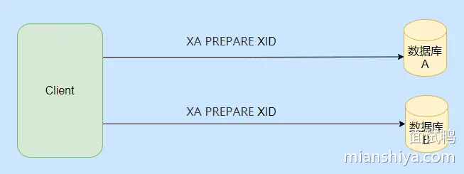

然后根据准备的情况来选择执行提交事务命令还是回滚事务命令。


基本上就是这么个流程，不过 MySQL XA 的性能不高这点是需要注意的。

可以看到虽说 2PC 有缺点，但是还是有基于 2PC 的落地实现的，而 3PC 的引出是为了解决 2PC 的一些缺点，但是它整体下来开销更大，也解决不了网络分区的问题，我也没有找到 3PC 的落地实现。

不过我还是稍微提一下，知晓一下就行，纯理论。

### 3PC

3PC 的引入是为了解决 2PC 同步阻塞和减少数据不一致的情况。

3PC 也就是多了一个阶段，一个询问的阶段，分别是准备、预提交和提交这三个阶段。

准备阶段单纯就是协调者去访问参与者，类似于你还好吗？能接请求不。

预提交其实就是 2PC 的准备阶段，除了事务的提交啥都干了。

提交阶段和 2PC 的提交一致。

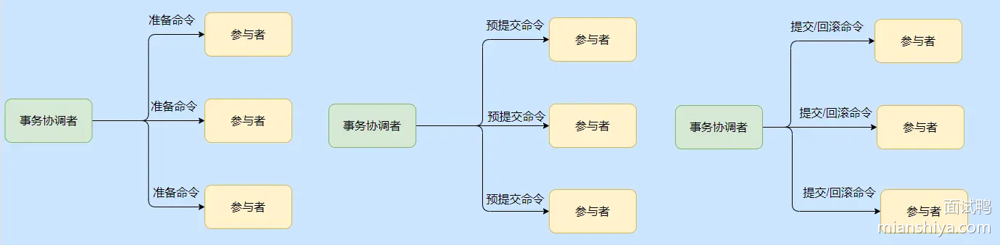

3PC 多了一个阶段其实就是在执行事务之前来确认参与者是否正常，防止个别参与者不正常的情况下，其他参与者都执行了事务，锁定资源。

出发点是好的，但是**绝大部分情况下肯定是正常的，所以每次都多了一个交互阶段就很不划算。**

然后 3PC 在参与者处也引入了超时机制，这样在协调者挂了的情况下，如果已经到了提交阶段了，参与者等半天没收到协调者的情况的话就会自动提交事务。

不过万一协调者发的是回滚命令呢？你看这就出错了，数据不一致了。

还有维基百科上说 2PC 参与者准备阶段之后，如果协调者挂了，参与者是无法得知整体的情况的，因为大局是协调者掌控的，所以参与者相互之间的状况它们不清楚。

而 3PC 经过了第一阶段的确认，即使协调者挂了参与者也知道自己所处预提交阶段是因为已经得到准备阶段所有参与者的认可了。

简单的说就像加了个围栏，使得各参与者的状态得以统一。

### 小结 2PC 和 3PC

从上面已经知晓了 2PC 是一个强一致性的同步阻塞协议，性能已经是比较差的了。

而 3PC 的出发点是为了解决 2PC 的缺点，但是多了一个阶段就多了一次通讯的开销，而且是绝大部分情况下无用的通讯。

虽说引入参与者超时来解决协调者挂了的阻塞问题，但是数据还是会不一致。

可以看到 3PC 的引入并没什么实际突破，而且性能更差了，所以实际只有 2PC 的落地实现。

再提一下，2PC 还是 3PC 都是协议，可以认为是一种指导思想，和真正的落地还是有差别的。


### TCC

不知道大家注意到没，**不管是 2PC 还是 3PC 都是依赖于数据库的事务提交和回滚。**

而有时候一些业务它不仅仅涉及到数据库，可能是发送一条短信，也可能是上传一张图片。

所以说事务的提交和回滚就得提升到业务层面而不是数据库层面了，而 **TCC 就是一种业务层面或者是应用层的两阶段提交**。

TCC 分为指代 Try、Confirm、Cancel ，也就是业务层面需要写对应的三个方法，主要用于跨数据库、跨服务的业务操作的数据一致性问题。

TCC 分为两个阶段，第一阶段是资源检查预留阶段即 Try，第二阶段是提交或回滚，如果是提交的话就是执行真正的业务操作，如果是回滚则是执行预留资源的取消，恢复初始状态。

比如有一个扣款服务，我需要写 Try 方法，用来冻结扣款资金，还需要一个 Confirm 方法来执行真正的扣款，最后还需要提供 Cancel 来进行冻结操作的回滚，对应的一个事务的所有服务都需要提供这三个方法。

可以看到本来就一个方法，现在需要膨胀成三个方法，所以说 TCC 对业务有很大的侵入，像如果没有冻结的那个字段，还需要改表结构。

我们来看下流程。


虽说对业务有侵入，但是 TCC 没有资源的阻塞，每一个方法都是直接提交事务的，如果出错是通过业务层面的 Cancel 来进行补偿，所以也称补偿性事务方法。

这里有人说那要是所有人 Try 都成功了，都执行 Comfirm 了，但是个别 Confirm 失败了怎么办？

这时候只能是不停地重试调失败了的 Confirm 直到成功为止，如果真的不行只能记录下来，到时候人工介入了。

#### TCC 的注意点

这几个点很关键，在实现的时候一定得注意了。


**幂等问题**，因为网络调用无法保证请求一定能到达，所以都会有重调机制，因此对于 Try、Confirm、Cancel 三个方法都需要幂等实现，避免重复执行产生错误。

**空回滚问题**，指的是 Try 方法由于网络问题没收到超时了，此时事务管理器就会发出 Cancel 命令，那么需要支持 Cancel 在未执行 Try 的情况下能正常的 Cancel。

**悬挂问题**，这个问题也是指 Try 方法由于网络阻塞超时触发了事务管理器发出了 Cancel 命令，**但是执行了 Cancel 命令之后 Try 请求到了，你说气不气**。

这都 Cancel 了你来个 Try，对于事务管理器来说这时候事务已经是结束了的，这冻结操作就被“悬挂”了，所以空回滚之后还得记录一下，防止 Try 的再调用。

### TCC 变体

上面我们说的是通用型的 TCC，它需要改造以前的实现，但是有一种情况是无法改造的，就是**你调用的是别的公司的接口**。

#### 没有 Try 的 TCC

比如坐飞机需要换乘，换乘的又是不同的航空公司，比如从 A 飞到 B，再从 B 飞到 C，只有 A - B 和 B - C 都买到票了才有意义。

这时候的选择就没得 Try 了，直接调用航空公司的买票操作，当两个航空公司都买成功了那就直接成功了，如果某个公司买失败了，那就需要调用取消订票接口。

也就是在第一阶段直接就执行完整个业务操作了，所以要重点关注回滚操作，如果回滚失败得有提醒，要人工介入等。

这其实就是 TCC 的思想。


#### 异步 TCC

这 TCC 还能异步？其实也是一种折中，比如某些服务很难改造，并且它又不会影响主业务决策，也就是它不那么重要，不需要及时的执行。

这时候可以引入可靠消息服务，通过消息服务来替代个别服务来进行 Try、Confirm、Cancel 。

Try 的时候只是写入消息，消息还不能被消费，Confirm 就是真正发消息的操作，Cancel 就是取消消息的发送。

这可靠消息服务其实就类似于等下要提到的事务消息，这个方案等于糅合了事务消息和 TCC。

### TCC 小结

可以看到 **TCC 是通过业务代码来实现事务的提交和回滚，对业务的侵入较大，它是业务层面的两阶段提交，**。

它的性能比 2PC 要高，因为不会有资源的阻塞，并且适用范围也大于 2PC，在实现上要注意上面提到的几个注意点。

它是业界比较常用的分布式事务实现方式，而且从变体也可以得知，还是得**看业务变通的，不是说你要用 TCC 一定就得死板的让所有的服务都改造成那三个方法。**

### 本地消息表

本地消息就是利用了本地事务，会在数据库中存放一张本地事务消息表，在进行本地事务操作中加入了本地消息的插入，即**将业务的执行和将消息放入消息表中的操作放在同一个事务中提交**

这样本地事务执行成功的话，消息肯定也插入成功，然后再调用其他服务，如果调用成功就修改这条本地消息的状态。

如果失败也不要紧，会有一个后台线程扫描，发现这些状态的消息，会一直调用相应的服务，一般会设置重试的次数，如果一直不行则特殊记录，待人工介入处理。

可以看到还是很简单的，也是一种最大努力通知思想。


### 事务消息

像 RocketMQ 这类消息中间件是提供事务消息的，简单而言在事务开始时会发个半消息给 broker，此时消息对消费者不可见，如果本地事务提交了，半消息也会被提交，此时消费者可见，也就可以消费了。

broker 如果很长时间没等到半消息提交或者回滚的请求，则会反查生产者，这样就能保证事务的一致性了。


## 635. Redis 为什么这么快？ VIP 中等 后端 Redis

### 回答重点

主要有 3 个方面的原因，分别是存储方式、优秀的线程模型以及 IO 模型、高效的数据结构。

- Redis 将数据存储在内存中，提供快速的读写速度，相比于传统的磁盘数据库，内存访问速度快得多。
- Redis 使用单线程事件驱动模型结合 I/O 多路复用，避免了多线程上下文切换和竞争条件，提高了并发处理效率。
- Redis 提供多种高效的数据结构（如字符串、哈希、列表、集合等），这些结构经过优化，能够快速完成各种操作

### 扩展知识

#### 存储方式

Redis 的存储是**基于内存**的，直接访问内存的速度是远远大于访问磁盘的速度的。


一般情况下，计算机访问一次 SSD 磁盘的时间大概是 50 ~ 150 微秒，如果是传统硬盘的话，需要的时间会更长，可能需要 1 ~ 10 毫秒，而你访问一次内存，其需要的时间大概是 120 纳秒。由此可见，其访问的速度差了快一千倍左右。

除了一些场景，比如说持久化，Redis 很少需要与磁盘进行交互，大多数时候 Redis 的读写是基于内存的，因此其效率较高。

#### 优秀的线程模型以及 IO 模型

Redis 使用单个主线程来执行命令，不需要进行线程切换，避免了上下文切换带来的性能开销，大大提高了 Redis 的运行效率和响应速度。

Redis 采用了 I/O 多路复用技术，实现了单个线程同时处理多个客户端连接的能力，从而提高 Redis 的并发能力。

不过 Redis 并不是一直都是单线程的，自 4.0 开始，Redis 就引入了 Unlink 这类命令，用于异步执行删除等操作，还有在 6.0 之后，Redis 为了进一步提升 I/O 的性能，引入了多线程的机制，利用多线程的机制并发处理网络请求，从而减少 Redis 由于网络 I/O 等待造成的影响。


#### 高效的数据结构

Redis 本身提供了丰富的数据结构，比如字符串、哈希、Zset 等，这些数据结构大多操作的时间复杂度都为 O(1)。


#### 五种 I/O 模型

- [1460. 说说你知道的几种 I/O 模型](https://www.mianshiya.com/question/1804476796656885762)

#### Select、Poll、Epoll

- [722. Select、Poll、Epoll 之间有什么区别？](https://www.mianshiya.com/question/1780933295857496065)

#### Redis 中常见的数据类型（数据结构）

- [637. Redis 中常见的数据类型有哪些？](https://www.mianshiya.com/bank/1791375592078610434/question/1780933295593254915)
- [5206. Redis 源码中有哪些巧妙的设计，举几个典型的例子？](https://www.mianshiya.com/question/1823990291696906241)

## 663.如何使用 Redis 快速实现布隆过滤器？

### 回答重点

> 布隆过滤器是一种高效的概率数据结构，常用于检测一个元素是否在一个集合中，可以有效减少数据库的查询次数，解决缓存穿透等问题。

可以通过使用 **位图（Bitmap）** 或使用 Redis 模块 **RedisBloom**。

1）**使用位图实现布隆过滤器**：

- 使用 Redis 的位图结构 `SETBIT` 和 `GETBIT` 操作来实现布隆过滤器。位图本质上是一个比特数组，用于标识元素是否存在。
- 对于给定的数据，通过多个 **哈希函数** 计算位置索引，将位图中的相应位置设置为 1，表示该元素可能存在。

2）**使用 RedisBloom 模块**：

- Redis 提供了一个官方模块 **RedisBloom**，封装了哈希函数、位图大小等操作，可以直接用于创建和管理布隆过滤器。
- 使用 **BF.ADD** 来向布隆过滤器添加元素，使用 **BF.EXISTS** 来检查某个元素是否可能存在。

### 扩展知识

#### 布隆过滤器原理

布隆过滤器是由一个 **位数组** 和 **k 个独立的哈希函数** 组成。

添加元素时，通过 k 个哈希函数将元素映射到位数组的 k 个位置上，将这些位置设置为 1。

检查元素是否存在时，同样计算 k 个位置，如果所有位置都是 1，则说明元素可能存在；只要有一个位置为 0，就可以确定元素一定不存在。

例如某个 key 通过 hash-1 和 hash-2 两个哈希函数，定位到数组中的值都为 1，则说明它存在。


如果布隆过滤器判断一个元素不存在集合中，那么这个元素一定不在集合中，如果判断元素存在集合中则不一定是真的，因为哈希可能会存在冲突。因此布隆过滤器**有误判的概率**。


而且它不好删除元素，只能新增，如果想要删除，只能重建。

#### 布隆过滤器优缺点

**1）优点**

- 高效性：插入和查询操作都非常高效，时间复杂度为 O(k)，k 为哈希函数的数量。
- 节省空间：相比于直接存储所有元素，布隆过滤器大幅度减少了内存使用。
- 可扩展性：可以根据需要调整位数组的大小和哈希函数的数量来平衡时间和空间效率。

**2）缺点**

- 误判率：可能会误认为不存在的元素在集合中，但不会漏报（不存在的元素不会被认为存在）。
- 不可删除：一旦插入元素，不能删除，因为无法确定哪些哈希值是由哪个元素设置的。
- 需要多个哈希函数：选择合适的哈希函数并保证它们独立性并不容易。

#### 使用 Redis 位图（bitmap）实现布隆过滤器

**bitmap 基本操作：**

- SETBIT key offset value：将 key 的值在 offset 位置上的位设置为 value（0 或 1）。
- GETBIT key offset：获取 key 的值在 offset 位置上的位的值（0 或 1）。
- BITCOUNT key [start end]：计算字符串中设置为 1 的位的数量。
- BITOP operation destkey key [key ...]：对一个或多个 key 进行位运算，并将结果存储在 destkey 中。支持的操作包括 AND、OR、XOR 和 NOT。

**实现布隆过滤器流程：**

- 位图使用单个位来表示某个位置的状态，通过 Redis 的 **`SETBIT key offset value`** 操作可以设置位图中某个偏移位置的值。
- 假设有 k 个哈希函数 `H1, H2, ..., Hk`，对于每个新加入的元素 `x`，通过这些哈希函数计算位置，将相应位置的比特位设置为 1。
- 查询元素是否存在时，计算相同的 k 个位置并用 **`GETBIT key offset`** 来判断这些位置是否都是 1。

以下 Java 中为利用 bitmap 实现布隆过滤器的例子，供大家参考：

```java
import redis.clients.jedis.Jedis;
import java.nio.charset.StandardCharsets;
import java.util.BitSet;
import java.util.List;
import java.util.ArrayList;

public class RedisBloomFilter {

    private static final String BLOOM_FILTER_KEY = "bloom_filter";
    private static final int BITMAP_SIZE = 1000000; // 位图大小
    private static final int[] HASH_SEEDS = {3, 5, 7, 11, 13, 17}; // 多个哈希函数的种子

    private Jedis jedis;
    private List<SimpleHash> hashFunctions;

    public RedisBloomFilter() {
        this.jedis = new Jedis("localhost", 6379);
        this.hashFunctions = new ArrayList<>();
        for (int seed : HASH_SEEDS) {
            hashFunctions.add(new SimpleHash(BITMAP_SIZE, seed));
        }
    }

    // 添加元素到布隆过滤器
    public void add(String value) {
        for (SimpleHash hashFunction : hashFunctions) {
            jedis.setbit(BLOOM_FILTER_KEY, hashFunction.hash(value), true);
        }
    }

    // 检查元素是否可能存在于布隆过滤器中
    public boolean mightContain(String value) {
        for (SimpleHash hashFunction : hashFunctions) {
            if (!jedis.getbit(BLOOM_FILTER_KEY, hashFunction.hash(value))) {
                return false;
            }
        }
        return true;
    }

    // 关闭连接
    public void close() {
        jedis.close();
    }

    // 简单哈希函数
    public static class SimpleHash {
        private int cap;
        private int seed;

        public SimpleHash(int cap, int seed) {
            this.cap = cap;
            this.seed = seed;
        }

        public int hash(String value) {
            int result = 0;
            byte[] bytes = value.getBytes(StandardCharsets.UTF_8);
            for (byte b : bytes) {
                result = seed * result + b;
            }
            return (cap - 1) & result;
        }
    }

    public static void main(String[] args) {
        RedisBloomFilter bloomFilter = new RedisBloomFilter();

        // 添加元素到布隆过滤器
        bloomFilter.add("user1");
        bloomFilter.add("user2");
        bloomFilter.add("user3");

        // 检查元素是否可能存在
        System.out.println("Does user1 exist? " + bloomFilter.mightContain("user1")); // 输出: true
        System.out.println("Does user4 exist? " + bloomFilter.mightContain("user4")); // 输出: false

        // 关闭连接
        bloomFilter.close();
    }
}

```

在 Java 中的 redisson 提供了 bloomFilter 类，可直接使用这个类提供的布隆过滤器实现。

#### **RedisBloom 模块的使用**

RedisBloom 是 Redis 官方提供的插件，简化了布隆过滤器的实现，提供了更好的性能和更少的误判率控制。

**常用命令：**

- **`BF.RESERVE key error_rate capacity`**：创建一个布隆过滤器，指定误判率和容量。

- **`BF.ADD key item`**：向布隆过滤器中添加一个元素。

- `BF.EXISTS key item`

  ：检查一个元素是否可能存在。

  - RedisBloom 可以自动调整底层数据结构大小以适应不断增加的数据量，用户可以指定误判率。

**RedisBloom实现布隆过滤器的步骤示例**：

1）**创建布隆过滤器**（基于 RedisBloom 模块）：

```text
BF.RESERVE myBloomFilter 0.01 1000000
```

上述命令创建了一个误判率为 1% 且容量为 100 万的布隆过滤器。

2）**添加元素**：

```text
BF.ADD myBloomFilter "item1"
```

3）**检查元素是否存在**：

BF.EXISTS myBloomFilter "item1"    # 返回 1（可能存在）
BF.EXISTS myBloomFilter "item2"    # 返回 0（一定不存在）

#### 布隆过滤器适用场景

布隆过滤器一般都在海量数据判断场景，且可以允许误判。

**1）爬虫：**

对已经爬取过的海量 URL 去重。

**2）黑名单：**

例如反垃圾邮件，用于判断一个邮件地址是否在黑名单中，提高垃圾邮件过滤的效率（可能会误杀）。

**3）分布式系统：**

用于判断数据是否在某个节点上，减少网络请求，提高系统性能。例如，Hadoop 和 Cassandra 都使用布隆过滤器来优化数据分布和查找。

**4）推荐系统：**

用于判断用户是否已经看过某个推荐内容，避免重复推荐。

## 453.为什么 Java 中 HashMap 的默认负载因子是 0.75？ 

### 回答重点

`HashMap` 的默认负载因子为 0.75 是为了在**时间复杂度**和**空间复杂度**之间取得一个合理的平衡。负载因子为 0.75 时，避免过多扩容的同时，也保证了不会出现过多的哈希冲突，确保查找和插入操作的效率，维持良好的性能表现。

### 扩展知识

#### 什么是负载因子

负载因子是 `HashMap` 中的一个参数，用来衡量 `HashMap` 的满载程度，公式为： `负载因子 = 实际存储的元素数量 / 容量`。

当 `HashMap` 中存储的元素数量超过 `容量 × 负载因子` 时，`HashMap` 会进行扩容操作，增加容量以维持性能。

#### 为什么不选择 1.0 作为默认负载因子

尽管负载因子 1.0 可以减少扩容次数，提高内存利用率，但它增加了哈希冲突的可能性。冲突过多会导致桶内链表或红黑树变长，降低查找、插入和删除的效率。因此，负载因子 1.0 会使得时间复杂度劣化为 O(n)，不利于 `HashMap` 的高效运行。

#### HashMap 源码注释解读

其实在 HashMap 的源码中有这么一段注释：

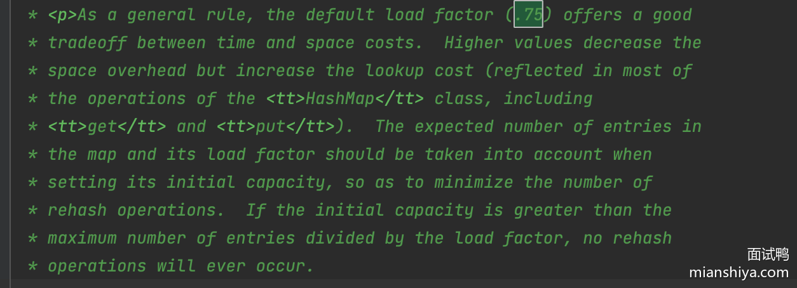

简单理解下就是设置 0.75 是因为空间和时间上的平衡。

较低的负载因子（例如 0.5）会导致 HashMap 需要频繁扩容，空间利用率就低。不过因为冲突少，查找效率就高，但是因为扩容频繁会增加 rehashing 的开销。

较高的负载因子（例如 1.0）会减少扩容次数，空间利用率高了，但会增加哈希冲突的概率，从而降低查找效率。

经过大量实践，0.75 被认为是大多数场景下比较合适的值，能够在时间和空间之间取得良好的平衡。

所以设置了 0.75。

#### **不同场景下的负载因子调整**

在某些特定场景下，可以根据业务需求调整 `HashMap` 的负载因子。例如：

- **高并发读取场景**：可以降低负载因子（如 0.5），以减少哈希冲突，提高读取性能。
- **内存受限场景**：可以提高负载因子（如 0.85 或更高），以减少扩容次数和内存消耗，但可能会降低写入和查询的性能。

## 621. 如何处理 MySQL 的主从同步延迟？

### 回答重点

> 首先需要明确一个点**延迟是必然存在的**，无论怎么优化都无法避免延迟的存在，只能减少延迟的时间。

常见解决方式有以下几种：

- **二次查询**。如果从库查不到数据，则再去主库查一遍，由 API 封装这个逻辑即可，算是一个兜底策略，比较简单。不过等于读的压力又转移到主库身上了，如果有不法分子故意查询必定查不到的查询，这就对主库产生冲击了。
- **强制将写之后立马读的操作转移到主库上**。这种属于代码写死了，比如一些写入之后立马查询的操作，就绑定在一起，写死都走主库。不推荐，比较死板。
- **关键业务读写都走主库**，非关键还是读写分离。比如上面我举例的用户注册这种，可以读写主库，这样就不会有登陆报该用户不存在的问题，这种访问量频次应该也不会很多，所以看业务适当调整此类接口。
- **使用缓存**，主库写入后同步到缓存中，这样查询时可以先查询缓存，避免了延迟的问题，不过又引入了缓存数据一致性的问题。

除此之外，也可以提一提配置问题，例如主库的配置高，从库的配置太低了，可以提升从库的配置等。如果面试官对 MySQL 比较熟，可能会追问一些偏 DBA 侧的问题，例如并行复制等。

- [MySQL 并行复制](https://www.mianshiya.com/question/1780933295538728962#heading-6)

### 扩展知识

#### MySQL 主从延迟的常见原因及优化方案

| 原因               | 优化方案                                                     |
| ------------------ | ------------------------------------------------------------ |
| **从库单线程复制** | 启用多线程复制：[MySQL 并行复制](https://www.mianshiya.com/question/1780933295538728962#heading-6)。 |
| **网络延迟**       | 优化网络连接，缩短主从之间的物理距离。                       |
| **从库性能不足**   | 增加硬件资源。                                               |
| **长事务**         | 优化应用程序，减少主库写入压力，避免长事务。[MySQL 中长事务可能会导致哪些问题？](https://www.mianshiya.com/bank/1791003439968264194/question/1780933295480008706#heading-0) |
| **从库太多**       | 从库过多主库同步压力大，导致延迟，合理的评估主从数量         |
| **从库负载太高**   | 增加从库实例，分散查询压力，避免慢查询。                     |

再强调一下主从**延迟是必然存在的**，无论怎么优化都无法避免延迟的存在，只能减少延迟的时间。例如即使启用多线程复制就一定可以避免延迟吗？所以业务上的解决方案还是以回答重点内的几个解决方式为准。

## 1619. Netty 如何解决 JDK NIO 中的空轮询 Bug？

### 回答重点

Netty 实际上并没有解决 JDK 原生 NIO 中空轮询 bug，而是通过其他途径绕开了这个错误。

具体操作如下：

1）统计空轮询次数：Netty 通过 selectCnt 计数器来统计连续空轮询的次数。每次执行 Selector.select() 方法后，如果发现没有 I/O 事件，selectCnt 就会递增。

2）设置阈值：Netty 定义了一个阈值 SELECTOR_AUTO_REBUILD_THRESHOLD，默认值为 512。当空轮询次数达到这个阈值时，Netty 会触发重建 Selector 的操作。

3）重建 Selector：当达到空轮询的阈值时，Netty 会创建一个新的 Selector，并将所有注册的 Channel 从旧的 Selector 转移到新的 Selector 上。这一过程涉及到取消旧 Selector 上的注册，并在新 Selector 上重新注册 Channel。

4）关闭旧的 Selector：在成功重建 Selector 并将 Channel 重新注册后，Netty 会关闭旧的 Selector，从而避免继续在旧的 Selector 上发生空轮询。

总结来看，就是通过 selectCnt 统计没有 I/O 事件的次数来判断当前是否发生了空轮询，如果发生了就重建一个 Selector 替换之前出问题的 Selector，所以说 Netty 实际上没解决空轮询的 bug，只是绕开了这个问题。

### 扩展知识

#### [官方 bug 描述](https://bugs.java.com/bugdatabase/view_bug.do?bug_id=6670302)

> The NIO selector wakes up infinitely in this situation..(以下情形可以复现)

1. server waits for connection
2. client connects and write message
3. server accepts and register OP_READ
4. server reads message and remove OP_READ from interest op set
5. client close the connection
6. server write message (without any reading.. surely OP_READ is not set)
7. server's select wakes up infinitely with return value 0

**空轮询 bug 原因：**

当连接的 Socket 被突然中断（如对端异常关闭）时，epoll 会将该 Socket 的事件标记为 EPOLLHUP 或 EPOLLERR，导致 Selector 被唤醒。 然而，SelectionKey 并未定义处理这些异常事件的类型，导致 Selector 被唤醒后，无法处理这些异常事件，从而进入空轮询状态，导致 CPU 占用率过高。

#### Netty 解决空轮询源码解析

```java
private void select(boolean oldWakenUp) throws IOException {
    Selector selector = this.selector;
    try {
        // selectCnt 记录轮询次数，空轮询次数超过 SELECTOR_AUTO_REBUILD_THRESHOLD（默认512）后，重建 selector
        int selectCnt = 0;
        
        // 记录当前时间
        long currentTimeNanos = System.nanoTime();
        
        // selectDeadLineNanos = 当前时间 + 距离最早的定时任务开始执行的时间
        // 计算出 select 操作必须在哪个时间点之前被 wakeUp（不然一直被阻塞的话，定时任务就没法被执行）
        long selectDeadLineNanos = currentTimeNanos + delayNanos(currentTimeNanos);

        // 归一化的定时任务截止时间（与系统启动时间的偏移量）
        long normalizedDeadlineNanos = selectDeadLineNanos - initialNanoTime();
        if (nextWakeupTime != normalizedDeadlineNanos) {
            nextWakeupTime = normalizedDeadlineNanos;
        }

        for (;;) {
            // 计算出当前 select 操作能阻塞的最久时间
            long timeoutMillis = (selectDeadLineNanos - currentTimeNanos + 500000L) / 1000000L;
            
            // 超过最长等待时间：有定时任务需要执行
            if (timeoutMillis <= 0) {
                if (selectCnt == 0) {
                    // 非阻塞操作，没有数据返回则返回 0
                    selector.selectNow();
                    selectCnt = 1;
                }
                break;
            }

            // 如果任务队列中有任务且 wakenUp 为 true，说明任务没机会调用 Selector#wakeup。
            // 因此我们需要检查任务队列，防止任务被延迟执行。
            if (hasTasks() && wakenUp.compareAndSet(false, true)) {
                selector.selectNow();  // 强制执行 selectNow
                selectCnt = 1;
                break;
            }

            // 进行 select 阻塞操作，直到有事件触发
            int selectedKeys = selector.select(timeoutMillis);
            selectCnt++; // 记录空轮询次数

            // 如果选中事件不为 0，或者发生了唤醒，或者有任务需要执行，或者有定时任务触发
            // 都可以跳出循环
            if (selectedKeys != 0 || oldWakenUp || wakenUp.get() || hasTasks() || hasScheduledTasks()) {
                break;
            }

            // 如果 select 没有触发超时返回，并且确实是监听到了新事件而不是空轮询，
            // 那么就一定会在上面的 if 中返回了。所以往下走的话，有 2 个情况：
            // 1. select 超时
            // 2. 发生了空轮询
            if (Thread.interrupted()) {
                // 如果线程被中断，则重置选中的键并跳出循环，避免进入忙等状态。
                if (logger.isDebugEnabled()) {
                    logger.debug("Selector.select() prematurely returned due to thread interruption. " +
                            "Use NioEventLoop.shutdownGracefully() to shut down the NioEventLoop.");
                }
                selectCnt = 1;
                break;
            }

            long time = System.nanoTime();
            // 判断是否超时
            if (time - TimeUnit.MILLISECONDS.toNanos(timeoutMillis) >= currentTimeNanos) {
                // 如果超时，则重置轮询次数
                selectCnt = 1;
            } else if (SELECTOR_AUTO_REBUILD_THRESHOLD > 0 &&
                    selectCnt >= SELECTOR_AUTO_REBUILD_THRESHOLD) {
                // 如果连续空轮询次数超过了 SELECTOR_AUTO_REBUILD_THRESHOLD（默认 512），
                // 需要重建 selector
                selector = selectRebuildSelector(selectCnt);
                selectCnt = 1;
                break;
            }

            currentTimeNanos = time;
        }

        // 如果空轮询次数过多，输出调试日志
        if (selectCnt > MIN_PREMATURE_SELECTOR_RETURNS) {
            if (logger.isDebugEnabled()) {
                logger.debug("Selector.select() prematurely returned {} times in a row for Selector {}.",
                        selectCnt - 1, selector);
            }
        }
    } catch (CancelledKeyException e) {
        // 捕获 CancelledKeyException 异常并记录日志
        if (logger.isDebugEnabled()) {
            logger.debug(CancelledKeyException.class.getSimpleName() + " raised by a Selector {} - JDK bug?",
                    selector, e);
        }
    }
}
```


## 451. Java 中 HashMap 的扩容机制是怎样的？

### 回答重点

`HashMap` 中的扩容是基于**负载因子（load factor）** 来决定的。默认情况下，`HashMap` 的负载因子为 0.75，这意味着当 `HashMap` 的已存储元素数量超过当前容量的 75% 时，就会触发扩容操作。

例如，初始容量为 16，负载因子为 0.75，则扩容阈值为 `16 × 0.75 = 12`。当存入第 13 个元素时，`HashMap` 就会触发扩容。

当触发扩容时，`HashMap` 的容量会扩大为当前容量的**两倍**。例如，容量从 16 增加到 32，从 32 增加到 64 等。

扩容时，`HashMap` 需要重新计算所有元素的哈希值，并将它们重新分配到新的哈希桶中，这个过程称为**rehashing**。每个元素的存储位置会根据新容量的大小重新计算哈希值，并移动到新的数组中。

### 扩展知识

#### rehashing 细节

按照我们的思维，每一个元素应该是重新 hash 一个一个搬迁过去。

在 1.7 的时候就是这样实现的，然而 1.8 在这里做了优化，关键点就在于数组的长度是 2 的次方，且扩容为 2 倍。

因为数组的长度是 2 的 n 次方，所以假设以前的数组长度（16）二进制表示是 010000，那么新数组的长度（32）二进制表示是 100000，这个应该很好理解吧？

它们之间的差别就在于高位多了一个 1，而我们通过 key 的 hash 值定位其在数组位置所采用的方法是 `(数组长度-1) & hash`。我们还是拿 16 和 32 长度来举例：

```
16-1=15，二进制为 001111
32-1=31，二进制为 011111
```

所以重点就在 key 的 hash 值的从右往左数第五位是否是 1，如果是 1 说明需要搬迁到新位置，且新位置的下标就是原下标+16（原数组大小），如果是 0 说明吃不到新数组长度的高位，那就还是在原位置，不需要迁移。

所以，我们刚好拿老数组的长度（010000）来判断高位是否是 1，这里只有两种情况，要么是 1 要么是 0 。


从上面的源码可以看到，链表的数据是一次性计算完，然后一堆搬运的，因为扩容时候，节点的下标变化只会是原位置，或者原位置+老数组长度，不会有第三种选择。

上面的位操作，包括为什么是原下标+老数组长度等，如果你不理解的话，可以举几个数带进去算一算，就能理解了。

**总结一下**：

- 当扩容发生时，`HashMap` 并不是简单地将元素复制到新数组中。每个元素的哈希值会根据新的数组容量重新计算，因此元素的存储位置会发生变化
- Java 8 之后的扩容不需要每个节点重新 hash 算下标，因为元素的新位置只与高位有关，通过和老数组长度的 & 计算是否为 0 就能判断新下标的位置，因此链表中的元素可能只需要部分移动。这一优化减少了扩容时的计算开销。

#### 扩容的考虑

每次扩容都需要遍历当前所有的元素，重新计算哈希值并移动它们到新的位置，因此扩容是一个比较耗时的操作。如果频繁扩容，整体性能会明显下降。

**优化策略**：如果能预估到 `HashMap` 中大概会存储多少数据，可以在创建 `HashMap` 时就指定一个较大的初始容量，以减少扩容次数。例如，对于存储 100 万个元素的 `HashMap`，可以直接设置一个 1024 × 1024 的初始容量，避免多次扩容。

#### 场景题

- [752. 假设有一个 1G 大的 HashMap，此时用户请求过来刚好触发它的扩容，会怎样？怎么优化？](https://www.mianshiya.com/bank/1795650132375805954/question/1797473188553293825)

## 636.为什么 Redis 设计为单线程？6.0 版本为何引入多线程？

### 回答重点

**单线程设计原因**：

1. Redis 的操作是基于内存的，其大多数操作的性能瓶颈主要不是 CPU 导致的
2. 使用单线程模型，代码简便的同时也减少了线程上下文切换带来的性能开销
3. Redis 在单线程的情况下，使用 I/O 多路复用模型就可以提高 Redis 的 I/O 利用率了

**6.0 版本引入多线程的原因**：

1. 随着数据规模的增长、请求量的增多，Redis 的执行瓶颈主要在于⽹络 I/O。引入多线程处理可以提高网络 I/O处理速度。

### 扩展知识

我们所说的 Redis 单线程，主要指的是 Redis 网络 I/O 和键值对读写这些操作是由一个线程完成的。（持久化、集群等机制其实是有后台线程执行的）

不过 Redis 并不是一直都单线程的，在 4.0 之后就开始引入了多线程指令，6.0 之后便正式引入了多线程的机制，不过 **这里的多线程其只是针对网络请求过程使用多线程，其对于数据读写命令的处理依旧是单线程的**。

#### 为什么 Redis 前期不使用多线程的方式，等到 6.0 却又引入呢？

主要是因为我们对 Redis 的性能有了更高的要求，因为随着业务愈加复杂，公司需要的 QPS 就越高了，为了提升 QPS ，最直接的做法就是搭建 Redis 的集群，即提高 Redis 的机器数，但是这种做法的资源消耗是巨大的。

而 Redis 单线程执行命令的性能瓶颈在网络 I/O ，虽然它采用了多路复用技术，但 **I/O 多路复用模型本质还是同步I/O**。


从上面这个图中我们可以看到，I/O 多路复用在处理网络请求的时候，其调用 select（或是 epoll 等）后，如果来数据了，那么将数据从内核拷贝到用户空间这一步是同步的（关于 I/O 场景，阻塞、同步等名词意义请看扩展知识），即用户线程需要等待数据拷贝完成（在 redis 场景就是无法处理命令了），**如果并发量很高的话，这个过程可能会成为瓶颈**。

综上所示，我们可以发现，多路复用+单线程的设计并不能很好地解决网络 I/O 瓶颈的问题，这个时候就可以考虑利用 CPU 的多核优势，即利用多线程处理网络请求的方式来提高效率，然后对于读写命令， Redis 依旧采用单线程命令。

#### **Redis 引入多线程之后，有没有带来什么线程安全问题呢**？

没有，因为 Redis 6.0 只有针对网络请求模块采用的是多线程，对于读写命令部分还是采用单线程，所以所谓的线程安全问题就不存在了。

Redis 6.0 的多线程默认是禁⽤的，只使⽤主线程，因为大部分公司并发量实际上还是用不上这个。

如果要开启需要配置 `io-threads-do-reads`参数为 `yes`。

#### I/O 模型

[五种 I/O 模型](https://www.mianshiya.com/bank/1804354610222800897/question/1804476796656885762)

[同步、异步、阻塞、非阻塞的I/O的区别？](https://www.mianshiya.com/question/1780933295844913153)

## 684.为什么 TCP 挥手需要有 TIME_WAIT 状态? 

### 回答重点

主要原因有以下两点：

1）**确保最后的 ACK 被成功接收**：

- 在 TCP 四次挥手过程中，主动关闭连接的一方在发送最后一个 ACK 确认包后进入 **TIME_WAIT** 状态。
- 如果这个 ACK 丢失了，另一方（被动关闭连接的一方）没有收到确认包，会重发 FIN 报文。主动关闭的一方需要在 **TIME_WAIT** 状态下保持一段时间，以便能够重发 ACK，确保连接能被正确地关闭。

2）**防止旧的重复分段干扰新连接**：

- TCP 连接在关闭后，可能会有一些延迟的或者已经失效的报文还在网络中传输。如果立即重新使用相同的 IP 地址和端口建立新的连接，可能会受到这些旧报文的干扰。
- **TIME_WAIT** 状态可以确保在旧连接的所有报文都超时失效后，才允许新的连接使用相同的 IP 地址和端口，从而避免数据混乱。


#### 为什么 TIME_WAIT 等待的是 2MSL？

MSL（Maximum Segment Lifetime） 是 TCP 报文段在网络中可以存活的最大时间。RFC 793 定义的 MSL 时间是 2 分钟，Linux 实际实现是 30s，那么 2MSL 是一分钟。

那为什么设置了 2MSL ?

来看个例子，假设被动关闭方（上图的服务端）没有客户端的最后一个 ACK ，此时会触发超时重发 FIN 。

当客户端收到 FIN 后，会重发 ACK 给被动关闭方，这一来一回就需要 2 个 MSL 的时间。

### 扩展知识

#### 等待 2MSL 会产生什么问题？

如果**服务器主动关闭**大量的连接，那么会出现大量的资源占用，需要等到 2MSL 才会释放资源。

如果是**客户端主动关闭**大量的连接，那么在 2MSL 时间内那些端口都是被占用的，端口只有 65535 个，如果端口耗尽了就无法发起新的连接了。

#### 如何解决 2MSL 产生的问题？

**服务器主动关闭**大量的连接，会出现大量的资源占用的情况。

#### tcp_tw_recycle + tcp_timestamps

此时的解决办法是**快速回收**，即不等 2MSL 就回收。

Linux 的参数是 `tcp_tw_recycle` 用于加速 `TIME_WAIT` 状态的回收（前提需要打开 `tcp_timestamps` ，不然无法记录时间，不过默认是打开的）。

其实从上面我们已经得知为什么需要等 2MSL，所以如果等待时间过短就会出现上述所说的那些问题。

所以不建议开启 `tcp_tw_recycle`。并且由于该选项可能导致 NAT 环境中的客户端连接问题（如数据包错乱和连接失败），它在 Linux 4.12 之后被完全移除。

分享一个 `tcp_tw_recycle` + NAT 案例：


这个案例的现象就是请求端请求服务器的静态资源偶尔会出现 20-60 秒左右才会有响应的情况，从抓包看请求端连续三个 SYN 都没有回应。

之所以产生这个问题就是由于 NAT 环境开启了 `tcp_tw_recycle`。

比如你在学校，对外可能就一个公网 IP，然后开启了 tcp_tw_recycle（tcp_timestamps 也是打开的情况下），在 60 秒内对于同源 IP 的连接请求中 timestamp 必须是递增的，不然认为其是过期的数据包就会丢弃。

但学校这么多机器，你无法保证时间戳是一致的，因此就会出问题。

所以 `tcp_tw_recycle` 不推荐使用。

#### tcp_tw_reuse + tcp_timestamps

`tcp_tw_reuse` 也是一个 Linux 内核参数，用于控制是否允许**重用**处于 `TIME_WAIT` 状态的 TCP 连接。（开启这个参数也需要开启 tcp_timestamps 配合使用）

这里有个重点，**tcp_tw_reuse 是用在连接发起方的（客户端），而我们的服务端基本上是连接被动接收方**。

因为 `tcp_tw_reuse` 是发在起新连接的时候，可以复用超过 1s （所以需要 tcp_timestamps）的处于 TIME_WAIT 状态的连接，所以它压根没有减少我们服务端的压力。

**它重用的是发起方处于 TIME_WAIT 的连接**。

#### SO_REUSEADDR

`SO_REUSEADDR` 是一个套接字选项，用于允许绑定一个在 `TIME_WAIT` 状态下的端口。

启用后，应用程序可以在 `TIME_WAIT` 状态下的端口上绑定新的套接字，而不必等待 `TIME_WAIT` 状态结束。 这在服务器重启时特别有用，允许快速重新绑定到相同的端口，不会出现 `Address already in use` 的报错。

需要注意，虽然可以重用地址，**但如果有旧的连接数据包还在网络中，它们可能会被新的连接误接收，造成数据混淆**。

有些人会把这个参数和 tcp_tw_reuse 混为一谈，实际上 `tcp_tw_reuse` 是内核选项而 `SO_REUSEADDR` 是用户态选项，且功效上也不一样。

------

所以没有一个可以很好解决服务器主动关闭大量的连接问题的方案，因此我给出的建议是**服务端不要主动关闭，把主动关闭方放到客户端**。毕竟咱们服务器是一对很多很多服务，我们的资源比较宝贵。

#### 小结上面几个参数

- **`tcp_tw_reuse`**：允许重用 `TIME_WAIT` 状态的连接，适用于客户端以节省端口资源。
- **`SO_REUSEADDR`**：允许在 `TIME_WAIT` 状态下绑定相同端口，适合服务器重启后快速恢复服务。
- **`tcp_tw_recycle`**：加速 `TIME_WAIT` 状态的回收，但由于稳定性问题已被弃用，不推荐使用。
- **`tcp_timestamps`**：通过在 TCP 报文中添加时间戳来改善网络性能和可靠性，适合大多数网络场景。


## 742. Spring Boot 的核心特性有哪些？

### 回答重点

1）开箱即用，内嵌服务器。这个特点是程序员最直观的感受，相较于原本的开发，spring boot 可以省略以前繁琐的 tomcat 配置，快速创建一个 web 容器。

2）自动化配置。在 spring boot 中我们可以按照自动配置的规定（将自动加载的 bean 写在自己jar 包当中的 **meta/info/spring.factories** 文件中或者通过的注解 **@Import** 导入时加载指定的类）这样我们的配置类就会被 Springboot 自动加载到容器当中。 **同时还支持通过改写yaml 和 propreties来覆盖默认配置**

3）支持 jar 包运行。传统部署web 容器都是打成 war 包放在 tomcat 中。spring boot 可以打成 jar 包只要有 java 运行环境即可运行 web 容器。

4）完整的生态支持。spring boot 可以随意整合 spring 全家桶的支持。像 Actuator 健康检查模块，Spring Data JPA 数据库模块，Spring Test 测试模块。这些都可以很优雅的集成在 springboot 当中。

5）监控、健康检查支持。spring boot Actuator 支持开发者监控应用的运行状态，包括性能指标、应用信息和日志级别控制等。

### 扩展知识

面试时可以跟面试官说说自己是如何实现一个 spring boot starter 来帮助项目简化某些通用的业务的。

比如现在项目中有很多列表接口需要导出 excel。我利用自动化配置写了一个 excel 导出模块。

实现思路如下：

1)写一个 @ExcelExport 注解，放在列表接口上。利用切面来切列表的返回结果，拿到列表结果后写入 excel 当中。

2)然后写一个配置类放在 meta/info/spring.factories 文件下。这样让 spring boot 自动装配我们这个写 excel 文件的处理类。

3)在整个项目中有需要列表导出 excel 的地方，仅需把注解写在列表接口上即可。

通过这个例子让面试官相信你有实际使用自动化装配的经验。

## 452.为什么 HashMap 在 Java 中扩容时采用 2 的 n 次方倍？ 

### 回答重点

`HashMap` 采用 2 的 n 次方倍作为容量，主要是为了提高哈希值的分布均匀性和哈希计算的效率。

`HashMap` 通过 `(n - 1) & hash` 来计算元素存储的索引位置，这种位运算只有在数组容量是 2 的 n 次方时才能确保索引均匀分布。**位运算的效率高于取模运算**（`hash % n`），提高了哈希计算的速度。

且当 `HashMap` 扩容时，通过容量为 2 的 n 次方，扩容时只需通过简单的位运算判断是否需要迁移，这减少了重新计算哈希值的开销，提升了 rehash 的效率。

### 扩展知识

#### 哈希分布均匀性

如果数组容量为 2 的 n 次方，那么 `n - 1` 后低位都是 1 ，此时进行 & （两个位都为 1 时，结果才为 1）运算可以确保哈希码的最低几位均匀分布。

比如 64 二进制表示为 0100 0000，64 - 1 = 0011 1111。

此时 0011 1111 与哈希码进行 & 运算，低位能均匀的反应出哈希码的随机性。

假设来个 0100 0000 与哈希码进行 & 运算，那么低位得到的值就都是 0 了，随机性很差，都是冲突。

#### 位运算与取模

正常情况下，如果基于哈希码来计算数组下标，我们想到的都是 %（取余）计算。例如数组长度为 5 ，那么哈希码 % 5 得到的值就是对应的数组下标。

但相比于位运算而言，效率比较低，所以推荐用位运算，而要满足 `i = (n - 1) & hash` 这个公式，n 的大小就必须是 2 的 n 次幂。即：当 b 等于 2 的 n 次幂时，`a % b` 操作等于 `a & ( b - 1 )`

## 666.你在项目中使用的 Redis 客户端是什么？ 

### 回答重点

常见在项目中使用的客户端有以下三种：

- Jedis 适用于简单的同步操作和单线程环境。
- Lettuce 适用于高并发、高性能和多线程环境，尤其是需要异步和响应式编程的场景。
- Redisson 适用于复杂的分布式系统，提供丰富的分布式对象和服务，简化开发。

#### Jedis

Jedis 是一款比较经典的 Java 客户端了，里面提供了比较全面的 Redis 命令，也是使用最为广泛的 Redis 客户端。

Jedis 是一个用 Java 实现的 Redis 客户端库，它具有以下优点：

- 简单易用：提供了直观的 API，使得开发者能够方便地与 Redis 进行交互。
- 使用广泛：在 Java 社区中被广泛采用，有丰富的文档和示例可供参考。
- 性能良好：在大多数情况下能够提供高效的 Redis 操作。
- 功能丰富：支持常见的 Redis 操作，如字符串、列表、哈希、集合等数据结构的操作。

然而，Jedis 也存在一些缺点：

- 线程安全问题：线程不安全，每个线程需独立使用 Jedis 实例。
- 不支持自动重连：在网络异常或 Redis 服务器重启时，需要手动处理重连。
- 阻塞操作：同步的 API，因此高并发下可能会发生阻塞

#### Lettuce

Lettuce 其相对于 Jedis，其最突出的点就是线程安全，且其扩展性较高，从 SpringBoot 2.X 开始，Lettuce 逐渐取代 Jedis 成为 SpringBoot 默认的 Redis 客户端。它支持异步和响应式 API，底层基于 Netty 实现。

Lettuce 的优点包括：

- 多线程安全：在多线程环境中可以安全使用。
- 高性能：提供了高效的 Redis API 操作性能。
- 自动重连：当网络连接出现问题时，能够自动重新连接。
- 支持多种编程模型：同步、异步、响应式，适应不同的应用场景

缺点：

- 学习曲线较陡：API 相对复杂，学习曲线较高。
- 资源消耗：异步和响应式 API 可能会消耗更多的资源，需要仔细调优。

#### Redisson

Redisson 是一个高级的 Redis 客户端，提供分布式和并行编程的支持，提供了丰富的分布式对象和服务，底层也是基于 Netty 实现通信。

优点：

- 易用性：简化了 Redis 操作，提供了简洁的 API。
- 高级特性：支持分布式锁、缓存、队列等常见场景。
- 支持集群：支持 Redis 集群模式，适应大规模分布式应用。
- 线程安全：无需手动处理多线程问题。
- 高性能：优化的底层实现，提高性能。
- 稳定性：经过广泛使用和验证。

缺点：

- 学习成本：需要一定时间来熟悉其 API 和特性。
- 可能的依赖问题：与其他库的兼容性可能需要注意。

### 扩展知识

- [6305. 说说 Redisson 分布式锁的原理?](https://www.mianshiya.com/question/1833406734003052546)

## TCP 超时重传机制是为了解决什么问题？ 

## 回答重点

因为 TCP（传输控制协议）是一种面向连接的协议，需要保证数据可靠传输。

而在数据传输过程中，由于网络拥塞、链路错误、路由器或主机故障等原因，数据包可能会丢失或延迟到达目的地。

因此若未在指定时间内收到对方的确认应答（ACK），则认为该数据包可能已经丢失，此时会触发超时重传机制，重新发送该数据包，以确保数据的可靠到达。

## 扩展知识

### TCP ACK 确认号

TCP 的可靠性是靠确认号的，比如我发给你1、2、3、4这4个包，你告诉我你现在要 5 那说明前面四个包你都收到了，就是这么回事儿。

不过这里要注意，SeqNum 和 ACK 都是**以字节数为单位的**，也就是说假设你收到了1、2、4 但是 3 没有收到你不能 ACK 5，如果你回了 5 那么发送方就以为你 5 之前的都收到了。

所以**只能回复确认最大连续收到包**，也就是 3。

### 超时重传的时间 RTO

接着上面的例子说，发送方不清楚 3、4 这两个包到底是还没到呢还是已经丢了，于是发送方需要等待，这等待的时间就比较讲究了。

如果太心急可能 ACK 已经在路上了，你这重传就是浪费资源了，如果太散漫，那么接收方急死了，这死鬼怎么还不发包来，我等的花儿都谢了。

所以这个等待超时重传的时间很关键，怎么搞？聪明的小伙伴可能一下就想到了，你估摸着正常来回一趟时间是多少不就好了，我就等这么长。

这就来回一趟的时间就叫 RTT，即`Round Trip Time`，然后根据这个时间制定超时重传的时间 RTO，即 `Retransmission Timeout`。

RTO 具体要怎么算？首先肯定是采样，然后一波加权平均得到 RTO。

RFC793 定义的公式如下：

> 1、先采样 RTT
>
> 2、SRTT = ( ALPHA * SRTT ) + ((1-ALPHA) * RTT)
>
> 3、RTO = min[UBOUND,max[LBOUND,(BETA*SRTT)]]

ALPHA 是一个平滑因子取值在 0.8-0.9之间，UBOUND 就是超时时间上界-1分钟，LBOUND 是下界-1秒钟，BETA 是一个延迟方差因子，取值在 1.3-2.0。

但是还有个问题，RTT 采样的时间用一开始发送数据的时间到收到 ACK 的时间作为样本值还是重传的时间到 ACK 的时间作为样本值？


从图中就可以看到，一个时间算长了，一个时间算短了，这有点难，因为你不知道这个 ACK 到底是回复谁的。

所以怎么办？**发生重传的来回我不采样不就好了**，我不知道这次 ACK 到底是回复谁的，我就不管他，我就采样正常的来回。

这就是 Karn / Partridge 算法，不采样重传的 RTT。

但是不采样重传会有问题，比如某一时刻网络突然就是很差，你要是不管重传，那么还是按照正常的 RTT 来算 RTO， 那么超时的时间就过短了，于是在网络很差的情况下还疯狂重传加重了网络的负载。

因此 Karn 算法就很粗暴的搞了个发生重传我就将现在的 RTO 翻倍，就是这么简单粗暴。

但是这种平均的计算很容易把一个突然间的大波动，平滑掉，所以又搞了个算法，叫 Jacobson / Karels Algorithm。

它把最新的 RTT 和平滑过的 SRTT 做了波计算得到合适的 RTO，公式我就不贴了，仅做了解即可。

## 1189.简述 MyBatis 的插件运行原理，以及如何编写一个插件？ 

### 回答重点

MyBatis 的插件机制是通过 **动态代理** 实现的，主要是在 SQL 执行的关键点（如执行查询、更新、插入）拦截操作并增强功能。

**拦截器的拦截点（MyBatis 插件只能拦截以下四种类型的对象）**：

- **`Executor`**：负责执行增删改查操作。
- **`ParameterHandler`**：负责处理 SQL 语句中的参数。
- **`ResultSetHandler`**：负责处理结果集。
- **`StatementHandler`**：负责处理 SQL 语句。

简单来说就是 MyBatis 在运行时会根据配置加载插件，并在拦截点处生成代理对象。当拦截点的方法被调用时，MyBatis 会先调用插件的 `intercept` 方法（进行逻辑的织入），如果有多个插件，则按配置顺序依次执行。

### 扩展知识

#### 如何编写一个 MyBatis 插件

1）**实现 `Interceptor` 接口**：编写一个类，实现 MyBatis 的 `Interceptor` 接口，并定义拦截逻辑。

2）**定义拦截逻辑**：在 `intercept` 方法中实现增强逻辑。使用 `Invocation` 对象调用目标方法。

3）**配置插件**：在 `mybatis-config.xml` 文件中配置插件类和参数。

#### 进一步理解插件原理

想要实现一个插件，就要实现 Mybatis 提供的 Interceptor 接口。

Interceptor 上的 @Signature 注解表明拦截的目标方法，具体参数有 type、method、args。

例如：

```
@Signature(type = StatementHandler.class, method = "query", args = {Statement.class, ResultHandler.class}
```

mybatis 底层是利用 Executor 类来执行 sql 的，再具体点会有 StatementHandler、ParameterHandler、ResultSetHandler 这三个 handler。

StatementHandler 执行 sql，ParameterHandler 设置参数，由 statement 对象将 sql 和实参传递给数据库执行，再由 ResultSetHandler 封装返回的结果，所以在这几道工序之间做拦截，就能实现我们切入的功能，也就是插件。

具体的做法是实现 Interceptor，表明要拦截的方法，填充你要切入的逻辑，然后将 Interceptor 注册到 mybatis 的配置文件（mybatis-config.xml）中。

mybatis 加载时会解析文件，得到一堆 Interceptor 组成 InterceptorChain 并保存着。

然后在创建 Executor、ParameterHandler、StatementHandler、ResultSetHandler 这几个类的对象时，就会从 InterceptorChain 得到相应的 Interceptor 通过 jdk 动态代理得到代理对象，如果没有合适的 Interceptor 则会返回原对象。

就这样，插件的逻辑就被织入了.

介绍下 Interceptor 接口，该接口定义了 intercept, plugin 和 setProperties 三个方法。

- intercept 方法：实现你的拦截逻辑。
- plugin 方法：用于创建当前拦截器的代理对象，实现了 InvocationHandler 接口。
- setProperties 方法：用于设置插件属性，通常是从配置文件传入的参数。

在 MyBatis 中，每个插件都是一个拦截器，多个拦截器形成一个拦截器链。

当 MyBatis 调用一个被拦截的方法时，拦截器链中的每个拦截器都会依次执行，直到所有拦截器都执行完毕，所以应用了责任链模式。

插件具体执行流程如下：当被调用 ParameterHandler、ResultSetHandler、StatementHandler、Executor 对象的时候，会触发 Plugin 的 invoke 方法，此时就会根据插件注解上定义的

@Intercepts、@Signature 中的的配置信息(方法名、参数等) 动态判断是否需要拦截该方法的执行，如果需要则调用插件的 intercept 方法执行拦截逻辑，而 intercept 内执行一定逻辑后，调用 invocation.proceed() 触发后续的调用。

#### 插件示例代码

```java
@Intercepts({
    @Signature(
        type= StatementHandler.class,
        method = "prepare",
        args = {Connection.class, Integer.class}
    )
})
public class ExamplePlugin implements Interceptor {
    @Override
    public Object intercept(Invocation invocation) throws Throwable {
        // 获取被代理对象
        StatementHandler statementHandler = (StatementHandler) invocation.getTarget();
        // 获取 SQL 语句
        String sql = statementHandler.getBoundSql().getSql();
        System.out.println("SQL: " + sql);
        // 继续执行其他插件链和目标方法
        return invocation.proceed();
    }

    @Override
    public Object plugin(Object target) {
        // 创建代理对象
        return Plugin.wrap(target, this);
    }

    @Override
    public void setProperties(Properties properties) {
        // 从配置中获取属性，例如：
        String someProperty = properties.getProperty("someProperty");
        System.out.println("Some Property: " + someProperty);
    }
}
```

Mybatis 配置注册代码如下：

```java
<plugins>
    <plugin interceptor="com.example.ExamplePlugin">
        <property name="someProperty" value="value"/>
    </plugin>
</plugins>
```

#### 插件常见用途

1）**性能分析**：统计 SQL 的执行时间，输出到日志中。

2）**动态参数注入**：在 `ParameterHandler` 中修改或添加 SQL 参数。

3）**数据脱敏**：在 `ResultSetHandler` 中对查询结果进行脱敏处理。

4）**自动分页**：在 `StatementHandler` 中拦截 SQL，自动添加分页逻辑。

## 445.数组和链表在 Java 中的区别是什么？ 

### 回答重点

**在存储结构方面**：

数组基于连续的内存块，大小是固定的，需要重新分配内存来改变数组大小，内存使用紧凑但容易浪费空间。

链表是基于节点的结构，在内存中不需要连续存储，可以动态变化大小和插入删除节点，内存不连续但可以动态扩展。

**在访问速度方面**：

数组支持 O(1) 时间的随机访问，可以通过索引直接访问任何元素。

```txt
+----+----+----+----+----+----+
| 10 | 20 | 30 | 40 | 50 | 60 |
+----+----+----+----+----+----+
^
|
Index
```

而链表访问特定元素需要线性时间O(n)，因为节点在内存中不一定连续，访问效率受限于链表的结构。

```txt
Head
 |
 v
+----+----+     +----+----+     +----+----+
| 10 | *----> | 20 | *----> | 30 | *----> NULL
+----+----+     +----+----+     +----+----+
     ^               ^               ^
     |               |               |
   Node             Node             Node
```

**在操作方面**：

数组插入和删除需要移动数据，时间复杂度为 O(n)，而链表则很灵活，可在 O(1) 时间插入和修改指定位置元素。

**在适用场景方面**：

数组适合需要快速随机访问且大小固定的场景，如实现缓存、表格等数据结构。

链表适合需要频繁插入和删除操作且大小不确定的场景，如队列、栈、链表等

### 扩展知识

数组的内存是连续的，且存储的元素大小是固定的，实现上是基于一个内存地址，然后由于元素固定大小，支持利用下标的直接访问。

具体是通过下标 * 元素大小+内存基地址算出一个访问地址，然后直接访问，所以随机访问的效率很高，O(1)。


而由于要保持内存连续这个特性，不能在内存中间空一块，所以删除中间元素时就需要搬迁元素，需进行内存拷贝，所以说删除的效率不高。

链表的内存不需要连续，它们是通过指针相连，这样对内存的要求没那么高（数组的申请需要一块连续的内存），链表就可以散装内存，不过链表需要额外存储指针，所以总体来说，链表的占用内存会大一些。


且由于是指针相连，所以直接无法随机访问一个元素，必须从头（如双向链表，可尾部）开始遍历，所以随机查找的效率不高，O(n)。

也由于指针相连这个特性，单方面删除的效率高，因为只需要改变指针即可，没有额外的内存拷贝动作(但是要找到这个元素，费劲儿呀，除非你顺序遍历删)。

> 两者大致的特点就如上所说，再扯地深一点，就要说到 CPU 亲和性问题

这里可以延展到空间局部性。

空间局部性（spatial locality）：如果一个存储器的位置被引用，那么将来它附近的位置也会被引用。

根据这个原理，就会有预读功能，像 CPU 缓存就会读连续的内存，这样一来如果你本就要遍历数组的，那么你后面的数据就已经被上一次读取前面数据的时候，一块被加载了，这样就是 CPU 亲和性高。

反观链表，由于内存不连续，所以预读不到，所以 CPU 亲和性低。

对了，链表（数组）加了点约束的话，还可以用作栈、队列和双向队列。

像 LinkedList 就可以用来作为栈或者队列使用。

## 637.Redis 中常见的数据类型有哪些？ 

### 回答重点

Redis 常见的数据结构主要有五种，这五种类型分别为：String(字符串)、List(列表)、Hash、Set(集合)、Zset(有序集合，也叫sorted set)。

#### String

字符串是Redis中最基本的数据类型，可以存储任何类型的数据，包括文本、数字和二进制数据。它的最大长度为512MB。

**使用场景**：

- **缓存**：存储临时数据，如用户会话、页面缓存。
- **计数器**：用于统计访问量、点赞数等，通过原子操作增加或减少。

#### Hash

哈希是一个键值对集合，适合存储对象的属性。Redis内部使用哈希表实现，适合小规模数据。

**使用场景**：

- **商品详情**：存储商品的各个属性，方便快速检索。

#### List

列表是有序的字符串集合，支持从两端推入和弹出元素，底层实现为双向链表。

**使用场景**：

- **消息队列**：用于简单任务调度、消息传递等场景，通过`LPUSH`和`RPOP`操作实现生产者消费者模式。
- **历史记录**：存储用户操作的历史记录，便于快速访问。

#### Set

集合是无序且不重复的字符串集合，使用哈希表实现，支持快速查找和去重操作。

**使用场景**：

- **标签系统**：存储用户的兴趣标签，避免重复。
- **唯一用户集合**：记录访问过某个页面的唯一用户，方便进行分析。

#### Sorted Set

有序集合类似于集合，但每个元素都有一个分数（score），用于排序。底层使用跳表实现，支持快速的范围查询。

**使用场景**：

- **排行榜**：存储用户分数，实现实时排行榜。
- **任务调度**：根据任务的优先级进行排序，方便调度执行。


### 扩展知识

#### 四种高级数据类型

随着 Redis 版本的更新，后面又增加 BitMap（2.2 版新增）、HyperLogLog（2.8 版新增）、GEO（3.2 版新增）、Stream（5.0 版新增）。

##### BitMap

BitMap 是一种以位为单位存储数据的高效方式，适合用来表示布尔值（如存在性、状态等）。每个 bit 可以表示一个状态（0 或 1），使用空间少且操作快速。

**使用示例**：假设要统计每天用户的在线状态，可以用 Bitmap 记录每个用户是否在线：

```redis
SETBIT user:online:2024-09-27 12345 1  # 用户 ID 12345 在 2024-09-27 在线
GETBIT user:online:2024-09-27 12345    # 获取用户 ID 12345 在该日期的在线状态
```

##### HyperLogLog

HyperLogLog 是一种概率性数据结构，主要用于估算基数（不同元素的数量），内存占用固定，适合处理大规模数据的去重和计数。

**使用示例**：假设要估算访问网站的独立用户数量：

```redis
PFADD unique:visitors user1 user2 user3  # 添加用户 ID
PFCOUNT unique:visitors                  # 估算独立用户数量
```

##### GEO

GEO 是 Redis 提供的一种用于存储地理位置信息的数据结构，可以存储经纬度信息并支持空间查询，例如计算距离和获取范围内的坐标。

**使用示例**：假设要存储城市的位置并查找距离某个城市在一定范围内的其他城市：

```redis
GEOADD cities 13.361389 38.115556 "Palermo"      # 添加城市
GEOADD cities 15.087269 37.502669 "Catania"      # 添加城市
GEODIST cities "Palermo" "Catania" "km"          # 计算两个城市之间的距离
GEORADIUS cities 15.0 37.5 100 km                # 查找指定范围内的城市
```

##### Stream

Stream 是 Redis 提供的一种日志数据结构，适合于存储时间序列数据或消息流。支持高效的消息生产和消费模式，具有持久性和序列化特性。

**使用示例**：假设要存储传感器数据流，可以使用 Stream 进行数据插入和消费：

```redis
XADD sensor:data * temperature 22.5 humidity 60  # 向 Stream 添加传感器数据
XRANGE sensor:data - +                           # 获取 Stream 中的所有数据
XREAD COUNT 10 STREAMS sensor:data $             # 读取新的传感器数据
```

#### Redis 9 种常见的基本数据类型应用场景汇总

- String ：缓存对象、计数器、分布式锁、分布式 session 等
- List：阻塞队列、消息队列（但是有两个问题：1. 生产者需要自行实现全局唯一 ID；2. 不能以消费组形式消费数据）等
- Hash：缓存对象、购物车等
- Set：集合聚合计算（并集、交集、差集）的场景，如点赞、共同关注、收藏等
- Zset：最典型的就是排行榜，这个也是面试中经常问到的点
- BitMap（2.2 版新增）：主要有 0 和 1 两种状态，可以用于签到统计、用户登录态判断等
- HyperLogLog（2.8 版新增）：海量数据基数统计的场景，有一定的误差，可以根据场景选择使用，常用于网页 PV、UV 的统计
- GEO（3.2 版新增）：存储地理位置信息的场景，比如说百度地图、高德地图、附近的人等
- Stream（5.0 版新增）：这个主要就是消息队列了，可以实现一个简单的消息，其相比 list 多了两个特性，分别是自动生成全局唯一消息ID以及支持以消费组形式消费数据（同一个消息可被分发给多个单消费者和消费者组），相比 pub/sub 它是可以被持久化。

## 691. TCP 滑动窗口的作用是什么？

### 回答重点

TCP 滑动窗口机制的主要作用是实现流量控制（Flow Control），即协调发送方和接收方的数据传输速率，确保发送方不会发送超出接收方处理能力的数据量，防止接收端缓冲区溢出。

滑动窗口允许发送方在未收到前一个数据包的确认（ACK）前继续发送多个数据包，从而提高网络吞吐量，减少等待时间，实现高效的数据流传输。

### 扩展知识

##### 滑动窗口详细分析

网络是复杂多变的，有时候就会阻塞住，而有时候又很通畅。需要根据情况来控制一下发送速率。

发送方需要知道接收方的情况，好控制一下发送的速率，不至于蒙着头一个劲儿的发然后接收方都收不过来。

因此 TCP 就有个叫滑动窗口的东西来做流量控制，也就是接收方告诉发送方我还能接受多少数据，然后发送方就可以根据这个信息来进行数据的发送。

以下是**发送方维护的窗口**，就是黑色圈起来的。


图中的 #1 是已收到 ACK 的数据，#2 是已经发出去但是还没收到 ACK 的数据，#3 就是在窗口内可以发送但是还没发送的数据。#4 就是还不能发送的数据。

然后此时收到了 36 的 ACK，并且发出了 46-51 的字节，于是窗口向右滑动了。


TCP/IP Guide 上还有一张完整的图，画的十分清晰，大家看一下。

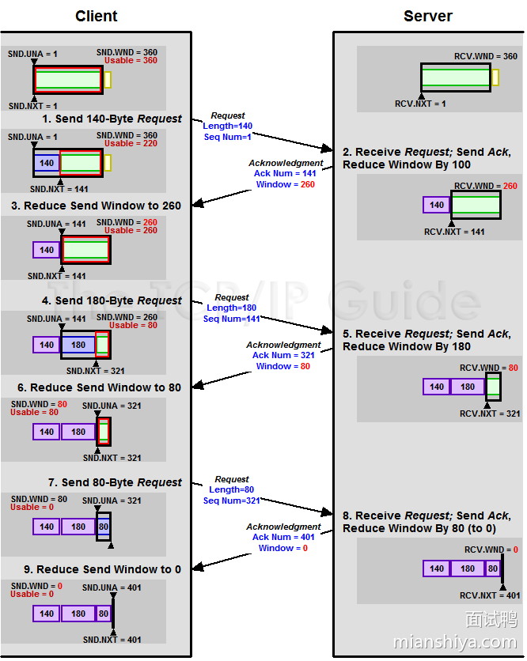

## 1469. 介绍一下 Reactor 线程模型？

### 回答重点

Reactor 是服务端在网络编程时的一个编程模式，主要由一个基于 Selector （底层是 select/poll/epoll）的死循环线程，也称为 Reactor 线程。

基于事件驱动，将 I/O 操作抽象成不同的事件，每个事件都配置对应的回调函数，由 Selector 监听连接上事件的发生，再进行分发调用相应的回调函数进行事件的处理。

Reactor 线程模型分为三种，分别为单 Reactor 单线程模型、单 Reactor 多线程模型、主从 Reactor 多线程模型。

1）单 Reactor 单线程模型：所有的操作都是由一个 I/O 线程处理。

- 优点：对系统资源消耗较少。
- 缺点：没办法支持高并发场景。


2）单 Reactor 多线程模型：一个线程负责接收建连事件和后续的连接 I/O 处理（read、send等），线程池处理具体业务逻辑。

- 优点：可以很好地应对大部分的场景 ，也提高了事件的处理效率。
- 缺点：并发量大的时候，一个线程可能没办法接收所有的事件请求，可能导致性能瓶颈。


3）主从 Reactor 多线程模型：主 Reactor 线程负责接收建连事件，从 Reactor 线程负责处理建连后的后续连接 I/O 处理（read、send等），线程池处理具体业务逻辑。

- 优点：解决海量并发请求。
- 缺点：相对而言，实现复杂度较高，对系统资源的管理要求会高一点。


### 扩展知识

#### 理解 Reactor

Reactor 它算是一个编程模式或者说一个架构模式，常用在**服务端**网络通信相关的模块。

Reactor 直译到中文是反应堆，虽然直译不贴切，但确实跟“反应”有关。

反应什么呢？**对触发的事件进行反应**。

在大学的时候，我相信很多人都做过图书管理系统等类似的大作业，这种都是基于 Java GUI 做的，当然具体如何实现的不重要，重要的是你完成之后的成品是不是点击一个按钮就会弹出一个对应的弹框？

点击按钮就会弹框，不同的按钮弹不同的框，这就是反应。

咱们计算机不就讲究抽象嘛，所以把这上面说的这些抽象一下，**就是针对不同的事件需要有不同的处理逻辑（方法调用）**。

到这，我们得到了两个概念：事件（点击按钮）和处理逻辑（弹对应的框）。

再回到弹框这个场景，思考下，到底是谁在监听着按钮被点击的动作来弹出不同的框呢？

这里，我们很容易想到两种情况：

1. 一个按钮派一个线程在守着，只要按钮被点击了，这个线程就执行弹框
2. 一个线程轮询所有按钮的情况，死循环查看只要有一个按钮被点击了，就找出按钮绑定的框，然后弹

如果按钮很少，其实多派几个线程守着影响不大，假设有一千个、一万个按钮呢？这种场景下第二种实现更优，毕竟按钮也不是一直会被点击着，对吧。

我们把“人”、“点击按钮”、“弹框”对应到网络编程中，就是线程、事件、处理。

第一种情况翻译过来就是一个线程接待一个连接，每当连接上有事件产生，则线程会对应事件作出响应。

这对应着很早之前的网络编程模型，那时候网上没那么多用户，并且也就只有阻塞 I/O，如果连接没有反应，那么线程就得阻塞等待着 I/O 事件的发生。

第二种情况翻译过来就是，由一个线程接待多个连接，不论哪个连接上有事件产生，这个线程都会根据事件找到对应的处理逻辑来作出响应。

这就是对应现在流行的基于非阻塞 I/O 的 I/O 多路复用，这种场景就适合海量用户的情况，服务端可用很少线程来处理数量庞大的连接，就像我上面说的，毕竟连接（按钮）也不是一直会有请求过来（被点击）。

至于我前头提到的事件，**基础的** I/O 上的事件也就这三种：连接事件、读事件、写事件。

现在回到网络 I/O 上，我们再来看 Reactor：也就是有一个 selector（select/poll/epoll） 线程，它管理着很多连接，只要某个连接上有事件产生，就会唤醒 selector 线程，这个线程就会根据发生的事件类型做不同的处理。

这就是 Reactor，对应的线程也叫 Reactor 线程（就靠它起反应啦）。

那没 Reactor 的场景是怎样的？

就是上面提的第一种情况，一个线程接待一条连接。不像第二种情况这样，由一个线程来接待许多连接，由一个“负责人”来接待多个客户，这种什么事都找一个人，是不是感受起来那个人就像一个 Reactor？

**能一对多的根据不同请求做出不同响应实现**，是我个人认为的 Reactor 核心。至于事件、调度器、Acceptor等玩意，我觉得是为了写论文或者文章必须要搞的一些概念，反正理解了之后，也就这么回事儿，因为要从流程上走通必须得有这么些个东西。

就像我们所知的 SpringMVC，要想一个请求能找到对应的 Controller，那不就得有个统一入口判断路由嘛，所以必须要有这么个东西，不然请求到不了 Controller 了啊，那这个玩意叫啥？不就是 DispatcherServlet 吗， 中文名不就是前置控制器吗。

所以，不是说 SpringMVC 需要有 DispatcherServlet 这么个玩意，而是 SpringMVC 需要有个统一入口判断路由，所以就弄了个实现类，这个实现类呢就叫 DispatcherServlet。

你懂我的意思吧。

同样看 Reactor 也是一样的。不是说 Reactor 需要有个叫 Demultiplexer、 Dispatcher、Handle、Event Handler 这么些组合起来才叫 Reactor 。

而是在网络 I/O 中基于非阻塞 I/O ，且需要少量的线程接待大量的连接，这样一场景下，就必须要个”东西“作为一个监听者，监听底层这么多连接是否有请求，然后根据请求的类型（抽象的事件），指派调用不同的处理逻辑，才对应衍生出上面这么些个名词。

在具体的实现上， Demultiplexer 和 Dispatcher 当然可以是同一个线程，同在一个死循环里面，这都是 ok 的，不要看着名词就理解着，代码里必须分这么两个玩意，不是的哈。

基于上面的理解，然后再看看来自 Reactor 论文的这张图把，是不是好理解了。


##### Reactor 模式的核心意义

Reactor 的核心在于“对事件作出反应”。用一个线程（或少量线程）来监听多个连接上的事件，根据事件类型分发调用相应的处理逻辑，从而避免为每个连接都分配一个线程。

与传统模型对比，传统阻塞 I/O 是一个线程对应一个连接，资源浪费严重；而 Reactor 模式能实现一对多的映射，更适合高并发场景。


## 5931.Java 线程池核心线程数在运行过程中能修改吗？如何修改？ 

### 回答重点

**可以动态修改的**。Java 的 `ThreadPoolExecutor` 提供了动态调整核心线程数和最大线程数的方法。

1）**修改核心线程数的方法**：

- 使用 `ThreadPoolExecutor.setCorePoolSize(int corePoolSize)` 方法可以动态修改核心线程数。`corePoolSize` 参数代表线程池中的核心线程数，当池中线程数量少于核心线程数时，会创建新的线程来处理任务。这个修改可以在线程池运行的过程中进行，立即生效。

2）**注意事项**：

- 核心线程数的修改不会中断现有任务，新的核心线程数会在新任务到来时生效。
- `setCorePoolSize()` 方法可以减少核心线程数，但如果当前线程池中的线程数量超过了新的核心线程数，多余的线程不会立即被销毁，直到这些线程空闲后被回收。

### 扩展知识：

#### **核心线程数和最大线程数的区别**：

- **核心线程数 (`corePoolSize`)**：线程池会维持这个数量的线程，即使这些线程是空闲的。当有新任务提交时，如果现有线程小于核心线程数，会直接创建新的线程来处理任务。
- **最大线程数 (`maximumPoolSize`)**：当核心线程数已满且队列也满了，线程池会创建非核心线程来处理额外的任务。最大线程数限制了线程池能创建的最大线程数。

#### **线程池调整原则**：

- 动态调整线程池大小时，需要确保新的配置不会导致系统资源耗尽。比如，过大的线程池可能会占用过多的 CPU 和内存，反而影响性能。
- 当系统负载发生变化时，可以使用动态调整来优化线程池的资源使用率，例如在系统负载增加时，临时提高核心线程数以应对突发流量,当系统负载下降时，可以减少核心线程数以节省资源。
- 当任务队列长度过长时，可以临时增加核心线程数，以加快任务的处理速度。

#### **allowCoreThreadTimeOut 方法**：

- 默认情况下，核心线程不会被回收，即使它们空闲。通过 `allowCoreThreadTimeOut(true)` 可以允许核心线程在空闲时被回收，从而释放系统资源。
- 这在负载波动大的应用场景中非常有用，例如在负载高峰时临时增加核心线程数，低负载时通过回收空闲线程释放资源。

#### **线程池监控与调整**：

- 在实际生产环境中，可以通过监控线程池的状态（如当前活跃线程数、队列长度等）来决定是否动态调整线程池大小。
- 可以使用 JMX（Java Management Extensions）来监控 `ThreadPoolExecutor`，结合指标来自动调整线程池大小以优化性能。

#### 线程池原理

- [472.你了解 Java 线程池的原理吗？](https://www.mianshiya.com/question/1780933294892806145)

## 696. TCP/IP 四层模型是什么？

### 回答重点

TCP/IP 四层模型是一个分层网络通信模型，它将网络通信过程分为四个层次，这四层分别是：网络接口层、互联网层、传输层和应用层。

- 网络接口层负责在计算机和网络硬件之间传输数据，负责在物理网络上发送和接收数据帧，包括以太网、Wi-Fi 等协议
- 互联网层（网络层）通过 IP 协议提供数据包的路由和转发
- 传输层负责在两个主机之间提供端到端的通信服务，常见的协议有 TCP 和 UDP
- 应用层通过各种协议提供网络应用程序的功能，如 HTTP、FTP、SMTP 等协议


#### 分层的优点

- **简化设计与实现**：通过将网络功能分解为不同的层，每一层只负责特定的任务，从而简化了设计和实现的复杂性。
- **模块化**：每一层可以独立发展和优化，不同层次之间通过标准接口进行通信，便于各层的更新和替换。
- **互操作性**：明确定义每个层次之间的接口和协议，不同厂商或组织开发的网络设备和软件可以相互兼容，使得不同的网络设备和系统能够在不同的层次上进行无缝互操作，提升了网络的兼容性。
- **故障隔离**：每个层次都有自己的错误检测、纠错和恢复机制，且分层结构能够帮助网络工程师定位问题所在的层次，从而更快地进行故障排除。

### **扩展知识**

#### TCP/IP 四层模型与 OSI 七层模型的对比

- **OSI 七层模型** 是另一个著名的网络模型，它将网络通信过程分为七个层次：物理层、数据链路层、网络层、传输层、会话层、表示层和应用层。
- **简化与实用性**：TCP/IP 四层模型是对 OSI 七层模型的简化，省略了会话层和表示层，将数据链路层和物理层合并为网络接口层。这种简化更符合实际应用中的网络协议栈实现。
- **应用层的差异**：在 OSI 模型中，应用层、表示层和会话层是分开的，而在 TCP/IP 模型中，它们被合并成了单一的应用层。这种设计简化了上层协议的开发和实现。

#### 每一层主要包头信息和单位

##### 应用层

**包头信息主要字段**：

- **HTTP**：`Host`（目标主机）、`User-Agent`（客户端类型）、`Content-Length`（内容长度）等。
- **DNS**：`Transaction ID`（事务 ID）、`Flags`（标识符）、`Query/Response`（查询/响应标识）等。

**数据单位**：**数据（Data）**

##### **传输层**

**包头信息主要字段**：

- **TCP**：`Source Port`（源端口）、`Destination Port`（目的端口）、`Sequence Number`（序列号）、`Acknowledgment Number`（确认号）、`Flags`（控制标志）等。
- **UDP**：`Source Port`（源端口）、`Destination Port`（目的端口）、`Length`（数据包长度）、`Checksum`（校验和）等。

**数据单位**：**报文段（Segment）**

##### **网络层**

**包头信息主要字段**：

- **IP**：`Source IP Address`（源 IP 地址）、`Destination IP Address`（目的 IP 地址）、`TTL`（生存时间）、`Protocol`（上层协议类型）等。

**数据单位**：**数据包（Packet）**

##### **网络接口层（数据链路层和物理层）**

**包头信息主要字段**：

- **以太网**：`Source MAC Address`（源 MAC 地址）、`Destination MAC Address`（目的 MAC 地址）、`Type`（上层协议类型）等。

**数据单位**：**帧（Frame）**

## 1153. 说说 MyBatis 的缓存机制？

### 回答重点

MyBatis 的缓存机制分为两种：**一级缓存**和**二级缓存**。

#### 1. 一级缓存（Local Cache）

- **范围**：一级缓存是 MyBatis 默认启用的缓存，缓存的范围是**每个 SqlSession**。即每次执行查询时，MyBatis 会将查询结果缓存到当前 SqlSession 中，直到这个 **SqlSession 关闭**或者 **commit/rollback** 操作执行。
- **作用**：如果在同一个 SqlSession 内执行多次相同的查询（查询的条件相同），MyBatis 会直接从缓存中获取数据，而不再去执行 SQL 查询。
- 特点：
  - 只有当前的 SqlSession 可以访问这个缓存。
  - 默认开启，无需额外配置。
  - 通过 **clearCache()** 可以清空缓存。

#### 2. 二级缓存（Global Cache）

- **范围**：二级缓存是 MyBatis 在全局范围内共享的缓存，缓存的作用范围是**整个应用**，也就是所有 SqlSession 可以共享这一个缓存。
- **作用**：如果在不同的 SqlSession 之间执行相同的查询，MyBatis 会将查询结果缓存到二级缓存中，下次查询相同的数据时，会先从二级缓存中获取，而不执行 SQL 查询。
- 特点：
  - 需要手动配置才能启用。
  - 每个 Mapper 会有一个独立的缓存，所有与该 Mapper 相关的 SqlSession 都能共享这个缓存。
  - 二级缓存会在 SqlSessionFactory 生命周期结束后（如应用关闭）自动清空。
  - 通过 **@CacheNamespace** 注解可以为特定的 Mapper 开启二级缓存。

#### 二级缓存的配置

1. 在 MyBatis 配置文件中开启二级缓存：

```xml
<settings>
    <setting name="cacheEnabled" value="true"/>
</settings>
```

在 Mapper 中配置使用二级缓存：

- 可以使用 **@CacheNamespace** 注解开启二级缓存，也可以在 XML 配置中通过 `<cache>` 标签开启：

```xml
<mapper namespace="com.example.mapper.UserMapper">
    <cache/>
    <!-- 其他 Mapper 配置 -->
</mapper>
```

####  **缓存的工作流程**

1. 当执行查询时，MyBatis 会先检查一级缓存中是否存在数据。
2. 如果一级缓存中没有数据，则检查二级缓存。
3. 如果二级缓存中也没有数据，则从数据库中查询，并将结果存入一级缓存和二级缓存。
4. 当执行 `insert`、`update`、`delete` 操作时，MyBatis 会清空一级缓存和二级缓存。

### 扩展知识

#### 进一步理解

一级缓存默认是会话级缓存。即创建一个 SqlSession 对象就是一个会话，一次会话可能会执行多次相同的查询，这样缓存了之后就能重复利用查询结果，提高性能，不过 commit、rollback、update、delete 等都会清除缓存。

不过要注意，不同 SqlSession 之间的修改不会影响彼此，比如 SqlSession1 读了数据 A，SqlSession2 将数据改为 B，此时 SqlSession1 再读还是得到 A，这就出现了脏数据的问题。

所以，如果是多 SqlSession 或者分布式环境下，就可能有脏数据的情况发生，建议将一级缓存级别设置为 statement。

> - **SESSION 级别**（默认）：同一 `SqlSession` 内多次执行相同 SQL 会命中缓存，减少数据库访问
> - **STATEMENT 级别**：每次查询均为独立操作，缓存不跨 SQL 共享

二级缓存是跨 SqlSession 级别的共享的，同一个 namespace 下的所有操作语句，都影响着同一个 Cache。


二级缓存也会有脏数据的情况，比如多个命名空间进行多表查询，各命名空间之间数据是不共享的，所以存在脏数据的情况。

例如 A、B 两张表进行联表查询，表 A 缓存了这次联表查询的结果，则结果存储在表 A 的 namespace 中，此时如果表 B 的数据更新了，是不会同步到表 A namespace 的缓存中，因此就会导致脏读的产生。

> 一般而言 namespace 对应一个 mapper，对应一个表。namespace 对应一个唯一的命名空间，从而可以在不同的映射文件中使用相同的 SQL 语句 ID，例如 user 可以定义一个 selectById，order 也可以定义一个 selectById，因为命名空间不同，就不会冲突。

开启二级缓存之后，**会先从二级缓存查找，找不到再去一级缓存查找**，如果一级缓存没有再去数据库查询。

二级缓存主要是利用 `CachingExecutor` 这个装饰器拦了一道，来看下 `CachingExecutor#query` 方法：


而 MyBatis 的缓存本质上就是在本地利用 map 来存储数据。

基础实现类是 `PerpetualCache` ，并且使用了装饰器模式，提供了各种各样的 cache 进行功能的扩展，比如：


像 `BlockingCache` 可以提供阻塞，还有 `FifoCache`、`LruCache` 等等。

好了，原理大致就是上面这些，可以看到 mybaits 缓存还是不太安全，上面说的在分布式场景下肯定会出现脏数据。

建议生产上使用 redis 结合 spring cache 进行数据的缓存，或者利用 guava、caffeine 进行本地缓存。

#### 配置示例

**一级缓存**无需额外配置，默认开启。

**二级缓存**配置示例（Mapper XML 文件）：

```xml
<mapper namespace="com.example.mapper.UserMapper">
    <!-- 开启二级缓存 -->
    <cache eviction="LRU" flushInterval="60000" size="512" readOnly="true"/>
</mapper>
```

- **`eviction`**：缓存清理策略（`LRU`、`FIFO` 等）。
- **`flushInterval`**：刷新间隔（单位：毫秒）。
- **`size`**：缓存的最大对象个数。
- **`readOnly`**：只读标志，设置为 `true` 时提高性能，但不能修改返回对象。

## 741.什么是 Spring Boot？ 

### 回答重点

Spring Boot 是一个简化 Spring 应用程序开发的框架。**它的主要目标是减少 Spring 应用程序的配置和开发复杂性，使我们能够更快地构建、测试和部署 Spring 应用**。

简单来说它通过提供默认配置、自动化配置和嵌入式服务器等功能，简化了传统 Spring 应用的繁琐配置过程。

有人将一些依赖关系、默认配置都梳理好了，我们直接一个引用就搞定了，这就是它的本质。

### 扩展知识

#### Spring Boot 主要特点

1. **简化配置**：Spring Boot 通过自动配置（`@EnableAutoConfiguration`），根据项目中的类路径依赖、环境变量等自动为应用配置适当的 Spring 模块，避免了大量的 XML 配置。
2. **内置服务器**：Spring Boot 内置了 Tomcat、Jetty、Undertow 等服务器，应用程序可以直接通过 `java -jar` 方式启动，而不需要部署到外部的 Web 服务器中。
3. **快速开发**：Spring Boot 提供了开箱即用的项目结构、默认配置和依赖管理，支持快速原型开发。它还提供了许多常用的开发工具（如开发时热部署、应用健康检查等）。
4. **独立运行**：Spring Boot 应用打包成一个独立的 JAR 或 WAR 包，可以通过命令行直接运行，简化了部署过程。

#### **Spring Boot 的核心注解**

#### `@SpringBootApplication`

`@SpringBootApplication` 是 Spring Boot 的核心注解，它是以下三个注解的组合：

- `@Configuration`：表示该类是 Spring 配置类。
- `@EnableAutoConfiguration`：启用 Spring Boot 的自动配置功能。
- `@ComponentScan`：自动扫描当前包及其子包中带有 Spring 注解的类（如 `@Controller`、`@Service` 等）。


#### `@EnableAutoConfiguration`

`@EnableAutoConfiguration` 是 Spring Boot 的自动配置核心注解，它会根据类路径中的依赖自动配置 Spring 应用中的各种组件。

**示例**： 如果应用中引入了 `spring-boot-starter-web` 依赖，Spring Boot 会自动为应用配置嵌入式 Tomcat 服务器、MVC 框架等。

#### **Spring Boot 的启动器（Starters）**

Spring Boot 提供了一系列 **Starters**（启动器），这些启动器是预定义的依赖包集合，涵盖了常用的 Spring 和第三方库。通过引入一个简单的启动器依赖，开发者可以快速整合需要的功能。

##### 常用 starter

- **`spring-boot-starter-web`**：用于构建 Web 应用，包含 Spring MVC 和嵌入式 Tomcat。
- **`spring-boot-starter-data-jpa`**：用于集成 Spring Data JPA 和 Hibernate，简化数据库访问。
- **`spring-boot-starter-security`**：用于集成 Spring Security，实现身份验证和授权。
- **`spring-boot-starter-thymeleaf`**：集成 Thymeleaf 模板引擎，适用于 MVC 模式下的视图层渲染。

```java
<dependency>
    <groupId>org.springframework.boot</groupId>
    <artifactId>spring-boot-starter-web</artifactId>
</dependency>
```

引入 `spring-boot-starter-web` 之后，Spring Boot 会自动配置 Web 服务器和 Spring MVC，开发者只需编写业务逻辑即可。

#### **Spring Boot 的自动配置**

Spring Boot 的自动配置机制依赖于 `spring-boot-autoconfigure` 模块，它会根据类路径中的依赖和配置文件自动配置相关的 Bean 和服务。

##### 工作原理

Spring Boot 自动配置的核心原理是 `@EnableAutoConfiguration` 注解，它根据项目中的依赖和 `application.properties` 或 `application.yml` 文件中的配置，判断需要加载哪些 Bean。通过条件注解（如 `@ConditionalOnClass`、`@ConditionalOnMissingBean` 等），Spring Boot 可以有选择地加载相关配置。

##### 自定义配置

虽然 Spring Boot 自动配置非常方便，但开发者可以通过 `application.properties` 文件自定义和覆盖默认配置。

**示例**：

```txt
server.port=8081  # 修改内置 Tomcat 的端口号
spring.datasource.url=jdbc:mysql://localhost:3306/mydb  # 配置数据源
```

#### **Spring Boot 内置服务器**

Spring Boot 内置了几种常见的 Web 服务器，如 Tomcat、Jetty 和 Undertow。默认情况下，Spring Boot 使用嵌入式 Tomcat 作为 Web 应用的服务器，开发者可以通过 `application.properties` 文件或代码配置来切换服务器或修改其配置。

##### 嵌入式 Tomcat 配置

Spring Boot 默认使用嵌入式 Tomcat 服务器，开发者可以通过修改配置文件来调整 Tomcat 的属性，例如端口号、线程池大小等。

**示例**：

```xml
server.port=8080
server.tomcat.max-threads=200
```

##### 切换到 Jetty 或 Undertow

开发者可以通过替换依赖来切换嵌入式服务器。

**示例**：切换到 Jetty

```xml
<dependency>
    <groupId>org.springframework.boot</groupId>
    <artifactId>spring-boot-starter-jetty</artifactId>
</dependency>
```

#### **Spring Boot Actuator**

Spring Boot Actuator 是一个用于监控和管理 Spring Boot 应用的工具包，提供了丰富的健康检查、度量指标、应用状态等功能。开发者可以通过 Actuator 轻松地监控应用的运行状态。

##### 常见的 Actuator 端点

- **`/actuator/health`**：检查应用的健康状态。
- **`/actuator/metrics`**：查看应用的性能指标。
- **`/actuator/info`**：显示应用的基本信息。

**示例**： 在 `application.properties` 文件中启用 Actuator 端点：

```properties
management.endpoints.web.exposure.include=*
```

访问 `/actuator/health`，可以查看应用的健康状态信息：

```json
{
    "status": "UP"
}
```

#### **Spring Boot 的优点**

- **快速启动**：Spring Boot 提供了简洁的配置和开箱即用的功能，减少了项目启动时所需的配置工作，开发者可以专注于业务逻辑。
- **简化的配置管理**：Spring Boot 的自动配置机制大大减少了开发者手动配置的繁琐工作，尤其是在集成数据库、消息队列、安全性等复杂组件时，开发者可以通过少量配置完成集成。
- **内置 Web 服务器**：Spring Boot 内置了常用的 Web 服务器，使得开发者可以直接运行 Web 应用，而无需部署到外部服务器。
- **强大的生态系统**：Spring Boot 集成了 Spring 全家桶，提供了与 Spring 生态中各个组件的无缝集成，并通过各种 Starter 来快速添加第三方库支持。


## 5919.Java 中如何创建多线程？ 

### 回答重点

常见有以下五种方式创建使用多线程：

1）**实现 `Runnable` 接口**：

- 实现 `Runnable` 接口的 `run()` 方法，使用 `Thread` 类的构造函数传入 `Runnable` 对象，调用 `start()` 方法启动线程。
- 例子：`Thread thread = new Thread(new MyRunnable()); thread.start();`

2）**继承 `Thread` 类**：

- 继承 `Thread` 类并重写 `run()` 方法，直接创建 `Thread` 子类对象并调用 `start()` 方法启动线程。
- 例子：`MyThread thread = new MyThread(); thread.start();`

3）**使用 `Callable` 和 `FutureTask`**：

- 实现 `Callable` 接口的 `call()` 方法，使用 `FutureTask` 包装 `Callable` 对象，再通过 `Thread` 启动。
- 例子：`FutureTask<Integer> task = new FutureTask<>(new MyCallable()); Thread thread = new Thread(task); thread.start();`

4）**使用线程池（`ExecutorService`）**：

- 通过 `ExecutorService` 提交 `Runnable` 或 `Callable` 任务，不直接创建和管理线程，适合管理大量并发任务。
- 例子：`ExecutorService executor = Executors.newFixedThreadPool(10); executor.submit(new MyRunnable());`

5）**CompletableFuture（本质也是线程池，默认 forkjoinpool）**：

- Java 8 引入的功能，非常方便地进行异步任务调用，且通过 `thenApply`、`thenAccept` 等方法可以轻松处理异步任务之间的依赖关系。
- `CompletableFuture<Void> future1 = CompletableFuture.runAsync(() -> {});`

### 扩展知识

1）**`Runnable` vs `Callable`**：

- `Runnable` 的 `run()` 方法不返回结果，不能抛出检查异常；`Callable` 的 `call()` 方法可以返回结果，并允许抛出检查异常。使用 `Callable` 更适合需要返回结果或处理异常的并发任务。

2）**线程池的优势**：

- 使用线程池可以有效管理和重用线程，避免频繁创建和销毁线程带来的开销。常用的线程池有 `FixedThreadPool`、`CachedThreadPool` 和 `ScheduledThreadPool`，每种线程池适用于不同的场景。
- [472. 你了解 Java 线程池的原理吗？](https://www.mianshiya.com/question/1780933294892806145)
- [474. 如何设置 Java 线程池的线程数？](https://www.mianshiya.com/question/1780933294905389057)

3）**虚拟线程（Java 21 及之后）**：

- 虚拟线程是 Java 21 引入的新特性，它是一种轻量级的线程实现，可以更高效地处理大量并发任务。与传统的操作系统线程相比，虚拟线程的创建和上下文切换开销更低，非常适合高并发应用场景。
- 例子：`Thread.startVirtualThread(() -> System.out.println("Hello from a virtual thread"));`
- [468. 什么是协程？Java 支持协程吗？](https://www.mianshiya.com/question/1780933294863446018)

1. **CompletableFuture**：

- [485. 什么是 Java 的 CompletableFuture？](https://www.mianshiya.com/question/1780933294951526402)

## 638. Redis 中跳表的实现原理是什么？

### 回答重点

跳表主要是通过**多层链表来实现**，底层链表保存所有元素，而每一层链表都是下一层的子集。

- **插入时**，首先从最高层开始查找插入位置，然后随机决定新节点的层数，最后在相应的层中插入节点并更新指针。
- **删除时**，同样从最高层开始查找要删除的节点，并在各层中更新指针，以保持跳表的结构。
- **查找时**，从最高层开始，逐层向下，直到找到目标元素或确定元素不存在。查找效率高，时间复杂度为 O(logn)

### 扩展知识

#### 跳表原理详细解析

跳表，一句话概括：就是一个多层索引的链表，每一层索引的元素在最底层的链表中可以找到的元素。如下图所示，这就是一个简单的跳表实现了，每个颜色代表一层，绿色的就是链表的最底层了。


接下来我们通过查询和添加元素来了解其功能流程：

1）**查询元素**：这里我们与传统的链表进行对比，来了解跳表查询的高效。

假设我们要查找 50 这个元素，如果通过传统链表的话（看最底层绿色的查询路线），需要查找 4 次，查找的时间复杂度为 O（n）。

但如果使用跳表的话，其只需要从最上面的 10 开始，首先跳到 40 ，发现目标元素比 40 大，然后对比后一个元素比 70 小。于是就前往下一层进行查找，然后 40 的下一个 50 刚好符合目标，就直接返回就可以了，这个过程的跳转次数是 3 次，即 10 -> 40 (顶层) -> 40 （第二层）-> 50 (第二层)，其流程如下图所示：


跳表的平均时间查询复杂度是 O（logn），最差的时间复杂度是O（n）。

2） **插入元素**：我们插入一条 score 为 48 的数据

- 先需要定位到第一个比 score 大的数据。如图所示，一下子就可以定位到 50 了，这里和查询的过程（上文所示）是一样的。
- 在定位到对应节点之后，具体是在当前节点创建数据还是增加一个层级这个是随机的，这里假设设置为 2 层
- 定位层级后，再将每一层的链表节点进行补齐，就是在 40 与 50 之间插入一个新的链表节点 48，插入过程与链表插入是一样的。

最终实现的效果如下图所示：


#### Redis 中的跳表实现解析

Redis 的跳表相对于普通的跳表多了一个**回退指针，且 score 可以重复**。

我们先来看一下 Redis 中关于跳表实现的源码：

```c
typedef struct zskiplistNode {
    //Zset 对象的元素值
    sds ele;
    //元素权重值
    double score;
    //后退指针
    struct zskiplistNode *backward;
  
    //节点的level数组，保存每层上的前向指针和跨度
    struct zskiplistLevel {
        struct zskiplistNode *forward;
        unsigned long span;
    } level[];
} zskiplistNode;
```

这里我们分析一下每个字段的含义

- ele：这里用到了 Redis 字符串底层的一个实现 sds，其主要作用是用来存储数据。
- score：节点的分数，double 即浮点型数据。
- backward：我们可以看到其是 zskiplistNode 结构体指针类型，即代表指向前一个跳表节点
- level：这个就是 zskiplistNode 的结构体数组了，数组的索引代表层级索引，这里注意与 hashtable 中的结构进行区分，那个使用的是联合体，一个是 forward ，其代表下一个跳转的跳表节点，注意一个点，其是跳转到同一层;span 主要作用代表距离下一个节点的步数。

到这里分析就差不多了，为了方便大家理解，这里放一个相关的图，下图的红色箭头就代表回退指针。

Redis 跳表的实现大致如下图所示了：


#### 补充插入的随机层级

新插入的节点位于哪一层在 Redis 中是采用随机的概率函数来决定的。

```c
以下源码来自 redis7.0

#define ZSKIPLIST_MAXLEVEL 32 /* Should be enough for 2^64 elements */
#define ZSKIPLIST_P 0.25   /* Skiplist P = 1/4 */

/* Returns a random level for the new skiplist node we are going to create.
 * The return value of this function is between 1 and ZSKIPLIST_MAXLEVEL
 * (both inclusive), with a powerlaw-alike distribution where higher
 * levels are less likely to be returned. */
int zslRandomLevel(void) {
    static const int threshold = ZSKIPLIST_P*RAND_MAX;
    int level = 1;
    while (random() < threshold)
        level += 1;
    return (level<ZSKIPLIST_MAXLEVEL) ? level : ZSKIPLIST_MAXLEVEL;
}
```

通过调用 `zslRandomLevel` 方法来决定新插入的节点所在的层数（level）。可以看到 level 从 1 开始，通过 `while` 循环，当产生的随机数小于 `RAND_MAX`的最大值的 0.25 倍时 level + 1，即有 25 % 的概率累加 level，反之退出循环。

- 节点被分配到第 1 层的概率为 0.75
- 节点被分配到第 2 层的概率为 0.25
- 节点被分配到第 3 层的概率为 0.25 * 0.25
- 以此类推，节点被分配到第 n 层的概率为 0.25^(n-1)。

所以跳表每一个节点能否新加一层的概率是 25 % （最多的层数在 Redis 5.0 中是 64 层，Redis 7.0 中是 32 层）。

#### 为什么 Redis 跳表实现多了个回退指针（前驱指针）

回退指针主要是**为了提高跳表的操作效率和灵活性**。

例如删除节点时，通过前驱指针可以在一次遍历中找到并记录所有关联的前驱节点，无需在变更指针时再次查找前驱节点。这种设计避免了重复查找过程，简化了操作逻辑，大幅提高了删除的执行效率。

尤其是在频繁插入和删除的场景中，回退指针减少了节点之间指针的更新复杂度，提升性能。

## 668.Redis 性能瓶颈时如何处理？ 

### 回答重点

如果 Redis 无法承受当前的负载的话，可以考虑从以下几个解决方法去解决：

首先想到的是**扩容**，比如增加 Redis 的配置，容纳更多的内存等。

如果超过单机配置了，那么可以上 **redis 主从**，通过从服务分担读取数据的压力，利用哨兵自动进行故障转移。

还可以利用 **redis 集群**进行数据分片，比如 Redis Cluster。

也可以增加本地内存，通过**多级缓存**分担 redis 的压力。

### 扩展知识

#### redis 主从复制和读写分离

通过配置 Redis 主从复制，可以实现读写分离，将写操作交给主节点进行处理，而读操作可以交给从节点，从而减轻主节点的压力。

主从架构的优势在于可以横向扩展读取能力，但是存在**主从同步延迟**的问题，如果从节点落后较多，可能会出现读取旧数据的情况。

- [651. Redis 主从复制的实现原理是什么？](https://www.mianshiya.com/question/1780933295647780865)
- [650. Redis 的哨兵机制是什么？](https://www.mianshiya.com/question/1780933295643586562)

#### redis 集群

- [652. Redis 集群的实现原理是什么？](https://www.mianshiya.com/question/1780933295651975169)

## 697. OSI 七层模型是什么？

### 回答重点

OSI（Open Systems Interconnection）七层模型将网络通信分为七个层次，每一层都有特定的功能，且每层相对独立，可以与其他层交互但不会影响其他层的内部实现。

七层模型从高到低依次为：

1. **应用层（Application Layer）**：用户交互界面，提供网络服务，如HTTP、FTP、SMTP等。
2. **表示层（Presentation Layer）**：数据格式转换、加密、解密，如JPEG、MPEG、SSL/TLS等。
3. **会话层（Session Layer）**：建立、管理、终止会话，如NetBIOS、RPC等。
4. **传输层（Transport Layer）**：可靠传输，流量控制，错误检测，如TCP、UDP等。
5. **网络层（Network Layer）**：路径选择和逻辑地址（IP）管理，如IP、ICMP等。
6. **数据链路层（Data Link Layer）**：物理地址（MAC）寻址，错误检测与纠正，如以太网、PPP等。
7. **物理层（Physical Layer）**：比特流传输，物理连接，如光纤、网线、无线电波等。


### 扩展知识

#### OSI模型的历史背景

OSI模型由国际标准化组织（ISO）在1984年发布，**目的是创建一个标准化的网络通信框架，以便不同厂商的设备可以互操作**。

不过OSI模型本身没有被广泛应用，但它提供了一个非常有价值的参考点，帮助理解各种网络协议和技术。

#### 与TCP/IP模型的对比

**TCP/IP模型是实际互联网使用的分层模型**，包含四层：应用层、传输层、网络层和网络接口层。TCP/IP模型更加简洁实用，而OSI模型更加细致。

[TCP/IP 四层模型是什么？](https://www.mianshiya.com/question/1780933295790387202)

## 498. 说说 AQS 吧？

## 回答重点

> 如果面试官问你为什么需要 AQS ，不要长篇大论，容易把自己和面试官绕进去。 就这样简要的回答：

简单来说 AQS (AbstractQueuedSynchronizer)就是起到了一个抽象、封装的作用，将一些排队、入队、加锁、中断等方法提供出来，便于其他相关 JUC 锁的使用，具体加锁时机、入队时机等都需要实现类自己控制。

它主要通过维护一个共享状态（state）和一个先进先出（FIFO）的等待队列，来管理线程对共享资源的访问。

state 用 volatile 修饰，表示当前资源的状态。例如，在独占锁中，state 为 0 表示未被占用，为 1 表示已被占用。

当线程尝试获取资源失败时，会被加入到 AQS 的等待队列中。这个队列是一个变体的 CLH 队列，采用双向链表结构，节点包含线程的引用、等待状态以及前驱和后继节点的指针。

AQS 常见的实现类有 `ReentrantLock、CountDownLatch、Semaphore` 等等。

然后面试官会引申问你具体 ReentrantLock 的实现原理是怎样的呢?

参见这题：[ReentrantLock 原理](https://www.mianshiya.com/bank/1789249312885223425/question/1780933295014440961)。

## AQS 扩展知识

### AQS 的核心机制

1）状态（State）：

AQS 通过一个 volatile 类型的整数 state 来表示同步状态。


子类通过 getState()、setState(int) 和 compareAndSetState(int, int) 方法来检查和修改该状态。

状态可以表示多种含义，例如在 ReentrantLock 中，状态表示锁的重入次数；在 Semaphore 中，状态表示可用的许可数。

2）队列（Queue）：

AQS 维护了一个 FIFO 的等待队列，用于管理等待获取同步状态的线程。每个节点（Node）代表一个等待的线程，节点之间通过 next 和 prev 指针链接。 

```java
static final class Node {
    static final Node SHARED = new Node();
    static final Node EXCLUSIVE = null;
    volatile int waitStatus;
    volatile Node prev;
    volatile Node next;
    volatile Thread thread; // 保存等待的线程
    Node nextWaiter;
    .....
}
```

当一个线程获取同步状态失败时，它会被添加到等待队列中，并自旋等待或被阻塞，直到前面的线程释放同步状态。

3）独占模式和共享模式：

- 独占模式：只有一个线程能获取同步状态，例如 ReentrantLock。
- 共享模式：多个线程可以同时获取同步状态，例如 Semaphore 和 ReadWriteLock。

### 简单俯瞰 AQS 框架

AQS 整体架构图-（[图来自美团技术](https://tech.meituan.com/2019/12/05/aqs-theory-and-apply.html)）：


一般实现类仅需重写图中的 API 层，来控制加锁和入队等时机（仅关注这层就够了，其他 AQS 都封装好了）。具体如何获取到锁由上图第二层的方法提供，如果未获取到锁，则进入排队层。然后上述从 API 层到排队层都依赖数据层提供的支持。

关键方法介绍，子类通过重写这些方法来实现特定的同步器：

1）tryAcquire(int arg)：

尝试以独占模式获取同步状态。由子类实现，返回 true 表示获取成功，返回 false 表示获取失败。

2）tryRelease(int arg)：

尝试以独占模式释放同步状态。由子类实现，返回 true 表示释放成功，返回 false 表示释放失败。

3）tryAcquireShared(int arg)：

尝试以共享模式获取同步状态。由子类实现，返回一个非负数表示获取成功，返回负数表示获取失败。

4）tryReleaseShared(int arg)：

尝试以共享模式释放同步状态。由子类实现，返回 true 表示释放成功，返回 false 表示释放失败。

5）isHeldExclusively()：

判断当前线程是否以独占模式持有同步状态。由子类实现，返回 true 表示当前线程持有同步状态，返回 false 表示没有持有。

### 简单基于 AQS 实现一个独占锁

定义一个 Sync 继承 AQS 自定义 tryAcquire、tryRelease、isHeldExclusively 即可实现一个独占锁，非常简单。所以说 AQS 把一切都封装的很好，基于 AQS 可以便于其他相关 JUC 锁的使用！

```java

public class SimpleLock {
    private static class Sync extends AbstractQueuedSynchronizer {
        @Override
        protected boolean tryAcquire(int acquires) {
            if (compareAndSetState(0, 1)) {
                setExclusiveOwnerThread(Thread.currentThread());
                return true;
            }
            return false;
        }

        @Override
        protected boolean tryRelease(int releases) {
            if (getState() == 0) throw new IllegalMonitorStateException();
            setExclusiveOwnerThread(null);
            setState(0);
            return true;
        }

        @Override
        protected boolean isHeldExclusively() {
            return getState() == 1;
        }

        final ConditionObject newCondition() {
            return new ConditionObject();
        }
    }

    private final Sync sync = new Sync();

    public void lock() {
        sync.acquire(1);
    }

    public void unlock() {
        sync.release(1);
    }

    public boolean isLocked() {
        return sync.isHeldExclusively();
    }

    public Condition newCondition() {
        return sync.newCondition();
    }
}
```

### ReentrantLock 对 AQS 的使用

简单基于 AQS 实现一个独占锁之后，我们来看看 ReentrantLock 是如何基于 AQS 实现的。

可以看到，同样是定义一个 Sync 继承 AQS 自定义 tryAcquire、tryRelease、isHeldExclusively 等方法：


先简单分析下 nonfairTryAcquire 尝试申请锁的方法，看源码注释应该就很清晰了。本质就是 CAS 修改 state 并且实现了可重入：


再看下 tryRelease 尝试释放锁的方法：


如果有重入或者共享状态，那么来一个线程则可以将 `state + 1`，同理释放的时候将 `state - 1`，如果 state 为 0 说明线程已经不需要这把锁了，此时尝试释放锁即可。

所以本质还是对 state 的修改！

再看一下 ReentrantLock 尝试公平锁的加锁实现：


再看下 ReentrantLock 强制加锁，如果未抢到则入队的过程：


> 源码中 selfInterrupt 的作用是什么?

这里需要先看下 acquireQueued 方法：


着重看我圈起来的那块。

我们都知道线程是可以被中断的，如果当前线程阻塞等待锁的过程被中断唤醒，此时如果前面有排队抢锁的线程，那么被中断的线程还是会因为抢不到锁而再次阻塞等待。

这样就无法响应这个中断了！

因此 acquireQueued 通过 interrupted 变量记录了之前产生过的中断，然后 acquire 方法判断，如果 `interrupted = true` 说明之前被中断过，则自己主动触发一次中断补上之前的中断！

### AQS 中变型的 CLH

[ReentrantLock 原理](https://www.mianshiya.com/bank/1789249312885223425/question/1780933295014440961)。


## 698.Cookie、Session、Token 之间有什么区别？

### 回答重点

1）Cookie：

Cookie 是存储在用户浏览器端的一个小型数据文件，用于跟踪和保存用户的状态信息。

主要用于保持用户登录状态、跟踪用户行为、存储用户偏好等。

**存储在浏览器端**。

2）Session：

Session 是服务器端保存用户状态的机制，每个用户会话都有一个唯一的 Session ID。

主要用于跟踪用户在服务器上的状态信息，例如登录状态和购物车内容。

**存储在服务器端**，然后对应的 Session ID 通过 Cookie 保存在客户端浏览器中。

3）Token：

Token 本质是一种加密的字符串，用于身份验证和授权，可以包含用户信息和权限，用于验证用户身份或授权访问资源。

认证后，后端服务会返回 Token，**存储在客户端**（浏览器或移动应用中），后续客户端访问服务端需要带上这个 Token。

它们之间使用场景区别：

- Cookie：主要用于客户端状态的简单存储和追踪。
- Session：用于服务器端的复杂状态管理，特别是在需要存储大量会话数据时。
- Token：用于无状态的认证和授权，特别是在分布式和跨域环境下。

简单来说，Cookie 和Session 更适合用于单次会话的认证和状态管理，而 Token 更适合用于跨会话的认证和状态管理。

### 扩展知识

#### 从演进的角度来理解 Cookie 、Session、Token

1990 年。

蒂姆·伯纳斯·李创建了 HTTP 协议。

李老的想法是把文档存储在服务器中，谁需要这个文档直接从服务器获取即可。

按照这个思想，当时的需求只有 GET。

并且按照拿文档的思路：拿完了连接就可以断了，也不需要什么交互。

所以 **HTTP 起初的设计就是无状态的。**

也就是请求和请求之间是没有关联的。

而随着互联网的发展，交互开始兴起。

人们不再满足简单的静态文件获取，各种购物、社交接踵而至。

这意味着服务器需要判断每个请求的发起者是谁，也就是需要状态。

你聊天总得表明你是谁，并且和谁聊吧？不然服务器可不知这聊天信息得发给谁。

你购物总得让服务器知道是谁买了这玩意吧？

总不能你买完了下线，再上线发现你买的东西没了。

这时候就是需要一种技术让请求与请求之间建立起联系，让请求变得有状态。

这技术叫 Cookie，**就是一个以 Key-Value 格式存储的小文件，保存在客户端本地**。

比如登录之后，服务器就能设置 Cookie 返回给浏览器，然后保存在本地。

随便截了个百度的，列出来的就是 key，下拉箭头打开里面就有 value。


之后对百度的请求就可以带着 Cookie 去访问服务器，这里假设 BAIDUID 是用户 ID。

百度的服务器一看原来是这个 ID 啊，就知道是“我”请求了，这就有状态了。

简单地说 Cookie 就是存储在本地的一份文件，每次请求都会带上 Cookie 去访问服务器。

所以把一些**用户信息塞到 Cookie 里，这样服务器就能判别是哪个用户的请求了**。

注意 **Cookie 是有域的划分的**，来看下这个图：


也就是每个域下面都有各自的 Cookie ，访问不同的网站带属于这个网站的 Cookie ，不会带别人的 Cookie ，不然就乱套了。


但是 Cookie 是**明文存储在用户本地，而且带有大量的用户信息**这不太安全。

并且每次请求都需要带这么多 Cookie 对带宽来说也不太划算。

**Session** 就解决了这个问题，Session 就是会话，**它有更加广泛的含义**，在和 Cookie 这些一起谈论的场景，我们把它狭义化。

Session 就是把用户的会话信息存储在服务端。

然后颁发给客户端一个 sessionId，让客户端之后带着 sessionId 来请求。

这样服务端就可以通过 sessionId 去找到这个用户的信息，从而识别请求。

那客户端是如何带上 sessionId 的？

这个 sessionId 还是按照 Cookie 的形式存储在用户的本地，发起请求的时候带上即可。


但是把这种状态信息存储到服务器中**使得服务器就有状态了**。

一般我们部署在线上的服务器会有多台来做负载均衡，也互相作为 backup。

所以如果 Session 的信息存在某一台机器上，那么当**下一次请求被负载分到另一台机器**那就找不到这个 Session 信息了。

也就不认得这个请求了，可能的现象就是告诉用户没登录，那用户不就傻了。

我这刚还登录着呢，这就告诉我没登录了？

所以处理方式有 session 复制，就是服务器之间互相同步 session，这样不论请求到哪个服务器都有用户的信息。

不过这复制就冗余了，有额外的开销。

还有一种就是 session sticky，其实就是把你的请求一直粘在某一个服务器上，如果你请求的一开始被指派的是 A 服务器，那么之后的所有请求都只会被指派到 A 服务器上。

但是**如果 A 服务器挂了**，你的请求还是会被指派到别的服务器上，这样一来用户登录信息还是会丢了。

可以看到复制和 sticky 都有缺陷，所以可以把 session 放到第三方存储，比如 Redis 里。

这样服务器等于又没状态了。

而服务器的无状态意味着可以随意伸缩，服务集群根据流量加几台减几台很方便。

但是把 session 放第三方存储上只是把这个维护从服务器转嫁到第三方身上。

第三方得保证它的高可用，不然用户登录信息又会丢了。

不过一般而言我们的系统本来就要维护的第三方存储，所以影响不大。

**小结一下**：Cookie 明文存储在本地不太安全，所以想着把用户状态存在服务端，而 Session 就是将用户状态信息保存在服务端。

就暴露 sessionId 给客户端，这样相对而言安全些，并且也减少了网络流量。

但这样服务端就有状态了，难以扩展。

因此可以把 Session 放到第三方存储上，但是等于状态还是由服务端维护。

#### Token

其实仔细想想，**是不是不需要在服务端存储用户的信息？**

只需要一个**能代表身份的凭证**即可，一个服务端颁发给用户的凭证，之后的请求让用户带着这个凭证就行。

就像我们的身份证，就代表我们。

这个凭证里面就包含了用户的信息，有人可能怕凭证被伪造。

没事，**把凭证给签名了**，这样我们服务器就能验证凭证的真伪。

和别人做不得假身份证一样。

**这种凭证叫 Token。**

如果一个用户登录了系统，我就返回一个 Token 给他，之后每次请求他带着这个 Token 来就行。

服务器验证了真伪之后拿到 Token 里面的用户信息就知道这个请求是谁发的了。


这样服务器就无状态了，是真的无状态了，当然客户端有状态了。

由客户端来保存 Token ，这样是最合理的，不需要在服务端冗余数据。

有了 Token 之后服务器因为无状态所以可扩展，**并且 Token 还能跨应用使用。**

比如同一个公司不同应用之间的调用，所有应用只要能识别这个 Token 就都能登录。

一个 Token 就搞定了，不用每个网站都登录一遍，这就是单点登录。

如果是第三方服务提供方也更容易的提供服务，只需要颁发一个 Token 给调用者即可。

**Token 简单的说就是一个含有凭证信息的令牌**，只要服务器能识别这个令牌就能根据令牌的身份进行相应的响应。

其实这还**蕴含了时间换空间的思想**，把存储在服务器的用户信息暴露出去，利用签名来验证 Token 的真伪。

这样每次请求都需要耗费时间去验签，不过好处就是不需要存储信息，也就是时间换空间。

> 其实像 Cookie + Session 除了可扩展还有跨域啊、跨站伪造请求等问题。像 Token 更加灵活，在移动端等场景也更加的适用。有关上述内容所讲的演进看起来好像就是 Cookie => Session =>Token。不是的！这几个东西都很有用，上述内容只是单从认证这一方面来看罢了。

#### Cookie 进一步介绍

**Cookie** 是由服务器发送到客户端浏览器的小数据片段，浏览器会将其存储，并在每次发送请求时带上这些 Cookie。

**主要用途如下：**

- **会话管理**：保存用户的会话状态，如登录状态。
- **个性化设置**：存储用户的偏好设置和配置。
- **跟踪和分析**：记录用户的行为，用于分析和广告跟踪（经常会有网站弹出来让你允许存储 cookie）。

**特性**：

- **生命周期**：Cookie 可以设置过期时间，过期后自动删除。可以是会话 Cookie（当浏览器关闭时删除）或持久 Cookie（根据设置的过期时间删除）。
- **安全性**：Cookie 可以使用 `Secure` 和 `HttpOnly` 标志来提高安全性。`Secure` 标志表示仅在 HTTPS 连接下发送，`HttpOnly` 标志表示 JavaScript 无法访问。
- **大小限制**：浏览器对每个 Cookie 的大小有限制（通常为 4 KB），同时对每个域名的 Cookie 数量也有限制。

#### **Session** 进一步介绍

**Session** 是一种在服务器端存储用户会话数据的机制。它通过唯一的会话标识符（Session ID）来关联用户的请求和服务器上存储的会话数据。这些信息一般存储在服务器的内存或数据库中。

**主要用途如下：**

- **会话管理**：用于在用户与服务器的交互过程中保持状态，如登录状态、购物车内容等。
- **数据存储**：在用户的会话中保存较大的数据，如用户配置、临时数据等。

**特性**：

- **生命周期**：Session 在用户与服务器的交互期间保持有效，一般会在用户关闭浏览器或达到超时设置后失效。
- **存储位置**：数据存储在服务器上，而不是客户端，增加了数据的安全性。
- **标识符**：服务器会生成一个唯一的 Session ID，通过 Cookie 或 URL 参数将其传递给客户端，客户端在后续请求中将其发送给服务器。

#### **Token** 进一步介绍

**Token** 是一种用于身份验证和授权的机制，通常在客户端存储，并在请求中传递，以证明用户的身份或权限。

一般是一段字符串，通常经过加密或编码，用于在用户和服务器之间传递身份验证信息。

常见的 Token 类型包括 JSON Web Token (JWT) 和 OAuth 2.0 Token。

**主要用途如下**：

- **身份验证**：用于验证用户身份，例如在登录后生成 Token，客户端将其用于后续的请求。
- **授权**：用于控制用户对特定资源的访问权限。
- **无状态会话**：Token 支持无状态的会话管理，即服务器不需要存储会话状态，而是通过 Token 本身验证和授权。

**特性**：

- **自包含**：Token（尤其是 JWT）通常自包含了用户的身份和权限信息，无需服务器存储会话数据。
- **过期和刷新**：Token 通常有过期时间，用户需要重新登录或通过刷新 Token 机制获取新的 Token。
- **安全性**：Token 可以进行加密和签名，以保护其内容不被篡改，并验证其来源的合法性。


## 622. 什么是分库分表？分库分表有哪些类型（或策略）？ 
[622-什么是分库分表分库分表有哪些类型或策略](mysql.md#622-什么是分库分表分库分表有哪些类型或策略)

## 1084. MyBatis 中 #{} 和 ${} 的区别是什么？

### 回答重点

在 MyBatis 中，`#{}` 和 `${}` 都是用来处理 SQL 语句中的参数占位符，但它们的作用和使用场景有显著的不同。

**`#{}`（PreparedStatement 占位符）**：用于传入 SQL 查询语句的参数。它会将传入的参数进行类型处理，并使用 `PreparedStatement` 进行 SQL 绑定，从而避免 SQL 注入攻击。**`#{}` 会将参数作为参数传递给数据库查询，而不是直接拼接到 SQL 中**。

**`${}`（字符串拼接）**：用于直接将参数值拼接到 SQL 语句中。它不会进行类型处理或使用 `PreparedStatement`，只是将参数值直接替换到 SQL 语句中。

默认使用 #{} 为了安全；需要动态构造 SQL 的部分谨慎使用 ${} 。

### 扩展知识

#### 什么是 PreparedStatement 预编译？

想象你是一个餐馆的常客，每次去餐馆吃饭，你点的菜单是固定的，只有一些细节，比如餐品的数量或者加辣的程度会有所不同。如果每次都让服务员从头到尾重新写一张菜单（比如：菜品名称、做法、数量），显然会浪费时间。而且，餐馆还需要不断地检查你的菜单内容是否合规，这样会增加额外的工作量。

但是，如果餐馆预先准备好一份固定的菜单，只需要你告诉他们“要多少份”或者“加不加辣”，他们就可以直接用这份已经验证过的菜单为你服务。这样就省去了重复的验证和写菜单的时间，你点餐也更加高效。

这就类似于 **`PreparedStatement` 的预编译**：

- **预编译**：数据库事先编译并优化好一个 SQL 模板，类似餐馆准备好的菜单。这样每次执行相同 SQL 时，数据库不需要再解析和优化它。
- **占位符（`?`）**：你只需要告诉餐馆（数据库）“具体的数量”和“是否加辣”，这就像你通过 `PreparedStatement` 的 `setXxx()` 方法传递参数值。

也因为模板预先被编译固定了，所以后续有危险的参数传入也不会影响之前的模板逻辑。不管传入的参数是delete 还是 drop，都会被理解成“具体的数量”或者“是否加辣”，不会识别成删数据还是删表，**因此避免了 sql 注入**。

总结`PreparedStatement`优点:

1. **更高效**：SQL 语句只编译一次，后续执行相同的 SQL 时，直接复用执行计划。
2. **更安全**：参数通过绑定的方式传递，避免了拼接 SQL 时容易发生的 SQL 注入漏洞。

#### 那在什么情况下只能使用 ${} 呢？

**一些动态 SQL 场景是无法通过预编译替代的**，只能使用 ${}，例如动态指定表名或者列名。

```xml
<select id="selectByColumn" resultType="User">
    SELECT * FROM users WHERE ${column} = #{value}
</select>
```

例如一些需要动态排序的场景。

```xml
<select id="selectAllUsers" resultType="User">
    SELECT * FROM users ORDER BY ${orderByColumn} ${orderByType}
</select>
```


## 505. Java 中的 final 关键字是否能保证变量的可见性？

### 回答重点

不可以。

你可能看到一些答案说可以保证可见性，那不是我们常说的可见性。

一般而言我们指的可见性是一个线程修改了共享变量，另一个线程可以立马得知更改，得到最新修改后的值。

而 final 并不能保证这种情况的发生，volatile 才可以。

而有些答案提到的 final 可以保证可见性，其实指的是 final 修饰的字段在构造方法初始化完成，并且期间没有把 this 传递出去，那么当构造器执行完毕之后，其他线程就能看见 final 字段的值。

如果不用 final 修饰的话，那么有可能在构造函数里面对字段的写操作被排序到外部，这样别的线程就拿不到写操作之后的值。

来看个代码就比较清晰了。

```java
public class YesFinalTest {
   final int a; 
   int b;
   static YesFinalTest testObj;

   public void YesFinalTest () { //对字段赋值
       a = 1;
       b = 2;
   }

   public static void newTestObj () {  // 此时线程 A 调用这个方法
       testObj = new YesFinalTest ();
   }

   public static void getTestObj () {  // 此时线程 B 执行这个方法
       YesFinalTest object = testObj; 
       int a = object.a; //这里读到的肯定是 1
       int b = object.b; //这里读到的可能是 2
   }
}
```

对于 final 域，编译器和处理器要遵守两个重排序规则(参考自infoq程晓明)：

1. 在构造函数内对一个 final 域的写入，与随后把这个被构造对象的引用赋值给一个引用变量，这两个操作之间不能重排序。
2. final 域的对象的引用，与随后初次读这个 final 域，这两个操作之间不能重排序。

所以这才是 final 的可见性，这种可见性和我们在并发中常说的可见性不是一个概念！

所以 final 无法保证可见性！

##  639.Redis 的 hash 是什么？ 

## 回答重点

Redis 的 hash 是一种键值对集合，可以将多个字段和值存储在同一个键中，便于管理一些关联数据。 特点如下：

1. 适合存储小数据，使用哈希表实现，能够在内存中高效存储和操作。
2. 支持快速的字段操作（如增、删、改、查），非常适合存储对象的属性。

## 扩展知识

### hash 常用命令

**HSET**：设置 hash 中指定字段的值。

```shell
HSET user:1001 name "mianshiya"
```

**HGET**：获取 hash 中指定字段的值。

```shell
HGET user:1001 name
```

**HMSET**：一次性设置多个字段的值。

## 回答重点

Redis 的 hash 是一种键值对集合，可以将多个字段和值存储在同一个键中，便于管理一些关联数据。 特点如下：

1. 适合存储小数据，使用哈希表实现，能够在内存中高效存储和操作。
2. 支持快速的字段操作（如增、删、改、查），非常适合存储对象的属性。

## 扩展知识

### hash 常用命令

**HSET**：设置 hash 中指定字段的值。

```shell
HSET user:1001 name "mianshiya"
```

**HGET**：获取 hash 中指定字段的值。

```shell
HGET user:1001 name
```

**HMSET**：一次性设置多个字段的值。

```shell
HMSET user:1001 name "mianshiya" age "18" city "shanghai"
```

**HMGET**：一次性获取多个字段的值。

```shell
HMGET user:1001 name age
```

**HDEL**：删除 hash 中的一个或多个字段。

```shell
HDEL user:1001 age
```

**HINCRBY**：为 hash 中的字段加上一个整数值。

```shell
HINCRBY user:1001 age 1
```

### Hash 底层实现解析

Hash 是 Redis 中的一种数据基础数据结构，类似于数据结构中的哈希表，一个 Hash 可以存储 2 的 32 次方 - 1 个键值对（约 40 亿）。底层结构需要分成两个情况：

- Redis 6 及之前，Hash 的底层是压缩列表加上哈希表的数据结构（ziplist + hashtable）
- Redis 7 之后，Hash 的底层是紧凑列表（Listpack） 加上哈希表的数据结构（Listpack + hashtable）

ziplist 和 listpack 查找 key 的效率是类似的，时间复杂度都是 O（n），其主要区别就在于 listpack 解决了 ziplist 的**级联更新**问题。

那么 hash 在什么时候使用 ziplist 和 listpack，什么时候使用 Hashtable 呢？

Redis 内有两个值，分别是 `hash-max-ziplist-entries` （`hash-max-listpack-entries`）以及 `hash-max-ziplist-value`（`hash-max-listpack-value`），即 Hash 类型键的字段个数（默认512）以及每个字段名和字段值的长度（默认64）。

> redis 7.0 为了兼容早期的版本，并没有把 ziplist 相关的值删掉。


当 hash **小于**这两个值的时候，会使用 listpack 或者 ziplist 进行存储。

当**大于**这两个值的时候会使用 hashtable 进行存储。

这里需要注意一个点，在使用 hashtable 结构之后，就不会再退化成 ziplist 或 listpack，之后都是使用 hashtable 进行存储。

这里需要注意，这两个值是可以修改的。如下图所示，将其值修改为 4399 以及 2024 并且查询后效果如下图所示：


### 聊聊 Redis 中的 Hashtable？

面试官可能会细问 Hashtable 相关的知识点。

Hashtable 就是哈希表实现，查询时间复杂度为 O(1)，效率非常快。

看下 HashTable 的结构：

```c
typedef struct dictht {
    //哈希表数组
    dictEntry **table;
    //哈希表大小
    unsigned long size;  
    //哈希表大小掩码，用于计算索引值
    unsigned long sizemask;
    //该哈希表已有的节点数量
    unsigned long used;
} dictht;
```

dictht 一共有 4 个字段：

- table：哈希表实现存储元素的结构，可以看成是哈希节点（dictEntry）组成的数组。
- size：表示哈希表的大小。
- sizemask：这个是指哈希表大小的掩码，它的值永远等于 size-1，这个属性和哈希值一起约定了哈希节点所处的哈希表的位置，索引的值 index = hash（哈希值） & sizemask。
- used：表示已经使用的节点数量。


我们再看下哈希节点（dictEntry）的组成，它主要由三个部分组成，分别为 key，value 以及指向下一个哈希节点的指针，其源码中结构体的定义如下：

```c
typedef struct dictEntry {
    //键值对中的键
    void *key;
  
    //键值对中的值
    union {
        void *val;
        uint64_t u64;
        int64_t s64;
        double d;
    } v;
    //指向下一个哈希表节点，形成链表
    struct dictEntry *next;
} dictEntry;
```

结合以上图片，我们可以发现，哈希节点中的 value 值是由一个联合体组成的。因此，这个值可以是指向实际值的指针、64位无符号整数、64 为整数以及 double 的值。

这样设计的主要目的就是为了节省 Redis 的内存空间，当值是整数或者浮点数的时候，可以将值的数据存在哈希节点中，不需要使用一个指针指向实际的值，从一定程度上节省了空间。

### 渐进式 rehash

还需要了解另一个面试重点，Redis 的渐进式 rehash。

从字面意思上来说，**就是一点点地扩容，而不是直接一次性完成扩容**。

我们再来看这个图：


dict 有两个 dictht 组成，为什么需要 2 个哈希表呢？主要原因就是为了实现渐进式。

在平时，插入数据的时候，所有的数据都会写入 ht[0] 即哈希表 1，ht [1] 哈希表 2 此时就是一张没有分配空间的空表。

但是随着数据越来越多，当 dict 的空间不够的时候，就会触发扩容条件，其扩容流程主要分为三步：

1）首先，为哈希表 2 即分配空间。新表的大小是第一个大于等于原表 2 倍 used 的 2 次方幂。举个例子，如果原表即哈希表 1 的值是 1024，那个其扩容之后的新表大小就是 2048。

分配好空间之后，此时 dict 就有了两个哈希表了，然后此时字典的 rehashidx 即 rehash 索引的值从 -1 暂时变成 0 ，然后便开始数据转移操作。

2）数据开始实现转移。每次对 hash 进行增删改查操作，都会将当前 rehashidx 的数据从在哈希表 1 迁移到 2 上，然后 rehashidx + 1，**所以迁移的过程是分多次、渐进式地完成**。

注意：插入数据会直接插入到 2 表中。

3）随着操作不断执行，最终哈希表 1 的数据都会被迁移到 2 中，这时候进行指针对象进行互换，即哈希表 2 变成新的哈希表 1，而原先的哈希表 1 变成哈希表 2并且设置为空表，最后将 rehashidx 的值设置为 -1。

就这样，渐进式 rehash 的过程就完成了。

### Hash 扩容以及缩容的条件

Redis 具体在什么时候会进行扩容和缩容呢？

我们先来说一下扩容，这里涉及到一个概念，即负载因子，redis 中 hash 的负载因子计算有一条公式：

```abnf
负载因子 = 哈希表已保存节点的数量 /  哈希表的大小
```

Redis 会根据负载因子的情况决定是否采取扩容：

1. 负载因子大于等于 1，这个时候说明空间非常紧张，新数据是在哈希节点的链表上找到的，这个时候如果服务器没有执行 RDB 快照或者 AOF 重写这两个持久化机制的时候，就会进行 rehash 操作。
2. 当负载因子大于等于 5，这个时候说明哈希冲突非常严重了，这个时候无论有没有进行 AOF 重写或者 RDB 快照，都会强制执行rehash 操作。

缩容也和负载因子有关，**当负载因子小于 0.1 的时候，就会进行缩容操作**。这个时候新表大小是老表的 used 的最近的一个 2 次方幂。例如老表的 used = 1000，那么新表的大小就是 1024。如果没有执行 RDB 快照和 AOF 重写的时候就会进行缩容，反之不会进行。


## 5619. 从网络角度来看，用户从输入网址到网页显示，期间发生了什么？ 

### 回答重点

1）**浏览器解析 URL**

浏览器会解析 URL，根据请求信息生成对应的 HTTP 请求报文。

2）**DNS 解析**

请求需要知晓服务器域名对应的 IP 地址才能通信，浏览器会检查本地缓存、操作系统缓存，甚至路由器缓存。如果未命中缓存，浏览器向配置的 DNS 服务器发送查询请求，**DNS 服务器递归查询**最终返回 IP 地址。

3）**TCP或者UDP**

接着浏览器会调用 Socket 库委托协议栈工作，根据指定的情况选择 TCP 或 UDP。

如果使用 TCP，需要通过三次握手建立连接。需要在数据发送前通过三次握手与服务端建立连接。

此时得到了封装了 HTTP 数据的 TCP 数据包。

4）**IP**

在 TCP 数据包的基础上，再封装源地址 IP 和目标地址 IP 等信息，得到网络包。有了 IP 就能在多个网络节点中确定数据包的传输路径，最终能找到目标服务器。

5）**MAC**

得到网络包后，需要在 IP 头部的前面加上 MAC 头部，封装发送方 MAC 地址和接收方目标 MAC 地址。

MAC 用来确保子网内设备两点之间的通信寻址。（IP 是多个网络节点传输寻址）

6）**网卡**

这个时候，网络包还是存储在内存中的二进制数据，需要网卡把二进制数据转换为电信号，通过网线进行传输。

7）**交换机**

通过网线会连到交换机，交换机是二层网络设备。工作在 MAC 层，它会根据数据包中的 MAC 头找到另一个设备连接在交换机的哪个端口，然后传输。

如果找不到对应的端口，则会向交换机上的所有端口(除了源端口)广播。

8）**路由器**

路由器也是进行转发，但它是三层网络设备，包含 IP 层。利用路由器，数据在不同网络节点之间转发，最后到达服务器。

9）**层层验证**

服务器确认 MAC 地址匹配、IP 地址匹配，如果是 TCP 协议则看看序列号是否匹配，若匹配根据端口找到对应的监听进程，此时服务器上对应的应用就接收到数据了。

10）服务器处理

服务器接收到请求后，处理相应的业务逻辑，生成 HTTP 响应。这其间可能涉及到读取数据库、访问文件系统等。最终会生成响应给客户端（又是一层一层的封装 TCP、IP、MAC 等头部数据，得到最终传输的数据包），从网卡到交换机到路由器....

11）浏览器接收响应并渲染页面

经过多个路由器转发后，浏览器最终会接收到服务器返回的响应，进行页面渲染展示。

------

如果面试官问到 HTTPS 呢？那仅需提到三次握手后需要先进行 SSL/TLS 握手即可。

本题能比较地考察一个候选人对网络知识的理解程度，如果想要做到无懈可击仅仅看这一道面试题是不够的，需要理解很多前置知识。

## 扩展知识

### DNS

[简单谈谈你对 DNS 的理解？](https://www.mianshiya.com/bank/1790948499480616961/question/1780933295802970114)

### HTTP

[HTTP 1.0 和 2.0 有什么区别？](https://www.mianshiya.com/bank/1790948499480616961/question/1780933295710695425)

[HTTP 2.0 和 3.0 有什么区别？](https://www.mianshiya.com/bank/1790948499480616961/question/1780933295710695426)

[HTTP 和 HTTPS 有什么区别？](https://www.mianshiya.com/bank/1790948499480616961/question/1780933295714889729)

### TCP

[到底什么是 TCP 连接？](https://www.mianshiya.com/bank/1790948499480616961/question/1780933295706501122)

[TCP 是用来解决什么问题？](https://www.mianshiya.com/bank/1790948499480616961/question/1780933295719084033)

### 交换机

交换机是工作在数据链路层（第二层）的网络设备，主要用于在局域网（LAN）内连接多个设备，如计算机、打印机、服务器等。

**交换机根据 MAC 地址表决定将数据帧转发到哪一个具体端口，从而实现设备之间的通信。**

**工作原理**：

- **MAC 地址表**：交换机会记录每个连接设备的 MAC 地址及其所在的端口，当一个数据帧到达交换机时，它会查找目的 MAC 地址，并将数据帧发送到对应的端口。若 MAC 地址表中没有找到该地址，则会将数据帧广播到所有端口（除了源端口），以找到目的设备。
- **全双工与半双工**：现代交换机通常支持全双工通信，即同一时间可以进行双向的数据传输，从而提升网络的传输效率。早期的交换机和集线器则多为半双工，只能在一个方向上传输数据。
- **VLAN**：交换机可以通过 VLAN（虚拟局域网）将一个物理网络划分为多个逻辑网络，从而提升网络的安全性和管理灵活性。VLAN 使得不同的网络段可以在相同的物理基础设施上独立运行。

**应用场景**：

- **局域网内部通信**：交换机用于在公司、学校、家庭等局域网内部，连接不同的设备，确保它们能够有效通信。
- **网络性能优化**：通过配置 VLAN 和 QoS（服务质量），交换机可以优化网络流量，提升重要数据的传输优先级，减少网络延迟。

### 路由器

路由器是工作在网络层（第三层）的网络设备，主要用于在不同网络之间转发数据包。路由器通过查找路由表，根据目的 IP 地址选择最佳路径，将数据包从一个网络传送到另一个网络。

**工作原理**：

- **路由表**：路由器维护一个路由表，记录了网络中的不同网段及其对应的下一跳路由器或直接连接的接口。当数据包到达路由器时，它会根据目的 IP 地址查找路由表，决定将数据包转发到哪一个接口。若数据包的目的地不在路由表中，路由器会将数据包发送到默认网关。
- **动态路由协议**：为了自动更新路由表，路由器可以使用动态路由协议，如 OSPF（开放最短路径优先）、BGP（边界网关协议）、RIP（路由信息协议）等。这些协议使得路由器能够动态调整路径，以适应网络拓扑的变化。
- **NAT（网络地址转换）**：路由器通常用于连接家庭或公司网络与互联网，它会使用 NAT 将内网的私有 IP 地址转换为公有 IP 地址，从而使得多个内网设备能够共享一个公共 IP 访问互联网。

**应用场景**：

- **跨网络通信**：路由器用于连接不同的网络段或自治系统，是互联网的核心设备，确保数据包能够在全球范围内正确传输。
- **家庭与企业网络连接**：在家庭或企业中，路由器用于连接内部网络与互联网，通过 NAT 和防火墙功能，提供访问控制和网络安全。

## 4682. Dubbo 和 Spring Cloud Gateway 有什么区别？ 

## 回答重点

Dubbo 是一个 RPC（远程过程调用）框架，主要用于服务之间的通信。它提供高性能的 RPC 调用、负载均衡、服务发现、服务注册、服务治理等功能。

适用于需要高性能 RPC 调用的分布式系统，常用于内部服务通信。

Spring Cloud Gateway 是一个 API 网关，用于处理外部客户端请求并将其路由到后端服务。它提供请求路由、负载均衡、协议转换、安全管理、流量控制、日志和监控等功能。

适用于微服务架构中的统一入口管理，常用于外部请求的入口层。

所以说它们不是一个层级的东西。

## 扩展知识

### Dubbo 与 SpringCloud 对比

我们来看下 Dubbo 官网自己对于 SpringCloud 的对比供大家参考，以下内容来自 [Dubbo官网](https://cn.dubbo.apache.org/zh-cn/overview/what/xyz-difference/)


从上图我们可以看出，Dubbo 和 Spring Cloud 有很多相似之处，它们都在整个架构图的相同位置并提供一些相似的功能。

- **Dubbo 和 Spring Cloud 都侧重在对分布式系统中常见问题模式的抽象（如服务发现、负载均衡、动态配置等）**，同时对每一个问题都提供了配套组件实现，形成了一套微服务整体解决方案，让使用 Dubbo 及 Spring Cloud 的用户在开发微服务应用时可以专注在业务逻辑开发上。
- **Dubbo 和 Spring Cloud 都完全兼容 Spring 体系的应用开发模式**，Dubbo 对 Spring 应用开发框架、Spring Boot 微服务框架都做了很好的适配，由于 Spring Cloud 出自 Spring 体系，在这一点上自然更不必多说。

虽然两者有很多相似之处，但由于它们在诞生背景与架构设计上的巨大差异，**两者在性能、适用的微服务集群规模、生产稳定性保障、服务治理等方面都有很大差异**。

Spring Cloud 的优势在于：

- 同样都支持 Spring 开发体系的情况下，Spring Cloud 得到更多的原生支持
- 对一些常用的微服务模式做了抽象如服务发现、动态配置、异步消息等，同时包括一些批处理任务、定时任务、持久化数据访问等领域也有涉猎。
- 基于 HTTP 的通信模式，加上相对比较完善的入门文档和演示 demo 和 starters，让开发者在第一感觉上更易于上手

Spring Cloud 的问题有：

- 只提供抽象模式的定义不提供官方稳定实现，开发者只能寻求类似 Netflix、Alibaba、Azure 等不同厂商的实现套件，而每个厂商支持的完善度、稳定性、活跃度各异
- 有微服务全家桶却不是能拿来就用的全家桶，demo 上手容易，但落地推广与长期使用的成本非常高
- 欠缺服务治理能力，尤其是流量管控方面如负载均衡、流量路由方面能力都比较弱
- 编程模型与通信协议绑定 HTTP，在性能、与其他 RPC 体系互通上存在障碍
- 总体架构与实现只适用于小规模微服务集群实践，当集群规模增长后就会遇到地址推送效率、内存占用等各种瓶颈的问题，但此时迁移到其他体系却很难实现
- 很多微服务实践场景的问题需要用户独自解决，比如优雅停机、启动预热、服务测试，再比如双注册、双订阅、延迟注册、服务按分组隔离、集群容错等

而以上这些点，都是 Dubbo 的优势所在：

- 完全支持 Spring & Spring Boot 开发模式，同时在服务发现、动态配置等基础模式上提供与 Spring Cloud 对等的能力
- 是企业级微服务实践方案的整体输出，Dubbo 考虑到了企业微服务实践中会遇到的各种问题如优雅上下线、多注册中心、流量管理等，因此其在生产环境的长期维护成本更低
- 在通信协议和编码上选择更灵活，包括 rpc 通信层协议如 HTTP、HTTP/2(Triple、gRPC)、TCP 二进制协议、rest等，序列化编码协议Protobuf、JSON、Hessian2 等，支持单端口多协议
- Dubbo 从设计上突出服务服务治理能力，如权重动态调整、标签路由、条件路由等，支持 Proxyless 等多种模式接入 Service Mesh 体系 高性能的 RPC 协议编码与实现
- Dubbo 是在超大规模微服务集群实践场景下开发的框架，可以做到百万实例规模的集群水平扩容，应对集群增长带来的各种问题
- Dubbo 提供 Java 外的多语言实现，使得构建多语言异构的微服务体系成为可能


## 502.什么是 Java 中的原子性、可见性和有序性？ 

## **回答重点**

1）**原子性（Atomicity）**：

原子性指的是一个操作或一系列操作要么全部执行成功，要么全部不执行，期间不会被其他线程干扰。

2）**可见性（Visibility）**：

可见性指的是当一个线程修改了某个共享变量的值，其他线程能够立即看到这个修改。

3）**有序性（Ordering）**：

有序性指的是程序执行的顺序和代码的先后顺序一致。但在多线程环境下，为了优化性能，编译器和处理器可能会对指令进行重排序。

## **扩展知识**

### **1）原子性**

- **原子类与锁**：Java 提供了 `java.util.concurrent.atomic` 包中的原子类，如 `AtomicInteger`, `AtomicLong`，来保证基本类型的操作具有原子性。此外，`synchronized` 关键字和 `Lock` 接口也可以用来确保操作的原子性。
- **CAS（Compare-And-Swap）**：Java 的原子类底层依赖于 CAS 操作来实现原子性。CAS 是一种硬件级的指令，它比较内存位置的当前值与给定的旧值，如果相等则将内存位置更新为新值，这一过程是原子的。CAS 可以避免传统锁机制带来的上下文切换开销。

### **2）可见性**

- **volatile**：`volatile` 关键字是 Java 中用来保证可见性的轻量级同步机制。当一个变量被声明为 `volatile` 时，所有对该变量的读写操作都会直接从主内存中进行，从而确保变量对所有线程的可见性。
- **synchronized**：`synchronized` 关键字不仅可以保证代码块的原子性，还可以保证进入和退出 `synchronized` 块的线程能够看到块内变量的最新值。每次线程退出 `synchronized` 块时，都会将修改后的变量值刷新到主内存中，进入该块的线程则会从主内存中读取最新的值。
- **Java Memory Model（JMM）**：JMM 规定了共享变量在不同线程间的可见性和有序性规则。它定义了内存屏障的插入规则，确保在多线程环境下的代码执行顺序和内存可见性。

### **3）有序性**

- **指令重排序**：为了提高性能，处理器和编译器可能会对指令进行重排序。尽管重排序不会影响单线程中的执行结果，但在多线程环境下可能会导致严重的问题。例如，经典的双重检查锁定（DCL）模式在没有正确同步的情况下，由于指令重排序可能导致对象尚未完全初始化就被另一个线程访问。
- **happens-before 原则**：JMM 定义了 `happens-before` 规则，用于约束操作之间的有序性。如果一个操作 `A` happens-before 操作 `B`，那么 `A` 的结果对于 `B` 是可见的，且 `A` 的执行顺序在 `B` 之前。这为开发者提供了在多线程环境中控制操作顺序的手段。
- **内存屏障**：`volatile` 变量的读写操作会在指令流中插入内存屏障，阻止特定的指令重排序。对于 `volatile` 变量的写操作，会在写操作前插入一个 StoreStore 屏障，防止写操作与之前的写操作重排序；在读操作之后插入一个 LoadLoad 屏障，防止读操作与之后的读操作重排序。

## 467. 线程和进程有什么区别？

### 回答重点

**进程**：**是资源分配的基本单位**，每个进程都有自己独立的内存空间（代码段、数据段、堆栈等），可以看作是一个正在运行的程序实例。进程之间是相互独立的。

**线程**：**是 CPU 调度的基本单位**，属于进程，一个进程中可以包含多个线程。线程共享进程的内存空间和资源（如文件句柄、数据段），但每个线程有自己独立的栈和寄存器。

**其它区别**：

- **资源消耗不同**：进程时需要为其分配独立的内存空间和系统资源，创建和切换进程的开销较大。线程间共享进程的资源，创建线程所需的开销较小，线程切换的开销也远小于进程切换。
- **通信方式**：因为各自独立的内存空间，进程间通信（IPC）较为复杂，需要使用管道、消息队列、共享内存、套接字等方式。同一进程内的线程共享内存空间，因此线程直接读写内存即可，但注意需要使用同步机制避免数据错误。

### 扩展知识

#### 线程模型的演进

- **单线程模型**：每个进程仅有一个线程，所有任务都在一个线程中顺序执行。适合简单的任务，但无法利用多核 CPU 的并行能力。
- **多线程模型**：一个进程包含多个线程，可以利用多核 CPU 的并行执行能力，显著提升任务处理效率。
- **线程池**：线程池是为了避免频繁创建和销毁线程的开销，将一定数量的线程进行复用。常用于 Web 服务器、数据库连接池等场景，能够显著提升系统的性能和资源利用率。

#### Linux 创建进程和线程的方式

- **创建进程**：常用`fork()`系统调用创建新进程，`fork()`会复制调用它的进程，生成一个子进程。子进程与父进程共享代码段，但有独立的数据段和堆栈。
- **创建线程**：使用`pthread`库中的`pthread_create()`函数创建新线程。`pthread`库是POSIX标准下的多线程库，线程间共享进程的内存空间，但拥有各自的栈空间。

#### 创建进程的详细过程

**`fork()`**：`fork()`系统调用用于复制当前进程，生成一个子进程。调用`fork()`后，父进程和子进程从`fork()`返回的位置继续执行，但它们的`fork()`返回值不同：父进程中`fork()`返回子进程的PID（正整数），子进程中`fork()`返回`0`。

```c
#include <unistd.h>
#include <stdio.h>

int main() {
    pid_t pid = fork();

    if (pid < 0) {
        perror("fork failed");
        return 1;
    } else if (pid == 0) {
        printf("This is the child process.\n");
    } else {
        printf("This is the parent process. Child PID: %d\n", pid);
    }

    return 0;
}
```

如果`fork()`成功，将会生成一个新的子进程，父进程和子进程分别输出各自的信息。

**`exec`系列函数**：

- 子进程创建后，通常会使用`exec`系列函数（如`execl()`、`execvp()`等）来加载和执行新程序。`exec`会用新的程序替换当前进程的地址空间，从而运行不同的程序。
- `exec`不创建新进程，只是用新程序替换当前进程，所以常与`fork()`结合使用。

**`vfork()`**：

- `vfork()`类似于`fork()`，但它会让子进程共享父进程的地址空间，直到子进程调用`exec`或`_exit()`。这样可以提高性能，但子进程在执行前不能修改父进程的数据。

#### 创建线程的详细过程

**`pthread_create()`**：使用`pthread_create()`函数创建线程，该函数定义在`pthread.h`头文件中。

函数原型：

```c
int pthread_create(pthread_t *thread, const pthread_attr_t *attr, 
                   void *(*start_routine)(void *), void *arg);
```

- `thread`：指向`pthread_t`类型的指针，用于接收创建的线程ID。
- `attr`：线程属性，通常传`NULL`表示使用默认属性。
- `start_routine`：线程函数，线程启动时执行的函数。
- `arg`：传递给线程函数的参数。

例如：

```c
#include <pthread.h>
#include <stdio.h>
#include <stdlib.h>

void *print_message(void *message) {
    printf("%s\n", (char *)message);
    return NULL;
}

int main() {
    pthread_t thread;
    const char *message = "Hello from the thread!";
    int result = pthread_create(&thread, NULL, print_message, (void *)message);

    if (result != 0) {
        perror("pthread_create failed");
        return 1;
    }

    pthread_join(thread, NULL);  // 等待线程结束
    return 0;
}
```

`pthread_create()`创建了一个新线程，并调用`print_message()`函数。`pthread_join()`用于等待线程执行完毕。

**`pthread_join()`**：

- 用于阻塞当前线程，直到指定的线程执行结束。它可以获取被等待线程的返回值。
- 常用于确保主线程等待所有子线程完成后再退出。

## 1460. 说说你知道的几种 I/O 模型

### 回答重点

1）**同步阻塞 I/O（Blocking I/O，BIO）**

线程调用 `read` 时，如果数据还未到来，线程会一直阻塞等待；数据从网卡到内核，再从内核拷贝到用户空间，这两个拷贝过程都为阻塞操作。

- **优点**：实现简单，逻辑直观；调用后直接等待数据就绪。
- **缺点**：每个连接都需要一个线程，即使没有数据到达，线程也会被占用，导致资源浪费，不适合高并发场景。

2）**同步非阻塞 I/O（Non-blocking I/O，NIO）**

在非阻塞模式下，`read` 调用如果没有数据就绪会立即返回错误（或特定状态），不会阻塞线程；应用程序需要不断轮询判断数据是否就绪，但当数据拷贝到用户空间时依然是阻塞的。

- **优点**：线程不会长时间阻塞，可以在无数据时执行其他任务；适用于部分实时性要求较高的场景。
- **缺点**：轮询方式会频繁进行系统调用，上下文切换开销较大，CPU 占用率较高，不适合大规模连接。

3）**I/O 多路复用**

通过一个线程（或少量线程）使用 `select`、`poll`、`epoll` 等系统调用，监控多个连接的状态；只有当某个连接的数据就绪时，系统才通知应用程序，再由应用程序调用 `read` 进行数据读取（读取时仍为阻塞操作）。

- **优点**：大大减少了线程数量和上下文切换，能高效处理大量并发连接；资源利用率高。
- **缺点**：依赖系统内核的支持，不同的多路复用实现（如 select vs epoll）有各自局限。

4）**信号驱动 I/O**

由内核在数据就绪时发出信号通知应用程序，应用程序收到信号后再调用 `read`（依然阻塞）。

- **优点**：理论上可以避免轮询，数据就绪时由内核主动通知。
- **缺点**：对于 TCP 协议，由于同一个信号可能对应多种事件，难以精确区分（所以实际应用中使用较少）。

5）**异步 I/O（Asynchronous I/O，AIO）**

调用 `aio_read` 后，内核负责将数据从网卡拷贝到用户空间，拷贝完成后通过回调通知应用程序；整个过程用户线程没有阻塞。

- **优点**：真正实现了非阻塞，充分利用内核能力，适合高并发场景。
- **缺点**：编程模型复杂，错误处理和状态管理较难；在 Linux 下支持不完善，多数实际场景仍采用 I/O 多路复用来模拟异步效果，而 Windows 则支持真正的 AIO。

### 扩展知识

从 read 调用，即读取网络数据为例子**从演进的角度**来展开 I/O 模型：

#### 同步阻塞，BIO（Blocking I/O）

当用户程序的线程调用 read 获取网络数据的时候，首先这个数据得有，也就是网卡得先收到客户端的数据，然后这个数据有了之后需要拷贝到内核中，然后再被拷贝到用户空间内，这整一个过程用户线程都是被阻塞的。

假设没有客户端发数据过来，那么这个用户线程就会一直阻塞等着，直到有数据。即使有数据，那么两次拷贝的过程也得阻塞等着。

所以这称为同步阻塞 I/O 模型。

它的优点很明显，简单。调用 read 之后就不管了，直到数据来了且准备好了进行处理即可。

缺点也很明显，一个线程对应一个连接，一直被霸占着，即使网卡没有数据到来，也同步阻塞等着。

我们都知道线程是属于比较重资源，这就有点浪费了。

所以我们不想让它这样傻等着。

于是就有了同步非阻塞 I/O。


#### 同步非阻塞I/O，NIO（No Blocking I/O）


在没数据的时候，用户程序可以不再阻塞等着，而是直接返回错误，告知暂无准备就绪的数据，用户程序会通过轮询操作，不断发起 read 调用，直到内核中的数据拷贝就绪，才会停止发起 read 调用，不过在数据从内核拷贝到用户空间的时候，这段时间内用户程序是出于阻塞状态的。

这个模型相比于同步阻塞 I/O 而言比较灵活，比如调用 read 如果暂无数据，则线程可以先去干干别的事情，然后再来继续调用 read 看看有没有数据。

但是如果你的线程就是取数据然后处理数据，不干别的逻辑，那这个模型又有点问题了。

等于你不断地进行系统调用，如果你的服务器需要处理海量的连接，那么就需要有海量的线程不断调用，上下文切换频繁，CPU 也会忙死，做无用功而忙死。

那怎么办？

于是就有了I/O 多路复用。

#### I/O 多路复用


从图上来看，看似和同步非阻塞 I/O 一样，但实际上线程模型不同。

同步非阻塞 I/O 频繁调用一直轮询的话是比较消耗 CPU 资源的。为了解决这个问题，操作系统使用了 IO 多路复用模型，**只用一个线程查看多个连接是否有数据已准备就绪**。

仅需往 select 注册需要被监听的连接，由 select 来监控它所管理的连接是否有数据已就绪，如果有则可以通知别的线程来 read 读取数据，这个 read 和之前的一样，还是会阻塞用户线程。

这样一来就可以**用少量的线程去监控多条连接**，减少了线程的数量，降低了内存的消耗且减少了上下文切换的次数。

所谓的多路指的是多条连接，复用指的是用一个线程就可以监控这么多条连接。

#### 信号驱动式I/O


I/O 多路复用的 select 虽然不阻塞了，但是它得时刻去查询看看是否有数据已经准备就绪，那是不是可以让内核告诉我们数据到了而不是我们去轮询呢？

信号驱动 I/O 就能实现这个功能，由内核告知数据已准备就绪，然后用户线程再去 read（还是会阻塞）。

听起来是不是比 I/O 多路复用好呀？那为什么好像很少听到信号驱动 I/O？

因为我们的应用通常用的都是 TCP 协议，而 TCP 协议的 socket 可以产生信号事件有七种。

也就是说不仅仅只有数据准备就绪才会发信号，其他事件也会发信号，而这个信号又是同一个信号，所以我们的应用程序无从区分到底是什么事件产生的这个信号。

所以我们的应用基本上用不了信号驱动 I/O，但如果你的应用程序用的是 UDP 协议，那是可以的，因为 UDP 没这么多事件。

所以信号驱动 I/O 也不太行。

#### 异步 I/O，AIO（Asynchronous I/O）

信号驱动 I/O 虽然对 TCP 不太友好，但是这个思路对的：**往异步发展**，但是它并没有完全异步，因为其后面那段 read 还是会阻塞用户线程，所以它算是半异步。

因此，我们得想下如何弄成全异步的，也就是把 read 那步阻塞也省了。

其实思路很清晰：让内核直接把数据拷贝到用户空间之后再告知用户线程，来实现真正的非阻塞I/O！


所以异步 I/O 其实就是用户线程调用 aio_read ，然后包括将数据从内核拷贝到用户空间那步，所有操作都由内核完成，当内核操作完毕之后，再调用之前设置的回调，此时用户线程就拿着已经拷贝到用户控件的数据可以继续执行后续操作。

在整个过程中，用户线程没有任何阻塞点，这才是真正的非阻塞I/O。

> 那为什么常用的还是I/O多路复用，而不是异步I/O？

因为 Linux 对异步 I/O 的支持不足，你可以认为还未完全实现，所以用不了异步 I/O。

这里可能有人会说不对呀，像 Tomcat 都实现了 AIO 的实现类，其实像这些组件或者你使用的一些类库看起来支持了 AIO(异步I/O)，**实际上底层实现是用 epoll 模拟实现的**。

而 Windows 是实现了真正的 AIO，不过我们的服务器一般都是部署在 Linux 上的，所以主流还是 I/O 多路复用。

## 1802.MyBatis 与 Hibernate 有哪些不同？ 

### 回答重点

#### Hibernate

是一款完整形态的 ORM 框架，可以从纯面向对象的角度来操作数据库。

它不仅能帮助我们完成对象模型和数据库关系模型的映射，还能帮助我们屏蔽不同数据库不同 SQL 的差异，简单来说我们用 Hibernate 提供的 API 就能完成大部分 SQL 操作，不需要我们编写 SQL，Hibernate 会帮助我们生成 SQL。

且也提供了 HQL（Hibernate Query Language），面向对象的查询语句，和 SQL 类似但是不太相同，最终 HQL 会被转化成 SQL 执行

还提供了 Criteria 接口，也是一样，是一套面向对象的 API，一些复杂的 SQL 可以利用 Criteria 来实现，非常灵活。

总而言之，**Hibernate 通过面向对象的思维让你操作数据库，屏蔽不同数据库的差异，它会根据底层不同数据库转化成对应的 SQL**。

缺点就是屏蔽的太多了，例如因为自动生成 SQL，所以我们无法控制具体生成的语句，你无法直接决定它走哪个的索引，且又经过了一层转化 SQL 的操作，所以性能也会有所影响。

**总结**：Hibernate 很好，基本上 ORM 要的它都有，包括一级、二级缓存等，且屏蔽底层数据库，提高了程序的可移植行。但由于它封装的太好了，使得我们无法精细化的控制执行的 SQL。

在国外几乎都用 Hibernate，在国内大家都用 Mybaits。

没有绝对的好坏，只有合适与不合适。

#### Mybaits

Mybatis 相对于 Hibernate 称为半 ORM 框架，因为 Hibernate 不需要写 SQL，而 Mybatis 需要写 SQL。

也因为这点 Mybatis 更加的灵活且轻量。

能针对 SQL 进行优化，非常灵活地根据条件动态拼接 SQL 等，极端情况下性能占优。

不过也因为这点 Mybatis 和底层的数据库是强绑定的，如果更换底层数据库， 所有 SQL 需要重新过一遍（有些写法还是不一样的）。

比如我之前本地开发是 MySQL，后来客户特殊情况不用 saas，需要在他们那边部署一套，他们用的是 oracle，所以以前写的 SQL 都需要改一遍。

具体选择 Hibernate 还是 Mybatis，是看情况的。

比方一些项目很简单，QPS 又不高，快速解决战斗就选 Hibernate，无脑上就完了。

而一些核心服务，QPS很高，需要对 SQL 进行精细化定制，那就 Mybatis，就是追求极致用 Mybatis。

## 501.什么是 Java 内存模型（JMM）？ 

### 回答重点

**Java 内存模型（Java Memory Model, JMM）** 是 Java 虚拟机 (JVM) 定义的一种规范，用于描述多线程程序中变量（包括实例字段、静态字段和数组元素）如何在内存中存储和传递的规则。规范了线程何时会从主内存中读取数据、何时会把数据写回主内存。

JMM 的核心目标是确保多线程环境下的**可见性、有序性和原子性**，从而避免由于硬件和编译器优化带来的不一致问题。

- **可见性**：确保一个线程对变量的修改，能及时被其他线程看到。关键字 `volatile` 就是用来保证可见性的，它强制线程每次读写时都直接从主内存中获取最新值。
- **有序性**：指线程执行操作的顺序。JMM 允许某些指令重排序以提高性能，但会保证线程内的操作顺序不会被破坏，并通过 `happens-before` 关系保证跨线程的有序性。
- **原子性**：是指操作不可分割，线程不会在执行过程中被中断。例如，`synchronized` 关键字能确保方法或代码块的原子性。

### 扩展知识

#### 为什么需要 JMM

操作系统有一套内存模型，而 Java 是跨平台实现的，因此它需要自己定义一套内存模型屏蔽各操作系统之间的差异。

JMM [（JSR133）](https://www.cs.umd.edu/~pugh/java/memoryModel/CommunityReview.pdf) 定义了 Java 源码到 CPU 指令执行一套规范，我们仅需直接使用 Java 提供的并发类（synchronized、volatile 等），知晓它定义的 happens-before 原则，即可写出并发安全的代码，无需关心底层的 CPU 指令重排、多级缓存等各种底层原理。

抽象的来看 JMM 会把内存分为本地内存和主存，每个线程都有自己的私有化的本地内存，然后还有个存储共享数据的主存。


从图中可以看出，变量-1 实际上是一个共享变量，线程 A 和 B 都操作这个变量，如果没有规则约定，那么就会产生并发安全问题。

例如线程 A 修改了变量-1，但是线程 B 是不知道这个情况的，因此它可能会针对老数据进行修改，且修改后刷新到主存，又覆盖了线程 A 的修改。

而由 JMM 就是来定义这两个内存之间的交互规则，我们只要遵守它定义的规则，就不会出现并发安全问题。


这里要注意本地内存只是一种抽象的说法，实际指代：寄存器、CPU 缓存等等。

总之 JMM 屏蔽了各大底层硬件的细节，是抽象出来的一套虚拟机层面的内存规范。

可以参考《Java 并发编程的艺术》对 JMM 的设计示意图：


#### Happens-Before

上图的 Happens-Before 是 JMM 中的重要概念，用于确定两个操作之间的执行顺序，确保多线程程序的正确性和一致性，底层主要是利用内存屏障来实现的。

具体来说：**Happens-Before 关系定义了某个操作的结果对另一个操作可见，即如果操作 A Happens-Before 操作 B，则操作 A 的结果对操作 B 可见**。

Happens-Before 规则包括以下几个重要的顺序：

1）程序顺序规则：

在一个线程内，按照代码顺序，前面的操作 Happens-Before 后面的操作。

2）监视器锁规则：

对一个锁的解锁操作 Happens-Before 后续对这个锁的加锁操作。

3）volatile 变量规则：

对一个 volatile 变量的写操作 Happens-Before 后续对这个 volatile 变量的读操作。

4）线程启动规则：

对线程的 Thread.start() 调用 Happens-Before 该线程中的每一个动作。

5）线程终止规则：

线程中的所有操作 Happens-Before 其他线程检测到该线程已经终止（通过 Thread.join()、Thread.isAlive() 返回的值等）。

6）线程中断规则：

对线程的 interrupt() 调用 Happens-Before 检测到中断事件的代码（如 Thread.interrupted() 或 Thread.isInterrupted()）。

7）对象终结规则：

一个对象的初始化完成 Happens-Before 它的 finalize() 方法的开始。

8）传递性：

如果操作 A Happens-Before 操作 B，操作 B Happens-Before 操作 C，则操作 A Happens-Before 操作 C。

参考《Java 并发编程的艺术》对 JMM 和 Happens-Before 的关系：


## 640. Redis 和 Memcached 有哪些区别？

## 回答重点

**从数据结构上**：

- **Redis**：支持多种数据结构，如字符串、列表、集合、有序集合和哈希表，适合存储复杂数据类型。
- **Memcached**：仅支持简单的键值对存储，数据结构较为单一。

**从持久化上**：

- **Redis**：支持持久化功能，可以将数据保存在磁盘上，通过 RDB 和 AOF 两种方式实现数据的持久化。
- **Memcached**：不支持数据持久化，重启后数据会丢失，适合临时数据存储。

**从分布式架构上**：

- **Redis**：内置支持主从复制和集群分片（Redis Cluster），能在分布式环境中提供高可用性和扩展性。
- **Memcached**：没有内置分片支持，需要在客户端代码中实现分布式逻辑。

**从功能上**：

- **Redis**：支持发布订阅、Lua 脚本等特性。
- **Memcached**：特性较少。

## 扩展知识

### 内存管理

- **Redis**：使用高效的内存管理算法，支持内存回收策略（如 LRU、LFU 和 TTL）来管理内存使用。
- **Memcached**：使用 slab 分配器管理内存，以避免内存碎片，**但对内存使用的控制不如 Redis 灵活**。

### Redis 内存淘汰策略

- [643. Redis 中有哪些内存淘汰策略？](https://www.mianshiya.com/question/1780933295618420737)

## 723.什么是物理地址，什么是逻辑地址？ 

### 回答重点

**物理地址**：

- 物理地址是计算机内存中真正的内存单元地址，由内存管理单元（MMU）直接访问。它表示数据在物理内存中的实际存储位置，是由硬件层面决定的。
- 物理地址直接对应到内存芯片上的某个位置，它是CPU在访问内存时经过地址转换后的实际地址。

**逻辑地址（虚拟地址）**：

- 逻辑地址是程序在运行时看到的地址空间，由CPU生成，用于内存的访问和操作。逻辑地址在程序编写和编译时使用，并由操作系统通过地址转换机制（如页表）映射到物理地址。
- 每个进程拥有独立的逻辑地址空间，从而实现了进程间的内存隔离，增强了系统的安全性和稳定性。

### 扩展知识

#### 逻辑地址到物理地址的转换

地址转换由内存管理单元（MMU, Memory Management Unit）完成。MMU 负责将 CPU 生成的逻辑地址（虚拟地址）通过页表映射转换为物理地址。

页表是存储逻辑地址到物理地址映射关系的数据结构。每个进程有自己独立的页表，操作系统为每个进程分配和管理页表，用于维护其地址空间。

例如，程序中引用的变量`int x`，编译器将其分配到某个逻辑地址空间，如`0x000A1234`。这是程序在运行时看到的地址，但并不是变量`x`在物理内存中的实际存储位置。

操作系统会通过页表将`0x000A1234`映射到物理地址空间的某个实际位置，例如`0x1F2B5678`。当程序访问`x`时，实际上是通过页表转换访问了物理内存中的地址`0x1F2B5678`。

#### 分段、分页与地址转换

**分段机制**：

- 分段是逻辑地址管理的一种方式，将地址空间划分为若干段，每个段表示不同类型的内存区域，如代码段、数据段、堆栈段等。
- 每个段有一个基地址（Base）和一个长度（Limit），逻辑地址由段号和段内偏移组成。通过段表，段号可以映射到物理内存的基地址。

**分页机制**：

- 分页是现代操作系统中广泛采用的内存管理方式，它将逻辑地址空间划分为固定大小的页（Page），物理内存则划分为同样大小的页框（Frame）。
- 页表负责记录每个逻辑页到物理页框的映射关系。在地址转换时，逻辑地址通过页号映射到物理内存中的页框号。
- [708. 什么是分段、什么是分页？](https://www.mianshiya.com/bank/1790684063773007874/question/1780933295823941634)

#### 逻辑地址的作用

1）内存管理： 逻辑地址提供了一种抽象的方式来管理内存。通过使用逻辑地址，程序可以将其内存访问操作与实际的物理存储位置解耦。这使得操作系统能够对内存进行更灵活的管理，包括内存的分配、回收和保护。

2）地址空间隔离： 逻辑地址空间可以使不同的程序或进程彼此隔离，从而确保它们不会相互干扰或访问对方的内存空间。每个程序都有自己的逻辑地址空间，其中包含了程序执行所需的代码、数据和堆栈等信息。

3）虚拟化和抽象： 逻辑地址提供了一种虚拟化和抽象的方式，使得程序员可以更方便地编写和管理程序，而无需关注底层的物理硬件细节。这种抽象使得程序能够在不同的计算机系统上运行，而无需修改其代码。

## 4681. 说说什么是 API 网关？它有什么作用？ 

### 回答重点

API 网关是位于客户端与后端服务之间的一层，**充当所有客户端请求的统一入口**，负责路由请求到正确的服务，并提供认证与授权、负载均衡、限流、缓存、日志记录等功能。

#### API 网关的作用

**简化客户端调用**：

- **统一入口**：API 网关提供了**单一入口**，客户端只需与网关交互，而不需要了解后端服务的具体部署位置和接口细节，从而简化了客户端的调用逻辑。
- **请求聚合**：在需要调用多个后端服务时，API 网关可以将多个请求合并为一个请求，从而减少客户端的请求次数，提高性能。

**增强系统安全性**：

- **认证与授权**：API 网关可以对所有进入的请求进行**身份验证**和**权限控制**，如验证 OAuth2 令牌、JWT 等，确保只有授权用户才能访问特定的服务。
- **隐藏内部结构**：通过 API 网关，后端服务的内部结构对外部不可见，从而降低了被攻击的风险，增加了系统的安全性。

**流量管理与优化**：

- **负载均衡**：API 网关可以对不同服务实例之间的请求进行**负载均衡**，均匀分配流量，确保服务的高可用性。
- **限流与熔断**：API 网关可以实现**限流、熔断和降级**，在流量激增时保护后端服务，避免因某个服务不可用而影响整个系统。
- **缓存**：通过 API 网关，可以缓存一些高频访问的接口响应结果，减少后端服务的压力。

### 扩展知识

#### 为什么需要 API 网关

API 网关是因为微服务架构的出现而出现的，因为微服务都是单独部署的，有各自的访问地址，对客户端而言一个页面的渲染可能需要调用多个服务的接口才能完成。

比如现在一个电商商品页面，可能需要涉及以下这么多功能：


如果让客户端直接与各个微服务通信会有以下几个问题：

1）客户端代码复杂。一些大公司一个页面的渲染可能涉及到几十上百个服务，客户端需要知晓这么多细节，大大增加客户端代码实现的复杂度。

2）性能不好。客户端与后端服务之间只能通过公网通信，大量的请求通信十分低效。

3）协议不友好。部分服务使用的并不是 web 友好的协议，可能是自定义的 RPC 协议或者 AMQP 协议等等。

4）难以重构。当后端需要进行服务拆分或者合并时，由于接口直接对客户端暴露，使得重构难以推进实施。

所以需要一个 API 网关，它作为系统的一个统一入口，负责服务请求路由、组合及协议转换。

客户端的所有请求都需要经过 API 网关，然后由它将请求路由到合适的微服务。并且 API 网关还可以调用多个微服务合并结果来处理一个请求。它可以在 Web 协议（如 HTTP 与 WebSocket）与内部使用的非 Web 友好协议（RPC 等）之间转换。


还能为不同的客户端定制 API，例如浏览器需要的信息多一些，手机需要更精简的信息等。

API 网关还可以实现一些非功能性需求：

- 日志和监控：记录请求日志，提供监控和报警功能，帮助开发人员及时发现和解决问题。
- 安全管理：可以在网关上进行身份验证、授权、令牌验证、IP 白名单等安全功能，而无须在每个微服务中进行认证。
- 限流量控制：统一进行限流、熔断、降级，保护后端服务不被过载。
- 负载均衡：将请求均匀分配到后端多个服务实例上，提高系统的可用性和性能

#### 常见的 API 网关实现

开源实现：

- Kong：基于 NGINX 的高性能 API 网关，支持插件扩展。
- Zuul：Netflix 开源的 API 网关，集成了丰富的微服务架构功能。
- Spring Cloud Gateway：Spring Cloud 生态系统中的 API 网关，适合与 Spring Cloud 微服务框架一起使用。

商业实现：

- Amazon API Gateway：AWS 提供的托管 API 网关服务，集成了 AWS 的其他服务。
- Google Cloud Endpoints：Google Cloud 提供的托管 API 网关服务。

#### API 网关的常见功能

**路由与动态路由**：路由是指将请求根据路径、方法、请求头等条件转发到相应的服务。动态路由则可以根据服务的注册情况自动调整路由配置。

- **应用场景**：如 `api/v1/orders` 请求被路由到订单服务，`api/v1/products` 请求被路由到产品服务，确保请求能到达正确的服务实例。

**身份认证与授权**：API 网关可以对所有客户端请求进行身份认证（如 OAuth2、JWT）和权限验证，确保只有授权的请求能访问特定的服务。

- **应用场景**：在企业内部系统中，API 网关可以对每个请求进行用户身份验证，确保只有授权的用户能够访问敏感信息。

**协议转换**：API 网关可以在客户端和后端服务之间进行**协议转换**，如将 REST 请求转为 gRPC，或将 JSON 转为 XML，提升系统的兼容性。

- **应用场景**：适用于客户端与服务之间使用不同协议的情况，通过协议转换确保不同技术栈的系统可以互相通信。

**请求过滤与响应加工**：API 网关可以对请求和响应进行**过滤和修改**，如添加请求头、修改请求路径、对响应数据进行加工等。

- **应用场景**：如在所有请求中添加认证信息、记录请求日志、重写路径以隐藏内部服务的实际接口路径。

## 500. 什么是 Java 的 CAS（Compare-And-Swap）操作？ 

## 回答重点

CAS 是一种**硬件级别的原子操作**，它比较内存中的某个值是否为预期值，如果是，则更新为新值，否则不做修改。

**工作原理**：

- 比较（Compare）：CAS 会检查内存中的某个值是否与预期值相等。
- 交换（Swap）：如果相等，则将内存中的值更新为新值。
- 失败重试：如果不相等，说明有其他线程已经修改了该值，CAS 操作失败，一般会利用重试，直到成功。

## 扩展知识

### 举例说明

我们经常有累加需求，比较一个值是否等于 1，如果等于 1 我们将它替换成 2，如果等于 2 替换成 3。

这种比较在多线程的情况下就不安全，比如此时同时有两个线程执行到比较值是否等于 1，然后两个线程发现都等于 1。

然后两个线程都将它变成了 2，这样明明加了两次，值却等于 2。

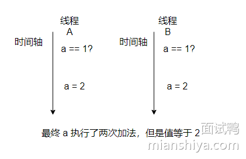

这种情况其实加锁可以解决，但是加锁是比较消耗资源的。

因此硬件层面就给予支持，将这个比较和交换的动作封装成一个指令，这样就保证了原子性，不会判断值确实等于 1，但是替换的时候值已经不等于 1了。

这指令就是 CAS。

CAS 需要三个操作数，分别是旧的预期值(图中的1)，变量内存地址(图中a的内存地址)，新值(图中的2)。

指令是根据变量地址拿到值，比较是否和预期值相等，如果是的话则替换成新值，如果不是则不替换。

### CAS 的优缺点

优点：

- 无锁并发：CAS 操作不使用锁，因此不会导致线程阻塞，提高了系统的并发性和性能。
- 原子性：CAS 操作是原子的，保证了线程安全。

缺点：

- ABA 问题：CAS 操作中，如果一个变量值从 A 变成 B，又变回 A，CAS 无法检测到这种变化，可能导致错误。
- 自旋开销：CAS 操作通常通过自旋实现，可能导致 CPU 资源浪费，尤其在高并发情况下。
- 单变量限制：CAS 操作仅适用于单个变量的更新，不适用于涉及多个变量的复杂操作。

### ABA 问题

ABA 问题是指当变量值从 A 变为 B 再变回 A 时，CAS 操作无法检测到这种变化。解决 ABA 问题的一种常见方法是引入版本号或时间戳，每次更新变量时同时更新版本号，从而检测到变量的变化。

Java 中的 `AtomicStampedReference` 就提供了版本号解决方案，它内部提供了一个 Pair 封装了引用和版本号，利用 `volatile` 保证了可见性。


在内部 CAS 中，添加了版本号的对比：

这样就避免的 ABA 的问题。简单使用示例如下：

```java
private AtomicStampedReference<Integer> atomicStampedReference = new AtomicStampedReference<>(0, 0);

    public void updateValue(int expected, int newValue) {
        int[] stampHolder = new int[1];
        Integer currentValue = atomicStampedReference.get(stampHolder);
        int currentStamp = stampHolder[0];

        boolean updated = atomicStampedReference.compareAndSet(expected, newValue, currentStamp, currentStamp + 1);
        if (updated) {
            System.out.println("Value updated to " + newValue);
        } else {
            System.out.println("Update failed");
        }
    }
```

Java 还提供了一个 `AtomicMarkableReference` 类，原理和 `AtomicStampedReference` 类似，差别就是它内部只要一个 bool 值，只能表示数据是否被修改过。


而`AtomicStampedReference` 中的 stamp 是int，可以表现数据被修改了几次。其它原理都是一致的。

### CAS 在 Java 中的实现

在 Java 中，CAS 操作由 `sun.misc.Unsafe` 类提供，**但该类是内部类**，不推荐直接使用。具体是通过 JNI（Java Native Interface）调用这些底层的硬件指令来实现 CAS 操作，从而确保操作的原子性。


在 Java 中，可以使用并发包中 Atomic 类（如 AtomicInteger、AtomicLong 等），这些类封装了 CAS 操作，提供了线程安全的原子操作：

```java
boolean updated = atomicInteger.compareAndSet(expected, newValue);
    if (updated) {
        System.out.println("Value updated to " + newValue);
    } else {
        System.out.println("Update failed");
    }
```

CAS 操作的底层实现依赖于硬件的原子指令，如 x86 架构上的 cmpxchg 指令。

在 JDK9 之前，会根据当前处理器是否是多处理器在 cmpxchg 前加上 lock 前缀，给对应写指令的内存区域加锁，使得其它处理器无法读写这块内存区域，保证指令执行的原子性。如果是单处理器则不会添加 lock 前缀指令。

但是 JDK9 移除了这个判断，直接添加 lock 前缀指令（基本上市面上都是多处理器了）。

### CAS 总线风暴

lock 前缀指令会把写缓冲区中的所有数据立即刷新到主内存中。

在对称多处理器架构下，每个 cpu 都会通过嗅探总线来检查自己的缓存是否过期。如果某个 cpu 刷新自己的数据到主存，就会通过总线通知其它 cpu 过期对应的缓存，这就实现了内存屏障，保证了缓存一致性。


而通过总线来回通信称为 cache 一致性流量。因为都需要通过总线通信，如果这个流量过大，总线就会成为瓶颈，导致本地缓存更新延迟。

如果 CAS 修改同一个变量并发很高，就会导致总线风暴。这也是 CAS 高并发下的一个性能瓶颈。


## 722.Select、Poll、Epoll 之间有什么区别？ 

### 回答重点

它们都是操作系统中用于多路复用 I/O 的机制：

**`select`**：

- 早期的I/O多路复用机制，使用固定长度的数组表示文件描述符集。每次调用`select`时都需要重新构建和检查文件描述符集。
- **支持的文件描述符数量有限**（通常为1024），在大规模连接的场景下效率较低。

**`poll`**：

- `poll`与`select`类似，但**使用动态数组**来存储文件描述符，因此没有`select`的最大连接数限制。
- **每次调用时仍需遍历全部描述符**，在处理大量连接时效率不高。

**`epoll`**：

- `epoll`是Linux系统对`select`和`poll`的优化，提供了 **边缘触发（ET）和水平触发（LT）** 模式。
- **不会遍历所有文件描述符**，而是通过事件通知的方式，只处理实际发生变化的描述符，适合高并发服务器。
- `epoll`在注册文件描述符后，只需调用一次添加操作，后续的事件管理更高效。

### 扩展知识

#### select

`select`函数使用一个固定大小的位图来表示文件描述符集，通过将文件描述符的状态（如可读、可写）存储在一个数组中，调用`select`时检查这些描述符的状态。

每次调用`select`时，程序需要重新构建位图，并将所有文件描述符集传递给内核检查状态，判断是否有I/O操作就绪。

**局限**：

- **文件描述符限制**：通常为1024（可以通过修改系统参数调整），限制了并发处理的数量。
- **性能低**：在高并发场景中，每次都需要遍历整个文件描述符集进行检查，性能开销大。
- **不适合高并发场景**：随着连接数的增加，`select`的效率会急剧下降，因为每次调用都需要线性扫描整个文件描述符集。

#### poll

`poll`使用一个**动态数组**来管理文件描述符，能够支持更多的连接数。每个文件描述符有一个对应的结构体（`pollfd`），包含文件描述符和事件类型。

调用`poll`时，程序传入的描述符数组会被内核修改，以反映当前文件描述符的状态。

**改进**：

- **打破文件描述符数量限制**：`poll`不再依赖于固定大小的位图，可以支持任意数量的文件描述符。
- **接口更灵活**：比`select`更灵活，适合大部分网络应用场景。

**不足**：

- **每次调用时仍需遍历所有描述符**：即使只有少数描述符发生变化，也需要检查整个数组。
- **性能开销较大**：在大规模并发场景下，性能问题依然存在。

#### epoll

`epoll`使用一个内核空间的事件列表，应用程序可以通过`epoll_ctl`向`epoll`实例注册、修改或删除感兴趣的文件描述符及其事件。

调用`epoll_wait`时，只会返回发生事件的文件描述符，而不是检查所有描述符。

**优势**： 1）**事件驱动模型**：`epoll`基于事件驱动，不再像`select`和`poll`那样需要线性扫描所有描述符。只有当注册的事件发生时，`epoll`才会通知应用程序。

2）**边缘触发与水平触发**：

- **水平触发（LT，Level Triggered）**：是默认模式，类似于`select`/`poll`的工作方式，只要文件描述符上有未处理的数据，每次调用 `epoll_wait` 都会返回该文件描述符
- **边缘触发（ET，Edge Triggered）**：仅在状态发生变化时通知一次，需要用户在事件发生时读取所有数据，否则可能会错过后续事件。减少了重复事件通知的次数，但增加了编程的复杂度，通常需要结合非阻塞 I/O 使用。

3）**内存映射**：`epoll` 通过内存映射(`mmap`)减少了在内核和用户空间之间的数据复制，进一步提高了性能。

#### select 底层原理分析

`select` 的核心数据结构：**文件描述符集合（fd_set）**，用来管理需要监视的文件描述符。

`fd_set` 本质上是一个位图，位图中的每一位对应一个文件描述符的状态。大小为 1024 位（与 `FD_SETSIZE` 定义相关），每一位表示一个文件描述符。位图中的每一位的值为 1 表示该文件描述符需要监视，为 0 表示不需要监视。

再了解下**三种监视类型**，分别存储在不同的 `fd_set` 中：

- **可读事件（readfds）**：监视文件描述符是否有数据可读。
- **可写事件（writefds）**：监视文件描述符是否可写（即是否可以发送数据）。
- **异常事件（exceptfds）**：监视文件描述符上是否有异常情况（如带外数据）。

> `select` 的操作流程如下

1）**构建 `fd_set` 并调用 `select`**：

在调用 `select` 之前，程序需要根据需要监视的文件描述符和事件类型，将文件描述符添加到 `readfds`、`writefds` 或 `exceptfds` 中。

```c
int select(int nfds, fd_set *readfds, fd_set *writefds, fd_set *exceptfds, struct timeval *timeout);
```

- **nfds**：表示要监视的文件描述符的最大值加 1。系统会检查文件描述符的范围 `[0, nfds)`。
- **readfds**、**writefds**、**exceptfds**：分别表示要监视的可读、可写、异常的文件描述符集合。
- **timeout**：指定 `select` 的超时时间，可以是阻塞（`NULL`）、立即返回（`timeout` 为 0）、或指定等待的时间。

2）**进入内核态进行检查**： 调用 `select` 后，程序进入内核态。内核会扫描 `fd_set` 中的每一个文件描述符，并检查对应的状态是否符合监视的事件。

内核会遍历所有传入的 `fd_set`，检查每个文件描述符是否处于可读、可写或异常状态。如果有符合条件的描述符，内核将其标记为就绪。

3）**阻塞等待或超时**：

如果在遍历所有文件描述符时，没有任何描述符符合就绪条件，则 `select` 调用会根据 `timeout` 参数进行阻塞等待。

- **阻塞等待**：如果 `timeout` 为 `NULL`，`select` 会无限期地等待，直到有文件描述符变为就绪。
- **超时返回**：如果 `timeout` 为 0，`select` 会立即返回，表示非阻塞调用。如果 `timeout` 指定了时间，则等待指定的时间后仍然无事件发生时返回。

4）**返回就绪的文件描述符**：

当 `select` 发现有文件描述符就绪时，内核会将这些文件描述符的状态写回到 `readfds`、`writefds`、`exceptfds` 中，并返回就绪的文件描述符数量。

程序可以通过遍历更新后的 `fd_set`，找到哪些文件描述符发生了事件，并执行相应的处理操作。

#### poll 底层原理分析

`poll` 的核心数据结构：**`pollfd` 结构体数组**。

`poll` 通过一个数组来管理需要监视的文件描述符，每个数组元素是一个 `pollfd` 结构体。该结构体描述了需要监听的文件描述符及其关注的事件类型。

```c
struct pollfd {
    int fd;        // 文件描述符
    short events;  // 感兴趣的事件
    short revents; // 实际发生的事件
};
```

- **`fd`**：表示需要监视的文件描述符。
- **`events`**：表示该文件描述符上用户感兴趣的事件，如可读（`POLLIN`）、可写（`POLLOUT`）、出错（`POLLERR`）等。
- **`revents`**：用于在 `poll` 返回后表示实际发生的事件，由内核填充。

再了解下**事件类型**，通过设置 `events` 字段来指定感兴趣的事件：

- **`POLLIN`**：文件描述符上有可读数据。
- **`POLLOUT`**：文件描述符上可以写数据。
- **`POLLERR`**：文件描述符上发生错误。

- **`POLLHUP`**：文件描述符上发生挂起。
- **`POLLPRI`**：文件描述符上有紧急数据可读。

> `poll` 的操作流程如下

1）**构建 `pollfd` 数组并调用 `poll`**：

需要先构建一个 `pollfd` 数组，并在数组中指定需要监视的文件描述符和感兴趣的事件。

```c
int poll(struct pollfd *fds, nfds_t nfds, int timeout);
```

- **`fds`**：指向 `pollfd` 结构体数组的指针。
- **`nfds`**：表示数组中元素的数量（即需要监视的文件描述符的数量）。
- **`timeout`**：指定 `poll` 等待的超时时间，以毫秒为单位。

2）**进入内核态进行检查**： 调用 `poll` 后，程序会从用户态切换到内核态。内核会遍历 `fds` 数组中的所有文件描述符，检查它们的状态是否与 `events` 字段中的感兴趣事件匹配。

内核会逐一检查每个文件描述符，判断其当前状态是否有数据可读、可写，或是否发生了错误等。

3）**阻塞等待或超时**： 如果在遍历过程中，没有找到任何就绪的文件描述符，则 `poll` 会根据 `timeout` 参数进行阻塞等待。

- **阻塞等待**：如果 `timeout` 为 `-1`，`poll` 会无限期地等待，直到有文件描述符的状态发生变化。
- **非阻塞调用**：如果 `timeout` 为 0，`poll` 会立即返回，即使没有文件描述符发生状态变化。

4）**更新 `revents` 字段并返回**：

当文件描述符的状态与指定的 `events` 匹配时，`poll` 会将实际发生的事件写入 `revents` 字段。

`poll` 返回时，会返回就绪文件描述符的数量，程序可以遍历 `fds` 数组，检查 `revents` 字段以确定哪些文件描述符发生了事件。

#### epoll 底层原理分析

首先了解下两个核心数据结构：

1）**红黑树**（用于管理注册的文件描述符）：

- `epoll` 通过一棵红黑树来存储和管理注册到 `epoll` 实例中的文件描述符。红黑树的特性使得在插入、删除、查找文件描述符时，操作的时间复杂度为 `O(log N)`，其中 `N` 是注册的文件描述符数量。
- 每次调用 `epoll_ctl` 添加（`EPOLL_CTL_ADD`）、修改（`EPOLL_CTL_MOD`）或删除（`EPOLL_CTL_DEL`）文件描述符时，都会对这棵红黑树进行操作，以维护文件描述符和其感兴趣事件的对应关系。

2）**就绪事件链表**（用于存储触发的事件）：

- `epoll` 使用一个双向链表（就绪列表）存储所有发生了事件变化的文件描述符。当某个文件描述符上的事件就绪（如可读、可写）时，`epoll` 会将该文件描述符添加到就绪链表中。
- 当调用 `epoll_wait` 时，系统会检查这个链表，并将其中就绪的文件描述符返回给用户。由于只需要遍历就绪的文件描述符，`epoll_wait` 的性能与注册的文件描述符总数无关，而是与就绪的描述符数目相关。

> epoll 的操作流程如下

1）**创建 `epoll` 实例**（`epoll_create`）：

- `epoll_create` 调用会在内核中创建一个 `epoll` 实例，分配相应的数据结构，并返回一个 `epoll` 文件描述符。此时，内核会分配一棵红黑树用于管理文件描述符，以及一个就绪事件的链表。

2）**注册、修改、删除事件**（`epoll_ctl`）：`epoll_ctl` 是 `epoll` 用于管理文件描述符与事件关系的接口。

它有三种操作模式：

- **`EPOLL_CTL_ADD`**：将一个文件描述符添加到 `epoll` 实例中，并指定关注的事件类型（如 `EPOLLIN`、`EPOLLOUT` 等）。这个操作会将文件描述符和相关事件添加到红黑树中。
- **`EPOLL_CTL_MOD`**：修改已经注册的文件描述符的事件类型，这会更新红黑树中的相应节点。
- **`EPOLL_CTL_DEL`**：将文件描述符从 `epoll` 实例中移除，这会从红黑树中删除对应的节点，并清理关联的数据。

3）**等待事件**（`epoll_wait`）：

- 调用 `epoll_wait` 时，内核会检查就绪事件链表，将链表中所有就绪的文件描述符返回给用户空间。
- 如果就绪链表为空，`epoll_wait` 会将调用线程挂起，直到有新的事件发生或超时时间到达为止。
- `epoll_wait` 的高效性主要得益于它返回的是已经发生事件的文件描述符，而不是遍历所有注册的文件描述符。

## 82.什么是 MyBatis-Plus？它有什么作用？它和 MyBatis 有哪些区别？ 

### 回答重点

MyBatis 是一个半 ORM（对象关系映射）框架，它内部封装了 JDBC，使用它后，开发者只需要关注 SQL 语句本身，不需要花费精力去处理加载驱动、创建连接、创建 statement 等繁杂的过程，提高开发效率。

MyBatis-Plus 是 MyBatis 的增强版框架（就像魂斗罗兄弟一样），它对 MyBatis 进行了 二次封装 ，只做增强不做改变。通过提供一系列的 API 方法和代码生成器，使重复的 CRUD（创建、读取、更新、删除）操作更加简单，无需手动编写 SQL 语句，从而 大幅提高开发效率 。

此外，还有一些其他优点。比如：

1. 提供了条件构造器，可以通过编程方式构建复杂的查询条件，无需编写繁琐的 SQL 语句
2. 提供了分页查询支持，无需手动编写分页逻辑
3. 提供了一个代码生成器工具，可以根据数据库表自动生成 Java 实体类、Mapper 接口和 XML 映射文件，减少了手工编写的工作量。

使用 MyBatis Plus 前，需要自己编写 SQL Mapper 映射文件和语句：

```xml
<!-- userMapper.xml -->
<mapper namespace="com.demo.dao.UserMapper">
  <select id="getUserById" parameterType="java.lang.Integer" resultType="com.demo.entity.User">
    select * from t_user where id=#{id}
  </select>
</mapper>
```

使用 MyBatis Plus 后，定义接口继承 BaseMapper 接口并调用其中提供的现成方法即可：

```java
public interface UserMapper extends BaseMapper<User> {
}
```

##  509.为什么 Java 中的 ThreadLocal 对 key 的引用为弱引用？ 

### 回答重点

使用弱引用作为 `ThreadLocal` 的键可以**防止内存泄漏**。若 `ThreadLocal` 实例被不再需要的线程持有为强引用，那么当该线程结束时，相关的 `ThreadLocal` 实例及其对应的数据可能无法被回收，导致内存持续占用。

而弱引用允许垃圾回收器在内存不足时回收对象。这样，当没有其他强引用指向某个 `ThreadLocal` 实例时，它可以被及时回收，避免长时间占用内存。

### 扩展知识

#### 详细分析

那为什么要这样设计呢？

假设 Entry 对 key 的引用是强引用，那么来看一下这个引用链：


从这条引用链可以得知，如果线程一直在，那么相关的 ThreadLocal 对象肯定会一直在，因为它一直被强引用着。

看到这里，可能有人会说那线程被回收之后就好了呀。

重点来了！线程在我们应用中，常常是以线程池的方式来使用的，比如 Tomcat 的线程池处理了一堆请求，而线程池中的线程一般是不会被清理掉的，所以这个引用链就会一直在，那么 ThreadLocal 对象即使没有用了，也会随着线程的存在，而一直存在着！

所以这条引用链需要弱化一下，而能操作的只有 Entry 和 key 之间的引用，所以它们之间用弱引用来实现。

与之对应的还有一个条引用链，我结合着上面的线程引用链都画出来：


另一条引用链就是栈上的 ThreadLocal 引用指向堆中的 ThreadLocal 对象，这个引用是强引用。

如果有这条强引用存在，那说明此时的 ThreadLocal 是有用的，此时如果发生 GC 则 ThreadLocal 对象不会被清除，因为有个强引用存在。

当随着方法的执行完毕，相应的栈帧也出栈了，此时这条强引用链就没了，如果没有别的栈有对 ThreadLocal 对象的引用，那么说明 ThreadLocal 对象无法再被访问到(定义成静态变量的另说)。

那此时 ThreadLocal 只存在与 Entry 之间的弱引用，那此时发生 GC 它就可以被清除了，因为它无法被外部使用了，那就等于没用了，是个垃圾，应该被处理来节省空间。

至此，想必你已经明白为什么 Entry 和 key 之间要设计为弱引用，就是因为平日线程的使用方式基本上都是线程池，所以线程的生命周期就很长，可能从你部署上线后一直存在，而 ThreadLocal 对象的生命周期可能没这么长。

所以为了能让已经没用 ThreadLocal 对象得以回收，所以 Entry 和 key 要设计成弱引用，不然 Entry 和 key 是强引用的话，ThreadLocal 对象就会一直在内存中存在。

但是这样设计就可能产生内存泄漏。

那什么叫**内存泄漏**？就是指：程序中已经无用的内存无法被释放，造成系统内存的浪费。

当 Entry 中的 key 即 ThreadLocal 对象被回收了之后，会发生 Entry 中 key 为 null 的情况，其实这个 Entry 就已经没用了，但是又无法被回收，因为有 Thread->ThreadLocalMap ->Entry 这条强引用在，这样没用的内存无法被回收就是内存泄露。

> 那既然会有内存泄漏还这样实现？

设计者当然知道会出现这种情况，所以在多个地方都做了清理无用 Entry ，即 key 已经被回收的 Entry 的操作。

比如通过 key 查找 Entry 的时候，如果下标无法直接命中，那么就会向后遍历数组，此时遇到 key 为 null 的 Entry 就会清理掉，再贴一下这个方法：


这个方法也很简单，我们来看一下它的实现：


所以在查找 Entry 的时候，就会顺道清理无用的 Entry ，这样就能防止一部分的内存泄露啦！

还有像扩容的时候也会清理无用的 Entry：


其它还有，我就不贴了，反正知晓设计者是做了一些操作来回收无用的 Entry 的即可。

#### 如果将 value 也设置为弱引用，是否可以防止内存泄漏？

答案肯定是可以的。value 一般都是局部变量赋值，栈帧出栈后，局部变量的强引用没了，如果 Entry 对其是弱引用，那么发生一次 gc 后 value 就被回收了，肯定没内存泄漏问题。

但是一次 gc 就没了，等用到的时候不就找不到 value 了？**所以 value 不能被设置为弱引用**。

#### 强引用、软引用、弱引用和虚引用

- [532. Java 中的强引用、软引用、弱引用和虚引用分别是什么？](https://www.mianshiya.com/question/1780933295211573249)

## 522.编译执行与解释执行的区别是什么？JVM 使用哪种方式？ 

### 回答重点

**编译执行**：是指程序在执行之前，首先通过编译器将源代码编译为机器代码，然后直接在 CPU 上运行。常见的编译语言如 C、C++。

- **优点**：编译后的程序运行速度快，因为机器代码是针对目标平台直接生成的，且不需要在运行时再进行翻译。
- **缺点**：程序必须针对每个平台重新编译，跨平台性差；另外，编译后生成的机器代码难以调试和逆向工程。

**解释执行**：解释执行是指源代码不经过编译器的预先编译，而是在运行时通过解释器逐行翻译并执行。常见的解释语言如 Python、Ruby。

- **优点**：跨平台性好，因为代码在每个平台上都是通过相应平台的解释器来运行的，且开发周期更短。
- **缺点**：运行速度较慢，因为每次执行时都需要进行动态翻译和解释。

**JVM** 采用**编译执行**和**解释执行**相结合的方式：

- **解释执行**：JVM 会逐行解释执行字节码，尤其是程序初次运行时，这种方式有助于程序的跨平台性。
- **即时编译（JIT）**：JVM 引入了即时编译器（Just-In-Time Compiler），在程序运行时将热代码（经常执行的代码）编译为本地机器码，避免反复解释，提升性能。因此，JVM 实际上是混合使用解释执行和编译执行。

### 扩展知识

#### 通俗理解

我们以英文阅读的角度来看解释执行和编译执行。

例如英文不好的人，看英文的时候会在脑海中翻译成中文，然后才能知晓其意思，这就是**解释执行**。

如果有个人把英文翻译成中文，然后直接给我看，这就叫**编译执行**。

从描述我们也可以得知编译执行的效率比较高，它仅需在前期花点时间“翻译”下，后期就不要在实时翻译了。

JVM 是哪个呢？**都有！**

正常情况下 JVM 是解释执行，但是如果 JVM 发现这段逻辑执行特别频繁，是个热点代码，那么就会把它就会通过 JIT (JUST IN TIME) 即时编译将其直接编译成机器码，这样就是编译执行了。

#### JIT 和 AOT

- [529. 什么是 Java 中的 JIT（Just-In-Time）?](https://www.mianshiya.com/bank/1789931432793948162/question/1780933295194796033)
- [530. 什么是 Java 的 AOT（Ahead-Of-Time）？](https://www.mianshiya.com/bank/1789931432793948162/question/1780933295194796034)

## 641.Redis 支持事务吗？如何实现？ 

### 回答重点

Redis 支持事务，**但它的事务与 MySQL 中的事务有所不同**。MySQL 中的事务主要支持 ACID 的特性，而 Redis 中的事务主要保证的是多个命令执行的原子性，即所有的命令在一个原子操作中执行，不会被打断。

还有一个很重要的点，就是 **MySQL 中的事务是支持回滚的，而 Redis 中的事务是不支持回滚的**。

### 扩展知识

#### Redis 的事务

Redis 支持事务，通过使用 `MULTI`、`EXEC`、`WATCH` 和 `DISCARD` 等命令来实现。事务中的命令会被排队并在调用 `EXEC` 时一次性执行，保证了事务的原子性。

具体实现流程如下：

1. **开始事务**：使用 `MULTI` 命令开始一个事务，之后的所有命令都会被排队。
2. **添加命令**：在事务中添加命令，这些命令不会立即执行，而是存储在队列中。
3. **执行事务**：使用 `EXEC` 命令执行队列中的所有命令，确保原子性。
4. **取消事务**：使用 `DISCARD` 命令可以放弃事务，清空命令队列。
5. **监视键**：使用 `WATCH` 命令可以监视一个或多个键，如果在事务执行前这些键被修改，则 `EXEC` 将不会执行，确保数据一致性。

#### Redis 事务不支持回滚功能

Redis 事务一旦执行，所有命令都会被应用到数据中，即使其中某个命令失败。因此，在设计时需充分考虑可能的错误。

Redis 官网也进行了相关描述，如下图所示：


从 Redis 2.6.5 开始，服务器会在累计命令的过程中检测到错误，此时执行 EXEC 会拒绝执行事务，并且返回一个错误，同时求丢该事务。

但如果事务执行的过程中发生了错误，**Redis 会继续执行剩下的命令，而不会对事务进行回滚**，这个是 Redis 和 MySQL 最不一样的地方，并且也**不支持多种隔离级别的设置**，因为 Redis 是单线程执行，只能是串行隔离级别。

可以认为 Redis 的事务是一个残血的事务，**更多只是一个噱头，不是我们平时理解的事务**。

## 669.到底什么是 TCP 连接？ 

### 回答重点

根据 [RFC793](https://www.rfc-editor.org/rfc/rfc793) 定义，TCP 的连接就是：TCP 为每个数据流初始化并维护的某些状态信息（这些信息包括 socket、序列号和窗口大小），称为连接。

这些信息主要是为了实现可靠性和流量控制机制。


所以 TCP 所谓的是、面向连接的并不是真的是拉了一条线让端与端之间连起来，只是双方都维护了一个状态，通过每一次通信来维护状态的变更，使得看起来好像有一条线关联了对方。

### 扩展知识

#### TCP 中的 Socket、序列号和窗口大小

1）**Socket**:

在 TCP/IP 协议中，`Socket` 是通信的端点。由 IP 地址和端口号组成，如 `192.168.1.1:8080`。在编程中，Socket 是用于网络通信的接口，通过它，应用程序可以发送和接收数据。

2）**序列号 (Sequence Number)**:

TCP 序列号在传输过程中非常关键，因为它保证了数据传输的有序性和完整性。在三次握手中，双方交换初始序列号 (ISN)，并在此基础上为后续的每个数据段分配序列号。

序列号有助于接收方按顺序重组数据包，并检测丢包情况。

3）**窗口大小 (Window Size)**:

TCP 窗口大小指的是在特定时刻，接收方能够接收的最大数据量。这个大小由接收方通知发送方，表明接收方的缓冲区能处理多少数据。

它直接影响 TCP 的流量控制和拥塞控制机制。通过调整窗口大小，TCP 可以避免发送过多数据导致接收方的缓冲区溢出，也能根据网络状况调整发送速率。

#### 什么是三元组和四元组？

1）**三元组 (3-tuple)**:

三元组指的是 IP 地址和端口号的组合，即 `IP 地址 + 端口号 + 协议类型`。例如，`192.168.1.1:8080 (TCP)` 就是一个三元组。在一个机器上，这样的组合唯一标识了一个网络服务或应用程序。

2）**四元组 (4-tuple)**:

四元组即 `源 IP 地址 + 源端口号 + 目的 IP 地址 + 目的端口号`。**这四个要素唯一标识了一个 TCP 连接。**

例如，一个客户端通过 IP 地址 `192.168.1.100` 和端口 `50000` 连接到服务器 `192.168.1.1` 的端口 `80`，则这个连接可以表示为 `192.168.1.100:50000 -> 192.168.1.1:80`。

这就是一个四元组，唯一标识了该连接。

##  1131.如何处理重复消息？ 

### 回答重点

只有让消费者的处理逻辑具有**幂等性**，保证无论同一条消息被消费多少次，结果都是一样的，从而避免因重复消费带来的副作用。

### 扩展知识

#### 什么是幂等性

幂等性是指一个操作无论执行多少次，产生的结果都是一样的。例如，HTTP 的 PUT 方法是幂等的，因为无论对同一资源执行多少次 PUT 操作，结果都是相同的。

例如这条 SQL:

```sql
update t1 set money = 150 where id = 1 and money = 100;
```

执行多少遍 money 都是 150，这就叫幂等。

#### 如何幂等处理重复消息

需要改造业务处理逻辑，使得在重复消息的情况下也不会影响最终的结果。

主要是**利用唯一标识（ID）去重**。

在消息中引入全局唯一 ID，例如 UUID、订单号等，利用 redis 等缓存，或者数据库来存储消息 ID，然后消费者在处理消息时可以检查该消息 ID 是否存在代表此消息是否已经处理过。

**去重缓存的使用**：

- 使用 Redis 等缓存系统存储已经处理的消息 ID，以减少数据库的查询压力。
- 可以为 Redis 中的去重记录设置过期时间，例如 7 天，以便自动清理历史消息，减小存储压力。

**去重表的设计**：

- 在数据库中创建一张去重表，用来存储已处理消息的 ID 及处理时间。在消费每条消息前，先查询该表。
- 对于高并发场景，可以结合数据库的唯一索引来避免多次插入同一个消息 ID（`insert into update on duplicate key...`），确保去重表中的记录唯一。

此外，一些触发数据库修改操作的消息，可以像上述举例的 SQL 一样，做了个**前置条件判断**，即 money = 100 这样的条件直接修改，这样无论执行多少次都不影响。更通用的是做个 version 即版本号控制，对比消息中的版本号和数据库中的版本号。

#### 可以从源头消除重复消息吗？即消费者仅会接收到一条消息


看下上面的图，我们来分析下看能不能避免消息的重复。

假设我们发送消息只管发，不管 Broker 的响应，那么我们发往 Broker 的消息是不会重复的。

但是一般情况我们是不允许这样的，因为这样无法保证消息的可靠性。

我们的基本需求是消息至少得发到 Broker 上，要确定 Broker 收到消息就得等 Broker 的响应，那么就可能存在 Broker 已经写入了，但是响应由于网络原因生产者没有收到，于是生产者又重发了一次，此时消息就重复了。

再看消费者消费的时候，假设我们消费者拿到消息消费了，业务逻辑已经走完了，事务提交了，此时需要更新 Consumer offset 了（告诉 Broker 这条消息我消费过了）。

但是就这这一刻这个消费者挂了，此时还未更新 Consumer offset。另一个消费者顶上，因为 Consumer offset 还没更新，于是新的消费者又拿到刚才那条消息，业务又被执行了一遍，这样消息不就重复了吗？

可以看到，对平常业务而言**消息重复是不可避免**的，因此我们只能从**另一个角度**来解决重复消息的问题。

关键点就是**幂等**。既然我们不能防止重复消息的产生，那么我们只能在业务上处理重复消息所带来的影响。

## 518.Java 中什么情况会导致死锁？如何避免？ 

### 回答重点

这是一个非常典型的八股文，即操作系统中的经典理论，死锁的发生必须满足以下四个条件，这些条件被称为“死锁的必要条件”：

1. 互斥条件：每个资源只能被一个线程占用。
2. 占有和等待：线程在持有至少一个资源的同时，等待获取其他资源。
3. 不可抢占：线程所获得的资源在未使用完毕之前不能被其他线程抢占。
4. 循环等待：多个线程形成一种头尾相接的循环等待资源关系。

只要我们打破上述的一个条件，就能避免死锁的发生。

### **避免死锁的方法**

1. **按序申请资源**：确保所有线程在获取多个锁时，按照相同的顺序获取锁。
2. **尽量减少锁的范围**：将锁的粒度尽可能缩小，减少持有锁的时间。可以通过拆分锁或使用更细粒度的锁来实现。
3. **使用尝试锁机制**：使用 `ReentrantLock` 的 `tryLock` 方法，尝试在一段时间内获取锁，如果无法获取，则可以选择放弃或采取其他措施，避免死锁。
4. **设置超时等待时间**：为锁操作设置超时，防止线程无限期地等待锁。
5. **避免嵌套锁**：尽量避免在一个锁的代码块中再次尝试获取另一个锁。

## 1138.如何保证消息的有序性？ 

### 回答重点

保证消息有序性的常见方法如下：

**单一生产者和单一消费者**：

- 使用单个生产者发送消息到**单个队列**，并由单个消费者处理消息。这样可以确保消息按照生产者的发送顺序消费。
- 这种方法简单但容易成为**性能瓶颈**，无法充分利用并发的优势。

**分区与顺序键（Partition Key）**：

- 在支持**分区（Partition）** 的消息队列中（如 Kafka、RocketMQ），可以通过 **Partition Key** 将消息发送到特定的分区。每个分区内部是**有序的**，这样可以保证相同 Partition Key 的消息按顺序消费。
- 例如，在订单处理系统中，可以使用订单号作为 Partition Key，将同一个订单的所有消息路由到同一个分区，确保该订单的消息顺序。

**顺序队列（Ordered Queue）**：

- 一些消息队列系统（如 RabbitMQ）支持顺序队列，消息在队列中的存储顺序与投递顺序一致。**如果使用单个顺序队列**，消息将按顺序被消费。
- 可以使用多个顺序队列来提高并发处理能力，并使用特定规则将消息分配到不同的顺序队列中。

### 扩展知识

#### 不同消息队列的顺序性保证

**Kafka**：Kafka 中的消息在**分区**内部是有序的。生产者在发送消息时，可以指定分区（Partition）。如果所有相同 Key 的消息都发送到同一个分区，则可以保证这些消息的顺序。

- 通过配置生产者的**hash**函数，可以将同一类型的消息发送到相同的分区，保证顺序。
- 在消费端，使用**单线程消费者**从特定分区读取消息，可以确保消费的顺序性。

**RabbitMQ**：RabbitMQ 通过单个队列可以保证消息的顺序，如果消息需要并发消费，则需要将其路由到不同的**顺序队列**中。

- 使用**Message Grouping**技术，将具有相同属性的消息分组到一个队列中，以确保组内消息的顺序。
- 通过**自定义路由策略**，可以将同一业务逻辑的消息发送到相同的队列，从而保证顺序。

**RocketMQ**：RocketMQ 支持**顺序消息**（Ordered Messages），生产者可以使用 `send` 方法将消息发送到指定的分区队列，并使用**Message Queue Selector**来选择目标队列（本质的实现和 kafka 是一样的）。

- 消费者端通过**顺序消费模式**，可以从同一个消息队列中按顺序读取消息，确保消息的顺序性。
- 通过指定 Message Queue 的选择算法（如按订单 ID 对队列数取模），可以将同一订单的所有消息投递到相同的队列中。

#### 有序消息之全局有序

如果要保证消息的**全局有序**，首先只能由一个生产者往 Topic 发送消息，并且一个 Topic 内部只能有一个队列（分区）。消费者也必须是单线程消费这个队列。这样的消息就是全局有序的！

不过一般情况下我们都不需要全局有序，即使是同步 MySQL Binlog 也只需要保证**单表**消息有序即可。


#### 有序消息之部分有序

绝大部分的有序需求是部分有序，部分有序我们就可以将 Topic 内部划分成我们需要的队列数，把消息通过特定的策略发往固定的队列中，然后每个队列对应一个单线程处理的消费者。

这样即完成了部分有序的需求，又可以通过队列数量的并发来提高消息处理效率。


图中我画了多个生产者，一个生产者也可以，只要同类消息发往指定的队列即可。

使用**顺序消息**在 Kafka 和 RocketMQ 中的实现方式略有不同，下面是针对这两种消息队列的顺序消息实现的详细示例。

#### Kafka 顺序消息示例

假设场景是一个订单系统，我们希望保证同一订单 ID 的消息按照顺序被消费。通过将**相同的业务 Key（订单 ID）\**的消息发送到同一个\**分区（Partition）**，可以保证这些消息在分区内部的顺序性。消费时，同一个分区的数据按顺序消费，就能保证了消息的有序性。

##### 生产者代码

```java
//忽略相关配置
KafkaProducer<String, String> producer = new KafkaProducer<>(props);

String orderId = "order-123";

for (int i = 1; i <= 5; i++) {
    String value = "Order Step " + i + " for " + orderId;
    // 使用订单 ID 作为 Key，确保相同订单的消息发送到同一个分区
    ProducerRecord<String, String> record = new ProducerRecord<>(TOPIC, orderId, value);

    RecordMetadata metadata = producer.send(record).get();
}
```

##### 消费者代码

```java
KafkaConsumer<String, String> consumer = new KafkaConsumer<>(props);
consumer.subscribe(Collections.singletonList(TOPIC));

while (true) {
    ConsumerRecords<String, String> records = consumer.poll(Duration.ofSeconds(1));
    for (ConsumerRecord<String, String> record : records) {
        System.out.printf("Consumed message: %s from partition: %d, offset: %d\n",
                record.value(), record.partition(), record.offset());
    }
}
```

- **生产者**：使用 `orderId` 作为 `key`，Kafka 根据这个 `key` 将消息发送到同一个分区。这样可以确保相同 `orderId` 的消息被发送到同一个分区，从而保证顺序。
- **消费者**：从 Kafka 的 `order-topic` 中读取消息，因为 Kafka 的分区内部消息是有序的，消费者将按照 `orderId` 的顺序消费这些消息。

#### RocketMQ 顺序消息示例

在 **RocketMQ** 中，可以通过**消息队列选择器**（`MessageQueueSelector`）将消息发送到指定的队列，从而实现顺序消费

##### 生产者代码

```java
String orderId = "order-123";

for (int i = 1; i <= 5; i++) {
    String body = "Order Step " + i + " for " + orderId;
    Message message = new Message("OrderTopic", body.getBytes(StandardCharsets.UTF_8));

    // 使用 MessageQueueSelector 按照 orderId 选择队列
    SendResult sendResult = producer.send(message, new MessageQueueSelector() {
        @Override
        public MessageQueue select(List<MessageQueue> mqs, Message msg, Object arg) {
            // 将 orderId 转为 hash 值，以决定消息发往哪个队列
            String orderId = (String) arg;
            int index = orderId.hashCode() % mqs.size();
            return mqs.get(Math.abs(index));
        }
    }, orderId);
}
```

##### 消费者代码

```java
// 使用并发消费消息监听器，保证单队列内的顺序性
consumer.registerMessageListener((MessageListenerConcurrently) (msgs, context) -> {
    for (MessageExt msg : msgs) {
        String body = new String(msg.getBody());
        System.out.printf("Consumed message: %s from queue: %d\n", body, msg.getQueueId());
    }
    return ConsumeConcurrentlyStatus.CONSUME_SUCCESS;
});
```

- **生产者**：使用 `MessageQueueSelector` 将具有相同 `orderId` 的消息发送到同一个消息队列（`MessageQueue`），确保这些消息被发送到同一队列，从而保证顺序。
- **消费者**：通过 `DefaultMQPushConsumer` 订阅 `OrderTopic`，RocketMQ 保证每个队列中的消息是按顺序消费的。只要相同订单 ID 的消息在同一队列中，就可以保证它们的消费顺序。

在 **RabbitMQ** 中，保证消息的顺序性可以通过以下方式实现：

- **单个队列单个消费者**：将消息发送到一个队列中，并使用单个消费者进行消费，这样可以确保消息按照生产者发送的顺序被消费。
- **多队列顺序性保证**：可以根据某个业务 Key（例如订单 ID）选择队列，从而保证具有相同业务 Key 的消息总是发送到同一个队列，由一个消费者按顺序处理。

下面的示例演示了**RabbitMQ 顺序消息的实现**，通过将所有相同订单 ID 的消息发送到同一个队列中，以确保消息的顺序。

#### RabbitMQ 顺序消息示例

##### 生产者代码

```java
try (Connection connection = factory.newConnection();
     Channel channel = connection.createChannel()) {
    // 声明队列（如果不存在则创建）
    channel.queueDeclare(QUEUE_NAME, true, false, false, null);

    String orderId = "order-123";

    for (int i = 1; i <= 5; i++) {
        String message = "Order Step " + i + " for " + orderId;
        // 发送消息
        channel.basicPublish("", QUEUE_NAME, null, message.getBytes("UTF-8"));
        System.out.println("Sent: " + message);
    }
}
```

##### 消费者代码

```java
try (Connection connection = factory.newConnection();
     Channel channel = connection.createChannel()) {
    // 声明队列（如果不存在则创建）
    channel.queueDeclare(QUEUE_NAME, true, false, false, null);

    // 创建消费者，并定义处理逻辑
    DeliverCallback deliverCallback = (consumerTag, delivery) -> {
        String message = new String(delivery.getBody(), "UTF-8");
        System.out.println("Received: " + message);

        // 模拟消息处理逻辑
        try {
            Thread.sleep(500); // 模拟处理延迟
        } catch (InterruptedException e) {
            e.printStackTrace();
        }

        // 发送手动确认
        channel.basicAck(delivery.getEnvelope().getDeliveryTag(), false);
    };

    // 开始消费消息（手动确认模式）
    channel.basicConsume(QUEUE_NAME, false, deliverCallback, consumerTag -> { });
}
```

- **单个消费者**：此示例中使用了单个消费者处理消息，确保消息按照发送顺序被消费。对于顺序性要求高的业务，通常只使用一个消费者进行处理。

#### RabbitMQ 方案扩展：多队列+顺序消费

在某些场景下，单个队列和单个消费者的方式可能会因为性能问题无法满足业务需求。我们可以通过多队列的方式，将不同业务 Key 的消息发送到不同的队列中，以提高并发处理能力，同时保证每个 Key 的消息顺序。

- **将消息分配到不同的队列**：例如，可以使用订单 ID 的哈希值，将订单消息发送到多个不同的队列。
- **每个队列使用一个消费者**：确保同一个队列中的消息按顺序被消费。每个消费者只负责处理一个队列中的消息。

##### 多队列的生产者

```java
try (Connection connection = factory.newConnection();
     Channel channel = connection.createChannel()) {

    String orderId = "order-123";
    int numberOfQueues = 3; // 假设有 3 个队列
    int queueIndex = Math.abs(orderId.hashCode() % numberOfQueues);
    String queueName = QUEUE_PREFIX + queueIndex;

    // 声明队列（如果不存在则创建）
    channel.queueDeclare(queueName, true, false, false, null);

    for (int i = 1; i <= 5; i++) {
        String message = "Order Step " + i + " for " + orderId;
        channel.basicPublish("", queueName, null, message.getBytes("UTF-8"));
        System.out.println("Sent: " + message + " to " + queueName);
    }
}
```

##### 多队列的消费者

```java
try (Connection connection = factory.newConnection();
     Channel channel = connection.createChannel()) {
    String queueName = QUEUE_PREFIX + QUEUE_INDEX;

    channel.queueDeclare(queueName, true, false, false, null);
    System.out.println("Waiting for messages in " + queueName);

    DeliverCallback deliverCallback = (consumerTag, delivery) -> {
        String message = new String(delivery.getBody(), "UTF-8");
        System.out.println("Received: " + message);

        // 模拟处理逻辑
        try {
            Thread.sleep(500);
        } catch (InterruptedException e) {
            e.printStackTrace();
        }

        channel.basicAck(delivery.getEnvelope().getDeliveryTag(), false);
    };

    channel.basicConsume(queueName, false, deliverCallback, consumerTag -> { });
}
```

- **多队列方案**：生产者根据业务 Key（如订单 ID）的哈希值，将消息发送到不同的队列（如 `order_queue_0`、`order_queue_1`、`order_queue_2`）。这种方法可以提高并发处理能力，因为每个队列可以有一个独立的消费者。
- **每个消费者处理一个队列**：消费者从指定的队列中消费消息，确保每个队列内的消息按顺序消费。

## 1468. 说一下 Netty 的应用场景？ 

### 回答重点

Netty 的应用场景主要有以下几个：

- 许多框架底层通信的实现，比如说 RocketMQ、Dubbo、Elasticsearch、Cassandra 等，底层都使用到了 Netty。
- 游戏行业，在游戏服务器开发中，Netty 用于处理大量并发的游戏客户端连接，提供低延迟的网络通信能力
- 实现一个通讯系统，比如聊天室、IM 等，处理高并发的实时消息传输。
- 物联网即 IOT 场景，Netty 可用于设备与服务器之间的通信，处理设备数据的收集和命令下发。

## 563.什么是 Spring IOC？ 

### 回答重点

Spring IOC（Inversion of Control，控制反转）是 Spring 框架的核心概念之一。它是通过**依赖注入（Dependency Injection）** 实现的。IOC 让对象的创建与管理职责由容器负责，而不是由对象自身控制。

- **核心思想**：控制反转意味着将对象的创建和依赖关系交由 Spring 容器管理，而不是由程序代码直接控制。这种机制使得程序更加灵活和解耦，提升了代码的可维护性和扩展性。
- **依赖注入**：通过构造器注入、setter 注入或接口注入，将对象所需的依赖传递给它，而不是让对象自行创建依赖。

### 扩展知识

#### 理解控制和反转

IOC，即 Inversion of Control，控制反转。

首先要明确 IOC 是一种思想，而不是一个具体的技术，其次 IOC 这个思想也不是 Spring 创造的。

然后我们要理解到底**控制**的是什么，其实就是**控制对象的创建**，IOC 容器根据配置文件来创建对象，在对象的生命周期内，在**不同时期**根据不同配置进行对象的创建和改造。

那什么被**反转**了？其实就是关于创建对象且注入依赖对象的这个动作，本来这个动作是由我们程序员在代码里面指定的，例如对象 A 依赖对象 B，在创建对象 A 代码里，我们需要写好如何创建对象 B，这样才能构造出一个完整的 A。

而反转之后，这个动作就由 IOC 容器触发，IOC 容器在创建对象 A 的时候，发现依赖对象 B ，根据配置文件，它会创建 B，并将对象 B 注入 A 中。

这里要注意，注入的不一定非得是一个对象，也可以注入配置文件里面的一个值给对象 A 等等。

至此，你应该明确了，控制和反转。

## 472.你了解 Java 线程池的原理吗？ 

### 回答重点

线程池是一种池化技术，用于预先创建并管理一组线程，避免频繁创建和销毁线程的开销，提高性能和响应速度。

它几个关键的配置包括：核心线程数、最大线程数、空闲存活时间、工作队列、拒绝策略。


主要工作原理如下：

1. 默认情况下线程不会预创建，任务提交之后才会创建线程（不过设置 prestartAllCoreThreads 可以预创建核心线程）。
2. 当核心线程满了之后不会新建线程，而是把任务堆积到工作队列中。
3. 如果工作队列放不下了，然后才会新增线程，直至达到最大线程数。
4. 如果工作队列满了，然后也已经达到最大线程数了，这时候来任务会执行拒绝策略。
5. 如果线程空闲时间超过空闲存活时间，并且当前线程数大于核心线程数的则会销毁线程，直到线程数等于核心线程数（设置 allowCoreThreadTimeOut 为 true 可以回收核心线程，默认为 false）。

### 扩展知识

#### 图解线程池

任务提交，线程池线程数还未达到核心线程数：


核心线程数已满，任务队列未满的情况：


核心线程数已满，任务队列已满的情况：


线程池中线程数已达最大线程数的情况：


**注意，核心线程和非核心线程在线程池中是一样的，并没有特殊的标识区分！图中区分仅为说清创建的顺序**

##### prestartAllCoreThreads 源码

线程池初始化会执行以下代码，默认的 `prestartAllCoreThreads` 为 false，因此默认不会创建核心线程。


不过，可以通过 `setPrestartAllCoreThreads` 将其改为 true。


##### processWorkerExit 源码

可以看到，根据 `allowCoreThreadTimeOut` 参数，实际可以控制线程池的最小线程数，使得核心线程数也可以被销毁。


#### 线程池相关参数解释

- corePoolSize：核心线程数，即线程池中始终保持的线程数量。
- maximumPoolSize：最大线程数，即线程池中允许的最大线程数量。
- keepAliveTime：线程空闲时间，超过这个时间的非核心线程会被销毁。
- workQueue：任务队列，存放待执行的任务。
- threadFactory：线程工厂，用于创建新线程。
- rejectedExecutionHandler：任务拒绝处理器，当任务无法执行时的处理策略。

#### 工作队列类型

- SynchronousQueue：不存储任务，直接将任务提交给线程。
- LinkedBlockingQueue：链表结构的阻塞队列，大小无限。
- ArrayBlockingQueue：数组结构的有界阻塞队列。
- PriorityBlockingQueue：带优先级的无界阻塞队列。

#### 提供的线程池类型

[Java 并发库中提供了哪些线程池实现？它们有什么区别？](https://www.mianshiya.com/bank/1789249312885223425/question/1780933294913777665)

#### 线程池拒绝策略

[Java 线程池有哪些拒绝策略？](https://www.mianshiya.com/bank/1789249312885223425/question/1780933294909583361)

#### 为什么线程池要先使用阻塞队列，而不是直接增加线程？

因为每创建一个线程都会占用一定的系统资源（如栈空间、线程调度开销等），直接增加线程会迅速消耗系统资源，导致性能下降。

使用阻塞队列可以将任务暂存，避免线程数量无限增长，确保资源利用率更高。

如果阻塞队列都满了，说明此时系统负载很大，再去增加线程到最大线程数去消化任务即可。

举个例子：老板现在手下有 10 个人在干活（核心线程数），突然活变多了，每个人干不过来了，此时老板不会立马招人，它会让这些活积累一下（放到阻塞队列中），看看过段时间能不能消化掉。如果老板发现这个活积累的实在太多了（队列满了），他才会继续招人（达到最大线程数）。这就是所谓的人员（线程）有成本。


## 642. Redis 数据过期后的删除策略是什么？ 

### 回答重点

Redis 数据过期主要有两种删除策略，分别为**定期删除、惰性删除**两种：

- **定期删除**：Redis 每隔一定时间（默认是 100 毫秒）会随机检查一定数量的键，如果发现过期键，则将其删除。这种方式能够在后台持续清理过期数据，防止内存膨胀。
- **惰性删除**：在每次访问键时，Redis 检查该键是否已过期，如果已过期，则将其删除。这种策略保证了在使用过程中只删除不再需要的数据，但在不访问过期键时不会立即清除。

### 扩展知识

#### 定期删除细节

定期删除策略是 Redis 内部的一个定时任务，周期性（每 100ms）地扫描一些设置了过期时间的键。

要注意，Redis 并不会一次性扫描所有设置了过期时间的键，因为这样会消耗大量的 CPU 资源。**它会在每次扫描时限制扫描的时间和数量**，以避免对性能产生过大的影响，因此可能会有部分键过期了没有被及时删除。

每次获取 20 个 key 判断是否过期，如果发现过期的 key 占比超过 25% 则继续再拉 20 个，如果小于 25% 则停止。这里还有一个时间限制，即一次删除时间不超过 25ms，即如果发现占比超过 25% 的时候，需要判断目前是否已经花了 25ms，如果已经用了这么多时长也会结束。

#### 惰性删除优缺点

- **优点**：可以减少 CPU 的占用，因为只有查询到了相关的数据才执行删除操作，不需要主动去定时删除。
- **缺点**：如果一直没有查询一个 Key，就有可能不会被删除，这样就容易造成内存泄漏问题。

#### 内存回收机制

实际上，除了这两个删除，还有一个机制也会淘汰 key，即当 Redis 内存使用达到设置的 maxmemory 限制时，会触发内存回收机制。

此时会主动删除一些过期键和其他不需要的键，以释放内存。具体的删除策略有以下几种：

- volatile-lru: 从设置了过期时间的键中使用 LRU（Least Recently Used，最近最少使用）算法删除键。
- allkeys-lru: 从所有键中使用 LRU 算法删除键。
- volatile-lfu: 从设置了过期时间的键中使用 LFU（Least Frequently Used，最少使用频率）算法删除键。
- allkeys-lfu: 从所有键中使用 LFU 算法删除键。
- volatile-random: 从设置了过期时间的键中随机删除键。
- allkeys-random: 从所有键中随机删除键。
- volatile-ttl: 从设置了过期时间的键中根据 TTL（Time to Live，存活时间）删除键，优先删除存活时间短的键。
- noeviction: 不删除键，只是拒绝写入新的数据。

Redis 在正常情况下对过期键的处理就是惰性删除 + 定期删除一起使用，主动删除（内存回收）其实属于异常的兜底处理了。

#### Redis 键过期时间的设置

- EXPIRE：设置键的过期时间（以秒为单位）。
- PEXPIRE：设置键的过期时间（以毫秒为单位）。
- SETEX：在设置键值的同时定义过期时间。
- PSETEX：类似于 SETEX，但支持毫秒级的过期时间。

## 1139.如何处理消息堆积？ 

### 回答重点

消息堆积是指在消息队列中，消息的生产速度远大于消费速度，导致大量消息积压在队列中。

我们需要**先定位消费慢的原因**，如果是 bug 则处理 bug，同时可以临时扩容增加消费速率，减少线上的资损。

如果是因为本身消费能力较弱，则可以优化下消费逻辑

常见有以下几种方式**提升消费者的消费能力**：

1. **增加消费者线程数量**：提高并发消费能力。
2. **增加消费实例**：在分布式系统中，可以水平扩展多个消费实例，从而提高消费速率。
3. **优化消费者逻辑**：检查消费者的代码，减少单个消息的处理时间。例如，减少 I/O 操作、使用批量处理等。

**注意上述的第二点**：

- 增加消费实例，一定要注意**注意Topic 对应的分区/队列数需要大于等于消费实例数**，不然新增加的消费者是没东西消费的。**因为一个Topic中，一个分区/队列只会分配给一个消费实例**

除此之外还可以进行**限流和降级处理**：

- 对消息生产端进行限流，降低生产速率，避免消息积压进一步恶化。
- 对非关键消息进行**丢弃**或**延迟处理**，只保留高优先级的消息，提高系统的响应速度。

### 扩展知识

#### 优化消费者逻辑常见做法

**批量消费**：

- 通过一次性从队列中消费多条消息（如批量读取 100 条），可以减少每次拉取消息的网络开销，提高处理效率。

**异步消费**：

- 使用异步处理方法，在消费的同时不阻塞后续消息的消费。处理完一条消息后立即开始处理下一条消息，提升并发度（但是要注意消息丢失的风险）。

**优化数据库操作**：

- 如果消费者在处理消息时需要频繁访问数据库，可以通过**数据库连接池**、**SQL 优化**、**缓存**等手段减少数据库操作的时间。
- 使用批量插入或更新操作，而不是逐条处理，可以显著提升效率。

#### 临时扩展队列的策略

**临时扩展多个消费者队列**：

- 在消息积压严重时，可以通过临时扩展多个消费者队列，将积压的消息分配到不同的队列中进行消费。消费完成后，可以将这些临时队列关闭。
- 例如，在 Kafka 中，可以增加分区数（Partition），同时扩展更多的消费者实例，分摊消费压力。
- 在 RocketMQ 中可以增加队列数。

**使用多队列调度机制**：

- 例如，使用 RabbitMQ 的**Exchange**机制，将消息按照特定规则路由到多个队列中。这样可以在消息堆积时，将不同类型的消息分开处理。

#### 限流与降级的实现方式

**生产者限流**：

- 在生产者端增加限流逻辑，使用**令牌桶**、**漏桶算法**等限流策略，限制生产者的发送速率，从而避免消息队列被快速填满。
- 例如，在 Kafka 中可以通过配置生产者的 `linger.ms` 和 `batch.size` 来缓解消息发送的速度。

**消费者降级**：

- 在消息堆积严重时，对低优先级的消息进行**丢弃**或延迟处理。只保留高优先级消息的消费，确保系统核心功能的正常运行。
- 可以在消费端增加**优先级队列**或通过消息属性区分优先级，先处理高优先级的消息。

## 929.什么是服务熔断？ 

### 回答重点

**服务熔断**指的是当某个服务的调用失败率持续升高时，通过**中断对该服务的请求**，防止系统资源被不断消耗，进而保护整个系统不受影响。熔断机制的灵感来源于**电路熔断器**（保险丝），在出现异常时，通过快速**切断**服务调用，避免故障进一步扩散。

### 扩展知识

#### 服务熔断的流程

当一个服务在一段时间内连续出现失败（如超时、请求错误等）并且失败率超过设定的阈值时，熔断器将切换到**打开状态**，暂时中断对该服务的调用请求。这样可以避免进一步的资源浪费和请求堆积。

经过一段时间后，熔断器会自动进入**半开状态**，尝试恢复调用，确保服务在故障恢复后，熔断器切换到关闭状态，反之继续打开。。

#### **服务熔断的常见触发条件**

- **请求失败率高**：当一个服务在设定的时间窗口内，连续多次请求失败（如超时、异常、HTTP 5xx 错误等），并且失败率超过设定阈值时，熔断器会自动触发，进入打开状态。
- **请求响应时间长**：如果一个服务的响应时间长，导致调用超时，并且这种情况在一定时间内多次发生，熔断器也会触发熔断，阻止继续发送请求。
- **服务不可达**：当服务完全不可访问（如网络故障或服务宕机），熔断器可以直接切断请求，快速返回错误，避免进一步的资源浪费。

#### 熔断器的三种状态

**Closed（关闭状态）**：

- **描述**：熔断器在正常状态下处于关闭状态，所有请求都会正常发往目标服务。
- **状态转换**：当服务调用失败次数或失败率达到阈值时，熔断器会从 `Closed` 状态变为 `Open` 状态。

**Open（打开状态）**：

- **描述**：当熔断器处于打开状态时，Hystrix 会阻断所有对目标服务的请求，直接返回降级结果。
- **状态转换**：经过一段时间后，熔断器会自动进入 `Half-Open` 状态，尝试发送部分请求，以判断目标服务是否恢复。

**Half-Open（半开状态）**：

- **描述**：在半开状态下，部分请求可以尝试发往目标服务。如果这些请求成功率达到设定阈值，熔断器会关闭，恢复正常调用。
- **状态转换**：如果半开状态下的请求失败率仍然很高，则熔断器会重新打开。

#### 熔断器的常见实现框架

**Hystrix**：

- **简介**：Hystrix 是 Netflix 开源的熔断器框架，能够对服务调用进行隔离、熔断和降级处理。Hystrix 使用 `@HystrixCommand` 注解，可以方便地定义熔断逻辑。
- **使用场景**：适用于基于 Spring Cloud 的微服务架构，提供了丰富的熔断策略和配置选项。
- **现状**：Hystrix 已经进入维护模式，推荐使用 **Resilience4j** 作为替代。

**Resilience4j**：

- **简介**：Resilience4j 是一个轻量级的容错框架，支持熔断、重试、限流等功能，采用 Java 8 的函数式编程风格，更加现代化。
- **使用场景**：适用于需要高性能和异步处理的微服务系统，可以与 Spring Boot 2.x 集成使用。
- **优势**：相较于 Hystrix，Resilience4j 性能更高，配置更加简洁。

**Sentinel**：

- **简介**：Sentinel 是阿里巴巴开源的流量控制与熔断降级框架，能够实时监控服务的请求量、响应时间，并根据配置触发熔断。
- **使用场景**：适用于国内市场，特别是使用 Spring Cloud Alibaba 生态的项目中。
- **优势**：支持实时的监控和流量控制，提供丰富的可视化配置。

## 475.Java 线程池有哪些拒绝策略？ 

### 回答重点

一共提供了 4 种：

1）AbortPolicy，当任务队列满且没有线程空闲，此时添加任务会直接抛出 RejectedExecutionException 错误，这也是默认的拒绝策略。适用于必须通知调用者任务未能被执行的场景。

2）CallerRunsPolicy，当任务队列满且没有线程空闲，此时添加任务由即调用者线程执行。适用于希望通过减缓任务提交速度来稳定系统的场景。

3）DiscardOldestPolicy，当任务队列满且没有线程空闲，会删除最早的任务，然后重新提交当前任务。适用于希望丢弃最旧的任务以保证新的重要任务能够被处理的场景。

4）DiscardPolicy，直接丢弃当前提交的任务，不会执行任何操作，也不会抛出异常。适用于对部分任务丢弃没有影响的场景，或系统负载较高时不需要处理所有任务。

### 扩展知识

#### 自定义拒绝策略

可以实现 RejectedExecutionHandler 接口来定义自定义的拒绝策略。例如，记录日志或将任务重新排队。

```java
public class CustomRejectedExecutionHandler implements RejectedExecutionHandler {
    @Override
    public void rejectedExecution(Runnable r, ThreadPoolExecutor executor) {
        System.out.println("mianshiya.com Task " + r.toString() + " rejected");
        // 可以在这里实现日志记录或其他逻辑
    }
}
```

## 670.HTTP 1.0 和 2.0 有什么区别？ 

### 回答重点

HTTP/1.0 版本主要增加以下几点：

- 增加了 HEAD、POST 等新方法。
- 增加了响应状态码。
- 引入了头部，即请求头和响应头。
- 在请求中加入了 HTTP 版本号。
- 引入了 Content-Type ，使得传输的数据不再限于文本。

HTTP/1.1 版本主要增加以下几点：

- 新增了连接管理即 keepalive ，允许持久连接。
- 支持 pipeline，无需等待前面的请求响应，即可发送第二次请求。
- 允许响应数据分块（chunked），即响应的时候不标明Content-Length，客户端就无法断开连接，直到收到服务端的 EOF ，利于传输大文件。
- 新增缓存的控制和管理。
- 加入了 Host 头，用在你一台机子部署了多个主机，然后多个域名解析又是同一个 IP，此时加入了 Host 头就可以判断你到底是要访问哪个主机。

HTTP/2 版本主要增加以下几点：

- 是二进制协议，不再是纯文本。
- 支持一个 TCP 连接发起多请求，移除了 pipeline。
- 利用 HPACK 压缩头部，减少数据传输量。
- 允许服务端主动推送数据。

### 扩展知识 HTTP 从发明到 3.0 的演进之路

#### 互联网的始祖-阿帕网

在 1950 年代，通信研究者们认识到不同计算机用户和网络之间的需要通信，这促使了分布式网络、排队论和封包交互的研究。

在1958 年2月7日，美国国防部长尼尔 · 麦克尔罗伊发布了国防部 5105.15 号指令，建立了高级研究计划局(ARPA) 。


ARPA 的核心机构之一 IPTO（信息处理处）赞助的一项研究导致了阿帕网的开发。

我们来看看这段历史。

在 1962 年，ARPA 的主任聘请约瑟夫·利克莱德担任 IPTO 的第一任主任，他是最早预见到现代交互计算及其在各种应用的人之一。

IPTO 资助了先进的计算机和网络技术的研究，并委托十三个研究小组对人机交互和分布式系统相关技术进行研究。**每个小组获得的预算是正常研究补助金的三十至四十倍。**

这就是财大气粗啊，研究人员肯定是干劲十足！

在 1963 年利克莱德资助了一个名为 MAC 的研究项目，**该项目旨在探索在分时计算机上建立社区的可能性**。

这个项目对 IPTO 和更广泛的研究界产生了持久的影响，成为广泛联网的原型。

并且利克莱德的全球网络愿景极大地影响了他在 IPTO 的继任者们。

1964 年利克莱德跳槽到了 IBM，第二任主任萨瑟兰上线，他创建了革命性的 Sketchpad 程序，用于存储计算机显示器的内存，在 1965 年他与麻省理工学院的劳伦斯 · 罗伯茨签订了 IPTO 合同，以进一步发展计算机网络技术。

随后，罗伯茨和托马斯 · 梅里尔在麻省理工学院的 TX-2 计算机和加利福尼亚的 Q-32 计算机之间，**通过拨号电话连接实现了第一个数据包交换**。

1966 年第三任主任鲍勃 · 泰勒上任，他深受利克莱德的影响，巧的是泰勒和利克莱德一样也是个心理声学家。


在泰勒的 IPTO 办公室里有三个不同的终端连接到三个不同的研究站点，他意识到这种架构将严重限制他扩展访问多个站点的能力。

于是他想着把一个终端连接到一个可以访问多个站点的网络上，并且从他在五角大楼的职位来说，他有这个能力去实现这个愿景。

美国国防部高级研究计划局局长查理 · 赫茨菲尔德向泰勒承诺，如果 IPTO 能够组织起来，他将提供 100 万美元用于建立一个分布式通信网络。

泰勒一听舒服了，然后他对罗伯茨的工作印象很深刻，邀请他加入并领导这项工作，然后罗伯茨却不乐意。

泰勒不高兴了，于是要求赫茨菲尔德**让林肯实验室的主任向罗伯茨施压，要求他重新考虑**，这最终促使罗伯茨缓和了态度，于1966年12月加入 IPTO 担任首席科学家。


在 1968 年6月3日，罗伯茨向泰勒描述了建立阿帕网的计划，18 天后，也就是 6 月 21 日，泰勒批准了这个计划，14 个月后**阿帕网建立**。

当阿帕网顺利发展时，泰勒于 1969 年9月将 IPTO 的管理权移交给罗伯茨。

随后罗伯茨离开 ARPA 成为 Telenet 的 CEO ，而利克莱德再次回到 IPTO 担任董事，以完成该组织的生命周期。

至此，这段历史暂告一段落，可以看到阿帕网之父罗伯茨还是被施压的才接受这项任务，**最终创建了阿帕网，互联网的始祖**。

也多亏了利克莱德的远见和砸钱促进了技术的发展，ARPA 不仅成为网络诞生地，同样也是电脑图形、平行过程、计算机模拟飞行等重要成果的诞生地。

历史就是这么的巧合和有趣。

#### 互联网的历史

在 1973 年 ARPA 网扩展成互联网，第一批接入的有英国和挪威计算机，逐渐地成为网络连接的骨干。

**1974 年 ARPA 的罗伯特·卡恩和斯坦福的文顿·瑟夫提出TCP/IP 协议。**

1986 年，美国国家科学基金会（National Science Foundation，NSF）建立了大学之间互联的骨干网络 NSFNET ，这是互联网历史上重要的一步，NSFNET 成为新的骨干，1990 年 ARPANET 退役。

在 1990 年 ，**蒂姆·伯纳斯-李（下文我就称李老）** 创建了运行万维网所需的所有工具：超文本传输协议（HTTP）、超文本标记语言（HTML）、第一个网页浏览器、第一个网页服务器和第一个网站。


至此，互联网开启了快速发展之路，HTTP 也开始了它的伟大征途。

还有很多有趣的历史，比如第一次浏览器大战等等，之后有机会再谈，今天我们的主角是 HTTP。

接下来我们就看看 HTTP 各大版本的演进，来看看它是如何成长到今天这个样子的。

#### HTTP / 0.9 时代

在 1989 年，李老发表了一篇论文，文中提出了三项现在看来很平常的三个概念。

- URI，统一资源标识符，作为互联网上的唯一标识。
- HTML，超文本标记语言，描述超文本。
- HTTP ，超文本传输协议，传输超文本。

随后李老就付之于行动，把这些都搞出来了，称之为万维网（World Wide Web）。

那时候是互联网初期，计算机的处理能力包括网速等等都很弱，所以 HTTP 也逃脱不了那个时代的约束，**因此设计的非常简单，而且也是纯文本格式**。

李老当时的想法是文档存在服务器里面，我们只需要从服务器获取文档，**因此只有 “GET”，也不需要啥请求头，并且拿完了就结束了，因此请求响应之后连接就断了**。

这就是为什么 HTTP 设计为文本协议，并且一开始只有“GET”、响应之后连接就断了的原因了。

在我们现在看来这协议太简陋了，但是在当时这是互联网发展的一大步！**一个东西从无到有是最困难的**。

这时候的 HTTP 还没有版本号的，之所以称之为 HTTP / 0.9 是后人加上去了，为了区别之后的版本。

#### HTTP 1.0 时代

人们的需求是无止尽的，随着图像和音频的发展，浏览器也在不断的进步予以支持。

在 1995 年又开发出了 Apache，简化了 HTTP 服务器的搭建，越来越多的人用上了互联网，这也促进了 HTTP 协议的修改。

需求促使添加各种特性来满足用户的需求，经过了一系列的草案 HTTP/1.0 于 1996 年正式发布。

Dave Raggett 在1995年领导了 HTTP 工作组，他希望通过扩展操作、扩展协商、更丰富的元信息以及与安全协议相关的安全协议来扩展协议，这种安全协议通过添加额外的方法和头字段来提高效率。


所以在 HTTP/1.0 版本主要增加以下几点：

- 增加了 HEAD、POST 等新方法。
- 增加了响应状态码。
- 引入了头部，即请求头和响应头。
- 在请求中加入了 HTTP 版本号。
- 引入了 Content-Type ，使得传输的数据不再限于文本。

可以看到引入了新的方法，填充了操作的语义，像 HEAD 还可以只拿元信息不必传输全部内容，提高某些场景下的效率。

引入的响应状态码让请求方可以得知服务端的情况，可以区分请求出错的原因，不会一头雾水。

引入了头部，使得请求和响应更加的灵活，把控制数据和业务实体进行了拆分，也是一种解耦。

新增了版本号表明这是一种工程化的象征，说明走上了正途，毕竟没版本号无法管理。

引入了 Content-Type，支持传输不同类型的数据，丰富了协议的载体，充实了用户的眼球。

但是那时候 HTTP/1.0 还不是标准，没有实际的约束力，各方势力不吃这一套，大白话就是你算老几。

#### HTTP 1.1 时代

HTTP/1.1 版本在 1997 的 RFC 2068 中首次被记录，从 1995 年至 1999 年间的第一次浏览器大战，极大的推动了 Web 的发展。

随着发展 HTTP/1.0 演进成了 HTTP/1.1，并且在 1999 年废弃了之前的 RFC 2068，发布了 RFC 2616。

从版本号可以得知这是一个小版本的更新，更新主要是因为 HTTP/1.0 很大的性能问题，就是每请求一个资源都得新建一个 TCP 连接，而且只能串行请求。

所以在 HTTP/1.1 版本主要增加以下几点：

- 新增了连接管理即 keepalive ，允许持久连接。
- 支持 pipeline，无需等待前面的请求响应，即可发送第二次请求。
- 允许响应数据分块（chunked），即响应的时候不标明Content-Length，客户端就无法断开连接，直到收到服务端的 EOF ，利于传输大文件。
- 新增缓存的控制和管理。
- 加入了 Host 头，用在你一台机子部署了多个主机，然后多个域名解析又是同一个 IP，此时加入了 Host 头就可以判断你到底是要访问哪个主机。


可以看到浏览器大战推进了 Web 的发展，也暴露出 HTTP/1.0 的不足之处，毕竟网络带宽等等都在进步，总不能让协议限制了硬件的发展。

因此提出了 HTTP/1.1 ，主要是为了解决性能的问题，包括支持持久连接、pipeline、缓存管理等等，也添加了一些特性。

再后来到 2014 年对 HTTP/1.1 又做了一次修订，因为其太过庞大和复杂，因此进行了拆分，弄成了六份小文档 RFC7230 - RFC7235

这时候 HTTP/1.1 已经成了标准，其实标准往往是在各大强力竞争对手相对稳定之后建立的，因为标准意味着统一，统一就不用费劲心思去兼容各种玩意。

**只有强大的势力才能定标准，当你足够强大的时候你也可以定标准，去挑战老标准。**

#### HTTP 2 时代

随着 HTTP/1.1 的发布，互联网也开始了爆发式的增长，这种增长暴露出 HTTP 的不足，主要还是性能问题，而 HTTP/1.1 无动于衷。

这就是人的惰性，也符合平日里我们对产品的演进，当你足够强大又安逸的时候，任何的改动你是不想理会的。

**别用咯。**

这时候 Google 看不下去了，你不搞是吧？我自己搞我的，我自己和我自己玩，我用户群体大，我有 Chrome，我服务多了去了。

Google 推出了 SPDY 协议，凭借着它全球的占有率超过了 60% 的底气，2012年7月，开发 SPDY 的小组公开表示，它正在努力实现标准化。

HTTP 坐不住了，之后互联网标准化组织以 SPDY 为基础开始制定新版本的 HTTP 协议，最终在 2015 年发布了 HTTP/2。

HTTP/2 版本主要增加以下几点：

- 是二进制协议，不再是纯文本。
- 支持一个 TCP 连接发起多请求，移除了 pipeline。
- 利用 HPACK 压缩头部，减少数据传输量。
- 允许服务端主动推送数据。

**从文本到二进制**其实简化了整齐的复杂性，解析数据的开销更小，数据更加紧凑，减少了网络的延迟，提升了整体的吞吐量。


**支持一个 TCP 连接发起多请求**，即支持多路复用，像 HTTP/1.1 pipeline 还是有阻塞的情况，**需要等前面的一个响应返回了后面的才能返回**。

而多路复用就是完全异步化，这减少了整体的往返时间（RTT），**解决了 HTTP 队头阻塞问题，也规避了 TCP 慢启动带来的影响**。

**HPACK 压缩头部**，采用了静态表、动态表和哈夫曼编码，在客户端和服务器都维护请求头的列表，所以只需要增量和压缩过的头部信息，服务端拿到之后组装一下就能得到完整的头部信息。

形象一点就是如下图所示：


再具体一点就是下图这样：


**服务端主动推送数据**，这个其实就是减少了请求的次数，比如客户端请求 1.html，我把 1.html 需要的 js 和 css 也一块送过去，省的之后客户端再请求我要 js ，我要这个 css。

可以看到 HTTP/2 的整体演进都是往性能优化的角度发展，因为此时的性能就是痛点，**任何东西的演进都是哪里痛医哪里。**

当然有一些例外，比如一些意外，或者就是“闲的蛋疼”的那种捯饬。

这次推进属于用户揭竿而起为之，你再不给我升级我自己搞了，我有着资本，你自己掂量。

最终结果是好的，Google 后来放弃了 SPDY ，拥抱标准，而 HTTP/1.1 这个历史包袱太重了，所以 HTTP/2 到现在也只有大致一半的网站使用它。


#### HTTP 3 时代

这 HTTP/2 还没捂热， HTTP/3 怎么就来了？

这次又是 Google，它自己突破自己，主要也是源自于痛点，这次的痛点来自于 HTTP 依赖的 TCP。

**TCP 是面向可靠的、有序的传输协议**，因此会有失败重传和按序机制，而 HTTP/2 是所有流共享一个 TCP 连接，所以会有 **TCP 层面的队头阻塞**，当发生重传时会影响多个请求响应。

并且 **TCP 是基于四元组（源IP，源端口，目标IP，目标端口）来确定连接的**，而在移动网络的情况下 IP 地址会频繁的换，这会导致反复的建连。

还有 TCP 与 TLS 的叠加握手，增加了延时。

问题就出在 TCP 身上，所以 Google 就把目光瞄向了 UDP。

UDP 我们知道是无连接的，不管什么顺序，也不管你什么丢包，而 TCP 太无私了，或者说太保守了，现在需要一种更激进的做法。

那怎么搞? TCP 改不动我就换！然后把 TCP 可靠、有序的功能提到应用层来实现，因此 Google 就研究出了 QUIC 协议。

QUIC 层来实现自己的丢包重传和拥塞控制，还有出于安全的考虑我们都会用 HTTPS ，所以需要多次握手。


上面我也已经提到了关于四元组的情况，所以在移动互联网时代这握手的消耗就更加放大了，于是 QUIC 引入了个叫 Connection ID 来标识一个链接，所以切换网络之后可以复用这个连接，达到 0 RTT 就能开始传输。


注意上图是在已经和服务端握过手之后的，由于网络切换等原因才有 0 RTT ，**也就是 Connection ID 在之前生成过了**。

如果是第一次建连还是需要多次握手的，我们来看一下**简化**的握手对比图。


所以所谓的 0RTT 是在之前已经建连的情况下。

当然还有 HTTP/2 提到的 HPACK，这个是依赖 TCP 的可靠、有序传输的，于是 QUIC 得搞了个 QPACK，也采用了静态表、动态表和哈夫曼编码。

它丰富了 HTTP/2 的静态表，从 61 项加到了 98 项。

上面提到的动态表，是用来存储未包含在静态表中的头部项，假设动态表还未收到，后面来解头部的时候肯定要被阻塞的。

所以 QPACK 就另开一条路，在单向的 Stream 里传输动态表的编解码，单向传输好了，接受端到才能开始解码，也就是说**还没好你就先别管，防止做一半卡住了**。

那还有前面提到的 TCP 队头阻塞， **QUIC 是怎么解决的呢？毕竟它也要保证有序和可靠啊。**

因为 TCP 不认识每个流分别是哪个请求的，所以它只能全部阻塞住，而 QUIC 知道，因此比如请求 A 丢包了，我就把 A 卡住了就行，请求 B 完全可以全部放行，丝毫不受影响。

可以看到基于 UDP 的 QUIC 还是很强大的，而且人家用户多，在 2018 年，互联网标准化组织 IETF 提议将 **HTTP over QUIC 更名为 HTTP/3 并获得批准**。

可以看到需求又推动技术的进步，由于 TCP 自身机制的限制，我们的目光已经往 UDP 上靠了，那 TCP 会不会成为历史呢？

我们拭目以待。

#### 最后

通过这个扩展知识我们大致过了一遍 HTTP 发展的历史和它的演进之路，可以看到技术是源于需求，需求推动着技术的发展。

**本质上就是人的惰性，只有痛了才会成长**。

而且标准其实也是巨头们为了他们的利益推动的，不过标准确实能减轻对接的开销，统一而方便。

当然就 HTTP 来说还是有很多内容的，有很多细节，很多算法，比如拿 Connection ID 来说，不同的四元组你如何保证请求一定会转发到之前的服务器上？

不过对于面试而言以上的内容足够了，后续有时间一些技术细节可以再扩展一下。

不过相对于这些实现细节我更感兴趣的是历史的演进，这能让我们从时代背景等一些约束来得知，为什么这东西一开始是这么设计的，从而更深刻的理解这玩意。

而且历史还是很有趣的，不是么？

## 1130. 如何保证消息不丢失？

### 回答重点

这需要生产消息、存储消息和消费消息三个阶段共同努力才能保证消息不丢失。

- **生产者的消息确认**：生产者在发送消息时，需要通过消息确认机制来确保消息成功到达。
- **存储消息**：broker 收到消息后，需要将消息持久化到磁盘上，避免消息因内存丢失。即使消息队列服务器重启或宕机，也可以从磁盘中恢复消息。
- **消费者的消息确认**：消费者在处理完消息后，再向消息队列发送确认（ACK），如果消费者未发送确认，消息队列需要重新投递该消息。

除此之外，如果消费者持续消费失败，消息队列可以自动进行重试或将消息发送到死信队列（DLQ）或通过日志等其他手段记录异常的消息，避免因一时的异常导致消息丢失。

### 扩展知识

就我们市面上常见的消息队列而言，只要**配置得当**，我们的消息就不会丢。

先来看看一个图：


可以看到消息的生命周期其实就经历了三个阶段，分别是生产消息、存储消息和消费消息。我们从这三个阶段分别入手来看看如何确保消息不会丢失。

#### 生产消息

生产者发送消息至 Broker ，需要处理 Broker 的响应，不论是同步还是异步发送消息，同步和异步回调都需要做好 try-catch ，妥善的处理响应，如果 Broker 返回写入失败等错误消息，需要重试发送。当多次发送失败需要作报警，日志记录等。

这样就能保证在生产消息阶段消息不会丢失。

#### 存储消息

存储消息阶段需要在**消息刷盘**之后再给生产者响应，假设消息写入缓存中就返回响应，那么机器突然断电这消息就没了，而生产者以为已经发送成功了。

如果 Broker 是集群部署，有多副本机制，即消息不仅仅要写入当前 Broker，还需要写入副本机中。可以配置成至少写入两台机子后再给生产者响应，这样基本上就能保证存储的可靠了。

#### 消费消息

这里经常会有同学犯错，有些同学当消费者拿到消息之后直接存入内存队列中就直接返回给 Broker 消费成功，这是不对的。

你需要考虑拿到消息放在内存之后消费者就宕机了怎么办。所以我们应该在**消费者真正执行完业务逻辑之后，再发送给 Broker 消费成功**，这才是真正的消费了。

所以只要我们在消息业务逻辑处理完成之后再给 Broker 响应，那么消费阶段消息就不会丢失。

#### 小结一下

可以看出，保证消息的可靠性需要**三方配合**。

**生产者**需要处理好 Broker 的响应，出错情况下利用重试、报警等手段。

**Broker**需要控制响应的时机，单机情况下是消息刷盘后返回响应，集群多副本情况下，即发送至两个副本及以上的情况下再返回响应。

**消费者**需要在执行完真正的业务逻辑之后再返回响应给 Broker。

但是要注意消息**可靠性增强了，性能就下降**了，等待消息刷盘、多副本同步后返回都会影响性能。因此还是看业务，例如日志的传输可能丢那么一两条关系不大，因此没必要等消息刷盘再响应。


## 574.Spring AOP默认用的是什么动态代理，两者的区别？ 


### 回答重点

Spring Framework 默认使用的动态代理是 JDK 动态代理，SpringBoot 2.x 版本的默认动态代理是 CGLIB。

#### 两者的主要区别

**代理方式**：

- **JDK 动态代理**：基于接口实现，通过 `java.lang.reflect.Proxy` 动态生成代理类。
- **CGLIB 动态代理**：基于类继承，通过字节码技术生成目标类的子类，来实现对目标方法的代理。

**使用场景**：

- **JDK 动态代理**：推荐用于代理接口的场景，适合代理的类实现了接口。
- **CGLIB 动态代理**：适合没有接口的类，或需要代理具体类中的非接口方法的场景。由于基于继承实现，不能代理 `final` 类和 `final` 方法。

### 扩展知识

#### JDK 动态代理的实现原理

JDK 动态代理基于 Java 的反射机制，由 `java.lang.reflect.Proxy` 类和 `InvocationHandler` 接口实现。代理类在运行时生成，并调用 `InvocationHandler` 的 `invoke()` 方法。

**核心类和接口**：

- **`Proxy` 类**：`Proxy` 是 Java 动态代理的核心类，所有代理对象都是该类的子类。
- **`InvocationHandler` 接口**：`InvocationHandler` 定义了 `invoke()` 方法，该方法在代理实例上调用方法时触发，并在方法前后插入增强逻辑。

**实现示例**：

```java
interface Service {
  void performAction();
}

class ServiceImpl implements Service {
  public void performAction() {
      System.out.println("Executing performAction");
  }
}

class ServiceInvocationHandler implements InvocationHandler {
  private Object target;

  public ServiceInvocationHandler(Object target) {
      this.target = target;
  }

  @Override
  public Object invoke(Object proxy, Method method, Object[] args) throws Throwable {
      System.out.println("Before method execution");
      Object result = method.invoke(target, args);
      System.out.println("After method execution");
      return result;
  }
}

public class JDKProxyExample {
  public static void main(String[] args) {
      Service service = new ServiceImpl();
      Service proxy = (Service) Proxy.newProxyInstance(
              service.getClass().getClassLoader(),
              service.getClass().getInterfaces(),
              new ServiceInvocationHandler(service)
      );
      proxy.performAction();
  }
}
```

#### CGLIB 动态代理的实现原理

CGLIB（Code Generation Library）通过继承目标类创建代理类，并重写方法插入切面逻辑。CGLIB 生成的代理类是目标类的子类，通过重写方法来实现代理功能。

**核心类和接口**：

- **`Enhancer` 类**：CGLIB 的核心类，用于创建代理对象。`Enhancer` 类允许设置代理类的父类和方法拦截器。
- **`MethodInterceptor` 接口**：`MethodInterceptor` 定义了 `intercept()` 方法，允许在方法调用前后插入增强逻辑。

**实现示例**：

```java
class Service {
  public void performAction() {
      System.out.println("Executing performAction");
  }
}

class ServiceMethodInterceptor implements MethodInterceptor {
  @Override
  public Object intercept(Object obj, Method method, Object[] args, MethodProxy proxy) throws Throwable {
      System.out.println("Before method execution");
      Object result = proxy.invokeSuper(obj, args);
      System.out.println("After method execution");
      return result;
  }
}

public class CGLIBProxyExample {
  public static void main(String[] args) {
      Enhancer enhancer = new Enhancer();
      enhancer.setSuperclass(Service.class);
      enhancer.setCallback(new ServiceMethodInterceptor());
      Service proxy = (Service) enhancer.create();
      proxy.performAction();
  }
}
```

#### 为什么 SpringBoot 2.x 版本动态代理的默认实现改成了 CGLIB？

 

大佬说 JDK 动态代理要求接口，所以没有接口的话会有报错，很令人讨厌，并且让 CGLIB 作为默认也没什么副作用，特别是 CGLIB 已经被重新打包为 Spring 的一部分了，所以就默认 CGLIB 。

好吧，其实也没有什么很特殊的含义，就是效果没差多少，还少报错，方便咯。

详细issue 链接：*https://github.com/spring-projects/spring-boot/issues/5423*

至于两者的区别，面试鸭 Java 基础题库内已有，这里再贴一下：

JDK 动态代理是基于接口的，所以要求代理类一定是有定义接口的。

CGLIB 基于 ASM 字节码生成工具，它是通过继承的方式来实现代理类，所以要注意 final 方法。

之间的性能随着 JDK 版本的不同而不同，以下内容取自：[haiq的博客](https://www.cnblogs.com/haiq/p/4304615.html)

> - jdk6 下，在运行次数较少的情况下，jdk动态代理与 cglib 差距不明显，甚至更快一些；而当调用次数增加之后， cglib 表现稍微更快一些
> - jdk7 下，情况发生了逆转！在运行次数较少（1,000,000）的情况下，jdk动态代理比 cglib 快了差不多30%；而当调用次数增加之后(50,000,000)， 动态代理比 cglib 快了接近1倍
> - jdk8 表现和 jdk7 基本一致

## 474.如何合理地设置 Java 线程池的线程数？ 

### 回答重点

线程池的线程数设置需要看具体执行的任务是什么类型的。

任务类型可以分：CPU 密集型任务和 I/O 密集型任务。

#### CPU 密集型任务

CPU 密集型任务，就好比单纯的数学计算任务，它不会涉及 I/O 操作，也就是说它可以充分利用 CPU 资源（如果涉及 I/O，在进行 I/O 的时候 CPU 是空闲的），不会因为 I/O 操作被阻塞，因此不需要很多线程，线程多了上下文开销反而会变多。

根据经验法则，`CPU 密集型任务线程数 = CPU 核心数 + 1`。

#### I/O 密集型任务

I/O 密集型任务，有很多 I/O 操作，例如文件的读取、数据库的读取等等，任务在读取这些数据的时候，是无法利用 CPU 的，对应的线程会被阻塞等待 I/O 读取完成，因此如果任务比较多，就需要有更多的线程来执行任务，来提高等待 I/O 时候的 CPU 利用率。

根据经验法则，`I/O 密集型任务线程数 = CPU 核心数 * 2` 或更多一些。

**（这句话一定要和面试官说）以上公式仅是一个纯理论值，仅供参考！在生产上，需要考虑机器的硬件配置，设置预期的 CPU 利用率、CPU负载等因素，再通过实际的测试不断调整得到合理的线程池配置参数。**

### 扩展

业界还有更多线程池参数设置公式，图来自美团技术：


#### Java 21 虚拟线程

[什么是协程？Java 支持协程吗？](https://www.mianshiya.com/question/1780933294863446018)

## 643.Redis 中有哪些内存淘汰策略？ 

### 回答重点

Redis 的内存淘汰策略一共有 8 种。 8 种里面可以细分为两大类，即**开启数据淘汰**和**不开启数据淘汰**两大类，然后开启数据的那一类又可以进行细分，分为**基于过期时间的淘汰策略**以及**全部数据的淘汰策略**。

**不淘汰数据（默认）**：

- noeviction：当运行内存超过最大设置内存的时候，不会淘汰数据，而是直接返回报错禁止写入

**设置了过期时间的数据淘汰**：

- volatile-random：随机淘汰掉设置了过期时间的 key
- volatile-ttl：优先淘汰掉较早过期的 key
- volatile-lru（redis3.0之前默认策略）：淘汰掉所有设置了过期时间的，然后最久未使用的 key
- volatile-lfu（redis4.0后新增）：与上面类似，不过是淘汰掉最少使用的 key

**所有数据的数据淘汰**：

- allkeys-random：随机淘汰掉任意的 key
- allkeys-lru：淘汰掉缓存中最久没有使用的 key
- allkeys-lfu（redis4.0后新增）：淘汰掉缓存中最少使用的 key


### 扩展知识

#### 不同淘汰策略适用场景

- `noeviction`：适用于所有数据都被持久化或避免丢失任何数据的场景。
- `allkeys-lru`：适用于希望保证最常访问的数据在内存中的场景。如电商促销活动中，某些商品会在短时间内被频繁访问，此时不会被淘汰。
- `allkeys-lfu`：适用于希望保证访问频率最高的数据在内存中的场景。如社交媒体或直播类应用中，某些热点内容访问次数高，不能被淘汰。
- `allkeys-random`：适用于对数据没有严格的优先级需求。
- `volatile-lru`：同`allkeys-lru`，仅只关心设置了过期时间的键。
- `volatile-random`：同`allkeys-random`，仅只关心设置了过期时间的键。
- `volatile-ttl`：适用于对实时性较敏感的场景，比如存储用户会话等。
- `volatile-lfu`：同`allkeys-lfu`，仅只关心设置了过期时间的键。

#### noeviction 演示

通过 `config set maxmeory` 先将其内存大小修改至 2 字节，然后设置一个超过 2 字节的字符串值 99999，其会报一个 OOM 的错误，并且不允许写入。


不过需要注意一个点，虽然其不支持写入数据，但是已有的数据并不会删除，其还是可以进行查询和删除操作，如下图所示，这里演示了 keys * 指令，发现其执行结果正常。


这里补充一个知识点，如果不设置最大内存大小或者设置最大内存大小为 0 的话，在 64 位操作系统下不限制内存大小，在 32 位操作系统下最多使用 3 GB 内存。

#### 内存淘汰配置

可以通过修改 Redis 配置文件（`redis.conf`）中的 `maxmemory-policy` 参数来设置不同的内存淘汰策略（配置后需要重启 redis，且后续重启后配置不会丢失）。

例如：

```conf
maxmemory-policy allkeys-lru
```

或者通过 Redis 命令动态设置（立即生效，不需要重启，但是重启后就失效了）：

```sh
CONFIG SET maxmemory-policy allkeys-lru
```


## 9802.MySQL 中 如果我 select * from 一个有 1000 万行的表，内存会飙升么？ 

### 回答重点

内存不会飙升。

因为 MySQL 在执行简单 `SELECT * FROM` 查询时，**不会一次性将所有 1000 万行数据加载到内存中，而是通过逐批次处理的方式来控制内存使用。也就是说 MySQL 是边查边发送数据给客户端**。

分批的大小与 `net_buffer_length` 有关，默认 16384 字节（16 KB）。

所以实际上获取数据和发送数据的流程是这样的：

- 获取一行，写入到 `net_buffer` 中。
- 重复获取行，直到 `net_buffer` 写满，调用网络接口发出去。
- 发送成功后 清空 `net_buffer`。
- 再继续取下一行，并写入 `net_buffer`，继续上述的操作。

这里还需要注意一点，发送的数据是需要被客户端读取的，如果客户端读取的慢，导致本地网络栈（socket send buffer）写满了，那么当前数据的写入会被暂停。

综上，**`SELECT \* FROM` 一个有 1000 万行的表，不会导致内存飙升**。

### 扩展知识

#### 注意 ORDER BY 和 GROUP BY

正常不需要排序和分组的查询不会占用过多的数据和影响 MySQL Server 的执行，但是如果涉及到分组和排序，那么就需要使用额外的内存（或外部空间）来处理全量数据，可能会占用额外的内存并影响查询的效率。

- [617. MySQL 中的数据排序是怎么实现的？](https://www.mianshiya.com/question/1780933295526146049)

#### 客户端的处理方式

虽然 MySQL 会分批返回数据，但是客户端需要做一定的处理，不能全量保存数据，否则可能会导致内存溢出。

客户端需要使用流式处理或者游标来查询。

- 在编写查询代码时，使用流式读取方式（如 JDBC 中的 ResultSet.FETCH_SIZE），这会让数据库逐步返回数据，客户端按需处理。

**JDBC 简单示例**，重点就是 `statement.setFetchSize(Integer.MIN_VALUE)`;

```java
// 获取数据库连接并开启流式处理
try (Connection connection = DriverManager.getConnection(URL, USER, PASSWORD)) {
    // 禁用自动提交，避免结果集完全缓存到内存
    connection.setAutoCommit(false);

    // 创建一个可以进行流式处理的 Statement
    try (PreparedStatement statement = connection.prepareStatement(query,
            ResultSet.TYPE_FORWARD_ONLY, ResultSet.CONCUR_READ_ONLY)) {
        // 设置流式处理的关键：MySQL 特定配置
        statement.setFetchSize(Integer.MIN_VALUE);

        // 执行查询
        try (ResultSet resultSet = statement.executeQuery()) {
            while (resultSet.next()) {
                // 获取每行数据，这里假设有 "id" 和 "name" 两列
                int id = resultSet.getInt("id");
                String name = resultSet.getString("name");

                // 处理数据（例如打印出来）
                System.out.printf("ID: %d, Name: %s%n", id, name);
            }
        }
    }
} catch (SQLException e) {
    e.printStackTrace();
}
        
```

**MyBatis 简单示例**，重点就是 `session.getConfiguration().setDefaultFetchSize(Integer.MIN_VALUE)`;

```java
try (SqlSession session = sqlSessionFactory.openSession()) {
    // 设置 fetchSize 为 Integer.MIN_VALUE 启用流式查询
    session.getConfiguration().setDefaultFetchSize(Integer.MIN_VALUE);

    // 获取 Mapper
    LargeTableMapper mapper = session.getMapper(LargeTableMapper.class);

    // 使用 ResultHandler 处理数据，逐行读取
    mapper.selectAll(resultContext -> {
        LargeTableRecord record = resultContext.getResultObject();
        System.out.printf("ID: %d, Name: %s%n", record.getId(), record.getName());
        // 可以在这里对数据进行处理，避免一次性加载到内存
    });
}
```

**MyBatis 游标查询示例**，重点就是使用 `Cursor` 接口

```java
try (SqlSession session = sqlSessionFactory.openSession()) {
    // 获取 Mapper
    LargeTableMapper mapper = session.getMapper(LargeTableMapper.class);

    // 使用游标查询数据
    try (Cursor<LargeTableRecord> cursor = mapper.selectAllWithCursor()) {
        for (LargeTableRecord record : cursor) {
            System.out.printf("ID: %d, Name: %s%n", record.getId(), record.getName());
            // 可以在这里对数据进行处理，避免一次性加载到内存
        }
    }
}
```

#### 一次性查询大量数据对 MySQL BufferPool 的影响

BufferPool 实现了一个冷热分区的 LRU

- [BufferPool 知识](https://www.mianshiya.com/bank/1791003439968264194/question/1780933295555506177#heading-5)

## 1140. 消息队列设计成推消息还是拉消息？推拉模式的优缺点？ 

## 回答重点

**推模式（Push）**：消息队列将消息主动推送给消费者，适合实时性要求高、消费者能够及时处理消息的场景。

- **优点**：实时性好，消息可立即送达消费者。
- **缺点**：难以控制消费速度，容易导致消费者过载，尤其是在高并发时。

**拉模式（Pull）**：消费者主动从消息队列中拉取消息，适合消费能力有限、需要根据自身处理能力调控速率的场景。

- **优点**：消费者可以根据自身负载决定拉取频率，避免过载；更适合批量处理。
- **缺点**：可能会导致消息延迟，实时性不如推模式，尤其是拉取频率较低时。

## 扩展知识

### 推拉模式

首先明确一下推拉模式到底是在讨论消息队列的哪一个步骤，一般而言我们在谈论**推拉模式的时候指的是 Comsumer 和 Broker 之间的交互。**

默认的认为 Producer 与 Broker 之间就是推的方式，即 Producer 将消息推送给 Broker，而不是 Broker 主动去拉取消息。

想象一下，如果需要 Broker 去拉取消息，那么 Producer 就必须在本地通过日志的形式保存消息来等待 Broker 的拉取，如果有很多生产者的话，那么消息的可靠性不仅仅靠 Broker 自身，还需要靠成百上千的 Producer。

Broker 还能靠多副本等机制来保证消息的存储可靠，而成百上千的 Producer 可靠性就有点难办了，所以默认的 Producer 都是推消息给 Broker。

所以说有些情况分布式好，而有些时候还是集中管理好。

### 推模式

推模式指的是消息从 Broker 推向 Consumer，即 Consumer 被动的接收消息，由 Broker 来主导消息的发送。

**推模式有什么好处**：

- **消息实时性高**，Broker 接受完消息之后可以立马推送给 Consumer。
- **对于消费者使用来说更简单**，简单啊就等着，反正有消息来了就会推过来。

#### 推模式有什么缺点？

**推送速率难以适应消费速率**，推模式的目标就是以最快的速度推送消息，当生产者往 Broker 发送消息的速率大于消费者消费消息的速率时，随着时间的增长消费者那边可能就“爆仓”了，因为根本消费不过来啊。当推送速率过快就像 DDos 攻击一样消费者就傻了。

并且不同的消费者的消费速率还不一样，身为 Broker 很难平衡每个消费者的推送速率，如果要实现自适应的推送速率那就需要在推送的时候消费者告诉 Broker ，我不行了你推慢点吧，然后 Broker 需要维护每个消费者的状态进行推送速率的变更。

这其实就增加了 Broker 自身的复杂度。

所以说推模式难以根据消费者的状态控制推送速率，适用于消息量不大、消费能力强要求实时性高的情况下。

### 拉模式

拉模式指的是 Consumer 主动向 Broker 请求拉取消息，即 Broker 被动的发送消息给 Consumer。

#### 我们来想一下拉模式有什么好处？

拉模式主动权就在消费者身上了，消费者可以根据自身的情况来发起拉取消息的请求。假设当前消费者觉得自己消费不过来了，它可以根据一定的策略停止拉取，或者间隔拉取都行。

**拉模式下 Broker 就相对轻松了**，它只管存生产者发来的消息，至于消费的时候自然由消费者主动发起，来一个请求就给它消息呗，从哪开始拿消息，拿多少消费者都告诉它，它就是一个没有感情的工具人，消费者要是没来取也不关它的事。

**拉模式可以更合适的进行消息的批量发送**，基于推模式可以来一个消息就推送，也可以缓存一些消息之后再推送，但是推送的时候其实不知道消费者到底能不能一次性处理这么多消息。而拉模式就更加合理，它可以参考消费者请求的信息来决定缓存多少消息之后批量发送。

#### 拉模式有什么缺点？

**消息延迟**，毕竟是消费者去拉取消息，但是消费者怎么知道消息到了呢？所以它只能不断地拉取，但是又不能很频繁地请求，太频繁了就变成消费者在攻击 Broker 了。因此需要降低请求的频率，比如隔个2 秒请求一次，你看着消息就很有可能延迟 2 秒了。

**消息忙请求**，忙请求就是比如消息隔了几个小时才有，那么在几个小时之内消费者的请求都是无效的，在做无用功。

### 到底是推还是拉

可以看到推模式和拉模式各有优缺点，到底该如何选择呢？

**RocketMQ 和 Kafka 都选择了拉模式**，当然业界也有基于推模式的消息队列如 ActiveMQ。

我个人觉得拉模式更加的合适，因为现在的消息队列都有持久化消息的需求，也就是说本身它就有个存储功能，它的使命就是接受消息，保存好消息使得消费者可以消费消息即可。

而消费者各种各样，身为 Broker 不应该有依赖于消费者的倾向，我已经为你保存好消息了，你要就来拿好了。

虽说一般而言 Broker 不会成为瓶颈，因为消费端有业务消耗比较慢，但是 Broker 毕竟是一个中心点，能轻量就尽量轻量。

那么竟然 RocketMQ 和 Kafka 都选择了拉模式，它们就不怕拉模式的缺点么？ 怕，所以它们操作了一波，减轻了拉模式的缺点。

即

### 长轮询

RocketMQ 和 Kafka 都是利用“长轮询”来实现拉模式。所谓的“长轮询”具体的做法都是通过消费者去 Broker 拉取消息时，当有消息的情况下 Broker 会直接返回消息，如果没有消息都会采取延迟处理的策略，即保持连接，暂时 hold 主请求，然后在对应队列或者分区有新消息到来的时候都会提醒消息来了，通过之前 hold 主的请求及时返回消息，保证消息的及时性。

一句话说就是消费者和 Broker 相互配合，拉取消息请求不满足条件的时候 hold 住请求，避免了多次频繁的拉取动作，当消息一到就返回消息。

### 扩展阅读：RocketMQ 中的长轮询

RocketMQ 中的 PushConsumer 其实是披着拉模式的方法，**只是看起来像推模式而已**。

因为 RocketMQ 在被背后偷偷的帮我们去 Broker 请求数据了。

后台会有个 RebalanceService 线程，这个线程会根据 topic 的队列数量和当前消费组的消费者个数做负载均衡，每个队列产生的 pullRequest 放入阻塞队列 pullRequestQueue 中。然后又有个 PullMessageService 线程不断的从阻塞队列 pullRequestQueue 中获取 pullRequest，然后通过网络请求 broker，这样实现的准实时拉取消息。

这一部分代码我不截了，就是这么个事儿，稍后会用图来展示。

然后 Broker 的 PullMessageProcessor 里面的 processRequest 方法是用来处理拉消息请求的，有消息就直接返回，如果没有消息怎么办呢？我们来看一下代码。


我们再来看下 suspendPullRequest 方法做了什么。


而 PullRequestHoldService 这个线程会每 5 秒从 pullRequestTable 取PullRequest请求，然后看看待拉取消息请求的偏移量是否小于当前消费队列最大偏移量，如果条件成立则说明有新消息了，则会调用 notifyMessageArriving ，最终调用 PullMessageProcessor 的 executeRequestWhenWakeup() 方法重新尝试处理这个消息的请求，也就是再来一次，整个长轮询的时间默认 30 秒。


简单的说就是 5 秒会检查一次消息时候到了，如果到了则调用 processRequest 再处理一次。这好像不太实时啊？ 5秒？

别急，还有个 ReputMessageService 线程，这个线程用来不断地从 commitLog 中解析数据并分发请求，构建出 ConsumeQueue 和 IndexFile 两种类型的数据，**并且也会有唤醒请求的操作，来弥补每 5s 一次这么慢的延迟**

代码我就不截了，就是消息写入并且会调用 pullRequestHoldService#notifyMessageArriving。

最后我再来画个图，描述一下整个流程。

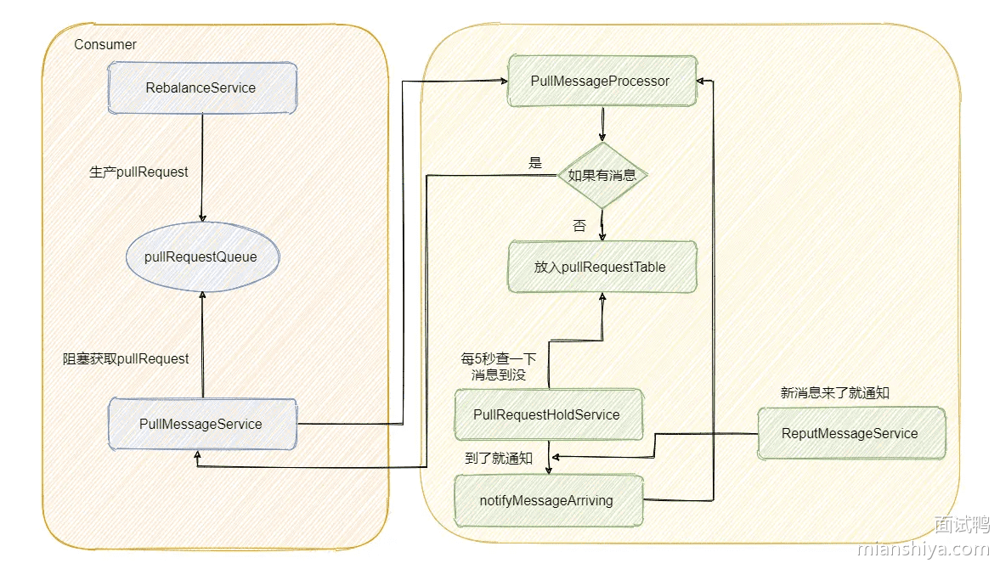

### 扩展阅读：Kafka 中的长轮询

像 Kafka 在拉请求中有参数，可以使得消费者请求在 “长轮询” 中阻塞等待。

简单的说就是消费者去 Broker 拉消息，定义了一个超时时间，也就是说消费者去请求消息，如果有的话马上返回消息，如果没有的话消费者等着直到超时，然后再次发起拉消息请求。

并且 Broker 也得配合，如果消费者请求过来，有消息肯定马上返回，没有消息那就建立一个延迟操作，等条件满足了再返回。

我们来简单的看一下源码，为了突出重点，我会删减一些代码。

先来看消费者端的代码。


上面那个 poll 接口想必大家都很熟悉，其实从注解直接就知道了确实是等待数据的到来或者超时，我们再简单的往下看。

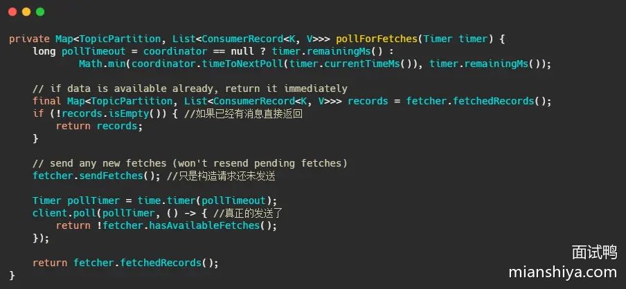

我们再来看下最终 client.poll 调用的是什么。


最后**调用的就是 Kafka 包装过的 selector，而最终会调用 Java nio 的 select(timeout)**。

现在消费者端的代码已经清晰了，**我们再来看看 Broker 如何做的**。

Broker 处理所有请求的入口其实我在之前的文章介绍过，就在 KafkaApis.scala 文件的 handle 方法下，这次的主角就是 handleFetchRequest 。


这个方法进来，我截取最重要的部分。


下面的图片就是 fetchMessages 方法内部实现，源码给的注释已经很清晰了，大家放大图片看下即可。


这个炼狱名字取得很有趣，简单的说就是利用我之前文章提到的时间轮，来执行定时任务，例如这里是`delayedFetchPurgatory`，专门用来处理延迟拉取操作。

我们先简单想一下，这个延迟操作都需要实现哪些方法，首先构建的延迟操作需要有检查机制，来查看消息是否已经到了，然后呢还得有个消息到了之后该执行的方法，还需要有执行完毕之后该干啥的方法，当然还得有个超时之后得干啥的方法。

这几个方法其实对应的就是代码里的 DelayedFetch ，这个类继承了 DelayedOperation 内部有：

- isCompleted 检查条件是否满足的方法
- tryComplete 条件满足之后执行的方法
- onComplete 执行完毕之后调用的方法
- onExpiration 过期之后需要执行的方法

判断是否过期就是由时间轮来推动判断的，但是总不能等过期的时候再去看消息到了没吧？

这里 Kafka 和 RocketMQ 的机制一样，也会在消息写入的时候提醒这些延迟请求消息来了，具体代码我不贴了， 在 ReplicaManager#appendRecords 方法内部再深入个两方法可以看到。

不过虽说代码不贴，图还是要画一下的。


## 480.你使用过哪些 Java 并发工具类？ 

### 回答重点

比如：ConcurrentHashMap、AtomicInteger、Semaphore、CyclicBarrier、CountDownLatch、BlockingQueue 等等。

这个问题只要把你知道的一些并发类名字说出来就行了，然后等面试官选择其中一个去询问即可（一般需要结合简历中项目的业务场景，所以需要根据自己的业务提前准备）。

具体的并发类分析看扩展知识。

### 扩展知识

#### 1. **ConcurrentHashMap**

- **作用：** 是一个线程安全且高效的哈希表，支持并发访问。
- **用法：** 多个线程可以同时进行读写操作，而不会导致线程安全问题。

```java
ConcurrentHashMap<String, Integer> map = new ConcurrentHashMap<>();
map.put("key1", 1);
Integer value = map.get("key1");
map.computeIfAbsent("key2", k -> 2);
```

#### 2. **AtomicInteger**

- **作用：** 提供一种线程安全的方式对 `int` 类型进行原子操作，如增减、比较。
- **用法：** 适用于需要频繁对数值进行无锁操作的场景。

```java
AtomicInteger atomicInt = new AtomicInteger(0);
atomicInt.incrementAndGet(); // 递增
atomicInt.decrementAndGet(); // 递减
atomicInt.compareAndSet(1, 2); // 比较并设置
```

#### 3. **Semaphore**

- **作用：** 控制访问资源的线程数，可以用来实现限流或访问控制。
- **用法：** 在资源有限的情况下，控制同时访问的线程数量。

```java
Semaphore semaphore = new Semaphore(3);
try {
    semaphore.acquire(); // 获取许可
    // 执行任务
} finally {
    semaphore.release(); // 释放许可
}
```

#### 4. **CyclicBarrier**

- **作用：** 让一组线程到达一个共同的同步点，然后一起继续执行。常用于分阶段任务执行。
- **用法：** 适用于需要所有线程在某个点都完成后再继续的场景。

```java
码CyclicBarrier barrier = new CyclicBarrier(3, () -> {
    System.out.println("所有线程都到达了屏障点");
});
Runnable task = () -> {
    try {
        // 执行任务
        barrier.await(); // 等待其他线程
    } catch (Exception e) {
        e.printStackTrace();
    }
};
new Thread(task).start();
new Thread(task).start();
new Thread(task).start();
```

#### 5. **CountDownLatch**

- **作用：** 一个线程（或多个）等待其他线程完成操作。
- **用法：** 适用于主线程需要等待多个子线程完成任务的场景。

```java
CountDownLatch latch = new CountDownLatch(3);
Runnable task = () -> {
    try {
        // 执行任务
    } finally {
        latch.countDown(); // 任务完成，计数器减一
    }
};
new Thread(task).start();
new Thread(task).start();
new Thread(task).start();
latch.await(); // 等待所有任务完成
System.out.println("所有任务都完成了");
```

#### 6. **BlockingQueue**

- **作用：** 是一个线程安全的队列，支持阻塞操作，适用于生产者-消费者模式。
- **用法：** 生产者线程将元素放入队列，消费者线程从队列中取元素，队列为空时消费者线程阻塞。

```java
BlockingQueue<String> queue = new LinkedBlockingQueue<>();
Runnable producer = () -> {
    try {
        queue.put("item"); // 放入元素
    } catch (InterruptedException e) {
        e.printStackTrace();
    }
};
Runnable consumer = () -> {
    try {
        String item = queue.take(); // 取出元素
    } catch (InterruptedException e) {
        e.printStackTrace();
    }
};
new Thread(producer).start();
new Thread(consumer).start();
```

#### 关联题目

[什么是 Java 的 Semaphore？](https://www.mianshiya.com/bank/1789249312885223425/question/1780933294934749186)

[什么是 Java 的 CyclicBarrier？](https://www.mianshiya.com/bank/1789249312885223425/question/1780933294938943489)

[什么是 Java 的 CountDownLatch？](https://www.mianshiya.com/bank/1789249312885223425/question/1780933294943137794)

[什么是 Java 的 StampedLock？](https://www.mianshiya.com/bank/1789249312885223425/question/1780933294947332098)

[什么是 Java 的 CompletableFuture？](https://www.mianshiya.com/bank/1789249312885223425/question/1780933294951526402)

## 1123.什么是设计模式？请简述其作用。 

### 回答重点

设计模式其实是在软件开发过程中经过**经验积累和验证总结得出的一套通用代码设计方案**，是踩在巨人的肩膀上总结的设计成果。

如果熟悉了设计模式，当遇到类似的场景，我们可以快速地参考设计模式实现代码。不仅可以加速我们的编码速度，也提升了代码的**可扩展性**、**可重用性**与**可维护性**！

#### 作用

1）**帮助我们快速解决常见问题**：

设计模式提供了解决特定软件设计问题的通用方法，拿来套上即用，例如单例模式、代理模式、责任链模式等等。

2）**提升代码可扩展性**：

设计模式通常考虑了软件的扩展性，将不同的功能和功能变化分离开来实现，使得未来添加新功能更加容易。

3）**提高代码可重用性**：

设计模式本身就是经验的总结，按照设计模式的思路，很多代码封装的很好，便于复用，减少重复工作。

4）**提升代码可维护性**：

通过使用设计模式，使得代码结构更加清晰，易于理解和维护。

5）**简化沟通成本**：

如果大家都熟悉设计模式，其实设计模式就是一种通用语言，通过设计就能明白其实现含义，有助于开发者之间更有效地沟通设计意图。

6）**提供最佳实践**：

它们是经验的总结，可以指导开发者避免常见陷阱，采用最佳实践。


## 573.什么是 AOP？ 

### 回答重点

**AOP（Aspect-Oriented Programming，面向切面编程）** 是一种编程范式，用于将跨领域的关注点（如日志记录、安全检查、事务管理等）与业务逻辑分离开来。它允许开发者通过“切面”（Aspect）将这些通用功能模块化，并将其应用到应用程序中的多个地方，从而避免代码重复。

- **核心思想**：AOP 的核心思想是将与业务逻辑无关的横切关注点抽取出来，通过声明的方式动态地应用到业务方法上，而不是将这些代码直接嵌入业务逻辑中。
- **主要组成部分**：AOP 包括几个关键概念：切面（Aspect）、连接点（Join Point）、通知（Advice）、切入点（Pointcut）和织入（Weaving）。

### 扩展知识

#### 通俗理解

具体是含义可以理解为：通过代理的方式，在调用想要的对象方法时候，进行拦截处理，执行切入的逻辑，然后再调用真正的方法实现。

例如，你实现了一个 A 对象，里面有 addUser 方法，此时你需要记录该方法的调用次数。

那么你就可以搞个代理对象，这个代理对象也提供了 addUser 方法，最终你调用的是代理对象的 addUser ，在这个代理对象内部填充记录调用次数的逻辑，最终的效果就类似下面代码：

```java
class A代理 {
    A a;// 被代理的 A
   void addUser(User user) {
     count();// 计数
     a.addUser(user);
   }
}
最终使用的是：
A代理.addUser(user);
```

这就叫做**面向切面编程**，当然具体的代理的代码不是像上面这样写死的，**而是动态切入**。

实现上代理大体上可以分为：**动态代理**和**静态代理**。

- 动态代理，即**在运行时**将切面的逻辑进去，按照上面的逻辑就是你实现 A 类，然后定义要代理的切入点和切面的实现，程序会自动在运行时生成类似上面的代理类。
- 静态代理，**在编译时或者类加载时**进行切面的织入，典型的 AspectJ 就是静态代理。

#### AOP 的核心概念

**切面（Aspect）**：切面是一个模块，包含跨领域的关注点，比如日志、事务等。它可以包含多个通知（Advice）来定义在何时何地应用特定的逻辑。

```java
@Aspect
public class LoggingAspect {
  @Before("execution(* com.example.service.*.*(..))")
  public void logBefore() {
      System.out.println("Logging before method execution");
  }
}
```

**连接点（Join Point）**：连接点是程序执行中的一个特定位置，例如方法调用或异常抛出。AOP 允许在这些点上插入切面逻辑。

**通知（Advice）**：通知是定义在连接点执行的操作。常见的通知类型包括：

- **前置通知（Before）**：在方法执行之前执行的操作。
- **后置通知（After）**：在方法执行之后执行的操作。
- **环绕通知（Around）**：在方法执行前后都可以执行的操作，可以控制方法是否执行。
- **异常通知（AfterThrowing）**：在方法抛出异常后执行的操作。
- **返回通知（AfterReturning）**：在方法成功返回后执行的操作。

**切入点（Pointcut）**：切入点定义了在何处应用通知，通常是通过表达式来匹配方法或类。例如，可以定义某个包下所有方法为切入点。

```java
@Pointcut("execution(* com.example.service.*.*(..))")
public void serviceMethods() {}
```

**织入（Weaving）**：织入是将切面应用到目标对象的过程。可以在编译时、类加载时或运行时进行织入。

#### AOP 的主要应用场景

**日志记录**：通过 AOP 可以将日志逻辑分离到切面中，使日志代码与业务代码解耦。

```java
@Aspect
public class LoggingAspect {
  @Before("execution(* com.example.service.*.*(..))")
  public void logBefore(JoinPoint joinPoint) {
      System.out.println("Method: " + joinPoint.getSignature().getName() + " is called");
  }
}
```

**事务管理**：可以通过 AOP 实现事务管理，确保在特定方法执行时开启事务，并在方法执行成功或失败后提交或回滚事务。

```java
@Transactional
public void transferMoney() {
  // 事务管理
}
```

**安全检查**：AOP 可以用于权限验证，在方法执行前检查用户是否具有相应权限。

**性能监控**：通过环绕通知（Around advice），可以记录方法的执行时间，帮助监控应用性能。

#### Spring AOP 与 AspectJ 的区别

- [Spring AOP 与 AspectJ 的区别](https://www.mianshiya.com/bank/1790683494127804418/question/1780933295375151105)

## 928.什么是服务降级？ 

### 回答重点

服务降级是一种在**分布式系统**和**微服务架构**中常用的**容错机制**，用于在系统压力过大或部分服务出现故障时，**暂时减少或关闭某些不必要的功能**，从而确保核心功能的正常运行，避免系统崩溃。通过降级，可以提高系统的**容错性**和**可用性**。

### 扩展知识

#### **服务降级的触发场景**

**服务调用超时或失败**：

- 当某个服务的调用时间超过了设定的阈值，或者服务多次调用失败时，可以触发降级机制，返回预设的降级响应，避免长时间等待。
- **示例**：当支付服务超时时，可以返回“支付服务暂时不可用，请稍后再试”的提示。

**系统负载过高**：

- 当系统的负载过高（如 CPU 使用率、内存占用率等）时，可以主动降级某些非核心功能，释放系统资源，确保核心业务的正常运行。
- **示例**：在电商促销活动期间，订单服务可以降级不实时显示推荐商品，只展示基础订单信息，以减轻系统负担。

**下游服务不可用**：

- 如果下游依赖服务不可用或者响应时间过长，可以通过降级机制，返回缓存数据或默认数据，避免请求继续传播，影响用户体验。
- **示例**：在查询库存服务不可用时，可以返回“库存信息暂时不可用”的缓存数据。

#### 实现服务降级的常用方式

**Fallback（降级回调方法）**：在调用远程服务时，设置一个降级回调方法，当服务调用失败或超时时，直接执行降级方法，返回预设的响应。

- **使用场景**：适用于基于 **Hystrix** 或 **Resilience4j** 的系统，可以在 `@HystrixCommand` 注解中指定 `fallbackMethod`。
- **示例**：在调用订单服务时，如果订单服务不可用，可以执行 `getOrderFallback` 方法，返回“订单信息暂时不可用”的提示。

**使用缓存数据**：当服务不可用时，可以返回最近一次的缓存数据，保证用户体验的稳定性。

- **使用场景**：适用于查询类请求，如商品详情、用户信息等。通过缓存减少对下游服务的依赖。
- **示例**：当库存服务不可用时，可以返回前一次查询的库存数据，避免对用户展示“库存不可用”的错误信息。

**限流降级**：当系统流量超过某个阈值时，对部分非核心请求进行限流或直接拒绝，保护核心服务的可用性。

- **使用场景**：适用于高并发场景，通过限流来避免系统过载，如在 API 网关层面对某些请求进行限流。
- **示例**：在秒杀活动中，对某些促销请求进行限流，只允许部分用户参与活动，避免系统被瞬间流量冲垮。

#### 服务降级的实现框架与工具

**Hystrix**：

- **简介**：Hystrix 是 Netflix 开源的熔断器和降级框架，通过 `@HystrixCommand` 注解可以方便地实现服务的降级逻辑。
- **使用场景**：适用于微服务架构中的服务降级和熔断处理，特别是在基于 Spring Cloud 的应用中。
- **替代品**：Hystrix 已经进入维护模式，推荐使用 **Resilience4j** 作为替代方案。

**Resilience4j**：

- **简介**：Resilience4j 是一个轻量级的容错框架，支持熔断、限流、降级等功能，采用函数式编程风格，适合与 Spring Boot 2.x 集成。
- **优势**：更高效的性能，更现代化的设计，支持异步编程，适合在新的微服务项目中使用。
- **使用场景**：可以通过配置降级方法实现服务降级，在请求失败或超时时提供备用响应。

**Sentinel**：

- **简介**：Sentinel 是阿里巴巴开源的服务限流降级框架，提供流量控制、熔断降级、系统自适应保护等功能。
- **优势**：与 Spring Cloud Alibaba 生态集成良好，适用于国内市场，功能丰富且易于配置。
- **使用场景**：在流量高峰期或微服务系统中，通过 Sentinel 实现流量控制和服务降级，提升系统的稳定性。

#### 服务降级的常见应用场景

**电商网站中的降级**：

- 在电商平台的促销活动中，流量激增可能导致系统超负荷运行。通过降级，可以临时关闭一些非核心的功能（如推荐商品、商品评论），以保证订单、支付等核心功能的正常运行。

**金融系统中的降级**：

- 在金融系统中，当某个外部支付渠道不可用时，可以提供备用的支付方式或提示用户使用其他支付渠道。这样即使某个服务暂时不可用，用户也能继续使用系统的其他功能。

**消息推送系统中的降级**：

- 在消息推送系统中，当消息发送量激增时，可以通过降级暂时关闭某些非关键的推送类型，如营销信息推送，优先保证系统通知类消息的发送。

## 491.Synchronized 和 ReentrantLock 有什么区别？ 

### 回答重点

Synchronized 是 Java 内置的关键字，实现基本的同步机制，不支持超时，非公平，不可中断，不支持多条件。

ReentrantLock 是 JUC 类库提供的，由 JDK 1.5 引入，支持设置超时时间，可以避免死锁，比较灵活，并且支持公平锁，可中断，支持多条件判断。

ReentrantLock 需要手动解锁，而 Synchronized 不需要，它们都是可重入锁。

一般情况下用 Synchronized 足矣，比较简单，而 ReentrantLock 比较灵活，支持的功能比较多，所以复杂的情况用 ReentrantLock 。

> 性能问题：很多年前，Synchronized 性能不如 ReentrantLock，现在基本上性能是一致的。

### 扩展知识

#### 可重入锁

重入锁指的是同一个线程在持有某个锁的时候，可以再次获取该锁而不会发生死锁。例如以下代码：

outer 还需要调用 inner，它们都用到了同一把锁，如果不可重入那么就会导致死锁。

```java
public class ReentrantLockExample {
    private final ReentrantLock lock = new ReentrantLock();

    public void outer() {
        lock.lock();
        try {
            inner();
        } finally {
            lock.unlock();
        }
    }

    public void inner() {
        lock.lock();
        try {
            // critical section
        } finally {
            lock.unlock();
        }
    }
}
```

在递归调用或循环调用上锁时，可重入这个特性就十分重要了。

#### 可重入锁实现方式

一般可重入锁是通过计数的方式实现，例如维护一个计数器，当前线程抢到锁则+1，如果当前线程再次抢到锁则继续+1。

如果当前线程释放锁之后，则计数器-1，当减到 0 则释放当前锁。

#### 扩展 Synchronized 性能优化

Synchronized 在 JDK 1.6 之后进行了很多性能优化，主要包括以下几种：

- 偏向锁：如果一个锁被同一个线程多次获得，JVM 会将该锁设置为偏向锁，以减少获取锁的代价。
- 轻量级锁：如果没有线程竞争，JVM 会将锁设置为轻量级锁，使用 CAS 操作代替互斥同步。
- 锁粗化：JVM 会将一些短时间内连续的锁操作合并为一个锁操作，以减少锁操作的开销。
- 锁消除：JVM 在 JIT 编译时会检测到一些没有竞争的锁，并将这些锁去掉，以减少同步的开销。

#### Synchronized 的实现

- [Java 的 synchronized 是怎么实现的？](https://www.mianshiya.com/bank/1789249312885223425/question/1780933294980886530)

#### ReentrantLock 的实现

- [Java 中 ReentrantLock 的实现原理是什么？](https://www.mianshiya.com/bank/1789249312885223425/question/1780933295014440961)


## 644.Redis 的 Lua 脚本功能是什么？如何使用？ 

### 回答重点

Redis 的 Lua 脚本功能允许用户在 Redis 服务器端执行自定义的 Lua 脚本，以实现原子操作和复杂逻辑。 其核心点包括：

- **原子性**：Lua 脚本的所有命令在执行过程中是原子的，避免了并发修改带来的问题。
- **减少网络往返次数**：通过在服务器端执行脚本，减少了客户端和服务器之间的网络往返次数，提高了性能。
- **复杂操作**：可以在 Lua 脚本中执行复杂的逻辑，比如批量更新、条件更新等，超过了单个 Redis 命令的能力。

例如常见基于 Redis 实现分布式锁就需要结合 lua 脚本来实现。

**lua 本身是不具备原子性的**，但由于 Redis 的命令是单线程执行的，它会把整个 lua 脚本作为一个命令执行，会阻塞其间接受到的其他命令，这就保证了 lua 脚本的原子性。

### 扩展知识

#### Lua 脚本的基本结构

**调用 Redis 命令**：

- 使用 `redis.call` 调用 Redis 原生命令。
- 使用 `redis.pcall` 进行安全调用，如果脚本中的某些命令失败，可以捕获错误，而不是直接中断执行。这样可以在脚本内处理错误。

**参数传递**：

- `KEYS` 表示传入的键名数组。
- `ARGV` 表示传入的参数数组。

#### Lua 脚本使用示例

##### 基本的 GET 和 SET 操作

```lua
EVAL 
"local value = redis.call('GET', KEYS[1]) 
if not value then redis.call('SET', KEYS[1], ARGV[1])
end 
return value" 1 mykey "default_value"
```

**分析**：

- 这段脚本首先获取键 `mykey` 的值。
- 如果 `mykey` 不存在，则设置其值为 `default_value`。
- 返回 `mykey` 的当前值。

**步骤**：

1. `redis.call('GET', KEYS[1])` 获取键的值。
2. `if not value then redis.call('SET', KEYS[1], ARGV[1]) end` 检查值是否存在，不存在则设置默认值。
3. `return value` 返回当前值。

##### 原子递增计数器

```lua
EVAL "local current = redis.call('INCR', KEYS[1]) return current" 1 counter_key
```

**分析**：

- 这段脚本使用 `INCR` 原子性地递增键 `counter_key` 的值。

**步骤**：

1. `redis.call('INCR', KEYS[1])` 直接递增。
2. 返回递增后的值。

##### 限流控制

假设我们要实现一个简单的限流器，每分钟允许访问 100 次。

```lua
EVAL [[
  local current = tonumber(redis.call('GET', KEYS[1]) or 0)
  if current < ARGV[1] then
    redis.call('INCR', KEYS[1])
    redis.call('EXPIRE', KEYS[1], 60)
    return true
  else
    return false
  end
]] 1 rate_limit_key 100
```

**分析**：

- 该脚本检查当前的访问次数是否超过限制。
- 如果未超过限制，则增加计数并设置过期时间。

**步骤**：

1. `local current = tonumber(redis.call('GET', KEYS[1]) or 0)` 获取当前计数，默认为 0。
2. 判断是否小于限制值 `ARGV[1]`。
3. 若未超过，则 `INCR` 当前计数并设置过期时间。
4. 返回布尔值表示是否允许访问。

#### Lua 预加载脚本

可以使用 `SCRIPT LOAD` 将 Lua 脚本预加载到 Redis，以提高执行效率：

```lua
SCRIPT LOAD "return redis.call('GET', KEYS[1])"
```

此命令返回脚本的 SHA1 哈希值，后续可用 `EVALSHA` 命令通过该哈希值执行。

#### Lua 脚本使用注意点

由于 Redis 执行 lua 脚本其间，无法处理其他命令，因此如果 lua 脚本的业务过于复杂，则会产生长时间的阻塞，因此编写 Lua 脚本时应尽量保持简短和高效。

Redis 默认限制 lua 执行脚本时间为 5s，如果超过这个时间则会终止且抛错，可以通过 `lua-time-limit` 调整时长。

#### 如果 Lua 脚本中的部分命令执行失败会怎样？

例如以下这段 lua 脚本：

```lua
-- 正确的 SET 命令
redis.call("SET", "my_key", "mianshiya")

-- 错误的 HSET 命令
redis.call("HSET", "my_hash", "field_mianshiya") -- 缺少值参数
```

此时，执行上述的 lua 脚本， my_key 会被成功执行，由于 HSET 缺少参数，会报错，**而 my_key 并不会被回滚。**

**所以实际上 lua 脚本并不能完全保证原子性**，但是官方认为这种错误正常情况下不可能发生，属于开发者的人为因素（语法错误、或者执行了不应该执行的命令）导致的，他们不背这个锅。

#### Lua 知识点

Lua 语言是一门轻量级的脚本语言，使用 C 语言编写，具有简洁的语法，易于学习和使用，广泛应用于游戏开发、嵌入式系统等领域。

它设计的主要目的就是为了嵌入其他程序，实现灵活的扩展和定制功能，并且具备快速的执行速度，能够满足各种开发需求。

Lua 语言具有以下优点：

1. 轻量级：占用资源少，易于嵌入其他程序。
2. 简洁高效：语法简单，执行效率高。
3. 跨平台：可在多种操作系统上运行。
4. 扩展性强：方便与其他语言集成。
5. 快速开发：减少开发时间和成本。
6. 灵活性高：适应各种不同的项目需求。
7. 易于学习：入门难度低，容易掌握。
8. 解释执行：无需编译，便于调试。
9. 资源占用少：对系统资源的需求相对较低。
10. 社区活跃：有丰富的文档和工具支持。


## 671. HTTP 2.0 和 3.0 有什么区别？

### 回答重点

1） **基于的传输层协议不同**：

- **HTTP/2**：基于 TCP，使用二进制分帧层（Binary Framing Layer）实现多路复用。
- **HTTP/3**：基于 UDP，使用 QUIC 协议（Quick UDP Internet Connections），提供类似TCP 的可靠性和多路复用。

2） **性能和可靠性区别**：

- **HTTP/2**：解决了HTTP/1.x中的队头阻塞问题，但仍然受制于TCP的队头阻塞，尤其在高延迟或丢包情况下。
- **HTTP/3**：通过 QUIC 协议，避免了 TCP 队头阻塞，即使在网络不稳定的情况下也能提供更好的性能。

3）**从安全性角度来看**：

- **HTTP/2**：可以使用 TLS 加密（HTTPS），但加密并非强制要求。
- **HTTP/3**：默认使用 QUIC 自带的 TLS 1.3加密，安全性更高，且加密是强制的。

4） **从连接建立速度**：

- **HTTP/2**：需要 TCP 三次握手和 TLS 握手，连接建立相对较慢。
- **HTTP/3**：QUIC 集成了连接建立和加密握手，连接建立速度更快，尤其在初次连接时。

### 扩展知识

#### QUIC 技术优势

QUI，Quick UDP Internet Connections 是一个基于 UDP 的传输协议，由 Google 开发，旨在替代TCP 以提高网络传输性能和安全性。QUIC 在传输层和应用层之间提供可靠、低延迟的传输服务。

QUIC（Quick UDP Internet Connections）是一种由 Google 开发的基于 UDP 的传输层协议，旨在改进 HTTP/2 的性能。QUIC 的设计目标是减少连接延迟，提高传输效率和安全性。以下是 QUIC 的一些技术优势和细节：

##### 技术优势

1）**低延迟连接建立**：

- QUIC 使用 0-RTT（Zero Round Trip Time）技术，可以在首次握手时减少延迟。对于已经建立过连接的客户端，可以直接发送数据，无需等待服务器的响应。

2）**内置加密**：

- QUIC 协议默认采用 TLS 1.3 进行端到端加密，从而提高了数据传输的安全性，并简化了协议设计，不再需要像 TCP 那样进行额外的加密层配置。

3）**减少了队头阻塞（Head-of-Line Blocking）**：

- 与 TCP 不同，QUIC 在每个连接内使用多个独立的流，这意味着一个流上的丢包不会阻塞其他流的数据传输，从而显著减少队头阻塞问题，提高传输效率。

4）**更快的拥塞控制**：

- QUIC 可以更快速地调整拥塞控制算法，因为它能够访问更多的上下文信息（如链路的RTT、丢包率等），且能够在应用层进行定制优化。

5）**连接迁移**：

- QUIC 支持连接迁移，当客户端的 IP 地址或网络环境变化时（例如从 Wi-Fi 切换到蜂窝网络），连接依然可以保持，不会像 TCP 那样中断。

6）**更高的带宽利用率**：

- QUIC 通过改进的流量控制机制，可以更好地利用可用带宽，从而提高传输速度和效率。

更多 QUIC 细节参见 [HTTP 1.0 和 2.0 有什么区别？](https://www.mianshiya.com/bank/1790948499480616961/question/1780933295710695425) 内扩展知识 HTTP 3.0 时代

## 1126. 单例模式有哪几种实现？如何保证线程安全？

### 回答重点

单例模式常见有：**饿汉式、懒汉式（线程安全版需要加双重检查锁定）、静态内部类、枚举单例（Java 特有）** 等几个实现方式。

- **饿汉式**：实例在类加载时就创建，线程安全，但如果实例初始化较重或没有被使用会浪费资源。
- **懒汉式**：实例在首次访问时创建，节约资源，但需要确保线程安全。
- **双重检查锁定**：在懒汉式的基础上优化，直接加锁效率太低，双重检查锁只在第一次检查实例为空时加锁，提高性能。
- **静态内部类**：利用类加载机制实现懒加载和线程安全，推荐使用。
- **枚举单例**（Java 特有）：通过枚举实现单例，简单且防止反射和序列化攻击。

#### 如何保证线程安全？

- Java：推荐静态内部类或双重检查锁定，配合 volatile。

### 扩展知识

#### 为什么需要双重检查锁定？

因为懒汉式单例在多线程环境下，可能出现多个线程同时初始化实例的问题，最简单是加个锁：

```java
public static synchronized Singleton getInstance() {
    if (instance == null) {
        instance = new Singleton();
    }
    return instance;
}
```

但是这样一来，每次调用 `getInstance` 方法都需要加锁，**而实际上只需要在第一次创建实例时加锁**。在高并发环境下，频繁获取单例对象的锁操作会显著降低性能。

而双重检查锁定**通过减少加锁的范围，避免了每次获取实例时都加锁的问题**，提升了性能。

```java
public class Singleton {
    private static volatile Singleton instance; // 使用 volatile 防止指令重排

    private Singleton() {}

    public static Singleton getInstance() {
        if (instance == null) { // 第一次检查：避免不必要的同步
            synchronized (Singleton.class) {
                if (instance == null) { // 第二次检查：确保实例唯一
                    instance = new Singleton();
                }
            }
        }
        return instance;
    }
}
```

#### 为什么双重检查锁定需要 volatile 关键字？

在 Java 中，`volatile` 修饰符用于**防止指令重排序**，从而确保双重检查锁定的正确性。

`instance = new Singleton()` 是一个非原子操作，它分为以下三步：

1. 分配内存空间。
2. 初始化对象。
3. 将对象的引用赋值给 `instance`。

在没有 `volatile` 的情况下，编译器和 CPU 可能会对这些步骤进行**重排序**（比如执行顺序变成 1 → 3 → 2）。此时，另一个线程可能会在 `instance` 被赋值后，但对象尚未完成初始化时访问它，从而导致错误。

所以将 `instance` 声明为 `volatile`，可以禁止指令重排序，确保对象的初始化过程对所有线程可见。

```java
private static volatile Singleton instance;
```

保证 `instance` 的写操作对其他线程立即可见，并禁止重排序优化，确保双重检查锁定的正确性。

**总结**：

- **双重检查锁定**通过缩小加锁范围，仅在必要时同步代码块，既保证线程安全，又提升性能。
- **`volatile` 关键字**是实现双重检查锁定的关键，防止指令重排序导致未初始化对象被访问。

#### Java 单例实现代码示例

##### **饿汉式（线程安全，类加载时初始化）**：

```java
public class Singleton {
    private static final Singleton instance = new Singleton();

    private Singleton() {}

    public static Singleton getInstance() {
        return instance;
    }
}
```

##### **懒汉式（线程不安全，需改进）**：

```java
public class Singleton {
    private static Singleton instance;

    private Singleton() {}

    public static Singleton getInstance() {
        if (instance == null) {
            instance = new Singleton();
        }
        return instance;
    }
}
```

##### **双重检查锁定（线程安全，推荐）**：

```java
public class Singleton {
    private static volatile Singleton instance;

    private Singleton() {}

    public static Singleton getInstance() {
        if (instance == null) {
            synchronized (Singleton.class) {
                if (instance == null) {
                    instance = new Singleton();
                }
            }
        }
        return instance;
    }
}
```

##### **静态内部类（线程安全，推荐）**：

```java
public class Singleton {
    private Singleton() {}

    private static class Holder {
        private static final Singleton INSTANCE = new Singleton();
    }

    public static Singleton getInstance() {
        return Holder.INSTANCE;
    }
}
```

##### **枚举单例**：

```java
public enum Singleton {
    INSTANCE;

    public void bizMethod() {
        // 一些业务逻辑方法
    }
}

//使用
Singleton singleton = Singleton.INSTANCE;
singleton.bizMethod();
```


## 492. Java 的 synchronized 是怎么实现的？

### 回答重点

`synchronized` 实现原理依赖于 JVM 的 Monitor（监视器锁） 和 对象头（Object Header）。

当 `synchronized` 修饰在方法或代码块上时，会对特定的对象或类加锁，从而确保同一时刻只有一个线程能执行加锁的代码块。

- **synchronized 修饰方法**：会在方法的访问标志中增加一个 `ACC_SYNCHRONIZED` 标志。每当一个线程访问该方法时，JVM 会检查方法的访问标志。如果包含 `ACC_SYNCHRONIZED` 标志，线程必须先获得该方法对应的对象的监视器锁（即对象锁），然后才能执行该方法，从而保证方法的同步性。
- **synchronized 修饰代码块**：会在代码块的前后插入 `monitorenter` 和 `monitorexit` 字节码指令。可以把 `monitorenter` 理解为加锁，`monitorexit`理解为解锁。

### 扩展知识

#### 对象头（Object Header）

在 JVM 中，每个对象的内存布局主要由两部分组成：

- Mark Word：用于存储对象的运行时数据，包括锁状态、哈希码、GC 分代信息等。
- Klass Pointer：指向对象的类型元数据，帮助 JVM 确定对象的类型信息。

Mark Word 是实现 synchronized 的关键，因为它会根据锁的状态保存不同的信息，具体包括：

- 未锁定状态：Mark Word 存储对象的哈希码和 GC 分代信息。
- 偏向锁状态：Mark Word 保存获取该锁的线程 ID 和一些偏向锁标志位。
- 轻量级锁状态：Mark Word 存储的是指向栈中锁记录的指针。
- 重量级锁状态：Mark Word 存储的是指向 Monitor 对象的指针。

#### 锁的升级与优化

为了提高 synchronized 的性能，JVM 从 JDK 1.6 开始引入了锁的优化机制，包括**偏向锁、轻量级锁、重量级锁**，这些状态会根据线程的竞争情况进行动态升级或降级。

##### 偏向锁

在没有锁竞争的情况下，锁总是“偏向”于第一个获得它的线程。偏向锁通过减少不必要的 CAS 操作来提高性能。

- 加锁过程：当线程第一次请求锁时，JVM 会将该线程的 ID 记录在对象头的 Mark Word 中，表示锁偏向于该线程。后续该线程再进入该锁时，无需进行额外的同步操作。
- 撤销偏向锁：如果在偏向锁持有期间，另一个线程请求同一把锁，JVM 会撤销偏向锁，并升级为轻量级锁。

##### 轻量级锁

轻量级锁适用于多个线程短时间内争用同一锁的场景。

- 加锁过程：当线程进入同步块时，JVM 会在当前线程的栈帧中创建一个锁记录（Lock Record），并将对象头中的 Mark Word 拷贝到锁记录中。线程尝试使用 CAS 操作将对象头中的 Mark Word 更新为指向锁记录的指针。如果成功，则表示该线程获取了锁；如果失败，则表示其他线程已经持有该锁，此时锁会升级为重量级锁。
- 解锁过程：线程退出同步块时，JVM 会将对象头中的 Mark Word 恢复为原始值。

##### 重量级锁（Heavyweight Locking）

当锁竞争激烈时，JVM 会升级为重量级锁，重量级锁使用操作系统的**互斥量（Mutex）** 机制来实现线程的阻塞与唤醒。

- 加锁过程：如果线程无法通过轻量级锁获取锁，JVM 会将该锁升级为重量级锁，并将当前线程阻塞。
- 解锁过程：当线程释放重量级锁时，JVM 会唤醒所有阻塞的线程，允许它们再次尝试获取锁。

**锁升级总结**：

- **偏向锁**：当一个线程第一次获取锁时，JVM 会将该线程标记为“偏向”状态，后续若该线程再获取该锁，几乎没有开销。
- **轻量级锁**：当另一个线程尝试获取已经被偏向的锁时，锁会升级为轻量级锁，使用 CAS 操作来减少锁竞争的开销。
- **重量级锁**：当 CAS 失败无法获取锁，锁会升级为重量级锁，线程会被挂起，直到锁被释放。

#### Synchronized 的可重入性

`synchronized` 是可重入的，每获取一次锁，计数器加一，释放锁时，计数器减一，直到计数器为 0，锁才会真正释放。

#### 锁消除和锁粗化

- **锁消除**：JVM 会通过逃逸分析判断对象是否只在当前线程使用，如果是，那么会消除不必要的加锁操作。
- **锁粗化**：当多个锁操作频繁出现时，JVM 会将这些锁操作合并，减少锁获取和释放的开销。

#### 重量级锁的实现原理深入分析

Synchronized 关键字可以修饰代码块，实例方法和静态方法，**本质上都是作用于对象上**。

代码块作用于括号里面的对象，实例方法是当前的实例对象即 this ，而静态方法就是当前的类。


这里有个概念叫**临界区**。

我们知道，之所以会有竞争是因为有共享资源的存在，多个线程都想要得到那个共享资源，所以就划分了一个区域，操作共享资源的代码就在区域内。

可以理解为想要进入到这个区域就必须持有锁，不然就无法进入，这个区域叫临界区。

##### 当用 Synchronized 修饰代码块时

此时编译得到的字节码会有 monitorenter 和 monitorexit 指令，我习惯按照临界区来理解，enter 就是要进入临界区了，exit 就是要退出临界区了，与之对应的就是获得锁和解锁。

实际上这两个指令还是和修饰代码块的那个对象相关的，也就是上文代码中的`lockObject`。

**每个对象都有一个 monitor 对象于之关联**，执行 monitorenter 指令的线程就是试图去获取 monitor 的所有权，抢到了就是成功获取锁了。

这个 monitor 下文会详细分析，我们先看下生成的字节码是怎样的。

图片上方是 lockObject 方法编译得到的字节码，下面就是 lockObject 方法，这样对着看比较容易理解。


从截图来看，执行 System.out 之前执行了 monitorenter 执行，这里执行争锁动作，拿到锁即可进入临界区。

调用完之后有个 monitorexit 指令，表示释放锁，要出临界区了。

图中我还标了一个 monitorexit 指令时，**因为有异常的情况也需要解锁**，不然就死锁了。

从生成的字节码我们也可以得知，为什么 synchronized 不需要手动解锁？

是有人在替我们负重前行啊！**编译器生成的字节码都帮咱们做好了，异常的情况也考虑到了**。

#### 当用 synchronized 修饰方法时

修饰方法生成的字节码和修饰代码块的不太一样，但本质上是一样。

此时字节码中没有 monitorenter 和 monitorexit 指令，不过在**当前方法的访问标记**上做了手脚。

我这里用的是 idea 的插件来看字节码，所以展示的字面结果不太一样，不过 flag 标记是一样的：0x0021 ，是 ACC_PUBLIC 和 ACC_SYNCHRONIZED 的结合。


原理就是修饰方法的时候在 flag 上标记 ACC_SYNCHRONIZED，在运行时常量池中通过 ACC_SYNCHRONIZED 标志来区分，这样 JVM 就知道这个方法是被 synchronized 标记的，于是在进入方法的时候就会进行执行争锁的操作，一样只有拿到锁才能继续执行。

然后不论是正常退出还是异常退出，都会进行解锁的操作，所以本质还是一样的。

#### 我们再来继续深入 synchronized

从上文我们已经知道 synchronized 是作用于对象身上的，但是没细说，我们接下来剖析一波。

在 Java 中，对象结构分为对象头、实例数据和对齐填充。

而对象头又分为：MarkWord 、 klass pointer、数组长度(只有数组才有)，我们的重点是锁，所以关注点只放在 MarkWord 上。


我再画一下 64 位时 MarkWord 在不同状态下的内存布局


MarkWord 结构之所以搞得这么复杂，是因为需要**节省内存**，让同一个内存区域在不同阶段有不同的用处。

记住这个图啊，各种锁操作都和这个 MarkWord 有很强的联系。

从图中可以看到，在重量级锁时，对象头的锁标记位为 10，并且会有一个指针指向这个 monitor 对象，所以锁对象和 monitor 两者就是这样关联的。


而这个 monitor 在 HotSpot 中是 c++ 实现的，叫 ObjectMonitor，它是管程的实现，也有叫监视器的。

它长这样，重点字段我都注释了含义，还专门截了个头文件的注释：


暂时记忆一下，等下源码和这几个字段关联很大。

##### synchronized 底层原理

先来一张图，结合上面 monitor 的注释，先看看，看不懂没关系，有个大致流转的印象即可：


好，我们继续。

前面我们提到了 monitorenter 这个指令，这个指令会执行下面的代码：


我们现在分析的是重量级锁，所以不关心偏向的代码，而 slow_enter 方法文章一开始的截图就是了，最终会执行到 `ObjectMonitor::enter` 这个方法中。


可以看到重点就是通过 CAS 把 ObjectMonitor 中的 _ owner 设置为当前线程，**设置成功就表示获取锁成功**。

然后通过 recursions 的自增来表示重入。

如果 CAS 失败的话，会执行下面的一个循环：


EnterI 的代码其实上面也已经截图了，这里再来一次，我把重要的入队操作加上，并且删除了一些不重要的代码：


先再尝试一下获取锁，不行的话就自适应自旋，还不行就包装成 ObjectWaiter 对象加入到 _ cxq 这个单向链表之中，挣扎一下还是没抢到锁的话，那么就要阻塞了，所以下面还有个阻塞的方法。


可以看到不论哪个分支都会执行 `Self->_ParkEvent->park()`，这个就是上文提到的调用 `pthread_mutex_lock`。

至此争抢锁的流程已经很清晰了，我再画个图来理一理。


> 接下来再看看解锁的方法

`ObjectMonitor::exit` 就是解锁时会调用的方法。


可重入锁就是根据 _ recursions 来判断的，重入一次 _ recursions++，解锁一次 _ recursions--，如果减到 0 说明需要释放锁了。

然后**此时解锁的线程还会唤醒之前等待的线程**，这里有好几种模式，我们来看看。

如果 `QMode == 2 && _cxq != NULL`的时候：


如果`QMode == 3 && _cxq != NULL`的时候，我就截取了一部分代码：


如果 `QMode == 4 && _cxq != NULL`的时候：


如果 QMode 不是 2 的话，最终会执行：


至此，解锁的流程就完毕了！我再画一波流程图：


> 接下来再看看调用 wait 的方法

没啥花头，就是将当前线程加入到 _ waitSet 这个双向链表中，然后再执行 `ObjectMonitor::exit` 方法来释放锁。

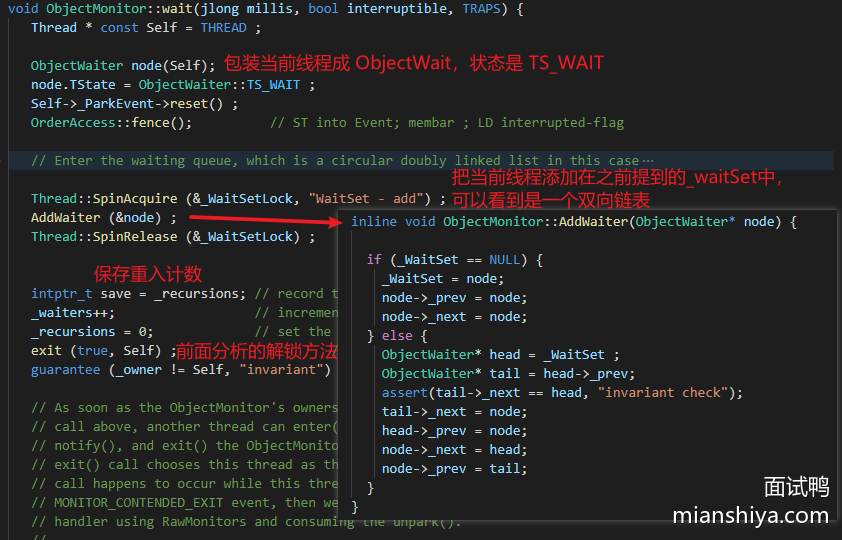

> 接下来再看看调用 notify 的方法

也没啥花头，就是从 _ waitSet 头部拿节点，然后根据策略选择是放在 cxq 还是 EntryList 的头部或者尾部，并且进行唤醒。


至于 notifyAll 我就不分析了，一样的，无非就是做了个循环，全部唤醒。

至此 synchronized 的几个操作都齐活了，出去可以说自己深入研究过 synchronized 了。

现在再来看下这个图，应该心里很有数了。


> 为什么会有_cxq 和 _EntryList 两个列表来放线程？

因为会有多个线程会同时竞争锁，所以搞了个 _ cxq 这个单向链表基于 CAS 来 hold 住这些并发，然后另外搞一个 _ EntryList 这个双向链表，来在每次唤醒的时候搬迁一些线程节点，降低 _ cxq 的尾部竞争。

> 引入自旋

synchronized 的原理大致应该都清晰了，我们也知道了底层会用到系统调用，会有较大的开销，那思考一下该如何优化？

从小标题就已经知道了，方案就是自旋，文章开头就已经说了，这里再提一提。

自旋其实就是空转 CPU，执行一些无意义的指令，**目的就是不让出 CPU 等待锁的释放**。

正常情况下锁获取失败就应该阻塞入队，但是有时候可能刚一阻塞，别的线程就释放锁了，然后再唤醒刚刚阻塞的线程，这就没必要了。

所以在线程竞争不是很激烈的时候，稍微自旋一会儿，指不定不需要阻塞线程就能直接获取锁，这样就避免了不必要的开销，提高了锁的性能。

但是**自旋的次数又是一个难点**，在竞争很激烈的情况，自旋就是在浪费 CPU，因为结果肯定是自旋一会让之后阻塞。

所以 Java 引入的是自适应自旋，根据上次自旋次数，来动态调整自旋的次数，**这就叫结合历史经验做事**。

**注意这是重量级锁的步骤，别忘了文章开头说的~**。

> 至此，synchronized 重量级锁的原理应该就很清晰了吧? 小结一下

synchronized 底层是利用 monitor 对象，CAS 和 mutex 互斥锁来实现的，内部会有等待队列(cxq 和 EntryList)和条件等待队列(waitSet)来存放相应阻塞的线程。

未竞争到锁的线程存储到等待队列中，获得锁的线程调用 wait 后便存放在条件等待队列中，解锁和 notify 都会唤醒相应队列中的等待线程来争抢锁。

然后由于阻塞和唤醒依赖于底层的操作系统实现，系统调用存在用户态与内核态之间的切换，所以有较高的开销，因此称之为重量级锁。

所以又引入了自适应自旋机制，来提高锁的性能。

#### 引入轻量级锁

我们再思考一下，是否有这样的场景：**多个线程都是在不同的时间段来请求同一把锁**，此时根本就用不需要阻塞线程，连 monitor 对象都不需要，所以就引入了轻量级锁这个概念，避免了系统调用，减少了开销。

在锁竞争不激烈的情况下，这种场景还是很常见的，可能是常态，所以轻量级锁的引入很有必要。

在介绍轻量级锁的原理之前，再看看之前 MarkWord 图。


轻量级锁操作的就是对象头的 MarkWord 。

如果判断当前处于无锁状态，会在当前线程栈的当前栈帧中划出一块叫 LockRecord 的区域，然后把锁对象的 MarkWord 拷贝一份到 LockRecord 中称之为 dhw(就是那个set_displaced_header 方法执行的)里。

然后通过 CAS 把锁对象头指向这个 LockRecord 。

轻量级锁的加锁过程：


如果当前是有锁状态，并且是当前线程持有的，则将 null 放到 dhw 中，这是重入锁的逻辑。


我们再看下轻量级锁解锁的逻辑：


逻辑还是很简单的，就是要把当前栈帧中 LockRecord 存储的 markword （dhw）通过 CAS 换回到对象头中。

如果获取到的 dhw 是 null 说明此时是重入的，所以直接返回即可，否则就是利用 CAS 换，如果 CAS 失败说明此时有竞争，那么就膨胀！


> 关于这个轻量级加锁我再多说几句。

每次加锁肯定是在一个方法调用中，而方法调用就是有栈帧入栈，如果是轻量级锁重入的话那么此时入栈的栈帧里面的 dhw 就是 null，否则就是锁对象的 markword。

这样在解锁的时候就能通过 dhw 的值来判断此时是否是重入的。

#### 引入偏向锁

我们再思考一下，是否有这样的场景：一开始一直只有一个线程持有这个锁，也不会有其他线程来竞争，此时频繁的 CAS 是没有必要的，CAS 也是有开销的。

所以 JVM 研究者们就搞了个偏向锁，就是偏向一个线程，那么这个线程就可以直接获得锁。

我们再看看这个图，偏向锁在第二行。


原理也不难，如果当前锁对象支持偏向锁，那么就会通过 CAS 操作：将当前线程的地址(也当做唯一ID)记录到 markword 中，并且将标记字段的最后三位设置为 101。

之后有线程请求这把锁，只需要判断 markword 最后三位是否为 101，是否指向的是当前线程的地址。

还有一个可能很多文章会漏的点，就是还需要判断 epoch 值是否和锁对象的**类**中的 epoch 值相同。

如果都满足，那么说明当前线程持有该偏向锁，就可以直接返回。

> 这 epoch 干啥用的？


可以理解为是第几代偏向锁。

偏向锁在有竞争的时候是要执行撤销操作的，其实就是要升级成轻量级锁。

而当一类对象撤销的次数过多，比如有个 Yes 类的对象作为偏向锁，经常被撤销，次数到了一定阈值(XX:BiasedLockingBulkRebiasThreshold，默认为 20 )就会把当代的偏向锁废弃，把类的 epoch 加一。

所以当类对象和锁对象的 epoch 值不等的时候，当前线程可以将该锁重偏向至自己，因为前一代偏向锁已经废弃了。

不过**为保证正在执行的持有锁的线程不能因为这个而丢失了锁**，偏向锁撤销需要所有线程处于安全点，然后遍历所有线程的 Java 栈，**找出该类已加锁的实例**，并且将它们标记字段中的 epoch 值加 1。

当撤销次数超过另一个阈值(XX:BiasedLockingBulkRevokeThreshold，默认值为 40)，则废弃此类的偏向功能，也就是说这个类都无法偏向了。

> 注意：JDK 15 版本偏向锁被废弃了，因为随着多核 CPU 和高并发应用的普及，偏向锁的性能优势逐渐变得不明显。**在多线程竞争严重的情况下，偏向锁会引发较多的撤销和重偏向操作，反而对性能产生负面影响**。

至此整个 Synchronized 的流程应该都比较清楚了。

我是反着来讲锁升级的过程的，因为事实上是先有的重量级锁，然后根据实际分析优化得到的偏向锁和轻量级锁。


包括期间的一些细节应该也较为清楚了，我觉得对于 Synchronized 了解到这份上差不多了。

我再搞了张 openjdk wiki 上的图，看看是不是很清晰了：


## 4680.如何设计一个秒杀功能？ 

### 回答重点

> 面试官针对这个问题不指望候选人可以系统地回答出完且可落地的方案。只是想考察候选人是否拥有高并发大流量场景下的处理思路或者说能考虑到的一些关键点。

针对秒杀场景，我们需要先和面试官说出以下几个需要解决的问题点：

1. 瞬时流量的承接
2. 防止超卖
3. 预防黑产
4. 避免对正常服务的影响
5. 兜底方案

然后可以从前后端两个视角向面试官阐述整体的设计点：

首先是前端：

- 利用 CDN 缓存静态资源（秒杀页面的 HTML、CSS、JS 等），减轻服务器的压力
- 客户端限流，在前端随机限流，降低请求量
- 按钮防抖，防止用户重复多次点击发出大量请求

其次是后端：

- Nginx（或其他接入层）做统一接入，负载均衡与流量过滤、限流
- 业务端限流，可以自定义实现本地 guava 限流或利用 sentinel 等
- 服务拆分，将秒杀功能拆分为独立的服务，避免对现有服务产生影响
- 秒杀数据的拆分和缓存，缓存可以使用分布式缓存或本地缓存方案，且需要缓存预热
- 精准地库存扣减，防止超卖发生
- 风控识别黑产，进行流量防控且需要动态黑名单机制
- 验证码、答题等手段预防脚本刷单
- 幂等操作，防止重复下单
- 业务手段降低并发量，例如通过预约、预售。
- 兜底方案，如果服务压力过大或者代码有漏洞，那么关闭秒杀直接返回秒杀结束，降低服务压力及时止损。

### 详细分析

#### 瞬时流量的承接

一般情况下，秒杀的流量特性就是**持续性短**和**大**。

流量集中在活动即将开始的时候，会有很多用户开始持续性地刷新页面。前端资源的访问也需要损耗大量的资源，因此需要利用 CDN 缓存秒杀页面的一些静态资源，将这部分压力给到 CDN 厂商。

并且静态资源放在 CDN 厂商那之后，地理位置也距离用户更近，用户访问也就更快，体验上也更好！


秒杀页面可手动推给 CDN 预热。

秒杀流量还有个特点，就是**大部分请求实际都是无效的**，因为秒杀的商品库存往往都是个位数，而抢购的用户是其成千上万倍。

假设有 100 万的请求来抢购一台 iPhone，那么需要放这 100 万请求直接打到后端服务吗？显然不需要。

针对这个情况，我们就需要**层层过滤请求**。

例如前面提到的客户端限流，即在前端随机限流，降低请求量。说的更直白一些即部分用户点击抢购按钮，但是请求都发不到后端，直接前端代码返回秒杀结束。（如果预测量是在太大，可以这样操作，毕竟也是随机的）

如果前端请求发出来了，那么可以利用 nginx 统一接入，针对更大的流量可以在 nginx 前面再加 lvs。

lvs 四层转发请求打到多台 nginx 上， nginx 再负载均衡到多台后端服务，且 nginx 有限流功能，例如 ip 限流，还可以配置黑名单等等，其实已经可以拦截大量请求流量。

请求到达后端服务之前还可以再进行限流，比如使用 sentinel 再拦截一道。

最终请求打到后端服务，涉及到一些读取数据和写数据的操作。如果量级不大且数据库配置高，理论上可以用数据库来承接（数据库层面也是有优化的，后面介绍）。

这时候也可以利用缓存来承接读写，可以用本地缓存或分布式缓存，如 Redis。

最终一个相对而言比较完整的请求链路如下：


我把 DNS 解析也加上了，因为对一些大公司而言，DNS 其实也是一个分流的手段。

在量级没这么大的情况下，实际上的秒杀架构不需要如上图所示，例如不需要引入 lvs、本地缓存之类的。

#### 库存扣减设计

先看一下正常扣减库存的思路：


这样的设计会有什么问题？**并发问题，导致超卖**。


此时可以加锁，比如利用数据库的锁，针对这个场景数据库常用的是乐观锁。

```sql
update inventory set available_inventory = available_inventory - 1
where sku_id = 1 and available_inventory > 0;
```

##### 数据库热点行问题解决方案

如果使用这个语句，在高并发场景下，实际上就会产生**热点行**问题。

我之前公司基于数据库扣减方案，压测单台机子下单链路的并发只能达到 70。单个扣减库存的接口并发只有 200 就把数据库 CPU 压满了。（各公司实际内部业务不同，仅供参考）

##### 数据库补丁优化

我们当时数据库用的是阿里云的 RDS，实际上有一个可落地的优化方案：`Inventory hint` + `Returning`。

如果你公司本身用的就是阿里云的 RDS，这个改造成本就很低，仅需在 SQL 上填写一些 hint 即可。

在 SQL 表名前加 `/*+ COMMIT_ON_SUCCESS ROLLBACK_ON_FAIL   TARGET_AFFECT_ROW(1)*/`

```sql
update /*+ COMMIT_ON_SUCCESS ROLLBACK_ON_FAIL
  TARGET_AFFECT_ROW(1)*/ inventory 
 set available_inventory = available_inventory - 1
where sku_id = 1 and available_inventory > 0;
```

`Inventory hint` 原理简单介绍：

- COMMIT_ON_SUCCESS：当前语句执行成功就提交事务上下文。
- ROLLBACK_ON_FAIL：当前语句执行失败就回滚事务上下文。
- TARGET_AFFECT_ROW(NUMBER)：如果当前语句影响行数是指定的就成功，否则语句失败。

设置了这几个 hint 后，当前的语句会按照主键（或唯一键）分组，将相同行的请求修改分为一组，分组后仅组内第一条 SQL 需要抢锁，后续的都不需要申请锁，减少申请锁的流程。

然后组内第一条 SQL 已经遍历 B+树查询到数据了，后续组内库存扣减直接改即可，不用再次查询。且组内 SQL 都修改完之后，仅需一次分组提交事务即可。

根据阿里云介绍，结合 `Inventory hint` 单行 TPS 可达 3.1w：


还可以配合 `Returning` 使用：

```sql
CALL dbms_trans.returning("*", "update /*+ COMMIT_ON_SUCCESS ROLLBACK_ON_FAIL
  TARGET_AFFECT_ROW(1)*/ inventory 
 set available_inventory = available_inventory - 1
where sku_id = 1 and available_inventory > 0;");
```

正常情况下，如果我们 update 扣减了一次库存之后，如果想得知最新的库存，那么需要再执行一次 select 操作，而 `Returning` 可以直接返回实时的库存，减少一次查询。

利用 `Returning`，我们可以得知实时的库存，发现没库存后，可以直接设置一个标志位，表明秒杀已经结束，快速 fail 请求，降低服务的压力。

还有一个 `Statement queue` 我之前没用到，关于这几个 hint 的详情，可以查看这个[介绍链接](https://www.alibabacloud.com/help/zh/rds/apsaradb-rds-for-mysql/inventory-hint#section-e99-qg7-ceh)

###### 库存拆分

除了数据库补丁优化，从业务角度，我们可以将库存进行拆分。

上面举例是 1 个库存，但有时候的秒杀的库存会更多，例如 1000 个库存，此时就可以将这 1000 个库存拆分成 100 个小库存，每个小库存内有 10 个库存。


这样其实就是人为的把热点行拆分了，可以把小库存分散到不同的表或者库中，等于将并发度提升了 10 倍。

看起来挺简单，实际对于整个库存扣减流程的改造还是挺大的，例如分桶的库存调配、创建库存时分桶的库存分配、表的映射、库的映射等等。

###### 插入库存扣减流水

既然直接 update 有热点行问题，那么就将 update 改为 insert 。

实际上用户的购买从更新库存变成插入流水，然后异步定时将流水库存同步到剩余库存中。

这个手段确实避免了热点行的问题，但插入数据不好控制总的数据量，**容易导致超卖**。

可以跟面试官提一下这个方案，跟他说清这个方案是有超卖的问题。表明你知道这个思路，也知道这个方案的缺点。

这个思路实际上在非限制库存的热点行场景可以使用。

###### 缓存

利用缓存来承接热点数据是很多人都熟知的方案，例如使用 Redis。

可以将库存提前同步到 Redis 中，然后利用 redis + lua 脚本控制库存的扣减。

lua 脚本的内容实际上很简单，我用文字来描述一下：

1. 根据商品 key 获取库存
2. 如果有则库存-1，返回新库存
3. 如果没库存，则返回没库存

redis + lua 可以保证操作的原子性，且性能足够优秀，因此是一个非常高效的库存扣减方案。

然后 redis 扣减完毕之后，可以发送一个异步消息（消息队列削峰填谷），后端服务异步消费把数据库中的库存给扣了，实现**最终一致性**。


看到这肯定有同学会问：“redis 操作成功后，mq发送失败怎么办？”

因此，我们还需要一个**准实时对账机制**，lua 脚本内不仅要扣减库存，还需要利用 zset 增加流水，score 设置为时间。定时拉取一段时间流水记录比对数据库的库存是否一致，如果不一致则补偿。

至于本地缓存，理论上性能更高，但是方案设计上会更复杂，因为库存被分配到多个应用中。需要在秒杀预热的时候，给后端服务预分配好库存，然后应用各自承接库存扣减，也需要做好对账，防止意外的发生。

#### 预防黑产

大一点的公司都会有风控机制，借助一些算法对用户的来源、行为数据等等进行分析，如果发现不法分子，则将其加入到黑名单中。

脚本抢购实际上可以用验证码、答题等机制拦截，并且这种机制也可以打散用户的请求，降低瞬时流量高峰。

#### 幂等设计

可以看这题：[如何避免用户重复下单（多次下单未支付，占用库存）](https://www.mianshiya.com/bank/1795650132375805954/question/1856228340908228610)

#### 业务手段

##### 预约

例如 Nike 设计就是抢购，预约有一个比较长的时间段，例如 15 分钟。然后预约通过后等待最终抽签结果即可。

这样的设计通过一段时间的预约，可减少瞬时的压力，再异步通过后台实现抽签来间接解决秒杀的问题。

##### 预售

例如现在的电商活动都搞定金预售。

通过下定让用户感觉这个商品已经到手了，不需要再等到双十一或者 618 零点准时抢购，均摊了请求，减少准点抢购的压力。

#### 避免对正常服务的影响

大部分公司秒杀都是和正常服务糅合在一起的，没有做区分。

如果成本允许，且为了避免对正常业务产生影响，则可以将秒杀单独剥离出一套，独立域名、独立服务器部署等。

不过这样实现起来其实很麻烦，最终的数据还是需要同步的正常服务中的，成本比较大。

#### 兜底方案

或许在真正的业务中，很少有人会做兜底方案，都仅考虑正向业务，但是兜底确实很重要！

所以在业务上的设计我们要尽量考虑异常极端情况，设计一个简单的兜底也比没兜底好。

在面试中，那就得疯狂兜底！向面试官展示出你的方案面面俱到！

针对秒杀，其实最简单的方案就是加个开关：关闭秒杀，直接返回秒杀结束。

这个兜底是为了避免极端情况发生，严重影响正常业务的进行或产生资损。

因为秒杀对用户而言本身是一个可以接受失败的场景，没抢到很正常。只要用户来参加我们的活动，营销目的也达到了，所以在严重影响正常业务进行或者发现代码出现漏洞，被人薅羊毛的情况下，关闭秒杀是最好的选择！

## 1524.为什么不选择使用原生的 NIO 而选择使用 Netty 呢？ 

### 回答重点

**因为原生的 NIO 存在一些问题**：

1）原生 NIO 接口较多，能支持更精细化的调用，但是对于通常的使用而言过于复杂。就好下面这张图，对于已经深耕的专业人员来说，可能极好，但对于大部分人员使用来说太复杂了。


所以如果用原生 NIO 开发的话，需要进行二次封装，开发效率不高，且原生 NIO 对开发者要求较高，不好开发。

2）原生的 NIO 存在一些 Bug，最让人熟悉的就是 Selector 空轮询，可能会导致 CPU 100%

**使用 Netty 的优势**：

1）Netty 封装了 NIO 的复杂 API，提供了更简单、直观的编程接口，使开发者更容易上手和维护。

2）Netty 提供了优化的多线程模型（如 Reactor 模型），可以更高效地处理 I/O 事件和任务调度，提升并发处理能力。

3）Netty 支持多种传输协议（http、dns、tcp、udp 等等），并且有自带编码器，解决了 TCP 粘包和拆包的问题。

4）在原生 NIO 的基础上解决了 Selector 空轮询 Bug 的问题，且准备内部的细节做了优化，例如 JDK 实现的 selectedKeys 是 Set 类型，Netty 使用了数组来替换这个类型，相比 Set 类型而言，数组的遍历更加高效，其次数组尾部添加的效率也高于 Set，毕竟 Set 还可能会有 Hash 冲突，这是 Netty 为追求底层极致优化所做的。

5）采用了零拷贝机制，避免不必要的拷贝，提升了性能。


## 562.看过源码吗？说下 Spring 由哪些重要的模块组成？ 

### 回答重点

**Core Container（核心容器）**：

- **Spring Core**：提供了依赖注入（Dependency Injection, DI）和控制反转（Inversion of Control, IoC）的实现，所有其他Spring模块的基础，别的模块都会依赖此模块。
- **Spring Beans**：负责管理Bean的定义和生命周期。通过IoC容器完成Bean的创建、依赖注入、初始化、销毁等操作。
- **Spring Context**：基于Core和Beans的高级容器，提供了类似JNDI的上下文功能，还包含了国际化、事件传播、资源访问等功能。
- **Spring Expression Language（SpEL）**：一个强大的表达式语言，用于在运行时查询和操作对象的值。

**AOP（面向切面编程）**：

- **Spring AOP**：提供面向切面编程的功能，可以在方法执行前后或抛出异常时动态插入额外的逻辑，比如日志记录、权限验证、事务管理等。

**Data Access（数据访问）**：

- **Spring JDBC**：简化了原生JDBC的操作，提供模板方法来管理连接、资源的释放和异常处理。
- **Spring ORM**：支持与主流ORM框架（如Hibernate、JPA、MyBatis等）集成，简化持久层开发。
- **Spring Transaction（事务管理）**：提供声明式和编程式的事务管理机制，与数据库操作密切结合。

**Web层**：

- **Spring Web**：提供基础的Web开发支持，包括Servlet API的集成，适用于构建MVC架构。
- **Spring MVC**：实现了Model-View-Controller（MVC）模式的框架，用于构建基于HTTP请求的Web应用。它是一个常用的模块，支持注解驱动的Web开发。
- **Spring WebFlux**：提供基于Reactive Streams的响应式编程模型，专为高并发的异步非阻塞请求设计。

主要回答下核心模块，然后带一下切面、数据访问或者 web 相关的即可。


### 扩展知识

#### **Spring的扩展模块**

除了核心模块外，Spring还提供了许多扩展模块，以支持不同的技术需求：

- **Spring Batch**：用于批处理的框架，支持大规模数据的处理与分块执行。
- **Spring Integration**：提供消息驱动的应用程序集成方案，适用于构建企业集成架构（EAI）。
- **Spring Cloud**：用于构建微服务架构的模块集合，支持分布式系统中的服务注册、配置管理、服务调用等功能。

#### **模块化设计的灵活性**

Spring 的模块化设计使得开发者可以按需选择需要的模块，而不是强制加载整个框架。例如，如果你只需要依赖注入功能，可以只使用Spring Core和Beans模块，而不引入Web、Security等模块。这种设计确保了Spring的灵活性和可扩展性。

#### **Spring Boot 与 Spring Framework 的关系**

Spring Boot是基于Spring Framework的简化开发方式。它自动配置了常用的Spring模块，极大地简化了Spring应用的初始化和配置工作。通过Spring Boot，开发者不再需要手动配置XML或Java配置类，很多默认配置能够让开发者快速上手。

## 496.如何优化 Java 中的锁的使用？ 

### 回答重点

主要有以下两种常见的优化方法：

1）**减小锁的粒度（使用的时间）**：

- 尽量缩小加锁的范围，减少锁的持有时间。即在必要的最小代码块内使用锁，避免对整个方法或过多代码块加锁。
- 使用更细粒度的锁，比如将一个大对象锁拆分为多个小对象锁，以提高并行度（参考 `HashTable` 和`ConcurrentHashMap` 的区别）。
- 对于读多写少的场景，可以使用**读写锁**（`ReentrantReadWriteLock`）代替独占锁。

2）**减少锁的使用**：

- 通过**无锁编程**、**CAS**（Compare-And-Swap）操作和**原子类**（如 `AtomicInteger`、`AtomicReference`）来避免使用锁，从而减少锁带来的性能损耗。
- 通过减少共享资源的使用，避免线程对同一个资源的竞争。例如，使用**局部变量**或**线程本地变量**（`ThreadLocal`）来减少多个线程对同一资源的访问。

### 扩展知识

#### **锁的种类及使用场景**

- **独占锁（Exclusive Lock）**：如 `synchronized` 和 `ReentrantLock`，同一时间只允许一个线程持有锁，适合写操作较多的场景。
- **读写锁（ReadWriteLock）**：允许多个线程并发读，但写时需要独占锁，适合读多写少的场景。
- **乐观锁和悲观锁**：悲观锁假设会有并发冲突，每次操作都加锁；而乐观锁假设不会有冲突，通过版本号或 CAS 实现冲突检测。

#### CAS

- [500. 什么是 Java 的 CAS（Compare-And-Swap）操作？](https://www.mianshiya.com/bank/1789249312885223425/question/1780933295027023873)

#### 原子类

- [489. 你使用过 Java 中的哪些原子类？](https://www.mianshiya.com/bank/1789249312885223425/question/1780933294968303618)

## 645.Redis 的 Pipeline 功能是什么？ 

### 回答重点

Redis 的 Pipeline 功能允许客户端在一次网络请求中批量发送多个命令，以减少网络延迟并提高性能。通过将多个命令打包发送，客户端可以在不等待每个命令响应的情况下继续发送其他命令，从而显著提高吞吐量。

**好处：**

- **节省了网络传输时间**
- **减少了 Redis 服务端上下文切换带来的开销**

### 扩展知识

#### **与事务的区别**

- Pipeline 并不保证命令的原子性，也不支持事务特性。如果某个命令失败，其他命令仍会继续执行。
- Redis 的事务是通过 MULTI、EXEC 命令实现的，可以保证一组命令的原子性。

#### **使用注意事项**

需要注意 Pipeline 不宜包装过多的命令，因为会导致客户端长时间的等待，且服务器需要使用内存存储响应，**所以官方推荐最多一次 10k 命令**。


还有一点需要注意 pipeline 命令执行的原子性不能保证，如果要保证原子性则使用 lua 脚本或者事务。

#### **Pipeline 示例代码**

**Java 的 Jedis 库实现**:

```java
import redis.clients.jedis.Jedis;
import redis.clients.jedis.Pipeline;

public class RedisPipelineExample {
    public static void main(String[] args) {
        // 创建 Redis 连接
        Jedis jedis = new Jedis("localhost", 6379);

        // 开始 Pipeline
        Pipeline pipeline = jedis.pipelined();

        // 批量设置键值对
        for (int i = 0; i < 1000; i++) {
            pipeline.set("key" + i, "value" + i);
        }

        // 执行所有命令
        pipeline.sync();

        // 关闭连接
        jedis.close();
    }
}
```

**使用 Python 的 redis-py 库**:

```python
import redis

r = redis.StrictRedis(host='localhost', port=6379, db=0)
pipeline = r.pipeline()

for i in range(1000):
    pipeline.set(f'key{i}', f'value{i}')

# 执行所有命令
pipeline.execute()
```

#### **性能测试**

使用 Pipeline 可以在性能测试中显著减少与 Redis 的交互延迟，适合在高负载情况下进行优化。

参考网络上的一个执行实验结果，使用 Pipeline 性能提升了 100 倍。


#### Pipeline 进一步分析

正常情况下，如果要执行多条命令，那么操作如下：


而 Redis pipeline（管道）使得客户端可以一次性将要执行的多条命令封装成块一起发送给服务端，具体过程如下图所示：


Redis 服务端在收到来自管道发送的多条命令之后，会先把这些命令按序执行，并将执行结果保存到缓存中，直到最后一条命令执行完成，再把命令执行的结果一起返回给客户端。

Redis 使用 pipeline 主要有以下两个好处：

1）**节省了 RTT**

RTT（Round Trip Time）即往返时间。Redis 客户端将要执行的多条指令一次性给服务端，显然减少了往返时间。

拿快递来理解，将所有快递都装进卡车在两地一次性配送和将快递分批装进面包车，多次往返两地送完快递。很显然一次性用卡车送完花在两地往返的时间最短。

2）**减少了上下文切换带来的开销**

当服务端需要从网络中读写数据时，都会产生一次系统调用，系统调用是非常耗时的操作。其中涉及到程序由用户态切换到内核态，再从内核态切换回用户态的过程。当我们执行 100 条 Redis 指令的时候，就发生 100 次用户态到内核态之间上下文的切换，但是如果使用管道的话，其将多条命令一同发送给服务端，就只需要进行一次上下文切换就好了，这样就可以节约性能。


## 1086.让你设计一个分布式 ID 发号器，怎么设计？ 

一般在分库分表场景，就会有分布式 ID 的需求，因为需要有一个唯一标识来标记一个订单或者其他类似的数据等。

全局唯一 ID 有很多种实现，例如 UUID ，优势就是本地生成，很简单。但它是无序的，如果需要将唯一 ID 作为主键，则 UUID 不合适，首先是太长了，其次无序插入会导致数据页频繁分裂，性能不好。

在回答这个面试题的时候可以先提下 UUID，简单说下优缺点（UUID 的缺点其实侧面能体现出你对 MySQL 的了解，这都是小心机呀）。

常见的分布式 ID 实现有两种：

1）雪花算法 2）基于数据库

#### 雪花算法

雪花算法用有 64bit，实际就用到了 63bit，最前面有一个 1bit 没用，图中就没画了。

其中 41bit 是时间戳，10bit 是机器 ID（可以表示 1024 台机器。如果有机房的划分，可以把 5bit 分给机房号，剩下 5bit 分给机器）。最后 12bit 是自增序列号，12bit 可以表示 2 的 12 次方个 ID。


可以看到，以时间戳打头可以保证趋势是有序性，其中分配了机器号避免了多机器之间重复 ID 的情况，后面的自增序号使得理论上每台机器每毫秒都可以产生 2 的 12 次方个 ID。

简述优点：

1）分布式 ID 从整体来看有序的。 2）简单、灵活配置，无序依赖外部三方组件。

缺点：

1）依赖时钟，如果发生时钟回拨，可能会导致重复 ID。

常见的 hutool 就有提供了雪花算法工具类。

面试官可能会问雪花算法的机器 ID 如何动态配置，因为现在机器都是动态扩容部署，机器数都是不固定的，如果机器 ID 没配置好，容易导致冲突。

可以借助 Redis 或者 zookeeper 来实现机器 ID 的分配。

redis 的执行是单线程的，机器启动时候调用 redis incr 即可得到自增 id ，可将这个 id 作为机器 ID。

zookeeper 的使用也很简单，机器启动时候可以利用 zookeeper 持久顺序节点特性，将注册成功的顺序号作为机器 ID。

#### 基于数据库

对 MySQL 来说，直接利用自增 id 即可实现。

```sql
REPLACE INTO table(bizTag) VALUES ('order');
select last_insert_id();
```

将 bizTag 设为唯一索引，可以填写业务值（也可以不同业务多张表），REPLACE INTO 执行后自增 ID 会 + 1，通过 last_insert_id 即可获得自增的 ID 。

优点：简单、利用数据库就能实现，且 ID 有序。

缺点：性能不足。

可以利用 auto_increment_increment 和 auto_increment_offset 实现横向扩展。

比如现在有两台数据库，auto_increment_increment 都设置为 2，即步长是 2。第一台数据库表 auto_increment_offset 设置为 1，第二台数据库表 auto_increment_offset 设置为 2。

这样一来，第一台的 ID 增长值就是 1、3、5、7、9....，第二台的 ID 增加值就是 2、4、6、8、10....

这样也能保证全局唯一性，多加几台机器弥补性能问题，只要指定好每个表的步长和初始值即可。

不过单调递增特性没了，且加机器的成本不低，动态扩容很不方便。

这里我们可以思考下，每次操作数据库就拿一个 ID ，我们如果一次性拿 1000 个，那不就大大减少操作数据库的次数了吗？性能不就上去了吗？

重新设计下表，主要字段如下：

bizTag: 业务标识 maxId: 目前已经分配的最大 ID step: 步长，可以设置为 1000 那么每次就是拿 1000 ，设置成 1w 就是拿 1w 个

每次来获取 ID 的 SQL 如下：

```sql
▼sql

复制代码UPDATE table SET maxId = max_id + step WHERE bizTag = xxx
SELECT maxId, step FROM table WHERE biz_tag = xxx
```

这其实就是**批量思想**，大大提升了 ID 获取的性能。

到这里可能面试官会追问，假设业务并发量很高，此时业务方一批 ID 刚好用完后，来获取下一批 ID ，因为当前数据库压力大，很可能就会产生性能抖动，即卡了一下才拿到 ID，从监控上看就是产生毛刺。

这样怎么处理？

其实这就是考察你是否有预处理思想，如果你看过很多开源组件就会发现预处理的场景很多，例如 RocketMQ commitlog 文件的分配就是预处理，即当前 commitlog 文件用完之前，就会有后台线程预先创建后面要用的文件，就是为了防止创建的那一刻的性能抖动。

同理，这个场景我们也可以使用**预处理思想**。

发号器服务可以本地缓存两个 buffer，业务方请求 ID 每次从其中一个 buffer 里取，如果这个 buffer 发现 ID 已经用了 20 %（或者另外的数量），则可以起一个后台线程，调用上面的 SQL 语句，先把下一批的 ID 放置到另一个 buffer 中。

当前面那个 buffer ID 都用完了，则使用另一个 buffer 取号，如此循环使用即可，这样就能避免毛刺问题。

将 ID 放在本地缓存性能好，即使服务重启了也没事，无法就是中间空了一点点 ID 罢了，整体还是有序的。

#### 一些关键点

雪花算法面试官可能会追问如果时钟回拨了怎么办，理论上可以存储上一次发号的时间，如果当前发号的时间小于之前的发号时间，则说明时钟回拨，此时拒绝发号，可以报警或者重试（重试几次时间可能就回来了）。

数据库方案如果面试官说数据库故障怎么办？理论上数据库都故障了其实很多业务都无法执行下去。。这属于不可抗拒因素，但是我们有本地缓存，可以将 step 设置大一些，例如 qps 最高时候的 600 倍，这样至少有 10分钟的缓冲时间，可能数据库就恢复了。其次数据库可以做主从，但是主从会有复制延迟，导致 maxId 重复，这里可以采取和雪花算法对抗时钟回拨一样的套路，服务记录上次 maxId，如果发现 maxId 变小了，则再执行一次 update。

还有一点，数据库实现的 ID 是完全连续的，如果用在订单场景，竞对早上下一单，晚上下一单，两单一减就知道你今天卖了多少单，所以很不安全，因此这种 ID 不适合用在这种场景（再比如文章的 id 容易被爬虫简单按序一次性爬完）。

这一套如果跟面试官说下来，我相信这场面试你肯定稳了，整体设计没问题、还有很多性能方面的考虑并且还想到了安全性问题。

## 627.什么是服务雪崩？ 

### 回答重点

服务雪崩是指在**微服务架构**或**分布式系统**中，由于某个服务不可用或性能下降，导致依赖它的其他服务也出现**连锁故障**，最终使整个系统或大部分服务不可用的现象。

#### 主要原因

**服务调用链复杂**

- 在微服务架构中，各个服务之间存在大量的相互调用关系。一个服务的不可用或性能下降可能会导致依赖它的多个上游服务响应变慢，甚至出现**请求堆积**，从而影响到整个调用链。
- **示例**：服务 A 调用服务 B，服务 B 调用服务 C。如果服务 C 发生故障且请求无法及时返回，服务 B 的请求将被阻塞，进而导致服务 A 的响应变慢或超时。

**重试机制的反作用**：

- 当服务调用失败时，通常会有**重试机制**以增加成功的概率。然而，在服务故障或超时情况下，重试机制可能会产生更多的请求，进一步加剧下游服务的压力，导致故障范围扩大。
- **示例**：服务 A 调用服务 B，如果服务 B 出现超时，服务 A 可能会发起多次重试，这些重试请求可能会给服务 B 带来更大的压力，最终导致服务 B 的彻底崩溃。

### 扩展知识

#### 服务雪崩的防范措施

**使用熔断器**：

- **原理**：熔断器（如 Hystrix、Resilience4j）能够在检测到某个服务请求的失败率达到一定阈值时，自动中断对该服务的进一步调用，从而防止服务继续被拖垮。
- **优势**：通过熔断器，可以快速阻止请求进入故障服务，从而减少服务调用链中其他服务受到的影响。

**服务降级**：

- **原理**：当某个服务不可用时，可以提供**降级方案**，返回默认值或简化的结果，确保系统在部分功能不可用时仍能为用户提供基本服务。
- **示例**：当库存服务出现故障时，可以返回一个库存数据缓存值或提示“库存信息暂时不可用”。

**限流与隔离**：

- **原理**：通过限流（如令牌桶、漏桶算法）和隔离（如线程池隔离、信号量隔离），可以限制单个服务的请求数量，防止服务因流量过大而被压垮。
- **优势**：限流和隔离可以控制服务的最大并发量，保护系统的关键服务在高并发场景下的稳定性。

## 9807.JVM 由哪些部分组成？

### 回答重点

JVM 的主要组成部分包括 **类加载器子系统（ClassLoader）**、**运行时数据区（Runtime Data Area）**、**执行引擎（Execution Engine）** 以及 **本地方法接口（Native Interface，JNI）**。


我们要知道Java 虚拟机（JVM）是一个运行 Java 程序的虚拟环境，它负责将 Java 字节码转换为机器码并执行。

然后我们再理解型的记忆上述几个组成部分：

- 首先需要准备编译好的 Java 字节码文件（即class文件）。
- 然后需要先通过一定方式（类加载器）将 class 文件加载到内存中（运行时数据区）。
- 又因为字节码文件是 JVM 定义的一套指令集规范，底层操作系统无法直接执行。
- 因此需要特定的命令解释器（执行引擎）将字节码翻译成特定的操作系统指令集交给 CPU 去执行。
- 这个过程中会需要调用到一些不同语言为 Java 提供的接口（例如驱动、地图制作等），这就用到了本地方法接口（Native Interface）。

### 扩展知识

#### 类加载器子系统（ClassLoader）

类加载器子系统负责将 `.class` 文件加载到 JVM 中。它负责将 Java 类从文件系统或网络中加载，并将它们转化为 JVM 能理解的数据结构。类加载器的主要过程包括：

- **加载（Loading）**：找到并加载类文件到 JVM。
- **链接（Linking）**：将类文件的数据合并到 JVM 中，分为验证（Verification）、准备（Preparation）和解析（Resolution）三个阶段。
- **初始化（Initialization）**：执行类的静态初始化块和静态变量赋值。

关联知识点：

- [438. Java 的类加载过程是怎样的？](https://www.mianshiya.com/question/1780933294662119426)
- [527. 你了解 Java 的类加载器吗？](https://www.mianshiya.com/question/1780933295186407425)

#### 运行时数据区（Runtime Data Area）

- [523. JVM 的内存区域是如何划分的？](https://www.mianshiya.com/question/1780933295169630210)

#### 执行引擎（Execution Engine）

执行引擎负责将字节码转换为机器指令并执行。执行引擎的主要组成部分包括：

- **解释器（Interpreter）**：逐行解释字节码并执行，适用于程序首次运行时。
- **即时编译器（JIT Compiler）**：将热点代码（频繁执行的代码）编译为机器码，提升执行效率。

#### 本地方法接口（JNI）

本地方法接口允许 Java 程序调用非 Java 代码（如 C/C++），便于与操作系统或其他本地库交互。JNI 提供了跨语言调用能力，使 Java 程序可以访问操作系统级别的功能或高性能库。


## 634. Redis 通常应用于哪些场景？ VIP 简单 后端 Redis

### 回答重点

1）**缓存**：

- Redis 最常用的场景是作为缓存层，以减少数据库的负载，提高数据读取速度。例如，常用的用户会话数据和页面渲染结果可以存储在 Redis 中。

2）**实时系统**：

- Redis 支持快速的数据写入和读取，非常适合用于实时分析，如网站点击统计、实时排行榜等。

3）**消息队列**：

- 利用 Redis 的 List 和 Pub/Sub 功能，可以实现轻量级的消息队列，适用于任务处理和异步消息传递。

4）**分布式锁**：

- Redis 可以用作分布式锁的实现，确保在分布式系统中资源的安全访问，避免竞态条件。

5）**计数器**：

- Redis 的原子性操作非常适合用作计数器。例如，可以使用 Redis 来统计页面访问量、点赞数、评论数等。通过 INCR 命令可以轻松实现高效的计数。


### 扩展知识

Redis 的用途有很多，这里再介绍下回答重点提到的几个常见的场景，更多场景需要结合项目去进行拓展。

### 1. Redis 缓存

因为 Redis 是基于内存的，其读写速度比 MySQL 基于磁盘的方式要快很多，所以其作为热点数据的缓存是非常合适的。使用 Redis 缓存可以极大地提高应用的响应速度和吞吐量。

举一个例子，如下图所示，用户访问 Web 服务的时候，可以先查询缓存，如果缓存未命中的话，去查询数据库（这里建议去查询数据库的时候加锁，防止多个请求同时打到数据库，导致数据库查询效率不高），如果数据库中有对应的数据，则写入 Redis 缓存中，并返回给用户，如果数据库没有对应的数据的话，可以写入 null 值到缓存中，应对缓存穿透问题。


### 2. 分布式锁

本地锁（synchronized、lock）在很多时候已经满足不了我们的需求，特别是现在大部分企业都使用了微服务框架，不同实例之间的锁需要依赖外部系统进行一致性锁定，因此就需要用上分布式锁。

Redis 就是很好的一个外部系统，它基于缓存使得加锁非常高效，天然的过期机制可以很好地避免死锁的发生，且配合 redission 这种封装好的类库，使用起来也非常简便：


### 3. 计数器

Redis 由于其单线程执行命令的特性，实现计数器非常方便，不会有锁的竞争。像文章的点赞数量就可以使用 Redis 实现。

再如一些**海量数据**的统计，例如大网站的访问统计、日活月活等，适合使用 Redis 提供的高级数据结构 HyperLogLog。

它基于基数估算算法实现。优点就是所需的内存不会随着集合的大小而改变，因此很适合大规模数据集统计的场景，不过它的统计值是不精确的，有一定的误差，但是在海量数据场景，这些误差一般是可以接受的。

### 4. 消息队列

在一些简单场景，也可以利用 Redis 来实现消息队列功能。例如使用列表的 lpush 实现消息的发布，rpop 实现消息的消费。也可以使用 Redis 5.0 之后引入的 stream 这个数据结构来实现消息功能。

但是要注意，用 Redis 来实现消息队列肯定比不上正常的消息队列中间件，例如无法保证消息的持久性，即使有 aof 和 rdb 也无法保证消息一定不会丢。

在大型系统或正常的业务场景下，如果要使用消息队列还是得用 RocketMQ、Kafka 等，不推荐使用 Redis 来实现。

### 5. 实时系统的构建

由于 Redis 高性能的特性，其经常被用于构建实时系统，比如抽奖、秒杀等，最常见的还有排行榜的实现，其可以使用 Redis 的 Zset 数据结构，根据用户的分数、时间等参数构建一个实时的排行榜。

主要就列举这些了，更多的场景可以结合你的项目去拓展，比如登录鉴权、限流、会话等，都是可以的。

## 740. 让你设计一个短链系统，怎么设计？

先说一下回答思路：

1）简单描述下短链原理

2）后端设计

3）补充跳转设计

一个小小短链其实融合了很多知识点，能较为全面的考察一个候选人的综合实力。

### 原理

在浏览器输入短链后，请求打到短链服务，短链服务会根据 url 找到对应的长链重定向到长链地址，此时浏览器就会跳转网页定位到真正的地址。

所以本质原理就是短链服务器根据 url 定位到真正地址，然后通过重定向实现跳转。

### 后端设计

后端的主要功能是存储短链和长链的对应关系，并且能快速通过短链找到长链。

首先需要先生成短链，假设短链的域名是 dl.x

1）可以通过数据库自增 id 作为短链，往数据库插入一条长链，对应就会得到一个 id

| id   | url                                                |
| ---- | -------------------------------------------------- |
| 1    | https://www.code-nav.cn/course/1790274408835506178 |
| 2    | https://www.code-nav.cn/course/1789189862986850306 |

如果用户访问了 dl.x/1 ，解析得到 1，通过主键就能定位到数据库记录，得到长链 `https://www.code-nav.cn/course/1790274408835506178` 。

这个方式很简单，通过主键查询也很快。

如果面试官问这样的方式有什么缺点，你再说：一旦短链量变多，自增 id 会变成很大，比如 9999999999999999，这样短链也不短了，而且数字有规律性，容易被人遍历出来。

没问就不用说。

2）哈希算法

可以通过 hash 算法将长链进行 hash 计算，得到固定的长度，比如通过 md5 计算可以得到固定的 128bit 数据，还有别的哈希函数，比如 MurMurHash，它既可以生成 128 bit 也可以生成 32bit，不过 32 bit 相比 128 bit 生成速度更慢，且 hash 碰撞的概率更高。

这里再提一嘴 MurMurHash 128bit 版本的速度是 md5 的十倍。

还有 crc32 ，得到的就是 32 位的哈希值，运算速度和 md5 差不多。

因此我们可以将长链通过 hash 得到固定的位数，我找了个网上的 MurmurHash2 例子，我们来看下


可以看到这么长的一个 url，直接变成了 2278507744，因此短链就是 dl.x/2278507744

------

但是这好像比我们平时在短信中看到的短链还长了一些，还能再缩短吗？


当然是可以的，还可以利用进制转化进一步缩短长度！


比如我们取 62 位的，最终的短链就是 dl.x/2ucnWU，这样看着是不是感觉就对了？同理上面的自增 id 也可以通过进制转化进一步缩短。

最终的数据库表结构的设计如下：

字段：

- id：主键
- short_url：短链
- long_url：原始长 URL
- user_id：用户 ID（如果需要关联用户）
- created_at：创建时间
- updated_at：更新时间

短链字段需要建立索引，因为很常见的查询就是通过短链得到长链。

### 跳转设计

我们已经了解到通过短链得到长链的过程，那么浏览器具体是如何在输入短链后自动跳到长链地址的呢？

答案就是**重定向**。这里就需要涉及到 HTTP 的知识点，服务器返回 301 或者 302 状态码，然后在 location 上写上长链的地址，浏览器就会自动识别动作，进行跳转。


这两个状态码还是有区别的：

1）301 表示永久重定向，即浏览器会默认缓存这次跳转的信息，下次用户在浏览器访问这个短链，浏览器不需要请求短链服务，会自动跳转到长链地址。

2）302 表示临时重定向，即浏览器不会缓存这次跳转信息，用户每次访问这个短链，都需要请求短链服务得到长链。

区别就是 301 可以降低短链服务器压力，因为后续用户访问都不需要请求短链后端服务，而 302 则需要每次访问，但是这样一来可以统计短链访问次数，做一些分析。

### 扩展

如果数据量大了，一张表存储所有短链数据就会有性能问题，因此需要分库分表。

如果是利用自增 ID 转换得到短链信息，在分库分表场景就会出现重复 ID 的情况，因此可以引入全局发号器来实现全局唯一 ID 分配，比如唯一 ID 可以利用雪花算法生成。

然后通过全局 ID 转化的短链数据作为分表的键即可，因为查询肯定是通过短链来查的。

还有哈希方法可能会导致哈希冲突，即不同的长链可能会生成一样的短链，我们可以将 short_url 作为唯一索引，这样就能保证唯一性，如果插入报错，则可以简单在长链后面拼个随机数，重新进行 hash，这样就能避免重复了。

还可以引入缓存，比如我们双十一做了一个营销活动，给很多用户推送了短信，此时肯定会有很多用户访问这个短信内的短链，此时我们就可以将短链相关信息放在缓存中，不需要查数据库，利用缓存提高性能。

### 补充为什么需要短链

一般短链会用在短信场景，因为短信有字数限制，超过一定字数收费不一样，所以太长的连接不合适。

再比如一些社交媒体平台对字数也会有限制。

还有一些二维码，如果 url 太长，生成的码也会比较复杂，比较难扫。

## 577. 什么是循环依赖（常问）？

### 回答重点

循环依赖（Circular Dependency）是指两个或多个模块、类、组件之间相互依赖，形成一个闭环。简而言之，模块A依赖于模块B，而模块B又依赖于模块A，这会导致依赖链的循环，无法确定加载或初始化的顺序。

### 扩展知识

#### 简单示例

看下方的代码就知晓了

```java
@Service
public class A {
    @Autowired
    private B b;
}

@Service
public class B {
    @Autowired
    private A a;
}

//或者自己依赖自己
@Service
public class A {
    @Autowired
    private A a;
}
```

上面这两种方式都是循环依赖，应该很好理解，当然也可以是三个 Bean 甚至更多 Bean 相互依赖，原理都是一样的。


这种循环依赖可能会产生问题，例如 A 要依赖 B，发现 B 还没创建，于是开始创建 B ，创建的过程发现 B 要依赖 A， 而 A 还没创建好呀，因为它要等 B 创建好，就这样**它们俩就搁这卡 bug 了**。

## 557. JVM 垃圾回收调优的主要目标是什么？

### 回答重点

分别是**最短暂停时间和高吞吐量**。

1. **最短暂停时间**：垃圾回收调优的首要目标是减少应用程序的停顿时间，确保在垃圾回收过程中尽量保持应用的响应能力，特别是对于实时或高并发应用。
2. **高吞吐量**：第二个目标是提高应用的吞吐量，即在单位时间内完成更多的业务处理。通过合理的GC策略和配置，减少GC的频率和时间，从而提升整体性能。

针对最短暂停时间和高吞吐举个例子：

方案一：每次 GC 停顿 100 ms，每秒停顿 5 次。

方案二：每次 GC 停顿 200 ms，每秒停顿 2 次。

两个方案相对而言第一个时延低，第二个吞吐高，基本上两者不可兼得。

**所以调优时候需要明确应用的目标**。


## 646. Redis 中的 Big Key 问题是什么？如何解决？

### 回答重点

Redis 中的 "big Key" 是指一个内存空间占用比较大的键（Key）或值（value），它有什么危害呢？

- 内存分布不均。在集群模式下，不同 slot 分配到不同实例中，如果大 key 都映射到一个实例，则分布不均，查询效率也会受到影响。
- 由于 Redis 单线程执行命令，操作大 Key 时耗时较长，从而导致 Redis 出现其它命令阻塞的问题。
- 大 Key 对资源的占用巨大，在你进行网络 I/O 传输的时候，导致你获取过程中产生的网络流量较大，从而产生网络传输时间延长甚至网络传输发现阻塞的现象，例如一个 key 2MB，请求个 1000 次 2000 MB。
- 客户端超时。因为操作大 Key 时耗时较长，可能导致客户端等待超时。

#### 如何解决 big key问题？

可以从以下几个方向进行入手：

##### 开发方面

- 对要存储的数据进行压缩，压缩之后再进行存储
- 大化小，即把大对象拆分成小对象，即将一个大 Key 拆分成若干个小 Key，降低单个 Key 的内存大小
- 使用合适的数据结构进行存储，比如一些用 String 存储的场景，可以考虑使用 Hash、Set 等结构进行优化

##### 业务层面

- 可以根据实际情况，调整存储策略，只存一些必要的数据。比如用户的不常用信息（地址等）不存储，仅存储用户 ID、姓名、头像等。
- 优化业务逻辑，从根源上避免大 Key 的产生。比如一些可以不展示的信息，直接移除等。

##### 数据分布方面

- 采用 Redis 集群方式进行 Redis 的部署，然后将大 Key 拆分散落到不同的服务器上面，加快响应速度

### 扩展知识

#### 怎样算 big key ？

大 Key 可能出现在不同的场景中，不过其本质都是相同的，就是对应的值其所占内存非常大，例如：

1）大型字符串

```gams
set key "面试鸭xxxxxx······（此处省略无数个字符）"
```

2）大型哈希表

```apache
HMSET student:8927 name "yupi" nickname "面试鸭" 
```

这个时候就可能有同学会问了，到底占用多少内存才算得上是 big key 呢？

其实这个没有一个很绝对的说法，主要还是取决于具体的场景以及应用需求。参考阿里云redis文档：

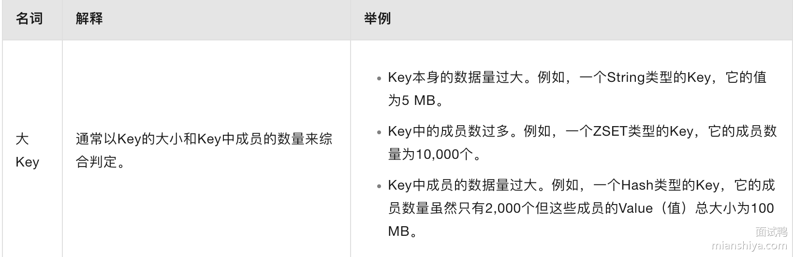

当然，这些标准并不是绝对的，具体的情况还是需要根据应用场景和实际情况来进行调整，这个需要你和面试官说明清楚。

#### 使用 bigkeys 命令查询 bigkeys

这个是 Redis 内置的指令，直接在 Redis 的客户端 redis-cli 中就可以调用使用，该命令可以获取 Redis 的整体信息，并且显示每种类型数据中最大的 Key。

如下所示，在命令行终端输入 `redis-cli --bigkeys` 便可以查看到（docker 版本的话可能会出现查找失败的情况）。


这种方法有优点，就是其是 Redis 内置的，其统计非常方便。

它的原理就是在 Redis 内部执行 scan 命令，遍历整个实例所有的 key，针对 key 的类型执行 strlen、hlen、scard 等命令获取字符串长度或集合的元素个数。

所以在线上执行这个命令的需要，需要关注性能问题，可以通过 -i 命令控制扫描的休息间隔，时间单位是秒。

还有一点，元素多不一定代表占用的内存多，需要实际评估下。

## 672. HTTP 和 HTTPS 有什么区别？

### 回答重点

1）数据传输安全性：

- **HTTP**：数据以明文传输，容易被窃听、篡改。
- **HTTPS**：通过 SSL/TLS 协议对数据进行加密传输，提供数据机密性和完整性保障。

2）端口号：

- **HTTP**：默认使用端口 80。
- **HTTPS**：默认使用端口 443。

3）性能：

- **HTTP**：无加密过程，连接建立速度稍快。
- **HTTPS**：基于 HTTP上又加了 SSL（Secure Sockets Layer）或 TLS（Transport Layer Security） 协议来实现的加密传输,加解密过程增加了计算开销，握手时间较长，但现代硬件和协议优化已使性能差距减小。

4）SEO 影响：

- **HTTP**：搜索引擎一般会降低未加密站点的排名。
- **HTTPS**：搜索引擎更倾向于优先展示 HTTPS 网站。

### 扩展知识

#### HTTPS 的握手过程

HTTPS 使用 TLS 协议进行握手，所以我们主要关注的是 TLS 的握手过程。

而 TLS 的握手根据密钥交互算法的不同，可以分为两种，一种是 RSA 算法另一种是 ECDHE 算法。

##### HTTPS RSA 算法握手流程

**一共需要四次握手：**

1. **客户端问候（ClientHello）**
2. **服务器问候（ServerHello）**
3. **客户端密钥交换（Client Key Exchange）** + **开始使用加密（Change Cipher Spec）** + **客户端完成（Client Finished）**
4. **服务器发送开始使用加密（Change Cipher Spec）** + **服务器完成（Server Finished）**

主要分为四次握手，内部还有一些细节交互，我们看下**详细分析：**

**1） 客户端问候（ClientHello）**

客户端向服务器发送一个 ClientHello 消息，包含：

- **TLS 版本**
- **加密算法套件**（Cipher Suites）
- **随机数**。

**2） 服务器问候（ServerHello）**

服务器接收到 ClientHello 后，会认证 TLS 版本号是否支持，选择一个加密算法套件，保证客户端的随机数，再生成一个随机数。所以 ServerHello 的消息包含：

- **确认的 TLS 版本**
- **确认的加密算法套件**（Cipher Suite）
- **随机数**。

除此之外，服务器还需向客户端发送自己的数字证书，内含公钥，用于证明其身份，这个步骤是**服务器证书（Server Certificate）**

最后，服务器会发送 **服务器完成（ServerHelloDone）**，表示握手的初步阶段结束。

**3）客户端密钥交换（Client Key Exchange） + 开始使用加密（Change Cipher Spec）+ 客户端完成（Client Finished）**

客户端通过 CA（证书认证机构）验证服务端传递过来的服务器证书可信后，再次生成一个随机数（pre-master），通过证书得到的公钥，加密通过客户端密钥交换（Client Key Exchange）发送给服务端。

紧接着再发送开始使用加密（Change Cipher Spec）给服务器端。因为此时不论是客户端还是服务端都拿到了三个随机数（第一次客户端给的、第二次服务端给的、第三次客户端的 pre-master）。

因此这三个随机数就可以作为对称加密的密钥，用户后续传输的加解密。**这个步骤后，后续的传输数据都是加密的**。

发送完（Change Cipher Spec）后，客户端再发送客户端完成（Client Finished），这个 Finished 会带上 Encrypted Handshake Message，这个 message 就是之前发送的所有数据的摘要，并且还用生成的对称加密密钥加密了，传递给服务器端验证，预防握手过程中的握手信息被修改。

4）**服务器发送开始使用加密（Change Cipher Spec）** + **服务器完成（Server Finished）**

同理，服务器也是一样发送（Change Cipher Spec），代表后续要用加密数据传输了，且发送握手摘要 给客户端验证，一切正常的话， RSA TLS 握手就结束了。


#### HTTPS ECDHE 算法握手流程

**同样也需要四次握手，大致步骤和 RSA 是一致的，主要区别在第二步：**

1. **客户端问候（ClientHello）**
2. **服务器问候（ServerHello）+ 服务器密钥交换（Client Key Exchange）**
3. **客户端密钥交换（Client Key Exchange）** + **开始使用加密（Change Cipher Spec）** + **客户端完成（Client Finished）**
4. **服务器发送开始使用加密（Change Cipher Spec）** + **服务器完成（Server Finished）**

但是内部细节交互和 RSA 有一些不同，我们看下**详细分析：**

**1） 客户端问候（ClientHello）**

客户端向服务器发送一个 ClientHello 消息，包含：

- **TLS 版本**
- **加密算法套件**（Cipher Suites）
- **随机数**。

这步和 RSA 一致。

**2） 服务器问候（ServerHello）+ 服务器密钥交换（Client Key Exchange）**

服务器接收到 ClientHello 后，会认证 TLS 版本号是否支持，选择一个加密算法套件，保证客户端的随机数，再生成一个随机数。所以 ServerHello 的消息包含：

- **确认的 TLS 版本**
- **确认的加密算法套件**（Cipher Suite），这里会选 ECDHE 相关的套件
- **随机数**。

同样，服务器也会向客户端发送自己的数字证书，内含公钥，用于证明其身份，这个步骤是**服务器证书（Server Certificate）**

**区别来了**。

ECDHE 实际上是基于椭圆曲线特性的算法，此时服务器需要确认选择的椭圆曲线以及一个随机数作为服务器椭圆曲线私钥，基于椭圆曲线和私钥算出椭圆曲线公钥。

为了防止公钥被修改，服务器通过 RSA 给公钥签名，最终利用（Server Key Exchange）发送给客户端。【椭圆曲线点这方面的知识仅做了解即可】

小结下 Server Key Exchange 消息的内容，包含：

- 椭圆曲线（如果客户端未指定）。
- 服务器的椭圆曲线公钥（用于 Diffie-Hellman 密钥交换）。
- 签名：服务器使用其私钥对相关参数进行签名（包括椭圆曲线参数和公钥），以确保这些参数没有被篡改。

最后，服务器会发送 **服务器完成（ServerHelloDone）**，表示握手的初步阶段结束。

**3）客户端密钥交换（Client Key Exchange） + 开始使用加密（Change Cipher Spec）+ 客户端完成（Client Finished）**

同样，客户端通过 CA（证书认证机构）验证服务端传递过来的服务器证书可信后，生成一个随机数作为客户端椭圆曲线私钥，基于椭圆曲线和私钥算出椭圆曲线公钥。

将这个公钥通过客户端密钥交换（Client Key Exchange）发送给服务端。

此时客户端和服务端拥有【客户端随机数+服务端随机数+共享密钥（对方公钥+自己私钥计算得到）】，**这三个元素生成最终的会话密钥**。

紧接着再发送开始使用加密（Change Cipher Spec）给服务器端。**这个步骤后，后续的传输数据都是加密的**。

发送完（Change Cipher Spec）后，客户端再发送客户端完成（Client Finished），这个 Finished 会带上 Encrypted Handshake Message，这个 message 就是之前发送的所有数据的摘要，并且还用生成的对称加密密钥加密了，传递给服务器端验证，预防握手过程中的握手信息被修改。

4）**服务器发送开始使用加密（Change Cipher Spec）** + **服务器完成（Server Finished）**

同理，服务器也是一样发送（Change Cipher Spec），代表后续要用加密数据传输了，且发送握手摘要 给客户端验证，一切正常的话， ECDHE TLS 握手就结束了。

所以 ECDHE 和 RSA 主要差别在第二次握手，服务端需要发送 （Server Key Exchange）。

#### HTTPS RSA 和 ECDHE 区别

可以从三个角度来看：

- 安全性：**ECDHE 提供前向安全性，而 RSA 不具备**。如果服务器的私钥泄露，基于 ECDHE 的握手不会影响之前的会话，而基于 RSA 的握手会导致之前的通信被解密。
- 计算复杂度：ECDHE 由于涉及椭圆曲线数学运算，相比 RSA 的操作更复杂，但提供更高的安全性。
- 使用场景：现代 HTTPS 实践中，**ECDHE 已成为首选**，因为它能够提供前向安全性，同时结合 RSA 或 ECDSA 用于签名和认证。

还有一点，基于 RSA 的 TLS 需要等四次握手完全结束后，客户端才可以发送数据，而 ECDHE 在客户端得到完整密钥后，可以直接开始发送数据。

#### SSL/TLS 协议的演进：

HTTPS 使用的加密协议从最初的 SSL（Secure Sockets Layer）演变为 TLS（Transport Layer Security）。

目前广泛使用的是 TLS 1.2 和 TLS 1.3。TLS 1.3 引入了更快的握手机制（0-RTT），进一步降低了延迟（QUIC内嵌使用这个协议）。

简单了解下 SSL/TLS 协议的演进之路：

1）**SSL 1.0**：

- **状态**：从未公开发布。
- **原因**：存在严重的安全漏洞，未达到发布标准。

2）**SSL 2.0**（1995年发布）：

- **特性**：是第一个公开发布的 SSL 版本，提供了基本的加密和认证功能。
- **问题**：存在多种安全问题，如容易受到截断攻击、缺乏握手完整性保护等。SSL 2.0 被认为不安全。

3）**SSL 3.0**（1996年发布）：

- **特性**：对 SSL 2.0 进行了显著改进，包括引入消息完整性校验、握手的改进以及更强的加密算法。
- **问题**：尽管较 SSL 2.0 更加安全，但 SSL 3.0 仍然存在漏洞，特别是后来被发现的 POODLE 攻击（Padding Oracle On Downgraded Legacy Encryption），导致 SSL 3.0 被废弃。

4）**TLS 1.0**（1999年发布）：

- **特性**：TLS（Transport Layer Security）是 SSL 3.0 的演进版。TLS 1.0 改进了加密算法、密钥生成、消息认证码（MAC）机制，并增加了对握手的保护。
- **问题**：随着时间推移，TLS 1.0 被发现存在对称密钥的选择偏差、密钥流恢复攻击等问题，且部分加密算法过时。

5）**TLS 1.1**（2006年发布）：

- **特性**：引入了对 CBC（Cipher Block Chaining）模式攻击的保护，改进了消息认证码（MAC）算法，并提供了更多加密算法的支持。
- **问题**：尽管修复了部分安全问题，但随着加密技术的发展，TLS 1.1 仍然不够安全，且效率较低。

6）**TLS 1.2**（2008年发布）：

- **特性**：支持更强的加密算法（如 AES-GCM），引入更灵活的握手机制，允许使用哈希算法（如 SHA-256）进行握手完整性校验，并提供了更好的安全性和性能。
- **问题**：尽管 TLS 1.2 被广泛采用，但随着计算能力的提高，安全社区逐渐意识到加密协议需要进一步优化以应对未来的威胁。

7）**TLS 1.3**（2018年发布）：

- **特性**：显著简化了握手过程，减少了加密套件的数量，移除了不安全的加密算法（如 RSA 密钥交换），采用了 0-RTT 握手以减少连接建立的延迟，并增强了前向保密性（Forward Secrecy）。
- **原因**：TLS 1.3 的发布主要是为了提高协议的安全性和性能，以应对现代计算环境中的安全需求。

## 958.分布式锁一般都怎样实现？ 

分布式锁需要实现多个应用实例之间的临界资源竞争，因此它需要依赖三方组件才能实现这样的功能。

常见依赖 Redis、ZooKeeper 来实现分布式锁。

### Redis 实现

基于缓存实现分布式锁性能上会有优势，可以使用 Redis SETNX （SET if Not eXists）实现分布式锁。

**注意锁需要设置过期时间**，防止应用程序崩溃导致锁没有释放而阻塞后面的所有操作。

获取锁：使用 `jedis.set(lockKey, lockValue, "NX", "PX", lockTimeout)` 尝试获取锁，NX 确保键不存在时才设置，PX 设置键的过期时间（毫秒）。

释放锁：使用 Lua 脚本确保只有持有锁的客户端才能删除锁。Lua 脚本会检查键的值是否等于 lockValue，如果是则删除该键。

简单示例如下，`acquireLock` 为获取锁，`releaseLock` 为释放锁：

```java
public class RedisDistributedLock {
    private static final String LOCK_SUCCESS = "OK";
    private static final Long RELEASE_SUCCESS = 1L;

    private Jedis jedis;
    private String lockKey;
    private String lockValue;
    private int lockTimeout;

    public RedisDistributedLock(Jedis jedis, String lockKey, int lockTimeout) {
        this.jedis = jedis;
        this.lockKey = lockKey;
        this.lockTimeout = lockTimeout;
        this.lockValue = UUID.randomUUID().toString();
    }

    public boolean acquireLock() {
        String result = jedis.set(lockKey, lockValue, "NX", "PX", lockTimeout);
        return LOCK_SUCCESS.equals(result);
    }

    public boolean releaseLock() {
        String releaseScript = 
            "if redis.call('get', KEYS[1]) == ARGV[1] then " +
            "return redis.call('del', KEYS[1]) " +
            "else return 0 end";
        Object result = jedis.eval(releaseScript, Collections.singletonList(lockKey), Collections.singletonList(lockValue));
        return RELEASE_SUCCESS.equals(result);
    }

    public static void main(String[] args) {
        // 创建一个 Jedis 连接实例
        Jedis jedis = new Jedis("localhost", 6379);

        // 创建分布式锁实例
        RedisDistributedLock lock = new RedisDistributedLock(jedis, "my_lock", 10000);

        // 尝试获取锁
        if (lock.acquireLock()) {
            try {
                // 执行你的业务逻辑
                System.out.println("Lock acquired, executing business logic...");
            } finally {
                // 释放锁
                lock.releaseLock();
                System.out.println("Lock released.");
            }
        } else {
            System.out.println("Unable to acquire lock, exiting...");
        }

        // 关闭 Jedis 连接
        jedis.close();
    }
}
```

**注意 lockValue 需要保证唯一，防止被别的客户端释放了锁**。

这里有个问题，如果业务还没执行完，则 Redis 的锁已经到期了怎么办？因此**引入“看门狗”机制**，即起一个后台定时任务，不断地给锁续期，如果锁释放了或客户端实例被关闭则停止续期，Redisson 提供了此功能。

注意：未指定超时时间的分布式锁才会续期，如果指定了超时时间则不会续期，默认 30s 超时，每 10s 续期一次，续期时长为 30s。

除了锁续期问题，还有单点故障问题，如果这台 Redis 挂了怎么办？分布锁就加不上了，业务就被阻塞了。

因此需要引入 Redis 主从，利用哨兵进行故障转移，但是这又会产生新的问题，如果 master 挂了，锁的信息还未传给 slave 节点，此时 slave 上是没加锁的，因此可能导致多个实例都成功上锁。

所以 Redis 作者又提出了 RedLock 即红锁，通过引入多个主节点共同加锁来解决单点故障问题（没有哨兵和 slave 了）。

比如现在有 5 个 Redis 节点（官方推荐至少 5 个），客户端获取当前时间 T1，然后依次利用 SETNX 对 5 个 Redis 节点加锁，如果成功 3 个及以上（大多数），再次获取当前时间 T2，如果 T2-T1 小于锁的超时时间，则加锁成功，反之则失败。

如果加锁失败则向全部节点调用释放锁的操作。

但是这个 redlock 还是有缺点的，首先它比较重，需要 5 个实例，成本不低。

其次如果发生时钟偏移，比如 5 个节点中有几个节点时间偏移了，导致锁提前超时了，那么有可能出现新客户端争抢到锁的情况，但是这个属于运维层面的问题。

还有一个就是 GC 问题，如果客户端抢到锁之后，发生了长时间的 GC 导致 redis 中锁都过期了，这样一来别的客户端就能得到锁了，且老客户端 GC 后正常执行后续的操作，导致并发修改，数据可能就不对了。不过这个问题无法避免，任何锁都可能会这样。

关于 RedLock 可以使用 Redisson ，它提供了 RedLock。

一般业务上，如果我们要使用 Redis 分布式锁，基本上使用 Redisson 客户端。

### ZooKeeper

除了 Redis 还可以使用 ZooKeeper 的**临时有序节点**实现分布式锁。

临时 能保证超时释放，有序 能选出谁抢到了锁。

大致流程：多进程争抢创建 ZooKeeper 指定目录下的临时有序节点，创建序号最小的节点即抢到锁的进程，释放锁可以删除此节点，如果服务端挂了也会释放这个节点。

优点：如果本身已经引入了 ZooKeeper 则成本不大，实现比较简单。

缺点：相比于 Redis 性能没那么好，ZooKeeper 的写入只能写到主节点，然后同步到从节点。并且临时节点如果产生网络抖动，节点也会被删除，导致多个客户端抢到锁（当然有重试机制，产生的概率比较低）。

可使用 curator 客户端实现的分布式锁接口。


## 558. 如何对 Java 的垃圾回收进行调优？

### 回答重点

> GC 调优这种问题肯定是具体场景具体分析，但是在面试中就不要讲太细，大方向说清楚就行，不需要涉及具体的垃圾收集器比如 CMS 调什么参数，G1 调什么参数之类的。

**GC 调优的核心思路就是尽可能的使对象在年轻代被回收，减少对象进入老年代。**

具体调优还是得看场景根据 GC 日志具体分析，常见的需要关注的指标是 Young GC 和 Full GC 触发频率、原因、晋升的速率、老年代内存占用量等等。

比如发现频繁会产生 Full GC，分析日志之后发现没有内存泄漏，只是 Young GC 之后会有大量的对象进入老年代，然后最终触发 Ful GC。所以就能得知是 Survivor 空间设置太小，导致对象过早进入老年代，因此调大 Survivor 。

或者是晋升年龄设置的太小，也有可能分析日志之后发现是内存泄漏、或者有第三方类库调用了 System.gc 等等。

反正具体场景具体分析，**核心思想就是尽量在新生代把对象给回收了。**

基本上这样答就行了，然后就等着面试官延伸了。

### 扩展知识

- [559. 常用的 JVM 配置参数有哪些？](https://www.mianshiya.com/bank/1789931432793948162/question/1780933295312236546)

## 169. 如何设计一个点赞系统？

点赞系统看似简单，实则非常复杂，它可以从系统架构、库表设计、数据存储、性能优化、容灾备份等多个角度来思考设计。

我们可以由浅入深的向面试官来说出这个实现方案：

### 系统架构设计

从架构方面需要考虑：服务拆分、异步、缓存。

1）分布式架构

大流量场景下，可以将点赞功能独立成一个服务，解耦业务逻辑，便于扩展和维护。例如点赞服务压力倍增的时候，可以仅扩容点赞服务即可。

2）异步处理

只要涉及到大流量，且实时性并没有那么强烈的场景，就需要考虑异步。可以使用消息队列（如 Kafka、RocketMQ）来异步处理点赞请求，减少直接写数据库的压力。

3）缓存机制

除了异步，其实也可以利用缓存（如 Redis、Memcached）存储点赞数，减少数据库访问

### 库表设计

这边简单给一个库表设计供大家参考：

1）点赞记录表

```sql
CREATE TABLE like_record (
    id BIGINT AUTO_INCREMENT PRIMARY KEY,
    user_id BIGINT NOT NULL,
    item_id BIGINT NOT NULL,
    liked_at TIMESTAMP DEFAULT CURRENT_TIMESTAMP,
    UNIQUE KEY unique_user_item (user_id, item_id)
) ENGINE=InnoDB;
```

2）点赞数汇总表

```sql
CREATE TABLE like_count (
    item_id BIGINT PRIMARY KEY,
    like_count BIGINT DEFAULT 0
) ENGINE=InnoDB;
```

### 数据存储

上面我们提到了缓存，实际上很多公司除了用 MySQL 存储数据之外，还会利用缓存来存储这种高并发修改的数据。

例如使用 Redis 存储点赞数，承接实时的热数据，后续再将点赞数落库存储至 MySQL 中。即将热门的点赞数缓存到 Redis 中，设置适当的过期时间，定期同步到数据库。

有些大公司还会对缓存进行改造，保证缓存本身的数据持久性。

### 性能优化

1）数据库优化

例如为常用查询添加合适的索引。like_record 表的 user_id 和 item_id 字段。

如果整体的数据量过大，我们还根据 item_id 或 user_id 对数据进行分库分表，减少单个表的写压力。

2）缓存优化

处理上面提到的 Redis 分布式缓存，还可以利用本地缓存来减轻 Redis 的压力，但是要考虑好数据同步的问题。

3）异步批量处理

对于点赞数的写入，我们可以将一定时间窗口内的点赞请求批量更新到数据库，减少数据库的写操作。

如果用了缓存，那么可以使用定时任务定期将 Redis 中的数据同步到数据库，确保数据一致性。

### 容灾备份

一个系统的设计肯定需要考虑容灾备份，所以这点跟面试官提出来，会觉得你考虑周到，比较有经验。

1）数据备份

- 定期备份：对数据库进行定期备份，使用增量备份和全量备份相结合的策略。
- 异地备份：有条件的公司（几乎很少）会进行异地备份，防止极端情况发生。

2）高可用架构

- 数据库主从复制：使用 MySQL 主从复制或 Redis 主从复制，实现数据的高可用性。

3）容灾演练

定期进行容灾演练，确保在发生故障时系统能够快速恢复。有些公司还有混沌工程。

> 混沌工程是一种故意向系统注入故障以测试其恢复能力的做法。其目的是找出潜在的故障点，并在它们造成实际中断或其他破坏之前加以纠正

简单来说，例如随便把线上的一台服务停了，看看系统是否能正常运行，来测试故障情况下系统的稳定性。


## 578. Spring 如何解决循环依赖？

### 回答重点

关键就是**提前暴露未完全创建完毕的 Bean**。

在 Spring 中主要是使用**三级缓存**来解决了循环依赖：

- 一级缓存（Singleton Objects Map）: 用于存储完全初始化完成的单例Bean。
- 二级缓存（Early Singleton Objects Map）: 用于存储尚未完全初始化，但已实例化的Bean，用于提前暴露对象，避免循环依赖问题。
- 三级缓存（Singleton Factories Map）: 用于存储对象工厂，当需要时，可以通过工厂创建早期Bean（特别是为了支持AOP代理对象的创建）。

**解决步骤**：

- Spring 首先创建 Bean 实例，并将其加入三级缓存中（Factory）。
- 当一个 Bean 依赖另一个未初始化的 Bean 时，Spring 会从三级缓存中获取 Bean 的工厂，并生成该 Bean 的对象（若有代理则是代理对象）。
- 代理对象存入二级缓存，解决循环依赖。
- 一旦所有依赖 Bean 被完全初始化，Bean 将转移到一级缓存中。

### 扩展知识

在 Spring 中，只有同时满足以下两点才能解决循环依赖的问题：

1. 依赖的 Bean 必须都是单例
2. 依赖注入的方式，必须**不全是**构造器注入，且 beanName 字母序在前的不能是构造器注入

### 为什么必须都是单例

如果从源码来看的话，循环依赖的 Bean 是原型模式，会直接抛错：


所以 Spring 只支持单例的循环依赖，**但是为什么呢**？

按照理解，如果两个 Bean 都是原型模式的话，那么创建 A1 需要创建一个 B1，创建 B1 的时候要创建一个 A2，创建 A2 又要创建一个 B2，创建 B2 又要创建一个 A3，创建 A3 又要创建一个 B3.....

就又卡 BUG 了，是吧，因为原型模式都需要创建新的对象，不能跟用以前的对象。

如果是单例的话，创建 A 需要创建 B，而创建的 B 需要的是之前的个 A， 不然就不叫单例了，对吧？

也是基于这点， Spring 就能操作操作了。

具体做法就是：先创建 A，此时的 A 是不完整的（没有注入 B），用个 map 保存这个不完整的 A，再创建 B ，B 需要 A，所以从那个 map 得到“不完整”的 A，此时的 B 就完整了，然后 A 就可以注入 B，然后 A 就完整了，B 也完整了，且它们是相互依赖的。


读起来好像有点绕，但是逻辑其实很清晰。

### 为什么不能全是构造器注入

在 Spring 中创建 Bean 分三步:

1. 实例化，createBeanInstance，就是 new 了个对象
2. 属性注入，populateBean， 就是 set 一些属性值
3. 初始化，initializeBean，执行一些 aware 接口中的方法，initMethod，AOP代理等

明确了上面这三点，再结合我上面说的“不完整的”，我们来理一下。

如果全是构造器注入，比如`A(B b)`，那表明在 new 的时候，就需要得到 B，此时需要 new B ，但是 B 也是要在构造的时候注入 A ，即`B(A a)`，这时候 B 需要在一个 map 中找到不完整的 A ，发现找不到。

为什么找不到？因为 A 还没 new 完呢，所以找不到完整的 A，**因此如果全是构造器注入的话，那么 Spring 无法处理循环依赖**。

### 一个set注入，一个构造器注入一定能成功？

假设我们 A 是通过 set 注入 B，B 通过构造函数注入 A，此时是**成功的**。

我们来分析下：实例化 A 之后，此时可以在 map 中存入 A，开始为 A 进行属性注入，发现需要 B，此时 new B，发现构造器需要 A，此时从 map 中得到 A ，B 构造完毕，B 进行属性注入，初始化，然后 A 注入 B 完成属性注入，然后初始化 A。

整个过程很顺利，没毛病。


假设 A 是通过构造器注入 B，B 通过 set 注入 A，此时是**失败的**。

我们来分析下：实例化 A，发现构造函数需要 B， 此时去实例化 B，然后进行 B 的属性注入，从 map 里面找不到 A，因为 A 还没 new 成功，所以 B 也卡住了，然后就 gg。


看到这里，仔细思考的小伙伴可能会说，可以先实例化 B 啊，往 map 里面塞入不完整的 B，这样就能成功实例化 A 了啊。

确实，思路没错**但是 Spring 容器是按照字母序创建 Bean 的，A 的创建永远排在 B 前面**。

现在我们总结一下：

- 如果循环依赖都是构造器注入，则失败
- 如果循环依赖不完全是构造器注入，则可能成功，可能失败，具体跟BeanName的字母序有关系。

### Spring 解决循环依赖全流程

经过上面的铺垫，我想你对 Spring 如何解决循环依赖应该已经有点感觉了，接下来我们就来看看它到底是如何实现的。

明确了 Spring 创建 Bean 的三步骤之后，我们再来看看它为单例搞的三个 map：

1. 一级缓存，singletonObjects，存储所有已创建完毕的单例 Bean （完整的 Bean）
2. 二级缓存，earlySingletonObjects，存储所有仅完成实例化，但还未进行属性注入和初始化的 Bean
3. 三级缓存，singletonFactories，存储能建立这个 Bean 的一个工厂，通过工厂能获取这个 Bean，延迟化 Bean 的生成，工厂生成的 Bean 会塞入二级缓存

这三个 map 是如何配合的呢？

1. 首先，获取单例 Bean 的时候会通过 BeanName 先去 singletonObjects（一级缓存） 查找完整的 Bean，如果找到则直接返回，否则进行步骤 2。
2. 看对应的 Bean 是否在创建中，如果不在直接返回找不到（返回null），如果是，则会去 earlySingletonObjects （二级缓存）查找 Bean，如果找到则返回，否则进行步骤 3
3. 去 singletonFactories （三级缓存）通过 BeanName 查找到对应的工厂，如果存着工厂则通过工厂创建 Bean ，并且放置到 earlySingletonObjects 中。
4. 如果三个缓存都没找到，则返回 null。

从上面的步骤我们可以得知，如果查询发现 Bean 还未创建，到第二步就直接返回 null，不会继续查二级和三级缓存。

返回 null 之后，说明这个 Bean 还未创建，这个时候会标记这个 Bean 正在创建中，然后再调用 createBean 来创建 Bean，而实际创建是调用方法 doCreateBean。

doCreateBean 这个方法就会执行上面我们说的三步骤：

1. 实例化
2. 属性注入
3. 初始化

在实例化 Bean 之后，**会往 singletonFactories 塞入一个工厂，而调用这个工厂的 getObject 方法，就能得到这个 Bean**。

```java
addSingletonFactory(beanName, () -> getEarlyBeanReference(beanName, mbd, bean));
```

要注意，此时 Spring 是不知道会不会有循环依赖发生的，**但是它不管**，反正往 singletonFactories 塞这个工厂，这里就是**提前暴露**。

然后就开始执行属性注入，这个时候 A 发现需要注入 B，所以去 getBean(B)，此时又会走一遍上面描述的逻辑，到了 B 的属性注入这一步。

此时 B 调用 getBean(A)，这时候一级缓存里面找不到，但是发现 A 正在创建中的，于是去二级缓存找，发现没找到，于是去三级缓存找，然后找到了。

并且通过上面提前在三级缓存里暴露的工厂得到 A，然后将这个工厂从三级缓存里删除，并将 A 加入到二级缓存中。

然后结果就是 B 属性注入成功。

紧接着 B 调用 initializeBean 初始化，最终返回，此时 B 已经被加到了一级缓存里 。

这时候就回到了 A 的属性注入，此时注入了 B，接着执行初始化，最后 A 也会被加到一级缓存里，且从二级缓存中删除 A。

Spring 解决依赖循环就是按照上面所述的逻辑来实现的。

重点就是在对象实例化之后，都会在三级缓存里加入一个工厂，提前对外暴露还未完整的 Bean，这样如果被循环依赖了，对方就可以利用这个工厂得到一个不完整的 Bean，破坏了循环的条件。


## 894. HTTP 与 RPC 之间的区别？

### 回答重点

严格上讲，HTTP 和 RPC 不是一个层面的东西：

- HTTP 是一种应用层的协议，主要强调的是网络通信；
- RPC，其是一种分布式系统之间通信的方式，强调的是服务之间的远程调用。

有一些 RPC 框架底层使用的是 HTTP 协议实现通信，比如 gRPC，其底层使用的就是 HTTP/2, 然后还有 Dubbo，其现在也兼容 gRPC 了，并且使用了 HTTP/2 作为传输协议，如下图所示：


这里为了方便大家理解，制作了一个表格，大家可以看一下表格：


> 说明：IDL 是指接口定义语言，如二进制、JSON、Protocol Buffers 等。

### 扩展知识

#### **定义与基本概念**

**HTTP（HyperText Transfer Protocol）**：

- **定义**：HTTP 是一种基于请求-响应模型的应用层协议，主要用于 Web 应用之间的数据传输。它使用 **URL** 来标识资源，并通过标准化的 HTTP 方法（如 GET、POST、PUT、DELETE）来对资源进行操作。
- **传输格式**：通常使用**文本格式**（如 JSON、XML）传输数据，容易被人类阅读和理解。由于 HTTP 是基于 TCP 的应用层协议，因此它的消息体较大，适用于 Web 页面、API 等场景。

**RPC（Remote Procedure Call）**：

- **定义**：RPC 是一种远程过程调用协议，它允许客户端像调用本地方法一样调用远程服务器上的方法。RPC 关注的是**调用方法或函数**而不是资源。
- **传输格式**：RPC 传输的数据通常是**二进制格式**（如 Protocol Buffers、Thrift），数据量较小，效率较高。RPC 通常基于 **TCP** 进行通信，也可以直接使用 HTTP。

#### RPC 常见的实现框架

**gRPC**：

- **简介**：gRPC 是 Google 开发的高性能 RPC 框架，基于 **HTTP/2** 协议，可以进行双向流通信，支持负载均衡、认证、追踪等特性。
- **优点**：使用 **Protocol Buffers（Protobuf）** 进行序列化和反序列化，传输效率高，适合微服务间的高性能通信。
- **应用场景**：适合需要高效传输和复杂数据结构的微服务架构，如实时通信服务、物联网数据传输。

**Thrift**：

- **简介**：Thrift 是由 **Apache** 维护的跨语言 RPC 框架，支持多种语言（如 Java、C++、Python、PHP），通过定义接口描述文件（IDL）来生成客户端和服务端代码。
- **优点**：支持多语言环境，适合异构系统之间的高效通信。
- **应用场景**：适用于需要跨语言、高性能的 RPC 调用场景，如大数据平台中的服务调用。

**Dubbo**：

- **简介**：Dubbo 是阿里巴巴开源的 Java RPC 框架，提供了高性能的远程服务调用能力，支持负载均衡、服务注册与发现等特性。
- **优点**：与 Spring 生态深度集成，支持多种通信协议和序列化方式，适合 Java 生态下的分布式系统。
- **应用场景**：适合中国市场中基于 Java 的微服务系统，特别是在 Spring Boot 环境下的微服务调用。

## 559. 常用的 JVM 配置参数有哪些？

- -Xms：初始化堆内存大小
- -Xmx：最大堆内存大小
- -Xss：设置每个线程的栈大小
- -XX:MetaspaceSize：初始化元空间大小
- -XX:MaxMetaspaceSize：最大元空间大小
- -XX:+HeapDumpOnOutOfMemoryError：当发生 OutOfMemoryError 时，生成堆转储（heap dump）
- -XX:+PrintGCDetails：打印详细的垃圾回收日志
- -XX:+UseG1GC：启用G1垃圾收集器
- -XX:+UseConcMarkSweepGC：启用CMS垃圾收集器
- -XX:+UseZGC：启用ZGC（低延迟垃圾收集器）

## 647. 如何解决 Redis 中的热点 key 问题？

### 回答重点

Redis 中的热点 Key 问题是指某些 Key 被频繁访问，导致 Redis 的压力过大，进而影响整体性能甚至导致集群节点故障。

解决热点 Key 问题的主要方法包括：

- **热点 key 拆分**：将热点数据分散到多个 Key 中，例如通过引入随机前缀，使不同用户请求分散到多个 Key，多个 key 分布在多实例中，避免集中访问单一 Key。
- **多级缓存**：在 Redis 前增加其他缓存层（如 CDN、本地缓存），以分担 Redis 的访问压力。
- **读写分离**：通过 Redis 主从复制，将读请求分发到多个从节点，从而减轻单节点压力。
- **限流和降级**：在热点 Key 访问过高时，应用限流策略，减少对 Redis 的请求，或者在必要时返回降级的数据或空值。

### 扩展知识

#### 热点 key 的定义

热点 Key 与 big key 一样，没有一个很明确的定义来约定什么样的 key 叫做热点 key。

我们可以参考阿里云 Redis 对热 key 的定义：


可以看到，如果一个 key 的访问频率占比过大，或带宽占比过大，都属于热点 key。

由于 Redis 的读写是单线程执行的，所以热点 key 可能会影响 Redis 的整体效率，消耗大量的 CPU 资源，从而降低 Redis 的整体吞吐量。集群环境下会使得流量不均衡，从而导致读写热点倾斜问题的发生。

#### 如何发现热 key？

1）**根据业务经验进行分析**

这个主要就是依据业务场景进行分析，通过经验判断哪些 key 可能成为热门 key，比如某明星的花边新闻、秒杀活动，演唱会门票等。

- 优点：这个方案实现起来简单直接，只有直接进行判断就可以了，基本没有什么成本。
- 缺点：这个主要依据业务能力，对于业务能力有一定的要求，并且不是所有的业务都能判断出来是否是热 key 的。且有些突发事情是无法预测的。

2）**redis 集群监控**

这种方式主要依据与 Redis 集群，我们只需要查看集群中哪个 Redis 出现 QPS 倾斜，而出现 QPS 倾斜的实例有极大的概率存在热点 Key。

- 优点：这种方案和上面差不多，由于企业的 Redis 大多数是集群部署，所以使用起来非常简单。
- 缺点：每次发生状况都需要排查，因为不一定所有的 QPS 倾斜都是热 Key 导致的。

3）**使用 hotkey 监控**

这个是 Redis 4.0 版本之后引入的一个新的指令，只需要在命令行执行 redis-cli 的时候加上 --hotkeys 的选项就可以了。它是通过 scan + object freq 实现的。

- 优点：因为这个命令是 Redis 自带的，使用起来简单快捷
- 缺点：需要扫描整个 keyspace，如果 Redis 中的 key 数量比较多的话，可能导致执行时间非常长，且实时性不好。

4）**使用 monitor 命令**

如下图所示，这个是 Redis 自 1.0 起就支持的功能。


当通过 MONITOR 命令开启监视器之后，Redis 只需要在执行之后结合一些日志和相关的分析工具就可以进行统计。

- 优点：这个方案的优点在于这个是 Redis 原生支持的功能，使用起来简单快捷。
- 缺点：monitor 非常消耗性能，单个客户端执行 monitor 就会损耗 50% 的性能！不推荐这个方式！

以下为 redis 官网的 benchmark：


5）**客户端收集**

在操作 Redis 之前，通过加上统计 Redis 键值查询频次的逻辑，将统计数据发送给一个聚合计算平台进行计算，计算之后查看相对应的结果

- 优点：对性能损耗较低。
- 缺点：成本较大，企业如果没有聚合计算平台还需要引入。

6）**代理层收集**

在代理层进行统一的收集，因为有些服务在请求 Redis 之前都会请求一个代理服务，这种场景可以使用在代理层收集 Redis 热 Key 数据，和在客户端收集比较类似。

- 优点：客户端使用方便，不需要考虑 SDK 多语言异构差异和升级成本高的问题。
- 缺点：需要给 Redis 定制一个代理层，进行转发等操作，构建代理成本不低，且转发有性能损耗。

#### 应用程序中的多级缓存

在应用程序中，一般结合使用一级缓存和二级缓存：

- 一级缓存：一般指的是应用程序本地缓存（如 JVM 内存中的缓存）。
- 二级缓存：则为 Redis 缓存。当数据不在一级缓存中时，才会请求二级缓存。

通过这种多级缓存架构，可以有效减少 Redis 的访问次数，从而避免单 Key 的热点问题。

#### **热点 key 的拆分**

我们可以按照不同场景做不同的“拆分“。有些场景可以全量拷贝，即将 mianshiya 这个 key 复制成 mianshiya_1、mianshiya_2、mianshiya_3 ，**它们之间的数据是一致的**，这样不同用户都访问到全量的数据。

有些场景直接进行 key 的拆分，mianshiya_1、mianshiya_2、mianshiya_3 **各存一部分的数据**，不同用户仅需访问不同数据即可，例如一些推流信息，因为一个热点往往有很多发布者，大家看一部分，后续热度稍微降低下来，可以替换数据。

不同用户可以进行 hash，将用户 id 哈希之后取余得到后缀，拼上 mianshiya_ 即可组成一个 key。


## 673. TCP 是用来解决什么问题？

### 回答重点

TCP （Transmission Control Protocol）通过提供可靠传输、流量控制、拥塞控制和连接管理，解决了数据在不可靠的 IP 网络上的传输问题：

1）可靠性传输：TCP 确保数据包在网络传输过程中不丢失、不重复，并且按顺序到达。通过确认（ACK）、重传机制以及序列号，TCP 能够保证数据在不可靠的 IP 网络上可靠传输。

2）流量控制：TCP 通过滑动窗口机制调节发送方的数据发送速率，防止接收方因为处理能力有限而被数据流淹没。

3）拥塞控制：TCP 通过拥塞避免算法（如慢启动、拥塞避免、快速重传和快速恢复）来防止网络过载，确保网络资源的公平使用和稳定性。

4）连接管理：TCP 是面向连接的协议，采用三次握手（建立连接）和四次挥手（断开连接）机制来管理会话，确保通信的可靠性和状态的同步。

### 扩展知识

1）数据包重排序与重传机制：

- TCP 的序列号机制确保数据包按照正确的顺序组装。接收方通过序列号识别数据包的顺序，如果检测到丢失或乱序的包，会请求重传，保证数据完整性。

2）滑动窗口与流量控制：

- 滑动窗口用于动态调整可以发送的数据量。接收方通过发送窗口大小通告，指示发送方可以发送的最大数据量。这种机制不仅避免了接收方的溢出，还提高了数据传输效率。

3）拥塞控制算法： TCP 的拥塞控制算法是核心的网络稳定性保证。经典算法包括以下几个步骤：

- 慢启动：逐步增加发送窗口，直到检测到网络的拥塞点。
- 拥塞避免：当达到网络容量后，逐渐增加窗口以避免拥塞。
- 快速重传和快速恢复：在检测到包丢失时，立即进行重传并调整发送窗口，快速恢复正常传输状态。

4）TCP 三次握手与四次挥手：

- 三次握手：建立连接时，双方通过三次信息交换（SYN, SYN-ACK, ACK）来确保双方都准备好进行数据传输，并协商参数（如初始序列号）。
- 四次挥手：断开连接时，通过四次消息交换来确保数据传输完成且资源可以安全释放，防止未传输的数据丢失。

5）TCP 的适应性与演变：

- 随着互联网的发展，TCP 也经历了多次改进，如 TCP Reno、TCP NewReno、TCP Vegas 等，它们在拥塞控制和流量管理上有不同的策略，以适应不同的网络环境。

6）TCP 的局限性：

- 虽然 TCP 解决了可靠传输的问题，但在高延迟、高带宽的网络（如卫星通信、现代数据中心）中可能会受到性能瓶颈，进而催生了如 QUIC 等新协议的出现。

更多 QUIC 细节参见 [670. HTTP 1.0 和 2.0 有什么区别？](https://www.mianshiya.com/bank/1790948499480616961/question/1780933295710695425) 内扩展知识 HTTP 3.0 时代

#### TCP 为什么可靠？

TCP 之所以被称为可靠的协议，主要是因为它提供了以下功能：

1. 数据完整性：使用校验和确保数据在传输中没有被破坏。
2. 数据顺序：保证数据按顺序到达接收方，且接收方能够重新排序乱序到达的数据。
3. 流量控制：通过滑动窗口机制避免接收方溢出。
4. 拥塞控制：通过动态调整发送速率避免网络拥塞。
5. 重传机制：确保丢失的数据会被重新传输。
6. 可靠的连接建立和关闭：通过三次握手和四次挥手确保连接的正确建立和断开。
7. 防止数据重复：通过序列号和确认机制防止重复数据的接收。

## 732. 让你设计一个 RPC 框架，怎么设计？

先直接跟面试官说下 RPC 框架基础的核心点：

**其实**就这么几点：

1）动态代理(屏蔽底层调用细节)
 2）序列化(网络数据传输需要扁平的数据)
 3）协议(规定协议，才能识别数据)
 4）网络传输(I/O模型相关内容，一般用 Netty 作为底层通信框架即可)


注意，上面加粗的其实二字，一定要说，要注意语气，要显得你游刃有余，低调奢华。

这属于 RPC 框架的基础，生产级别的框架还需要注册中心作为服务的发现，且还需提供路由分组、负载均衡、异常重试、限流熔断等其他功能。

说到这就可以停下了，然后等面试官发问，正常情况下他会选一个点进行深入探讨，这时候我们只能见招拆招了。

\--

下面我们来深入剖析下 RPC，从根上理解它。

RPC 全称是 Remote Procedure Call ，即远程过程调用，其对应的是我们的本地调用。

远程其实指的就是需要网络通信，可以理解为调用远程机器上的方法。

那可能有人说：我用 HTTP 调用不就是远程调用了，那不也叫 RPC 了？

不是的，RPC 的目的是：让我们调用远程方法像调用本地方法一样无差别。

来看下代码就很清晰，比如本来没有拆分服务都是本地调用的时候方法是这样写的：

```java
public String getSth(String str) {
     return yesService.get(str);
}
```

如果 yesSerivce 被拆分出去，此时需要远程调用了，如果用 HTTP 方式，可能就是：

```java
public String getSth(String str) {
    RequestParam param = new RequestParam();
    ......
    return HttpClient.get(url, param,.....);
}
```

此时需要关心远程服务的地址，还需要组装请求等等，而如果采用 RPC 调用那就是：

```java
    public String getSth(String str) {
        // 看起来和之前调用没差？哈哈没唬你，
        // 具体的实现已经搬到另一个服务上了，这里只有接口。
        // 看完下面就知道了。
         return yesService.get(str);  
    }
```

所以说 **RPC 其实就是用来屏蔽远程调用网络相关的细节，使得远程调用和本地调用使用一致**，让开发的效率更高。

在了解了 RPC 的作用之后，我们来看看 RPC 调用需要经历哪些步骤。

## RPC 调用基本流程

按上面的例子来说，yesService 服务实现被移到了远程服务上，本地没有具体的实现只有一个接口。

那这时候我们需要调用 `yesService.get(str)` ，该怎么办呢？

我们所要做的就是把**传入的参数和调用的接口全限定名通过网络通信告知到远程服务**那里。

然后远程服务接收到参数和接口全限定名就能选中具体的实现并进行调用。

业务处理完之后再通过网络返回结果，这就搞定了！


上面的操作这些就是由`yesService.get(str)` 触发的。

不过我们知道 yesService 就是一个接口，没有实现的，所以这些操作是怎么来的？

**是通过动态代理来的。**

RPC 会给接口生成一个代理类，所以我们调用这个接口实际调用的是动态生成的代理类，由代理类来触发远程调用，这样我们调用远程接口就无感知了。

动态代理想必大家都比较熟悉，最常见的就是 Spring 的 AOP 了，涉及的有 JDK 动态代理和 cglib。

在 Dubbo 中用的是 Javassist，至于为什么用这个其实梁飞大佬已经写了博客说明了。

他当时对比了 JDK 自带的、ASM、CGLIB(基于ASM包装)、Javassist。

经过测试最终选用了 Javassist。

> 梁飞：最终决定使用JAVAASSIST的字节码生成代理方式。 虽然ASM稍快，但并没有快一个数量级，而JAVAASSIST的字节码生成方式比ASM方便，JAVAASSIST只需用字符串拼接出Java源码，便可生成相应字节码，而ASM需要手工写字节码。

可以看到选择一个框架的时候性能是一方面，易用性也很关键。

说回 RPC 。

现在我们知道动态代理屏蔽了 RPC 调用的细节，使得用户无感知的调用远程服务，那调用的细节有哪些呢？

### 序列化

像我们的请求参数都是对象，有时候是定义的 DTO ，有时候是 Map ，这些对象是无法直接在网络中传输的。

你可以理解为对象是“立体”的，而网络传输的数据是“扁平”的，最终需要转化成“扁平”的二进制数据在网络中传输。


你想想，各对象分配在内存不同位置，各种引用，这看起来是不是有种立体的感觉？最终都是要变成一段01组成的数字传输给对方，这种就01组成的数字看起来是不是很“扁平”？

**把对象转化成二进制数据的过程称为序列化，把二进制数据转化成对象的过程称为反序列化。**

当然如何选择序列化格式也很重要。

比如采用二进制的序列化格式数据更加紧凑，采用 JSON 等文本型序列化格式可读性更佳，排查问题比较方便。

还有很多序列化选择，一般需要**综合考虑通用性、性能、可读性和兼容性**。

具体本文就不分析了，之后再专门写一篇分析各种序列化协议的。

### RPC 协议

刚才也提到了只有二进制数据才能在网络中传输，那一堆二进制在底层看来是连起来的，它可不会管你哪些数据是哪个请求的，那接收方得知道呀，不然就不能顺利的把二进制数据还原成对应的一个个请求了。

于是就需要定义一个协议，来约定一些规范，制定一些边界使得二进制数据可以被还原。

比如下面一串数字按照不同位数来识别得到的结果是不同的。


所以协议其实就定义了到底如何构造和解析这些二进制数据。

我们的参数肯定比上面的复杂，因为参数值长度是不定的，而且协议常常伴随着升级而扩展，毕竟有时候需要加一些新特性，那么协议就得变了。

一般 RPC 协议都是**采用协议头+协议体的方式。**

协议头放一些元数据，包括：魔法位、协议的版本、消息的类型、序列化方式、整体长度、头长度、扩展位等。

协议体就是放请求的数据了。

通过魔法位可以得知这是不是咱们约定的协议，比如魔法位固定叫 233 ，一看我们就知道这是 233 协议。

然后协议的版本是为了之后协议的升级。

从整体长度和头长度我们就能知道这个请求到底有多少位，前面多少位是头，剩下的都是协议体，这样就能识别出来，扩展位就是留着日后扩展备用。

贴一下 Dubbo 协议：

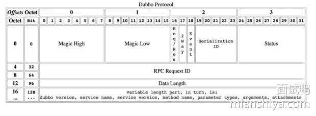

可以看到有 Magic 位，请求 ID， 数据长度等等。

### 网络传输

组装好数据就等着发送了，这时候就涉及网络传输了。

网络通信那就离不开网络 IO 模型了。


网络 IO 分为这四种模型，具体以后单独写文章分析，这篇就不展开了。

一般而言我们用的都是 IO 多路复用，因为大部分 RPC 调用场景都是高并发调用，IO 复用可以利用较少的线程 hold 住很多请求。

一般 RPC 框架会使用已经造好的轮子来作为底层通信框架。

例如 Java 语言的都会用 Netty ，人家已经封装的很好了，也做了很多优化，拿来即用，便捷高效。

## 小结

RPC 通信的基础流程已经讲完了，回顾下之前的图：


响应返回就没画了，反正就是倒着来。

我再用**一段话来总结**一下：

服务调用方，面向接口编程，利用动态代理屏蔽底层调用细节将请求参数、接口等数据组合起来并通过序列化转化为二进制数据，再通过 RPC 协议的封装利用网络传输到服务提供方。

服务提供方根据约定的协议解析出请求数据，然后反序列化得到参数，找到具体调用的接口，然后执行具体实现，再返回结果。

**这里面还有很多细节。**

比如请求都是异步的，所以每个请求会有唯一 ID，返回结果会带上对应的 ID， 这样调用方就能通过 ID 找到对应的请求塞入相应的结果。

有人会问为什么要异步，那是为了提高吞吐。

当然还有很多细节，会在之后剖析 Dubbo 的时候提到，结合实际中间件体会才会更深。

## 真正工业级别的 RPC

以上提到的只是 RPC 的基础流程，这对于工业级别的使用是远远不够的。

生产环境中的服务提供者都是集群部署的，所以有多个提供者，而且还会随着大促等流量情况动态增减机器。

**因此需要注册中心，作为服务的发现。**

调用者可以通过注册中心得知服务提供者们的 IP 地址等元信息，进行调用。

调用者也能通过注册中心得知服务提供者下线。

还需要有**路由分组策略**，调用者根据下发的路由信息选择对应的服务提供者，能实现分组调用、灰度发布、流量隔离等功能。

还需要有**负载均衡策略**，一般经过路由过滤之后还是有多个服务提供者可以选择，通过负载均衡策略来达到流量均衡。

当然还需要有**异常重试**，毕竟网络是不稳定的，而且有时候某个服务提供者也可能出点问题，所以一次调用出错进行重试，减少业务的损耗。

还需要**限流熔断**，限流是因为服务提供者不知道会接入多少调用者，也不清楚每个调用者的调用量，所以需要衡量一下自身服务的承受值来进行限流，防止服务崩溃。

而熔断是为了防止下游服务故障导致自身服务调用超时阻塞堆积而崩溃，特别是调用链很长的那种，影响很大，比如A=>B=>C=>D=>E，然后 E 出了故障，你看ABCD四个服务就傻等着，慢慢的资源就占满了就崩了，全崩。


大致就是以上提到的几点，不过还能细化，比如负载均衡的各种策略、限流到底是限制总流量还是根据每个调用者指定限流量，还是上自适应限流等等。

## 533. Java 中常见的垃圾收集器有哪些？

### 回答重点

分为新生代收集器和老年代收集器来看，常见的垃圾收集器包括：

#### **新生代垃圾收集器**：

1）**Serial 收集器**：

- 单线程收集器，适合小型应用和单处理器环境。
- 触发 Stop-The-World（STW）操作，所有应用线程在 GC 时暂停。
- 适用场景：适用于单线程应用和客户端模式。

2）**ParNew 收集器**：

- 是 Serial 收集器的多线程版本，能够并行进行垃圾收集。
- 与 CMS 收集器配合使用时，通常会选择 ParNew 收集器作为新生代收集器。
- 适用场景：适用于多处理器环境，通常配合 CMS 收集器使用。

3）**Parallel Scavenge 收集器**（吞吐量优先）：

- 也称为 "吞吐量收集器"，追求最大化 CPU 时间的利用率。
- 并行处理新生代垃圾回收，适合大规模后台任务处理，注重吞吐量而非延迟。
- 适用场景：适用于大规模运算密集型后台任务，适合对吞吐量要求较高的场景。

#### **老年代垃圾收集器**：

1）**Serial Old 收集器**：

- Serial 收集器的老年代版本，使用标记-整理（Mark-Compact）算法进行垃圾回收。
- 适用场景：适合单线程环境和低内存使用场景，通常配合 Serial 收集器一起使用。

2）**Parallel Old 收集器**：

- Parallel Scavenge 收集器的老年代版本，使用多线程并行标记-整理算法。
- 适用场景：适合大规模并行计算的场景，适用于高吞吐量要求的任务。

3）**CMS（Concurrent Mark-Sweep）收集器**：

- 并发标记-清除收集器，追求低延迟，减少 GC 停顿时间。
- 使用并发标记和清除算法，适合对响应时间有较高要求的应用。
- 缺点：可能会产生内存碎片，并且在并发阶段可能会发生 Concurrent Mode Failure，导致 Full GC。
- 适用场景：适用于对响应时间要求高的应用，如 Web 服务和电商平台。

4）**G1（Garbage First）收集器**：

- 设计用于取代 CMS 的低延迟垃圾收集器，能够提供可预测的停顿时间。
- 通过分区来管理内存，并在垃圾收集时优先处理最有价值的区域，避免了 CMS 的内存碎片问题。
- 适用场景：适合大内存、多 CPU 服务器应用，尤其在延迟和响应时间敏感的场景中表现出色。

5）**ZGC（Z Garbage Collector）收集器**：

- 低停顿、高吞吐量的垃圾收集器，停顿时间一般不会超过 10 毫秒。
- 适用场景：适用于需要管理大堆内存且对低延迟要求极高的应用。

**它们之间的关系（连线代表可以搭配使用）**：


### 扩展知识

#### **垃圾收集算法**

- **标记-清除算法**：主要用于 CMS，标记存活对象后，清除不可达对象，但容易产生内存碎片。
- **标记-整理算法**：用于 G1 和 Parallel Old，标记存活对象后进行整理，避免内存碎片。

#### **JVM 垃圾回收调优思路**

- **吞吐量调优**：主要关注降低垃圾回收的总时间，通过 Parallel Scavenge 和 Parallel Old 提高 CPU 使用效率。
- **延迟调优**：关注最大停顿时间，通过 CMS、G1、ZGC 等收集器降低 STW 停顿时间。
- **堆大小调优**：通过合理的堆内存分配和分代比例调优，避免频繁的 Minor GC 和 Full GC。

#### 扩展多个垃圾收集器

##### 1. Serial 收集器

Serial 收集器是最基础、历史最悠久的收集器，它是一个单线程收集器，在进行垃圾回收时，必须暂停其他所有的工作线程，直到收集结束，这是其主要缺点。

它的优点在于单线程避免了多线程复杂的上下文切换，因此在单线程环境下收集效率非常高，由于这个优点，迄今为止，其仍然是 HotSpot 虚拟机在客户端模式下默认的新生代收集器：


##### 2. ParNew 收集器

它是 Serial 收集器的多线程版本，可以使用多条线程进行垃圾回收：


##### 3. Parallel Scavenge 收集器

Parallel Scavenge 也是新生代收集器，基于 标记-复制 算法进行实现，它的目标是达到一个可控的吞吐量。这里的吞吐量指的是处理器运行用户代码的时间与处理器总消耗时间的比值：

```fix
吞吐量 = 运行用户代码时间 \ (运行用户代码时间 + 运行垃圾收集时间)
```

Parallel Scavenge 收集器提供两个参数用于精确控制吞吐量：

1）-XX:MaxGCPauseMillis：控制最大垃圾收集时间，假设需要回收的垃圾总量不变，那么降低垃圾收集的时间就会导致收集频率变高，所以需要将其设置为合适的值，不能一味减小。

2）-XX:MaxGCTimeRatio：直接用于设置吞吐量大小，它是一个大于 0 小于 100 的整数。假设把它设置为 19，表示此时允许的最大垃圾收集时间占总时间的 5%（即 1/(1+19) ）；默认值为 99 ，即允许最大 1%（ 1/(1+99) ）的垃圾收集时间。

##### 4. Serial Old 收集器

从名字也能看出来，它是 Serial 收集器的老年代版本，同样是一个单线程收集器，采用 标记-整理 算法，主要用于给客户端模式下的 HotSpot 使用：


##### 5. Parallel Old 收集器

Parallel Old 是 Parallel Scavenge 收集器的老年代版本，支持多线程并发收集，采用 **标记-整理** 算法实现：


##### 6. CMS 收集器

CMS（Concurrent Mark Sweep）收集器是一种以获取最短回收停顿时间为目标的收集器，基于 标记-清除 算法实现，整个收集过程分为以下四个阶段：

1. 初始标记 (inital mark) ：标记 GC Roots 能直接关联到的对象，耗时短但需要暂停用户线程；
2. 并发标记 (concurrent mark) ：从 GC Roots 能直接关联到的对象开始遍历整个对象图，耗时长但不需要暂停用户线程；
3. 重新标记 (remark) ：采用增量更新算法，对并发标记阶段因为用户线程运行而产生变动的那部分对象进行重新标记，耗时比初始标记稍长且需要暂停用户线程；
4. 并发清除 (inital sweep) ：并发清除掉已经死亡的对象，耗时长但不需要暂停用户线程。


其优点在于耗时长的 并发标记 和 并发清除 阶段都不需要暂停用户线程，因此其停顿时间较短，其主要缺点如下：

- 由于涉及并发操作，因此对处理器资源比较敏感。
- 由于是基于 标记-清除 算法实现的，因此会产生大量空间碎片。
- 无法处理浮动垃圾（Floating Garbage）：由于并发清除时用户线程还是在继续，所以此时仍然会产生垃圾，这些垃圾就被称为浮动垃圾，只能等到下一次垃圾收集时再进行清理。

##### 7. G1 收集器

G1 (Garbage-Frist) 收集器是一种面向服务器的垃圾收集器，主要应用在多核 CPU 和 大内存的服务器环境中。

G1 虽然也遵循分代收集理论，但不再以固定大小和固定数量来划分分代区域，而是把连续的 Java 堆划分为多个大小相等的独立区域（Region）。每一个 Region 都可以根据不同的需求来扮演新生代的 Eden 空间、Survivor 空间或者老年代空间，收集器会根据其扮演角色的不同而采用不同的收集策略。


上面还有一些 Region 使用 H 进行标注，它代表 Humongous，表示这些 Region 用于存储大对象（humongous object，H-obj），即大小大于等于 region 一半的对象。

G1 收集器的运行大致可以分为以下四个步骤：

1）初始标记 (Inital Marking) ：标记 GC Roots 能直接关联到的对象，并且修改 TAMS（Top at Mark Start）指针的值，让下一阶段用户线程并发运行时，能够正确的在 Reigin 中分配新对象。

G1 为每一个 Reigin 都设计了两个名为 TAMS 的指针，新分配的对象必须位于这两个指针位置以上，位于这两个指针位置以上的对象默认被隐式标记为存活的，不会纳入回收范围；

2）并发标记 (Concurrent Marking) ：从 GC Roots 能直接关联到的对象开始遍历整个对象图。遍历完成后，还需要处理 SATB 记录中变动的对象。

SATB（snapshot-at-the-beginning，开始阶段快照）能够有效的解决并发标记阶段因为用户线程运行而导致的对象变动，其效率比 CMS 重新标记阶段所使用的增量更新算法效率更高；

3）最终标记 (Final Marking) ：对用户线程做一个短暂的暂停，用于处理并发阶段结束后仍遗留下来的少量的 STAB 记录。虽然并发标记阶段会处理 SATB 记录，但由于处理时用户线程依然是运行中的，因此依然会有少量的变动，所以需要最终标记来处理；

4）筛选回收 (Live Data Counting and Evacuation) ：负责更新 Region 统计数据，按照各个 Region 的回收价值和成本进行排序，在根据用户期望的停顿时间进行来指定回收计划，可以选择任意多个 Region 构成回收集。

然后将回收集中 Region 的存活对象复制到空的 Region 中，再清理掉整个旧的 Region 。此时因为涉及到存活对象的移动，所以需要暂停用户线程，并由多个收集线程并行执行。


## 1190. 什么是限流？限流算法有哪些？怎么实现的？

### 限流是什么？

首先来解释下什么是限流？

在日常生活中限流很常见，例如去有些景区玩，每天售卖的门票数是有限的，例如 2000 张，即每天最多只有 2000 个人能进去游玩。

那在我们工程上限流是什么呢？限制的是 「流」，在不同场景下「流」的定义不同，可以是每秒请求数、每秒事务处理数、网络流量等等。

而通常我们说的限流指代的是 **限制到达系统的并发请求数**，使得系统能够正常的处理 **部分** 用户的请求，来保证系统的稳定性。

限流不可避免的会造成用户的请求变慢或者被拒的情况，从而会影响用户体验。

因此限流是需要在用户体验和系统稳定性之间做平衡的，即我们常说的 `trade off`。

对了，限流也称流控（流量控制）。

### 为什么要限流？

前面，我们提到限流是为了保证系统的稳定性。

日常的业务上有类似**秒杀活动、双十一大促或者突发新闻**等场景，用户的流量突增，**后端服务的处理能力是有限的**，如果不能处理好突发流量，后端服务很容易就被打垮。

亦或是爬虫等**不正常流量**，我们对外暴露的服务都要以**最大恶意去防备**调用者。

我们不清楚调用者会如何调用我们的服务，假设某个调用者开几十个线程一天二十四小时疯狂调用你的服务，如果不做啥处理咱服务也算完了，更胜的还有DDos攻击。

还有对于很多第三方开放平台来说，不仅仅要防备不正常流量，还要保证资源的公平利用，一些接口都免费给你用了，资源都不可能一直都被你占着吧，别人也得调的。


**当然加钱的话好商量**。

> 小结一下

限流的本质是因为后端处理能力有限，需要截掉超过处理能力之外的请求，亦或是为了均衡客户端对服务端资源的公平调用，防止一些客户端饿死。

### 常见的限流算法

有关限流算法我给出了对应的图解和相关伪代码，有些人喜欢看图，有些人更喜欢看代码。

#### 计数限流

最简单的限流算法就是计数限流了。

例如系统能同时处理 100 个请求，保存一个计数器，处理了一个请求，计数器就加一，一个请求处理完毕之后计数器减一。

每次请求来的时候看看计数器的值，如果超过阈值就拒绝。

非常简单粗暴，计数器的值要是存内存中就算单机限流算法。

如果放在第三方存储里，例如 Redis 中，集群机器访问就算分布式限流算法。

优点就是：简单粗暴，单机在 Java 中可用 Atomic 等原子类、分布式就 Redis incr。

缺点就是：假设我们允许的阈值是1万，此时计数器的值为 0， 当 1 万个请求在前 1 秒内一股脑儿的都涌进来，这突发的流量可是顶不住的。

缓缓地增加流量处理和一下子涌入对于程序来说是不一样的。


而且一般的限流都是为了限制在指定时间间隔内的访问量，因此还有个算法叫固定窗口。

#### 固定窗口限流

它相比于计数限流主要是多了个时间窗口的概念，计数器每过一个时间窗口就重置。 规则如下：

- 请求次数小于阈值，允许访问并且计数器 +1；
- 请求次数大于阈值，拒绝访问；
- 这个时间窗口过了之后，计数器清零；


看起来好像很完美，实际上还是有缺陷的。

##### 固定窗口临界问题

假设系统每秒允许 100 个请求，假设第一个时间窗口是 0-1s，在第 0.55s 处一下次涌入 100 个请求，过了 1 秒的时间窗口后计数清零，此时在 1.05 s 的时候又一下次涌入100个请求。

虽然窗口内的计数没超过阈值，但是全局来看在 0.55s-1.05s 这 0.5 秒内涌入了 200 个请求，这其实对于阈值是 100/s 的系统来说是无法接受的。


为了解决这个问题引入了滑动窗口限流。

#### 滑动窗口限流

滑动窗口限流解决固定窗口临界值的问题，可以保证在任意时间窗口内都不会超过阈值。

相对于固定窗口，滑动窗口除了需要引入计数器之外还需要记录时间窗口内每个请求到达的时间点，因此**对内存的占用会比较多**。

规则如下，假设时间窗口为 1 秒：

- 记录每次请求的时间
- 统计每次请求的时间 至 往前推1秒这个时间窗口内请求数，并且 1 秒前的数据可以删除。
- 统计的请求数小于阈值就记录这个请求的时间，并允许通过，反之拒绝。


但是滑动窗口和固定窗口都**无法解决短时间之内集中流量的突击**。

我们所想的限流场景是：

每秒限制 100 个请求。希望请求每 10ms 来一个，这样我们的流量处理就很平滑，但是真实场景很难控制请求的频率，因此可能存在 5ms 内就打满了阈值的情况。

当然对于这种情况还是有变型处理的，例如设置多条限流规则。不仅限制每秒 100 个请求，再设置每 10ms 不超过 2 个。

再多说一句，这个**滑动窗口可与TCP的滑动窗口不一样**。

TCP的滑动窗口是接收方告知发送方自己能接多少“货”，然后发送方控制发送的速率。

接下来再说说漏桶，它可以解决时间窗口类的痛点，使得流量更加平滑。

#### 漏桶算法

如下图所示，水滴持续滴入漏桶中，底部定速流出。

如果水滴滴入的速率大于流出的速率，当存水超过桶的大小的时候就会溢出。

规则如下：

- 请求来了放入桶中
- 桶内请求量满了拒绝请求
- 服务定速从桶内拿请求处理


可以看到水滴对应的就是请求。

它的特点就是**宽进严出**，无论请求多少，请求的速率有多大，都按照固定的速率流出，对应的就是服务按照固定的速率处理请求。

看到这想到啥，是不是和消息队列思想有点像，削峰填谷。

一般而言漏桶也是由队列来实现的，处理不过来的请求就排队，队列满了就开始拒绝请求。

看到这又想到啥，**线程池**不就是这样实现的嘛？

经过漏洞这么一过滤，请求就能平滑的流出，看起来很像很挺完美的？实际上它的优点也即缺点。

面对突发请求，服务的处理速度和平时是一样的，这其实不是我们想要的。

在面对突发流量我们希望在系统平稳的同时，提升用户体验即能更快的处理请求，而不是和正常流量一样，循规蹈矩的处理（看看，之前滑动窗口说流量不够平滑，现在太平滑了又不行，难搞啊）。

而令牌桶在应对突击流量的时候，可以更加的“激进”。

#### 令牌桶算法

令牌桶其实和漏桶的原理类似，只不过漏桶是**定速地流出**，而令牌桶是**定速地往桶里塞入令牌**，然后请求只有拿到了令牌才能通过，之后再被服务器处理。

当然令牌桶的大小也是有限制的，假设桶里的令牌满了之后，定速生成的令牌会丢弃。

规则：

- 定速的往桶内放入令牌
- 令牌数量超过桶的限制，丢弃
- 请求来了先向桶内索要令牌，索要成功则通过被处理，反之拒绝


看到这又想到什么？**Semaphore 信号量啊**，信号量可控制某个资源被同时访问的个数，其实和咱们拿令牌思想一样，一个是拿信号量，一个是拿令牌。

只不过信号量用完了返还，而咱们令牌用了不归还，因为令牌会定时再填充。

再来看看令牌桶的伪代码实现，可以看出和漏桶的区别就在于一个是加法，一个是减法。


可以看出令牌桶在应对突发流量的时候，桶内假如有 100 个令牌，那么这 100 个令牌可以马上被取走，而不像漏桶那样匀速的消费。所以在**应对突发流量的时候令牌桶表现的更佳**。

##### 小结令牌桶算法的优点

1）**平滑的流量控制**：令牌桶算法能够平滑处理请求流量，避免了突发流量对系统造成的冲击。

2）**突发流量处理**：由于桶的容量可以缓冲突发流量，系统可以在短时间内处理更多的请求，而不会立即拒绝。

##### 令牌桶算法使用时的注意点：

1）**桶容量的配置**：

- 如果桶的容量设置过小，可能会导致系统频繁地拒绝请求，从而影响用户体验。
- 如果桶的容量设置过大，可能会导致系统在短时间内处理过多的请求，从而增加系统负担。

2）**令牌生成速率**：

- 令牌生成速率需要根据实际需求进行调整。如果速率设置过低，可能无法满足用户的请求；如果速率设置过高，可能会导致系统负担过重。

### 限流算法小结

上面所述的算法其实只是这些算法最粗略的实现和最本质的思想，**在工程上其实还是有很多变型的**。

从上面看来好像漏桶和令牌桶比时间窗口算法好多了，那时间窗口算法有什么用？

并不是的，虽然漏桶和令牌桶对比时间窗口对流量的**整形效果更佳**，流量更加得平滑，但是也有各自的缺点（上面已经提到了一部分）。

拿令牌桶来说，假设你没预热，那是不是上线时候桶里没令牌？没令牌请求过来不就直接拒了么？

这就误杀了，明明系统没啥负载现在。

再比如说请求的访问其实是随机的，假设令牌桶每20ms放入一个令牌，桶内初始没令牌，这请求就刚好在第一个20ms内有两个请求，再过20ms里面没请求，其实从40ms来看只有2个请求，应该都放行的，而有一个请求就直接被拒了。

这就有可能造成很多请求的误杀，但是如果看监控曲线的话，好像流量很平滑，峰值也控制的很好。

再拿漏桶来说，漏桶中请求是暂时存在桶内的，**这其实不符合互联网业务低延迟的要求**。

所以漏桶和令牌桶其实比较适合**阻塞式限流**场景，即没令牌我就等着，这样就不会误杀了，而漏桶本就是等着，比较适合后台任务类的限流。

而基于时间窗口的限流比较适合**对时间敏感**的场景，请求过不了您就快点儿告诉我，等的花儿都谢了。

### 单机限流和分布式限流

本质上单机限流和分布式限流的区别其实就在于 “阈值” 存放的位置。

单机限流就上面所说的算法直接在单台服务器上实现就好了，而往往我们的服务是集群部署的。

因此需要多台机器协同提供限流功能。

像上述的计数器或者时间窗口的算法，可以将计数器存放至 Redis 等分布式 K-V 存储中。

例如滑动窗口的每个请求的时间记录可以利用 Redis 的 `zset` 存储，利用`ZREMRANGEBYSCORE ` 删除时间窗口之外的数据，再用 `ZCARD`计数。

像令牌桶也可以将令牌数量放到 Redis 中。

不过这样的方式等于每一个请求我们都需要去`Redis`判断一下能不能通过，在性能上有一定的损耗。

所以有个优化点就是 「**批量获取**」，每次取令牌不是一个一取，而是取一批，不够了再去取一批，这样可以减少对 Redis 的请求。

不过要注意一点，**批量获取会导致一定范围内的限流误差**。比如你取了 10 个此时不用，等下一秒再用，那同一时刻集群机器总处理量可能会超过阈值。

其实「批量」这个优化点太常见了，不论是 MySQL 的批量刷盘，还是 Kafka 消息的批量发送还是分布式 ID 的高性能发号，都包含了「批量」的思想。

当然，分布式限流还有一种思想是平分，假设之前单机限流 500，现在集群部署了 5 台，那就让每台继续限流 500 呗，即在总的入口做总的限流限制，然后每台机子再自己实现限流。

### 限流的难点

可以看到，每个限流都有个阈值，这个阈值如何定是个难点。

定大了服务器可能顶不住，定小了就“误杀”了，没有资源利用最大化，对用户体验不好。

我能想到的就是限流上线之后先预估个大概的阈值，然后不执行真正的限流操作，而是采取日志记录方式，对日志进行分析查看限流的效果，然后调整阈值，推算出集群总的处理能力，和每台机子的处理能力(方便扩缩容)。

然后将线上的流量进行重放，测试真正的限流效果，最终阈值确定，然后上线。

我之前还看过一篇耗子叔的文章，讲述了在自动化伸缩的情况下，我们要动态地调整限流的阈值很难。

于是基于TCP拥塞控制的思想，根据请求响应在一个时间段的响应时间P90或者P99值来确定此时服务器的健康状况，来进行动态限流。在他的 Ease Gateway 产品中实现了这套算法，有兴趣的同学可以自行搜索。

其实真实的业务场景很复杂，**需要限流的条件和资源很多**，每个资源限流要求还不一样。

### 限流组件

一般而言，我们不需要自己实现限流算法来达到限流的目的，不管是接入层限流还是细粒度的接口限流，都有现成的轮子使用，其实现也是用了上述我们所说的限流算法。

比如`Google Guava` 提供的限流工具类 `RateLimiter`，是基于令牌桶实现的，并且扩展了算法，支持预热功能。

阿里开源的限流框架` Sentinel` 中的匀速排队限流策略，就采用了漏桶算法。

Nginx 中的限流模块 `limit_req_zone`，采用了漏桶算法，还有 OpenResty 中的 `resty.limit.req`库等等。

具体的使用还是很简单的，有兴趣的同学可以自行搜索，对内部实现感兴趣的同学可以下个源码看看，学习下生产级别的限流是如何实现的。

## 1525. Netty 性能为什么这么高？

### 回答重点

Netty 性能高的主要原因如下：

- 非阻塞 I/O 模型：Netty 底层使用了 **NIO 非阻塞模型**，并且利用**I/O 多路复用**，通过 Selector 监听多个 Channel 的 IO 事件，使得系统资源得到了充分利用，减少了线程开销。
- 高效的内存操作与内存池设计：ByteBuf 提供了丰富的功能，如动态扩展、复合缓冲区等，能高效地进行内存操作，并使用**内存池技术**来优化 ByteBuf 的分配和回收，减少频繁的内存分配和释放操作，提高性能。
- 优秀的线程模型：Netty 底层有很多优秀的线程模型，比如 Reactor 模型、主从 Reactor 模型、多线程模型等，可以高效地发挥系统资源的优势，减少锁冲突，**实现无锁串行**，针对不同业务场景的诉求，可以自定灵活控制线程，提高系统的并发处理能力。
- 零拷贝：DirectBuffer 减少堆内外的拷贝、CompositeBuffer 减少数据拼接时的拷贝、FileRegion 减少文件传输时的拷贝。


## 579. 为什么 Spring 循环依赖需要三级缓存，二级不够吗？

### 回答重点

Spring 之所以需要**三级缓存**而不是简单的二级缓存，主要原因在于**AOP代理**和**Bean的早期引用问题**。

二级缓存虽然可以解决循环依赖的问题，但在涉及到**动态代理（AOP）** 时，直接使用二级缓存不做任何处理会导致我们**拿到的 Bean 是未代理的原始对象**。如果二级缓存内存放的都是代理对象，则违反了 Bean 的生命周期。

### 扩展知识

#### 进一步理解分析为什么需要三级缓存

很明显，如果仅仅只是为了破解循环依赖，二级缓存够了，压根就不必要三级。

你思考一下，在实例化 Bean A 之后，我在二级 map 里面塞入这个 A，然后继续属性注入，发现 A 依赖 B 所以要创建 Bean B，这时候 B 就能从二级 map 得到 A ，完成 B 的建立之后， A 自然而然能完成。

所以**为什么要搞个三级缓存，且里面存的是创建 Bean 的工厂呢**？

我们来看下调用工厂的 getObject 到底会做什么，实际会调用下面这个方法：

```java
protected Object getEarlyBeanReference(String beanName, RootBeanDefinition mbd, Object bean) {
    Object exposedObject = bean;
    if (!mbd.isSynthetic() && hasInstantiationAwareBeanPostProcessors()) {
        for (SmartInstantiationAwareBeanPostProcessor bp : getBeanPostProcessorCache().smartInstantiationAware) {
            exposedObject = bp.getEarlyBeanReference(exposedObject, beanName);
        }
    }
    return exposedObject;
}Copy to clipboardErrorCopied
```

重点就在中间的判断，如果 false，返回就是参数传进来的 bean，没任何变化。

如果是 true 说明有 InstantiationAwareBeanPostProcessors ，且循环的 smartInstantiationAware 类型，**如有这个 BeanPostProcessor 说明 Bean 需要被 aop 代理**。

我们都知道如果有代理的话，那么我们想要直接拿到的是代理对象，也就是说如果 A 需要被代理，那么 B 依赖的 A 是已经被代理的 A，所以我们不能返回 A 给 B，而是返回代理的 A 给 B。

这个工厂的作用就是判断这个对象是否需要代理，如果否则直接返回，如果是则返回代理对象。

看到这明白的小伙伴肯定会问，那跟三级缓存有什么关系，**我可以在要放到二级缓存的时候判断这个 Bean 是否需要代理，如果要直接放代理的对象不就完事儿了**。

是的，这个思路看起来没任何问题，**问题就出在时机**，这跟 Bean 的生命周期有关系。

正常代理对象的生成是基于后置处理器，是**在被代理的对象初始化后期调用生成的**，**所以如果你提早代理了其实是违背了 Bean 定义的生命周期**。

所以 Spring 先在一个三级缓存放置一个工厂，如果产生循环依赖，那么就调用这个工厂提早得到代理对象，如果没产生依赖，这个工厂根本不会被调用，所以 Bean 的生命周期就是对的。

至此，我想你应该明白为什么会有三级缓存了。

也明白，其实破坏循环依赖，其实只有二级缓存就够了，但是碍于生命周期的问题，提前暴露工厂延迟代理对象的生成。

对了，不用担心三级缓存因为没有循环依赖，数据堆积的问题，最终单例 Bean 创建完毕都会加入一级缓存，此时会清理下面的二、三级缓存。


### 补充：


- A 和 B 两个 bean 出现循环依赖的执行流程
  - 获取到需要进行生成 bean 的 BeanDefinition 集合
  - 生成 A
    - 将 A 放入正在创建的 bean 集合中
    - 依次查看一二三缓存中是否有 A, 如果有则返回
    - 没有则通过反射实例化 A 对象; 并将存入三级缓存中; key: beanId, value: 获取 Abean 的 lambda 方法
    - 开始填充属性
    - 发现需要 B 进行填充
    - 生成 B
      - 将 B 放入正在创建的 bean 集合中
      - 从一二三级缓存中一次查找是否有 B
      - 通过反射实例化 B, 并将存入三级缓存中
      - 填充属性, 发现需要 A
      - 从一二三级缓存中查找 A, 在三级缓存中查找到 A, 获取 A 的 value (即为 lambda 函数)
        - 如果 A 被代理了, 那么就在这里提前代理 A, 并返回被代理后的 A bean (属性未完整填充)
        - 若没有被代理, 那么就直接返回 A bean (属性未完整填充)
      - 因为此时 A 的 bean 是属性不完整的所以将获取到的对象保存到二级缓存中, 将三级缓存中的 A 移除
      - 用不完整的 A 对 B 进行字段填充, 得到完整的 B 对象
      - 将 B 对象移动到一级缓存中
    - 从一二三级缓存中查找 B, 成功查找到 B 为 A 进行字段赋值
    - 得到完整的 A 对象将 A 对象移动到一级缓存中
  - 生成 B
    - 依次查找一二三级缓存中是否有 B
    - B 已经存在返回
- **为什么要二级缓存, 一级缓存能实现吗?**

> 理论上可以的, 只要在设计一级缓存的过程中能准确的标识当前 bean 是处于完成状态还是半成品状态即可; 但是如果通过二级缓存, 可以简化代码开发, 并且能提高每次的判断执行效率, 所以引入二级缓存

- **为什么要引入三级缓存, 不引入三级缓存可以吗?**

> 如果不引入三级缓存的话会造成一下问题, 如果 B 通过二级缓存将 A 的值进行填充了那么 B 中 A 的对象就是 A 的原始 bean 对象; 因为 bean 的生命周期中 bean 的字段填充是发生在初始化之前的, 所以当 A 进行后续操作中被代理了功能得到增强了, 那么 B 中的 A 字段是无法被更新和感知的额; 所以引入三级缓存的概念, 如果 A 被代理了, 那么在 B 在进行赋值的时候就可以将代理提前

