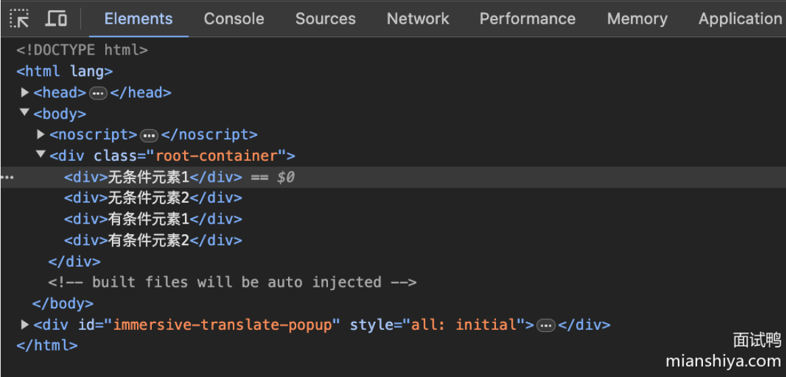
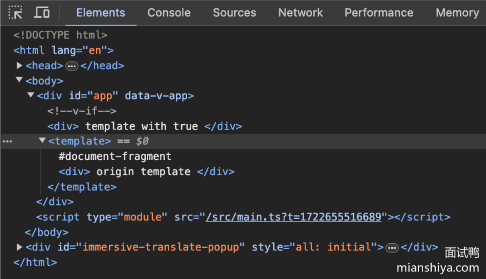

# 4387. Vue 计算属性的函数名和 data 中的属性可以同名吗？为什么？

## 回答重点

不可以。因为 Vue 会将 data 中的属性和计算属性都挂载到 Vue 实例上，如果它们同名，则会发生命名冲突，导致实例中的属性被覆盖，从而引发不可预知的错误。

## 扩展知识

1）命名冲突的本质： 在 Vue 中，data 和计算属性（computed）最终都会作为 Vue 实例的一个属性存在。如果我们在 data 中定义了一个属性 foo，同时又在 computed 中定义了一个名为 foo 的计算属性，二者会产生命名冲突，Vue 会警告你存在重复定义。Vue 在初始化时会按照一定的顺序（如Props、methods、data、computed、watch）将这些属性挂载到 Vue 实例上，后挂载的属性会覆盖先挂载的同名属性。

2）计算属性的优先级： data 的优先级高于计算属性。如果在 data 和计算属性中存在相同的属性，那么在模板中使用这些属性时，会优先使用 data 中的数据，因为 data 是直接存储数据的，而计算属性是基于 data 或其他属性的变化进行计算的‌。

3）避免命名冲突的最佳实践： 为了保持代码的清晰和简洁，建议在项目实施时遵循以下几点：

命名规范： 确保 data 和计算属性有不同的命名，避免命名冲突。
模块化管理： 将各自逻辑进行分模块管理，提高代码的可读性和可维护性。
严格代码审查： 在代码审查阶段注意这些潜在问题，及时纠正。
4）命名冲突如何提醒： 在运行环境下，Vue 通常会在控制台输出警告信息，来提醒开发者存在属性命名冲突，帮助快速定位和修复问题。

5）其它Vue中的相关特性：

methods： 与计算属性类似，methods 中的方法也会被挂载到 Vue 实例上，同样需要避免与 data 和计算属性同名。
Watchers： 虽然数据监听器（watchers）与 data 和计算属性相关，但它们不会直接参与命名冲突，因为 watchers 本身不挂载属性名到 Vue 实例上。

## 4388.Vue 的 v-show 和 v-if 有什么区别？使用场景分别是什么？

## 回答重点

v-show 和 v-if 是 Vue.js 中两种常用的指令，都可以用于控制元素的显示和隐藏，但它们有本质上的区别：

1）v-show 是通过控制元素的 CSS display 属性来显示或隐藏元素。无论条件是否为真，元素都会被渲染到 DOM 中，只是通过设置 CSS 样式来控制它的可见性。 2）v-if 则是通过条件判断来决定是否渲染元素。如果条件为假，元素根本不会被渲染到 DOM 中。

### 使用场景：

1）v-show 适合用于需要频繁切换显示/隐藏状态的场景。因为它只是在现有的 DOM 元素上进行 CSS 切换，性能开销较小。 2）v-if 适合用于在条件变化不太频繁的情况下使用，因为它每次重新渲染时都会进行完整的 DOM 操作，性能开销较大。

## 回答重点

v-show 和 v-if 是 Vue.js 中两种常用的指令，都可以用于控制元素的显示和隐藏，但它们有本质上的区别：

1）v-show 是通过控制元素的 CSS display 属性来显示或隐藏元素。无论条件是否为真，元素都会被渲染到 DOM 中，只是通过设置 CSS 样式来控制它的可见性。 2）v-if 则是通过条件判断来决定是否渲染元素。如果条件为假，元素根本不会被渲染到 DOM 中。

### 使用场景：

1）v-show 适合用于需要频繁切换显示/隐藏状态的场景。因为它只是在现有的 DOM 元素上进行 CSS 切换，性能开销较小。 2）v-if 适合用于在条件变化不太频繁的情况下使用，因为它每次重新渲染时都会进行完整的 DOM 操作，性能开销较大。

## 扩展知识

了解了 v-show 和 v-if 的基本区别和使用场景，接下来我们可以进一步探讨它们的一些细节和实际应用中的注意事项。

1）性能：

* v-show 带来的性能开销主要体现在第一次渲染时。因为即便元素隐藏了，它还是会占据 DOM 的空间和资源。但是，后续的切换开销极小。
* v-if 每次状态切换都伴随着元素的创建和销毁，当条件频繁变化时，这样的操作会带来一定的性能开销。因此，在频繁切换时，不推荐使用 v-if。

2）初始渲染：

* v-show 在初次渲染时无论条件是否满足都会将元素生成到 DOM 中，然后根据条件通过修改 display 属性来决定显示/隐藏。
* v-if 在初次渲染时会根据条件决定是否创建元素，条件为假时，元素不会生成到 DOM 中。

3）使用搭配：

* 针对某些场景，可以考虑 v-show 和 v-if 的结合使用。例如，外层使用 v-if 进行一次性判断是否渲染内容，因为 v-if 可以确保根本不生成不需要的 DOM 元素；内层使用 v-show 进行频繁的显示隐藏切换。

4）过渡效果：

* 在使用过渡效果时，v-show 和 v-if 的行为也有所不同。v-show 会触发 CSS 过渡效果（transition），而 v-if 需要配合 Vue 的 transition 组件使用。

5）开发指南：

* 当你需要确保某个 DOM 元素在结构上存在，但在某些情况下需要隐藏它，建议使用 v-show。
* 当你确定在某些条件下完全不需要某个 DOM 元素时，使用 v-if 会更适合。

# 4399.在 Vue 组件中写 name 选项有什么作用？

## 回答重点

在 Vue 组件中定义 `name` 选项的主要作用是为组件指定一个名字，这个名字在调试、递归组件、全局注册和基础组件复用时会非常有用。具体来看，`name` 选项会： 1）帮助在 Vue DevTools 中识别组件，增强调试体验。 2）在递归组件调用中，确保 Vue 能够正确引用自身。 3）用于全局组件注册，使得组件能够被全局识别和使用。 4）提高在 `<keep-alive>` 中使用时的可读性和可调试性。

> `<keep-alive>`是 Vue.js 提供的一个内置组件，用于缓存动态组件，避免重复渲染。具体来说：
> 缓存组件实例：当切换组件时，<keep-alive> 会缓存组件的状态，而不是销毁和重新创建组件实例。这可以提高性能，尤其是在频繁切换的场景下。
> 生命周期钩子：被 <keep-alive> 包裹的组件会多出两个生命周期钩子 activated 和 deactivated。当组件被激活（显示）时调用 activated，当组件被停用（隐藏）时调用 deactivated。
> 在你的代码中，<keep-alive> 包裹了 <component> 组件，这意味着当你在不同的 tab 之间切换时，组件的状态会被缓存，从而提升用户体验和性能

## 扩展知识

1）**调试和工具支持**： 当你在开发过程中使用 Vue DevTools 时，组件名称能让你更清晰地了解组件树结构。如果没有 `name` 选项，Vue DevTools 中的组件会以匿名组件显示名称，这在调试过程中会增加一定难度。

2）**递归组件**： 当你想在一个组件内部递归调用自己时，必须给这个组件提供一个 `name`。例如，树形结构组件常常需要递归调用自身以渲染嵌套列表。示例代码如下：

```txt
const Tree = {
  name: 'Tree',
  // 其他选项
  template: `
    <ul>
      <li v-for="node in treeData" :key="node.id">
        {{ node.name }}
        <Tree v-if="node.children" :treeData="node.children"/>
      </li>
    </ul>
  `,
  props: ['treeData']
};

```

3）**全局注册和复用**： 给组件命名后，你可以全局注册它并通过名称直接引用，从而提高组件的复用性。例如：

```js
import MyComponent from './MyComponent.vue';
Vue.component('MyComponent', MyComponent); 

```

这样你可以在任何地方使用 `<MyComponent></MyComponent>`。

4）**<keep-alive> 结合**： 在使用 `<keep-alive>` 标签时（它用于在组件切换时保存组件的状态或避免重新渲染），你常常会指定名字，以更方便地控制缓存。例如：

```vue
<keep-alive include="MyComponent">
  <router-view></router-view>
</keep-alive>
```

# 4406.Vue 2.0 支持哪个版本以上的 IE 浏览器？

## 回答重点

Vue 2.0 支持 IE 9 及以上版本的浏览器。

## 扩展知识

了解 Vue 2.0 对 IE 浏览器的支持情况可以帮助我们在实际开发过程中更好地做浏览器兼容性优化。Vue 2.0 作为一款流行的前端框架，致力于面向各种现代浏览器并提供丰富的功能。然而，IE 浏览器相对较旧，某些特性和 API 在低版本 IE 上并不完全支持。因此，有以下几点值得注意：

1）**Polyfills**：在 Vue 项目中，当需要支持 IE 9 或 IE 10 时，通常需要引入一些 Polyfills 来填补浏览器功能的差异，比如 Babel polyfill。

2）**降级处理**：某些现代 JavaScript 功能（例如 Promise、fetch）在旧版 IE 上并不原生支持。为了确保应用能在这些浏览器上正常运行，可能需要通过增加额外的兼容性代码来进行降级处理。

3）**CSS 限制**：IE 浏览器对新版本 CSS 特性的支持较差，尤其是一些高级选择器、 Flexbox、Grid等布局特性。在开发时，需要对这些限制有清晰的认识并进行适当处理或者使用后备方案。

4）**性能问题**：旧版 IE 的执行性能较差，当页面使用大量现代 JavaScript 特性和复杂的 Vue 组件时，可能会导致性能下降。因此，在开发中要尽量优化性能，减少操作 DOM 操作的频率。

5）**调试工具的局限性**：IE 浏览器的开发者工具不如 Chrome 和 Firefox 那么强大，当需要在 IE 中调试 Vue 应用时，可能会遇到一些限制。例如，IE 的开发者工具在查看 Vue 组件结构和状态时，可能不如 Vue Devtools 那样直观方便。

# 4410.为什么不建议在 Vue 中同时使用 v-if 和 v-for？

## 回答重点

在 Vue 中同时使用 `v-if` 和 `v-for` 可能会导致更高的性能开销和更加复杂的代码维护。原因有以下几点：

1）`v-if` 优先级高于 `v-for`（vue3版本）：当 `v-if` 和 `v-for` 同时存在于同一元素上时，Vue 会优先执行 `v-if` 检查条件，如果条件不满足，就不会执行 `v-for` 循环，这会导致在每个迭代中都进行条件判断，从而增加了性能开销。

2）调试和理解困难：同时使用 `v-if` 和 `v-for` 会使代码更加难以理解和调试，尤其是在复杂的条件和循环中，代码的可维护性和可读性会显著降低。

3）可能出现不必要的渲染：如果在 `v-for` 循环中使用 `v-if`，可能会导致出现多次不必要的渲染和销毁，进一步影响性能。

> vue2 版本中，v-for 优先级高于 v-if

## 扩展知识

为了避免上述问题，建议将 `v-if` 和 `v-for` 分开使用，这样可以提高代码的可读性和性能。通常，可以通过以下两种方式来优化：

1）使用计算属性：将 `v-if` 条件放到计算属性中，只返回符合条件的数组，然后在模板中直接使用 `v-for`。这样避免了每次迭代中的条件判断。

```vue
computed: {
  filteredItems() {
    return this.items.filter(item => item.isVisible);
  }
}
```

```html
<div v-for="item in filteredItems" :key="item.id">{{ item.name }}</div>
```

2）在外层包裹条件判断：在模板中，先使用 `v-if` 判断条件，再使用 `v-for` 循环渲染符合条件的数据。这种方式在一些场景中也比较适用。

```html
<div v-if="shouldShowList">
  <div v-for="item in items" :key="item.id">{{ item.name }}</div>
</div>
```

3）理解指令的优先级：Vue 指令有优先级，在复杂应用中理解这些优先级可以帮助我们更好地优化代码。例如，`v-for` 的优先级低于 `v-if`，但还有其他如 `v-on` 的事件绑定、`v-bind` 的属性绑定等，这些指令的优先级也需要了解清楚。

# 4411.在 Vue 渲染模板时，如何保留模板中的 HTML 注释？

## 回答重点

在 Vue 渲染模板时，默认情况下，HTML 注释不会被保留。但你可以通过在 Vue 组件中使用特殊的指令 `v-html` 来实现保留注释的需求。`v-html` 是 Vue 提供的一个特殊指令，可以用于直接插入 HTML 内容，包含了 HTML 注释。

具体操作步骤如下： 1）创建一个 Vue 组件。 2）使用 `v-html` 指令，绑定一个包含 HTML 注释的字符串。

例如：

```html
<template>
  <div v-html="htmlContent"></div>
</template>

<script>
export default {
  data() {
    return {
      htmlContent: '<!-- This is an HTML comment -->'
    };
  }
};
</script>
```

## 扩展知识

1）**注意事项**：使用 `v-html` 的时候要注意安全问题，因为它直接插入 HTML 片段，可能会导致 XSS 攻击。因此，确保你插入的 HTML 内容是安全的。

2）**替代方法**：如果你不希望使用 `v-html`，还可以在开发阶段依靠一些其他工具，比如预处理器（如 EJS）来预处理模板，然后将处理后的模板交由 Vue 渲染。不过这种方式会显得比较复杂而笨重，且不如直接使用 `v-html` 简单有效。

3）**Vue 模板编译器**：需要了解的是，Vue 在渲染模板时会对模板进行编译，而这个编译过程会去掉任何不必要的内容，包括HTML注释。所以，如果非要通过模板内嵌来保持注释，只能通过如 `v-html` 一类的手段绕过编译阶段的处理。

4）**实际应用场景**：在实际项目中，保留HTML注释的需求相对较少，更多情况下，我们用注释更多是为了方便开发者理解和维护代码，这些注释不需要在生产环境中出现。

# 4417.为什么 Vue 中的 data 属性是一个函数而不是一个对象？

## 回答重点

在 Vue.js 中，`data` 属性是一个函数而不是一个对象的主要原因是为了确保每个组件实例都有一个独立的状态（即独立的数据作用域）。这样做可以避免由于共享数据对象带来的意外副作用和错误。

具体来说，当我们在单页应用中使用多个 Vue 组件时，如果 `data` 是一个对象而不是函数，那么这些组件将共享同一个数据对象。这意味着对一个组件状态的修改会影响到其他所有引用这个对象的组件，导致难以预测的错误。

而将 `data` 定义为函数，我们可以在每次创建新组件实例时返回一个全新的对象，从而保证每个组件实例的数据都是独立的。

## 扩展知识

1）**数据共享与隔离**：

* 当我们创建 Vue 组件时，每个组件实例的数据应该是独立的。如果使用对象作为 `data` 属性，那么这个对象会在所有实例中共享。而将 `data` 定义为一个返回对象的函数，可以确保每次调用该函数时都生成一个新的对象，这样每个组件实例的数据都是独立的，互不干扰。

2）**组件复用**：

* Vue.js 提倡组件的复用和单一职责。通过使用函数返回新对象的方式，可以确保每次使用组件时都有一个独立的数据作用域。这在大型应用中尤为重要，因为它让我们可以放心地复用组件而不用担心数据污染或冲突。

3）**单例组件的特殊情况**：

* 我们有时会用到单例组件，比如根实例（`new Vue({})`），这种情况下我们可以直接将 `data` 定义为对象，因为它只会实例化一次，不存在多个实例共享数据的问题。不过这个在实际开发中是较少用到的，更多的情况下还是使用函数返回对象。

4）**性能考虑**：

* 虽然为每个组件实例生成一个新的数据对象稍微增加了内存开销，但这是组件化开发中不可避免的一部分消耗，相对于数据共享带来的错误及其调试成本，这样的设计权衡是值得的。此外，现代浏览器和 JavaScript 引擎在内存管理和对象创建上已经做得很好，所以这部分性能开销是可以接受的。

# 4419.Vue 的 template 标签有什么用？

## 回答重点

template 主要是作为一个占位符去使用，在 Vue 2 和 Vue 3 中 template 的表现有一些区别：

Vue 2：作为一个占位符去使用或者是在组件中传递一个插槽内容。无论什么情况，template 在 compiler 后会被去除。

Vue 3：用法同 Vue 2，但是在不使用 v-if、v-else-if 或 v-else、v-slot、v-for 的时候，Vue 不会进行处理，会直接渲染成一个 HTML 原生的 template 标签。

## 扩展知识

### Vue 2 表现分析

Vue 2 中对应 template 仅仅是属于一个占位符，在 `vue-template-compiler` 处理完毕后，其并不会保留在 render 函数中。换句话说，其最后并不会影响到渲染到页面上的 DOM。

讲实际例子前，我们先讲一下 render 函数中一些方法作用：

```txt
_c: 创建 VNode 节点
_v: 创建文本节点
_e: 创建一个空的 VNode 节点
_u: 处理插槽数据
```

我们可以用 `vue-template-compiler` 来验证一下上面的结论：

```js
const compiler = require('vue-template-compiler')
// 这里解析的是 Vue 单文件的模板
const res = compiler.compile(`<div class='root-container'>
  <template>
    <div>测试元素1</div><div>测试元素2</div>
  </template>
  <template #slotName>
    <div>测试元素1</div><div>测试元素2</div>
  </template>
  <template v-if="true">
    <div>测试元素1</div><div>测试元素2</div>
  </template>
  <template v-if="false">
    <div>测试元素1</div><div>测试元素2</div>
  </template>
</div>`)
```

上面会输出一些结果，我们只需要关注 render 这个属性就行了。

下面解析一下 render 结果：

```js
with (this) {
  return _c(
    'div',
    {
      staticClass: "root-container",
      // 插槽属性，这个元素最后会挂载到特定组件的定义好的插槽位置上
      scopedSlots: _u(
        [{
          key: "slotName",
          fn: function () {
            // 可以看到这里是直接将 template 中的元素给平铺了出来，template 这个元素本身并没有被渲染出来
            return [
              _c('div', [_v("插槽元素1")]),
              _c('div', [_v("插槽元素2")])
            ]
          },
          proxy: true
        }]
      )
    },
    // 空格占位符（因为 2 个 template 之间有换行）
    [_v(" "),
    // 解析：无条件元素这里的 2 个元素是直接作为元素被创建
    [
      _c('div', [_v("无条件元素1")]), _c('div', [_v("无条件元素2")])
    ],
    // 空格占位符（因为 2 个 template 之间有换行）
    _v(" "),
    // 这里的 2 个元素是根据 v-if 传进去的条件来决定是否渲染。否的话会创建一个空的 VNode 节点
    (true) ? [
      _c('div', [_v("有条件元素1")]), _c('div', [_v("有条件元素2")])
    ] : _e()],
    2)
}

```

我们可以将下面这段代码放到 Vue 2 中去跑下。这里把 slot 去掉了，只看 template 带不带条件的表现：

```vue
<template>
  <div class='root-container'>
    <template>
      <div>无条件元素1</div><div>无条件元素2</div>
    </template>
    <template v-if="true">
      <div>有条件元素1</div><div>有条件元素2</div>
    </template>
  </div>
</template>

```



可以看到，和分析的是一致的。

## Vue 3 表现分析

Vue3 中的 template 与 Vue 2 中的有些差别：

template 如果上面不携带任何指令，那么它将被渲染成一个原生的 [template ](https://developer.mozilla.org/en-US/docs/Web/HTML/Element/template)标签。

template 只有与下面的指令一起使用时，里面的元素才会被 Vue 内部进行处理。也就是决定它展示或不展示，或者展示到哪个插槽的位置。

```txt
v-if 、 v-else-if 或 v-else
v-for
v-slot（简写为 #插槽名）

```

我们可以将下面这段代码放到 Vue 3 中去跑下：

```vue
<template>
  <template v-if="false">
    <div>
      template with false
    </div>
  </template>
  <template v-if="true">
    <div>
      template with true
    </div>
  </template>
  <template>
    <div>
      origin template
    </div>
  </template>
</template>

```




可以看到只有条件为 true 的 template 中的元素被展示到了 DOM 上。而不带任何条件的 template 则被解析成了 HTML 原生的 template 元素。

### 使用场景

1）对多个同级元素进行统一显隐：

```vue
<template>
  <div>
    <template v-if="mode === 'male'">
      <div>子级元素1</div>
      <div>子级元素2</div>
      <div>子级元素3</div>
      <div>子级元素4</div>
      <div>子级元素5</div>
    </template>
		<template v-else-if>
      <div>子级元素1</div>
      <div>子级元素2</div>
      <div>子级元素3</div>
      <div>子级元素4</div>
      <div>子级元素5</div>
    </template>
    <div>other children....</div>
  </div>
</template>
<script>
export default {
  data() {
    return {
      mode: 'male'
    }
  }
}
</script>

```

好处：**template 不会在 DOM 上真实渲染，提高简洁性。** 如果换成其他元素的话，则这些元素会在 DOM 上真实渲染。

实际效果：


例如：

```vue
<template>
  <div>
    <div v-if="mode === 'male'">
      <div>子级元素1</div>
      <div>子级元素2</div>
      <div>子级元素3</div>
      <div>子级元素4</div>
      <div>子级元素5</div>
    </div>
		<div v-else-if>
      <div>子级元素1</div>
      <div>子级元素2</div>
      <div>子级元素3</div>
      <div>子级元素4</div>
      <div>子级元素5</div>
    </div>
    <div>other children....</div>
  </div>
</template>
<script>
export default {
  data() {
    return {
      mode: 'male'
    }
  }
}
</script>

```

则会变成这样：外层元素多了一个 div 元素，就显得没这么简洁了。


# 4420. Vue 中 MVVM、MVC 和 MVP 模式的区别是什么？

## 回答重点

MVVM（Model-View-ViewModel）、MVC（Model-View-Controller）和 MVP（Model-View-Presenter）是三种不同的软件架构模式，虽然它们的目标都是实现一种分离关注点的结构，但它们之间存在显著的差异。

1）**MVC 模式**：

- **Model**：数据层，负责与数据库或远程服务器交互，存取和操作数据。
- **View**：视图层，负责用户界面的呈现。它不包含任何业务逻辑，仅显示从 Model 获得的数据。
- **Controller**：控制器层，协调 Model 和 View，处理用户输入并更新 Model 和 View。

2）**MVP 模式**：

- **Model**：与 MVC 中相同，负责数据的管理。
- **View**：与 MVC 中相同，负责显示内容。
- **Presenter**：充当中介者，从 Model 获取数据并更新 View，而且能够处理复杂的逻辑，减轻 View 的负担。

3）**MVVM 模式**：

- **Model**：与 MVC 和 MVP 中相同，负责数据的管理。
- **View**：与 MVC 和 MVP 中相同，负责显示内容。
- **ViewModel**：负责将 Model 和 View 连接起来。通过数据绑定，View 自动更新以响应一切 Model 的变化，从而显著简化了代码量。

在 Vue 框架中，采用的是 MVVM 模式：

- **Model**：数据状态（在 Vue 中通过 `data` 属性定义）。
- **View**：模板（在 Vue 中通过 HTML、模板语法和 `{{ }}` 插值）。
- **ViewModel**：Vue 实例，它连接了 Model 和 View，通过双向数据绑定（Vue 的核心功能之一）使得 View 会自动更新以响应 Model 的变化。

### 总结

- **MVC** 更适用于传统的服务器渲染应用。
- **MVP** 适用于 Web 应用和桌面应用，但逻辑较为复杂。
- **MVVM** 非常适合前端框架如 Vue、React、Angular，能够更好地处理 UI 绑定和状态管理。

## 扩展知识

为了更深入理解这三种模式及其使用场景，来看看它们在不同开发环境中的应用：

1）**MVC**：最早提出的设计模式之一，广泛应用于 Web 开发，如传统的 Java EE、ASP.NET 应用中。典型的例子是使用 Spring MVC 框架进行 Java Web 开发，View 层通常使用 JSP 或 Thymeleaf。

2）**MVP**：在 Android 开发中使用较多。在 Android 中，由于 Activity 和 Fragment 既承担了逻辑又负责了 UI 渲染，使用 MVP 模式可以通过 Presenter 来分离这些责任，使得代码更易维护和测试。

3）**MVVM**：不仅在 Vue 中使用，而且在其他现代前端框架如 Angular 和 React（虽然更偏向于 Flux/Redux 架构）中也有类似的实现。MVVM 使得开发者可以专注于业务逻辑和数据流，框架会处理具体的 DOM 操作和视图更新。Vue 提供了简洁的双向数据绑定，Angular 则使用了复杂的依赖注入和数据绑定，而 React 虽然采用单向数据流，但通过 Hooks、Context API 也能实现类似 MVVM 的效果。

# 4428. Vue Router 如何配置 404 页面？

## 回答重点

在 Vue 项目中，如果你想配置一个 404 页面（即找不到页面提示），你需要通过 Vue Router 来设置。这通常通过将路由配置中的 *（通配符）指向一个 404 组件来实现。

下面提供一个示例，为 Vue Router 配置一个 404 页面：

```javascript
import Vue from 'src/Vue';
import VueRouter from 'vue-router';
import Home from '@/components/Home.vue';
import NotFound from '@/components/NotFound.vue'; // 这是你的 404 页面组件

Vue.use(VueRouter);

const routes = [
    {
        path: '/',
        component: Home
    },
    {
        path: '*', // 通配符，一定要放在最后
        component: NotFound
    }
];

const router = new VueRouter({
    mode: 'history', // 使用 HTML5 History 模式
    routes
});

export default router;
```

在这个配置中，`path: '*'` 的这一行定义了一个通配符路由，这个路由会匹配所有未定义的路径，并将其路由到 `NotFound` 组件。确保这条规则是路由配置中的最后一条规则。

## 扩展知识

我们可以进一步探讨一些相关的知识点。

1）**Vue Router 模式**：在上面的示例中，我使用了 `mode: 'history'` 来设置路由的模式，这避免了 URL 中出现 `#` 符号。如果不设置，默认是 `hash` 模式。需要注意的是，如果使用 `history` 模式，你需要在服务器端做一些配置，让所有的路径都指向你的 `index.html` 文件。

2）**懒加载路由组件**：为了优化性能，可以使用 Vue 的异步组件来懒加载路由组件，例如：

```javascript
const NotFound = () => import('@/components/NotFound.vue');
```

这样只有在访问该路由时才会加载对应的组件，减少初始加载时间。

3）**通配符路由位置**：一定要注意，通配符路由 `path: '*'` 一定要放在所有路由规则的最后一条。如果放在前面或中间会导致后面的路由规则永远无法被匹配到。

4）**404 组件设计**：你的 404 页面组件可以设计得更丰富一些，比如可以包含一个返回首页的按钮，或者一些友好的提示信息，让用户体验更好。

5）**导航守卫**： Vue Router 还提供了导航守卫，可以在路由跳转前进行一些操作，比如鉴权或者日志记录，这是在大项目中经常会使用到的。

# 4428.Vue Router 如何配置 404 页面？


## 回答重点

在 Vue 项目中，如果你想配置一个 404 页面（即找不到页面提示），你需要通过 Vue Router 来设置。这通常通过将路由配置中的 \*（通配符）指向一个 404 组件来实现。

下面提供一个示例，为 Vue Router 配置一个 404 页面：

```vue
import Vue from 'vue';
import VueRouter from 'vue-router';
import Home from '@/components/Home.vue';
import NotFound from '@/components/NotFound.vue'; // 这是你的 404 页面组件

Vue.use(VueRouter);

const routes = [
  {
    path: '/',
    component: Home
  },
  {
    path: '*', // 通配符，一定要放在最后
    component: NotFound
  }
];

const router = new VueRouter({
  mode: 'history', // 使用 HTML5 History 模式
  routes
});

export default router;

```

在这个配置中，`path: '*'` 的这一行定义了一个通配符路由，这个路由会匹配所有未定义的路径，并将其路由到 `NotFound` 组件。确保这条规则是路由配置中的最后一条规则。

## 扩展知识

我们可以进一步探讨一些相关的知识点。

1）**Vue Router 模式**：在上面的示例中，我使用了 `mode: 'history'` 来设置路由的模式，这避免了 URL 中出现 `#` 符号。如果不设置，默认是 `hash` 模式。需要注意的是，如果使用 `history` 模式，你需要在服务器端做一些配置，让所有的路径都指向你的 `index.html` 文件。

2）**懒加载路由组件**：为了优化性能，可以使用 Vue 的异步组件来懒加载路由组件，例如：

<pre><div class="code-block-extension-header"><div class="code-block-extension-headerLeft"><div class="code-block-extension-foldBtn">▼</div><span class="code-block-extension-lang">javascript</span></div><div class="code-block-extension-headerRight"><div class="code-block-extension-copyCodeBtn">复制代码</div></div></div><code class="language-javascript hljs" data-highlighted="yes">const NotFound = () => import('@/components/NotFound.vue');
</code></pre>

这样只有在访问该路由时才会加载对应的组件，减少初始加载时间。

3）**通配符路由位置**：一定要注意，通配符路由 `path: '*'` 一定要放在所有路由规则的最后一条。如果放在前面或中间会导致后面的路由规则永远无法被匹配到。

4）**404 组件设计**：你的 404 页面组件可以设计得更丰富一些，比如可以包含一个返回首页的按钮，或者一些友好的提示信息，让用户体验更好。

5）**导航守卫**： Vue Router 还提供了导航守卫，可以在路由跳转前进行一些操作，比如鉴权或者日志记录，这是在大项目中经常会使用到的。

# 4431.你了解 Vue 中的过滤器吗？它有哪些应用场景？


## 回答重点

过滤器在Vue中是一个非常简洁而方便的工具，主要用于文本格式化。它们通常用于模板表达式中，将数据进行转换、格式化，使其在视图中表现得更具可读性和用户友好。具体应用场景有： 1）日期格式化：将后端返回的时间戳转换为用户可读的日期格式。 2）文本格式化：将文字转换为大写、小写或者截取一定长度等。 3）数值格式化：对货币、百分比等数值进行格式化显示。

## 扩展知识

在Vue 3中，过滤器这一特性已经被移除，官方推荐使用方法（methods）或者计算属性（computed properties）来替代：

1）方法（methods）：通过方法可以定义更复杂的操作。而且方法有助于更好地管理逻辑和复用。 2）计算属性：类似于过滤器，但通常它们与数据有更紧密的绑定，可以响应式地更新数据。

示例代码可能会帮助你更好地理解这些概念：

### 使用过滤器（Vue 2 示例）：

```vue
Vue.filter('capitalize', function (value) {
  if (!value) return '';
  value = value.toString();
  return value.charAt(0).toUpperCase() + value.slice(1);
});

```

在模板中使用过滤器：

```html
<p>{{ message | capitalize }}</p>

```


### 替代方法（Vue 3 示例）：

使用方法替代：

```vue
export default {
  methods: {
    capitalize(value) {
      if (!value) return '';
      value = value.toString();
      return value.charAt(0).toUpperCase() + value.slice(1);
    }
  }
}

```

在模板中使用方法：

```vue
<p>{{ capitalize(message) }}</p>
```

# 4432. Vue Router 中如何获取路由传递过来的参数？

## 回答重点

在 Vue Router 中，我们有两种常见的方式可以传递参数：动态路由匹配和查询参数。对于获取这些参数的方法如下：

1）**动态路由匹配**：在 Vue Router 中，我们可以通过类似 `/user/:id` 这样的路径来定义一个动态路由参数。这时，我们可以通过 `this.$route.params` 来获取传递的参数。例如：

```html
▼html复制代码<template>
  <div>User ID: {{ userId }}</div>
</template>

<script>
export default {
  computed: {
    userId() {
      return this.$route.params.id;
    }
  }
};
</script>
```

2）**查询参数**：在 URL 中使用查询字符串的形式传递参数，例如 `/user?id=123`。此时，可以通过 `this.$route.query` 来获取查询参数。例如：

```html
▼html复制代码<template>
  <div>User ID from Query: {{ userId }}</div>
</template>

<script>
export default {
  computed: {
    userId() {
      return this.$route.query.id;
    }
  }
};
</script>
```

## 扩展知识

了解了以上两种获取参数的方法后，我们可以进一步扩展一些相关的知识点和使用场景。

1）**动态路由匹配的应用场景**：动态路由匹配通常用于资源路径，例如用户页面 `/user/123`、文章页面 `/article/456`。这种方式的好处是 URL 简洁明了，更符合语义化。

2）**查询参数的应用场景**：查询参数通常用于筛选、搜索等功能。例如在搜索页面 `/search?query=vue` 这样的场景下，通过查询参数可以实现更为灵活的参数传递。查询参数更适合多参数组合且顺序不固定的场景。

3）**混合使用**：有时我们会同时使用动态路由和查询参数，例如 `/user/123?tab=info`，这种方式结合了两者的优点，既保证了路径的简洁，又增加了参数的多样性。

4）**观察参数变化**： 假设我们在当前页面使用路由参数做一些交互，那么我们可能需要监听路由参数的变化。可以通过 Vue 的 `$watch` 或 lifecycle hook 实现。例如在 `watch` 中：

```javascript
▼javascript复制代码watch: {
  '$route' (to, from) {
    // 处理路由变化
    console.log(to.params.id);
  }
}
```

这可以使你的应用更为灵活应对参数变动。

5）**路由传参的最佳实践**：在实际开发中，尽量保持路由参数的简洁和有意义。考虑到可能的数据量、SEO需求、用户可读性等因素，合理选择使用动态路由还是查询参数。同时，做好参数验证和默认值处理，防止因参数未传递或传递错误而导致的BUG。

# 4435. Vue 的 v-cloak 和 v-pre 指令有什么作用？

## 回答重点

v-cloak 和 v-pre 是 Vue 提供的两个专用指令，用于处理应用程序在加载和解析过程中的一些特殊需求。

1. v-cloak：主要用来防止闪烁，在 Vue 应用程序完全编译之前，将绑定的 DOM 元素上添加一个 `display:none` 样式，避免未解析的模板直接显示在用户面前，通常和 CSS 一同使用。
2. v-pre：主要用于跳过该节点及其子节点的编译过程，直接输出原始的 Mustache 标签（插值符号 {{}}），对提高性能有一定帮助。

## 扩展知识

来，我详细讲讲这两个指令背后的原理和使用场景吧。

### v-cloak 的原理及使用场景

当 Vue 应用程序需要请求外部资源或进行复杂的数据初始化时，页面内容的加载可能存在延迟，导致用户看到未经解析的模板闪现。v-cloak 可以帮助你隐藏这些未解析的模板，保证用户体验的顺畅。常见的使用方法如下：

```html
▼html复制代码<style>
[v-cloak] { display: none; }
</style>

<div v-cloak>
  {{ message }}
</div>
```

实际应用过程中，可以将 v-cloak 属性绑定在需要隐藏的元素上，并通过 CSS 控制显示隐藏。当 Vue 的编译过程解析完这个元素后，v-cloak 自动移除，显示内容。

### v-pre 的原理及使用场景

这个指令在需要提升性能或避免干扰的场景下尤为有用。由于 v-pre 指令会告诉 Vue 忽略这个节点及其所有子节点的编译过程，从而减少不必要的计算量。它会渲染出未经编译的模板内容，常见的使用方法如下：

```html
▼html复制代码<div v-pre>
  {{ rawMustache }}  <!-- 这里的内容将会直接输出为 {{ rawMustache }} 而不是进行数据绑定 -->
</div>
```

### 使用建议

1. v-cloak 通常用在应用启动阶段，确保用户不看到“闪烁”的内容。适用于任何 Vue 应用程序。
2. v-pre 则适合用于较复杂的模板结构中，可以显著提升性能，防止不必要的干扰。适合大型项目或者需要优化性能的地方。

# 4442. 在 Vue 组件中如何访问根实例？

## 回答重点

在 Vue 组件中，我们可以通过 `this.$root` 来访问根实例。`this.$root` 属性指向当前 Vue 实例树的根实例，可以帮助我们在子组件中获取全局状态或者调用根实例的方法。

## 扩展知识

好的，让我来进一步展开讲讲。

1）`this.$root`

- `this` 是指向当前组件实例的引用，通过 `this.$root` 可以访问到整个应用的根实例。
- 一个常见的使用场景是需要访问根实例上的一些方法或数据，比如全局状态管理等。

2）访问根实例上的数据或方法

```javascript
// 假设在根实例中有一个方法 hello 和一个数据 message
new Vue({
  el: '#app',
  data: {
    message: 'Hello from the root!'
  },
  methods: {
    hello() {
      console.log('Hello from root instance!');
    }
  }
});
```

在子组件中，我们可以这样访问：

```javascript
export default {
  mounted() {
    console.log(this.$root.message); // 输出 'Hello from the root!'
    this.$root.hello(); // 输出 'Hello from root instance!'
  }
}
```

3）注意事项

- 在大型应用中，滥用 `this.$root` 可能会导致组件强耦合，降低代码的可维护性。理想情况下，尽量通过 Vuex 或其他状态管理工具来处理全局状态。

4）其他类似的实例属性

- 如果你需要访问父组件，可以使用 `this.$parent`。
- 如果需要访问根组件树中的所有子组件，可以使用 `this.$children`。

5）相关概念扩展

- Vuex: 如果应用规模较大，可以使用 Vue 的官方状态管理库 Vuex 来集中管理应用的状态。这有助于保持组件的解耦和代码的整洁。
- Provide/Inject: 这种方式可以在 Vue 2.2.0 及以后版本中使用，主要用于在祖先和后代组件之间共享数据，而不需要逐层传递 props。

#  4454. 什么是 Vue 中的 slot？它有什么作用？ 

## 回答重点

在 Vue.js 中，`slot` 是一种用于在组件模板中分发内容的机制。我们可以使用它来将父组件的内容传递给子组件，从而实现灵活的内容分发和组件复用。

具体来说，`slot` 可以帮助我们在子组件中定义占位符，这些占位符将被父组件传递的内容所替换。这使得我们在开发过程中可以创建更具通用性和复用性的组件。

## 扩展知识

在实际项目中，`slot` 有许多高级用法。让我带你了解一下它的几个关键特性和使用场景：

1）**默认插槽**： 如果我们在子组件中只有一个插槽，那么它会被默认视为默认插槽。如下：

```html
<!-- Parent component -->
<child-component>
  <p>This is the content from the parent.</p>
</child-component>

<!-- Child component template -->
<div>
  <slot></slot>
</div>
```

在这种情况下，父组件传递的 `<p>` 元素将会替换子组件模板中的 `<slot>` 标签。

2）**具名插槽**： 有时候我们需要在一个组件中使用多个插槽，这时我们可以为每个插槽命名：

```html
<!-- Parent component -->
<child-component>
  <template v-slot:header>
    <h1>This is the header content.</h1>
  </template>
  <template v-slot:footer>
    <p>This is the footer content.</p>
  </template>
</child-component>

<!-- Child component template -->
<div>
  <header>
    <slot name="header"></slot>
  </header>
  <main>
    <slot></slot> <!-- 默认插槽 -->
  </main>
  <footer>
    <slot name="footer"></slot>
  </footer>
</div>
```

3）**作用域插槽**： 作用域插槽（Scoped Slots）允许父组件使用子组件提供的数据。这通常用于较复杂的场景，例如表格组件需要传递特定的行数据给父组件进行自定义渲染：

```html
<!-- Parent component -->
<child-component v-slot:default="slotProps">
  <p>{{ slotProps.message }}</p>
</child-component>

<!-- Child component template -->
<div>
  <slot :message="messageFromChild"></slot>
</div>
```

在上面的例子中，子组件将自身的数据 `messageFromChild` 传递给父组件，而父组件可以像属性一样使用 `slotProps.message` 获取这个数据进行渲染。

#  4458. 在 Vue 中使用 this 时应该注意哪些问题？ 

## 回答重点

在 Vue 中使用 `this` 主要涉及以下几点需要注意的地方： 1）`this` 的上下文绑定问题，特别是在使用箭头函数和普通函数时，`this` 的指向会有不同。 2）在生命周期钩子函数中，`this` 的指向是 Vue 实例。 3）在模板内的 `this` 是隐式的，我们可以直接引用数据和方法，而无需手动绑定 `this`。 4）在组件间通信中，`this` 的指向需要特别注意，是父组件还是子组件。

## 扩展知识

好啦，重点讲完了，下面咱们深入一点儿，聊聊每个要点背后的细节吧。

1）**`this` 的上下文绑定问题**： 在 Vue 中，如果我们使用箭头函数（=>），它会捕获其定义处的上下文 `this`，这意味着它和它定义时的外部上下文 `this` 一致。这种性质在处理事件处理程序或数组方法（如 `map`、`reduce`）时尤其有用。

```javascript
methods: {
  handleClick() {
    // 这里的 `this` 指向 Vue实例
  },
  handleArray() {
    const arr = [1, 2, 3];
    arr.map(item => {
      // 这里的 `this` 仍然指向 Vue 实例，而不是 `map` 方法内部。
      console.log(this.someMethod());
    });
  }
}
```

2）**生命周期钩子中的 `this`**： Vue 实例在创建时，会运行多个钩子函数。对于每一个钩子函数，`this` 都指向当前 Vue 实例。你可以放心地访问 `data`、`props` 或调用 `methods`。

```javascript
created() {
  // 这里的 `this` 指向 Vue 实例
  console.log(this.someData);
}
```

3）**模板内的 `this`**： 在 Vue 的模板语法中，你不需要显式地使用 `this`。你可以直接在模板中引用数据字段和方法。

```html
<template>
  <div>{{ someData }}</div> <!-- 这里无需使用 `this` -->
  <button @click="someMethod">Click Me</button>
</template>
```

4）**组件间通信中的 `this` 指向**： 这点尤为重要。在父子组件通信中，我们需要注意 `this` 的指向。例如，通过 `$emit` 事件传递的回调函数中，`this` 依旧会指向 Vue 实例。

```javascript
// Parent Component
<template>
  <ChildComponent @someEvent="handleEvent"></ChildComponent>
</template>
<script>
methods: {
  handleEvent() {
    // 这里的 `this` 是父组件的 Vue 实例
  }
}
</script>

// Child Component
<template>
  <button @click="$emit('someEvent')">Emit Event</button>
</template>
```
