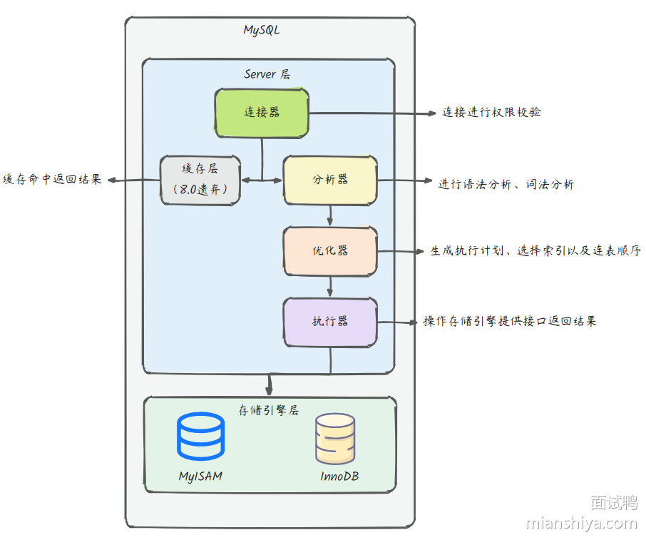
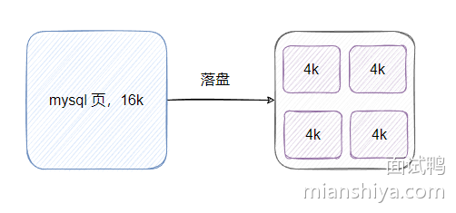
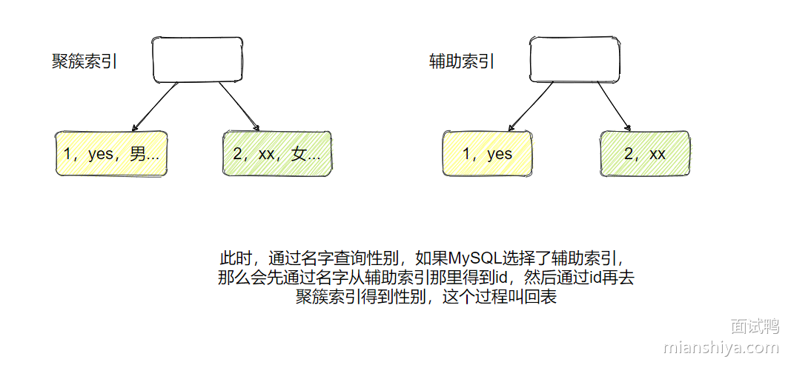

## 617. MySQL 中的数据排序是怎么实现的？

### 回答重点

排序过程中，如果排序字段命中索引，则利用**索引排序**。

反之，使用**文件排序**。

文件排序中，如果数据量少则在内存中排序，具体是使用**单路排序**或者**双路排序**。

如果数据大则利用磁盘文件进行外部排序，一般使用归并排序。

### 扩展知识

根据 explain 的结果来看，MySQL 可以分为索引排序和 filesort。

索引排序
如果查询中的 ORDER BY 子句包含的字段已经在索引中，并且索引的排列顺序和 ORDER BY 子句一致，则可直接利用索引进行排序。这种方式效率最高，因为索引有序。

#### 索引排序

如果查询中的 ORDER BY 子句包含的字段已经在索引中，并且索引的排列顺序和 ORDER BY 子句一致，则可直接利用索引进行排序。这种方式效率最高，因为索引有序。

#### filesort

当使用 explain 分析 SQL 发现执行计划的 extra 中包含 using filesort 的时候，说明它无法应用索引的顺序，而主动排序了。

如果需要排序的数据比较少，则直接在内存中通过 sort_buffer 就能排了。具体是通过 sort_buffer_size 参数来控制 sort_buffer 的大小，如果需要排序的数据量小于 sort_buffer 则直接在内存中排序，反之需要利用磁盘临时文件排序，性能就比较差了。

#### 内存排序

在 sort_buffer 中排序有一些细节需要知晓一下。

##### 双路排序

有一个叫 max_length_for_sort_data 参数，默认是 4096 字节，如果 select 列的数据长度超过它，则 MySQL 采用row_id 排序，即把 row_id(有主键就是主键)+排序字段放置到 sort_buffer 中排序。

我们来举例理解下双路排序。

比如现在要执行：

select a,b,c from t1 where a = '面试鸭' order by b;

假设此表单行超过了 max_length_for_sort_data，为了节省排序占用的空间，此时 sort_buffer 只会有放置 id 和 b 来排序。


排序后，再通过 id 回表查询得到 a、b、c ，最终将最后的结果集返回给客户端。

所以排序需要多个回表的过程，等于需要两次查询，也叫双路排序（Two-Pass Sort）。

单路排序
假设 select 列的数据没有超过 max_length_for_sort_data，则可以进行单路排序（Single-Pass Sort），就是将 select 的字段都放置到 sort_buffer 中。


排序后直接得到结果集，返回给客户端即可，相比双路排序它减少了回表的动作，因此效率更高。

一开始 MySQL 只有双路排序，后续优化推出了单路排序。

磁盘文件临时排序
前面提到，如果查询的数据超过 sort_buffer，说明内存放不下了，因此需要利用磁盘文件进行外部排序，一般会使用归并排序，简单理解就是将数据分为很多份文件，单独对文件排序，之后再合并成一个有序的大文件。

利用磁盘排序效率会更低，针对一些情况可以调大 sort_buffer_size，避免磁盘临时文件排序。

## 626. MySQL 的 Change Buffer 是什么？它有什么作用？

### 回答重点

Change Buffer 是 MySQL InnoDB 存储引擎中的一个**机制**，用于暂存对二级索引的插入和更新操作的变更，而不立即执行这些操作，随后，当 InnoDB 进行合适的条件时（如页被读取或 Flush 操作），会将这些变更写入到二级索引中。

### 作用：

提高写入性能：通过将对二级索引的变更暂存，可以减少对磁盘的频繁写入，提升插入和更新操作的性能。
批量处理：Change Buffer 可以在后续的操作中批量处理这些变更，减少了随机写入的开销。

### 扩展知识

进一步理解 Change Buffer
我们来看一下官网的一张图：

从上面的图我们可以看到， buffer pool 里面其实有一块内存是留给 change buffer 用的。

1）那 change buffer 具体是个什么东西呢？

如果当前表针对 name 有一个二级索引。假设我们执行一条  update table set name = 'yes' where id = 1（这条语句需要修改 name 这个二级索引中的数据），此时 buffer pool 并没有对应二级索引的索引页数据。

这个时候需要把索引页加载才内存中立即执行修改吗？

不是的，这时候 change buffer 就上场了。

如果当前二级索引页不在 buffer pool 中，那么 innodb 会把更新操作缓存到 change buffer 中，当下次访问到这条数据后，会把索引页加载到 buffer pool 中，并且应用上 change buffer 里面的变更，这样就保证了数据的一致性。

上述 SQL 中，change buffer 中会存储 name 字段的旧索引值删除操作和新索引值插入操作。

2）所以 change buffer 有什么好处？

当二级索引页不在 buffer pool 中时，change buffer 可以避免立即从磁盘读取对应索引页导致的昂贵的随机I/O ，对应的更改可以在后面当二级索引页读入 buffer pool 时候被批量应用。

看到我加粗的字体没，二级索引页，没错 change buffer 只能用于二级索引的更改，不适用于主键索引，空间索引以及全文索引。

还有，唯一索引也不行，因为唯一索引需要读取数据然后检查数据的一致性。

3）更改先缓存在 change buffer 中，假如数据库挂了，更改不是丢了吗？

别怕，change buffer 也是要落盘存储的，从上图我们看到 change buffer 会落盘到系统表空间里面，然后 redo log 也会记录 chang buffer 的修改来保证数据一致性。

至此，想必你对 change buffer 已经有一定了解了吧。它主要用来避免于二级索引页修改产生的随机I/O。如果你的内存够大能装下所有数据，或者二级索引很少，或者你的磁盘是固态的对随机访问影响不大，其实可以关闭 change buffer，因为它也增加了复杂度，当然最终还是得看压测结果。

### Change Buffer 的大小

Change Buffer 的大小可以通过系统变量 innodb_change_buffer_max_size 进行配置，默认值为 25% 的 InnoDB 缓冲池大小，最大值可以设置为 50%。合理配置可以提升性能，但过大可能导致内存不足。

## 589. 详细描述一条 SQL 语句在 MySQL 中的执行过程。

### 回答重点

- 先通过**连接器**校验权限
- 利用**分析器**进行 SQL 语句的词法分析和语法分析，构建解析树
- 使用**优化器**选择合适的索引和表连接顺序，最终选择一个最佳的执行计划
- 利用**执行器**，调用引擎层查询数据，返回结果集给客户端

### 扩展知识

我们以一条查询 SQL 为例：select * from user where id=1；

在这条查询语句中，大体可以分为两个层面，Server 层和存储引擎层。

Server 层涉及到一系列的业务的组件，而存储引擎层则是负责存储发送过来的数据、提供读写接口等功能（补充：MySQL 的存储引擎是插件式的，一个数据库里面的不同表可以用不同的存储引擎）。


具体流程如下：

1）当客户端的 SQL 发送到 MySQL 时，首先是到达 Server 层的连接器，连接器会对你此次发起的连接进行**权限校验**，以此来获取你这个账号拥有的权限。当你的账号或密码不正确时，会报 Access denied for user 错误，相信大家对这个错误也并不陌生。连接成功如果后续没有任何操作，那么这个连接就处于空闲状态，到达一定时间后它便会断开连接，这个时间一般是 8 小时，是由 wait_timeout 参数控制的。

2）查询缓存（在 MySQL 8.0 之后就被砍了）具体做法就是将一个查询语句作为 key ，将上一次请求的结果作为 value，存储在缓存组件中，当同样的语句来查询的时候即可立马返回结果，不需要经历词法、语法分析等以下的步骤。只要表有数据改动缓存就失效了，在我们常见的联机事务处理（OLTP） 场景下是个鸡肋。

3）接下来就到了分析器来进行**语法分析、词法分析**。MySQL 会首先对你的语句进行 ”词法分析“ ，来判断你的语句是什么类型以及携带什么参数等。比如：MySQL 会将输入语句的 select 提取出来，判断出这是一条查询语句、将 from 后面的 user 提取出来作为查询的表名、把 id 提取出来作为列名等。做完这些 MySQL 将会进行 ”语法分析“ 来判断你的语句的语法是否有误、是否满足 MySQL 的语法。如果语法有问题，那这个错误相信大家都不陌生：You have an error in your SQL syntax; check the manual......。

4）经过分析器就到了优化器，它会对你的语句进行**优化判断**。比如你的表中有多个索引，优化器会帮你选择使用哪个索引、你使用了 join 多表连接，优化器会帮你调整表的连接顺序。我们平日里用的 explain 其实就是让 MySQL 告诉我们它的优化决定策略是怎样的。

5）最后会到达执行器，它先会判断你对这个 user 表是否有权限查询，如果没有权限它将会拒绝本次查询，返回错误信息。如果有权限，它将会根据表的存储引擎提供的接口进行数据查询将重复遍历表的行数据，判断 id 字段是否等于 1。直到遍历完整个表将符合条件的数据作为结果集返回给客户端。

## 590. MySQL 的存储引擎有哪些？它们之间有什么区别？

### 回答重点

MySQL 的主要存储引擎包括：

1）InnoDB：

**支持事务**、**行级锁**和**外键**。
提供高并发性能，适用于高负载的 OLTP 应用。
数据以聚集索引的方式存储，提高检索效率。
2）MyISAM：

**不支持事务和外键**，使用**表级锁**。
适合读取多、更新少的场景，如数据仓库。
具有较高的读性能和较快的表级锁定。
3）MEMORY：

数据存储在内存中，速度快，但数据在服务器重启后丢失。
适用于临时数据存储或快速缓存。
4）NDB (NDBCluster)：

支持高可用性和数据分布，适合大规模分布式应用
提供行级锁和自动分区。。
5）ARCHIVE：

用于存储大量历史数据，支持高效的插入和压缩。
不支持索引，适合日志数据存储。


| 特性                 | MyISAM | Memory  | InnoDB | Archive | NDB   |
| ---------------------- | -------- | --------- | -------- | --------- | ------- |
| B+树索引             | Yes    | Yes     | Yes    | No      | No    |
| 备份/按时间点恢复    | Yes    | Yes     | Yes    | Yes     | Yes   |
| 集群数据库支持       | No     | No      | No     | No      | Yes   |
| 聚簇索引             | No     | No      | Yes    | No      | No    |
| 压缩数据             | Yes    | No      | Yes    | Yes     | No    |
| 数据缓存             | No     | N/A     | Yes    | No      | Yes   |
| 加密数据             | Yes    | Yes     | Yes    | Yes     | Yes   |
| 外键支持             | No     | No      | Yes    | No      | Yes   |
| 全文检索             | Yes    | No      | Yes    | No      | No    |
| 地理空间数据类型支持 | Yes    | No      | Yes    | Yes     | Yes   |
| 地理空间索引支持     | Yes    | No      | Yes    | No      | No    |
| 哈希索引             | No     | Yes     | No     | No      | Yes   |
| 索引缓存             | Yes    | N/A     | Yes    | No      | Yes   |
| 锁的粒度             | Table  | Table   | Row    | Row     | Row   |
| MVCC                 | No     | No      | Yes    | No      | No    |
| 复制支持             | Yes    | Limited | Yes    | Yes     | Yes   |
| 存储限制             | 256TB  | RAM     | 64TB   | None    | 384EB |
| T-tree 索引          | No     | No      | No     | No      | Yes   |
| 事务                 | No     | No      | Yes    | No      | Yes   |

补充说明：

- **Memory 存储引擎**：Memory 存储引擎使用内存来存储数据，因此数据缓存是自动进行的，不需要额外的配置。
- **NDB 存储引擎**：NDB 存储引擎是 MySQL Cluster 的一部分，支持分布式存储和复制，适合于高可用性和可扩展性的应用场景。
- **Archive 存储引擎**：Archive 存储引擎主要用于存储大量历史数据，支持高效的插入操作，但不支持更新和删除操作。
- **T-tree 索引**：T-tree 索引是一种特殊的 B+树索引，适用于特定的数据类型和查询模式，如地理空间数据。
- **复制支持**：MyISAM 存储引擎支持简单的复制，但 InnoDB 和 NDB 存储引擎支持更高级的复制特性，如基于行的复制和复制过滤。
- **存储限制**：Memory 存储引擎的存储限制是 RAM 的容量，而 Archive 存储引擎的存储限制是 None，因为它可以存储大量数据，但查询性能可能较低。
  实际上我们仅需重点了解 InnoDB 和 MyISAM 即可，其它仅需有点印象即可。

扩展知识
MySQL 8.4 版本一共提供了 10 个引擎
有兴趣的小伙伴可以点击这里，访问官网查看其他引擎详细介绍。https://dev.mysql.com/doc/refman/8.4/en/storage-engines.html

## 591. MySQL 的索引类型有哪些？

### 回答重点

从**数据结构**角度来看，MySQL 索引可以分为以下几类：

- B+树索引
- 哈希索引
- 倒排索引（Full-Text）
- R-树索引（多维空间树）、

从常见的**基于 InnoDB B+ 树索引角度**来看，可以分为：

- 聚簇索引（Clustered Index）
- 非聚簇索引（Non-clustered Index）

从**索引性质**的角度来看，可以分为：

- 普通索引（二级索引、辅助索引）
- 主键索引
- 联合索引
- 唯一索引
- 全文索引
- 空间索引

### 扩展知识

1）B+tree 索引：B+tree 是 MySQL 中最常用的索引类型。它使用平衡树结构来存储索引数据，适用于范围查询和排序。

2）哈希索引：哈希索引基于哈希算法，将索引列的值转换为哈希值，然后通过哈希表来进行快速的等值查询。主要用于 Memory 引擎。查找速度非常快，但不支持范围查询，只适用于精确匹配查询。

3）倒排索引：用于对文本字段进行全文搜索，允许在文本数据中进行关键字搜索和模糊匹配。

4）R-树索引：空间索引用于处理空间数据，如地理位置和几何形状。MySQL 提供了专门的空间索引类型，可以用于空间数据的查询和分析。

## 592. MySQL InnoDB 引擎中的聚簇索引和非聚簇索引有什么区别？

### 回答重点

聚簇索引：
索引叶子结点存储的是数据行，可以直接访问完整数据。
每个表只能有一个聚簇索引，通常是主键索引，适合范围查询和排序。

非聚簇索引：
索引叶子节点存储的是数据行的主键和对应的索引列，需通过主键才能访问完整的数据行。
一个表可以有多个非聚簇索引（称之为非主键索引、辅助索引、二级索引），适用于快速查找特定列的数据。

### 扩展知识

进一步分析
在 InnoDB 里聚簇索引就是主键索引，非聚簇索引指的是非主键索引（辅助索引、二级索引），默认情况下它们都是 B+树实现的。

以下为一个简单的 B+ 树示例图：


如果是主键索引：

- 非叶子节点存储主键和页号
- 叶子节点存储完整的数据
- 叶子节点之间有双向链表链接，便于范围查询
- 叶子节点内部有页目录，内部记录是单链表链接，通过页目录二分再遍历链表即可得到对应记录。
- B+ 树只能帮助快速定位到的是页，而不是记录。
- 页大小默认 16k，是按照主键大小排序的，所以无序的记录插入因为排序会插入到页中间，又因为容量有限会导致页分裂存储，性能比较差，所以主键要求有序。

如果是非聚簇索引：

- 和主键索引的差别就在于叶子节点仅存储索引列和主键，不包含完整行的数据。

例如一个表有 id、姓名、性别、地址等等字段，本身包含聚簇索引，此时再给姓名建立一个索引，此时的索引叶子节点存储如下图所示：

所以说不要所有查询都用 select * ，因为如果本来只需要查询索引列数据的话，直接利用二级索引就能得到所要的数据。

例如通过姓名仅查询 id 的话，直接利用姓名索引就能得到数据，通过如果图方便直接用 select * ，那就不得不通过 id 再去主键索引查找不需要的性别和地址，浪费资源，且可能伴随着很多随机 I/O。

通过二级索引查找得到 id ，再去主键索引查询的这个过程叫回表。

## 593. MySQL 中的回表是什么？

### 回答重点

"回表" 是指在使用二级索引（非聚簇索引）作为条件进行查询时，由于二级索引中只存储了索引字段的值和对应的主键值，无法得到其它数据。如果要查询数据行中的其它数据，需要根据主键去聚簇索引查找实际的数据行，这个过程被称为回表。

### 扩展知识

进一步理解回表
举个例子：select * from user where age = 20;(user 包含 name、age、id 三个字段。假设 MySQL 优化器确定使用 age 索引)

1）根据二级索引（age）找到 age = 20 的 主键键值：


2）由于查询条件是 select * ，需要 name、age、id 三个字段，而 age 索引内没有 name 字段，因此还需要再根据主键去查找整行的数据：


最终得到 2、小鱼、20 三个数据。

回表其实不仅仅只是多查一次，还会带来随机 I/O。

因为通过 id 去主键索引查询的时候，id 肯定是不连续的（例如 age 为 20 的人很多，他们的 id 是不连续的），所以去主键索引频繁查询会造成大量随机 I/O ，我们都知道顺序 I/O 查询快，而随机 I/O 慢，所以频繁回表效率很低。

因此，不要因为图方便，在代码里都用 select * ，从而引发不必要的回表操作。

## 594. MySQL 索引的最左前缀匹配原则是什么？

### 回答重点

MySQL 索引的最左前缀匹配原则指的是在使用**联合索引**时，查询条件必须从索引的最左侧开始匹配。如果一个联合索引包含多个列，查询条件必须包含第一个列的条件，然后是第二个列，以此类推。

底层原理：因为联合索引在 B+ 树中的排列方式遵循“从左到右”的顺序，例如联合索引 (first_name, last_name, age) 会按照 (first_name, last_name, age) 的顺序在 B+ 树中进行排序。

MySQL 在查找时会优先使用 first_name 作为匹配依据，然后依次使用 last_name 和 age。因此，组合索引能够从左到右依次高效匹配，跳过最左侧字段会导致无法利用该索引。

按照 (first_name, last_name, age) 的顺序在 B+ 树中的排列方式如下

```text
                              (Alice, Black, 35)
                                  |
          ------------------------------------------------------
          |                |                  |                |
(Alice, Brown, 25)  (Alice, Smith, 30)  (Bob, Smith, 20)  (Bob, White, 22)
                                  |
                           (Charlie, Black, 28)


```

### 扩展知识

举例说明
假设当前表有一个联合索引（a,b,c）。

以下查询条件 符合 最左匹配原则：

```
where a=1;
where a=1, b=2;
where a=1, b=2, c=3;
```

以下查询条件 不符合 最左匹配原则：

```
where b=2;
where c=3;
where b=2, c=3;
```

再来看下这个查询：

```
where a=1, c=3;
```

这个查询可能可以用上联合索引（a,b,c），在 5.6版本之前，即使用上也只能利用 a=1 这个条件来过滤。但是在 MySQL 5.6 版本后有个优化，即索引下推，可以在引擎层面，查询得到 a=1 的数据之后，利用 c 过滤掉不符合的数据，再返回给 server 层。

注意范围查询
在理解范围查询不同点之前，需要理解联合索引的顺序。

例如联合索引（a,b,c），在 B+树的中排序是：先按 a 的值排序，如果 a 的值相同，则按 b 的值排序，如果 b 的值相同，再按 c 的值排序。

类似下图的排序：


如果遇到范围查询(>、<)，就会停止匹配。

```
where a>1, b=2, c=3;
```

所谓的停止匹配指的是：a 可以用上联合索引，但是 b 和 c 却不行。因为 a 需要先经过范围查询，此时经过筛选得到 b 和 c 的数据是无序的。比如 a 为 1 和 a 为 2 数据之间 b 和 c 是无序的，因此无法利用索引查询。

如果遇到如 >=、<=、BETWEEN、前缀like（xx%）的范围查询，则不会停止匹配。因为这些查询包含一个等值判断，可以直接定位到某个数据，然后往后扫描即可。

例如：

```
where a>=1, b=2, c=3;
```

查询可以定位到 a=1 这条数据，然后往后遍历即可，而定位到的 a=1 数据内，b 和 c 是有序的，因此可以利用索引查询。

而以下的查询则可以全部用上联合索引：

```
where a=1, b=2, c>3;
```

因为 a 和 b 是等值查询的情况下，c 是有序的，有序就可以用上索引。

## 595. MySQL 的覆盖索引是什么？

### 回答重点

MySQL 的覆盖索引（Covering Index）是指二级索引中包含了查询所需的所有字段，从而使查询可以仅通过访问二级索引而不需要访问实际的表数据（主键索引）。

### 扩展知识

覆盖索引的优点

- 减少I/O操作：因为查询可以直接从索引中获取所有需要的数据，避免了访问实际表的数据页，从而减少了I/O操作。
- 提高查询速度：索引比表数据更紧凑，因此从索引中读取数据比从表中读取要快。
- 减少内存占用：只需要读取索引页而不是表数据页，可以减少内存占用。

覆盖索引示例
比如，目前有一张表：

```
CREATE TABLE employees (
    emp_id INT PRIMARY KEY,
    first_name VARCHAR(50),
    last_name VARCHAR(50),
    hire_date DATE,
    department_id INT,
    INDEX idx_name_hiredate (last_name, first_name, hire_date)
);
```

我们需要获取员工的姓、名和雇佣日期：

```
SELECT last_name, first_name, hire_date 
FROM employees 
WHERE last_name = '鸭' AND first_name = '面试';
```

对于这个查询，idx_name_hiredate 就是一个覆盖索引，因为它包含了查询所需的所有列 last_name、first_name 和 hire_date，MySQL 可以直接从这个索引中获取结果，而无需访问实际的主键索引的数据。

如果需求变化，要多查找一个 department_id 信息：
此时就无法利用覆盖索引了，因为 idx_name_hiredate 上并不包含 department_id，所以需要从主键索引中获得数据。

## 596. MySQL 的索引下推是什么？

### 回答重点

索引下推（Index Condition Pushdown, ICP）是一种减少回表查询，提高查询效率的技术。它允许 MySQL 在使用索引查找数据时，将部分查询条件下推到存储引擎层过滤，从而减少需要从表中读取的数据行，减少了 IO（本该由 Server 层做操作，交由存储引擎层因此叫做 “下推” ） 。

注意：索引下推是应用在联合索引上的。

### 扩展知识

官网示例说明
假设当前 people 表有索引 INDEX (zipcode, lastname, firstname) ，当执行以下查询时：

```
SELECT * FROM people
  WHERE zipcode='95054'
  AND lastname LIKE '%etrunia%'
  AND address LIKE '%Main Street%';
```

**如果没有索引下推**，当前的联合索引只能用上 zipcode='95054' 这个条件，引擎层用不上 lastname 这个条件过滤，只能得到所有符合 zipcode='95054' 记录，传递给 server 层过滤。

**有了索引下推之后**，引擎层在得到符合zipcode='95054'的数据后，可以直接通过 lastname 条件过滤数据，不符合条件的不会返回给 server 层。

索引下推注意点
1）索引下推在 MySQL 5.6 及以后的版本支持，InnoDB 和 MyISAM 这两个存储引擎都生效。

2）如果查询中引用了子查询索引下推可能不会生效，具体看 explain。

3）使用了函数或表达式索引下推也不能生效，这个和是否能命中索引的条件是一样的。

4）使用了聚簇索引（主键）查询，索引下推也不会生效，因为其是对于非聚簇索引来进行减少回表次数。

## 597. 在 MySQL 中建索引时需要注意哪些事项？

回答重点
简单总结了以下六点：

1）不能盲目的建立索引，索引并不是越多越好，索引会占用空间，且每次修改的时可能都需要维护索引的数据，消耗资源。

2）对于字段的值有大量重复的不要建立索引。比如说：性别字段，在这种重复比例很大的数据行中，建立索引也不能提高检索速度。但是也不绝对，例如定时任务的场景，大部分任务都是成功，少部分任务状态是失败的，这时候通过失败状态去查询任务，实际上能过滤大部分成功的任务，效率还是可以的。

3）对于一些长字段不应该建立索引。比如 text、longtext 这种类型字段不应该建立索引。因为占据的内存大，扫描的时候大量加载至内存中还耗时，使得提升的性能可能不明显，甚至可能还会降低整体的性能，因为别的缓存数据可能因为它被踢出内存，下次查询还需要从磁盘中获取。

4）当数据表的修改频率远大于查询频率时，应该好好考虑是否需要建立索引。因为建立索引会减慢修改的效率，如果很少的查询较多的修改，则得不偿失。

5）对于需要频繁作为条件查询的字段应该建立索引。在 where 关键词后经常查询的字段，建立索引能提高查询的效率，如果有多个条件经常一起查询，则可以考虑联合索引，减少索引数量。

6）对经常在 order by、group by、distinct 后面的字段建立索引。这些操作通常需要对结果进行排序、分组或者去重，而索引可以帮助加快这些操作的速度。

## 598. MySQL 中使用索引一定有效吗？如何排查索引效果？

### 回答重点

索引不一定有效：

- 在某些情况下，索引可能不会被使用，例如查询条件中涉及的列未被索引、低基数列索引效果不佳，或查询条件复杂且不匹配索引的顺序。
- 对于小表，MySQL可能选择全表扫描而非使用索引，因为全表扫描的开销可能更小。
- 总而言之，最终是否用上索引是根据 MySQL 成本计算决定的，评估 CPU 和 I/O 成本最终选择用辅助索引还是全表扫描。有时候确实是全表扫描成本低所以没用上索引。但有时候由于一些统计数据的不准确，导致成本计算误判，而没用上索引。

排查索引效果的方法：

使用 **EXPLAIN** 命令：通过在查询前加上EXPLAIN，可以查看 MySQL 选择的执行计划，了解是否使用了索引、使用了哪个索引、估算的行数等信息。
主要观察 EXPLAIN 结果以下几点：

- type（访问类型）：这个属性显示了查询使用的访问方法，例如 ALL、index、range 等。当查询使用索引时，这个属性通常会显示为 index 或 range ，表示查询使用了索引访问。如果这个值是 ALL ，则表示查询执行了全表扫描，没有使用索引。
- key（使用的索引）：这个属性显示了查询使用的索引，如果查询使用了索引，则会显示索引的名称。如果这个值是 NULL，则表示查询没有使用索引。
- rows（扫描的行数）：这个属性显示了查询扫描的行数，即查询返回的行数，需要评估下扫描量。

## 599. MySQL 中的索引数量是否越多越好？为什么？

### 回答重点

索引并不是越多越好。因为索引不论从时间还是空间上都是有一定成本的

1）从时间上

每次对表中的数据进行增删改(INSERT、UPDATE 或 DELETE)的时候，索引也必须被更新，这会增加写入操作的开销。例如删除了一个 name 为面试鸭的记录，不仅主键索引上需要修改，如果 name 字段有索引，那么 name 索引也需要修改，所以索引越多需要修改的地方也就越多，时间开销就大了，并且 B+ 树可能会有页分裂、合并等操作，时间开销就会更大。

还有一点需要注意：MySQL 有个查询优化器，它需要分析当前的查询，选择最优的计划，这过程就需要考虑选择哪个索引的查询成本低。如果索引过多，那么会导致优化器耗费更多的时间在选择上，甚至可能因为数据的不准确而选择了次优的索引。

2）从空间上

每建立一个二级索引，都需要新建一个 B+ 树，默认每个数据页都是 16kb，如果数据量很大，索引又很多，占用的空间可不小。

## 600. 请详细描述 MySQL 的 B+ 树中查询数据的全过程

### 回答重点

1）数据从根节点找起，根据键值的大小确定左子树还是右子树，从上到下最终定位到叶子节点
2）叶子节点存储实际的数据行记录，但是一页有 16kb 大小，存储的数据行不止一条
3）叶子节点中数据行以组的形式划分，利用页目录结构，通过二分查找可以定位到对应的组
4）定位组后，利用链表遍历就可以找到对应的数据行

### 扩展知识

详细流程解析
数据从根节点找起，根据键值的大小确定左子树还是右子树，从上到下最终定位到叶子节点。


定位到叶子节点后，因为一片叶子默认有 16k 大小，所以理论上可以存多条记录。叶子节点的实际构造如下图所示：


从上图可以知晓，叶子节点有页目录结构，它其实就是一个索引，通过它可以快速找到记录。

页目录分为了多个槽，每个槽都指向对应一个分组内的最大记录，每个分组内都会包含若干条记录。

通过二分查询，利用槽就能直接定位到记录所在的组，从而就能获取到对应的记录。

举个例子，现在有 5 个槽，如果想查找主键为 3 的记录，此时的流程是：

1）通过二分得到槽的中间位置，（0+4)/2 = 2;
2）通过槽定位到第二个分组中的主键为 4 的记录，4 大于 3，因此得知主键 3 的记录在这个分组中。由于记录是通过单向链表串起来的，因此需要从槽 1 找到主键 2 的记录，再往下遍历定位到主键 3 的记录。

以上就是利用二分查询的定位流程。通过槽可找到对应记录所在的组，或能直接定位到记录，或还需通过链表遍历找到对应的数据。

实际上，每个分组的记录数是有规定的，图中做了省略只画了两条，InnoDB 规定：

第一个分组只有一条记录
中间的分组 4-8 条记录
最后一个分组 1-8 条记录
因此不必担心遍历很长的链表导致性能问题。

这题的重点是先简单提下从根节点遍历到子节点的过程，然后提到叶子节点默认大小为 16KB ，所以理论上能存储很多记录，从而引出页目录，再通过二分查找才能对应记录。

## 601. 为什么 MySQL 选择使用 B+ 树作为索引结构？

### 回答重点

B+ 树在数据库系统中具有以下几个显著优势：

**1）高效的查找性能：**

B+ 树是一种自平衡树，每个叶子节点到根节点的路径长度相同，B+ 树在插入和删除节点时会进行分裂和合并操作，以保持树的平衡，但它又会有一定的冗余节点，使得删除的时候树结构的变化小，更高效。

查找、插入、删除等操作的时间复杂度为 O(log n)，能够保证在大数据量情况下也能有较快的响应时间。

**2）树的高度增长不会过快，使得查询磁盘的 I/O 次数减少：**

B+ 树不像红黑树，数据越多树的高度增长就越快。它是多叉树，非叶子节点**仅保存主键或索引值和页面指针**，使得每一页能容纳更多的记录，因此内存中就能存放更多索引，容易命中缓存，使得查询磁盘的 I/O 次数减少。

**3）范围查询能力强：**

B+ 树特别适合范围查询。因为叶子节点通过链表链接，从根节点定位到叶子节点查找到范围的起点之后，只需要顺序扫描链表即可遍历后续的数据，非常高效。

## 602. MySQL 是如何实现事务的？

### 回答重点

MySQL 主要是通过：**锁**、**Redo Log** 、**Undo Log****、MVCC** 来实现事务。

MySQL 利用锁（行锁、间隙锁等等）机制，使用数据并发修改的控制，满足事务的**隔离性**。

Redo Log（重做日志），它会记录事务对数据库的所有修改，在崩溃时恢复未提交的更改，用来满足事务的**持久性**。

Undo Log（回滚日志），它会记录事务的反向操作，简单地说就是保存数据的历史版本，用于事务的回滚，使得事务执行失败之后可以恢复之前的样子。实现**原子性和隔离性**

MVCC（多版本并发控制），满足了非锁定读的需求，提高了并发度，实现了读已提交和可重复读两种隔离级别，实现了事务的**隔离性**。

看到这有小伙伴问一致性呢？

其实事务主要是为了实现一致性，具体是通过 AID，即原子性、隔离性和持久性来达到一致性的目的。

### 扩展知识

MySQL 锁
609.MySQL 中有哪些锁类型？

Redo Log
1534.什么是 Write-Ahead Logging (WAL) 技术？它的优点是什么？MySQL 中是否用到了 WAL？

Log buffer
628. MySQL 中的 Log Buffer 是什么？它有什么作用？

Undo Log 和 MVCC
604.MySQL 中的 MVCC 是什么？

## 603. MySQL 中长事务可能会导致哪些问题？

### 回答重点

1）长时间的锁竞争，阻塞资源：

长事务持有锁的时间较长，容易导致其他事务在尝试获取相同锁时发生阻塞，从而增加系统的等待时间和降低并发性能。
业务线程也会因为长时间的数据库请求等待而阻塞，部分业务的阻塞可能还会影响到别的服务，导致产生雪崩，最终使得服务全面崩盘，导致非常严重的线上事故。
2）死锁风险：

长事务更容易产生死锁，因为多个事务可能在互相等待对方释放锁，导致系统无法继续执行。
3）主从延迟：

主库需要长时间执行，然后传输给从库，从库又要重放好久，期间可能有很长一段时间数据是不同步的。
4）回滚导致时间浪费：

如果长事务执行很长一段时间，中间突发状况导致抛错，使得事务回滚了，之前做的执行都浪费了。

### 扩展知识

#### 长事务的 SQL 如何处理？

比如，你现在需要删除一张一共有 5 亿数据的表里面的 2021 年数据，假设这张表叫 yes。

我相信你脑子在 1s 内肯定会蹦出这条 SQL :

```sql
delete from yes where create_date > " 2020-12-31" and create_date < "2022-01-01";
```

当时由于数据量太大，这就会产生上面所说的长事务问题。如何解决呢？

答案就是拆！怎么拆呢？想必很多小伙伴会觉得很简单，按日期拆不就完事了？

delete from yes where create_date > "2020-12-31" and create_date < "2021-02-01";

delete from yes where create_date >= "2021-02-01" and create_date < "2021-03-01";
......

这当然可以，恭喜你，你已经拆分成功了，没错就这么简单。

但是，如果 create_date 没有索引怎么办？

没索引的话，上面这就全表扫描了啊？

影响不大，没有索引我们就给他创造索引条件，这个条件就是主键。

我们直接一个 select min(id)... 和 select max(id).... 得到这张表的主键最小值和最大值，假设答案是233333333 和 666666666。

然后我们就可以开始操作了：

delete from yes where (id >= 233333333 and id < 233433333) and create_date > "2020-12-31" and create_date < "2022-01-01";

delete from yes where (id >= 233433333 and id <233533333) and create_date > "2020-12-31" and create_date < "2022-01-01";

......

delete from yes where (id >= 666566666 and id <=666666666) and create_date > "2020-12-31" and create_date < "2022-01-01";

当然你也可以再精确些，通过日期筛选来得到 maxId，这影响不大（不满足条件的 SQL 执行很快，不会耗费很多时间）。

这样一来 SQL 就满足了分批的操作，且用得上索引。

如果哪条语句执行出错，只会回滚小部分数据，我们重新排查下就好了，影响不大。

而且拆分 SQL 之后还可以并行提高执行效率。

当然并行可能有锁竞争的情况，导致个别语句等待超时。不过影响不大，只要机器状态好，执行的快，因为锁竞争导致的等待并不一定会超时，如果个别 SQL 超时的话，重新执行就好了。

#### 删除的思路转换

关于大表删除有时候要转换思路，把删除转成插入。

假设还是有一张 5 亿的数据表，此时你需要删除里面 4.8 亿的数据，那这时候就不要想着删除了，要想着插入。

道理很简单，删除 4.8 亿的数据，不如把要的 2000W 插入到新表中，我们后面业务直接用新表就好了。

这两个数据量对比，时间效率差异不言而喻了吧？

具体操作也简单：

创建一张新表，名为 yes_temp
将 yes 表的 2000W 数据 select into 到 yes_temp 中
将 yes 表 rename 成 yes_233
将 yes_temp 表 rename 成 yes
狸猫换太子，大功告成啦！

之前有个记录表我们就是这样操作的，就 select into 近一个月的数据到新表中，以前老数据就不管了，然后 rename 一下，执行的非常快，1 分钟内就搞定了。

这种类似的操作是有工具的，比如 pt-online-schema-change 等，不过我没用过，有兴趣的小伙伴可以自己去看看，道理是一样的，多了几个触发器，这里不多赘述了。

## 604. MySQL 中的 MVCC 是什么？

### 回答重点

MVCC（Multi-Version Concurrency Control，多版本并发控制）是一种并发控制机制，允许多个事务同时读取和写入数据库，而无需互相等待，从而提高数据库的并发性能。

在 MVCC 中，数据库为每个事务创建一个数据快照。每当数据被修改时，MySQL 不会立即覆盖原有数据，而是生成新版本的记录。每个记录都保留了对应的版本号或时间戳。

多版本之间串联起来就形成了一条版本链，这样不同时刻启动的事务可以无锁地获得不同版本的数据(普通读)。此时读(普通读)写操作不会阻塞。

写操作可以继续写，无非就是会创建新的数据版本（但只有在事务提交后，新版本才会对其他事务可见。未提交的事务修改不会影响其他事务的读取），历史版本记录可供已经启动的事务读取。


### 扩展知识

#### Undo Log

Undo Log 是 MySQL InnoDB 中用于支持事务的回滚操作的一种日志机制。它记录了数据修改的历史信息，使得在事务失败或需要撤销某些操作时，可以将数据恢复到先前的状态。

实际上 MVCC 所谓的多版本不是真的存储了多个版本的数据，只是借助 undolog 记录每次写操作的反向操作，所以索引上对应的记录只会有一个版本，即最新版本。只不过可以根据 undolog 中的记录反向操作得到数据的历史版本，所以看起来是多个版本。


拿上面的 insert （1，XX）这条语句举例，成功插入之后数据页的记录上不仅存储 ID 1，name XX，还有 trx_id 和 roll_pointer 这两个隐藏字段：

trx_id：当前事务ID。
roll_pointer：指向 undo log 的指针。

从图中可以得知此时插入的事务 ID 是 1，此时插入会生成一条 undolog ，并且记录上的 roll_pointer 会指向这条 undolog ，而这条 undolog 是一个类型为TRX_UNDO_INSERT_REC的 log，代表是 insert 生成的。

里面存储了主键的长度和值(还有其他值，不提)，所以 InnoDB 可以根据 undolog 里的主键的值，找到这条记录，然后把它删除来实现回滚(复原)的效果。因此可以简单地理解 undolog 里面存储的就是当前操作的反向操作，所以认为里面存了个 delete 1 就行。

此时事务1提交，然后另一个 ID 为 5 的事务再执行 update NO where id 1 这个语句，此时的记录和 undolog 就如下图所示：

没错，之前 insert 产生的 undolog 没了，insert 的事务提交了之后对应的 undolog 就回收了，因为不可能有别的事务会访问比这还要早的版本了，访问插入之前的版本？访问个寂寞吗？

而 update 产生的 undolog 不一样，它的类型为 TRX_UNDO_UPD_EXIST_REC。

此时事务 5 提交，然后另一个 ID 为 11 的事务执行update Yes where id 1 这个语句，此时的记录和 undolog 就如下图所示：


没错，update 产生的 undolog 不会马上删除，因为可能有别的事务需要访问之前的版本，所以不能删。这样就串成了一个版本链，可以看到记录本身加上两条 undolog，这条 id 为 1 的记录共有三个版本。

#### readView

版本链搞清楚了，这时候还需要知道一个概念 readView，这个 readView 就是用来判断哪个版本对当前事务可见的，这里有四个概念：

**creator_trx_id**，当前事务ID。
**m_ids**，生成 readView 时还活跃的事务ID集合，也就是已经启动但是还未提交的事务ID列表。
**min_trx_id**，当前活跃ID之中的最小值。
**max_trx_id**，生成 readView 时 InnoDB 将分配给下一个事务的 ID 的值（事务 ID 是递增分配的，越后面申请的事务ID越大）
对于可见版本的判断是从最新版本开始沿着版本链逐渐寻找老的版本，如果遇到符合条件的版本就返回。

判断条件如下：

- 如果当前数据版本的 trx_id == creator_trx_id 说明修改这条数据的事务就是当前事务，所以可见。
- 如果当前数据版本的 trx_id < min_trx_id，说明修改这条数据的事务在当前事务生成 readView 的时候已提交，所以可见。
- 如果当前数据版本的 trx_id 大小在 min_trx_id 和 max_trx_id 之间，此时 trx_id 若在 m_ids 中，说明修改这条数据的事务此时还未提交，所以不可见，若不在 m_ids 中，表明事务已经提交，可见。
- 如果当前数据版本的 trx_id >= max_trx_id，说明修改这条数据的事务在当前事务生成 readView 的时候还未启动，所以不可见(结合事务ID递增来看)。
  来看一个简单的案例，练一练上面的规则。

#### 读已提交隔离级别下的 MVCC

现在的隔离级别是读已提交。

假设此时上文的事务1已经提交，事务 5 已经执行，但还未提交，此时有另一个事务在执行update YY where id 2，也未提交，它的事务 ID 为 6，且也是现在最大的事务 ID。

现在有一个查询开启了事务，语句为select name where id 1，那么这个查询语句：

- 此时 creator_trx_id 为 0，因为一个事务只有当有修改操作的时候才会被分配事务 ID。
- 此时 m_ids 为 [5，6]，这两个事务都未提交，为活跃的。
- 此时 min_trx_id，为 5。
- 此时 max_trx_id，为 7，因为最新分配的事务 ID 为 6，那么下一个就是7，事务 ID 是递增分配的。
  由于查询的是 ID 为 1 的记录，所以先找到 ID 为 1 的这条记录，此时的版本如下：
  

此时最新版本的记录上 trx_id 为 5，不比 min_trx_id 小，在 m_ids 之中，表明还是活跃的，未提交，所以不可访问，根据 roll_pointer 找到上一个版本。

于是找到了图上的那条 undolog，这条log上面记录的 trx_id 为 1，比 min_trx_id 还小，说明在生成 readView 的时候已经提交，所以可以访问，因此返回结果 name 为 XX。

然后事务 5 提交。

此时再次查询 select name where id 1，这时候又会生成新的 readView。

- 此时 creator_trx_id 为 0，因为还是没有修改操作。
- 此时 m_ids 为 [6]，因为事务5提交了。
- 此时 min_trx_id，为 6。
- 此时 max_trx_id，为 7，此时没有新的事务申请。
  同样还是查询的是 ID 为 1 的记录，所以还是先找到 ID 为 1 的这条记录，此时的版本如下(和上面一样，没变)：
  

此时最新版本的记录上 trx_id 为 5，比 min_trx_id 小，说明事务已经提交了，是可以访问的，因此返回结果 name 为 NO。

这就是读已提交的 MVCC 操作，可以看到一个事务中的两次查询得到了不同的结果，所以也叫不可重复读。

可重复读隔离级别下的MVCC
现在的隔离级别是可重复读。

可重复读和读已提交的 MVCC 判断版本的过程是一模一样的，唯一的差别在生成 readView 上。

上面的读已提交每次查询都会重新生成一个新的 readView ，而可重复读在第一次生成 readView 之后的所有查询都共用同一个 readView 。

也就是说可重复读只会在第一次 select 时候生成一个 readView ，所以一个事务里面不论有几次 select ，其实看到的都是同一个 readView 。

套用上面的情况，差别就在第二次执行select name where id 1，不会生成新的 readView，而是用之前的 readView，所以第二次查询时：

m_ids 还是为 [5，6]，虽说事务 5 此时已经提交了，但是这个readView是在事务5提交之前生成的，所以当前还是认为这两个事务都未提交，为活跃的。
此时 min_trx_id，为 5。
(对于判断过程有点卡顿的同学可以再拉上去看看，判断版本的过程和读已提交一致)。

所以在可重复级别下，两次查询得到的 name 都为 XX，所以叫可重复读。
可重复读能完全避免幻读的发生吗？
不能。

首先了解下快照读和当前读这两个概念。

#### 快照读（Snapshot Read）

快照读是指事务在执行查询时，不直接读取当前最新的数据，而是读取数据的历史版本（快照）。MySQL InnoDB 通过多版本并发控制（MVCC）来实现快照读。快照读只会返回在事务开始时可见的数据，即使其他事务在之后修改了这些数据，快照读也不会受影响。

#### 当前读（Current Read）

当前读是指读取数据的最新版本，并且会加锁以确保数据的一致性。即使其他事务在当前读之后修改了数据，也会立即反映在当前读的结果中。

当前读出现在带有锁的查询中，如 SELECT ... FOR UPDATE、SELECT ... LOCK IN SHARE MODE以及 UPDATE、DELETE等 DML 语句。

当前读需要获取最新版本应该不难理解，例如别的事务已经 delete 一条语句了，当前事务要执行 update 不得先去看看当前最新的数据情况，如果都删除了还 update 成功那不就乱了吗？

当前读会通过加锁（如 Next-Key Locking）锁定读范围内的所有记录和间隙，防止其他事务在该范围内插入新记录。

再回到可重复读和幻读的问题上来，我们来看下这个场景：


由于当前读的特性，即使在可重复读隔离级别下，也产生了幻读的场景。

如果要避免这个幻读的产生，那么在事务开始的时候，直接就使用 SELECT ... FOR UPDATE，加锁了后其他事务就新增不了数据了，也就避免了幻读的发生。

## 读未提交、读以提交、可重复读、串行化读

1. 读未提交（Read Uncommitted）：在这种隔离级别下，一个事务可以读取另一个事务尚未提交的数据。这可能会导致脏读（Dirty Read），即读取到其他事务尚未提交的数据，这些数据可能会回滚，导致数据不一致。
2. 读已提交（Read Committed）：在这种隔离级别下，一个事务只能读取另一个事务已经提交的数据。这可以避免脏读，但可能会出现不可重复读（Non-repeatable Read），即在一个事务中多次读取同一数据，由于其他事务的提交，每次读取到的数据可能不同。
3. 可重复读（Repeatable Read）：在这种隔离级别下，一个事务在执行期间可以多次读取同一数据，并且每次读取到的数据都是相同的。这可以避免不可重复读，但可能会出现幻读（Phantom Read），即在一个事务中多次执行相同的查询，由于其他事务的提交，每次查询到的结果集可能不同。
4. 串行化（Serializable）：在这种隔离级别下，所有事务都按照串行化的方式执行，即一个事务在执行期间会锁定相关数据，其他事务必须等待当前事务完成后才能执行。这可以避免脏读、不可重复读和幻读，但可能会导致性能问题，因为事务需要等待其他事务完成后才能执行。

> 不可重复读（Non-repeatable Read） 和 幻读（Phantom Read）区别在：
> 不可重复读（Non-repeatable Read）：在一个事务中，如果两次读取同一数据，由于其他事务的提交，每次读取到的数据可能不同。这通常发生在另一个事务插入或修改了数据，并且这些数据满足当前事务的查询条件。
> 幻读（Phantom Read）：在一个事务中，如果多次执行相同的查询，由于其他事务的提交，每次查询到的结果集可能不同。这通常发生在另一个事务插入了新的数据，并且这些数据满足当前事务的查询条件。

简单来说，不可重复读关注的是同一行数据的读取结果是否一致，而幻读关注的是同一查询条件下的结果集是否一致。

## 605. 如果 MySQL 中没有 MVCC，会有什么影响？

### 回答重点

如果没有 MVCC，系统必须频繁地对读写操作进行加锁来保证数据的正确性，因为增加了锁的获取和释放的开销，会导致整体系统响应速度变慢，这种实现叫 LBCC (Lock-Based Concurrent Control)。

### 扩展知识

LBCC (Lock-Based Concurrent Control)
想象一下有一个事务 1 正在执行，此时一个事务 2 修改了记录 A，还未提交事务。

此时事务 1 要读取记录 A，因为事务 2 还未提交，所以事务 1 无法读取最新的记录 A，不然万一事务 2 回滚了，这不就产生脏读了吗？

那让事务 1 读记录 A 被事务 2 修改之前的数据？但是数据已经被事务 2 改了啊，事务 1 去哪里找之前的数据？

所以怎么办呢？

事务 1 只能用锁阻塞等待事务 2 的提交，这种实现叫 LBCC (Lock-Based Concurrent Control)。


如果有多版本的话，就不一样了。

事务 2 修改的记录 A，还未提交，但是记录 A 被修改之前的版本还在，此时事务 1 就可以读取之前的版本数据，这样读写之间就不会阻塞啦，所以说MVCC 提高了事务的并发度，提升数据库的性能

## 606. MySQL 中的事务隔离级别有哪些？

### 回答重点

在 MySQL 中，事务隔离级别主要有以下四种：

1）读未提交（READ UNCOMMITTED）：
这是最低的隔离级别，在该级别下，一个事务可以看到另一个事务尚未提交的数据修改。这可能会导致脏读问题，即读取到其他事务未提交的数据。

2）读已提交（READ COMMITTED）：
在这个级别下，一个事务只能看到已经提交的其他事务所做的修改。这可以避免脏读问题，但是可能会引发不可重复读问题，即在同一个事务中，相同的查询可能返回不同的结果。

3）可重复读（REPEATABLE READ）：
在这个级别下，确保在一个事务中的多个查询返回的结果是一致的。这可以避免不可重复读问题，但是可能会引发幻读问题，即在同一个事务中，多次查询可能返回不同数量的行（MySQL 默认的隔离级别）。

4）串行化（SERIALIZABLE）：
这是最高的隔离级别，在这个级别下，事务串行执行，即每个事务都会等待前一个事务执行完毕才会开始执行。这可以避免所有的并发问题，但是会大大降低并发性能。

### 扩展知识

隔离级别的影响
较低的隔离级别（如读未提交）提高了并发性，但可能导致数据不一致；较高的隔离级别（如串行化）保证数据一致性，但降低了并发性。因此，在设计应用时，需要在性能和数据一致性之间找到平衡。

一般互联网大厂会选择读已提交隔离级别。

1535. 你们生产环境的 MySQL 中使用了什么事务隔离级别？为什么？
      脏读、不可重复读、幻读的概念
1536. 数据库的脏读、不可重复读和幻读分别是什么？

## 607. MySQL 默认的事务隔离级别是什么？为什么选择这个级别？

### 回答重点

MySQL 默认的隔离级别是可重复读（ Repeatable Read ），即 RR。

原因是为了兼容早期 binlog 的 statement 格式问题，如果是使用读已提交、读未提交等隔离级别，使用了 statement 格式的 binlog 会导致主从（备）数据库数据不一致问题。

### 扩展知识

进一步分析 binlog statement 格式和可重复级别的影响
接下来我们来展开讲解下，便于大家理解。

MySQL 在使用过程中，为了避免单台故障，需要使用主从（备）机制：

而 MySQL 的主从（备）涉及 binlog 的复制，即从（备）库的数据是通过 binlog 从主库复制过来的。


在早期，MySQL binlog 仅支持 statement 格式，这个格式其实存的就是原先的SQL 语句，这就使得在读未提交（ru）和读提交（rc）两种隔离级别下会出问题。

我们来实际看个例子：

例如有两个事务 A 和 B ，以下图的时间顺序执行：


在读已提交隔离级别且手动提交事务的情况下， 插入的 5 这条记录会被保留。

但是由于事务 B 先提交，所以它会先被记录在 binlog 中，这个操作就导致了问题。

binlog 的记录顺序是：

使得从库同步 binlog 重放的时候，先执行了 insert 再执行 delete，这就使得从库的数据与主库不一致了！， 5 这条记录也会被删除了。

所以，为了避免这个问题，只能默认为可重复读级别。因为这个隔离级别下有间隙锁（Gap Locks）、临键锁（Next-Key Locks），所以事务 B 是无法先提交的，会被事务 A 阻塞，因此 binlog 的记录只能是先 delete 再 insert ，这样就没问题了。

## 608. 数据库的脏读、不可重复读和幻读分别是什么？

### 回答重点

1）脏读（Dirty Read）：

一个事务读取到另一个事务未提交的数据。如果该未提交事务最终被回滚，那么第一个事务读取的数据就是不一致的（脏的）。
2）不可重复读（Non-repeatable Read）：

在同一事务中，读取同一数据两次，但由于其他事务的提交，读取的结果不同。例如，事务 A 读取了一行数据，事务 B 修改并提交了这行数据，导致事务 A 再次读取时得到不同的值。
3）幻读（Phantom Read）：

在同一事务中，执行相同的查询操作，返回的结果集由于其他事务的插入而发生变化。例如，事务 A 查询符合某条件的记录，事务 B 插入了新记录并提交，导致事务 A 再次查询时看到不同的记录数量。

### 扩展知识

几种读与隔离级别的关系：
脏读、不可重复读和幻读是不同隔离级别下可能发生的问题：

读未提交允许脏读。
读已提交防止脏读，但可能出现不可重复读。
可重复读防止脏读和不可重复读，但仍可能出现幻读。

#### 串行化防止所有三种问题，但性能开销较大。

注意不可重复读与幻读的区别
幻读是指在事务期间，对于数据总量的突然增加或减少，将别的事务提交的读取到了（针对于数据的数量），不可重复读是指对于同一条数据，在事务执行期间，里面的字段内容发生了变化，读取到了别的事务提交修改的数据。（针对于数据的内容）。

## 609. MySQL 中有哪些锁类型？

### 回答重点

在 MySQL 中，主要有以下几种锁类型：

1）行级锁（Row Lock）（重点）：
仅对特定的行加锁，允许其他事务并发访问不同的行，适用于高并发场景。

2）表级锁（Table Lock）（重点）：
对整个表加锁，其他事务无法对该表进行任何读写操作，适用于需要保证完整性的小型表。

3）意向锁（Intention Lock）：
一种表锁，用于表示某个事务对某行数据加锁的意图，分为意向共享锁（IS）和意向排它锁（IX），主要用于行级锁与表级锁的结合。

4）共享锁（Shared Lock）（重点）：
允许多个事务并发读取同一资源，但不允许修改。只有在释放共享锁后，其他事务才能获得排它锁。

5）排它锁（Exclusive Lock）（重点）：
只允许一个事务对资源进行读写，其他事务在获得排它锁之前无法访问该资源。

6）元数据锁（Metadata Lock, MDL）：
用于保护数据库对象（如表和索引）的元数据，防止在进行 DDL 操作时其他事务对这些对象进行修改。

7）间隙锁（Gap Lock）（重点）：
针对索引中两个记录之间的间隙加锁，防止其他事务在这个间隙中插入新记录，以避免幻读。间隙锁不锁定具体行，而是锁定行与行之间的空间。

8）临键锁（Next-Key Lock）（重点）：
是行级锁和间隙锁的结合，锁定具体行和其前面的间隙，确保在一个范围内不会出现幻读。常用于支持可重复读的隔离级别。

9）插入意向锁（Insert Intention Lock）：
一种特殊的意向锁，用于指示事务打算在某个间隙中插入记录，允许其他事务进行共享锁，但在插入时会阻止其他的排它锁。

10）自增锁（Auto Increment Lock）：
在插入自增列时，加锁以保证自增值的唯一性，防止并发插入导致的冲突。通常在插入操作时被使用，以确保生成的自增 ID 是唯一的。

### 扩展知识

这个扩展知识比较长，也是从演进的角度来讲解 MySQL 中比较关键的几个锁，这样记忆和理解会更深刻，减少出现看过没多久就忘了的情况。

#### 共享锁和排他锁

在 MySQL 中锁可以分为两大类，分别是 shared (S) locks 和 exclusive (X) locks。

- S锁，称为共享锁，事务在读取记录的时候获取 S 锁，它允许多个事务同时获取 S 锁，互相之间不会冲突。
- X锁，称为独占锁（排他锁），事务在修改记录的时候获取 X 锁，且只允许一个事务获取 X 锁，其它事务需要阻塞等待。
  S 锁之间不冲突，X 锁则为独占锁，所以 X 之间会冲突， X 和 S 也会冲突。

SELECT ... LOCK IN SHARE MODE; 这种读取需要对记录上 S 锁。

SELECT ... FOR UPDATE; 需要对记录上 X 锁。

MyISAM 引擎仅支持表锁，而 Innodb 即支持表锁也支持行锁。

LOCK TABLES yes READ 是对 yes 这个表上 S 锁。
LOCK TABLES yes WRITE 是对 yes 这个表上 X 锁。
不过一般情况下，我们不会使用表锁，因为平日的 UPDATE 、SELECT 要用也是用行锁了，不可能用粒度粗的表锁，不然性能太低。

唯一能想到用上表锁的就是 DDL 语句了，比如 ALTER TABLE 的时候，应该锁定整个表，防止查询和修改，但是这个 server 已经提供了一个叫 MDL 的锁，即 Metadata Locks（元数据锁）。

#### 元数据锁

元数据锁也分为读锁和写锁：

1）读锁 (MDL_SHARED)：

当一个事务需要读取表的元数据时（如执行 SELECT 操作），会获取读锁。
多个事务可以同时持有读锁，不会互相阻塞。

2）写锁 (MDL_EXCLUSIVE)：

当一个事务需要修改表的元数据时（如执行 ALTER TABLE 操作），会获取写锁。
写锁会阻塞其他任何读锁和写锁，确保独占访问。

元数据锁的主要作用如下：

1）防止并发的 DDL 操作和 DML 操作冲突：

当一个事务对表进行结构性更改（如 ALTER TABLE），元数据锁（写锁）会阻止其他事务对该表进行操作，直到结构更改完成。
当一个事务对表进行数据操作（如 SELECT、INSERT、UPDATE、DELETE），元数据锁（读锁）会阻止其他事务对该表进行结构性更改。
2）保护元数据一致性：

确保在执行 DDL 操作（如 CREATE TABLE、DROP TABLE、ALTER TABLE）时，元数据不会被其他事务同时修改。
假设业务上真用到了表锁，那么表锁和行锁之间肯定会冲突，当 InnoDB 加表锁的时候，如何判断表里面是否已经有行锁？难道得一条记录一条记录遍历过去找吗？

显然这样的效率太低了！

#### 意向锁

所以有了个叫意向锁（Intention Locks）的东西。

IS（Intention Shared Lock），共享意向锁
IX（Intention Exclusive Lock），独占意向锁。
这两个锁是表级别的锁，当需要对表中的某条记录上 S 锁的时候，先在表上加个 IS 锁，表明此时表内有 S 锁。当需要对表中的某条记录上 X 锁的时候，先在表上加个 IX 锁，表明此时表内有 X 锁。

这样操作之后，如果要加表锁，就不需要遍历所有记录去找了，直接看看表上面有没有 IS 和 IX 锁。

比如，此时要上表级别的 S 锁，如果表上没有 IX ，说明表中没有记录有独占锁，其实就可以直接上表级 S 锁。

如果此时要上表级别的 X 锁，如果表上没有 IX 和 IS ，说明表中的所有记录都没加锁，其实就可以直接上表级 X 锁。

因此 IS 和 IX 的作用就是在上表级锁的时候，可以快速判断是否可以上锁，而不需要遍历表中的所有记录。

所以 IS 和 IX 互相之间是不会冲突的，因为它们的作用只是打个标记，来丰富一下上面的表格：


| 冲突 | S      | X    | IS     | IX     |
| ------ | -------- | ------ | -------- | -------- |
| S    | 不冲突 | 冲突 | 不冲突 | 冲突   |
| X    | 冲突   | 冲突 | 冲突   | 冲突   |
| IS   | 不冲突 | 冲突 | 不冲突 | 不冲突 |
| IX   | 冲突   | 冲突 | 不冲突 | 不冲突 |

至此，已经理解了共享锁、独占锁、表锁相关的知识，接下来再来看看 MySQL 中的行锁有哪几种。

主要有三种：

* 记录锁（Record Locks）
* 间隙锁（Gap Locks）
* 临键锁（Next-Key Locks）

#### 记录锁

记录锁顾名思义就是锁住当前的记录，它是作用到索引上的。我们都知道 innodb 是肯定有索引的，即使没有主键也会创建隐藏的聚簇索引，所以**记录锁总是锁定索引记录** 。

比如，此时一个事务 A 执行 `SELECT * FROM yes WHERE name = 'xx' FOR UPDATE;` 那么 name = xx 这条记录就被锁定了，其他事务无法插入、删除、修改 name = xx 的记录。

此时事务 A 还未提交，另一个事务 B 要执行 `insert into yes (name) values ('xx')`，此时会被阻塞，这个很好理解。

但是，如果另一个事务 C 执行了 `insert into yes (name) values ('aa')`，这个语句会被阻塞吗？

**看情况** 。

**如果 name 没有索引** 。前面提到记录锁是加到索引上的，但是 name 没索引啊，那只能去找聚簇索引，但聚簇索引上面只有主键啊，它哪知道各自的 name 是什么，所以咋办？都锁了呗！

因此，**如果 name 没有索引，那么事务 C 会被阻塞，如果有索引，则不会被阻塞** ！

所以这里要注意，没索引的列不要轻易的锁，不要以为有行锁就可以为所欲为，并不是这样的。

#### 间隙锁和临键锁

前面说了，记录锁需要加到记录上，但是如果**要给此时还未存在的记录加锁怎么办** ？也就是要预防幻读的出现！

这时候间隙锁就派上用场了，它是给间隙加上锁。

比如此时有 1、3、5、10 这四条记录，之前的文章分析过，数据页中还有两条虚拟的记录，分别是 `Infimum` 和 `Supremum`。


可以看到，记录之前都有间隙，**那间隙锁呢，锁的就是这个间隙** ！

比如我把 3 和 5 之间的间隙锁了，此时要插入 id = 4 的记录，就会被这个间隙锁给阻塞了，这样就避免了幻读的产生！也就实现了锁定未插入的记录的需求！

还有个 `Next-Key Locks` 就是记录锁+间隙锁，像上面间隙锁的举例，只能锁定(3,5) 这个区间，而 `Next-Key Locks` 是一个前开后闭的区间(3,5]，这样能防止查询 id=5 的这个幻读。

间隙锁之间不会冲突，**间隙锁的唯一目的就是防止其他事务插入数据到间隙中** ，所以即使两个间隙锁要锁住相同的间隙也没有关系，因为它们的目的是一致的。

间隙锁可以显式禁用，它是在事务隔离级别为可重复读的时候生效的，如果将事务隔离级别更改为 READ COMMITTED，就会禁用了，此时，间隙锁对于搜索和索引扫描是禁用的，仅用于外键约束检查和重复键检查。

## 610. MySQL 的乐观锁和悲观锁是什么？

### 回答重点

悲观锁（Pessimistic Locking）：
假设会发生冲突，因此在操作数据之前就对数据加锁，确保其他事务无法访问该数据。常见于对数据一致性要求较高的场景。
实现方式：使用行级锁或表级锁，例如可以使用 SELECT ... FOR UPDATE 或 LOCK IN SHARE MODE 语句来加锁。

乐观锁（Optimistic Locking）：
假设不会发生冲突，因此在操作数据时不加锁，而是在更新数据时进行版本控制或校验。如果发现数据被其他事务修改，则会拒绝当前事务的修改，需重新尝试。
实现方式：通常通过版本号或时间戳来实现，每次更新时检查版本号或时间戳是否一致。

### 扩展知识

#### 适用场景

1）乐观锁适合并发冲突少，读多写少的场景，不用通过加锁只需通过比较字段版本号（或时间戳）是否发生改变的形式，无锁操作，吞吐量较高。
数据库实现乐观锁的例子（版本号）：

```sql
-- 假设有一张用户表 users，包含 id、name 和 version 字段
-- 读取数据
SELECT id, name, version FROM users WHERE id = 1;

-- 更新数据时检查版本号
UPDATE users
SET name = 'new_name', version = version + 1
WHERE id = 1 AND version = current_version;
````

2）悲观锁适合并发冲突多，写多读少的场景。通过每次加锁的形式来确保数据的安全性，吞吐量较低。

数据库实现悲观锁的例子：

```sql
-- 读取数据并加锁
SELECT id, name FROM users WHERE id = 1 FOR UPDATE;

-- 执行更新操作
UPDATE users SET name = 'new_name' WHERE id = 1;

```

## 611. MySQL 中如果发生死锁应该如何解决？

### 回答重点

自动检测与回滚：

- MySQL 自带死锁检测机制（innodb_deadlock_detect），当检测到死锁时，数据库会自动回滚其中一个事务，以解除死锁。通常会回滚事务中持有最少资源的那个。
- 也有锁等待超时的参数（innodb_lock_wait_timeout），当获取锁的等待时间超过阈值时，就释放锁进行回滚。

手动 kill 发生死锁的语句：

- 可以通过命令，手动快速地找出被阻塞的事务及其线程 ID，然后手动 kill 它，及时释放资源。

### 扩展知识

死锁日志
如果线上遇到死锁的情况，可以通过 SHOW ENGINE INNODB STATUS 来获取死锁的日志信息，从而定位到死锁发生的原因。

我从网上找了一个死锁日志，供大家参考学习，有个大致印象即可：

```
------------------------
LATEST DETECTED DEADLOCK
------------------------
170219 13:31:31
*** (1) TRANSACTION:
TRANSACTION 2A8BD, ACTIVE 11 sec starting index read
mysql tables in use 1, locked 1
LOCK WAIT 2 lock struct(s), heap size 376, 1 row lock(s)
MySQL thread id 448218, OS thread handle 0x2abe5fb5d700, query id 18923238 renjun.fangcloud.net 121.41.41.92 root updating
delete from test where a = 2
*** (1) WAITING FOR THIS LOCK TO BE GRANTED:
RECORD LOCKS space id 0 page no 923 n bits 80 index `a` of table `oauthdemo`.`test` trx id 2A8BD lock_mode X waiting
Record lock, heap no 3 PHYSICAL RECORD: n_fields 2; compact format; info bits 32
 0: len 4; hex 00000002; asc ;;
 1: len 4; hex 00000002; asc ;;
*** (2) TRANSACTION:
TRANSACTION 2A8BC, ACTIVE 18 sec inserting
mysql tables in use 1, locked 1
4 lock struct(s), heap size 1248, 3 row lock(s), undo log entries 2
MySQL thread id 448217, OS thread handle 0x2abe5fd65700, query id 18923239 renjun.fangcloud.net 121.41.41.92 root update
insert into test (id,a) values (10,2)
*** (2) HOLDS THE LOCK(S):
RECORD LOCKS space id 0 page no 923 n bits 80 index `a` of table `oauthdemo`.`test` trx id 2A8BC lock_mode X locks rec but not gap
Record lock, heap no 3 PHYSICAL RECORD: n_fields 2; compact format; info bits 32
 0: len 4; hex 00000002; asc ;;
 1: len 4; hex 00000002; asc ;;
*** (2) WAITING FOR THIS LOCK TO BE GRANTED:
RECORD LOCKS space id 0 page no 923 n bits 80 index `a` of table `oauthdemo`.`test` trx id 2A8BC lock mode S waiting
Record lock, heap no 3 PHYSICAL RECORD: n_fields 2; compact format; info bits 32
 0: len 4; hex 00000002; asc ;;
 1: len 4; hex 00000002; asc ;;
*** WE ROLL BACK TRANSACTION (1)

```

简单分析一下，上半部分在解释事务 1 即 (1) TRANSACTION 的情况，它执行delete from test where a = 2 在申请索引 a 的 X 锁（index a of table ... lock_mode X waiting）

下半部分在解释事务 2 即 (2) TRANSACTION，它持有索引 a 的 X 锁，又因为 insert into test (id,a) values (10,2) 这个插入语句在申请 S 锁（表中的 a 建立了唯一索引，因此需要 S 锁来进行重复 key 判断）。

所以事务 1 排着队等事务 2 释放 X 锁，而事务 2 又需要 S 锁，申请 S 锁的时候发现等锁的队伍前还有个 X 锁，这样一来就形成了相互依赖。

通过日志分析我们就能知晓死锁的原因，然后通过一定的修改来避免死锁的产生或降低死锁的概率。

#### 常见避免死锁或降低死锁的手段

1）避免大事务。大事务占据锁的时间长，将大事务拆分成多个小事务快速释放锁，可降低死锁产生的概率和避免冲突。

2）调整申请锁的顺序。在更新数据的时候要保证获得足够的锁，举个例子：先获取影响范围大的锁，比如说修改操作，先将排他锁获取到，再获取共享锁。或固定顺序访问数据，这样也能避免死锁的情况。

3）更改数据库隔离级别。可重复读比读已提交多了间隙锁和临键锁，利用读已提交替换之可降低死锁的情况。

4）合理建立索引，减少加锁范围。如果命中索引，则会锁对应的行，不然就是全表行都加锁，这样冲突大，死锁的概率就高了。

5）开启死锁检测，适当调整锁等待时长。

手动 kill 语句步骤
1）查找当前的事务和锁信息：

使用以下命令查看当前正在执行的事务和相关的锁信息：

```sql
SHOW ENGINE INNODB STATUS;
```

这个命令会输出 InnoDB 的状态，包括死锁信息和当前的活动事务。你可以在输出中找到被阻塞的事务及其线程 ID。

除此之外，也可以使用 INFORMATION_SCHEMA 中的 INNODB_LOCKS 和 INNODB_LOCK_WAITS 表，查看当前锁和锁等待情况，得到事务ID。

```
SELECT * FROM INFORMATION_SCHEMA.INNODB_LOCKS;
SELECT * FROM INFORMATION_SCHEMA.INNODB_LOCK_WAITS;

```

再通过 INFORMATION_SCHEMA 的 innodb_trx 可以找到事务ID和线程 ID 的对应关系。

2）手动终止该事务：

一旦确定了需要 KILL 的线程 ID，使用以下命令终止该事务：

```
KILL <thread_id>;
```

将 <thread_id> 替换为你找到的实际线程 ID。

#### INNODB_LOCKS 、 INNODB_LOCK_WAITS 和 INNODB_TRX 示例

INNODB_LOCKS 查询当前锁的信息

```sql
SELECT * FROM INFORMATION_SCHEMA.INNODB_LOCKS;
```


| LOCK_ID    | LOCK_MODE | LOCK_TYPE | LOCK_TABLE           | LOCK_INDEX | LOCK_OWNER | LOCK_DATA |
| ------------ | ----------- | ----------- | ---------------------- | ------------ | ------------ | ----------- |
| 12345678:1 | X         | RECORD    | my_database/my_table | PRIMARY    | 123456     | 1         |
| 12345678:2 | S         | RECORD    | my_database/my_table | PRIMARY    | 123457     | 2         |

字段解释：

- LOCK_ID: 唯一标识每个锁。
- LOCK_MODE: 锁的类型（X：排它锁，S：共享锁）。
- LOCK_TYPE: 锁的作用对象类型（如 RECORD 表示行锁）。
- LOCK_TABLE: 被锁定的表。
- LOCK_INDEX: 相关索引。
- LOCK_OWNER: 拥有该锁的事务 ID。
- LOCK_DATA: 被锁定的数据行的主键值。

INNODB_LOCK_WAITS 查询锁等待情况

```sql
SELECT * FROM INFORMATION_SCHEMA.INNODB_LOCK_WAITS;
```

**示例结果**


| REQUESTING_TRX_ID | HOLDING_TRX_ID | LOCK_ID    | LOCK_TYPE |
| ------------------- | ---------------- | ------------ | ----------- |
| 123456            | 123457         | 12345678:1 | RECORD    |
| 123458            | 123459         | 12345678:2 | RECORD    |

**字段解释**

* **REQUESTING_TRX_ID** : 请求锁的事务 ID。
* **HOLDING_TRX_ID** : 当前持有锁的事务 ID。
* **LOCK_ID** : 与 `INNODB_LOCKS` 表中的锁相对应。
* **LOCK_TYPE** : 请求的锁类型。

**INNODB_TRX 查询线程 ID 示例**

**示例结果**


| trx_state | trx_started         | trx_mysql_thread_id | trx_query                           | trx_id |
| ----------- | --------------------- | --------------------- | ------------------------------------- | -------- |
| LOCK_WAIT | 2024-09-25 10:00:00 | 1234                | SELECT * FROM my_table WHERE id = 1 | 123456 |

**字段解释：**

* **trx_state** : 事务的当前状态。在此示例中，`LOCK_WAIT` 表示该事务正在等待锁。
* **trx_started** : 事务开始的时间。在此示例中，事务于 2024-09-25 10:00:00 开始。
* **trx_mysql_thread_id** : 与该事务关联的 MySQL 线程 ID，可以用来查找该事务的更多信息。
* **trx_query** : 当前事务正在执行的查询。在此示例中，它正在执行一个简单的 `SELECT` 查询。
* **trx_id** : 事务的唯一标识符。在此示例中，事务 ID 为 `123456`。

## 612. 如何使用 MySQL 的 EXPLAIN 语句进行查询分析？

### 回答重点

explain 主要用来 SQL 分析，它主要的属性详解如下：

* `id`：查询的执行顺序的标识符，值越大优先级越高。简单查询的 id 通常为 1，复杂查询（如包含子查询或 UNION）的 id 会有多个。
* `select_type`（**重要** ）：查询的类型，如 SIMPLE（简单查询）、PRIMARY（主查询）、SUBQUERY（子查询）等。
* `table`：查询的数据表。
* `type`（**重要** ）：访问类型，如 ALL（全表扫描）、index（索引扫描）、range（范围扫描）等。一般来说，性能从好到差的顺序是：const > eq_ref > ref > range > index > ALL。
* `possible_keys`：可能用到的索引。
* `key`（**重要** ）：实际用到的索引。
* `key_len`：用到索引的长度。
* `ref`：显示索引的哪一列被使用。
* `rows`（**重要** ）：估计要读取的行数，值越小越好。
* `filtered`：显示查询条件过滤掉的行的百分比。一个高百分比表示查询条件的选择性好。
* `Extra`（**重要** ）：额外信息，如 `Using index`（表示使用覆盖索引）、`Using where`（表示使用 WHERE 条件进行过滤）、`Using temporary`（表示使用临时表）、`Using filesort`（表示需要额外的排序步骤）。

type 详解：

* system：表示查询的表只有一行（系统表）。这是一个特殊的情况，不常见。
* const：表示查询的表最多只有一行匹配结果。这通常发生在查询条件是**主键** 或**唯一索引** ，并且是常量比较。
* eq_ref：表示对于每个来自前一张表的行，MySQL 仅访问一次这个表。这通常发生在连接查询中使用主键或唯一索引的情况下。
* ref：MySQL 使用非唯一索引扫描来查找行。查询条件使用的索引是非唯一的（如普通索引）。
* range：表示 MySQL 会扫描表的一部分，而不是全部行。范围扫描通常出现在使用索引的范围查询中（如 `BETWEEN`、`>`, `<`, `>=`, `<=`）。
* index：表示 MySQL 扫描索引中的所有行，而不是表中的所有行。即使索引列的值覆盖查询，也需要扫描整个索引。
* all（性能最差）：表示 MySQL 需要扫描表中的所有行，即全表扫描。通常出现在没有索引的查询条件中。

### 扩展知识

#### 实际 explain 例子

1）创建 employees 表

```sql
CREATE TABLE employees (
    employee_id INT PRIMARY KEY,
    first_name VARCHAR(50),
    last_name VARCHAR(50),
    department_id INT,
    salary DECIMAL(10, 2),
    hire_date DATE,
    INDEX (department_id)
);
```

我们要执行以下查询来查找部门 ID 为 5 且薪水在 50000 到 100000 之间的员工，并按薪水降序排序：

```
SELECT employee_id, first_name, last_name, salary
FROM employees
WHERE department_id = 5 AND salary BETWEEN 50000 AND 100000
ORDER BY salary DESC;

```

2）我们先使用 explain 分析计划进行分析：

```
EXPLAIN SELECT employee_id, first_name, last_name, salary
FROM employees
WHERE department_id = 5 AND salary BETWEEN 50000 AND 100000
ORDER BY salary DESC;

```

输出结果如下：


| id | select_type | table     | partitions | type | possible_keys | key           | key_len | ref   | rows | filtered | Extra                       |
| ---- | ------------- | ----------- | ------------ | ------ | --------------- | --------------- | --------- | ------- | ------ | ---------- | ----------------------------- |
| 1  | SIMPLE      | employees | NULL       | ref  | department_id | department_id | 4       | const | 5000 | 20.00    | Using where; Using filesort |

3）分析执行计划
从执行计划中看出，type 为 ref，表示使用了 department_id 索引，这是个非唯一索引。key  为 department_id 这个索引，而且 rows 为 5000，表示扫描了 5000 行匹配的 department_id = 5 的条件。从 Extra 看出在应用 WHERE 条件后，还需要进行文件排序来满足 ORDER BY 子句。

4）找出问题

尽管查询使用了索引，但由于索引不完全覆盖查询的条件和排序，查询需要进行额外的文件排序。这可能会导致性能瓶颈，特别是在结果集较大时。

5）优化解决它！

创建复合索引

创建一个包含 department_id 和 salary 的复合索引，这样可以覆盖查询的 WHERE 和 ORDER BY 条件：

```sql
CREATE INDEX idx_department_salary ON employees (department_id, salary);
```

复合索引可以使查询在扫描 department_id 列时，同时按 salary 列排序，避免额外的文件排序。

再次执行计划分析

优化后的 EXPLAIN 输出如下：


| id | select_type | table     | partitions | type  | possible_keys         | key                   | key_len | ref  | rows | filtered | Extra       |
| ---- | ------------- | ----------- | ------------ | ------- | ----------------------- | ----------------------- | --------- | ------ | ------ | ---------- | ------------- |
| 1  | SIMPLE      | employees | NULL       | range | idx_department_salary | idx_department_salary | 5       | NULL | 500  | 100.00   | Using where |

6）分析优化后的结果

从新的 `EXPLAIN` 输出中可以看出：

* **type** : `range`，表示使用范围扫描，这是个相对高效的访问类型。
* **key** : `idx_department_salary`，表示实际使用了复合索引。
* **rows** : 500，估计读取的行数减少了，因为索引更精确地覆盖了查询条件。
* **Extra** : 仅显示 `Using where`，不再需要文件排序，因为索引已经覆盖了排序需求。

## 613. MySQL 中 count(*)、count(1) 和 count(字段名) 有什么区别？


### 回答重点

在 MySQL 中，`count(*)` 、`count(1)`和`count(字段名)` 都是用来**统计行数的聚合函数** ，但它们有些许的区别：

#### 功能上：

1）`count(*)` 会统计表中所有行的数量，包括 `null` 值（不会忽略任何一行数据）。由于只是计算行数，不需要对具体的列进行处理，因此性能通常较高。

2）`count(1)` 和 `count(*)` 几乎没差别，也会统计表中所有行的数量，包括 `null` 值。

3）`count(字段名)` 会统计指定字段不为 `null` 的行数。这种写法会对指定的字段进行计数，只会统计字段值不为 `null` 的行。

#### 效率上：

1）`count(1)` 和 `count(*)` 效率一致

2）`count(字段)` 的查询就是全表扫描，正常情况下它还需要判断字段是否是 null 值，因此理论上会比 `count(1)` 和 `count(*)` 慢。

但是如果字段不为 null，例如是主键，那么理论上也差不多，而且本质上它们的统计功能不一样，在需要统计 null 的时候，只能用 `count(1)` 和 `count(*)`，不需要统计 null 的时候只能用`count(字段)`，所以也不用太纠结性能问题。

## 614. MySQL 中 int(11) 的 11 表示什么？ 

### 回答重点

在 MySQL 中，`int(11)` 中的 `11` 表示**显示宽度**，并不影响存储的大小或数值范围。具体来说：

- **显示宽度**：当使用 `ZEROFILL` 属性时，`int(11)` 表示如果数值的位数少于 11 位，则会在前面填充零。例如，数值 `42` 将显示为 `00000000042`。不使用 ZEROFILL 时，显示结果是 42（前面有九个空格）
- **存储大小**：`int` 类型始终占用 4 字节（32 位），可以表示的范围是从 `-2,147,483,648` 到 `2,147,483,647`。

所以，`int(11)` 中的数字与整数的大小无关，只是显示格式的定义。这个配置主要是为了在查询结果中保持一致的显示格式，方便阅读和理解，但实际业务上基本用不到这个。

### 扩展知识

#### **MySQL 8.0 显示宽度的变化**

MySQL 8.0 版本中，整数类型的显示宽度（例如 INT(11) 中的 11）被正式弃用。即定义的显示宽度不再影响任何存储或比较操作，**显示宽度的设置被忽略**。

虽然显示宽度本身被弃用，但仍然可以使用 ZEROFILL 属性来实现零填充效果。使用 ZEROFILL 时，数字会在左侧填充零以达到特定的宽度。

#### 如何使用 ZEROFILL

直接在数据类型后加上 ZEROFILL 属性即可。

```sql
CREATE TABLE example (
    id INT(5) ZEROFILL,
    quantity INT(3) ZEROFILL
);
```

## 615.MySQL 中 varchar 和 char 有什么区别？ 

### 回答重点

CHAR 和 VARCHAR 是两种用于存储字符串的列类型，它俩最大的不同就是一个是固定长度，一个是可变长度。

- CHAR(n)：固定长度的字符串。CHAR 列的长度是固定的，即使存储的字符串长度小于定义的长度，**MySQL 也会在字符串的末尾填充空格以达到指定长度**（如果 char 类型的字符串后面有空格的话，innodb 会忽略）。
- VARCHAR(n)：可变长度的字符串。VARCHAR 列的长度是可变的，存储的字符串长度与实际数据长度相等，并且在存储数据时会额外增加 1 到 2 个字节（字符长度超过 255，则使用两个字节）用于存储字符串的长度信息。

理论上来说 CHAR 会比 VARCHAR 快，因为 VARCHAR 长度不固定，处理需要多一次运算，但是实际上这种运算耗时微乎其微，而固定大小在很多场景下比较浪费空间，除非存储的字符确认是固定大小或者本身就很短，不然业务上推荐使用 VARCHAR。

下面以表格方式总结方便横向对比：

### 回答重点

CHAR 和 VARCHAR 是两种用于存储字符串的列类型，它俩最大的不同就是一个是固定长度，一个是可变长度。

- CHAR(n)：固定长度的字符串。CHAR 列的长度是固定的，即使存储的字符串长度小于定义的长度，**MySQL 也会在字符串的末尾填充空格以达到指定长度**（如果 char 类型的字符串后面有空格的话，innodb 会忽略）。
- VARCHAR(n)：可变长度的字符串。VARCHAR 列的长度是可变的，存储的字符串长度与实际数据长度相等，并且在存储数据时会额外增加 1 到 2 个字节（字符长度超过 255，则使用两个字节）用于存储字符串的长度信息。

理论上来说 CHAR 会比 VARCHAR 快，因为 VARCHAR 长度不固定，处理需要多一次运算，但是实际上这种运算耗时微乎其微，而固定大小在很多场景下比较浪费空间，除非存储的字符确认是固定大小或者本身就很短，不然业务上推荐使用 VARCHAR。

下面以表格方式总结方便横向对比：

| 特点     | char                                                         | varchar                                                      |
| -------- | ------------------------------------------------------------ | ------------------------------------------------------------ |
| 存储方式 | 定长字符串（字符串长度小于定义的长度，会使用空格进行填充）   | 变长字符串（不会额外填充空格）                               |
| 存储空间 | 始终占用固定长度空间                                         | 只占用实际需要的存储空间                                     |
| 性能影响 | 始终占用固定长度的存储空间，因此在存储时可能会浪费一些空间 (不需要记录额外长度信息，在某些情况下可能更快) | 只占用实际需要的存储空间，因此可以节省存储空间 （需要记录额外长度信息，占据1~2个字节），在某些情况下可能稍微影响性能） |
| 适用场景 | 适合存储固定且短的字符串                                     | 适合存储变化或较长的字符串                                   |

616. ## MySQL 中如何进行 SQL 调优？ 

### 回答重点

平时进行 SQL 调优，主要是通过观察慢 SQL，然后利用 explain 分析查询语句的执行计划，识别性能瓶颈，优化查询语句。

1）合理设计索引，利用联合索引进行覆盖索引的优化，避免回表的发生，减少一次查询和随机 I/O

2）避免 SELECT * ，只查询必要的字段

3）避免在 SQL 中进行函数计算等操作，使得无法命中索引

4）避免使用 %LIKE，导致全表扫描

5）注意联合索引需满足最左匹配原则

6）不要对无索引字段进行排序操作

7）连表查询需要注意不同字段的字符集是否一致，否则也会导致全表扫描

除此之外，还可以**利用缓存**来优化，一些变化少或者访问频繁的数据设置到缓存中，减轻数据库的压力，提升查询的效率。

还可以**通过业务**来优化，例如少展示一些不必要的字段，减少多表查询的情况，将列表查询替换成分页分批查询等等。

### 扩展知识

#### 慢 SQL

这是 MySQL 自带的日志记录，默认关闭，通过 `set global slow_query_log = 'ON'` 即可开启。

通过 `show variables like '%slow_query_log%'` 即可查询当前慢日志是否开启，以及存储的路径。

通过 `set global long_query_time = 3` 即可设置慢 SQL 的阈值，3 就是 3 秒，当一个 SQL 执行的时间操作 3 秒，就会被记录到慢日志中。

## 618.如何在 MySQL 中避免单点故障？ 

### 回答重点

一般会使用**主从架构**来避免单点故障，主数据库处理写操作，从数据库处理读操作，主数据库故障时可以切换到从数据库。

同时会对数据进行定期备份并存储在不同的物理位置，以便在发生故障时能够快速恢复数据。

并且需要建立监控系统，实时监控数据库的健康状态，并在发生故障时及时告警。

### 扩展知识

MySQL 主从，主备或者主主架构介绍

#### 主备架构

主备架构就是主机和备机。备机是不干活的，也就是不对外提供服务，只是默默地在同步主机的数据，然后等着某一天主机挂了之后，它取而代之！


至于切换的话主要有两种方式：

- 人工切换，得知主机挂了之后手动把备机切成主机，缺点就是慢。
- 利用 keepalived 或者自己写个脚本来作监控，然后自动切换。

#### 主从架构

主从架构就是主机和从机。从机和备机的区别在于，它是对外提供服务的，一般而言主从就是读写分离，写请求指派到主机，读请求指派到从机


## 619. 如何在 MySQL 中实现读写分离？

### 回答重点

#### 做法一：代码封装

讲白了就是代码层面抽出一个中间层，由中间层来实现读写分离和数据库连接。

利用个代理类，对外暴露正常的读写接口，里面封装了逻辑，将读操作指向从库的数据源，写操作指向主库的数据源。

- 优点：简单，并且可以根据业务定制化变化，随心所欲。
- 缺点：如果数据库宕机了，发生主从切换了之后，就得修改配置重启。如果系统是多语言的话，需要为每个语言都实现一个中间层代码，重复开发。

#### 做法二：使用中间件

中间件一般而言是独立部署的系统，客户端与这个中间件的交互是通过 SQL 协议的。


所以在客户端看来连接的就是一个数据库，通过 SQL 协议交互也可以屏蔽多语言的差异。

缺点就是整体架构多了一个系统需要维护，并且可能成为性能瓶颈，毕竟交互都需要经过它中转。

常见的开源数据库中间件有：官方的 MySQL-Proxy、360 的 Atlas、ShardingSphere、Mycat 等。

### 扩展知识

#### 什么是读写分离

1）读写分离就是读操作和写操作从以前的一台服务器上剥离开来，将主库压力分担一些到从库。本质上是因为访问量太大，主库的压力过大，单机数据库无法支撑并发读写。然后一般而言读的次数远高于写，因此将读操作分发到从库上，这就是常见的读写分离。

2）读写分离还有个操作就是主库不建查询的索引，从库建查询的索引。因为索引是需要维护的，比如你插入一条数据，不仅要在聚簇索引上面插入，对应的二级索引也得插入，修改也是一样的。所以将读操作分到从库了之后，可以在主库把查询要用的索引删了，减少写操作对主库的影响。

## 620. 什么是 MySQL 的主从同步机制？它是如何实现的？

### 回答重点

MySQL 的主从同步机制是一种数据复制技术，用于将主数据库（Master）上的数据同步到一个或多个从数据库（Slave）中。

主要是通过二进制日志（Binary Log，简称 binlog）实现数据的复制。主数据库在执行写操作时，会将这些操作记录到 binlog 中，然后推送给从数据库，从数据库重放对应的日志即可完成复制。

### 回答重点

MySQL 的主从同步机制是一种数据复制技术，用于将主数据库（Master）上的数据同步到一个或多个从数据库（Slave）中。

主要是通过二进制日志（Binary Log，简称 binlog）实现数据的复制。主数据库在执行写操作时，会将这些操作记录到 binlog 中，然后推送给从数据库，从数据库重放对应的日志即可完成复制。

### 扩展知识

#### MySQL 主从复制类型

MySQL 支持异步复制、同步复制、半同步复制。

- **异步复制**：主库不需要等待从库的响应（性能较高，数据一致性低）。
- **同步复制**：主库同步等待所有从库确认收到数据（性能差，数据一致性高）。
- **半同步复制**：主库等待至少一个从库确认收到数据（性能折中，数据一致性较高）。

#### 异步复制

MySQL 默认是异步复制，具体流程如下：

主库：

- 接受到提交事务请求
- 更新数据
- 将数据写到binlog中
- 给客户端响应
- 推送binlog到从库中

从库：

- 由 I/O 线程将同步过来的 binlog 写入到 relay log 中。
- 由 SQL 线程从 relay log 重放事件，更新数据
- 给主库返回响应。


用一句话概括一下：主库提交事务会写binlog，会由一个 dump 线程推送给从库，从库接受之后会有一个I/O线程将其写到 relay log 中，慢慢消化，由 SQL 线程来重放更新数据。

异步复制有数据丢失风险，例如数据还未同步到从库，主库就给客户端响应，然后主库挂了，此时从库晋升为主库的话数据是缺失的。

#### 同步复制

主库需要将 binlog 复制到所有从库，等所有从库响应了之后才会给客户端响应，这样的话性能很差，一般不会选择同步复制。

#### 半同步复制

MySQL 5.7 之后搞了个半同步复制，有个参数可以选择“成功同步几个从库就返回响应。”

比如一共有 3 个从库，我参数配置 1，那么只要有一个从库响应说复制成功了，主库就直接返回响应给客户端，不会等待其他两个从库。

这样的话性能就比较好，并且数据可靠性也增强了，只有当那个从库和主库同时都挂了，才会缺失数据。

## 621. 如何处理 MySQL 的主从同步延迟？

### 回答重点

> 首先需要明确一个点**延迟是必然存在的**，无论怎么优化都无法避免延迟的存在，只能减少延迟的时间。

常见解决方式有以下几种：

- **二次查询**。如果从库查不到数据，则再去主库查一遍，由 API 封装这个逻辑即可，算是一个兜底策略，比较简单。不过等于读的压力又转移到主库身上了，如果有不法分子故意查询必定查不到的查询，这就对主库产生冲击了。
- **强制将写之后立马读的操作转移到主库上**。这种属于代码写死了，比如一些写入之后立马查询的操作，就绑定在一起，写死都走主库。不推荐，比较死板。
- **关键业务读写都走主库**，非关键还是读写分离。比如上面我举例的用户注册这种，可以读写主库，这样就不会有登陆报该用户不存在的问题，这种访问量频次应该也不会很多，所以看业务适当调整此类接口。
- **使用缓存**，主库写入后同步到缓存中，这样查询时可以先查询缓存，避免了延迟的问题，不过又引入了缓存数据一致性的问题。

## 622. 什么是分库分表？分库分表有哪些类型（或策略）？

### 回答重点

**分库分表**是数据库性能优化的一种方法，通过将数据分散存储在多个数据库或表中，来提高系统的可扩展性、性能和可用性。

**分库分表的类型（或策略）** 包括：

1）**水平分表**：

- 将同一张表的数据按行划分，分散到多个表中。例如，可以按用户 ID 的范围将数据分为多个表（如 `user_1`、`user_2`）。

2）**垂直分表**：

- 将一张表的不同列拆分到多个表中，以减少每张表的字段数量和提高查询效率。例如，用户表可以分为基本信息表和详细信息表。

3）**水平分库**：

- 将相同的表结构复制一份到另一个库中，每个库的表结构是一样的，可以减少单一数据库的读写压力，在大数量的情况下提高读写性能。例如，`database1`、 `database2`。

4）**垂直分库**：

- 将数据分散到不同的数据库实例中。可以根据业务功能或模块进行分库，如将用户数据、订单数据分别存储在不同的数据库中。

### 扩展知识

#### 为什么需要分库分表

随着用户量的激增和时间的堆砌，存在数据库里面的数据越来越多，此时的数据库就会产生瓶颈，出现资源报警、查询慢等场景。

首先单机数据库所能承载的连接数、I/O及网络的吞吐等都是有限的，所以当并发量上来了之后，数据库就渐渐顶不住了。


再则，如果单表的数据量过大，查询的性能也会下降。因为数据越多 B+ 树就越高，树越高则查询 I/O 的次数就越多，那么性能也就越差。

因为上述的原因，不得已就得上分库分表了。

把以前存在一个数据库实例里的数据拆分成多个数据库实例，部署在不同的服务器中，这是分库。

把以前存在一张表里面的数据拆分成多张表，这是分表。

一般而言：

- 分表：是为了解决由于单张表数据量多大，而导致查询慢的问题。大致三、四千万行数据就得拆分，不过具体还是得看每一行的数据量大小，有些字段都很小的可能支持更多行数，有些字段大的可能一千万就顶不住了。
- 分库：是为了解决服务器资源受单机限制，顶不住高并发访问的问题，把请求分配到多台服务器上，降低服务器压力。

### **分库分表的优点**

- 提高性能：分库后，通过减少单个数据库的负载，提高读写性能。
- 可扩展性：可以通过增加新的数据库或表来扩展系统。
- 容错性：某个库或表的故障不会影响整个系统。

### **分库分表的缺点**

- 复杂性：数据的查询、维护和事务管理变得复杂，增加了开发和运维的成本。
- 事务处理：跨库或跨表的事务处理复杂，需要额外的处理机制。
- 数据一致性：需要额外机制来保证数据的一致性和完整性。

### 分库图示

一般分库都是按照业务划分的，比如订单库、用户库等等。

有时候会针对一些特殊的库再作切分，比如一些活动相关的库都做了拆分。

因为做活动的时候并发可能会比较高，怕影响现有的核心业务，所以即使有关联，也会单独做拆分。


#### 分表图示

分表其实有两种：

- 垂直分表
- 水平分表

垂直分表，来看个图，很直观：


垂直分表就是把一些不常用的大字段剥离出去。

像上面的例子：用户名是很常见的搜索结果，性别和年龄占用的空间又不大，而地址和个人简介占用的空间相对而言就较大，我们都知道一个数据页的空间是有限的，把一些无用的数据拆分出去，一页就能存放更多行的数据。

内存存放更多有用的数据，就减少了磁盘的访问次数，性能就得到提升。

水平分表，则是因为一张表内的数据太多了，我们知道数据越多 B+ 树就越高，访问的性能就差，所以进行水平拆分。


其实不管这些，浅显的理解下，在一百个数据里面找一个数据快，还是在一万个数据里面找一个数据快？

即使有索引，那厚的书目录多，翻目录也慢~

## 623. 如果组长要求你主导项目中的分库分表，大致的实施流程是？ 

### 回答重点

1）**先分析业务需求**：

- 确定数据量及增长趋势，评估分库分表的必要性。（需要一定的预判但是不要过度设计）

2）**设计分库分表方案**：

- 选择适合的分库和分表策略（水平、垂直、哈希、范围等），并规划分库分表的结构。

3）**实现数据路由**：

- 根据分库分表策略设计数据路由机制，一般通过应用层代码或数据库中间件来实现，将请求路由到相应的数据库或表。

4）**数据迁移**：

- 将现有数据迁移到新的分库分表结构中，可以通过批量导入、ETL 工具或脚本来完成。

### 扩展知识

#### 一些注意点

**考虑事务处理**：

- 实施分库分表后，事务管理变得复杂，可能需要使用分布式事务协议来保证数据一致性。

**数据分片的均衡性**：

- 确保分片策略能够均匀分布数据，以**防止单一节点负载过高**。可定期审查分布情况并调整策略。

**文档与规范**：

- 制定详细的文档和规范，确保团队成员了解分库分表的结构、数据路由逻辑和操作方式，以减少维护难度。

### **选择合适的分库分表中间件**

使用数据库中间件（如 Sharding-JDBC、MyCat、Cobar）可以简化分库分表的实现，提供数据路由、负载均衡等功能。

#### Sharding-JDBC 简单介绍

Sharding-JDBC 是一个开源的 Java 库，通过在应用层实现数据库分片（分库分表），使得开发者无需修改现有的数据库或代码。它提供了一个透明的分库分表解决方案。

**特点**：

- **简单易用**：开发者只需在配置文件中指定分片规则，无需进行复杂的中间件配置。
- **支持多种数据库**：兼容 MySQL、PostgreSQL、Oracle 等多种数据库。
- **分片策略灵活**：支持范围分片、哈希分片、复合分片等多种分片策略。
- **事务支持**：支持分布式事务，可以确保数据的一致性。
- **支持读写分离**：通过配置可以实现读写分离，提升系统性能。

**使用场景**： 适用于需要快速实现分库分表且对现有系统影响较小的场景。

#### MyCat 简单介绍

MyCat 是一款基于 Java 的开源数据库中间件，专注于数据的分库分表和读写分离。它可以作为数据库的代理服务器，处理数据请求并实现路由。

**特点**：

- **高可用性**：支持负载均衡和高可用性，能够处理大量并发请求。
- **强大的 SQL 解析能力**：支持复杂的 SQL 语句解析和优化，能够处理跨库查询。
- **动态配置**：可以通过管理界面动态调整分片规则、路由规则等配置。
- **监控与管理**：提供监控工具，可以实时查看数据库的性能和状态。

**使用场景**： 适合大规模分库分表场景，尤其是需要跨库查询和复杂 SQL 处理的场景。

#### Cobar 简单介绍

Cobar 是一款开源的数据库中间件，主要用于解决大规模数据的分库分表问题，最初由阿里巴巴开发。虽然其发展较慢，但仍被一些项目使用。

**特点**：

- **灵活的分片策略**：支持多种分片策略，可以根据业务需求灵活配置。
- **透明的路由能力**：能够在应用层对请求进行路由，支持读写分离。
- **简化的操作**：隐藏了复杂的数据库操作，提供简单的接口供开发者使用。

**使用场景**： 适用于需要基础分库分表功能的项目。

#### 哈希分表（Hash Sharding）

哈希分表是通过对某个字段（通常是主键或ID）进行哈希运算，将数据均匀分配到多个表中。

**实现方式**：

- 使用哈希函数计算一个字段的哈希值，然后将其对表的数量取模，决定数据存储在哪个表中。
- 例如，用户ID经过哈希运算后可能被存储在表1或表2中。

**优点**：

- 可以有效避免数据倾斜，保证数据在各个表中的均匀分布。
- 简化了数据分布的复杂性。

**缺点**：

- 由于哈希分表的方式，无法进行范围查询。
- 迁移数据时可能需要重新哈希，导致复杂性增加。

#### 范围分表（Range Sharding）

范围分表是按照某个字段的范围将数据划分到不同的表中，通常用于时间戳、ID 等连续性字段。

**实现方式**：

- 根据某个字段的值，将数据划分为不同的范围。例如，按日期分表，2023年1月的数据放在表1，2月的数据放在表2。

**优点**：

- 易于理解和实现，适合对时间敏感的数据。
- 方便进行范围查询，性能较好。

**缺点**：

- 数据分布可能不均匀，某些表可能存储大量数据，而其他表则相对较少。
- 可能需要定期调整范围分配，增加维护成本。

## 624. 对数据库进行分库分表可能会引发哪些问题？

### 回答重点

1）**首先是事务的问题**。

我们使用关系型数据库，有很大一点在于它**保证事务的完整性**。

而分库之后单机事务就用不上了，必须使用分布式事务来解决，而分布式事务相对而言就比较重了，而且大部分的分布式事务只能保证最终一致性，所以**业务上会存在数据不一致的场景**。

2）**连表 JOIN 问题**

在一个库中的时候我们还可以利用 JOIN 来连表查询，而跨库了之后就无法使用 JOIN 了。

此时的解决方案就是在业务代码中进行关联，也就是先把一个表的数据查出来，然后通过得到的结果再去查另一张表，然后利用代码来关联得到最终的结果。

这种方式实现起来稍微比较复杂，不过也是可以接受的。

还有可以适当的冗余一些字段。比如以前的表就存储一个关联 ID，但是业务时常要求返回对应的 Name 或者其他字段。这时候就可以把这些字段冗余到当前表中，来去除需要关联的操作。

或者**通过宽表的形式查询**，比如将数据全量存储至 ES 中，利用 ES 来查询数据。

3）**全局 ID 唯一性问题**

以前单库单表直接使用数据库的自增 ID 即可，但是分库分表之后，使用自增 ID 会导致重复主键的情况，此时需要利用雪花算法或者其他全局唯一 ID 发号器来生成唯一主键。

4）**排序问题**

单表直接通过 order by 进行排序即可，分库分表后直接利用数据库是无法实现排序的。要么利用分库分表中间件的能力进行汇总排序，要么自己在业务代码中排序，要么利用 ES 存储全量数据排序查询。

5）**count 问题**

其实和排序问题类似，单表可以直接 count，分库分表后无法支持，只能多表 count 然后业务代码中累加，或者单独搞一个地方来维护总数，要么还是利用 ES。

## 625.从 MySQL 获取数据，是从磁盘读取的吗？（buffer pool） 

### 回答重点

在 MySQL 中，获取数据**并不总是直接从磁盘读取**。MySQL 使用缓存机制，比如 InnoDB 存储引擎，会将常用的数据和索引缓存在内存中，以提高读取性能。当查询数据时，系统首先会检查缓存（如缓冲池），如果数据存在于内存中，则直接从内存中读取；如果不在，则会从磁盘读取并加载到缓存中。

### 扩展知识

#### MySQL 中的缓存

MySQL 从缓存中读取所指的缓存，实际上包含了两个缓存：

1）查询缓存（MySQL 8.0 已废除）：在 MySQL 8.0 之前，MySQL 提供了查询缓存功能，用于缓存查询结果。如果相同的查询（同一个查询 SQL）再次执行，**并且表没有发生任何变化**（这个条件比较苛刻，所以后续废除了），则 MySQL 可以直接从查询缓存中返回结果，而无需重新执行查询。具体的实现类似用一个 map 存储了之前的结果，key 是 SQL，value 为结果，SQL 执行的时候，先去这个 map 看看通过 key 是否能找到值，如果找到则直接返回。

2）InnoDB 缓冲池（buffer pool）：这是 InnoDB 存储引擎的核心缓存组件。缓冲池缓存了数据页、索引页和其他相关信息。查询数据时，MySQL 首先在缓冲池中查找，如果找到则直接返回数据，否则从磁盘读取数据页并将其缓存到缓冲池中。

查询缓存和 buffer pool 大致的结构关系如下：


#### 数据页和索引页

InnoDB 存储引擎将表数据和索引以页为单位存储，每页通常为 16KB。当需要读取某条记录时，MySQL 会加载**包含该记录的整个数据页**到缓冲池中，从而减少频繁的磁盘 I/O 操作。

所以要记住，MySQL 是以页为单位加载数据的，而不是记录行为单位。

#### 从磁盘读取数据

当数据不在内存缓存中时，MySQL 需要从磁盘读取数据。注意是以页为单位从磁盘获取数据，这里还有个额外的知识点，因为以页为单位，使得顺序遍历数据的速度更快，因为后面的数据已经被加载到缓存	中了！

**这也符合空间局部性**。

#### buffer pool 知识

其实 buffer pool 就是内存中的一块缓冲池，**用来缓存表和索引的数据**。

我们都知道 mysql 的数据最终是存储在磁盘上的，但是如果读存数据都直接跟磁盘打交道的话，这速度就有点慢了。

所以 innodb 自己维护了一个 buffer pool，在读取数据的时候，会把数据加载到缓冲池中，这样下次再获取就不需要从磁盘读了，直接访问内存中的 buffer pool 即可。

包括修改也是一样，直接修改内存中的数据，然后到一定时机才会将这些脏数据刷到磁盘上。

看到这肯定有小伙伴有疑惑：直接就在内存中修改数据，假设服务器突然宕机了，这个修改不就丢了？

别怕，有个 redolog 的存在，它会持久化这些修改，恢复时可以读取 redolog 来还原数据，这个我们后面的面试题再详盘，今天的主角是 buffer pool 哈。

回到 buffer pool，其实**缓冲池维护的是页数据**，也就是说，即使你只想从磁盘中获取一条数据，但是 innodb 也会加载一页的数据到缓冲池中，一页默认是 16k。

当然，缓冲池的大小是有限的。按照 mysql 官网所说，在专用服务器上，通常会分配给缓冲池高达 80% 的物理内存，不管分配多少，反正内存大小正常来说肯定不会比磁盘大。

也就是说**内存放不下全部的数据库数据，那说明缓冲池需要有淘汰机制**，淘汰那些不常被访问的数据页。

按照这个需求，我们很容易想到 LRU 机制，最近最少使用的页面将被淘汰，即维护一个链表，被访问的页面移动到头部，新加的页面也加到头部，同时根据内存使用情况淘汰尾部的页面。

通过这样一个机制来维持内存且尽量让最近访问的数据留在内存中。

看起来这个想法不错，但 innodb 的实现并不是朴素的 LRU，而是一种变型的 LRU。


从图中我们可以看出 buffer pool 分为了老年代（old sublist）和新生代（new sublist）。

老年代默认占 3/8，当然，可以通过 innodb_old_blocks_pct 参数来调整比例。

当有新页面加入 buffer pool 时，**插入的位置是老年代的头部，同时新页面在 1s 内再次被访问的话，不会移到新生代，等 1s 后，如果该页面再次被访问才会被移动到新生代**。

这和我们正常了解的 LRU 不太一样，正常了解的 LRU 实现是新页面插入到头部，且老页面只要被访问到就会被移动到头部，这样保证最近访问的数据都留存在头部，淘汰的只会是尾部的数据。

> 那为什么要实现这样改造的 LRU 呢？

innodb 有预读机制，简单理解就是读取连续的多个页面后，innodb 认为后面的数据也会被读取，于是异步将这些数据载入 buffer pool 中，但是这只是一个预判，也就是说预读的页面不一定会被访问。所以如果直接将新页面都加到新生代，可能会污染热点数据，但是如果新页面是加到老年代头部，就没有这个问题。

同时大量数据的访问，例如不带 where 条件的 select 或者 mysqldump 的操作等，都会导致同等数量的数据页被淘汰，如果简单加到新生代的话，可能会一次性把大量热点数据淘汰了，所以新页面加到老年代头部就没这个问题。

#### 那 1s 机制是为了什么呢？

这个机制其实也是为了处理大量数据访问的情况，因为基本上大数据扫描之后，可能立马又再次访问，正常这时候需要把页移到新生代了，但等这波操作结束了，后面还有可能再也没有请求访问这些页面了，但因为这波扫描把热点数据都淘汰了，这就不太美丽了。

于是乎搞了个时间窗口，新页面在 1s 内的访问，并不会将其移到新生代，这样就不会淘汰热点数据了，然后 1s 后如果这个页面再次被访问，才会被移到新生代，这次访问大概率已经是别的业务请求，也说明这个数据确实可能是热点数据。

**经过这两个改造， innodb 就解决了预读失效和一次性大批量数据访问的问题**。

至此，对 buffer pool 的了解就差不多了。

## 627. MySQL 的 Doublewrite Buffer 是什么？它有什么作用？

### 回答重点

MySQL 的 Doublewrite Buffer 是 InnoDB 存储引擎中的一个机制，用于确保数据的安全性和一致性。其作用是将数据首先写入一个内存缓冲区（双写缓冲区），然后再将其写入数据文件。这种方式可以防止在写入过程中因崩溃或故障导致数据损坏，确保数据的一致性和完整性。

**工作原理简述**：

- 写入流程：当事务提交时，InnoDB 首先将数据写入 Doublewrite Buffer，再从该缓冲区将数据写入磁盘的实际数据文件。
- 恢复机制：在崩溃恢复时，InnoDB 会使用 Doublewrite Buffer 中的数据来修复损坏的页，保证数据不丢失。

### 扩展知识

#### 进一步理解 Doublewrite Buffer

我们都知道 innodb 默认一页是 16K，而操作系统 Linux 内存页是 4K，那么一个 innodb 页对应 4 个系统页。



所以 innodb 的一页数据要刷盘等于需要写四个系统页，假设 innodb一页数据落盘的时候，**只写了一个系统页**就断电了，那 innodb 一页数据就坏了，这就完了，不好恢复不了。


即产生了部分页面写问题，**因为写 innodb 的一页无法保证原子性，所以引入了 Doublewrite Buffer**。

其实就是当 innodb 要将数据落盘的时候，先将页数据拷贝到 Doublewrite Buffer 中，然后 Doublewrite Buffer 再刷盘到 Doublewrite Buffer Files，这时候等于数据已经落盘备份了。

然后再将数据页刷盘到本该到文件上。

从这个步骤我们得知，数据是写了两次磁盘，所以这东西叫 double write。

之所以这样操作就是先找个地方暂存这次刷盘的完整数据，如果出现断电这种情况导致的部分页面写而损坏原先的完整页，可以从 Doublewrite Buffer Files 恢复数据。

但虽然是两次写，性能的话也不会低太多，因此数据拷贝到 Doublewrite Buffer 是内存拷贝操作，然后写到 Doublewrite Buffer Files 也是批量写，且是顺序写盘，所以对整体而已，性能损失不会太多。

有了这个 buffer，在崩溃恢复的时候，如果发现页损坏，就可以从 Doublewrite Buffer Files 里面找到页副本，然后恢复即可。

Doublewrite Buffer 工作原理简述：

1）写入 Doublewrite Buffer

当 InnoDB 需要将脏页（dirty page，即已被修改但尚未写入磁盘的页）写入磁盘时，首先将这些数据页写入到 Doublewrite Buffer 中。

2）写入实际数据文件：

将数据页写入 Doublewrite Buffer 和落盘后，InnoDB 将这些数据页从 Doublewrite Buffer 写入到实际的数据文件中（如 .ibd 文件）。

3）如果发生部分写的情况：

数据页写入一半断电了，在崩溃恢复的时候，InnoDB 会检查 Doublewrite Buffer 中的数据页。如果在系统崩溃前数据页已经成功写入 Doublewrite Buffer，那么这些数据页是完整和一致的。

从 Doublewrite Buffer 中将完整的页重新写入实际数据文件，修复受影响的页。

Doublewrite Buffer 通常在系统表空间文件（ibdata1）中，分为两个 1MB 的区域，共 2MB，每个区域可存储 64 个 16KB 的页。

## 628. MySQL 中的 Log Buffer 是什么？它有什么作用？

### 回答重点

MySQL 中的 Log Buffer 是一个内存区域，用于暂时存储事务日志（redo log）的数据。在 InnoDB 存储引擎中，它的主要作用是提高性能，通过批量写入操作将日志数据从内存中写入磁盘，减少磁盘 I/O 操作的频率。

### 扩展知识

#### 进一步理解 Log Buffer

我们来看一下官网的一张图：


我们看看 Log Buffer。从上面的图我们可以得知，它是 redo log 做缓冲用的。

redo log 我们都知道是重做日志，**用来保证崩溃恢复数据的正确性**，innodb 写数据时是先写日志，再写磁盘数据，即 WAL (Write-Ahead Logging)，把数据的随机写入转换成日志的顺序写。

但，即使是顺序写 log ，每次都调用 write 或者 fsync 也是有开销的，毕竟也是系统调用，涉及上下文切换。

于是乎，搞了个 Log Buffer 来缓存 redo log 的写入。

即写 redo log 先写到 Log Buffer 中，等一定时机再写到 redo log 文件里。

我们每次事务可能涉及多个更改，这样就会产生多条 redo log，这时会都先写到 Log Buffer 中，等事务提交的时候，一起将这些 redo log 写到文件里。

或者当 Log Buffer 超过总量的一半（默认总量是 16mb），也会将数据刷到 redo log 文件中。

也有个后台线程，每隔 1s 就会将 Log Buffer 刷到 redo log 文件中。

从上面这些我们得知，Log Buffer 其实就是一个写优化操作，把多次 write 优化成一次 write，一次处理多数据，减少系统调用。

看到这肯定有小伙伴说，数据先写 Log Buffer 而不刷盘，这数据不会丢吗？

innodb 其实给了个配置，即 `innodb_flush_log_at_trx_commit` 来控制 redo log 写盘时机。

- 当值为 0，提交事务不会刷盘到 redo log，需要等每隔一秒的后台线程，将 log buffer 写到操作系统的 cache，并调用 fsync落盘，性能最好，但是可能会丢 1s 数据。
- 当值为 1，提交事务会将 log buffer 写到操作系统的 cache，并调用 fsync 落盘，保证数据正确，性能最差，**这也是默认配置**。
- 当值为 2，提交事务会将 log buffer 写到操作系统的 cache，但不调用 fsync，而是等每隔 1s 调用 fsync 落盘，性能折中，如果数据库挂了没事，如果服务器宕机了，会丢 1s 数据。

具体如何配置看你的业务了。至此，想必你应该了解 Log Buffer 是干啥用了的吧。

> 在MySQL中，`fsync`是一个系统调用，用于确保所有针对文件的写操作都已经完成，并且数据已经从缓存中刷新到磁盘上。它是用于保证数据安全的一种机制，尤其是在数据库系统中，用来确保事务日志或数据文件的更改被物理性地写入磁盘，从而避免系统崩溃或电源故障导致的数据丢失 。
>
> `fsync`的开销可能相对较大，因为它需要等待磁盘I/O操作完成，这包括数据从内存缓存到磁盘的传输以及磁盘的写入过程 。在MySQL中，`fsync`通常与InnoDB存储引擎的日志文件和数据文件的刷新操作有关。例如，InnoDB在创建表或写入事务日志时可能会进行多次`fsync`调用，以确保操作的持久性。
>
> MySQL中的`fsync`操作可以通过不同的方法进行优化，比如使用组提交（group commit）技术，将多个`fsync`操作合并在一起执行，以减少I/O操作的次数。此外，还可以通过调整`innodb_flush_method`参数来改变数据文件和日志的刷新方式，比如使用`O_DIRECT`模式来绕过操作系统的缓冲，直接从InnoDB缓冲池写入磁盘，这可能在某些情况下提高性能，但也要注意这种方式可能带来的一些缺点，如顺序写效率降低 。
>
> 在UNIX系统中，除了`fsync`，还有`sync`和`fdatasync`两个系统调用。`sync`会将所有修改过的缓冲区排入写队列，但不会等待实际写磁盘操作结束；而`fdatasync`与`fsync`类似，但它只影响文件数据的同步，不包括文件属性的同步 。
>
> 总的来说，`fsync`是MySQL中确保数据持久性的重要机制，但在性能敏感的应用中，可能需要通过适当的优化措施来减少其对性能的影响。
>
> 拓展： sync、fsync的区别是什么？ 调用系统函数write时 有写延迟，write负责把东西写到缓存区上，
>
> - sync负责把缓存区上的东西排到写队列中(缓冲区->写队列)，在由守护进程负责把队列里的东西写到磁盘上，而sync函数在把缓存区上的东西排到写队列后不管写队列中的内容是否写到磁盘上都立即返回。
> - fsync函数则是对指定文件的操作，而且必须等到写队列中的内容都写到磁盘后才返回，并且更新文件inode结点里的内容。

## 629. 为什么在 MySQL 中不推荐使用多表 JOIN？ 

### 回答重点

**性能问题**：

- 多表 JOIN 可能导致查询性能下降，尤其是在处理大数据集时，JOIN 操作的计算复杂度会显著增加，需要进行大量的数据扫描和匹配，增加了内存和CPU的消耗，导致响应时间变长。

**可读性和维护性**：

- 多表 JOIN 的查询语句较为复杂，降低了 SQL 的可读性和可维护性。复杂的语句可能会增加错误发生的概率，使得后续的调试和优化更加困难。

### 扩展知识

#### 多表 JOIN

这里的多表往往指的是超过三个表才是多表，正常两个表 join 是没问题的！（但是也需要评估下量级和是否命中索引）

阿里的 Java 规范手册里也有一句话：“超过三个表禁止使用 Join”。

这是为什么呢？

其实数据量小都无所谓。但当数据量大的时候，影响就被放大了。如果让数据库来承担这个复杂的关联操作，需要对联接的每个表进行扫描、匹配和组合，消耗大量的 CPU 和内存资源。让复杂的关联操作占用了大量的数据库资源，会影响其他查询修改操作。

**数据库往往是我们系统的弱点**，很多情况下性能瓶颈都在数据库，**因此我们需要尽量避免把压力放在数据库上**。

所以不推荐多表 Join。

### Join 时候的注意点

Join 的时候，需要关注被驱动表的查询**是否能命中索引**，不然就会导致全表扫描。

并且**尽量让小表做驱动表**，因为驱动表需要全表扫描，而被驱动表是通过索引查询的。

我们简单看下面的例子来理解一下：

例如执行 `select * from mianshiya1 straight_join mianshiya2 on (mianshiya1.a=mianshiya2.a);`

> straight_join 是指定的链接，让 `mianshiya1` 作为驱动表，`mianshiya2` 作为被驱动表

这条语句就需要全表扫描 `mianshiya1` ，然后将其中的 a 字段作为查询条件去 `mianshiya2` 进行搜索，所以我们要求 `mianshiya2` 的 a 字段有索引，这样查询的比较快。

> 那为什么要让小表作为驱动表呢？

假设驱动表 `mianshiya1` 的数据量为 A，被驱动表为 B，全表扫描驱动表的行数为 A ，每次扫描被驱动表 `mianshiya2` 命中二级索引，是搜索树，理论上查询一次的时间复杂度是 `log2B` ，可能还需要回表查询主键索引，也是搜索树，那么需要乘 2，所以是 `2log2B`。

一共要查询 A 次，因此整体的执行复杂度是 `A+2log2B*A`。

很显然，A 的值越大，时间复杂度越高，所以我们得让 A 小，所以选择小表驱动！

## 630. MySQL 中如何解决深度分页的问题？

> 深度分页的概念
>
> **深度分页**是指在数据库查询中，使用 `LIMIT` 子句跳过大量行来获取后续的数据页。例如，`LIMIT 100000, 10` 表示跳过前 100,000 行，然后返回接下来的 10 行数据。这种操作在处理大数据集时会导致性能问题，因为数据库引擎需要扫描并跳过大量的行，这会消耗大量的时间和资源。

### 回答重点

优化方式可以有三种：

**1）子查询**

比如 `select * from mianshiya where name = ’yupi‘ limit 99999990，10；` 这样的一条查询语句，可以优化成：

```sql
select * from mianshiya where 
 name = 'yupi' 
 and id > 
 (select id from mianshiya where name = 'yupi' order by id limit 99999990，1)
 order by id limit 10;
```

name 有索引的情况下，这样的查询直接扫描 name 的二级索引，**二级索引的数据量少**，且在子查询中能直接得到 id 不需要回表。将子查询得到的 id 再去主键索引查询，速度很快，数据量也小。

如果直接扫描主键索引的话，数据量就比较大，因为主键索引包含全部的数据。

当然上面的 SQL 改成 Join 也行，本质上是一样的。

```sql
select * from mianshiya 
 inner join
 (select id from mianshiya where name = 'yupi' order by id limit 99999990，10)
 as mianshiya1 on mianshiya.id = mianshiya1.id
```

**2）记录 id**

每次分页都返回当前的最大 id ，然后下次查询的时候，带上这个 id，就可以利用 id > maxid 过滤了。

这种查询**仅适合连续查询**的情况，如果跳页的话就不生效了。

**3）elasticsearch**

可以考虑用搜索引擎来解决这个问题，不过 es 也会有深度分页的问题，所以如果对 es 不熟，面试就不要这样答了，防止面试官问 es 的深度分页如何解决。

## 631. 如何在 MySQL 中监控和优化慢 SQL？

### 回答重点

可以利用 MySQL 自带的 `slow_query_log` 来监控慢 SQL，它是 MySQL 提供的一个日志功能，用于记录执行时间超过特定阈值的 SQL 语句。

对于慢查询，再使用 `EXPLAIN` 分析执行计划，查看查询的执行顺序、使用的索引、扫描的行数等，以识别潜在的性能瓶颈。

基于 `EXPLAIN` 再进行针对性的优化，常见的优化方向有：

- 根据 EXPLAIN 的结果，检查是否有合适的索引。若缺失索引，则添加（特别是在 WHERE、JOIN 和 ORDER BY 子句中使用的列上）
- 将复杂的 JOIN 查询拆分成多个简单查询，尽量小表驱动大表
- 避免 SELECT * ，仅选择需要的字段
- 等等(更多可参考扩展中的 SQL 调优)

### 扩展知识

#### MySQL SQL 调优

- [616. MySQL 中如何进行 SQL 调优？](https://www.mianshiya.com/bank/1791003439968264194/question/1780933295521951745)

#### MySQL 索引失效场景汇总

- [598. MySQL 中使用索引一定有效吗？如何排查索引效果？](https://www.mianshiya.com/bank/1791003439968264194/question/1780933295463231490)

#### MySQL 慢 SQL 配置

在 MySQL 配置文件（通常是 my.cnf 或 my.ini）中添加或修改以下配置项：

```ini
[mysqld]
slow_query_log = 1                    # 启用慢查询日志
slow_query_log_file = /var/log/mysql/mysql-slow.log  # 指定慢查询日志文件路径
long_query_time = 2.0                 # 设置慢查询的阈值时间（单位：秒）
log_queries_not_using_indexes = 1     # 记录未使用索引的查询
```

其中的 2.0 就是 2 秒，当一个 SQL 执行的时间超过 2 秒，就会被记录到慢日志中。

也可以通过 SQL 命令动态设置：

```sql
SET GLOBAL slow_query_log = 'ON';
SET GLOBAL slow_query_log_file = '/var/log/mysql/mysql-slow.log';
SET GLOBAL long_query_time = 2.0;
SET GLOBAL log_queries_not_using_indexes = 'ON';
```

## 632.MySQL 中 DELETE、DROP 和 TRUNCATE 的区别是什么？

### 回答重点

1. `Delete` 用于删除行数据，但保留表结构和相关的对象。
2. `Drop` 用于完全删除数据库表，包括数据和结构。
3. `Truncate` 只删除数据，不会删除表结构和索引等其他结构。

从性能来看，`Drop` > `Truncate` > `Delete`

### 扩展知识

### Delete

本质上这个删除其实就是给数据行打个标记，并不实时删除，因此 delete 之后，空间的大小不会变化。

而且 delete 操作会生成 binlog、redolog 和 undolog，所以如果删除全表使用 delete 的话，性能会比较差！ 但是它可以回滚。

### `Drop`

在 InnoDB 中，每张表数据内容和索引都存储在一个以 .ibd 后缀的文件中，drop 就是直接把这个文件给删除了！还有一个 .frm 后缀的文件也会被删除，这个文件包含表的元数据和结构定义。

文件都删了，所以这个操作无法回滚，表空间会被回收，但是如果表存在系统共享表空间，则不会回收空间。

默认创建的表会有独立表空间，把 `innodb_file_per_table` 的值改为 OFF 后，就会被放到共享表空间中，即统一的 ibdata1 文件中。

### `Truncate`

`Truncate` 会对整张表的数据进行删除，且不会记录回滚等日志，所以它无法被回滚。

并且主键字段是自增的，使用 `Truncate` 删除后自增重新从 1 开始。

## 633. MySQL 中 INNER JOIN、LEFT JOIN 和 RIGHT JOIN 的区别是什么？

### 回答重点

**INNER JOIN**：

- 只返回两个表中匹配的行。如果没有匹配，则该行不会出现在结果集中。
- 适用于只关心交集数据的场景。

**LEFT JOIN**（或 LEFT OUTER JOIN）：

- 返回左表中的所有行，即使右表中没有匹配的行。如果右表没有匹配，则结果中的右侧列会显示为NULL。
- 适用于需要保留左表所有数据的场景。

**RIGHT JOIN**（或 RIGHT OUTER JOIN）：

- 返回右表中的所有行，即使左表中没有匹配的行。如果左表没有匹配，则结果中的左侧列会显示为NULL。
- 适用于需要保留右表所有数据的场景。

## 1214.MySQL 中 `LIMIT 100000000, 10` 和 `LIMIT 10` 的执行速度是否相同？ 

### 回答重点

速度差很多，limit 10 快很多！

原因如下：

1）`LIMIT 100000000, 10` 需要先处理（通常是读取并跳过）前 100000000 条记录，然后再获取到需要的 10 条记录，开销成本很大，因为需要扫描 100000000 数据才能得到后面的 10 条数据，会导致大量的磁盘 I/O。

2）`LIMIT 10` 从结果集第一个记录开始扫描直接返回前 10 条记录。

通常面对`LIMIT 100000000, 10`这种大分页的情况，可以先使用条件过滤掉，比如使用主键 ID 来进行范围过滤，然后再 limit 10。

示例代码如下：

```sql
SELECT * FROM users WHERE id > 100000000 ORDER BY id LIMIT 10;
```

**不过这种方式要运用在有递增关系的列条件上。**

### 扩展知识

- [630. MySQL 中如何解决深度分页的问题？](https://www.mianshiya.com/question/1780933295572283394)

## 1217. MySQL 中 DATETIME 和 TIMESTAMP 类型的区别是什么？

### 回答重点

**存储方式**：

- **DATETIME**：以字符串形式存储，范围为 `'1000-01-01 00:00:00'` 到 `'9999-12-31 23:59:59'`，占用 8 字节。
- **TIMESTAMP**：以 Unix 时间戳形式存储，范围为 `'1970-01-01 00:00:01'` UTC 到 `'2038-01-19 03:14:07'` UTC，占用 4 字节。

**时区处理**：

- **DATETIME**：不受时区影响，存储的时间是具体的日期和时间，不会进行自动转换。
- **TIMESTAMP**：受时区影响，存储时会转换为 UTC，取出时会根据连接的时区进行转换，适合处理跨时区的数据。

### 扩展知识

#### **默认值和自动更新**

- **DATETIME**：在 MySQL 5.6 及更早版本中，DATETIME 列不能有自动更新的默认值。在 MySQL 5.6 及以后版本中，可以使用 DEFAULT 和 ON UPDATE 子句来指定自动初始化和更新行为，但不像 TIMESTAMP 那么直观。
- **TIMESTAMP**：在 MySQL 5.6 及更高版本中，TIMESTAMP 列可以有默认的当前时间戳 CURRENT_TIMESTAMP，并且可以使用 ON UPDATE CURRENT_TIMESTAMP 使其在行更新时自动更新为当前时间戳。这使得 TIMESTAMP 非常适合记录行的创建和修改时间。

## 1219. 数据库的三大范式是什么？

## 回答重点

**第一范式（1NF）**：

- 确保表中的每一列都是原子性的，即每一列的值都是不可分割的基本数据项。

**第二范式（2NF）**：

- 在满足第一范式的基础上，确保表中的每一列都完全依赖于主键，而不是部分依赖。

**第三范式（3NF）**：

- 在满足第二范式的基础上，确保表中的每一列都仅依赖于主键，而不是其他非主键列。

## 扩展知识

### 三大范式进一步理解

数据库的三大范式是数据库设计中常用的规范，它们的目的是**减少数据冗余，提高数据的完整性和一致性**，使得表的设计更清晰。

#### 第一范式（1NF）：规范化

**目的**：确保数据表的每一列都是单一值，消除重复的列，从而保证数据的原子性。

例如地址作为一个字段，实际上可以拆分成省、市、区等，所以这就不符合第一范式。

#### 第二范式（2NF）：消除部分依赖

**目的**：消除非主键字段对主键部分依赖，从而避免数据冗余和更新异常。

例如 【员工ID、员工姓名、部门ID、部门名】 为一张表，员工 ID 为主键。此时，员工姓名依赖员工ID，部门名依赖部门ID，这就违反了第二范式。

符合范式的设计是：员工表【员工ID、员工姓名、部门ID】，部门表【部门ID、部门名】。

#### 第三范式（3NF）：消除传递依赖

**目的**：消除非主键字段对主键的传递依赖，从而进一步减少数据冗余和更新异常。

例如 【员工ID、员工姓名、部门ID、部门名、经理ID】 为一张表，员工 ID 为主键。此时，经理 ID 依赖部门 ID，部门 ID 依赖员工ID，这说明有依赖传递，违反了第三范式。

符合范式的设计是：员工表【员工ID、员工姓名、部门ID】，部门表【部门ID、部门名、经理ID】。

#### 小结

- 第一范式（1NF）：确保每一列都是原子值，即是不可分割的基础数据项。
- 第二范式（2NF）：在满足1NF的基础上，消除非主键字段对主键部分依赖。
- 第三范式（3NF）：在满足2NF的基础上，消除非主键字段对主键的传递依赖。

**不过现在业务上的表设计基本都是反范式的**。当然不是说完全不遵守范式，而是适当的进行调整。

比如业务上经常需要冗余字段，减少联表查询，提升性能，特别是业务量比较大的公司，这种冗余是很有必要的！

## 1377. MySQL 中 TEXT 类型最大可以存储多长的文本？

### 回答重点

TEXT 是非标准字符串类型，除了它还有 TINYTEXT、MEDIUMTEXT 和 LONGTEXT，一般我们存储一些不确定的较长文本才会使用到它们，例如文章之类的。

它们的存储的文本长度汇总如下：

**1）TINYTEXT**：最大长度为 255 字节。

**2）TEXT**：最大长度为 65,535 字节（约 64 KB）。

**3）MEDIUMTEXT**：最大长度为 16,777,215 字节（约 16 MB）。

**4）LONGTEXT**：最大长度为 4,294,967,295 字节（约 4 GB）。

## 1378. MySQL 中 AUTO_INCREMENT 列达到最大值时会发生什么？

### 回答重点

在 MySQL 中，**如果表定义的自增 ID 到达上限后，再申请下一个 ID，得到的值不变！** 因此会导致报重复值的错误。

## 1379. 在 MySQL 中存储金额数据，应该使用什么数据类型？

### 回答重点

在数据库中业界常用两种类型来存储金额：bigint 和 decimal。

**1）bigint 代码中用 long。**

- 范围：可以存储的整数范围为 -2^63 到 2^63 - 1（在 MySQL 中为 64 位有符号整数）
- 存储空间：占用 8 字节（64 位）
- 精度：精确存储整数，但不支持小数部分，存储的金额单位是分

**2）decimal 代码中使用 BigDecimal。**

- 范围：可以存储的数字范围和小数位数由定义的精度和标度决定
- 存储空间：存储空间取决于定义的精度和标度，存储较大数值时会占用更多空间
- 精度：支持高精度的小数运算，精确存储定点数，一般用 decimal(18,6)，18 是总位数，6 是小数

### 扩展知识

#### 项目中到底选择 Long 还是 BigDecimal？

long 类型保存到分，使得小数位（厘）的数据不好处理（需要手动处理，比较麻烦），因此精度不够高。

在高精度金额计算场景下不合适，例如有些三方支付系统是需要抽成的，例如千分之三、万分之一等等，这类的抽成要求精度比较高，例如 会得到 1234.5678 这样的金额，乘以 100 后仍然无法存储为精确整数，还是小数，存储则会丢失精度。

0.0078 看似很少，但抽成的笔数一多，比如一天 30 万笔，每笔少个 0.0078，每天的差额也得 2340 元！一年不得 85 万！

所以**高精度的计算不推荐使用 bigint**。

BigDecimal 则很适用于高精度金额场景，且非常灵活，只不过相对于 long 性能会差一些，但是在大部分业务上我个人认为可以忽略这个性能问题，除非是特殊场景要求极端性能，所以一般情况下我推荐使用 BigDecimal。

## 1418.什么是数据库的视图？ 

### 回答重点

数据库的视图是一个**虚拟表**，它并不存储实际的数据，而是通过查询其他表的数据来生成的。视图可以简化复杂的查询、增强数据安全性（限制访问某些数据）以及提供数据的不同表示方式。

它可以包含一个或多个表的数据，并且可以对这些数据进行筛选、计算、排序等操作。

### 扩展知识

#### 视图的作用

- **简化复杂查询**：视图可以将复杂的查询封装成一个简单的视图，使得用户在查询数据时更加方便。
- **安全性**：通过视图可以限制用户访问特定的表和列，保护敏感数据。例如，只允许用户查看某些列而不是整个表。
- **数据抽象**：视图提供了一种数据抽象层，用户可以通过视图获取需要的数据，而不必关心底层表的结构和关系。
- **可重用性**：定义一次视图，可以在多个查询中重复使用，减少代码冗余。

下面是一个实际的视图示例，展示如何创建和使用视图来简化查询。

### 视图使用示例

假设有一个数据库中有两个表：`employees`（员工表）和 `departments`（部门表）。

**`employees` 表结构：**

| employee_id | first_name | last_name | department_id | salary |
| ----------- | ---------- | --------- | ------------- | ------ |
| 1           | John       | Doe       | 1             | 60000  |
| 2           | Jane       | Smith     | 2             | 75000  |
| 3           | Mike       | Johnson   | 1             | 50000  |

**`departments` 表结构：**

| department_id | department_name |
| ------------- | --------------- |
| 1             | Sales           |
| 2             | Marketing       |

#### 创建视图

可以创建一个视图 `employee_salaries`，用于展示员工的全名及其对应的部门和薪资。

```sql
CREATE VIEW employee_salaries AS
SELECT 
    e.employee_id,
    CONCAT(e.first_name, ' ', e.last_name) AS full_name,
    d.department_name,
    e.salary
FROM 
    employees e
JOIN 
    departments d ON e.department_id = d.department_id;
```

#### 使用视图

现在，可以通过查询视图来获取员工的全名、部门和薪资信息，而不需要每次都写复杂的 JOIN 查询：

```sql
SELECT * FROM employee_salaries;
```

### 查询结果

运行上述查询会得到以下结果：

| employee_id | full_name    | department_name | salary |
| ----------- | ------------ | --------------- | ------ |
| 1           | John Doe     | Sales           | 60000  |
| 2           | Jane Smith   | Marketing       | 75000  |
| 3           | Mike Johnson | Sales           | 50000  |

## 1419.什么是数据库的游标？ 

### 回答重点

> 这道题面试遇到的几率比较低，但是游标这个概念还是需要了解。

**数据库游标**是一个数据库对象，使得应用程序可以逐行访问查询结果集，而不仅仅是一次性处理所有结果。它允许开发者在结果集中的行之间移动，方便进行复杂的数据操作，比如更新或删除特定的行。

### 扩展知识

#### 游标的作用和性能问题

- **逐行处理**：游标允许逐行处理查询结果集，在需要对结果集中的每一行进行复杂操作时，非常有用。
- **灵活性**：游标提供了对结果集的灵活控制，可以前进、后退、跳到特定行等。
- **性能开销**：游标的使用会带来性能开销，因为它需要在内存中维护结果集的状态。所以应尽量使用集合操作（如批量更新）而不是逐行处理。

#### 游标的操作

- **声明**：使用 SQL 声明游标，指定要处理的查询语句。
- **打开**：打开游标以获取查询结果集。
- **获取**：使用 FETCH 命令逐行获取结果集中的数据。
- **关闭**：操作完成后关闭游标，释放资源。

#### MySQL 中使用游标的示例

```sql
-- 创建一个示例表
CREATE TABLE employees (
    id INT AUTO_INCREMENT PRIMARY KEY,
    name VARCHAR(100),
    salary DECIMAL(10, 2)
);

-- 插入一些示例数据
INSERT INTO employees (name, salary) VALUES
('Alice', 70000),
('Bob', 60000),
('Charlie', 80000);

-- 创建存储过程使用游标
DELIMITER //

CREATE PROCEDURE process_salaries()
BEGIN
    DECLARE done INT DEFAULT FALSE;
    DECLARE emp_name VARCHAR(100);
    DECLARE emp_salary DECIMAL(10, 2);

    -- 声明游标
    DECLARE emp_cursor CURSOR FOR SELECT name, salary FROM employees;
    DECLARE CONTINUE HANDLER FOR NOT FOUND SET done = TRUE;

    -- 打开游标
    OPEN emp_cursor;

    -- 循环获取每一行
    read_loop: LOOP
        FETCH emp_cursor INTO emp_name, emp_salary;
        IF done THEN
            LEAVE read_loop;
        END IF;
        
        -- 处理每一行的数据（例如打印）
        SELECT CONCAT('Employee: ', emp_name, ', Salary: ', emp_salary);
    END LOOP;

    -- 关闭游标
    CLOSE emp_cursor;
END //

DELIMITER ;

-- 调用存储过程
CALL process_salaries();
```

#### 解释

1）**创建表和插入数据**：首先创建一个 `employees` 表并插入一些员工数据。

2）**创建存储过程**：

- 声明游标 `emp_cursor` 用于查询员工的姓名和工资。
- 使用 `FETCH` 命令逐行获取数据。
- 在循环中处理每一行（这里用 `SELECT` 输出信息）。

3）**调用存储过程**：执行 `CALL process_salaries()` 以运行游标并处理数据。

## 1476. 为什么不推荐在 MySQL 中直接存储图片、音频、视频等大容量内容？

### 回答重点

MySQL 是关系型数据库，**它设计的初衷是高效处理结构化和关系型数据**，所以存储大容量的内容本身就不是它的职责所在，因此这方面的能力也不够。

应该将大容量文件存储在文件系统或云服务提供的对象存储服务中，仅在数据库中存储文件的路径或 URL 即可。

### 扩展知识

#### 数据库本身性能问题

- 数据库性能：存储和检索大容量的二进制数据（如图片、音频、视频）会显著增加数据库的 I/O 操作和处理时间，从而影响整体性能。
- 查询性能：大容量的二进制数据会增加数据表的大小，导致查询性能下降。尤其是在涉及表连接或复杂查询时，性能影响更大。

#### 可扩展性问题

文件系统可以通过分布式文件系统（如 Hadoop HDFS、Amazon S3）更容易地进行扩展，而数据库扩展则复杂得多。

#### 权限控制问题

像文件系统和对象存储系统（如 Amazon S3、OSS 等）通常提供更灵活的访问控制和权限管理机制，适合处理大容量数据的存储和访问，例如访问的时效性等等，而 MySQL 不提供这些功能，需要我们应用程序额外开发。

## 1477.相比于 Oracle，MySQL 的优势有哪些？ 

### 回答重点

与 Oracle 相比，MySQL 有以下优势：

1）**MySQL 有免费版本**，成本低，Oracle 数据库的许可费用和维护成本较高。

2）MySQL 是开源的，有广泛的社区支持和丰富的文档资源，能快速上手和解决问题。

3）MySQL 适合小型和中型应用，相比 Oracle 资源占用较少，更加轻量。

而 Oracle 在处理大型企业级应用、复杂事务、并发控制和高级功能（如高级分析、数据仓库支持等）方面具有更强的能力。

本身 MySQL 最初的思想就是开源、简便易用，也因为这个定位主要场景在互联网企业中使用，互联网的爆发式增长，成就了 MySQL。

Oracle 起步早，结构严谨、高可用、高性能且安全，在传统行业（运输、制造、零售、金融等等）中早早的占据了核心地位。

总结来说 Oracle 用起来会更省心一些，但是花钱！MySQL 相比而言会更操心一些，但是省钱！

## 1478.MySQL 中 VARCHAR(100) 和 VARCHAR(10) 的区别是什么？ 

### 回答重点

两者的区别就是能存储的**字符串长度上限不同**，字符数上限是由定义中的括号内的数字决定的。

- VARCHAR(100) 最多可以存储 100 个字符。
- VARCHAR(10) 最多可以存储 10 个字符。

两者存储**相同字符串**时占用的空间是一样的。除了存储字符本身外，还需要额外的 1 或 2 个字节来记录字符串的长度。对于长度小于 255 的字符串，使用 1 个字节；对于长度 255 及以上的字符串，使用 2 个字节。

虽然存储的空间一样，但是在查询时，即带上 `SORT`、`ORDER` 这些字段时，VARCHAR(100) 字段会使得查询所占用的内存空间更多，因为在排序相关内存分配时，它是按照固定大小的内存块进行保存，VARCHAR(100) 的内存块会大于 VARCHAR(10)。

### 扩展知识

- [617. MySQL 中的数据排序是怎么实现的？](https://www.mianshiya.com/question/1780933295526146049)
- [615. MySQL 中 varchar 和 char 有什么区别？](https://www.mianshiya.com/question/1780933295517757442)

## 1479. 在什么情况下，不推荐为数据库建立索引？ 

### 回答重点

一般有以下几种情况不推荐建立索引：

1）**对于数据量很小的表**

- 当表的数据量很小（如几百条记录）时，建立索引并不会显著提高查询性能，反而可能增加管理的复杂性。

2）**频繁更新的表**

- 对于频繁进行插入、更新和删除操作的表，索引会导致额外的维护开销，因为每次数据变更时都需要更新索引，这会影响性能。

3）**执行大量的 SELECT \***

- 此时二级索引可能不会显著提升性能，因为需要大量的回表查询，开销大，数据库最终可能会选择走全表扫描。

4）**低选择性字段（高度重复值的列）**

- 当索引字段的取值重复度高（如性别字段“男”、“女”），索引的效果不明显，且会增加存储空间的浪费。
- 但是，还有一种场景可以考虑，比如表里任务 status 列就 2 个类型，90 % 都是 1（已完成），10%（待执行） 是 2，这个场景会频繁查询 2（待执行）的任务来执行，此时可以建立索引，毕竟能过滤 90 % 的数据。

5）**低频查询的列**

- 对于查询频率极低的字段，建立索引的成本和维护负担可能超过带来的性能提升

6）**长文本字段**（非常长的 varchar 或 JSON、BLOB 和 TEXT 类型，这些类型的列通常包含大量数据）

- 数据量大排序时都无法用内存排，只能利用磁盘文件，排序很慢。
- 数据量大，每个页能存放的行数就少，扫描查询可能会涉及大量的 I/O。
- 文本字段过大都需要额外 blob 页存储，每次查询还需要查额外的页，也是随机 I/O 效率低。
- 这种类型的数据如果有查询需求，不应该放到 MySQL 中，可以需要采用 es 等组件来实现查询。

### 扩展知识

- [598. MySQL 中使用索引一定有效吗？如何排查索引效果？](https://www.mianshiya.com/question/1780933295463231490)
- [599. MySQL 中的索引数量是否越多越好？为什么？](https://www.mianshiya.com/question/1780933295467425794)
- [631. 如何在 MySQL 中监控和优化慢 SQL？](https://www.mianshiya.com/question/1780933295572283395)

## 1482. MySQL 中 EXISTS 和 IN 的区别是什么？

### 回答重点

**基本功能**：

- `EXISTS` 用于判断子查询是否返回任何行，通常用于检查某个条件是否满足。
- `IN` 用于检查某个值是否在指定的集合中，可以是一个子查询或静态值列表。

**性能差异**：

- `EXISTS` 一旦找到匹配行就会立即返回，通常在子查询返回较大数据集时性能更好。
- `IN` 通常会评估整个子查询并构建一个值列表，然后再进行匹配，在处理较大数据集时可能性能较差。

**使用场景**：

- `EXISTS` 更适合用于大数据量或复杂逻辑的条件判断。
- `IN` 更适合简单的静态值集合或较小的子查询结果。

### 扩展知识

进一步分析 EXISTS 和 IN 性能问题

#### EXISTS

EXISTS 的查询机制是**循环外表**，通过外表的每行数据去内表查询是否有匹配的值，**一旦找到符合条件的记录，此次内表子查询就会停止执行**。然后再通过下一个外表的值来查询，如此循环。

```sql
SELECT * FROM `mianshiya` 
    WHERE exists (SELECT * FROM `order` WHERE mianshiya.user_id = order.user_id)
```

例如 `mianshiyia` 表有 100 条数据，`order`有 10000 条数据，那么 EXISTS 会执行 100 次去 `order` 中查询判断 `mianshiyia`的 user_id 和 `order` user_id 是否相等。

所以它适合**子查询中表比外表大且有索引的场景**。

#### IN

而 IN 子查询在执行时会先执行子查询并生成结果集，然后将结果集与外部查询的列进行比较，所以它**适合子查询记录少，且主查询表大有索引的场景**。

```sql
▼sql

复制代码SELECT * FROM `mianshiya`  
    WHERE user_id in (SELECT user_id FROM `order`)
```

同样 `mianshiyia_user` 表有 100 条数据，`order`有 10000 条数据，那么 in 操作会先执行子查询获取 `order` 的 10000 条数据这个结果集放在缓存中。

如果 `mianshiyia_user` user_id 上有索引则可以利用索引查询，不然就是逐行检查 `mianshiyia_user` 中的 user_id 是否与结果集中的 user_id 一致执行，因此一共会进行 100*10000 次对比。

如果子查询得到的结果比较大，还会将子查询的结果存储在哈希表中，这样就能快速匹配数据。

**简单总结**：

- 外层查询表量级**小于**子查询表，且子表有索引，则用 exists
- 外层查询表量级**大于**子查询表，且外层表有索引，则用 in
- 如果外层和子查询表差不多，则都行。

**建议具体情况还是以 explain 分析为主**。

## 1534. 什么是 Write-Ahead Logging (WAL) 技术？它的优点是什么？MySQL 中是否用到了 WAL？

### 回答重点

WAL（Write-Ahead Logging）技术是一种数据库事务日志管理技术，它确保在修改真正的数据之前，先将修改记录写入日志。这使得即使系统崩溃，通过日志也能恢复数据。保证了数据的持久性和一致性。

WAL 它的核心思想就是**先写日志，再写数据**，大致执行流程如下：

1）当一个事务开始时，所有对数据库的修改都会先记录到一个日志文件中，而不是直接应用到数据库文件，这些日志记录了数据的变更信息，可以用于恢复数据。

2）当日志记录被安全地写入磁盘后，才会将这些修改应用到数据库文件中。

### 扩展知识

#### WAL 优点

- 保证数据一致性：在事务提交之前，变更首先记录到日志中，在系统崩溃后，数据库可以通过重做日志中的操作来恢复到崩溃前的状态，确保数据一致性和持久性。
- 性能提升：把数据的随机写转化成日志的顺序写，提高了整体性能。

#### Redo Log

在 MySQL InnoDB 存储引擎中，重做日志（Redo Log）就是 WAL 的实现，用于保证事务的持久性和崩溃恢复能力。

InnoDB 重做日志的工作机制如下：

1）当一个事务开始时，所有对数据库的修改首先记录到重做日志缓冲区中。

2）重做日志缓冲区的数据会周期性地刷新到磁盘上的重做日志文件（ib_logfile0 和 ib_logfile1）。

3）当事务提交时，InnoDB 确保重做日志已写入磁盘，然后将数据页的修改写入数据文件。

4）如果系统崩溃，InnoDB 会在启动时通过重做日志重新应用所有未完成的事务，以恢复数据库到一致状态。

## 1535. 你们生产环境的 MySQL 中使用了什么事务隔离级别？为什么？

### 回答重点

MySQL 数据库的默认隔离级别是 RR（可重复读），但是很多大公司把隔离级别改成了 RC（读已提交），主要原因是为了**提高并发**和**降低死锁概率**。

为了解决幻读的问题 RR 相比 RC 多了间隙锁（gap lock）和临键锁（next-key lock）。而 RC 中修改数据仅用行锁，锁定的范围更小，因此相比而言 RC 的并发更高。

### 扩展知识

#### RC 和 RR 区别实际例子

来看下例子，感受更深刻一些。

创建如下的表，并插入一些记录（以下例子参考 MySQL 官网）：

```sql
CREATE TABLE t (a INT NOT NULL, b INT) ENGINE = InnoDB;
INSERT INTO t VALUES (1,2),(2,3),(3,2),(4,3),(5,2);
```

此时执行 SQL-A，且未提交事务：

```sql
UPDATE t SET b = 5 WHERE b = 3;
```

在 RR 即可重复隔离级别情况下，会锁哪几条数据呢？

```scss
x-lock(1,2); 保留 x-lock
x-lock(2,3); update(2,3) to (2,5); 保留 x-lock
x-lock(3,2); 保留 x-lock
x-lock(4,3); update(4,3) to (4,5); 保留 x-lock
x-lock(5,2); 保留 x-lock
```

可以看到全锁了，此时执行 SQL-B：

```sql
UPDATE t SET b = 4 WHERE b = 2;
```

就会被阻塞了。

而执行 SQL-A 在 RC 即读已提交隔离级别下，会锁哪几条数据呢？

```scss
x-lock(1,2); unlock(1,2)
x-lock(2,3); update(2,3) to (2,5); 保留 x-lock
x-lock(3,2); unlock(3,2)
x-lock(4,3); update(4,3) to (4,5); 保留 x-lock
x-lock(5,2); unlock(5,2)
```

可以看到，只锁了两条数据，此时执行 SQL-B 会怎样？

```sql
x-lock(1,2); update(1,2) to (1,4); 保留 x-lock
x-lock(2,3); unlock(2,3)
x-lock(3,2); update(3,2) to (3,4); 保留 x-lock
x-lock(4,3); unlock(4,3)
x-lock(5,2); update(5,2) to (5,4); 保留 x-lock
```

可以看到仅锁了 b = 2 的数据，完美避开了 SQL-A 加的锁。此时可能有同学会有疑问：**SQL-B 不是应该被 (2,3) 这行的锁给阻塞吗？**

我们再扩展一个知识点，**半一致性读**（“semi-consistent” read）。

这其实也是 InnoDB 做的一个优化。在执行 update 的时候，扫描发现当前行已经被锁定了，它就会执行半一致性读的操作，得到当前数据的最新版本（上述中 SQL-A 锁定的行最新版本的 b 都为 5），来判断是否和当前的（SQL-B） update 的 where 条件匹配，如果匹配则说明当前的 update 也需要锁定这行，因此需要等待。如果不匹配说明它们之间没关联，因此不需要等待锁，这个优化提升了并发度。

所以 RC + 半一致性读能进一步的提升 SQL 执行的并发度。

并且 RC 锁的粒度更小，意味着死锁的概率会更低，但是缺点是可能会产生幻读，这个就需要业务自己评估幻读的问题（大部分情况下都没啥影响）。

### MySQL 可重复读能完全避免幻读的发生吗?

- [可重复读能完全避免幻读的发生吗？](https://www.mianshiya.com/bank/1791003439968264194/question/1780933295484203009#heading-6)

## 1218. 为什么阿里巴巴的 Java 手册不推荐使用存储过程？

### 回答重点

**1）可移植性差**

- 数据库依赖性：存储过程是在数据库服务器上执行的，通常使用数据库特定的 SQL 方言和功能，这会导致应用程序的数据库依赖性增加，迁移到其他数据库系统时有成本。
- 跨平台问题：不同的数据库系统实现存储过程的方式和支持的功能不完全相同，维护比较复杂。

**2）调试困难**

- 调试工具有限：相比应用层代码，数据库层的存储过程缺乏良好的调试工具和环境。常规的代码调试方法（如设置断点、逐步执行）在存储过程中无法直接应用，导致复杂业务场景，不容易定位错误。

**3）维护复杂**

- 存储过程通常与应用程序代码分离，维护起来需要同时管理数据库层和应用层的逻辑，增加了代码管理的复杂性。

### 扩展知识

#### 什么是存储过程

存储过程是存储在数据库中的一段预编译的 SQL 代码，封装了一组操作来执行特定的业务逻辑。

例如我们想创建一个存储过程，方便通过员工 ID 获取员工的姓名和薪资：

```sql
DELIMITER $$

CREATE PROCEDURE GetEmployeeInfo(IN emp_id INT, OUT emp_name VARCHAR(100), OUT emp_salary DECIMAL(10, 2))
BEGIN
    SELECT name, salary
    INTO emp_name, emp_salary
    FROM employees
    WHERE id = emp_id;
END $$

DELIMITER ;
```

直接利用 CALL 就可以调用存储过程：

```sql
-- 定义变量用于存储输出参数
SET @emp_name = '';
SET @emp_salary = 0;

-- 调用存储过程
CALL GetEmployeeInfo(1, @emp_name, @emp_salary);

-- 查看结果
SELECT @emp_name AS EmployeeName, @emp_salary AS EmployeeSalary;
```

它的优点是预编译提升执行速度且减少网络通信开销、提高代码重用性。

## 3179. 如何实现数据库的不停服迁移？

### 回答重点

迁移想着很简单，不就是把一个库的数据迁移到另一个库吗？

但是实际上有很多细节，在面试中我们可以假装思考下，然后向面试官复述以下几点：

- 首先关注量级，如果是几十万的数据其实直接用代码迁移，简单核对下就结束了。如果数据量大那么才需要好好设计方案。
- 不停服数据迁移需要考虑在线数据的插入和修改，保证数据的一致性。
- 迁移还需要注意回滚，因为一旦发生问题需要及时切换回老库，防止对业务产生影响。

### 双写方案

大部分数据库迁移都会采用双写方案，例如自建的数据库要迁移到云上的数据库这个场景，双写就是同时写入自建的数据库和云上的数据库。

我们来过一遍迁移流程：

1）将云上数据库（新库）作为自建数据库（旧库）的从库，进行数据同步（或者可以利用云上的能力，比如阿里云的 DTS）。

2）改造业务代码，数据写入修改不仅要写入旧库，同时也要写入新库，这就是所谓的双写，注意这个**双写需要加开关**，即通过修改配置实时打开双写和关闭双写。

3）**在业务低峰期**，确保数据同步完全一致的时候（即主从不延迟，这个都是有对应的监控的），关闭同步，同时打开双写开关，此时业务代码读取的还是旧数据库。

4）进行数据核对，数据量很大的场景只能**抽样调查**（可以利用定时任务写代码进行抽样核对，一旦不一致就告警和记录。）

5）如果确认数据一致，此时可以进行**灰度切流**，比如 1% 的用户切到读新的数据库（比如今天访问前 1% 的用户或者根据用户 ID 或其他业务字段），如果发现没问题，则可以逐步增加开放的比例，比如 5%->20%->50%->100%

6）继续保留双写，跑个几天(或者更久)，确保新库确实没问题了，此时关闭双写，只写新库，这时候迁移就完成了。

### flink-cdc 方案

除了主从同步，代码双写的方案，也可以采用第三方工具。例如 flink-cdc 等工具来进行数据的同步，它的优点方便，且支持**异构**（比如 mysql 同步到 pg、es 等等）的数据源。

## 4040. MySQL 数据库的性能优化方法有哪些？

### 回答重点

对开发而言，一般可以从 SQL 和库表设计两部分优化 MySQL 性能问题。

#### SQL 优化

根据慢 SQL 日志，找出需要优化的一些语句。

常见优化方向：

1）避免 SELECT *，只查询必要的字段

2）避免在 SQL 中进行函数计算等操作，使得无法命中索引

3）避免使用 %LIKE，导致全表扫描

4）注意联合索引需满足最左匹配原则

5）不要对无索引字段进行排序操作

6）连表查询需要注意不同字段的字符集是否一致，否则也会导致全表扫描

### 库表设计优化

1）合理的表结构：比如选择合适的数据类型，例如能用 int 的不要用 bigint，还有 varchar 和 char 的选择等等。

2）合理冗余字段：在适当的情况下进行反规范化设计，冗余部分数据，减少关联查询。

3）索引优化：根据查询频率和条件，创建合适的索引，删除不必要的索引，因为索引的维护也是需要成本的。建议使用 EXPLAIN 分析查询执行计划，确认是否用上索引，是否用对索引。

4）分库分表：对于超大规模的数据库系统，可以采用分库分表策略，将数据拆分到多个数据库或表中，提高读写性能和扩展性。

扩展：[你们是怎么分库，怎么分表的？](https://www.mianshiya.com/question/1780933295547117569)

扩展：[如何使用 MySQL 的 EXPLAIN 语句进行查询分析？](https://www.mianshiya.com/question/1780933295509368833)

扩展：[MySQL 中 varchar 和 char 有什么区别？](https://www.mianshiya.com/question/1780933295517757442)

## 扩展知识

### MySQL 相关配置优化

可以根据具体的使用场景调整以下参数：

- innodb_buffer_pool_size：增大 InnoDB 的缓冲池大小，一般设置为物理内存的 70-80%。
- query_cache_size：适当调整查询缓存大小。
- max_connections：增加最大连接数。
- table_open_cache：增加打开表的缓存大小。
- thread_cache_size：调整线程缓存大小以减少线程创建的开销。

### 硬件层面的优化

1）升级硬件：增加服务器的内存、CPU 和存储速度。（现在云厂商都支持不停服直接升级）

2）使用 SSD：相比传统的 HDD，SSD 读取和写入速度更快。

### 数据库维护

1）定期备份：保证数据安全，防止数据丢失。

2）定期清理：删除不必要的数据和日志，释放存储空间（例如历年的数据可以剥离存档，释放当前表的大小）。

3）重建索引：定期重建索引，保持索引的高效性。

4）分析表和优化表：定期运行 ANALYZE TABLE 和 OPTIMIZE TABLE，保持表的统计信息更新和碎片整理，使得优化器更加准确。

### 缓存

数据库始终是有瓶颈的，如果不论怎么优化性能上不去，此时可以考虑用缓存。在部分场景可以使用本地缓存和 Redis 分布式缓存减轻 MySQL 查询压力。

但是要关注缓存和数据库一致性问题。

扩展：[如何保证缓存与数据库的数据一致性？](https://www.mianshiya.com/question/1780933295677140994)

## 2629. MySQL 中 InnoDB 存储引擎与 MyISAM 存储引擎的区别是什么？

### 回答重点

#### MyISAM ：

1）MyISAM 是基于 ISAM 引擎而来的，支持全文检索、数据压缩、空间函数，**不支持事务和行级锁，只有表级别锁**，它适用于 OLAP 场景，也就是分析类的，基本上都是读取，不会有什么写入动作的场景。

2）MyISAM 的索引也是 B+ 树，只是不像 InnoDB 那种叶子节点会存储完整的数据，MyISAM 的数据是独立于索引单独存储的，所以主键和非主键索引差别不大。


3）MyISAM 不支持崩溃后的安全恢复，而 InnoDB 有个 redolog 可以支持安全恢复。

4）MyISAM 写入性能差。因为锁的粒度太粗了，不支持行锁，只有表锁，所以写入的时候会对整张表加锁。不过有个并发插入的开关，开启之后当数据中间没有空洞的时候，也就是插入的新数据是从末尾插入时，读取数据是不会阻塞的。

#### InnoDB（MySQL 默认引擎）：

1）InnoDB 支持事务，实现了四种标准的隔离级别，利用 MVCC 来支持高并发，默认事务隔离级别为可重复读，支持行锁，利用行锁+间隙锁提供可重复读级别下防止幻读的能力，支持崩溃后的数据安全恢复。

2）支持外键，不过一般互联网项目都不会用外键的，性能太差，利用业务代码来实现约束即可。

3）由于 InnoDB 使用行级锁定和支持事务，因此在并发性能方面表现较好，特别是在多个用户同时对数据库进行读写操作时。

4）InnoDB 的主键索引称为聚簇索引，也就是数据和索引是放在一起的，这与 MyISAM 有所不同，并且它的辅助索引(非主键索引)只存储索引值与主键，因此当辅助索引不能覆盖查询的列时，需要通过找到的主键再去聚簇索引查询数据，这个过程称之为回表。



## 扩展知识

### MyISAM 和 InnoDB 适用场景

InnoDB 更适合需要高并发、事务处理和数据完整性保证的场景，例如电商平台、金融系统和社交网络等。

而 MyISAM 更适合读操作远多于写操作且对数据完整性要求不高的场景，例如内容管理系统、博客平台和报表系统等。

## 2640.MySQL 的查询优化器如何选择执行计划？ 

### 回答重点

选择执行计划一般需要经过以下几个步骤：

1）将 SQL 语句解析为解析树。

2）预处理，包括语法检查、权限验证、查询重写（例如常量表达式计算、子查询展开等）。

3）生成多个执行计划，并选择成本最低的执行计划。

### 扩展知识

#### 优化器成本的计算方式

实际上优化器的内部实现方式比较复杂，我们仅需着重关心它的成本计算，这样能更好地理解 SQL 的执行计划是如何选择的。

MySQL 会根据成本来选择最终应用的索引，这里成本主要包括 **I/O 成本**和 **CPU 成本**。

##### I/O 成本

所谓的 I/O 成本其实指的是**把数据从磁盘加载到内存的成本**。

MySQL 是以页的形式来读取数据的，即使你只要一条数据，但是实际读取的还是整页的数据，因为根据空间局部性原理，这条数据被读取，那么距离它空间近的数据，也有很大概率会被读取，因此相邻的数据也应该被加载到内存中，所以 MySQL 默认读取一页。


在优化器内，读取一页的成本记为 1。

##### CPU 成本

数据从磁盘读取到内存后，需要比较、排序等，这些操作需要占用 CPU 资源，因此优化器以扫描的行记为成本，一行的成本为 0.2。

因此最终的成本计算就是看 `扫描行数 * 0.2 + 数据长度/16kb = 成本`

对比所有索引的成本，最终选择最低成本的索引！

#### 扩展查询优化器的优化

1）查询重写

优化器会对查询进行重写，来简化查询动作或消除冗余查询。

例如：

- 子查询优化：将子查询转换为连接查询，或者将子查询展开（unroll）。
- 常量表达式计算：在预处理阶段计算常量表达式，以简化查询。

2）表连接优化

优化器会评估不同的表连接顺序，并选择成本最低的连接顺序。简单来说优化器会选择行数更少的表优先进行连接，以减少中间结果集的大小。

例如：

- 嵌套循环连接（Nested Loop Join）：对于小表或带索引的连接使用。
- 哈希连接（Hash Join）：对于大表的连接使用。
- 排序合并连接（Sort-Merge Join）：对于大表的排序后合并连接使用。

## 4943. 什么是数据库的逻辑删除？数据库的物理删除和逻辑删除有什么区别？

### 回答重点

逻辑删除是一种将数据标记为已删除但实际不会从数据库中移除的删除方式。一般是在表中添加一个表示删除状态的字段，如 is_deleted ，默认是 0 表示未删除，1 表示已删除。

物理删除则是直接从数据库中删除记录。

一般业务上都是使用逻辑删除，便于后续的数据分析、追溯等。

### 扩展知识

#### 物理删除的优缺点

优点：

- 节省存储空间：物理删除释放了数据占用的存储空间。
- 查询性能提高：由于数据被彻底删除，查询时不需要过滤已删除的数据。

缺点：

- 不可恢复：一旦数据被删除，无法恢复，除非有备份。
- 缺乏审计和追溯：无法追溯数据的历史状态和变更记录。

### 逻辑删除的优缺点

优点：

- 数据可恢复：可以通过更改标记字段的值来恢复数据。
- 支持审计和追溯：保留了数据的历史状态，有助于数据审计和分析。

缺点：

- 占用存储空间：已删除的数据仍然存在，占用存储空间。
- 查询性能影响：查询时需要额外的条件来过滤已删除的数据，可能影响性能。
- 复杂性增加：需要在查询、更新等操作中考虑逻辑删除字段的处理。

### 逻辑删除与唯一性问题

很多时候表需要设置唯一索引来保证数据的唯一性。

例如用户参加店铺活动，我们有个活动记录表以 `userId+shopId` 作为唯一索引，防止用户重复参加一个店铺活动也用于后续活动记录。

后续如果用户反悔了，他说不想参加了，此时一个方式就是直接物理删除这条记录，但是为了审计和后续的追溯，我们用的都是逻辑删除，因此使用 is_deleted 字段，标记为 1 表明已删除。

但是用户又反悔了，他又报名参加了，这时候由于我们将 `userId+shopId` 作为唯一索引，且这条字段仅仅是逻辑删除，表中还存在这条记录，所以此时就产生了唯一索引冲突，业务无法正常执行下去。

这就是**逻辑删除与唯一性问题**。

怎么处理？把 `userId+shopId+is_deleted` 一起作为唯一索引？

也不行，is_deleted 只有 0 和 1，如果用户多次反复横跳，这个设计无法满足。

常见有三种简单的解决方式：

1）is_deleted 改为 deleted_at ，deleted_at 存储的是时间戳，默认为空。

把 `userId+shopId+deleted_at` 作为唯一索引，通过 deleted_at 是否为空来判断是否被逻辑删除，然后每次删除把当前时间设置到 deleted_at 字段上，这样唯一索引就能继续生效了。

由于时间戳的随机性，不会产生唯一索引冲突

2）is_deleted 改为 bigint，存储的是主键，默认为 0 。

每次删除，把当前记录的 id 设置到 is_deleted 字段，例如 id 是 2222 ，那么 is_deleted 就变为 2222。这时候将 `userId+shopId+is_deleted` 作为唯一索引，就可以解决用户反复退出再加入的问题。

判断已经被删除的逻辑从 `is_deleted = 1` 变成 `is_deleted > 0`。

3）复用一条记录+日志表（流水表）

所谓的日志或者流水指的是机械地记录用户的操作记录，不会做修改和删除，只有新增。

用户某时某刻参加了活动，则记录。

用户退出了活动，则记录。

审计和追溯可以使用流水表。这时候活动表仅需设置 `userId+shopId` 为唯一索引即可，用户参加活动 is_deleted 为 0 ，退出活动改为 1，再次参加继续改为 0 ，仅需在一条记录上修改记录。

## 4944. 什么是数据库的逻辑外键？数据库的物理外键和逻辑外键各有什么优缺点？

### 回答重点

逻辑外键是一种在**应用程序层面上**管理和维护数据完整性的方法，而不是通过数据库本身的外键约束。主要是利用应用程序代码来保证引用的完整性。

#### 逻辑外键的优缺点

优点：

- 灵活性高：应用程序层面控制，可以更灵活地实现复杂的业务逻辑。
- 性能优化：避免了数据库层面的约束检查，可以在某些情况下提高性能（详细看扩展知识）。
- 跨数据库兼容性：逻辑外键在不同类型的数据库之间更容易迁移。

缺点：

- 代码复杂性增加：需要在应用程序代码中手动实现和维护引用完整性，增加了代码的复杂性和错误的可能性。
- 一致性风险：如果应用程序代码未正确实现引用完整性检查，可能导致数据不一致。
- 维护成本高：逻辑外键需要开发人员持续关注和维护，增加了维护成本。

#### 物理外键的优缺点

优点：

- 自动维护引用完整性：数据库会自动检查和维护外键约束，确保数据的一致性。
- 减少应用层复杂性：开发人员不需要手动管理引用完整性，减少了代码的复杂性和错误的可能性。
- 数据完整性保障：数据库层面的约束能够更有效地防止非法数据的插入或更新。

缺点：

- 性能开销：外键约束会增加插入、更新和删除操作的开销，特别是在处理大量数据时。
- 迁移和复制的复杂性：在进行数据库迁移或复制时，外键约束可能会增加复杂性，需要小心处理。
- 灵活性较低：物理外键在某些复杂业务逻辑下可能不够灵活，需要更多的手动控制。

### 扩展知识

#### 逻辑外键实现例子

比如插入一笔订单的时候，先判断这个用户是否存在：

```java
// 检查引用完整性
public void insertOrder(Order order) {
    if (!customerExists(order.getCustomerId())) {
        throw new IllegalArgumentException("面试鸭用户不存在");
    }
    // 插入订单
    orderRepository.save(order);
}

private boolean customerExists(Long customerId) {
    return customerRepository.existsById(customerId);
}
```

如果是复杂的业务，例如还需要判断用户是否是已注销、是否被冻结等等，此时仅需修改 `customerExists` 就能实现，而物理外键就没办法实现这么灵活的需求了。

#### 为什么不推荐使用数据库的外键？

阿里巴巴 Java 开发手册写到了：


可以看到，主要是因为数据库的外键会产生级联更新从而导致性能问题。

因为现在很多互联网公司都是高并发大流量场景，所以一般互联网公司不推荐使用外键。

#### 数据库外键性能问题盘点

1）级联更新

按照手册举例，如果学生表的 ID 被修改，数据库同时需要改成绩表中的对应的学生 ID，如果还有其他关联表则都需要被修改。

在高并发数据量大的情况下，一次修改会产生意料之外的级联更新使得数据库压力过大，导致系统其他操作数据库的请求阻塞，很可能导致系统全面崩盘。

2）检查维护

还是拿学生成绩举例，因为设置了外键，插入成绩表对应的学生 ID 时，数据库需要去检查这个学生 ID 在对应的学生表是否存在，来保证数据外键完整性约束。

除了插入，删除、更新相关外键，数据库都需要去检查数据的完整性，这就产生了性能开销。

3）锁问题

如果多个事务并发修改学生表，那么对应锁定的数据涉及的成绩表也需要被锁定，同理并发修改成绩表，那么对应的学生的表的数据也需要被锁定。

关联外键越多锁定的数据也就越多。锁的数据多除了性能问题，还可能会带来死锁的问题。

#### 数据库外键业务问题盘点

1）无法支持复杂的业务控制

不说其他复杂的情况，就拿删除数据使用逻辑删除的情况，数据库的外键就无法满足级联修改，还是需要开发人员编写业务代码手动控制。

2）分库分表

数据库的外键约束只能控制一个数据库实例，跨实例的情况下无法满足。

## 9498.MySQL 事务的二阶段提交是什么？ 

### 回答重点

MySQL 事务的二阶段提交是指在 MySQL 中，为了确保**redo log**（重做日志）和 **binlog**（二进制日志）之间的一致性，使用的一种机制。MySQL 通过二阶段提交来保证在**crash recovery**（崩溃恢复）时，不会出现**数据丢失**或**数据不一致**的情况。

**二阶段提交的两个阶段**：

- **准备阶段（Prepare Phase）**：在事务提交时，MySQL 的 InnoDB 引擎会先写入 **redo log**，并将其状态标记为**prepare**，表示事务已经准备提交但还未真正完成。此时的 redo log 是预提交状态，还未标记为完成提交。
- **提交阶段（Commit Phase）**：当 redo log 的状态变为 prepare 后，MySQL Server 会写入 **binlog**（记录用户的 DML 操作）。binlog 写入成功后，MySQL 会通知 InnoDB，将 redo log 状态改为**commit**，完成整个事务的提交过程。


### 扩展知识

#### binlog 和 redo log 的区别

**redo log**：

- **重做日志**（redo log）是 InnoDB 引擎内部的事务日志，用于记录数据页的物理修改。
- redo log 是固定大小的环形日志，主要用于**崩溃恢复**。它可以帮助 InnoDB 在崩溃后通过日志重做未写入数据页的数据修改，从而确保数据的持久性。

**binlog**：

- **二进制日志**（binlog）是 MySQL Server 层的日志，用于记录所有数据库的修改操作，包括增删改操作（DML）以及表结构的修改（DDL）。
- binlog 是**追加写入**的日志文件，主要用于**数据恢复**、**主从复制**、**数据备份**等场景。它记录的是 SQL 语句的逻辑修改操作，而非数据页的物理修改。

#### 为什么需要二阶段提交

**如果没有二阶段提交**，关于这两个日志，要么就是先写完 redo log，再写 binlog 或者先写 binlog 再写 redo log。我们来分析一下会产生什么后果。

1）**先写完 redo log，再写 binlog**

写完 redo log 后，MySQL 异常宕机，binlog 还未写入数据。重启后 redo log 记录了，因此可以从 redo log 恢复事务的修改，但是 binlog 并没有本次事务提交的数据。后续通过 binlog 恢复的时候，本次事务的修改就丢了。

2）**先写完 binlog，再写 redo log**

写完 binlog 后，MySQL 异常宕机，redo log 还未写入数据。重启后因为 redo log 中没有记录，所以无法恢复本次事务的修改，但是 binlog 记录了本次事务提交的数据。后续通过 binlog 恢复的时候，本次事务的修改可以复原，但是这和原库的数据又不一致了。

**如有有二阶段提交**，MySQL 异常宕机恢复后如何保证数据一致呢？

1）**redo log 处于 prepare 阶段，binlog 还未写入**，此时 MySQL 异常宕机。

这个阶段很好理解，由于 redo log 还未 commit ，所以异常恢复后，redo log 中记录的数据也不作数，binlog 内也没有记录数据，此时数据是一致的。

1）**redo log 处于 prepare 阶段，binlog 已写入，但 redo log 还未 commit**，此时 MySQL 异常宕机。

此时仅需对比 redo log 中 prepare 的数据和 binlog 中的数据是都一致即可。

如果一致，则提交事务。不一致，则回滚事务。

#### 直接先写完 redo log，再写 binlog，崩溃恢复后直接判断两个日志数据是否完整不就好了？为什么还要分二阶段?

理论上是可以的，但是从意义上来说有冲突。

因为 redo log 提交了，意味着事务已经提交，**此时是无法回滚的**。如果 binlog 没写入，此时数据就不一致了。

此时还有一种方案就是崩溃恢复时再补 binlog，补数据还是比较麻烦，还不如直接用两阶段了。

两阶段提交其实是一个经典的分布式解决方案，在协商场景下，每个人都被询问说 ok 了才提交，就是为了避免后续的回滚或者补数据的情况。

#### 如何对比 redo log 和 binlog 是一致的？

两个日志都有一个字段：XID。

因此崩溃恢复的时候，扫描 redo log，如果发现有 prepare 的 redo log 则利用它的 XID 去 binlog 查询，如果找到对应的数据，则说明数据都保存了，事务可以提交，反之事务回滚。

#### 组提交

组提交（Group Commit） 是 InnoDB 引擎中的一种优化技术，主要用于优化 redo log 的写入过程。它通过将多个事务的 redo log 刷盘操作合并为一次磁盘同步操作，从而减少 fsync 的调用次数，提高 MySQL 在高并发环境下的事务提交效率。

具体工作原理如下：

1. 当多个事务同时提交时，InnoDB 会先将这些事务的 redo log 记录写入到日志缓冲区中，但不会立即将每个事务的日志同步到磁盘。
2. 当组提交条件满足时（如等待时间到达、日志缓冲区达到一定大小等），InnoDB 会将多个事务的日志一次性进行磁盘同步（`fsync`），将这些事务的 redo log 一起持久化到磁盘。

通过组提交的方式，InnoDB 能够减少多次单独的 `fsync` 调用，从而降低磁盘 I/O 的压力。

组提交除了能应用到 redo log 中，实际 binlog 的刷盘也可以组提交，但是效果一般，因为它的 write 和 fsync 之间的间隔比较短。

不过可以通过设置 `binlog_group_commit_sync_delay` 和 `binlog_group_commit_sync_no_delay_count` 来实现 binlog 组提交的效果。

- `binlog_group_commit_sync_delay` 参数，表示延迟多少微秒后才调用 fsync;
- `binlog_group_commit_sync_no_delay_count` 参数，表示累积多少次以后才调用 fsync。

除此之外还有一个参数也需要关注一下，即 **`innodb_flush_log_at_trx_commit`** 。

这个参数控制了 **redo log** 的刷盘策略，是影响组提交效果的重要配置：

- **`innodb_flush_log_at_trx_commit=1`**：每个事务提交时都立即将 **redo log** 刷新到磁盘，最安全，但组提交效果较弱。
- **`innodb_flush_log_at_trx_commit=2`**：每个事务提交时仅将日志写入操作系统缓存，定期刷新到磁盘，组提交效果更明显。
- **`innodb_flush_log_at_trx_commit=0`**：不在事务提交时刷盘，数据可能丢失，但可以最大化组提交的效果。

## 9499.MySQL 三层 B+ 树能存多少数据？ 

### 回答重点

在 MySQL 的 InnoDB 存储引擎中，B+ 树默认数据页大小为 16KB。

**参数**：

- 每个节点页大小为 **16KB**（即 **16384 字节**）。
- 假设每个数据记录的主键和数据大小为 **1KB**（一般会比这个小，但这里取整方便计算）。
- 每个内部节点（非叶子节点）存储的是指向子节点的指针和索引键。

**三层 B+ 树的存储计算**：

- **叶子节点**：第三层为叶子节点，每个叶子节点页可存储 **16 条数据记录**（16KB ÷ 1KB）。
- **第二层（中间层）**：假设每个指针**6 字节**和索引键（一般为 bigint）的大小为 **8 字节**，那么每个中间节点页可以指向 **1170 个叶子节点**（16KB * 1024 ÷ （6+8）字节）。
- **第一层（根节点）**：根节点可以指向 **1170 个中间节点**。

由此，三层 B+ 树大致能存储的数据总量为：`1170 * 1170 * 16 = 21902400`，一棵三层的 B+ 树在 MySQL 中可以存储大约 **2000 万条记录**。


**这里要注意这个只是估算值，具体数量会因实际的数据大小、页大小等因素略有不同。**

### 扩展知识

#### InnoDB 中页的大小

在 InnoDB 中，B+ 树的每个节点通常对应一个 **页（Page）**，默认页大小为 **16KB**。页的大小可以通过调整参数 `innodb_page_size` 来修改（通常为 4KB、8KB 或 16KB）。

注意：在 MySQL 中，B+ 树叶子节点存储的是数据行的完整信息，包括主键和其他字段。

每条记录（即每个数据行）在 B+ 树的叶子节点中按照主键顺序存储，这使得 InnoDB 的 B+ 树既支持高效的单条记录查询，也支持范围查询。

#### 其他

- [600. 请详细描述 MySQL 的 B+ 树中查询数据的全过程](https://www.mianshiya.com/bank/1791003439968264194/question/1780933295471620098)
- [601. 为什么 MySQL 选择使用 B+ 树作为索引结构？](https://www.mianshiya.com/bank/1791003439968264194/question/1780933295475814402)

## 9805.MySQL 在设计表（建表）时需要注意什么？ 

### 回答重点

设计表的时候，在满足业务需求的情况下，需要额外考虑表结构的高效性、扩展性以及维护性。

1）**选择合适的数据类型**：为字段选择合适的数据类型可以有效减少存储空间，并提高查询效率。例如：

- 使用 `INT` 而不是 `BIGINT`，前提是如果数据不会超出 `INT` 范围。
- 使用 `VARCHAR` 而不是 `TEXT`，如果字段长度比较短且可变。
- 使用 `DATE`、`DATETIME` 或 `TIMESTAMP` 而不是 `VARCHAR` 来存储日期时间信息。

2）**主键与唯一约束**

- **主键**是表的唯一标识符，每个表应该有一个主键。
- 如果需要确保某些字段唯一性，可以使用 **唯一约束**（`UNIQUE`）。

3）**索引的设计**：**索引**是提高查询性能的关键。但是设计时应避免过多索引，以免对写操作造成负担。

- 对于经常查询的字段（如 `WHERE`、`JOIN`、`ORDER BY` 中使用的字段）应该创建索引。
- 考虑 **复合索引**，可以将多个列组成一个索引，优化复合查询性能。
- 避免在低基数列（如布尔值、性别字段）上创建索引，因为它们不会带来太大的查询性能提升。

4）**表的范式化（Normalization）**：**规范化**（通常遵循到 3NF）有助于消除数据冗余，提高数据一致性，避免数据更新异常。但在某些场景下，可以选择一定的 **反规范化** 来提高查询性能。例如：

- 冗余一些常用字段，避免关联表查询，提升性能。
- 预留一些扩展字段，例如 extendId 等，便于后续扩展。
- 部分格式不可控字段可以设计为 json 格式，防止频繁变更表结构。

5）**外键与关联设计**

- 虽然在关系型数据的场景下，使用外键（`FOREIGN KEY`）可以确保数据一致性。**但是外键约束会影响性能**，所以一般现在互联网公司不使用外键。

### 扩展知识

#### 数据库的三大范式

- [1219. 数据库的三大范式是什么？](https://www.mianshiya.com/question/1803265470015987713)

#### 外键

- [4944. 什么是数据库的逻辑外键？数据库的物理外键和逻辑外键各有什么优缺点？](https://www.mianshiya.com/question/1821065028363264002)

#### 设计时避免不必要的 NULL 值

在设计数据库时，应该避免使用过多的 `NULL` 值，因为：

- `NULL` 值的比较和处理可能引入额外的计算开销。
- 在业务逻辑中，`NULL` 值可能需要额外的处理（例如，`IS NULL`、`IFNULL` 等）。

在可能的情况下，使用默认值或将空值通过其他方式（如空字符串、`0`）来代替 `NULL`。

## 10385. MySQL 插入一条 SQL 语句，redo log 记录的是什么？ 

### 回答重点

因为 redo log 是**物理日志**，记录“某页（Page）某位置的数据被修改为某值”。它不记录逻辑操作（如 “插入一行”），而是直接记录对页的变更。所以在插入操作中，**redo log** 记录的是**事务在数据页上的修改**

**数据页的插入点、记录的偏移量和插入的实际数据并更新页目录、页头等元数据**。

### 扩展知识

#### 插入操作 redo log 具体执行流程

1. **修改缓冲页（Buffer Pool）：** 数据先写入内存中的缓冲池，而不是直接写入磁盘。
2. **生成 redo log：** 同时生成一条 redo log，记录插入对数据页的物理修改细节。
3. **日志先行（Write-Ahead Logging, WAL）：** redo log 先被写入磁盘上的 redo log 文件。

例如，插入操作影响到了数据页 100（第一百页）：

```plaintext
Page: 100, Offset: 50, Length: 20, Insert: "New Record Data"
```

#### redo log 的两阶段提交

- [9498. MySQL 事务的二阶段提交是什么？](https://www.mianshiya.com/question/1849298413057683458)

#### redo log 的部分源码实现（以 InnoDB 为例）

1）**redo log 结构：**

- redo log 通常以循环方式存储，文件组可以包括多个日志文件（如 `ib_logfile0` 和 `ib_logfile1`）。
- 日志记录以字节形式存储，对应插入的页和偏移量。

2）**日志写入：**

redo log 的写入通过 InnoDB 的 `log_write_up_to()` 方法完成：

```c
void log_write_up_to(lsn_t lsn);
```

`lsn`（Log Sequence Number）是 redo log 的全局唯一序列号，标记日志的顺序。

3）**插入场景日志内容：**

- 插入时的具体内容由 `trx_write_redo()` 函数生成，核心部分记录页偏移、操作类型（插入/修改）、以及修改的数据。

4）**日志重做：**

- 数据恢复时，`log_recover()` 函数读取 redo log 的内容，逐条重放操作，完成数据恢复。


