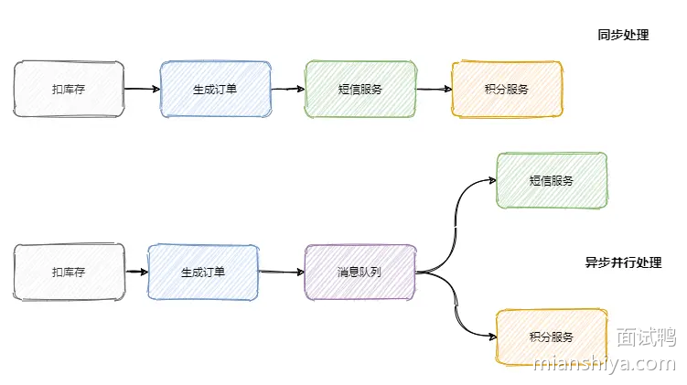
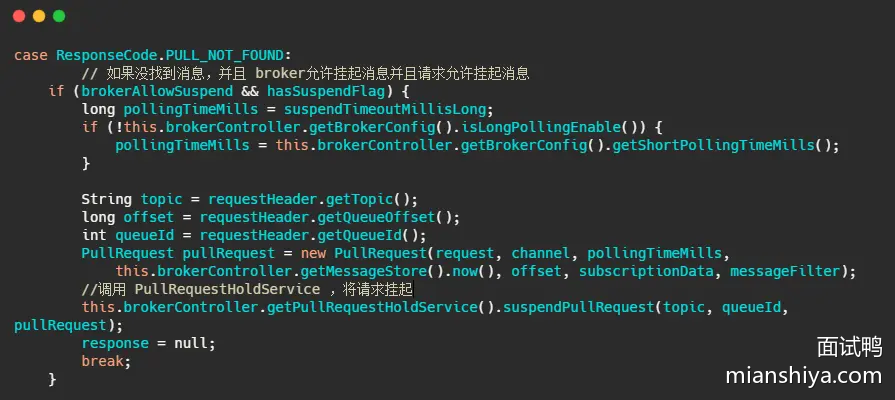
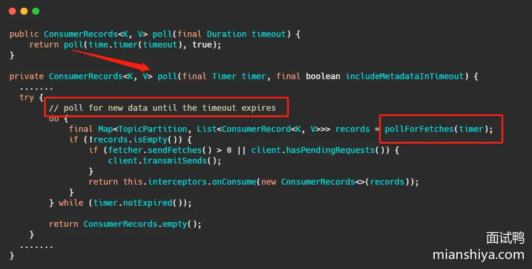
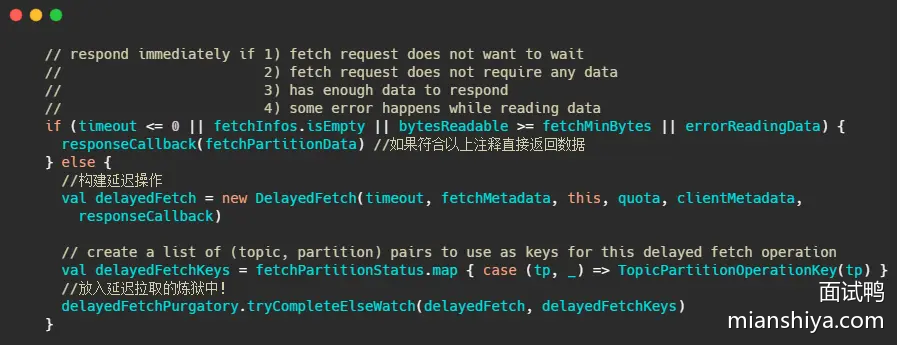

# 1142. 说一下 RocketMQ 中关于事务消息的实现？

## 回答重点

RocketMQ 中的事务消息

**第一阶段（消息发送）**：

- 生产者先将消息发送到 RocketMQ 的 Topic，此时消息的状态为**半消息（Half Message）**，消费者不可见。
- 然后，生产者执行本地事务逻辑，并根据本地事务的执行结果来决定下一步的操作。

**第二阶段（提交或回查）**：

- 如果本地事务成功，生产者会向 RocketMQ 提交 `Commit` 操作，将半消息变为正式消息，消费者可见。
- 如果本地事务失败，生产者会向 RocketMQ 提交 `Rollback` 操作，RocketMQ 会丢弃该半消息。
- 如果生产者没有及时提交 `Commit` 或 `Rollback` 操作，RocketMQ 会定时回查生产者本地事务状态，决定是否提交或回滚消息。

## 扩展知识

### 事务消息的实现细节

**半消息**：

- 是 RocketMQ 中的一种特殊状态的消息，此时对 Consumer 是不可见的，而且也不是存在真正要发送的队列中，而是存在一个特殊队列中。
- 只有在事务确认后，半消息才会转换为正式消息。

**事务回查（Transaction Check）**：

- 当 RocketMQ 检测到某条半消息长时间未被提交或回滚时，会主动向生产者发起事务状态的回查请求。
- 生产者实现 `checkLocalTransaction` 方法，根据该消息对应的业务逻辑状态，返回事务的执行状态（如提交、回滚、未知）。
- RocketMQ 根据生产者返回的状态进行相应的处理，确保消息与业务操作的一致性。

**事务状态的三种类型**：

- **`COMMIT_MESSAGE`**：表示本地事务已成功，RocketMQ 将半消息标记为可投递，正式被消费者消费。
- **`ROLLBACK_MESSAGE`**：表示本地事务失败，RocketMQ 将删除该半消息，消费者不可见。
- **`UNKNOWN`**：表示本地事务状态暂时无法确定，RocketMQ 会在一段时间后重新回查。

### 使用示例与主要流程

我们再来简单的看下如何使用，我根据官网示例代码简化了下。


可以看到使用起来还是很简便直观的，无非就是多加个反查事务结果的方法，然后把本地事务执行的过程写在 TransationListener 里面。

至此 RocketMQ 事务消息大致的流程已经清晰了，我们画一张整体的流程图来过一遍，其实到第四步这个消息要么就是正常的消息，要么就是抛弃什么都不存在，此时这个事务消息已经结束它的生命周期了。


### RocketMQ 事务消息源码分析

然后我们再从源码的角度来看看到底是怎么做的，首先我们看下 `sendMessageInTransaction` 方法，方法有点长，不过没有关系结构还是很清晰的。


流程也就是我们上面分析的，将消息塞入一些属性，标明此时这个消息还是半消息，然后发送至 Broker，然后执行本地事务，然后将本地事务的执行状态发送给 Broker ，我们现在再来看下 Broker 到底是怎么处理这个消息的。

在 Broker 的 `SendMessageProcessor#sendMessage` 中会处理这个半消息请求，因为今天主要分析的是事务消息，所以其他流程不做分析，我大致的说一下原理。

简单的说就是 sendMessage 中查到接受来的消息的属性里面 `MessageConst.PROPERTY_TRANSACTION_PREPARED` 是 true ，那么可以得知这个消息是事务消息，然后再判断一下这条消息是否超过最大消费次数，是否要延迟，Broker 是否接受事务消息等操作后，将这条消息真正的 topic 和队列存入属性中，然后重置消息的 topic 为 `RMQ_SYS_TRANS_HALF_TOPIC` ，并且队列是 0 的队列中，使得消费者无法读取这个消息。

以上就是整体处理半消息的流程，我们来看一下源码。


就是来了波狸猫换太子，其实延时消息也是这么实现的，最终将换了皮的消息入盘。

Broker 处理提交或者回滚消息的处理方法是 `EndTransactionProcessor#processRequest` ，我们来 看一看它做了什么操作。


可以看到，如果是提交事务就是把皮再换回来写入真正的topic所属的队列中，供消费者消费，如果是回滚则是将半消息记录到一个 half_op 主题下，到时候后台服务扫描半消息的时候就依据其来判断这个消息已经处理过了。

那个后台服务就是 `TransactionalMessageCheckService` 服务，它会定时的扫描半消息队列，去请求反查接口看看事务成功了没，具体执行的就是 `TransactionalMessageServiceImpl#check` 方法。

我大致说一下流程，这一步骤其实涉及到的代码很多，我就不贴代码了，有兴趣的同学自行了解。不过我相信用语言也是能说清楚的。

首先取半消息 topic 即 `RMQ_SYS_TRANS_HALF_TOPIC` 下的所有队列，如果还记得上面内容的话，就知道半消息写入的队列是 id 是 0 的这个队列，然后取出这个队列对应的 half_op 主题下的队列，即`RMQ_SYS_TRANS_OP_HALF_TOPIC` 主题下的队列。

这个 half_op 主要是为了记录这个事务消息已经被处理过，也就是说已经得知此事务消息是提交的还是回滚的消息会被记录在 half_op 中。

然后调用 `fillOpRemoveMap` 方法，从 half_op 取一批已经处理过的消息来去重，将那些没有记录在 half_op 里面的半消息调用 `putBackHalfMsgQueue` 又写入了 commitlog 中，然后发送事务反查请求，这个反查请求也是 oneWay，即不会等待响应。当然此时的半消息队列的消费 offset 也会推进。

然后 producer 中的 `ClientRemotingProcessor#processRequest` 会处理这个请求，会把任务扔到 `TransactionMQProducer` 的线程池中进行，最终会调用上面我们发消息时候定义的 `checkLocalTransactionState` 方法，然后将事务状态发送给 Broker，也是用 oneWay 的方式。

看到这里相信大家会有一些疑问，比如为什么要有个 half_op ，为什么半消息处理了还要再写入 commitlog 中别急听我一一道来。

首先 **RocketMQ 的设计就是顺序追加写入**，所以**说不会更改已经入盘的消息**，那事务消息又需要更新反查的次数，超过一定反查失败就判定事务回滚。

因此每一次要反查的时候就将以前的半消息再入盘一次，并且往前推进消费进度。而 half_op 又会记录每一次反查的结果，不论是提交还是回滚都会记录，因此下一次还循环到处理此半消息的时候，可以从 half_op 得知此事务已经结束了，因此就被过滤掉不需要处理了。

如果得到的反查的结果是 UNKNOW，那 half_op 中也不会记录此结果，因此还能再次反查，并且更新反查次数。

到现在整个流程已经清晰了，我再画个图总结一下 Broker 的事务处理流程。


# 1085. 什么是消息队列？

## 回答重点

消息队列（Message Queue）是一种**异步通信机制**，用于在**分布式系统**中解耦发送方和接收方之间的通信。它通过在消息生产者和消费者之间引入一个**中间缓冲区**（常见为 broker），将消息存储在 broker 中，然后由消费者从 broker 中读取和处理消息。

**常见用途**：

- **解耦**：生产者和消费者无需同时在线，生产者可以发送消息后立即返回，而消费者在合适的时机处理消息。
- **削峰填谷**：在高并发场景下，消息队列可以暂存大量请求，平滑高峰流量，避免系统过载。
- **异步处理**：可以将不需要立即处理的任务放入消息队列中异步执行，减少用户请求的响应时间。

## 扩展知识

### 常见的消息队列实现

**RabbitMQ**：

- RabbitMQ 是基于 AMQP 协议的消息队列，适合**复杂路由**和**多种消息模式**的场景。
- 具有强大的消息路由能力，包括**Direct**、**Fanout**、**Topic** 等多种交换机类型。
- 支持消息的**持久化**、**确认机制**和**死信队列**，确保消息的可靠传输。

**Kafka**：

- Kafka 是一种高吞吐量、分布式的消息队列，适用于**实时数据流**和**大数据分析**的场景。
- Kafka 的数据是以**分区（Partition）** 为单位存储，支持水平扩展。
- Kafka 的消费者可以以**消费组**的方式消费消息，实现**消息的多次消费**和**负载均衡**。

**RocketMQ**：

- RocketMQ 是阿里巴巴开源的一款消息队列，具有**高吞吐**、**低延迟**的特点，适用于企业级应用场景。
- 支持事务消息、延时消息和顺序消息，适用于金融支付、交易系统等对数据一致性要求较高的场景。

# 1087. 为什么需要消息队列？

## 回答重点

从本质上来说是因为互联网的快速发展，**业务不断扩张**，促使技术架构需要不断的演进。

从以前的单体架构到现在的微服务架构，成百上千的服务之间相互调用和依赖。从互联网初期一个服务器上有 100 个在线用户已经很了不得，到现在坐拥 10 亿日活的微信。

我们需要有一个「东西」来**解耦服务之间的关系**、**控制资源合理合时的使用**以及**缓冲流量洪峰**等等。

消息队列就应运而生了。它常用来实现：**异步处理、服务解耦、流量控制**。

消息队列的典型应用场景：

- 订单系统：在电商系统中，订单的创建、支付、发货等步骤可以通过消息队列进行异步处理和解耦。
- 日志处理：使用消息队列将日志从应用系统传输到日志处理系统，实现实时分析和监控。
- 任务调度：在批量任务处理、任务调度系统中，通过消息队列将任务分发给多个工作节点，进行并行处理。
- 数据同步：在数据同步系统中，消息队列可以用于将变更的数据异步同步到不同的存储系统或服务。

## 扩展知识

### 异步处理

随着公司的发展你可能会发现你项目的**请求链路越来越长**，例如刚开始的电商项目，可以就是粗暴的扣库存、下单。慢慢地又加上积分服务、短信服务等。这一路同步调用下来客户可能等急了，这时候就是消息队列登场的好时机。

**调用链路长、响应就慢了**，并且相对于扣库存和下单，积分和短信没必要这么的 "及时"。因此只需要在下单结束那个流程，扔个消息到消息队列中就可以直接返回响应了。而且积分服务和短信服务可以并行的消费这条消息。

可以看出消息队列可以**减少请求的等待，还能让服务异步并发处理，提升系统总体性能**。



### 服务解耦

上面我们说到加了积分服务和短信服务，这时候可能又要来个营销服务，之后领导又说想做个大数据，又来个数据分析服务等等。

可以发现订单的下游系统在不断的扩充，为了迎合这些下游系统订单服务需要经常地修改，任何一个下游系统接口的变更可能都会影响到订单服务，这订单服务组可疯了，**真 「核心」项目组**。

所以一般会选用消息队列来解决系统之间耦合的问题，订单服务把订单相关消息塞到消息队列中，下游系统谁要谁就订阅这个主题。这样订单服务就解放啦！


### 流量控制

想必大家都听过「削峰填谷」，后端服务相对而言都是比较「弱」的，因为业务较重，处理时间较长。像一些例如秒杀活动爆发式流量打过来可能就顶不住了。因此需要引入一个中间件来做缓冲，消息队列再适合不过了。

网关的请求先放入消息队列中，后端服务尽自己最大能力去消息队列中消费请求。超时的请求可以直接返回错误。

当然还有一些服务特别是某些后台任务，不需要及时地响应，并且业务处理复杂且流程长，那么过来的请求先放入消息队列中，后端服务按照自己的节奏处理。这也是很 nice 的。

上面两种情况分别对应着生产者生产过快和消费者消费过慢两种情况，消息队列都能在其中发挥很好的缓冲效果。


### 注意

引入消息队列固然有以上的好处，但是多引入一个中间件系统的稳定性就下降一层，运维的难度抬高一层。因此要**权衡利弊，系统是演进的**。

# 1088. 说一下消息队列的模型有哪些？

## 回答重点

常见的消息队列模型主要有以下两种：

**队列模型（也称点对点模型）**：

- 在队列模型中，消息从生产者发送到队列，并且每条消息只能被一个消费者消费一次。消费之后，消息在队列中被删除。
- 适用于任务处理类场景，如一个任务只需要一个处理者执行。

**发布/订阅模型（Publish/Subscribe）**：

- 在发布/订阅模型中，生产者将消息发布到某个主题（Topic），所有订阅了该主题的消费者都会接收到该消息。
- 每个订阅者都会接收到相同的消息，适用于广播通知、实时推送等场景。

## 扩展知识

### 队列模型（点对点模型）

生产者往某个队列里面发送消息，一个队列可以存储多个生产者的消息，一个队列也可以有多个消费者，但是消费者之间是竞争关系，**即每条消息只能被一个消费者消费**。


### 发布/订阅模型

**为了解决一条消息能被多个消费者消费的问题**，发布/订阅模型就来了。该模型是将消息发往一个Topic 即主题中，所有订阅了这个 Topic 的订阅者都能消费这条消息。

其实可以这么理解，发布/订阅模型等于我们都加入了一个群聊中，我发一条消息，加入了这个群聊的人都能收到这条消息。

那么队列模型就是一对一聊天，我发给你的消息，只能在你的聊天窗口弹出，是不可能弹出到别人的聊天窗口中的。

讲到这有人说，那我一对一聊天对每个人都发同样的消息不就也实现了一条消息被多个人消费了嘛。

是的，通过多队列全量存储相同的消息，即数据的冗余可以实现一条消息被多个消费者消费。

RabbitMQ 就是采用队列模型，通过 Exchange 模块来将消息发送至多个队列，解决一条消息需要被多个消费者消费问题。

这里还能看到假设群聊里除我之外只有一个人，那么此时的发布/订阅模型和队列模型其实就一样了。


### 小结一下

队列模型每条消息只能被一个消费者消费，而发布/订阅模型就是为让一条消息可以被多个消费者消费而生的，当然队列模型也可以通过消息全量存储至多个队列来解决一条消息被多个消费者消费问题，但是会有数据的冗余。

**发布/订阅模型兼容队列模型**，即只有一个消费者的情况下和队列模型基本一致。

RabbitMQ 采用队列模型， RocketMQ 和 Kafka 采用发布/订阅模型。

> RabbitMQ 的发布/订阅模式在本质上依然是基于队列模型的，只是通过引入多队列和交换机的绑定，同时将消息发给多个队列，模拟出消息发布/订阅的效果。

# 1129. 简述下消息队列核心的一些术语？

## 回答重点

常见的消息队列核心术语：

- **生产者（Producer）**：负责向消息队列中发送消息的应用程序或服务。生产者将消息发送到指定的队列或主题（Topic），供消费者消费。
- **消费者（Consumer）**：从消息队列中读取和处理消息的应用程序或服务。消费者根据业务逻辑处理收到的消息，并可以向消息队列发送确认。
- **Broker**：消息队列的核心组件，负责接收、存储和分发消息。
- **队列（Queue）**：存储消息的容器，消息按照先进先出（FIFO）的顺序在队列中存储。队列中的每条消息通常只能被一个消费者消费一次。
- **主题（Topic）**：用于在发布/订阅模型中，消息生产者将消息发布到一个主题，多个订阅该主题的消费者可以接收到相同的消息。

仅关注消息的发送和消费流程的话：消息从 Producer 发往 Broker，Broker 将消息存储至本地，然后 Consumer 从 Broker 拉取消息，或者 Broker 推送消息至 Consumer，最后消费。


## 扩展知识

### 其它术语与概念

**消息确认（Ack）**：

- 消费者处理完消息后，向消息队列系统发送的确认信号（Acknowledgment）。
- 如果消息队列未收到确认，消息会被重新投递给其他消费者，保证消息不会丢失。

**死信队列（DLQ，Dead Letter Queue）**：

- 当消息因为消费失败、多次重试后未成功处理、消息过期或队列达到最大长度等原因被丢弃时，消息可以被转移到死信队列。
- 死信队列用于记录这些未能成功消费的消息，以便后续分析或人工处理。

**NameServer（命名服务）**：

- NameServer 提供了服务发现和负载均衡的功能。
- 在分布式消息队列（如 RocketMQ）中，用于管理 Broker 的地址列表，消费者和生产者通过 NameServer 找到 Broker 并进行消息的传递。Kafka 中使用 ZooKeeper 作为命名服务，RabbitMQ 没有命名服务，RocketMQ 使用自己实现的 namesrv。

**Cluster（集群）**：

- 为了提高消息队列的可靠性和处理能力，将多个 Broker 组成一个集群。
- 集群架构可以在一个 Broker 发生故障时，保证消息服务的高可用性。

**分区与队列**：

- 为了提高并发度，往往**发布/订阅模型**还会引入队列或者分区的概念。
- 即消息是发往一个主题（Topic）下的某个队列或者某个分区中。
- RocketMQ 中叫队列（MessageQueue）， Kafka 叫分区。
- 这里的队列要区别于队列模型中的队列，RocketMQ 中的队列更多是逻辑概念，用于 Topic 下的消息存储与消费。一个 Topic 可以包含多个MessageQueue，这些队列类似于 Kafka 的分区，用于**并发消费**。

**Offset**：

- Offset 可以认为是每条消息在分区（队列）中的唯一编号，消费者需要记录自己的消费位点，以便在恢复时继续消费未处理的消息
- Kafka 和 RocketMQ 有这个概念，RabbitMQ 没有。

**Consumer Group（消费组）**:

- Consumer Group 用于协调消费者并行消费消息。
- 在 Kafka 中同一消费组内的消费者共享同一个 Topic 下的分区，一个分区只会被组内的一个消费者消费。
- 在 RocketMQ 中同一消费组内的消费者共享同一个 Topic 下的队列，一个队列只会被组内的一个消费者消费
- RabbitMQ 没有 Consumer Group 概念。

> 我们来理解下 Consumer Group 中的消费情况，以 RocketMQ 举例说明

假设现在有两个消费组分别是 Group 1 和 Group 2，它们都订阅了 Topic-a。此时有一条消息发往 Topic-a ，那么这两个消费组都能接收到这条消息。

这条消息实际是写入 Topic 某个队列中的，消费组中的某个消费者对应消费一个队列的消息。

一条消息在 Broker 中只会有一份（除了集群架构下的副本拷贝），每个消费组会有自己的 offset 即消费点位来标识消费到的位置。在消费点位之前的消息表明已经消费过了。

这个 offset 是队列级别的，每个消费组都会维护订阅的 Topic 下的每个队列的 offset 。

来看下这个图应该就很清晰了：


# 1130. 如何保证消息不丢失？

## 回答重点

这需要生产消息、存储消息和消费消息三个阶段共同努力才能保证消息不丢失。

- **生产者的消息确认**：生产者在发送消息时，需要通过消息确认机制来确保消息成功到达。
- **存储消息**：broker 收到消息后，需要将消息持久化到磁盘上，避免消息因内存丢失。即使消息队列服务器重启或宕机，也可以从磁盘中恢复消息。
- **消费者的消息确认**：消费者在处理完消息后，再向消息队列发送确认（ACK），如果消费者未发送确认，消息队列需要重新投递该消息。

除此之外，如果消费者持续消费失败，消息队列可以自动进行重试或将消息发送到死信队列（DLQ）或通过日志等其他手段记录异常的消息，避免因一时的异常导致消息丢失。

## 扩展知识

就我们市面上常见的消息队列而言，只要**配置得当**，我们的消息就不会丢。

先来看看一个图：


### 生产消息

生产者发送消息至 Broker ，需要处理 Broker 的响应，不论是同步还是异步发送消息，同步和异步回调都需要做好 try-catch ，妥善的处理响应，如果 Broker 返回写入失败等错误消息，需要重试发送。当多次发送失败需要作报警，日志记录等。

这样就能保证在生产消息阶段消息不会丢失。

### 存储消息

存储消息阶段需要在**消息刷盘**之后再给生产者响应，假设消息写入缓存中就返回响应，那么机器突然断电这消息就没了，而生产者以为已经发送成功了。

如果 Broker 是集群部署，有多副本机制，即消息不仅仅要写入当前 Broker，还需要写入副本机中。可以配置成至少写入两台机子后再给生产者响应，这样基本上就能保证存储的可靠了。

### 消费消息

这里经常会有同学犯错，有些同学当消费者拿到消息之后直接存入内存队列中就直接返回给 Broker 消费成功，这是不对的。

你需要考虑拿到消息放在内存之后消费者就宕机了怎么办。所以我们应该在**消费者真正执行完业务逻辑之后，再发送给 Broker 消费成功**，这才是真正的消费了。

所以只要我们在消息业务逻辑处理完成之后再给 Broker 响应，那么消费阶段消息就不会丢失。

### 小结一下

可以看出，保证消息的可靠性需要**三方配合**。

**生产者**需要处理好 Broker 的响应，出错情况下利用重试、报警等手段。

**Broker**需要控制响应的时机，单机情况下是消息刷盘后返回响应，集群多副本情况下，即发送至两个副本及以上的情况下再返回响应。

**消费者**需要在执行完真正的业务逻辑之后再返回响应给 Broker。

但是要注意消息**可靠性增强了，性能就下降**了，等待消息刷盘、多副本同步后返回都会影响性能。因此还是看业务，例如日志的传输可能丢那么一两条关系不大，因此没必要等消息刷盘再响应。

# 1131. 如何处理重复消息？

## 回答重点

### 1. 消息幂等性处理

- **幂等接口设计**：确保消费消息的业务逻辑是幂等的，即多次执行同一操作的结果是一样的。例如，可以通过数据库的唯一约束来保证数据不会被重复插入。
- **唯一标识**：为每条消息添加一个全局唯一的标识（如UUID），在处理消息前先检查这个标识是否已经被处理过。

### 2. 消息去重机制

- **数据库去重**：在处理消息前，将消息的唯一标识存入数据库，处理前先查询数据库中是否已存在该标识。
- **缓存去重**：使用Redis等缓存系统来存储已处理消息的标识，可以快速检查消息是否重复。

### 3. 消息确认机制

- **消息确认**：消费者在处理完消息后向消息队列发送确认（acknowledgment），只有确认过的消息才会从队列中移除。如果消费者在处理消息前崩溃，消息队列可以重新将消息投递给其他消费者。
- **幂等性确认**：确认消息也可以设计成幂等的，即重复确认不会导致副作用。

### 4. 幂等框架或库

- **使用幂等框架**：一些框架和库可以帮助实现消息的幂等性处理，例如在分布式系统中使用分布式锁或幂等库。

### 5. 消息队列特性

- **利用消息队列特性**：某些消息队列提供了去重特性，例如RocketMQ的幂等性消费。

### 具体实现步骤：

1. **生成唯一消息ID**：
   - 在生产消息时，为每条消息生成一个唯一的消息ID。
2. **存储消息ID**：
   - 将消息ID存储在数据库或缓存中，设置适当的过期时间。
3. **检查消息ID**：
   - 在消费消息前，先检查消息ID是否已经存在于数据库或缓存中。
   - 如果存在，则认为该消息是重复的，可以选择跳过处理。
   - 如果不存在，则处理消息，并将消息ID存入数据库或缓存。
4. **处理消息**：
   - 在确保消息不重复后，进行业务逻辑处理。
5. **消息确认**：
   - 在消息处理完成后，发送确认消息给消息队列，确保消息不会因为消费者的崩溃而重新投递。

通过上述策略，可以在很大程度上避免消息重复的问题，但需要注意的是，任何去重机制都会增加系统的复杂性和一定的性能开销，因此在设计系统时需要权衡去重与性能之间的关系。

## 扩展知识

### 什么是幂等性

幂等性是指一个操作无论执行多少次，产生的结果都是一样的。例如，HTTP 的 PUT 方法是幂等的，因为无论对同一资源执行多少次 PUT 操作，结果都是相同的。

例如这条 SQL:

```sql
update t1 set money = 150 where id = 1 and money = 100;
```

执行多少遍 money 都是 150，这就叫幂等。

### 如何幂等处理重复消息

需要改造业务处理逻辑，使得在重复消息的情况下也不会影响最终的结果。

主要是**利用唯一标识（ID）去重**。

在消息中引入全局唯一 ID，例如 UUID、订单号等，利用 redis 等缓存，或者数据库来存储消息 ID，然后消费者在处理消息时可以检查该消息 ID 是否存在代表此消息是否已经处理过。

**去重缓存的使用**：

- 使用 Redis 等缓存系统存储已经处理的消息 ID，以减少数据库的查询压力。
- 可以为 Redis 中的去重记录设置过期时间，例如 7 天，以便自动清理历史消息，减小存储压力。

**去重表的设计**：

- 在数据库中创建一张去重表，用来存储已处理消息的 ID 及处理时间。在消费每条消息前，先查询该表。
- 对于高并发场景，可以结合数据库的唯一索引来避免多次插入同一个消息 ID（`insert into update on duplicate key...`），确保去重表中的记录唯一。

此外，一些触发数据库修改操作的消息，可以像上述举例的 SQL 一样，做了个**前置条件判断**，即 money = 100 这样的条件直接修改，这样无论执行多少次都不影响。更通用的是做个 version 即版本号控制，对比消息中的版本号和数据库中的版本号。

### 可以从源头消除重复消息吗？即消费者仅会接收到一条消息


看下上面的图，我们来分析下看能不能避免消息的重复。

假设我们发送消息只管发，不管 Broker 的响应，那么我们发往 Broker 的消息是不会重复的。

但是一般情况我们是不允许这样的，因为这样无法保证消息的可靠性。

我们的基本需求是消息至少得发到 Broker 上，要确定 Broker 收到消息就得等 Broker 的响应，那么就可能存在 Broker 已经写入了，但是响应由于网络原因生产者没有收到，于是生产者又重发了一次，此时消息就重复了。

再看消费者消费的时候，假设我们消费者拿到消息消费了，业务逻辑已经走完了，事务提交了，此时需要更新 Consumer offset 了（告诉 Broker 这条消息我消费过了）。

但是就这这一刻这个消费者挂了，此时还未更新 Consumer offset。另一个消费者顶上，因为 Consumer offset 还没更新，于是新的消费者又拿到刚才那条消息，业务又被执行了一遍，这样消息不就重复了吗？

可以看到，对平常业务而言**消息重复是不可避免**的，因此我们只能从**另一个角度**来解决重复消息的问题。

关键点就是**幂等**。既然我们不能防止重复消息的产生，那么我们只能在业务上处理重复消息所带来的影响。

# 1138. 如何保证消息的有序性？

## 回答重点

保证消息有序性的常见方法如下：

**单一生产者和单一消费者**：

- 使用单个生产者发送消息到**单个队列**，并由单个消费者处理消息。这样可以确保消息按照生产者的发送顺序消费。
- 这种方法简单但容易成为**性能瓶颈**，无法充分利用并发的优势。

**分区与顺序键（Partition Key）**：

- 在支持**分区（Partition）** 的消息队列中（如 Kafka、RocketMQ），可以通过 **Partition Key** 将消息发送到特定的分区。每个分区内部是**有序的**，这样可以保证相同 Partition Key 的消息按顺序消费。
- 例如，在订单处理系统中，可以使用订单号作为 Partition Key，将同一个订单的所有消息路由到同一个分区，确保该订单的消息顺序。

**顺序队列（Ordered Queue）**：

- 一些消息队列系统（如 RabbitMQ）支持顺序队列，消息在队列中的存储顺序与投递顺序一致。**如果使用单个顺序队列**，消息将按顺序被消费。
- 可以使用多个顺序队列来提高并发处理能力，并使用特定规则将消息分配到不同的顺序队列中。

## 扩展知识

### 不同消息队列的顺序性保证

**Kafka**：Kafka 中的消息在**分区**内部是有序的。生产者在发送消息时，可以指定分区（Partition）。如果所有相同 Key 的消息都发送到同一个分区，则可以保证这些消息的顺序。

- 通过配置生产者的**hash**函数，可以将同一类型的消息发送到相同的分区，保证顺序。
- 在消费端，使用**单线程消费者**从特定分区读取消息，可以确保消费的顺序性。

**RabbitMQ**：RabbitMQ 通过单个队列可以保证消息的顺序，如果消息需要并发消费，则需要将其路由到不同的**顺序队列**中。

- 使用**Message Grouping**技术，将具有相同属性的消息分组到一个队列中，以确保组内消息的顺序。
- 通过**自定义路由策略**，可以将同一业务逻辑的消息发送到相同的队列，从而保证顺序。

**RocketMQ**：RocketMQ 支持**顺序消息**（Ordered Messages），生产者可以使用 `send` 方法将消息发送到指定的分区队列，并使用**Message Queue Selector**来选择目标队列（本质的实现和 kafka 是一样的）。

- 消费者端通过**顺序消费模式**，可以从同一个消息队列中按顺序读取消息，确保消息的顺序性。
- 通过指定 Message Queue 的选择算法（如按订单 ID 对队列数取模），可以将同一订单的所有消息投递到相同的队列中。

### 有序消息之全局有序

如果要保证消息的**全局有序**，首先只能由一个生产者往 Topic 发送消息，并且**一个 Topic** 内部只能有**一个队列**（分区）。消费者也必须是单线程消费这个队列。这样的消息就是全局有序的！

不过一般情况下我们都不需要全局有序，即使是同步 MySQL Binlog 也只需要保证**单表**消息有序即可。


### 有序消息之部分有序

绝大部分的有序需求是部分有序，部分有序我们就可以将 Topic 内部划分成我们需要的队列数，把消息通过特定的策略发往固定的队列中，然后每个队列对应一个单线程处理的消费者。

这样即完成了部分有序的需求，又可以通过队列数量的并发来提高消息处理效率。


图中我画了多个生产者，一个生产者也可以，只要同类消息发往指定的队列即可。

使用**顺序消息**在 Kafka 和 RocketMQ 中的实现方式略有不同，下面是针对这两种消息队列的顺序消息实现的详细示例。

### Kafka 顺序消息示例

假设场景是一个订单系统，我们希望保证同一订单 ID 的消息按照顺序被消费。通过将**相同的业务 Key（订单 ID）的消息发送到同一个分区（Partition）**，可以保证这些消息在分区内部的顺序性。消费时，同一个分区的数据按顺序消费，就能保证了消息的有序性。

#### 生产者代码

```java
//忽略相关配置
KafkaProducer<String, String> producer = new KafkaProducer<>(props);

String orderId = "order-123";

for (int i = 1; i <= 5; i++) {
    String value = "Order Step " + i + " for " + orderId;
    // 使用订单 ID 作为 Key，确保相同订单的消息发送到同一个分区
    ProducerRecord<String, String> record = new ProducerRecord<>(TOPIC, orderId, value);

    RecordMetadata metadata = producer.send(record).get();
}
```

#### 消费者代码

```java
KafkaConsumer<String, String> consumer = new KafkaConsumer<>(props);
consumer.subscribe(Collections.singletonList(TOPIC));

while (true) {
    ConsumerRecords<String, String> records = consumer.poll(Duration.ofSeconds(1));
    for (ConsumerRecord<String, String> record : records) {
        System.out.printf("Consumed message: %s from partition: %d, offset: %d\n",
                record.value(), record.partition(), record.offset());
    }
}
```

- **生产者**：使用 `orderId` 作为 `key`，Kafka 根据这个 `key` 将消息发送到同一个分区。这样可以确保相同 `orderId` 的消息被发送到同一个分区，从而保证顺序。
- **消费者**：从 Kafka 的 `order-topic` 中读取消息，因为 Kafka 的分区内部消息是有序的，消费者将按照 `orderId` 的顺序消费这些消息。

### RocketMQ 顺序消息示例

在 **RocketMQ** 中，可以通过**消息队列选择器**（`MessageQueueSelector`）将消息发送到指定的队列，从而实现顺序消费

#### 生产者代码

```java
String orderId = "order-123";

for (int i = 1; i <= 5; i++) {
    String body = "Order Step " + i + " for " + orderId;
    Message message = new Message("OrderTopic", body.getBytes(StandardCharsets.UTF_8));

    // 使用 MessageQueueSelector 按照 orderId 选择队列
    SendResult sendResult = producer.send(message, new MessageQueueSelector() {
        @Override
        public MessageQueue select(List<MessageQueue> mqs, Message msg, Object arg) {
            // 将 orderId 转为 hash 值，以决定消息发往哪个队列
            String orderId = (String) arg;
            int index = orderId.hashCode() % mqs.size();
            return mqs.get(Math.abs(index));
        }
    }, orderId);
}
```

#### 消费者代码

```java
// 使用并发消费消息监听器，保证单队列内的顺序性
consumer.registerMessageListener((MessageListenerConcurrently) (msgs, context) -> {
    for (MessageExt msg : msgs) {
        String body = new String(msg.getBody());
        System.out.printf("Consumed message: %s from queue: %d\n", body, msg.getQueueId());
    }
    return ConsumeConcurrentlyStatus.CONSUME_SUCCESS;
});
```

- **生产者**：使用 `MessageQueueSelector` 将具有相同 `orderId` 的消息发送到同一个消息队列（`MessageQueue`），确保这些消息被发送到同一队列，从而保证顺序。
- **消费者**：通过 `DefaultMQPushConsumer` 订阅 `OrderTopic`，RocketMQ 保证每个队列中的消息是按顺序消费的。只要相同订单 ID 的消息在同一队列中，就可以保证它们的消费顺序。

在 **RabbitMQ** 中，保证消息的顺序性可以通过以下方式实现：

- **单个队列单个消费者**：将消息发送到一个队列中，并使用单个消费者进行消费，这样可以确保消息按照生产者发送的顺序被消费。
- **多队列顺序性保证**：可以根据某个业务 Key（例如订单 ID）选择队列，从而保证具有相同业务 Key 的消息总是发送到同一个队列，由一个消费者按顺序处理。

下面的示例演示了**RabbitMQ 顺序消息的实现**，通过将所有相同订单 ID 的消息发送到同一个队列中，以确保消息的顺序。

### RabbitMQ 顺序消息示例

#### 生产者代码

```java
try (Connection connection = factory.newConnection();
     Channel channel = connection.createChannel()) {
    // 声明队列（如果不存在则创建）
    channel.queueDeclare(QUEUE_NAME, true, false, false, null);

    String orderId = "order-123";

    for (int i = 1; i <= 5; i++) {
        String message = "Order Step " + i + " for " + orderId;
        // 发送消息
        channel.basicPublish("", QUEUE_NAME, null, message.getBytes("UTF-8"));
        System.out.println("Sent: " + message);
    }
}
```

#### 消费者代码

```java
try (Connection connection = factory.newConnection();
     Channel channel = connection.createChannel()) {
    // 声明队列（如果不存在则创建）
    channel.queueDeclare(QUEUE_NAME, true, false, false, null);

    // 创建消费者，并定义处理逻辑
    DeliverCallback deliverCallback = (consumerTag, delivery) -> {
        String message = new String(delivery.getBody(), "UTF-8");
        System.out.println("Received: " + message);

        // 模拟消息处理逻辑
        try {
            Thread.sleep(500); // 模拟处理延迟
        } catch (InterruptedException e) {
            e.printStackTrace();
        }

        // 发送手动确认
        channel.basicAck(delivery.getEnvelope().getDeliveryTag(), false);
    };

    // 开始消费消息（手动确认模式）
    channel.basicConsume(QUEUE_NAME, false, deliverCallback, consumerTag -> { });
}
```

- **单个消费者**：此示例中使用了单个消费者处理消息，确保消息按照发送顺序被消费。对于顺序性要求高的业务，通常只使用一个消费者进行处理。

### RabbitMQ 方案扩展：多队列+顺序消费

在某些场景下，单个队列和单个消费者的方式可能会因为性能问题无法满足业务需求。我们可以通过多队列的方式，将不同业务 Key 的消息发送到不同的队列中，以提高并发处理能力，同时保证每个 Key 的消息顺序。

- **将消息分配到不同的队列**：例如，可以使用订单 ID 的哈希值，将订单消息发送到多个不同的队列。
- **每个队列使用一个消费者**：确保同一个队列中的消息按顺序被消费。每个消费者只负责处理一个队列中的消息。

#### 多队列的生产者

```java
try (Connection connection = factory.newConnection();
     Channel channel = connection.createChannel()) {

    String orderId = "order-123";
    int numberOfQueues = 3; // 假设有 3 个队列
    int queueIndex = Math.abs(orderId.hashCode() % numberOfQueues);
    String queueName = QUEUE_PREFIX + queueIndex;

    // 声明队列（如果不存在则创建）
    channel.queueDeclare(queueName, true, false, false, null);

    for (int i = 1; i <= 5; i++) {
        String message = "Order Step " + i + " for " + orderId;
        channel.basicPublish("", queueName, null, message.getBytes("UTF-8"));
        System.out.println("Sent: " + message + " to " + queueName);
    }
}
```

#### 多队列的消费者

```java
try (Connection connection = factory.newConnection();
     Channel channel = connection.createChannel()) {
    String queueName = QUEUE_PREFIX + QUEUE_INDEX;

    channel.queueDeclare(queueName, true, false, false, null);
    System.out.println("Waiting for messages in " + queueName);

    DeliverCallback deliverCallback = (consumerTag, delivery) -> {
        String message = new String(delivery.getBody(), "UTF-8");
        System.out.println("Received: " + message);

        // 模拟处理逻辑
        try {
            Thread.sleep(500);
        } catch (InterruptedException e) {
            e.printStackTrace();
        }

        channel.basicAck(delivery.getEnvelope().getDeliveryTag(), false);
    };

    channel.basicConsume(queueName, false, deliverCallback, consumerTag -> { });
}
```

- **多队列方案**：生产者根据业务 Key（如订单 ID）的哈希值，将消息发送到不同的队列（如 `order_queue_0`、`order_queue_1`、`order_queue_2`）。这种方法可以提高并发处理能力，因为每个队列可以有一个独立的消费者。
- **每个消费者处理一个队列**：消费者从指定的队列中消费消息，确保每个队列内的消息按顺序消费。

# 1139. 如何处理消息堆积？

## 回答重点

消息堆积是指在消息队列中，消息的生产速度远大于消费速度，导致大量消息积压在队列中。

我们需要**先定位消费慢的原因**，如果是 bug 则处理 bug，同时可以临时扩容增加消费速率，减少线上的资损。

如果是因为本身消费能力较弱，则可以优化下消费逻辑

常见有以下几种方式**提升消费者的消费能力**：

1. **增加消费者线程数量**：提高并发消费能力。
2. **增加消费实例**：在分布式系统中，可以水平扩展多个消费实例，从而提高消费速率。
3. **优化消费者逻辑**：检查消费者的代码，减少单个消息的处理时间。例如，减少 I/O 操作、使用批量处理等。

**注意上述的第二点**：

- 增加消费实例，一定要注意**注意Topic 对应的分区/队列数需要大于等于消费实例数**，不然新增加的消费者是没东西消费的。**因为一个Topic中，一个分区/队列只会分配给一个消费实例**

除此之外还可以进行**限流和降级处理**：

- 对消息生产端进行限流，降低生产速率，避免消息积压进一步恶化。
- 对非关键消息进行**丢弃**或**延迟处理**，只保留高优先级的消息，提高系统的响应速度。

## 扩展知识

### 优化消费者逻辑常见做法

**批量消费**：

- 通过一次性从队列中消费多条消息（如批量读取 100 条），可以减少每次拉取消息的网络开销，提高处理效率。

**异步消费**：

- 使用异步处理方法，在消费的同时不阻塞后续消息的消费。处理完一条消息后立即开始处理下一条消息，提升并发度（但是要注意消息丢失的风险）。

**优化数据库操作**：

- 如果消费者在处理消息时需要频繁访问数据库，可以通过**数据库连接池**、**SQL 优化**、**缓存**等手段减少数据库操作的时间。
- 使用批量插入或更新操作，而不是逐条处理，可以显著提升效率。

### 临时扩展队列的策略

**临时扩展多个消费者队列**：

- 在消息积压严重时，可以通过临时扩展多个消费者队列，将积压的消息分配到不同的队列中进行消费。消费完成后，可以将这些临时队列关闭。
- 例如，在 Kafka 中，可以增加分区数（Partition），同时扩展更多的消费者实例，分摊消费压力。
- 在 RocketMQ 中可以增加队列数。

**使用多队列调度机制**：

- 例如，使用 RabbitMQ 的**Exchange**机制，将消息按照特定规则路由到多个队列中。这样可以在消息堆积时，将不同类型的消息分开处理。

### 限流与降级的实现方式

**生产者限流**：

- 在生产者端增加限流逻辑，使用**令牌桶**、**漏桶算法**等限流策略，限制生产者的发送速率，从而避免消息队列被快速填满。
- 例如，在 Kafka 中可以通过配置生产者的 `linger.ms` 和 `batch.size` 来缓解消息发送的速度。

**消费者降级**：

- 在消息堆积严重时，对低优先级的消息进行**丢弃**或延迟处理。只保留高优先级消息的消费，确保系统核心功能的正常运行。
- 可以在消费端增加**优先级队列**或通过消息属性区分优先级，先处理高优先级的消息。

# 1140. 消息队列设计成推消息还是拉消息？推拉模式的优缺点？

## 回答重点

**推模式（Push）**：消息队列将消息主动推送给消费者，适合实时性要求高、消费者能够及时处理消息的场景。

- **优点**：实时性好，消息可立即送达消费者。
- **缺点**：难以控制消费速度，容易导致消费者过载，尤其是在高并发时。

**拉模式（Pull）**：消费者主动从消息队列中拉取消息，适合消费能力有限、需要根据自身处理能力调控速率的场景。

- **优点**：消费者可以根据自身负载决定拉取频率，避免过载；更适合批量处理。
- **缺点**：可能会导致消息延迟，实时性不如推模式，尤其是拉取频率较低时。

## 扩展知识

### 推拉模式

首先明确一下推拉模式到底是在讨论消息队列的哪一个步骤，一般而言我们在谈论**推拉模式的时候指的是 Comsumer 和 Broker 之间的交互。**

默认的认为 Producer 与 Broker 之间就是推的方式，即 Producer 将消息推送给 Broker，而不是 Broker 主动去拉取消息。

想象一下，如果需要 Broker 去拉取消息，那么 Producer 就必须在本地通过日志的形式保存消息来等待 Broker 的拉取，如果有很多生产者的话，那么消息的可靠性不仅仅靠 Broker 自身，还需要靠成百上千的 Producer。

Broker 还能靠多副本等机制来保证消息的存储可靠，而成百上千的 Producer 可靠性就有点难办了，所以默认的 Producer 都是推消息给 Broker。

所以说有些情况分布式好，而有些时候还是集中管理好。

### 推模式

推模式指的是消息从 Broker 推向 Consumer，即 Consumer 被动的接收消息，由 Broker 来主导消息的发送。

**推模式有什么好处**：

- **消息实时性高**，Broker 接受完消息之后可以立马推送给 Consumer。
- **对于消费者使用来说更简单**，简单啊就等着，反正有消息来了就会推过来。

#### 推模式有什么缺点？

**推送速率难以适应消费速率**，推模式的目标就是以最快的速度推送消息，当生产者往 Broker 发送消息的速率大于消费者消费消息的速率时，随着时间的增长消费者那边可能就“爆仓”了，因为根本消费不过来啊。当推送速率过快就像 DDos 攻击一样消费者就傻了。

并且不同的消费者的消费速率还不一样，身为 Broker 很难平衡每个消费者的推送速率，如果要实现自适应的推送速率那就需要在推送的时候消费者告诉 Broker ，我不行了你推慢点吧，然后 Broker 需要维护每个消费者的状态进行推送速率的变更。

这其实就增加了 Broker 自身的复杂度。

所以说推模式难以根据消费者的状态控制推送速率，适用于消息量不大、消费能力强要求实时性高的情况下。

### 拉模式

拉模式指的是 Consumer 主动向 Broker 请求拉取消息，即 Broker 被动的发送消息给 Consumer。

#### 我们来想一下拉模式有什么好处？

拉模式主动权就在消费者身上了，消费者可以根据自身的情况来发起拉取消息的请求。假设当前消费者觉得自己消费不过来了，它可以根据一定的策略停止拉取，或者间隔拉取都行。

**拉模式下 Broker 就相对轻松了**，它只管存生产者发来的消息，至于消费的时候自然由消费者主动发起，来一个请求就给它消息呗，从哪开始拿消息，拿多少消费者都告诉它，它就是一个没有感情的工具人，消费者要是没来取也不关它的事。

**拉模式可以更合适的进行消息的批量发送**，基于推模式可以来一个消息就推送，也可以缓存一些消息之后再推送，但是推送的时候其实不知道消费者到底能不能一次性处理这么多消息。而拉模式就更加合理，它可以参考消费者请求的信息来决定缓存多少消息之后批量发送。

#### 拉模式有什么缺点？

**消息延迟**，毕竟是消费者去拉取消息，但是消费者怎么知道消息到了呢？所以它只能不断地拉取，但是又不能很频繁地请求，太频繁了就变成消费者在攻击 Broker 了。因此需要降低请求的频率，比如隔个2 秒请求一次，你看着消息就很有可能延迟 2 秒了。

**消息忙请求**，忙请求就是比如消息隔了几个小时才有，那么在几个小时之内消费者的请求都是无效的，在做无用功。

### 到底是推还是拉

可以看到推模式和拉模式各有优缺点，到底该如何选择呢？

**RocketMQ 和 Kafka 都选择了拉模式**，当然业界也有基于推模式的消息队列如 ActiveMQ。

我个人觉得拉模式更加的合适，因为现在的消息队列都有持久化消息的需求，也就是说本身它就有个存储功能，它的使命就是接受消息，保存好消息使得消费者可以消费消息即可。

而消费者各种各样，身为 Broker 不应该有依赖于消费者的倾向，我已经为你保存好消息了，你要就来拿好了。

虽说一般而言 Broker 不会成为瓶颈，因为消费端有业务消耗比较慢，但是 Broker 毕竟是一个中心点，能轻量就尽量轻量。

那么竟然 RocketMQ 和 Kafka 都选择了拉模式，它们就不怕拉模式的缺点么？ 怕，所以它们操作了一波，减轻了拉模式的缺点。

即

### 长轮询

RocketMQ 和 Kafka 都是利用“长轮询”来实现拉模式。所谓的“长轮询”具体的做法都是通过消费者去 Broker 拉取消息时，当有消息的情况下 Broker 会直接返回消息，如果没有消息都会采取延迟处理的策略，即保持连接，暂时 hold 主请求，然后在对应队列或者分区有新消息到来的时候都会提醒消息来了，通过之前 hold 主的请求及时返回消息，保证消息的及时性。

一句话说就是消费者和 Broker 相互配合，拉取消息请求不满足条件的时候 hold 住请求，避免了多次频繁的拉取动作，当消息一到就返回消息。

### 扩展阅读：RocketMQ 中的长轮询

RocketMQ 中的 PushConsumer 其实是披着拉模式的方法，**只是看起来像推模式而已**。

因为 RocketMQ 在被背后偷偷的帮我们去 Broker 请求数据了。

后台会有个 RebalanceService 线程，这个线程会根据 topic 的队列数量和当前消费组的消费者个数做负载均衡，每个队列产生的 pullRequest 放入阻塞队列 pullRequestQueue 中。然后又有个 PullMessageService 线程不断的从阻塞队列 pullRequestQueue 中获取 pullRequest，然后通过网络请求 broker，这样实现的准实时拉取消息。

这一部分代码我不截了，就是这么个事儿，稍后会用图来展示。

然后 Broker 的 PullMessageProcessor 里面的 processRequest 方法是用来处理拉消息请求的，有消息就直接返回，如果没有消息怎么办呢？我们来看一下代码。



我们再来看下 suspendPullRequest 方法做了什么。


而 PullRequestHoldService 这个线程会每 5 秒从 pullRequestTable 取PullRequest请求，然后看看待拉取消息请求的偏移量是否小于当前消费队列最大偏移量，如果条件成立则说明有新消息了，则会调用 notifyMessageArriving ，最终调用 PullMessageProcessor 的 executeRequestWhenWakeup() 方法重新尝试处理这个消息的请求，也就是再来一次，整个长轮询的时间默认 30 秒。


简单的说就是 5 秒会检查一次消息时候到了，如果到了则调用 processRequest 再处理一次。这好像不太实时啊？ 5秒？

别急，还有个 ReputMessageService 线程，这个线程用来不断地从 commitLog 中解析数据并分发请求，构建出 ConsumeQueue 和 IndexFile 两种类型的数据，**并且也会有唤醒请求的操作，来弥补每 5s 一次这么慢的延迟**

代码我就不截了，就是消息写入并且会调用 pullRequestHoldService#notifyMessageArriving。

最后我再来画个图，描述一下整个流程。


### 扩展阅读：Kafka 中的长轮询

像 Kafka 在拉请求中有参数，可以使得消费者请求在 “长轮询” 中阻塞等待。

简单的说就是消费者去 Broker 拉消息，定义了一个超时时间，也就是说消费者去请求消息，如果有的话马上返回消息，如果没有的话消费者等着直到超时，然后再次发起拉消息请求。

并且 Broker 也得配合，如果消费者请求过来，有消息肯定马上返回，没有消息那就建立一个延迟操作，等条件满足了再返回。

我们来简单的看一下源码，为了突出重点，我会删减一些代码。

先来看消费者端的代码。



上面那个 poll 接口想必大家都很熟悉，其实从注解直接就知道了确实是等待数据的到来或者超时，我们再简单的往下看。


我们再来看下最终 client.poll 调用的是什么。


最后**调用的就是 Kafka 包装过的 selector，而最终会调用 Java nio 的 select(timeout)**。

现在消费者端的代码已经清晰了，**我们再来看看 Broker 如何做的**。

Broker 处理所有请求的入口其实我在之前的文章介绍过，就在 KafkaApis.scala 文件的 handle 方法下，这次的主角就是 handleFetchRequest 。


这个方法进来，我截取最重要的部分。


下面的图片就是 fetchMessages 方法内部实现，源码给的注释已经很清晰了，大家放大图片看下即可。



这个炼狱名字取得很有趣，简单的说就是利用我之前文章提到的时间轮，来执行定时任务，例如这里是`delayedFetchPurgatory`，专门用来处理延迟拉取操作。

我们先简单想一下，这个延迟操作都需要实现哪些方法，首先构建的延迟操作需要有检查机制，来查看消息是否已经到了，然后呢还得有个消息到了之后该执行的方法，还需要有执行完毕之后该干啥的方法，当然还得有个超时之后得干啥的方法。

这几个方法其实对应的就是代码里的 DelayedFetch ，这个类继承了 DelayedOperation 内部有：

- isCompleted 检查条件是否满足的方法
- tryComplete 条件满足之后执行的方法
- onComplete 执行完毕之后调用的方法
- onExpiration 过期之后需要执行的方法

判断是否过期就是由时间轮来推动判断的，但是总不能等过期的时候再去看消息到了没吧？

这里 Kafka 和 RocketMQ 的机制一样，也会在消息写入的时候提醒这些延迟请求消息来了，具体代码我不贴了， 在 ReplicaManager#appendRecords 方法内部再深入个两方法可以看到。

不过虽说代码不贴，图还是要画一下的。


# 1141. RocketMQ 的事务消息有什么缺点？你还了解过别的事务消息实现吗？

## 回答重点

**从事务消息的改造成本来看**，RocketMQ 的事务消息改造成本不小，需要改造原始逻辑实现特定的接口，且在应用层处理复杂的回查逻辑，确保回查不会重复或丢失。

**从事务消息功能性来看**，RocketMQ 仅支持单事务消息。

**从可用性角度来看**，如果**MQ 集群挂了，事务就无法继续进行了，等于整个应用无法正常执行了**。

因为 RocketMQ 的事务消息的实现是先发半消息，如果 MQ 集群挂了，则半消息无法发送成本，后续的逻辑就无法执行。

## 扩展知识

### 进一步理解 MQ 集群挂了的情况

先抛出的一个问题：一个事务涉及 mysql 和 mq，到底哪个写入成功重要？

假如线上 mq 集群网络故障，导致发消息失败，即使 mysql 还是活着的，但是无法进行事务。

所以其实这个问题问的是：mysql 和 mq 之间的写入顺序。

在 RocketMQ 中，事务消息的实现方案是先发半消息（半消息对消费者不可见），待半消息发送成功之后，才能执行本地事务，等本地事务执行成功之后，再向 Broker 发送请求将半消息转成正常消息，这样消费者就可以消费此消息。

这种顺序等于先得成功写入 mq，然后再写入数据库，这样的模式会出现一个问题：**即 mq 集群挂了，事务就无法继续进行了，等于整个应用无法正常执行了**。

看一下我之前画的 RocketMQ 事务消息流程图：


第一步是需要等待半消息的响应，如果响应失败就无法执行本地事务。

看下伪代码，可能更清晰：

```isbl
result = sendHalfMsg();//发送半消息

if(result.success) {
  //执行本地事务

} else {
 //回滚此次事务

}
```

所以，先写 mq 后写 mysql 就会发生 mysql 还好好的，但是 mq 挂了事务就无法正常执行的情况。

### 所以应该怎么实现呢？

我们可以参考下 qmq 的方法。

> QMQ是去哪儿网内部广泛使用的消息中间件，自2012年诞生以来在去哪儿网所有业务场景中广泛的应用，包括跟交易息息相关的订单场景； 也包括报价搜索等高吞吐量场景。目前在公司内部日常消息qps在60W左右，生产上承载将近4W+消息topic，消息的端到端延迟可以控制在10ms以内。

在说 qmq 的事务消息之前，先来了解下本地消息表这个分布式事务实现方式。

本地消息就是利用了关系型数据库的事务能力，会在数据库中存放一张本地事务消息表，在进行本地事务操作中加入了本地消息表的插入，即将业务的执行和将消息放入到消息表中的操作放在同一个事务中提交。

这样本地事务执行成功的话，消息肯定也插入成功，然后再调用其他服务，如果其他服务调用成功就修改这条本地消息的状态。

如果失败也不要紧，会有一个后台线程扫描，发现这些状态的消息，会一直调用相应的服务，一般会设置重试的次数，如果一直不行则特殊记录，待人工介入处理。

可以看到，本地事务消息表还是很简单的，也是一种最大努力通知的思想。


在理解本地消息表之后，我们再来看一下 qmq 的事务消息是如何设计的。

首先，想要用 qmq 的事务消息，需要在数据库中建一张表，就是如下这样的表：


是不是有本地消息表那味儿了？

没错核心思想就是本地消息表！利用关系型数据库的事务能力，将业务的写入和消息表的写入融在一个事务中，这样业务成功则消息表肯定写入成功。

然后在事务提交之后，立刻发送事务消息，如果发送成功，则删除本地消息表中的记录，来看一下伪代码的实现，应该就很清晰了：

```java
@Transactional // 在一个事务中

public void yes(){
 Order order = buildOrder();
 orderDao.insert(order);
 Message message = buildMessage(order);
 messageDao.insert(message);
 //异步，在事务提交后执行

 triggerAfterTransactionCommit(()->{
  messageClient.send(message);
  messageDao.delete(message);
 });
}
```

当然，这是我剖开来写的实现思路，qmq 的使用没这么麻烦，直接在 sendMessage 里把上面的逻辑都包装好了，所以使用起来直接就是一个发送消息：

```stylus
@Transactional // 在一个事务中

public void yes(){
 Order order = buildOrder();
 orderDao.insert(order);
 //封装插入消息、发送消息、删除消息的逻辑

 producer.sendMessage(buildMessage(order)); 
}
```

如果消息发送失败，也就是比如 mq 集群挂了，并不会影响事务的执行，业务的执行和事务消息的插入都已经成功了，那此时待消息已经安安静静的在消息库里等着，后台能会有一个补偿任务，会将这些消息捞出来重新发送，直到发送成功。

想必，现在你应该对 qmq 的事务消息流程应该很清晰了，它的顺序就属于先写数据库，再发mq，即使 mq 集群挂了，也不会影响事务的进行，不会导致应用无法正常执行了。

这里可能有人会问，那如果 mysql 挂了呢？

我只能说数据库都挂了，那就都没了，别想啥别的了。

### 再来看 RocketMQ 和 QMQ

至此，想必你已经清楚 RocketMQ 和 QMQ 事务消息的区别，我们再来盘下 QMQ 事务消息更优的原因。

RocketMQ 只支持单事务消息，也就是无法在一个事务内发送多种事务消息。

而 QMQ 可以在一次事务中发多个消息，来看下伪代码：

```java
@Transactional // 在一个事务中

public void yes(){
 Order order = buildOrder();
 orderDao.insert(order);
 producer.sendMessage(buildMessageA(order));
 producer.sendMessage(buildMessageB(order));
 producer.sendMessage(buildMessageC(order));
}
```

这样的实现就比 RocketMQ 灵活多了。

然后 RocketMQ 事务消息的实现还需要提供一个反查机制，因为RocketMQ 事务消息的提交是 oneway 的发送方式，有可能 Broker 没有接收到事务提交的消息，所以 Broker 会定时去生产者那边查看事务是否已经执行完成，因此生产者需要保存本地事务执行结果，简单的就是用一个 map 保存，让 Broker 可以通过消息的事务 id 查找到事务执行的结果。


如果还要考虑发送事务消息的生产者挂了，那么 Broker 会找同个生产组的其他生产者来查询事务结果，所以这个存储还得提出来放到第三方，而不是本地内存保存。

因此，RocketMQ 得多维护一个本地事务执行结果，是稍微有点麻烦的。

当然，QMQ 还得建表呢，不过按照 QMQ 说的：如果公司方便的话，可以直接合并进DBA的初始化数据库的自动化流程中，这样就透明了。

还有一点 RocketMQ 的 api 不太友好，改造有点大，之后的迁移不太方便。

贴一下完整的使用 RocketMQ 事务消息的代码：


可以看到，如果想要搞事务消息，首先新建 transationMQproducer，然后再新建一个 transcationListenerImpl， 再覆盖 listener 执行事务的方法和回查事务的方法，等于你得把业务逻辑实现在 transcationListenerImpl 内部，这和我们平日里在 service 里面实现事务的差距就有点大了。

而 QMQ 提供了内置 Spring 事务的方式，所以就直接在 service 实现就行了。

```Java
@Transactional // 在一个事务中
public void yes(){
 Order order = buildOrder();
 orderDao.insert(order);
 producer.sendMessage(buildMessageA(order));
}
```

这就很贴合我们平日的使用方式了，这样对业务的改造很小，并且迁移也很方便。

暂时就分析这么多了，对 QMQ 有兴趣的同学可以再自己研究一下，包括 QMQ 的消息模型多了个 pull log，便于解决 consumer 的动态扩容缩容问题，这也是比 RocketMQ 更灵活的一个地方。

# 说一下 Kafka 中关于事务消息的实现？

## 回答重点

**Kafka 的事务消息**不同于我们理解的分布式事务消息，它的事务消息是实现了消息的**Exactly Once 语义**，即保证消息在生产、传输和消费过程中的“**仅一次**”传递。

Kafka 的事务消息主要通过以下几个核心组件来实现：

1. **事务协调器（Transaction Coordinator）**：负责事务的启动、提交和中止管理，并将事务状态记录到 `__transaction_state` 内部主题。
2. **幂等生产者（Idempotent Producer）**：Kafka Producer 通过 `Producer ID (PID)` 识别每个事务的唯一性，确保同一事务的每条消息只写入一次。
3. **事务性消费**：在消费过程中，消费者可以选择隔离未完成事务的数据（通过 `read_committed` 设置），只消费已提交的事务消息，确保数据的最终一致性。

### Kafka 事务消息流程

1. **启动事务**：事务性生产者向 `Transaction Coordinator` 请求启动事务。
2. **生产消息**：生产者开始向 Kafka 写入事务消息，每条消息都带有唯一的 `Producer ID` 和 `Sequence Number`，以保证幂等性。
3. **提交事务**：在所有消息写入完成后，生产者向事务协调器发送 `commit` 或 `abort` 请求，提交或中止事务。
4. **事务性消费**：消费者可以通过设置 `read_committed` 隔离级别，仅消费已提交的消息，实现最终数据一致性。

## 扩展知识

### Kafka 事务隔离级别

Kafka 提供了以下两种消费隔离级别：

- **read_committed**：消费者只会消费事务已提交的消息，确保数据的最终一致性。
- **read_uncommitted**：消费者可以消费所有消息，包括尚未提交的事务消息，可能会读到未提交的数据，适用于对事务一致性要求较低的场景。

### Kafka 事务代码示例

以下是一个 Kafka 事务消息的示例，展示了如何使用 `KafkaProducer` 启动和提交事务：

```java
public class TransactionalProducerExample {
    public static void main(String[] args) {
        Properties props = new Properties();
        props.put(ProducerConfig.BOOTSTRAP_SERVERS_CONFIG, "localhost:9092");
        props.put(ProducerConfig.KEY_SERIALIZER_CLASS_CONFIG, "org.apache.kafka.common.serialization.StringSerializer");
        props.put(ProducerConfig.VALUE_SERIALIZER_CLASS_CONFIG, "org.apache.kafka.common.serialization.StringSerializer");

        // 启用事务
        props.put(ProducerConfig.ENABLE_IDEMPOTENCE_CONFIG, "true");
        props.put(ProducerConfig.TRANSACTIONAL_ID_CONFIG, "my-transaction-id");

        KafkaProducer<String, String> producer = new KafkaProducer<>(props);
        producer.initTransactions();

        try {
            producer.beginTransaction();
            // 生产事务消息
            producer.send(new ProducerRecord<>("my-topic", "key1", "value1"));
            producer.send(new ProducerRecord<>("my-topic", "key2", "value2"));
            producer.commitTransaction();
            System.out.println("Transaction committed successfully.");
        } catch (Exception e) {
            producer.abortTransaction();
            System.out.println("Transaction aborted due to error: " + e.getMessage());
        } finally {
            producer.close();
        }
    }
}
```

### 进一步理解 Kafka 的事务消息的 Exactly Once

Kafka 的事务消息和 RocketMQ 的事务消息是不一样的。

RocketMQ 解决的是本地事务的执行和发消息这两个动作满足事务的约束。而 Kafka 事务消息则是用在一次事务中需要发送多个消息的情况，保证多个消息之间的事务约束，即多条消息要么都发送成功，要么都发送失败，就像下面代码所演示的。


前面提到**Kafka 的事务基本上是配合其幂等机制来实现 Exactly Once 语义的**，这个 Exactly Once 其实不太清楚的同学很容易会误解。

我们知道消息可靠性有三种，分别是最多一次、恰好一次、最少一次，基本上我们都是用最少一次然后配合消费者端的幂等来实现恰好一次。

消息恰好被消费一次当然我们所有人追求的，但是这基本上难以达到。

而 Kafka 竟说它能实现 Exactly Once？这么牛吗？这其实是 Kafka 的一个噱头，你要说他错，他还真没错，你要说他对但是他实现的 Exactly Once 不是你心中想的那个 Exactly Once。

它的恰好一次只能存在一种场景，就是从**Kafka 作为消息源，然后做了一番操作之后，再写入 Kafka 中**。


那他是如何实现恰好一次的？就是通过幂等，和我们在业务上实现的一样通过一个唯一 Id， 然后记录下来，如果已经记录过了就不写入，这样来保证恰好一次。

所以说 **Kafka 实现的是在特定场景下的恰好一次，不是我们所想的利用 Kafka 来发送消息，那么这条消息只会恰巧被消费一次**。

这其实和 Redis 说他实现事务了一样，也不是我们心想的事务。

再说回 Kafka 的事务消息，上面提到 Kafka 的事务有事务协调者角色，事务协调者其实就是 Broker 的一部分。

在开始事务的时候，生产者会向事务协调者发起请求表示事务开启，事务协调者会将这个消息记录到特殊的日志-事务日志中，然后生产者再发送真正想要发送的消息，这里 Kafka 和 RocketMQ 处理不一样，Kafka 会像对待正常消息一样处理这些事务消息，**由消费端来过滤这个消息**。

然后发送完毕之后生产者会向事务协调者发送提交或者回滚请求，由事务协调者来进行两阶段提交，如果是提交那么会先执行预提交，即把事务的状态置为预提交然后写入事务日志，然后再向所有事务有关的分区写入一条类似事务结束的消息，这样消费端消费到这个消息的时候就知道事务好了，可以把消息放出来了。

最后协调者会向事务日志中再记一条事务结束信息，至此 Kafka 事务就完成了，我拿 confluent.io 上的图来总结一下这个流程。


# 1156. 你了解 Kafka 中的时间轮实现吗?

## 回答重点

Kafka 中的时间轮（Time Wheel是一种高效的定时任务调度机制，用于管理延迟任务，常用于实现定时清理、消息过期、心跳超时等功能。

Kafka 使用时间轮来避免在大量定时任务中进行逐个扫描，从而降低了时间复杂度，实现了接近 **O(1)** 的延迟任务管理。

- **结构**：时间轮可以视为一个环形的数组，每个槽（bucket）表示一个时间间隔。时间轮在固定间隔内移动，每当时间轮转动到一个槽时，会触发该槽内的所有定时任务。
- **实现原理**：Kafka 在时间轮的每个槽中放置延迟任务，任务根据到期时间被分配到相应槽位。当时间轮转动到任务所在的槽时，执行该槽内的任务。到期未完成的任务则被重新分配到下一轮，直到超时时间到达。
- **优点**：时间轮机制避免了在大量任务中逐个扫描，有效降低了内存和 CPU 的消耗，适合管理大量短时和中长期定时任务。

## 扩展知识

### 时间轮原理解析

- [479. 你了解时间轮（Time Wheel）吗？](https://www.mianshiya.com/question/1780933294926360578)

### 时间轮的主要应用场景

- **延迟任务管理**：Kafka 利用时间轮管理消息的延迟消费、数据清理等任务，通过高效的时间轮管理延迟和定时任务。
- **TCP 连接管理**：时间轮适合用在连接超时管理场景，通过时间轮管理心跳超时检查，避免频繁遍历所有连接。
- **数据清理**：时间轮还可用于管理数据缓存清理，通过定时清理过期缓存数据，节省内存。

### Kafka 时间轮的设计细节

- **环形数组结构**：时间轮由环形数组构成，数组每个槽代表一个固定的时间间隔，任务根据时间被分配到特定槽中。
- **指针式调度**：时间轮包含一个指针，指针按时间间隔推进，每次指针转到某个槽位时触发该槽内的所有任务。
- **任务重新调度**：任务到达预定时间未执行完毕时，将被重新分配到下一轮的时间轮上继续等待执行。

### Kafka 时间轮的细节

Kafka 中的时间轮是多层次时间轮实现。

先看看添加任务的方法。在添加的时候就设置任务执行的绝对时间。


那么时间轮是如何推动的呢？Netty 中是通过固定的时间间隔扫描，时候未到就等待来进行时间轮的推动。上面我们分析到这样会有空推进的情况。

而 Kafka 就利用了空间换时间的思想，通过 DelayQueue，来保存每个槽，通过每个槽的过期时间排序。这样拥有最早需要执行任务的槽会有优先获取。如果时候未到，那么 delayQueue.poll 就会阻塞着，这样就不会有空推进的情况发送。

我们来看下推进的方法。


从上面的 add 方法我们知道每次对比都是根据 expiration < currentTime + interval 来进行对比的，而 advanceClock 就是用来推进更新 currentTime 的。

#### 小结一下

Kafka 用了多层次时间轮来实现，并且是按需创建时间轮，采用任务的绝对时间来判断延期，并且对于每个槽(槽内存放的也是任务的双向链表)都会维护一个过期时间，利用 DelayQueue 来对每个槽的过期时间排序，来进行时间的推进，防止空推进的存在。

每次推进都会更新 currentTime 为当前时间戳，当然做了点微调使得 currentTime 是 tickMs 的整数倍。并且每次推进都会把能降级的任务重新插入降级。

可以看到这里的 DelayQueue 的元素是每个槽，而不是任务，因此数量就少很多了，这应该是权衡了对于槽操作的延时队列的时间复杂度与空推进的影响。

# 1200. Kafka的索引设计有什么亮点？

## 回答重点

Kafka 索引设计的亮点在于**稀疏索引**、**段文件机制**、**顺序写入**以及基于**消息位移（Offset）** 的查找方法。

1. **稀疏索引**：Kafka 使用稀疏索引（Sparse Index）进行快速查找。稀疏索引只存储每隔一定间隔的消息位置，而不是对每条消息都建立索引，从而大幅减少内存占用。
2. **段文件机制**：Kafka 将日志文件分成多个段文件（Segment File）存储，每个段文件包含一个日志文件和对应的索引文件。当文件达到指定大小或时间限制时，Kafka 会创建新的段文件，旧段文件则根据策略自动删除或压缩。
3. **顺序写入**：Kafka 通过顺序写入文件，降低了磁盘的随机写入成本，极大提升了写入性能。
4. **基于 Offset 的顺序查找**：Kafka 通过消息位移（Offset）定位消息，结合稀疏索引，避免逐个扫描，快速定位到近似位置后再进行顺序查找，保证高效读取。

> Kafka 索引主要用于快速定位消息的位置，Kafka 中的消息通过 Offset 进行编号，并使用稀疏索引记录消息在日志文件中的偏移量和物理位置，用户查询的时候，可以通过所以快速查找对应的消息

## 扩展知识

### Kafka 的稀疏索引结构

- **稀疏索引原理**：Kafka 每隔固定间隔记录一次消息的 Offset 和位置，使得查找特定 Offset 时不需要完整遍历，可以快速定位到相应段文件。
- **索引内容**：每个索引条目只包含 Offset 和物理位置的映射，不存储消息内容。这种设计大幅减少了索引文件的大小，同时保证了查找速度。

### 索引在 Kafka 中的实践（有兴趣可以看看）

首先 Kafka 的索引是**稀疏索引**，这样可以避免索引文件占用过多的内存，从而可以**在内存中保存更多的索引**。对应的就是 Broker 端参数 `log.index.interval.bytes` 值，默认4KB，即4KB的消息建一条索引。

Kafka 中有三大类索引：位移索引、时间戳索引和已中止事务索引。分别对应了`.index`、 `.timeindex`、 `.txnindex` 文件。

与之相关的源码如下：

- AbstractIndex.scala：抽象类，封装了所有索引的公共操作
- OffsetIndex.scala：位移索引，保存了位移值和对应磁盘物理位置的关系
- TimeIndex.scala：时间戳索引，保存了时间戳和对应位移值的关系
- TransactionIndex.scala：事务索引，启用Kafka事务之后才会出现这个索引（本文暂不涉及事务相关内容）


先来看看 `AbstractIndex` 的定义


`AbstractIndex`的定义在代码里已经注释了，成员变量里面还有个 entrySize 。这个变量其实是每个索引项的大小，每个索引项的大小是固定的。

#### entrySize

在` OffsetIndex` 中是 override def entrySize = 8 ，8个字节。 在 `TimeIndex` 中是 override def entrySize = 12 ,12个字节。

> 为何是 8 和 12？

在 OffsetIndex 中，每个索引项存储了位移值和对应的磁盘物理位置，因此4+4=8，但是不对啊，磁盘物理位置是整型没问题，但是 AbstractIndex 的定义baseOffset来看，位移值是长整型，不是因为8个字节么？

因此**存储的位移值实际上是相对位移值，即真实位移值-baseOffset的值。**

相对位移用整型存储够么？够，因为一个日志段文件大小的参数 log.segment.bytes 是整型，因此同一个日志段对应的index文件上的位移值-baseOffset的值的差值肯定在整型的范围内。

**为什么要这么麻烦，还要存个差值？**

1）为了节省空间，一个索引项节省了4字节，想想那些日消息处理数万亿的公司。

2）因为内存资源是很宝贵的，索引项越短，内存中能存储的索引项就越多，索引项多了直接命中的概率就高了。这其实和MySQL InnoDB 为何建议主键不宜过长一样。每个辅助索引都会存储主键的值，主键越长，每条索引项占用的内存就越大，缓存页一次从磁盘获取的索引数就越少，一次查询需要访问磁盘次数就可能变多。而磁盘访问我们都知道，很慢。

互相转化的源码如下，就这么个简单的操作：


上述解释了位移值是4字节，因此 TimeIndex 中时间戳8个字节 + 位移值4字节 = 12字节。

#### _warmEntries

这个是干什么用的？

首先思考下我们能通过索引项快速找到日志段中的消息，但是我们如何快速找到我们想要的索引项呢？

一个索引文件默认 10MB，一个索引项 8Byte，因此一个文件可能包含 100 多 W 条索引项。

不论是消息还是索引，其实都是单调递增，并且都是追加写入的，因此数据都是有序的。在有序的集合中快速查询，脑海中突现的就是二分查找了！

那就来个二分！


这和 `_warmEntries` 有什么关系？首先想想二分有什么问题？

就 Kafka 而言，索引是在文件末尾追加的写入的，并且一般写入的数据立马就会被读取。所以数据的热点集中在尾部。并且操作系统基本上都是用页为单位缓存和管理内存的，内存又是有限的，因此会通过类 LRU 机制淘汰内存。

看起来 LRU 非常适合 Kafka 的场景，但是使用标准的二分查找会有缺页中断的情况，毕竟二分是跳着访问的。

这里要说一下 kafka 的注释写的是真的清晰，咱们来看看注释怎么说的

> when looking up index, the standard binary search algorithm is not cache friendly, and can cause unnecessary page faults (the thread is blocked to wait for reading some index entries from hard disk, as those entries are not cached in the page cache)

翻译下：当我们查找索引的时候，标准的二分查找对缓存不友好，可能会造成不必要的缺页中断(线程被阻塞等待从磁盘加载没有被缓存到page cache 的数据)

注释还友好的给出了例子


简单的来讲，假设某索引占 page cache 13 页，此时数据已经写到了 12 页。按照 kafka 访问的特性，此时访问的数据都在第 12 页，因此二分查找的特性，此时缓存页的访问顺序依次是0，6，9，11，12。因为频繁被访问，所以这几页一定存在 page cache 中。

当第12页不断被填充，满了之后会申请新页第13页保存索引项，而按照二分查找的特性，此时缓存页的访问顺序依次是：0，7，10，12。这7和10很久没被访问到了，很可能已经不再缓存中了，然后需要从磁盘上读取数据。注释说：**在他们的测试中，这会导致至少会产生从几毫秒跳到 1 秒的延迟**.

基于以上问题，Kafka 使用了改进版的二分查找，改的不是二分查找的内部，而且把所有**索引项分为热区和冷区**

这个改进可以让**查询热数据部分时，遍历的Page永远是固定的**，这样能避免缺页中断。

看到这里其实我想到了**一致性hash，一致性hash相对于普通的hash不就是在node新增的时候缓存的访问固定，或者只需要迁移少部分数据**。

好了，让我们先看看源码是如何做的


实现并不难，但是为何是把尾部的8192作为热区？

这里就要再提一下源码了，讲的很详细。

> 1. This number is small enough to guarantee all the pages of the "warm" section is touched in every warm-section lookup. So that, the entire warm section is really "warm". When doing warm-section lookup, following 3 entries are always touched: indexEntry(end), indexEntry(end-N), and indexEntry((end*2 -N)/2). If page size >= 4096, all the warm-section pages (3 or fewer) are touched, when we touch those 3 entries. As of 2018, 4096 is the smallest page size for all the processors (x86-32, x86-64, MIPS, SPARC, Power, ARM etc.).
>
> 大致内容就是现在处理器一般缓存页大小是4096，那么8192可以保证页数小于等3，用于二分查 找的页面都能命中
>
> 1. This number is large enough to guarantee most of the in-sync lookups are in the warm-section. With default Kafka settings, 8KB index corresponds to about 4MB (offset index) or 2.7MB (time index) log messages.
>
> 8KB的索引可以覆盖 4MB (offset index) or 2.7MB (time index)的消息数据，足够让大部分在insync内的节点在热区查询

以上就解释了什么是 `_warmEntrie`s ，并且为什么需要 `_warmEntries` 。

可以看到**朴素的算法在真正工程上的应用还是需要看具体的业务场景的，不可生搬硬套。并且彻底的理 解算法也是很重要的，例如死记硬背二分，怕是看不出来以上的问题。还有底层知识的重要性。不然也 是看不出来对缓存不友好的。**

### 从 Kafka 的索引冷热分区到MySQL InnoDB的缓冲池管理

从上面这波冷热分区可以联想到 MySQL 的 buffer pool 管理。MySQL 的将缓冲池分为了新生代和老年 代。默认是 37 分，即老年代占3，新生代占7。即看作一个链表的尾部 30% 为老年代，前面的 70% 为新生 代。**替换了标准的LRU淘汰机制**。


MySQL的缓冲池分区是为了解决**预读失效和缓存污染**问题。

1、预读失效：因为会预读页，假设预读的页不会用到，那么就白白预读了，因此让预读的页插入的是老年代头部，淘汰也是从老年代尾部淘汰。不会影响新生代数据。

2、缓存污染：在类似like全表扫描的时候，会读取很多冷数据。并且有些查询频率其实很少，因此让这些数据仅仅存在老年代，然后快速淘汰才是正确的选择，MySQL为了解决这种问题，仅仅分代是不够的，还设置了一个时间窗口，默认是 1s，即在老年代被再次访问并且存在超过1s，才会晋升到新生代，这样就不会污染新生代的热数据。

# 1201. 看过源码？那说说 Kafka 控制器事件处理全流程？

> 这种面试题不是热点，但是可以是亮点，看了这个面试题后，你可以跟面试官说你学习过 kafka 源码，例如看过控制器处理事件的全流程，然后说出来让面试官眼前一亮，觉得你确实学习过源码！很有探究精神。

当然，亮点的学习有一定的门槛和需要一定的耐心。

在深入源码之前我们得先搞明白，控制器即 Controller 是什么？它有什么用？这样在看源码的时候才能有的放矢。

Controller 是核心组件，它的作用是管理和协调整个 Kafka集群 。

具体管理和协调什么呢？

- 主题的管理，创建和删除主题；
- 分区管理，增加或重分配分区；
- 分区 Leader 选举；
- 监听 Broker 相关变化，即 Broker 新增、关闭等；
- 元数据管理，向其他 Broker 提供元数据服务；

为什么需要 Controller ?

我个人理解：凡是管理或者协调某样东西，都需要有个 Leader ，由他来把控全局，管理内部，对接外部，咱们就跟着 Leader 干就完事了。这其实对外也是好的，外部不需要和我们整体沟通，他只要和一个决策者交流，效率更高。

以下内容来自《深入理解Kafka：核心设计与实践原理》。

> 在Kafka的早期版本中，并没有采用 Kafka Controller 这样一概念来对分区和副本的状态进行管 理，而是依赖于 ZooKeeper，每个 broker都会在 ZooKeeper 上为分区和副本注册大量的监听器 （Watcher)。 当分区或副本状态变化时，会唤醒很多不必要的监听器，这种严重依赖 ZooKeeper 的设计会有脑 裂、羊群效应，以及造成 ZooKeeper 过载的隐患。在目前的新版本的设计中，只有 Kafka Controller 在 ZooKeeper 上注册相应的监听器，其他的 broker 极少需要再监听 ZooKeeper 中 的数据变化，这样省去了很多不必要的麻烦。

### 简单说下 Zookeeper

了解了 Controller 的作用之后我们还需要在简单的了解下 ZooKeeper ，因为 Controller 是极度依赖 ZooKeeper 的。（不过社区准备移除 ZooKeeper ，文末再提一下）

ZooKeeper 是一个开源的分布式协调服务框架，最常用来作为注册中心等。 ZooKeeper 的数据模型就像文件系统一样，以根目录 "/" 开始，结构上的每个节点称为 znode ，可以存储一些信息。节点分为持久节点和临时节点，临时节点会随着会话结束而自动被删除。

并且有 Watcher 功能，节点自身数据变更、节点新增、节点删除、子节点数量变更都可以通过变更监听器通知客户端。


Controller 是如何依赖 Zookeeper？

每个 Broker 在启动时会尝试向 ZooKeeper 注册 /controller 节点来竞选控制器，第一个创建 /controller 节点的 Broker 会被指定为控制器。这就是是控制器的选举。

/controller 节点是个临时节点，其他 Broker 会监听着此节点，当 /controller 节点所在的 Broker 宕机之后，会话就结束了，此节点就被移除。其他 Broker 伺机而动，都来争当控制器，还是第一个创建 /controller 节点的 Broker 被指定为控制器。这就是控制器故障转移，即 Failover 。

当然还包括各种节点的监听，例如主题的增减等，都通过 Watcher 功能，来实现相关的监听，进行对应的处理。

Controller 在初始化的时候会从 ZooKeeper 拉取集群元数据信息，保存在自己的缓存中，然后通过向集群其他 Broker 发送请求的方式将数据同步给对方。

### Controller 底层事件模型

不管是监听 Watcher 的 ZooKeeperWatcher线程 ，还是定时任务线程亦或是其他线程都需要访问或更新 Controller 从集群拉取的元数据。 多线程 + 数据竞争 = 线程不安全 。因此需要加锁来保证线程安全。

一开始 Kafka 就是用大量的锁来保证线程间的同步，各种加锁使得性能下降，并且多线程加锁的方式使得代码复杂度急剧上升，一不小心就会出各种问题，bug难修复。

因此在0.11版本之后将多线程并发访问改成了**单线程事件队列模式。将涉及到共享数据竞争相关方面的访问抽象成事件，将事件塞入阻塞队列中，然后单线程处理**。

也就是说其它线程还是在的，只是把涉及共享数据的操作封装成事件由专属线程处理。


### 先小结一下

到这我们已经清楚了 Controller 主要用来管理和协调集群，具体是通过 ZooKeeper 临时节点和 Watcher 机制来监控集群的变化(当然还有来自定时任务或其他线程的事件驱动)，更新集群的元数据，并且通知集群中的其他 Broker 进行相关的操作(这部分下文会讲)。

而由于集群元数据会有并发修改问题，因此将操作抽象成事件，由阻塞队列和单线程处理来替换之前的多线程处理，降低代码的复杂度，提升代码的可维护性和性能。

接下来我们再讲讲 Controller 通知集群中的其他 Broker 的相关操作。

### Controller的请求发送

Controller 从 ZooKeeper 那儿得到变更通知之后，需要告知集群中的 Broker （包括它自身）做相应的处理。

Controller 只会给集群的 Broker 发送三种请求：分别是 LeaderAndIsrRequest 、StopReplicaRequest 和 UpdateMetadataRequest

#### LeaderAndIsrRequest

告知 Broker 主题相关分区 Leader 和 ISR 副本都在哪些 Broker 上。

#### StopReplicaRequest

告知 Broker 停止相关副本操作，用于删除主题场景或分区副本迁移场景。

#### UpdateMetadataRequest

更新 Broker 上的元数据。

#### Controller事件处理线程 会把事件封装成对应的请求，然后将请求写入对应的 Broker 的请求阻塞队

列，然后 RequestSendThread 不断从阻塞队列中获取待发送的请求。


先解释下 controllerBrokerStateInfo ，它就是个 POJO类，可以理解为集群每个 broker 对应一个 controllerBrokerStateInfo .


然后再看下 ControllerChannelManager ，从名字可以看出它管理 Controller 和集群 Broker 之间的 连接，并为每个 Broker 创建一个 RequestSendThread 线程。


### 再小结一下

接着上个小结，事件处理线程将事件队列里面的事件处理之后再进行对应的请求封装，塞入需要通知的集群 Broker 对应的阻塞队列中，然后由每个 Broker 专属的 requestSendThread 发送请求至对应的 Broker 。

总的步骤如下图：


现在应该已经清楚 Controller 大概是如何运作的，整体看起来还是生产者-消费者模型。

接下来就进入源码环节。

### Controller选举流程源码分析

事件处理的流程都是一样的，只是具体处理的事件逻辑不同，我们从`Controller选举`入手，来走一遍处理流程。

#### ControllerChangeHandler

选举会触发此`handler`，可以看到直接往`ControllerEventManager`的事件队列里塞。


这个`QueueEvent`和`ControllerEventManager`，我们先来看看是啥。不过在此之前先了解下`ControllerEvent`和`ControllerEventProcessor `。

#### ControllerEvent：事件


#### ControllerEventProcessor ： 事件处理接口

此接口的唯一实现类是 `KafkaController `。


#### ControllerEventManager：事件处理器

此类主要用来管理事件处理线程和事件队列。


#### QueuedEvent：封装了ControllerEvent的类

主要是记录了下入队时间，并且提供了事件需要调用的方法。


#### ControllerEventThread：事件处理线程

整体而言还是很简单的，从队列拿事件，然后处理。


#### KafkaController#process

就是个switch，根据事件调用对应的`processXXXX`方法。


来关注下`controller` 重选事件


然后在`onControllerFailover`里面会调用`sendUpdateMetadataRequest`方法


中间省略调用，内容太多了，不是重点，到后来调用`ControllerBrokerRequestBatch#sendRequest`


最后还是调用了`controllerChannelManager#sendRequest`.


然后 `RequestSendThread#doWork`，不断从请求队列里拿请求，发送请求。


一个环节完成了！我们来看下整体流程图


最后我们来看下元数据到底有啥和`KafkaController`的一些字段。

#### ControllerContext：元数据

主要有运行中的`Broker`、所有主题信息、主题分区副本信息等。


#### KafkaController

基本上关键的字段都解释了，关于状态机那一块篇幅有限，有兴趣可以自行了解。


整体的流程就是将`Controller`相关操作都封装成一个个事件，然后将事件入队，由一个事件处理线程来处理，保证数据的安全（从这也可以看出，不是多线程就是好，有利有弊最终还是看场景）。

最后在通知集群中`Broker`的过程是每个`Broker`配备一个发送线程，因为发送是同步的，因此每个`Broker`线程隔离可以防止某个`Broker`阻塞而导致整体都阻塞的情况。

# 1212. Kafka 中 Zookeeper 的作用？

## 回答重点

在 Kafka 中，Zookeeper 扮演了集群协调和管理的核心角色。它的主要作用是**管理和协调 Kafka 集群中的元数据**，帮助 Kafka 实现高可用性、负载均衡和容错性。

以下是 Kafka 中 Zookeeper 的几个关键作用：

1. **管理 Broker 元数据**：Zookeeper 负责管理 Kafka 集群中 Broker 的注册、状态监控。当有新的 Broker 加入或离开集群时，Zookeeper 能够及时更新集群状态。
2. **协调分区副本 Leader 选举**：当某个分区的 Leader 副本故障时，Zookeeper 协调副本的选举过程，为该分区选出新的 Leader，确保分区高可用。
3. **管理消费者的 Offset**：在早期版本的 Kafka 中，消费者的 Offset 信息存储在 Zookeeper 中，以便消费者在重启后可以从上次消费的位置继续消费。最新的 Kafka 版本将 Offset 存储移至 Kafka 自身的内部主题 `_consumer_offsets`，减少了对 Zookeeper 的依赖。
4. **动态配置和负载均衡**：Zookeeper 保存着 Kafka 配置和拓扑信息，当集群发生变化时（如增加或减少分区、调整副本因子），Zookeeper 协助完成负载均衡。

## 扩展知识

ZooKeeper 是一个开源的分布式协调服务框架，你也可以认为它是一个可以保证一致性的分布式(小量)存储系统。特别适合存储一些公共的配置信息、集群的一些元数据等等。

它有持久节点和临时节点，而临时节点再配合 Watcher 机制就很有用。

当创建临时节点的客户端与 ZooKeeper 断连之后，这个临时节点就会消失，并且订阅了节点状态变更的客户端会收到这个节点状态变更的通知。


所以集群中某一服务上线或者下线，都可以被检测到。因此可以用来实现服务发现，也可以实现故障转移的监听机制。

Kafka 就是强依赖于 ZooKeeper，没有 ZooKeeper 的话 Kafka 都无法运行。

ZooKeeper 为 Kafka 提供了元数据的管理，例如一些 Broker 的信息、主题数据、分区数据等等。

在每个 Broker 启动的时候，都会和 ZooKeeper 进行交互，这样 ZooKeeper 就存储了集群中所有的主题、配置、副本等信息。


还有一些选举、扩容等机制也都依赖 ZooKeeper 。

例如控制器的选举：每个 Broker 启动都会尝试在 ZooKeeper 注册 /controller 临时节点来竞选控制器，第一个创建 /controller 节点的 Broker 会被指定为控制器。

竞争失败的节点也会依赖 watcher 机制，监听这个节点，如果控制器宕机了，那么其它 Broker 会继续来争抢，实现控制器的 failover。

### Kafka 新版架构逐步减少对 Zookeeper 的依赖

- [1215. Kafka为什么要抛弃 Zookeeper？](https://www.mianshiya.com/bank/1801255316257841153/question/1803241276880445442)

# 1215.Kafka为什么要抛弃 Zookeeper？

## 回答重点

主要是为了**简化架构**、**提升可扩展性**和**降低运维复杂性**。Kafka 引入了 **KRaft（Kafka Raft）模式**，即使用 Kafka 自身实现的 Raft 共识算法替代 Zookeeper。

以下是 Kafka 抛弃 Zookeeper 的几个主要原因：

1. **简化架构**：Zookeeper 是一个独立的分布式协调服务，Kafka 需要依赖它来管理元数据。引入 Zookeeper 增加了系统复杂度和运维成本，尤其在处理集群的动态扩展和管理时，Kafka 和 Zookeeper 之间的协调带来了额外的开销。通过 KRaft，Kafka 可以直接管理元数据，消除了对外部协调服务的依赖。
2. **提升可扩展性**：Zookeeper 的写入性能有限，随着 Kafka 集群的规模增大，元数据的读写操作可能会对 Zookeeper 造成压力，进而成为 Kafka 扩展性的瓶颈。KRaft 模式通过将元数据存储在 Kafka 自身中，并使用 Raft 协议来确保一致性，使 Kafka 的扩展能力得到提升。
3. **降低运维成本**：在生产环境中，Kafka 和 Zookeeper 之间需要进行一致性管理和维护，运维人员需要掌握两套系统的部署、监控和故障排查。去掉 Zookeeper 后，Kafka 只需维护自身的节点和协议，简化了运维流程。

## 扩展知识

### Kafka KRaft 模式

KRaft（Kafka Raft）模式是一种去 Zookeeper 的 Kafka 架构。Kafka 使用 Raft 协议管理元数据，将 Kafka 自身的 Broker 节点作为控制节点（Controller），从而取代 Zookeeper 的角色。

- **元数据管理**：KRaft 模式下，Kafka 自身存储和管理所有的元数据。Raft 协议通过选举生成唯一的 Leader 控制器，该控制器负责管理集群元数据，如分区的 Leader 选举、分区分配等。
- **一致性保证**：Raft 协议能够在分布式系统中提供强一致性。KRaft 模式使用 Raft 协议来确保元数据的一致性，避免多节点间的冲突。

### 进一步理解 kafka 移除 zk 的原因

kafka 2.8 版本移除了对 zk 的依赖。软件架构都是演进的，之所以要变更那肯定是因为出现了瓶颈。

> 先来看看运维的层面的问题。

首先身为一个中间件，需要依赖另一个中间件，这就感觉有点奇怪。

你要说依赖 Netty 这种，那肯定是没问题的。

但是 Kafka 的运行需要提供 ZooKeeper 集群，这其实有点怪怪的。

就等于如果你公司要上 Kafka 就得跟着上 ZooKeeper ，被动了增加了运维的复杂度。

好比你去商场买衣服，要买个上衣，服务员说不单卖，要买就得买一套，这钱是不是多花了？

所以运维人员不仅得照顾 Kafka 集群，还得照顾 ZooKeeper 集群。

> 再看性能层面的问题。

ZooKeeper 有个特点，强一致性。

如果 ZooKeeper 集群的某个节点的数据发生变更，则会通知其它 ZooKeeper 节点同时执行更新，就得等着大家(超过半数)都写完了才行，这写入的性能就比较差了。


然后看到上面我说的小量存储系统了吧，一般而言，ZooKeeper 只适用于存储一些简单的配置或者是集群的元数据，不是真正意义上的存储系统。

如果写入的数据量过大，ZooKeeper 的性能和稳定性就会下降，可能导致 Watch 的延时或丢失。

所以在 Kafka 集群比较大，分区数很多的时候，ZooKeeper 存储的元数据就会很多，性能就差了。

还有，ZooKeeper 也是分布式的，也需要选举，它的选举也不快，而且发生选举的那段时候是不提供服务的！

> 基于 ZooKeeper 的性能问题 Kafka 之前就做了一些升级。

例如以前 Consumer 的位移数据是保存在 ZooKeeper 上的，所以当提交位移或者获取位移的时候都需要访问 ZooKeeper ，这量一大 ZooKeeper 就顶不住。

所以后面引入了位移主题(Topic是__consumer_offsets)，将位移的提交和获取当做消息一样来处理，存储在日志中，避免了频繁访问 ZooKeeper 性能差的问题。

还有像一些大公司，可能要支持百万分区级别，这目前的 Kafka 单集群架构下是无法支持稳定运行的，也就是目前单集群可以承载的分区数有限。

所以 Kafka 需要去 ZooKeeper 。

### 所以没了 Zookeeper 之后的 Kafka 的怎样的？

没了 Zookeeper 的 Kafka 就把元数据存储到自己内部了，利用之前的 Log 存储机制来保存元数据。

就和上面说到的位移主题一样，会有一个元数据主题，元数据会像普通消息一样保存在 Log 中。

所以元数据和之前的位移一样，利用现有的消息存储机制稍加改造来实现了功能，完美！

然后还搞了个 KRaft 来实现 Controller Quorum。


这个协议是基于 Raft 的，协议具体就不展开了，就理解为它能解决 Controller Leader 的选举，并且让所有节点达成共识。

在之前基于 Zookeeper 实现的单个 Controller 在分区数太大的时候还有个问题，故障转移太慢了。

当 Controller 变更的时候，需要重新加载所有的元数据到新的 Controller 身上，并且需要把这些元数据同步给集群内的所有 Broker。

而 Controller Quorum 中的 Leader 选举切换则很快，因为元数据都已经在 quorum 中同步了，也就是 quorum 的 Broker 都已经有全部了元数据，所以不需要重新加载元数据！

并且其它 Broker 已经基于 Log 存储了一些元数据，所以只需要增量更新即可，不需要全量了。

这波改造下来就解决了之前元数据过多的问题，可以支持更多的分区！

可能看到这里有人会说，那为何一开始不这么实现？

因为 ZooKeeper 是一个功能强大且经过验证的工具，在早期利用它来实现一些功能，多简单哟，都不需要自己实现。

要不是 ZooKeeper 的机制导致了这个瓶颈，也不可能会有这个改造的。

软件就是这样，没必要重复造轮子，合适就好。

# 1216.看过源码？那说说 Kafka 处理请求的全流程？

> 这种面试题不是热点，但是可以是亮点，看了这个面试题后，你可以跟面试官说你学习过 kafka 源码，例如看过处理请求的全流程，然后说出来让面试官眼前一亮，觉得你确实学习过源码！很有探究精神。

当然，亮点的学习有一定的门槛和需要一定的耐心。

### Reactor模式

在说 Kafka 之前我们先来说说 Reactor 模式，基本上只要是底层的高性能网络通信就离不开 Reactor 模式。像 Netty、Redis 都是使用 Reactor 模式。

像我们以前刚学网络编程的时候以下代码可是非常的熟悉，新来一个请求，要么在当前线程直接处理了，要么新起一个线程处理。


在早期这样的编程是没问题的，但是随着互联网的快速发展，单线程处理不过来，也不能充分的利用计算机资源。

而每个请求都新起一个线程去处理，资源的要求就太高了，并且创建线程也是一个重操作。

说到这有人想到了，那搞个线程池不就完事了嘛，还要啥Reactor。


池化技术确实能缓解资源的问题，但是池子是有限的，池子里的一个线程不还是得候着某个连接，等待指示嘛。现在的互联网时代早已突破C10K了。

因此引入的IO多路复用，由一个线程来监视一堆连接，同步等待一个或多个IO事件的到来，然后将事件分发给对应的Handler处理，这就叫Reactor模式。

> Reactor模式是一种事件驱动的设计模式，主要用于处理并发I/O操作。它通过将事件的处理逻辑集中在一个或多个事件循环中，使得应用程序能够高效地管理和处理大量的并发连接。Reactor模式的核心思想是将I/O操作的完成事件与相应的处理逻辑关联起来，当某个I/O操作完成时，事件循环会自动调用对应的处理逻辑。

网络通信模型的发展如下

> 单线程 => 多线程 => 线程池 => Reactor模型

Kafka 所采用的 Reactor 模型如下


### Kafka Broker 网络通信模型

简单来说就是，Broker 中有个Acceptor(mainReactor) 监听新连接的到来，与新连接建连之后轮询选择一个 Processor(subReactor) 管理这个连接。

而 Processor 会监听其管理的连接，当事件到达之后，读取封装成 Request，并将 Request 放入共享请求队列中。

然后 I/O 线程池不断的从该队列中取出请求，执行真正的处理。处理完之后将响应发送到对应的 Processor 的响应队列中，然后由 Processor 将 Response 返还给客户端。

每个 listener 只有一个 Acceptor 线程，因为它只是作为新连接建连再分发，没有过多的逻辑，很轻量，一个足矣。

Processor 在 Kafka 中称之为网络线程，默认网络线程池有 3 个线程，对应的参数是 num.network.threads。并且可以根据实际的业务动态增减。

还有个 I/O 线程池，即 KafkaRequestHandlerPool，执行真正的处理，对应的参数是 num.io.threads，默认值是 8。I/O 线程处理完之后会将 Response 放入对应的 Processor 中，由 Processor 将响应返还给客户端。

可以看到网络线程和 I/O 线程之间利用的经典的生产者 - 消费者模式，不论是用于处理 Request 的共享请求队列，还是IO处理完返回的 Response。

这样的好处是什么？生产者和消费者之间解耦了，可以对生产者或者消费者做独立的变更和扩展。并且可以平衡两者的处理能力，例如消费不过来了，我多加些 I/O 线程。

如果你看过其他中间件源码，你会发现生产者-消费者模式真的是太常见了，所以面试题经常会有手写一波生产者-消费者。


### 源码级别剖析网络通信模型

Kafka 网络通信组件主要由两大部分构成：

**SocketServer** 和**KafkaRequestHandlerPool**。

#### SocketServer


可以看出 SocketServer 旗下管理着，Acceptor 线程、Processor 线程和 RequestChannel 等对象。

data-plane 和 control-plane 稍后再做分析，先看看 RequestChannel 是什么。

#### RequestChannel


关键的属性和方法都已经在下面代码中注释了，可以看出这个对象主要就是管理Processor和作为传输Request和Response的中转站。

#### Acceptor

接下来我们再看看Acceptor !


可以看到它继承了AbstractServerThread，接下来再看看它run些啥


再来看看accept(key) 做了啥


很简单，标准selector的处理，获取准备就绪事件，调用 serverSocketChannel.accept() 得到 socketChannel，将 socketChannel 交给通过轮询选择出来的 Processor，之后由它来处理 I/O 事件。

#### Processor

接下来我们再看看 Processor，相对而言比Acceptor 复杂一些。

先来看看三个关键的成员


再来看看主要的处理逻辑。


可以看到 Processor 主要是将底层读事件 I/O 数据封装成 Request 存入队列中，然后将 I/O 线程塞入的 Response，返还给客户端，并处理 Response 的回调逻辑。

#### KafkaRequestHandlerPool

I/O 线程池，实际处理请求的线程。


再来看看IO线程都干了些啥：


很简单，核心就是不断的从 requestChannel 拿请求，然后调用 handle 处理请求。

handle 方法是位于 KafkaApis 类中，可以理解为通过 switch，根据请求头里面不同的 apikey 调用不同的 handle 来处理请求。


我们再举例看下较为简单的处理 LIST_OFFSETS 的过程，即 handleListOffsetRequest，来完成一个请求的闭环。

我用红色箭头标示了调用链。表明处理完请求之后是塞给对应的 Processor 的。


最后再来个更详细的总览图，把源码分析到的类基本上都对应的加上去了。


### 请求处理优先级

上面提到的 data-plane 和 control-plane 是时候揭开面纱了。这两个对应的就是数据类请求和控制类请求。

为什么需要分两类请求呢？直接在请求里面用 key 标明请求是要读写数据啊还是更新元数据不就行了吗？

简单点的说比如我们想删除某个 topic，我们肯定是想这个 topic 马上被删除的，而此时 producer 还一直往这个 topic 写数据。

那这个情况可能是我们的删除请求排在第N个...等前面的写入请求处理好了才轮到删除的请求。实际上前面那些往这个 topic 写入的请求都是没用的，平白的消耗资源。

再或者说进行 Preferred Leader 选举时候，producer 将 ack 设置为 all 时候，老 leader 还在等着 follower 写完数据向他报告呢，谁知 follower 已经成为了新 leader。

而通知它 leader 已经变更的请求由于被一堆数据类型请求堵着呢，老 leader 就傻傻的在等着，直到超时。

就是为了解决这种情况，社区将请求分为两类。

那如何让控制类的请求优先被处理？优先队列？

社区采取的是两套 Listener，即数据类型一个 listener，控制类一个 listener。

对应的就是我们上面讲的网络通信模型，在 kafka 中有两套！ kafka通过两套监听变相的实现了请求优先级，毕竟数据类型请求肯定很多，控制类肯定少，这样看来控制类肯定比大部分数据类型先被处理！

迂回战术啊。

控制类的和数据类区别就在于：就一个 Porcessor 线程，并且请求队列写死的长度为 20，社区觉得这样够了。

### 最后

看源码主要就是得耐心，耐心跟下去。然后再跳出来看。你会发现不过如此~

# 1368. RabbitMQ 中无法路由的消息会去到哪里？

## 回答重点

在 **RabbitMQ** 中，无法被路由的消息通常有以下几种处理方式：

1. **丢弃消息**：默认情况下，若消息无法找到符合条件的队列（即没有匹配的绑定关系），RabbitMQ 会直接丢弃消息，不会进行特殊处理。
2. **备份交换机（Alternate Exchange）**：可以为交换机配置一个备份交换机，无法被路由的消息将被发送到备份交换机，再由备份交换机根据其绑定关系决定如何处理消息。例如，可以将这些消息发送到指定队列进行保存或处理。
3. **消息回退（Return Listener）**：在使用 `mandatory` 参数的情况下，如果消息无法路由，则会触发返回机制，将消息退回到生产者，这样生产者可以自行处理未路由的消息。

## 扩展知识

### 配置备份交换机

**备份交换机（Alternate Exchange）** 是 RabbitMQ 中处理未路由消息的常用方式。为交换机配置备份交换机后，任何无法找到匹配队列的消息都会自动路由到指定的备份交换机。

```java
// 配置交换机和备份交换机
Map<String, Object> args = new HashMap<>();
args.put("alternate-exchange", "my-alternate-exchange");
channel.exchangeDeclare("main-exchange", "direct", true, false, args);
channel.exchangeDeclare("my-alternate-exchange", "fanout", true);
```

### 消息回退机制（Return Listener）

当生产者设置 `mandatory` 参数为 `true` 时，如果消息无法路由，则会触发**消息回退机制**，消息会被返回给生产者，生产者可以通过 `Return Listener` 监听未路由消息：

```java
channel.addReturnListener((replyCode, replyText, exchange, routingKey, properties, body) -> {
    System.out.println("Message returned: " + new String(body));
});
channel.basicPublish("exchange", "routing-key", true, MessageProperties.PERSISTENT_TEXT_PLAIN, "Test message".getBytes());
```

### 死信队列（DLX）

如果消息未能被正常路由，并且在备份交换机或回退机制无法处理的情况下，还可以通过**死信交换机（DLX）** 将消息转发到死信队列，进行后续处理。这在消息队列中的存储和处理环节起到补充作用，尤其适合未能及时消费或路由的消息。

### 不同策略的应用场景

- **备份交换机**：适用于业务场景中需要监控或重处理未路由消息的情况。
- **Return Listener 回退机制**：适用于生产者对消息流控制严格的场景，确保无路由消息被生产者感知。
- **死信交换机**：适合管理超时、失败和未能路由的消息，适用于需要严格消息管控的系统。

# 1369.RabbitMQ 中消息什么时候会进入死信交换机？

## 回答重点

消息会在以下几种情况**进入死信交换机（Dead-Letter Exchange，DLX）**：

1. **消息被拒绝（Rejection）**：当消费者使用 `basic.reject` 或 `basic.nack` 明确拒绝消息，并且不要求重新投递（`requeue` 设置为 `false`）时，消息会被直接投递到死信交换机。
2. **消息过期（TTL Expiration）**：RabbitMQ 支持为消息或队列设置 TTL（Time-To-Live），即生存时间。当消息超过指定的存活时间后还未被消费，它会自动变为死信并被发送到死信交换机。
3. **队列达到最大长度（或总大小）**：如果队列设置了最大长度（`x-max-length` 或 `x-max-length-bytes`），当消息数量或总大小超出限制时，最早进入队列的消息会被移入死信交换机。

这些条件下进入死信交换机的消息，可以再通过死信队列进行日志记录、重新处理或监控。

### 死信队列的配置

- **绑定死信交换机**：在声明队列时，可以为该队列配置一个死信交换机，通过参数 `x-dead-letter-exchange` 和 `x-dead-letter-routing-key` 指定死信交换机和路由键。

## 扩展知识

### 死信交换机的配置示例

配置死信交换机可以确保未被正常处理的消息有去处，避免消息丢失。以下是为队列 `my-queue` 配置死信交换机的示例：

```java
Map<String, Object> args = new HashMap<>();
args.put("x-dead-letter-exchange", "dlx-exchange");
args.put("x-dead-letter-routing-key", "dlx-routing-key");

// 声明队列并绑定死信交换机
channel.queueDeclare("my-queue", true, false, false, args);
channel.exchangeDeclare("dlx-exchange", "direct");
channel.queueBind("dlx-queue", "dlx-exchange", "dlx-routing-key");
```

### 各种场景下的死信队列应用

- **消费者拒绝（Rejection）**：当消费者不能处理消息时，使用 `basic.reject` 或 `basic.nack` 将其拒绝并路由到死信队列。死信队列可以用来监控和分析消费者无法处理的异常消息。
- **过期消息处理**：在电商订单系统中，TTL 机制可用来控制支付超时的订单，将超时未支付的订单放入死信队列中，并在后续对这些订单进行自动取消。
- **队列限流**：如果队列有容量限制，当消息超出队列容量时，最早进入的消息会被丢入死信队列，适用于系统负载较高的场景中进行限流和控制。

### 死信队列的注意事项

- **避免死信循环**：在配置死信交换机时，避免将死信交换机和原队列配置为相互死信的循环，防止消息重复转发引起的系统资源浪费。

# 1370.说一下 AMQP 协议？

## 回答重点

AMQP（Advanced Message Queuing Protocol）==(高级消息队列协议)是一种应用层协议，用于在消息队列系统中**定义消息的格式、传输方式和处理机制**。

它是一个**面向消息的、异步传输的协议**，具有高可靠性、可拓展性、跨平台的特性，适合在分布式系统中传输重要数据。被广泛用于构建可靠的消息队列和消息传输系统，是 RabbitMQ、ActiveMQ 等消息中间件的核心协议。

**五大组成部分**：

- **连接（Connection）**：客户端与消息代理（如 RabbitMQ）建立的网络连接。
- **信道（Channel）**：在连接内创建的逻辑通信链路，支持多信道复用一个连接。
- **交换机（Exchange）**：负责将消息路由到绑定的队列，支持多种路由策略。
- **队列（Queue）**：存储实际传输的消息，消费者从队列拉取消息进行处理。
- **绑定（Binding）**：定义交换机与队列之间的关系，通过路由键实现消息路由。

## 扩展知识

### AMQP 的路由模型

AMQP 提供了丰富的消息路由模型，可以灵活满足各种业务需求。常见的交换机类型包括：

- **Direct Exchange**：消息根据精确匹配的路由键路由到队列。
- **Fanout Exchange**：消息会广播到所有绑定的队列，不考虑路由键，适用于广播消息。
- **Topic Exchange**：根据路由键的模式匹配将消息路由到符合条件的队列，支持模糊匹配（如 `order.*`）。
- **Headers Exchange**：通过消息头（Headers）中的键值匹配进行路由，不依赖路由键。

### 消息的可靠传输机制

AMQP 提供了多种机制确保消息的可靠性：

- **消息确认（Acknowledge）**：消费者接收消息后可以选择确认消息，若确认失败，消息会重新进入队列。
- **消息持久化（Durable）**：队列和消息可以被设置为持久化，以保证在代理宕机后数据不丢失。
- **事务支持（Transactional）**：AMQP 支持事务机制，确保消息的批量操作具有原子性；在事务模式下，生产者可以通过 `commit` 和 `rollback` 控制消息的提交和回滚。

### 3. AMQP 与其他协议的对比

- **与 MQTT**：AMQP 偏向于企业级应用，具有较强的消息持久化和事务控制，而 MQTT 设计轻量，适合物联网（IoT）中资源受限的设备。
- **与 JMS**：AMQP 是跨平台的标准协议，适用于不同的编程语言和消息中间件，而 JMS 是 Java 标准，通常与 Java 企业应用紧密结合。

# 1371.说一下 RabbitMQ 的事务机制？

## 回答重点

RabbitMQ 的事务机制指的是在一组消息操作中，**要么所有消息都成功发送，要么全部回滚**，从而确保消息不会丢失。即RabbitMQ 支持的事务，不是我们理解的 ACID 的那类事务或者说分布式事务消息，而是保证消息发送的原子性。

### 使用事务的基本流程

- 开启事务：调用 `txSelect` 命令。
- 消息发送：将消息发送到 RabbitMQ。
- 提交事务：调用 `txCommit` 确认提交。
- 回滚事务：在出现异常时，可以调用 `txRollback` 放弃未成功的消息发送。

## 扩展知识

### 发布确认模式（Publisher Confirms） vs 事务机制

在大多数场景中，**发布确认模式**是事务机制的轻量替代方案。发布确认通过确认每条消息是否到达队列，以确保消息的可靠性，而不会带来事务机制的显著性能损耗。发布确认的工作原理是：

- **单个确认**：消息被发送后，RabbitMQ 会在接收到并处理后，向生产者返回一个确认（ACK），生产者再决定是否继续发送下一条消息。
- **批量确认**：可以批量发送多条消息，然后等待 RabbitMQ 的批量确认，从而减少往返次数，提升吞吐量。

相比事务机制，发布确认模式更高效、适用于高吞吐量的场景。

### 事务机制的使用示例

以下是使用 RabbitMQ 事务机制进行消息发送的示例：

```java
public class RabbitMQTransactionExample {
    public static void main(String[] args) throws Exception {
        ConnectionFactory factory = new ConnectionFactory();
        factory.setHost("localhost");
        try (Connection connection = factory.newConnection();
             Channel channel = connection.createChannel()) {

            // 开启事务
            channel.txSelect();
            try {
                channel.basicPublish("exchange", "routingKey", null, "Hello Transaction!".getBytes());
                // 提交事务
                channel.txCommit();
                System.out.println("Message sent successfully in a transaction.");
            } catch (Exception e) {
                // 出现异常，回滚事务
                channel.txRollback();
                System.out.println("Transaction rolled back due to an error: " + e.getMessage());
            }
        }
    }
}
```

### 事务机制的优缺点

- **优点**：事务机制能严格保证消息传递的可靠性，适合业务场景中对消息一致性和可靠性要求极高的场景。
- **缺点**：事务的每一步操作都会带来延迟，导致 RabbitMQ 性能大幅下降，不适用于高并发、大吞吐量的场景。因此，事务机制多用于处理批量小消息量的关键数据传递，而不是高频率数据流。

# 1380. RabbitMQ 中主要有哪几个角色或者说概念？

## 回答重点

在 **RabbitMQ** 中，主要有以下几个关键角色或概念，它们构成了消息的发布和消费过程：

1. **生产者（Producer）**：负责向 RabbitMQ 发送消息的应用程序，消息会发送到交换机并最终路由到队列中。
2. **消费者（Consumer）**：从 RabbitMQ 的队列中接收消息并处理的应用程序，通常在客户端中实现。
3. **交换机（Exchange）**：用于接收生产者的消息并根据特定的路由规则，将消息转发到一个或多个队列。RabbitMQ 提供了几种不同类型的交换机，如 `Direct`、`Fanout`、`Topic` 和 `Headers`。
4. **队列（Queue）**：消息最终被路由到的存储载体，是消息暂时存放的地方，消费者从队列中取出消息并进行处理。
5. **绑定（Binding）**：将交换机和队列连接起来的桥梁，定义了交换机和队列之间的消息传递关系，可以通过路由键进一步控制消息的流向。
6. **路由键（Routing Key）**：用于确定消息的路由路径，特别是在 `Direct` 和 `Topic` 类型的交换机中，通过路由键选择性地将消息发送到符合条件的队列。

在 RabbitMQ 中还有一个 VHost（虚拟主机）概念，它其实就是一个命名空间，将资源分组，使得不同虚拟主机之间的资源互不干涉，每个 VHost 拥有自己的交换机、队列、权限设置等。

整体架构图如下：


## 扩展知识

### 角色之间数据流转流程

1. **生产者发送消息**：生产者创建一个消息，并指定将消息发送到某个交换机，通常会附带一个路由键。
2. **交换机路由消息**：交换机根据绑定的路由规则决定将消息路由到哪个队列。不同类型的交换机会有不同的路由逻辑。
3. **队列存储消息**：消息被路由到指定的队列。队列负责存储消息，直到消费者来消费。
4. **消费者消费消息**：消费者监听某个队列，并从中获取消息进行处理。消费者可以是同步的也可以是异步的。

### 各角色的细分与作用

**生产者和消费者的异步解耦**：RabbitMQ 将生产者和消费者解耦，使得生产者无需关心消费者的数量、状态以及处理速度，生产和消费过程可以独立进行。

**交换机类型**：

- **Direct Exchange**：通过精确匹配的路由键将消息路由到指定队列。
- **Fanout Exchange**：将消息广播到所有绑定的队列，不考虑路由键。
- **Topic Exchange**：基于路由键的模式匹配实现消息分发，适合多条件订阅的场景。
- **Headers Exchange**：根据消息头的键值进行路由，适合复杂的路由需求。

**队列的特点**：队列是 RabbitMQ 消息暂存的核心载体，支持持久化设置，以便在服务重启后保留消息。队列中的消息会按照 FIFO（先入先出）的顺序被消费者取出。

### RabbitMQ 的消息确认机制

- **消息确认（Acknowledge）**：RabbitMQ 提供消息确认机制，确保消息从生产者发送到队列或从队列发送到消费者的过程中不会丢失。消费者处理完消息后会向 RabbitMQ 发送确认（ACK），如果没有确认，RabbitMQ 会将消息重新放回队列，以保证消息的消费被确认。
- **持久化**：通过对队列和消息设置 `durable` 属性，RabbitMQ 支持持久化消息存储，使得即使 RabbitMQ 服务重启，也能保留未被处理的消息。

# 1388.RabbitMQ 的 routing key 和 binding key 的最大长度是多少字节？

## 回答重点

**Routing Key**（路由键）和 **Binding Key**（绑定键）的最大长度限制为 **255 字节**。这个限制是 RabbitMQ 系统内置的，对所有路由键和绑定键均适用。如果超过该长度，RabbitMQ 将会抛出异常，拒绝处理该消息或绑定。

- **Routing Key**：在消息发送到交换机时，由生产者指定，决定消息将被路由到哪些队列。
- **Binding Key**：在交换机与队列建立绑定关系时指定，用于匹配 Routing Key，实现消息的选择性路由。

### 使用注意

- Routing Key 和 Binding Key 的长度包括所有字符，使用前需确保不超过 255 字节。
- 如果使用了带有占位符的 Topic 交换机时，需要注意路由键和绑定键的匹配规则，确保长度在限制范围内。

## 扩展知识

### Routing Key 和 Binding Key 的匹配规则

在 RabbitMQ 的不同交换机类型中，Routing Key 和 Binding Key 的匹配方式有所不同：

- **Direct 交换机**：Routing Key 和 Binding Key 必须完全一致，才能将消息路由到队列中。
- **Topic 交换机**：Routing Key 和 Binding Key 可以通过占位符（如 `*` 表示一个词，`#` 表示多个词）进行模式匹配。Topic 路由非常适合广播和模糊匹配场景。
- **Headers 交换机**：不使用 Routing Key，而是依赖消息头中的键值对，进行条件匹配。

### Routing Key 和 Binding Key 的长度管理建议

- **尽量简短**：由于 Routing Key 和 Binding Key 会影响消息路由效率和内存占用，建议将其长度控制在合理范围，尽量简洁明了。
- **遵循约定格式**：在使用复杂的 Topic 路由模式时，可以设计统一的命名规范，例如 `{app}.{module}.{event}`，有助于维持系统的可读性和扩展性。

# 1414.说说 RabbitMQ 的工作模式？

## 回答重点

以下是 RabbitMQ 的几种主要工作模式：

1. **简单模式（Simple Queue）**：生产者向一个队列发送消息，单个消费者从该队列中消费消息，是最基本的点对点模式。
2. **工作队列模式（Work Queue）**：一个生产者将消息发送到队列中，多个消费者可以同时监听该队列，实现消息的负载均衡，常用于任务分发。
3. **发布/订阅模式（Publish/Subscribe）**：生产者将消息发送到交换机（通常为 Fanout 类型），所有绑定到该交换机的队列都会接收到消息，适合广播消息的场景。
4. **路由模式（Routing）**：生产者将消息发送到带有路由键的 Direct 交换机，不同路由键的消息会被路由到不同的队列，消费者可以选择性订阅感兴趣的消息。
5. **主题模式（Topic）**：使用 Topic 交换机，支持基于路由键的模糊匹配，将消息路由到匹配的队列中，适用于复杂的多条件路由需求。
6. **RPC 模式（Remote Procedure Call）**：实现远程过程调用，通常用于客户端请求服务器的响应，实现双向通信。
7. **发布确认模式（Publisher Confirms）**：确保生产者消息发送的可靠性，适合需要确保消息成功到达队列的场景。

## 扩展知识

1）简单模式（Simple Queue） 作用：生产者将消息发送到队列，消费者从队列中获取消息。每条消息只能被一个消费者消费。

适用场景：适用于消息量较小且不需要复杂路由逻辑的场景。


2）工作队列模式（Work Queue） 作用：通过多个消费者分担任务，达到负载均衡的目的。消息在多个消费者之间分配，每条消息只能被一个消费者处理。

适用场景：适用于需要并行处理大量独立任务的场景，如图像处理、视频转码等。


3）发布/订阅模式（Publish/Subscribe） 作用：消息发布到交换机，所有绑定到该交换机的队列都会收到消息。常用的交换机类型是 fanout。

适用场景：适用于广播消息的场景，如日志处理、事件通知等。


4）路由模式（Routing） 作用：消息发布到交换机，并根据路由键将消息发送到相应的队列。常用的交换机类型是 direct。

适用场景：适用于需要对消息进行分类处理的场景，如日志系统中按严重级别分类的日志处理。


5）主题模式（Topics） 作用：消息发布到交换机，并根据路由键模式（通配符匹配）将消息发送到相应的队列。常用的交换机类型是 topic。

适用场景：适用于需要根据复杂的路由规则对消息进行分类处理的场景，如日志系统中按模块和严重级别分类的日志处理。


6）RPC 模式

作用：实现远程过程调用，客户端发送请求消息到队列，服务器端处理后返回响应消息。

适用场景：适用于需要实现远程服务调用的场景，如微服务之间的通信。


7）发布确认模式

作用：用于确保消息已经成功地发布并被 broker 接收。它提供了一种轻量级的方法来确认消息的持久性和可靠性，适用于需要高可靠性消息传递的场景。

适用场景：金融交易、订单处理等确保消息被可靠地传递和处理，防止丢失的场景。

# 1523.说说 RabbitMQ 的集群模式？

## 回答重点

RabbitMQ 集群主要可以分三种：

- 标准集群
- 镜像集群
- 联邦集群

#### 标准集群

多台 RabbitMQ 服务器通过网络连接组成一个集群，所有节点共享元数据（如队列、交换机、绑定等），**但一个消息仅存储在单个节点上**。


客户端可以连接到集群中的任一节点，因为元数据是共享的，所以任何一个节点都知晓具体消息在哪个节点上，因此可以实现负载均衡。但消息仅会存储在一个节点上不会自动复制到其他节点，所以如果某个节点故障，那么实际上这部分消息就无法消费了，但别的节点还可以提供服务。

#### 镜像集群模式

相比于标准模式，镜像队列模式下，队列的主副本和一个或多个副本会同步到不同的节点上，即队列的消息会复制到多个节点，如果主队列所在的节点故障，副本节点会自动接管，保证队列的可用性。


#### Federated 集群模式

这其实就是多活模式，主要用于异地的数据复制，例如在北京上海两个机房都部署 RabbitMQ 集群，它们之间依赖 RabbitMQ 的 federation 插件实现持续的可靠的 AMQP 数据通信。

如果北京机房出了故障，上海的机房还可以顶上


# 1702.为什么 RocketMQ 不使用 Zookeeper 作为注册中心呢？而选择自己实现 NameServer？

## 回答重点

RocketMQ 在开发的时候充分吸取了前人的教训，特意轻量化注册中心的实现。

可以从以下几个角度来阐述：

1）**设计简洁且专用**：

RocketMQ 的 NameServer 设计相对简单，专门用于 RocketMQ 的需求。相比于通用的 Zookeeper，NameServer 更加轻量级且易于部署和维护。

2）**高可用性**：

RocketMQ 的 NameServer 是无状态的，多个 NameServer 实例之间是对等的，可以通过 DNS 或者 VIP 进行负载均衡，天然具备高可用性。而 Zookeeper 是一个强一致性系统，对节点之间的同步有严格要求，在某些极端情况下（如网络分区），Zookeeper 的可用性可能受到影响。

3）**性能优化**：

NameServer 只处理简单的配置和路由信息，不涉及复杂的状态同步和一致性协议，相比 Zookeeper 的 ZAB 协议，性能更高。

因为 Zookeeper 的写是不可扩张的，整个 Zookeeper 集群的写入只能在 Leader 节点，因此对于频繁写入操作，压力都打在 Leader 上，不好扩展。对于 RocketMQ 的大规模分布式消息系统，性能优化是非常重要的。

4）**降低依赖性**：

使用自研的 NameServer 可以降低对外部系统的依赖，简化系统架构，减少维护复杂度。同时，RocketMQ 可以完全掌控注册中心的实现和优化。

5）**定制化需求**： RocketMQ 需要实现一些特定的功能和优化，例如针对消息队列的动态路由和管理，使用自研的 NameServer 可以更好地满足这些定制化需求，而不必受限于 Zookeeper 的实现和接口。

## 回答重点

**RocketMQ** 之所以没有选择 Zookeeper 作为注册中心，而是自己实现了一个轻量级的 **NameServer**，主要原因有以下几点：

1. **轻量级和高性能需求**：RocketMQ 需要一个高性能、低延迟的注册中心，而 Zookeeper 的强一致性和复杂的管理机制带来了一定的开销。NameServer 是一个简单的、轻量级的服务发现和路由管理组件，更适合于消息队列的需求。
2. **动态拓扑和高扩展性**：NameServer 采用无状态设计，可以随时增加或减少节点，且 NameServer 节点间不需要进行同步，减少了集群复杂度，适应动态的 Broker 集群环境，便于拓展和维护。
3. **弱一致性要求**：RocketMQ 的服务发现和路由信息允许短时间内的不一致，NameServer 只提供基础的服务发现功能，不需要像 Zookeeper 那样强一致的分布式一致性算法，这样可以提高性能和减少管理复杂度。
4. **独立性与可靠性**：RocketMQ 希望尽可能减少对外部组件的依赖，以便在复杂场景中保证系统的稳定性和可靠性。NameServer 独立运作，不需要外部分布式协调系统支持，降低了系统耦合度。

## 扩展知识

### NameServer 的工作原理

- **无状态服务**：NameServer 是一个无状态节点，Broker 向多个 NameServer 同时注册，而 NameServer 间不进行状态同步，这一设计简化了集群管理。
- **路由信息管理**：每个 Broker 会将自身路由信息（如 IP、端口、主题配置）定期发送给 NameServer，消费者获取路由信息时可以从任意 NameServer 获取，NameServer 只提供基本的服务发现，不参与复杂的管理逻辑。
- **动态更新**：当 Broker 发生变化时（如新 Broker 加入或旧 Broker 下线），NameServer 会更新其路由信息。消费者可以定期从 NameServer 获取最新的 Broker 路由，以保持数据的动态更新。

### 与 Zookeeper 的对比

- **一致性需求**：Zookeeper 通过 Paxos 或 ZAB 协议实现强一致性，适合于需要分布式锁和选举机制的场景。但 RocketMQ 的服务发现对一致性要求不高，NameServer 采用弱一致性设计以提高性能。
- **故障恢复**：Zookeeper 的选举和恢复过程较为复杂，而 NameServer 由于无状态特性，可任意增删 NameServer 实例，客户端只需在多个 NameServer 之间轮询即可实现容灾。
- **运维成本**：NameServer 的无状态设计使其部署和维护相对简单，而 Zookeeper 集群需要同步元数据，节点宕机或变更时需要进行状态恢复和选举，运维成本较高。

### 3. NameServer 在 RocketMQ 中的优点

- **轻量易扩展**：无状态、无需同步的设计，使得 NameServer 具有较高的可扩展性和容灾能力，特别适用于对数据一致性要求较低的消息系统。
- **性能优势**：由于 NameServer 不涉及复杂的分布式一致性协议，能够处理较高的并发请求，适合高性能的服务发现需求。

# 1705.说一下 Kafka 为什么性能高？

## 回答重点

Kafka 性能来高的原因有很多，这里就列举几个比较常见的点：

1）**顺序写**：磁盘顺序写的性能是远远大于随机写的性能的。

这个相信许多学过操作系统的小伙伴多多少少都有所了解。Kafka 采用不断追加写文件的方式来实现顺序写，从而提高磁盘的性能。

2）**页缓存**：这个主要使用到了 Linux 系统底层的一个机制，即 Page Cache，又称页缓存，当消息写入到 Page Cache 之后立刻返回，然后等到系统的刷盘线程进行刷盘操作之后，页缓存将对应的内容一次性写入磁盘。

之所以快是因为我们写入内存的速度是远远大于写入磁盘的速度的，然后我们写入内存之后，再将内存中的东西**再批量一次性写入磁盘**，这个过程就是聚集写的过程，从一定程度上减少了 IO 的次数。

两种机制结合起来，从一定程度上提高了 kafka 的刷盘性能。

3）Kafka 支持**批量接收和发送消息**，并且支持消息在压缩之后进行接收和发送，这样从一定程度上就减少了网络传输的次数和负担，提高了 Kafka 消息读写以及消息进行网络传输的效率。

4）**零拷贝**：这个应该是面试中问的最多的一个点，也是 Kakfa 和 RocketMQ 高效的原因。

Kafka 的 Borker 传递数据给消费者的过程使用了零拷贝技术，其底层主要就是使用了 sendfile 系统调用，**减少了系统用户态与内核态的上下文切换以及数据拷贝**，从而提高 Kafka 数据拷贝的性能。

5）Kafka 采用分段与索引的策略来提高性能，即利用偏移量和时间索引文件实现快速消息查找，从而提高 Kafka 消息查找的效率。

## 扩展知识

### 什么是零拷贝？

在传统数据传输中，数据需要从磁盘复制到内核空间，再从内核空间复制到用户空间，然后再拷贝到 socketbuffer 中发送。


而零拷贝通过直接发送数据，避免了多次拷贝操作。

Kafka 使用 sendfile 系统调用，实现文件数据直接从磁盘到网络的传输，提升了数据传输效率。


但是上述的数据还是多了一次拷贝即：页缓存到 socket buffer 的拷贝。

在 Linux2.4 版本的 sendfile + 带 「分散-收集（Scatter-gather）」的 DMA，实现了真正的无冗余。


# 5208.RabbitMQ 怎么实现延迟队列？

## 回答重点

RabbitMQ 本身不支持延迟消息，但是可以通过它提供的两个特性 TTL（Time-To-Live and Expiration ，消息存活时间）、DLX（Dead Letter Exchanges，死信交换器） 来实现。还可以利用 RabbitMQ 插件来实现。

### 使用TTL + 死信队列：

在 RabbitMQ 中，通过设置消息的 TTL 和死信交换器可以实现延迟队列。

不给原队列（正常队列）设置消费者，当消息在原队列中达到 TTL 后，由于还未被消费，则会被转发到绑定的死信交换器，消费者从死信队列中消费消息，从而实现消息的延迟处理。


### 使用 RabbitMQ 插件：延迟消息插件（rabbitmq-delayed-message-exchange）：

通过安装 RabbitMQ 的延迟消息插件，可以直接创建延迟交换器（Delayed Exchange）。

在发送消息时，指定消息的延迟时间，RabbitMQ 会在消息达到延迟时间后将其转发到对应的队列进行消费。

## 扩展知识

### TTL 和 DLX 简要说明

- TTL（Time-To-Live）：指消息在队列中的存活时间。你可以为队列中的所有消息统一设置TTL，也可以为每条消息单独设置TTL。当消息超过TTL时，消息会被标记为过期。
- 死信队列（DLX）：当消息在原队列中过期、被拒绝（nack/reject）或队列已满时，消息会被转发到绑定的死信交换器（DLX）。DLX 可以将消息重新路由到死信队列（即这里的延迟队列）。

### TTL + DLX 时序问题

因为队列的特点就是先进先出，如果发送的消息延迟的时间不同，例如第一个延迟 10s、第二个延迟 5s、第三个延迟 1s。

那么后面的消息，需要等 10s 的消息消费完才能消费。当 10s 消息未被消费，则后续的消息都会被阻塞，即使消息设置了更短的延迟。


这就是时序问题。如果一个队列中的消息延迟时间都一致，就可以避免这个问题，因此可以针对不同的延迟时间对应多创建几个队列。

或者可以利用延迟消息插件，插件不会有时序问题。

### 延迟消息插件原理

插件提供了一种新的交换器类型 `x-delayed-message`。这种交换器可以像普通的交换器一样，接收消息并根据路由键将消息路由到相应的队列。只不过 `x-delayed-message` 类型的交换机接收消息投递后，不会直接路由到队列中，而是存储到 Mnesia(Mnesia 是 Erlang 运行时中自带的一个数据库管理系统)中。

等到消息达到可投递时间，消息才会被投递到目标队列中。


更多关于插件的内容，可以查看 [github：rabbitmq-delayed-message-exchange](https://github.com/rabbitmq/rabbitmq-delayed-message-exchange)。

### TTL + DLX 实现

```java
public class DelayedQueueExample {

    private static final String EXCHANGE_NAME = "normal_exchange";
    private static final String DEAD_LETTER_EXCHANGE = "dead_letter_exchange";
    private static final String QUEUE_NAME = "normal_queue";
    private static final String DELAYED_QUEUE_NAME = "delayed_queue";
    private static final String ROUTING_KEY = "routing_key";

    public static void main(String[] args) throws Exception {
        ConnectionFactory factory = new ConnectionFactory();
        factory.setHost("localhost");
        try (Connection connection = factory.newConnection(); Channel channel = connection.createChannel()) {
            // 声明死信交换器
            channel.exchangeDeclare(DEAD_LETTER_EXCHANGE, BuiltinExchangeType.DIRECT);

            // 声明延迟队列（用于接收过期消息）
            channel.queueDeclare(DELAYED_QUEUE_NAME, true, false, false, null);
            channel.queueBind(DELAYED_QUEUE_NAME, DEAD_LETTER_EXCHANGE, ROUTING_KEY);

            // 声明正常交换器
            channel.exchangeDeclare(EXCHANGE_NAME, BuiltinExchangeType.DIRECT);

            // 配置带有死信交换器的正常队列
            Map<String, Object> argsMap = new HashMap<>();
            argsMap.put("x-dead-letter-exchange", DEAD_LETTER_EXCHANGE);
            argsMap.put("x-dead-letter-routing-key", ROUTING_KEY);
            argsMap.put("x-message-ttl", 5000); // 消息的TTL为5秒

            channel.queueDeclare(QUEUE_NAME, true, false, false, argsMap);
            channel.queueBind(QUEUE_NAME, EXCHANGE_NAME, ROUTING_KEY);

            // 向正常交换器发送消息
            String message = "This is a delayed message!";
            channel.basicPublish(EXCHANGE_NAME, ROUTING_KEY, null, message.getBytes(StandardCharsets.UTF_8));
            System.out.println("Sent message: " + message);
        }
    }
}
```

### 延迟插件的实现

#### 安装插件

首先，确保安装并启用了 `rabbitmq_delayed_message_exchange` 插件：

```bash
rabbitmq-plugins enable rabbitmq_delayed_message_exchange
```

#### 使用插件配置延迟队列

在安装插件后，可以通过设置 `x-delayed-type` 参数来创建支持延迟消息的交换机：

```java
public class RabbitMQDelayedExchange {
    private static final String DELAYED_EXCHANGE = "delayed_exchange";
    private static final String DELAYED_QUEUE = "delayed_queue";

    public static void main(String[] args) throws Exception {
        ConnectionFactory factory = new ConnectionFactory();
        factory.setHost("localhost");
        try (Connection connection = factory.newConnection();
             Channel channel = connection.createChannel()) {

            // 声明延迟交换机
            Map<String, Object> argsMap = new HashMap<>();
            argsMap.put("x-delayed-type", BuiltinExchangeType.DIRECT.getType());

            channel.exchangeDeclare(DELAYED_EXCHANGE, "x-delayed-message", true, false, argsMap);
            channel.queueDeclare(DELAYED_QUEUE, true, false, false, null);
            channel.queueBind(DELAYED_QUEUE, DELAYED_EXCHANGE, "");

            System.out.println("Delayed exchange and queue declared.");

            // 发送带有延迟时间的消息
            String message = "This is a delayed message";
            Map<String, Object> headers = new HashMap<>();
            headers.put("x-delay", 10000);  // 延迟 10 秒

            AMQP.BasicProperties properties = new AMQP.BasicProperties.Builder()
                    .headers(headers)
                    .build();

            channel.basicPublish(DELAYED_EXCHANGE, "", properties, message.getBytes("UTF-8"));
            System.out.println("Message sent with delay: " + message);
        }
    }
}
```
