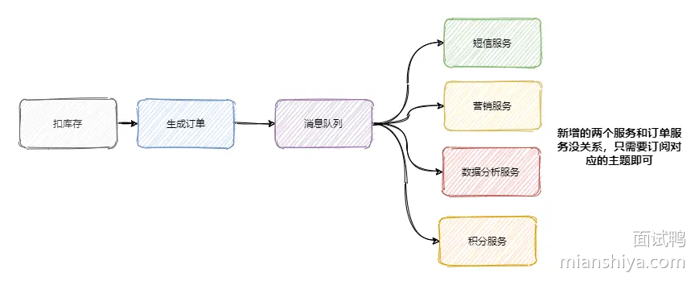
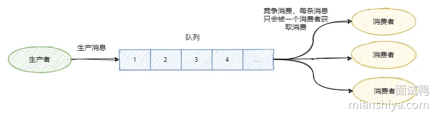

# 1142. 说一下 RocketMQ 中关于事务消息的实现？ 

## 回答重点

RocketMQ 中的事务消息

**第一阶段（消息发送）**：

- 生产者先将消息发送到 RocketMQ 的 Topic，此时消息的状态为**半消息（Half Message）**，消费者不可见。
- 然后，生产者执行本地事务逻辑，并根据本地事务的执行结果来决定下一步的操作。

**第二阶段（提交或回查）**：

- 如果本地事务成功，生产者会向 RocketMQ 提交 `Commit` 操作，将半消息变为正式消息，消费者可见。
- 如果本地事务失败，生产者会向 RocketMQ 提交 `Rollback` 操作，RocketMQ 会丢弃该半消息。
- 如果生产者没有及时提交 `Commit` 或 `Rollback` 操作，RocketMQ 会定时回查生产者本地事务状态，决定是否提交或回滚消息。

## 扩展知识

### 事务消息的实现细节

**半消息**：

- 是 RocketMQ 中的一种特殊状态的消息，此时对 Consumer 是不可见的，而且也不是存在真正要发送的队列中，而是存在一个特殊队列中。
- 只有在事务确认后，半消息才会转换为正式消息。

**事务回查（Transaction Check）**：

- 当 RocketMQ 检测到某条半消息长时间未被提交或回滚时，会主动向生产者发起事务状态的回查请求。
- 生产者实现 `checkLocalTransaction` 方法，根据该消息对应的业务逻辑状态，返回事务的执行状态（如提交、回滚、未知）。
- RocketMQ 根据生产者返回的状态进行相应的处理，确保消息与业务操作的一致性。

**事务状态的三种类型**：

- **`COMMIT_MESSAGE`**：表示本地事务已成功，RocketMQ 将半消息标记为可投递，正式被消费者消费。
- **`ROLLBACK_MESSAGE`**：表示本地事务失败，RocketMQ 将删除该半消息，消费者不可见。
- **`UNKNOWN`**：表示本地事务状态暂时无法确定，RocketMQ 会在一段时间后重新回查。

### 使用示例与主要流程

我们再来简单的看下如何使用，我根据官网示例代码简化了下。


可以看到使用起来还是很简便直观的，无非就是多加个反查事务结果的方法，然后把本地事务执行的过程写在 TransationListener 里面。

至此 RocketMQ 事务消息大致的流程已经清晰了，我们画一张整体的流程图来过一遍，其实到第四步这个消息要么就是正常的消息，要么就是抛弃什么都不存在，此时这个事务消息已经结束它的生命周期了。	


### RocketMQ 事务消息源码分析

然后我们再从源码的角度来看看到底是怎么做的，首先我们看下 `sendMessageInTransaction` 方法，方法有点长，不过没有关系结构还是很清晰的。	


流程也就是我们上面分析的，将消息塞入一些属性，标明此时这个消息还是半消息，然后发送至 Broker，然后执行本地事务，然后将本地事务的执行状态发送给 Broker ，我们现在再来看下 Broker 到底是怎么处理这个消息的。

在 Broker 的 `SendMessageProcessor#sendMessage` 中会处理这个半消息请求，因为今天主要分析的是事务消息，所以其他流程不做分析，我大致的说一下原理。

简单的说就是 sendMessage 中查到接受来的消息的属性里面 `MessageConst.PROPERTY_TRANSACTION_PREPARED` 是 true ，那么可以得知这个消息是事务消息，然后再判断一下这条消息是否超过最大消费次数，是否要延迟，Broker 是否接受事务消息等操作后，将这条消息真正的 topic 和队列存入属性中，然后重置消息的 topic 为 `RMQ_SYS_TRANS_HALF_TOPIC` ，并且队列是 0 的队列中，使得消费者无法读取这个消息。

以上就是整体处理半消息的流程，我们来看一下源码。


就是来了波狸猫换太子，其实延时消息也是这么实现的，最终将换了皮的消息入盘。

Broker 处理提交或者回滚消息的处理方法是 `EndTransactionProcessor#processRequest` ，我们来 看一看它做了什么操作。


可以看到，如果是提交事务就是把皮再换回来写入真正的topic所属的队列中，供消费者消费，如果是回滚则是将半消息记录到一个 half_op 主题下，到时候后台服务扫描半消息的时候就依据其来判断这个消息已经处理过了。

那个后台服务就是 `TransactionalMessageCheckService` 服务，它会定时的扫描半消息队列，去请求反查接口看看事务成功了没，具体执行的就是 `TransactionalMessageServiceImpl#check` 方法。

我大致说一下流程，这一步骤其实涉及到的代码很多，我就不贴代码了，有兴趣的同学自行了解。不过我相信用语言也是能说清楚的。

首先取半消息 topic 即 `RMQ_SYS_TRANS_HALF_TOPIC` 下的所有队列，如果还记得上面内容的话，就知道半消息写入的队列是 id 是 0 的这个队列，然后取出这个队列对应的 half_op 主题下的队列，即`RMQ_SYS_TRANS_OP_HALF_TOPIC` 主题下的队列。

这个 half_op 主要是为了记录这个事务消息已经被处理过，也就是说已经得知此事务消息是提交的还是回滚的消息会被记录在 half_op 中。

然后调用 `fillOpRemoveMap` 方法，从 half_op 取一批已经处理过的消息来去重，将那些没有记录在 half_op 里面的半消息调用 `putBackHalfMsgQueue` 又写入了 commitlog 中，然后发送事务反查请求，这个反查请求也是 oneWay，即不会等待响应。当然此时的半消息队列的消费 offset 也会推进。

然后 producer 中的 `ClientRemotingProcessor#processRequest` 会处理这个请求，会把任务扔到 `TransactionMQProducer` 的线程池中进行，最终会调用上面我们发消息时候定义的 `checkLocalTransactionState` 方法，然后将事务状态发送给 Broker，也是用 oneWay 的方式。

看到这里相信大家会有一些疑问，比如为什么要有个 half_op ，为什么半消息处理了还要再写入 commitlog 中别急听我一一道来。

首先 **RocketMQ 的设计就是顺序追加写入**，所以**说不会更改已经入盘的消息**，那事务消息又需要更新反查的次数，超过一定反查失败就判定事务回滚。

因此每一次要反查的时候就将以前的半消息再入盘一次，并且往前推进消费进度。而 half_op 又会记录每一次反查的结果，不论是提交还是回滚都会记录，因此下一次还循环到处理此半消息的时候，可以从 half_op 得知此事务已经结束了，因此就被过滤掉不需要处理了。

如果得到的反查的结果是 UNKNOW，那 half_op 中也不会记录此结果，因此还能再次反查，并且更新反查次数。

到现在整个流程已经清晰了，我再画个图总结一下 Broker 的事务处理流程。


#  1085. 什么是消息队列？ 

## 回答重点

消息队列（Message Queue）是一种**异步通信机制**，用于在**分布式系统**中解耦发送方和接收方之间的通信。它通过在消息生产者和消费者之间引入一个**中间缓冲区**（常见为 broker），将消息存储在 broker 中，然后由消费者从 broker 中读取和处理消息。

**常见用途**：

- **解耦**：生产者和消费者无需同时在线，生产者可以发送消息后立即返回，而消费者在合适的时机处理消息。
- **削峰填谷**：在高并发场景下，消息队列可以暂存大量请求，平滑高峰流量，避免系统过载。
- **异步处理**：可以将不需要立即处理的任务放入消息队列中异步执行，减少用户请求的响应时间。

## 扩展知识

### 常见的消息队列实现

**RabbitMQ**：

- RabbitMQ 是基于 AMQP 协议的消息队列，适合**复杂路由**和**多种消息模式**的场景。
- 具有强大的消息路由能力，包括**Direct**、**Fanout**、**Topic** 等多种交换机类型。
- 支持消息的**持久化**、**确认机制**和**死信队列**，确保消息的可靠传输。

**Kafka**：

- Kafka 是一种高吞吐量、分布式的消息队列，适用于**实时数据流**和**大数据分析**的场景。
- Kafka 的数据是以**分区（Partition）** 为单位存储，支持水平扩展。
- Kafka 的消费者可以以**消费组**的方式消费消息，实现**消息的多次消费**和**负载均衡**。

**RocketMQ**：

- RocketMQ 是阿里巴巴开源的一款消息队列，具有**高吞吐**、**低延迟**的特点，适用于企业级应用场景。
- 支持事务消息、延时消息和顺序消息，适用于金融支付、交易系统等对数据一致性要求较高的场景。

# 1087. 为什么需要消息队列？

## 回答重点

从本质上来说是因为互联网的快速发展，**业务不断扩张**，促使技术架构需要不断的演进。

从以前的单体架构到现在的微服务架构，成百上千的服务之间相互调用和依赖。从互联网初期一个服务器上有 100 个在线用户已经很了不得，到现在坐拥 10 亿日活的微信。

我们需要有一个「东西」来**解耦服务之间的关系**、**控制资源合理合时的使用**以及**缓冲流量洪峰**等等。

消息队列就应运而生了。它常用来实现：**异步处理、服务解耦、流量控制**。

消息队列的典型应用场景：

- 订单系统：在电商系统中，订单的创建、支付、发货等步骤可以通过消息队列进行异步处理和解耦。
- 日志处理：使用消息队列将日志从应用系统传输到日志处理系统，实现实时分析和监控。
- 任务调度：在批量任务处理、任务调度系统中，通过消息队列将任务分发给多个工作节点，进行并行处理。
- 数据同步：在数据同步系统中，消息队列可以用于将变更的数据异步同步到不同的存储系统或服务。

## 扩展知识

### 异步处理

随着公司的发展你可能会发现你项目的**请求链路越来越长**，例如刚开始的电商项目，可以就是粗暴的扣库存、下单。慢慢地又加上积分服务、短信服务等。这一路同步调用下来客户可能等急了，这时候就是消息队列登场的好时机。

**调用链路长、响应就慢了**，并且相对于扣库存和下单，积分和短信没必要这么的 "及时"。因此只需要在下单结束那个流程，扔个消息到消息队列中就可以直接返回响应了。而且积分服务和短信服务可以并行的消费这条消息。

可以看出消息队列可以**减少请求的等待，还能让服务异步并发处理，提升系统总体性能**。


### 服务解耦

上面我们说到加了积分服务和短信服务，这时候可能又要来个营销服务，之后领导又说想做个大数据，又来个数据分析服务等等。

可以发现订单的下游系统在不断的扩充，为了迎合这些下游系统订单服务需要经常地修改，任何一个下游系统接口的变更可能都会影响到订单服务，这订单服务组可疯了，**真 「核心」项目组**。

所以一般会选用消息队列来解决系统之间耦合的问题，订单服务把订单相关消息塞到消息队列中，下游系统谁要谁就订阅这个主题。这样订单服务就解放啦！



### 流量控制

想必大家都听过「削峰填谷」，后端服务相对而言都是比较「弱」的，因为业务较重，处理时间较长。像一些例如秒杀活动爆发式流量打过来可能就顶不住了。因此需要引入一个中间件来做缓冲，消息队列再适合不过了。

网关的请求先放入消息队列中，后端服务尽自己最大能力去消息队列中消费请求。超时的请求可以直接返回错误。

当然还有一些服务特别是某些后台任务，不需要及时地响应，并且业务处理复杂且流程长，那么过来的请求先放入消息队列中，后端服务按照自己的节奏处理。这也是很 nice 的。

上面两种情况分别对应着生产者生产过快和消费者消费过慢两种情况，消息队列都能在其中发挥很好的缓冲效果。


### 注意

引入消息队列固然有以上的好处，但是多引入一个中间件系统的稳定性就下降一层，运维的难度抬高一层。因此要**权衡利弊，系统是演进的**。

# 1088. 说一下消息队列的模型有哪些？ 

## 回答重点

常见的消息队列模型主要有以下两种：

**队列模型（也称点对点模型）**：

- 在队列模型中，消息从生产者发送到队列，并且每条消息只能被一个消费者消费一次。消费之后，消息在队列中被删除。
- 适用于任务处理类场景，如一个任务只需要一个处理者执行。

**发布/订阅模型（Publish/Subscribe）**：

- 在发布/订阅模型中，生产者将消息发布到某个主题（Topic），所有订阅了该主题的消费者都会接收到该消息。
- 每个订阅者都会接收到相同的消息，适用于广播通知、实时推送等场景。

## 扩展知识

### 队列模型（点对点模型）

生产者往某个队列里面发送消息，一个队列可以存储多个生产者的消息，一个队列也可以有多个消费者，但是消费者之间是竞争关系，**即每条消息只能被一个消费者消费**。



### 发布/订阅模型

**为了解决一条消息能被多个消费者消费的问题**，发布/订阅模型就来了。该模型是将消息发往一个Topic 即主题中，所有订阅了这个 Topic 的订阅者都能消费这条消息。

其实可以这么理解，发布/订阅模型等于我们都加入了一个群聊中，我发一条消息，加入了这个群聊的人都能收到这条消息。

那么队列模型就是一对一聊天，我发给你的消息，只能在你的聊天窗口弹出，是不可能弹出到别人的聊天窗口中的。

讲到这有人说，那我一对一聊天对每个人都发同样的消息不就也实现了一条消息被多个人消费了嘛。

是的，通过多队列全量存储相同的消息，即数据的冗余可以实现一条消息被多个消费者消费。

RabbitMQ 就是采用队列模型，通过 Exchange 模块来将消息发送至多个队列，解决一条消息需要被多个消费者消费问题。

这里还能看到假设群聊里除我之外只有一个人，那么此时的发布/订阅模型和队列模型其实就一样了。


### 小结一下

队列模型每条消息只能被一个消费者消费，而发布/订阅模型就是为让一条消息可以被多个消费者消费而生的，当然队列模型也可以通过消息全量存储至多个队列来解决一条消息被多个消费者消费问题，但是会有数据的冗余。

**发布/订阅模型兼容队列模型**，即只有一个消费者的情况下和队列模型基本一致。

RabbitMQ 采用队列模型， RocketMQ 和 Kafka 采用发布/订阅模型。

> RabbitMQ 的发布/订阅模式在本质上依然是基于队列模型的，只是通过引入多队列和交换机的绑定，同时将消息发给多个队列，模拟出消息发布/订阅的效果。

# 1129. 简述下消息队列核心的一些术语？ 

## 回答重点

常见的消息队列核心术语：

- **生产者（Producer）**：负责向消息队列中发送消息的应用程序或服务。生产者将消息发送到指定的队列或主题（Topic），供消费者消费。
- **消费者（Consumer）**：从消息队列中读取和处理消息的应用程序或服务。消费者根据业务逻辑处理收到的消息，并可以向消息队列发送确认。
- **Broker**：消息队列的核心组件，负责接收、存储和分发消息。
- **队列（Queue）**：存储消息的容器，消息按照先进先出（FIFO）的顺序在队列中存储。队列中的每条消息通常只能被一个消费者消费一次。
- **主题（Topic）**：用于在发布/订阅模型中，消息生产者将消息发布到一个主题，多个订阅该主题的消费者可以接收到相同的消息。

仅关注消息的发送和消费流程的话：消息从 Producer 发往 Broker，Broker 将消息存储至本地，然后 Consumer 从 Broker 拉取消息，或者 Broker 推送消息至 Consumer，最后消费。


## 扩展知识

### 其它术语与概念

**消息确认（Ack）**：

- 消费者处理完消息后，向消息队列系统发送的确认信号（Acknowledgment）。
- 如果消息队列未收到确认，消息会被重新投递给其他消费者，保证消息不会丢失。

**死信队列（DLQ，Dead Letter Queue）**：

- 当消息因为消费失败、多次重试后未成功处理、消息过期或队列达到最大长度等原因被丢弃时，消息可以被转移到死信队列。
- 死信队列用于记录这些未能成功消费的消息，以便后续分析或人工处理。

**NameServer（命名服务）**：

- NameServer 提供了服务发现和负载均衡的功能。
- 在分布式消息队列（如 RocketMQ）中，用于管理 Broker 的地址列表，消费者和生产者通过 NameServer 找到 Broker 并进行消息的传递。Kafka 中使用 ZooKeeper 作为命名服务，RabbitMQ 没有命名服务，RocketMQ 使用自己实现的 namesrv。

**Cluster（集群）**：

- 为了提高消息队列的可靠性和处理能力，将多个 Broker 组成一个集群。
- 集群架构可以在一个 Broker 发生故障时，保证消息服务的高可用性。

**分区与队列**：

- 为了提高并发度，往往**发布/订阅模型**还会引入队列或者分区的概念。
- 即消息是发往一个主题（Topic）下的某个队列或者某个分区中。
- RocketMQ 中叫队列（MessageQueue）， Kafka 叫分区。
- 这里的队列要区别于队列模型中的队列，RocketMQ 中的队列更多是逻辑概念，用于 Topic 下的消息存储与消费。一个 Topic 可以包含多个MessageQueue，这些队列类似于 Kafka 的分区，用于**并发消费**。

**Offset**：

- Offset 可以认为是每条消息在分区（队列）中的唯一编号，消费者需要记录自己的消费位点，以便在恢复时继续消费未处理的消息
- Kafka 和 RocketMQ 有这个概念，RabbitMQ 没有。

**Consumer Group（消费组）**:

- Consumer Group 用于协调消费者并行消费消息。
- 在 Kafka 中同一消费组内的消费者共享同一个 Topic 下的分区，一个分区只会被组内的一个消费者消费。
- 在 RocketMQ 中同一消费组内的消费者共享同一个 Topic 下的队列，一个队列只会被组内的一个消费者消费
- RabbitMQ 没有 Consumer Group 概念。

> 我们来理解下 Consumer Group 中的消费情况，以 RocketMQ 举例说明

假设现在有两个消费组分别是 Group 1 和 Group 2，它们都订阅了 Topic-a。此时有一条消息发往 Topic-a ，那么这两个消费组都能接收到这条消息。

这条消息实际是写入 Topic 某个队列中的，消费组中的某个消费者对应消费一个队列的消息。

一条消息在 Broker 中只会有一份（除了集群架构下的副本拷贝），每个消费组会有自己的 offset 即消费点位来标识消费到的位置。在消费点位之前的消息表明已经消费过了。

这个 offset 是队列级别的，每个消费组都会维护订阅的 Topic 下的每个队列的 offset 。

来看下这个图应该就很清晰了：


# 1130. 如何保证消息不丢失？ 

## 回答重点

这需要生产消息、存储消息和消费消息三个阶段共同努力才能保证消息不丢失。

- **生产者的消息确认**：生产者在发送消息时，需要通过消息确认机制来确保消息成功到达。
- **存储消息**：broker 收到消息后，需要将消息持久化到磁盘上，避免消息因内存丢失。即使消息队列服务器重启或宕机，也可以从磁盘中恢复消息。
- **消费者的消息确认**：消费者在处理完消息后，再向消息队列发送确认（ACK），如果消费者未发送确认，消息队列需要重新投递该消息。

除此之外，如果消费者持续消费失败，消息队列可以自动进行重试或将消息发送到死信队列（DLQ）或通过日志等其他手段记录异常的消息，避免因一时的异常导致消息丢失。

## 扩展知识

就我们市面上常见的消息队列而言，只要**配置得当**，我们的消息就不会丢。

先来看看一个图：


### 生产消息

生产者发送消息至 Broker ，需要处理 Broker 的响应，不论是同步还是异步发送消息，同步和异步回调都需要做好 try-catch ，妥善的处理响应，如果 Broker 返回写入失败等错误消息，需要重试发送。当多次发送失败需要作报警，日志记录等。

这样就能保证在生产消息阶段消息不会丢失。

### 存储消息

存储消息阶段需要在**消息刷盘**之后再给生产者响应，假设消息写入缓存中就返回响应，那么机器突然断电这消息就没了，而生产者以为已经发送成功了。

如果 Broker 是集群部署，有多副本机制，即消息不仅仅要写入当前 Broker，还需要写入副本机中。可以配置成至少写入两台机子后再给生产者响应，这样基本上就能保证存储的可靠了。

### 消费消息

这里经常会有同学犯错，有些同学当消费者拿到消息之后直接存入内存队列中就直接返回给 Broker 消费成功，这是不对的。

你需要考虑拿到消息放在内存之后消费者就宕机了怎么办。所以我们应该在**消费者真正执行完业务逻辑之后，再发送给 Broker 消费成功**，这才是真正的消费了。

所以只要我们在消息业务逻辑处理完成之后再给 Broker 响应，那么消费阶段消息就不会丢失。

### 小结一下

可以看出，保证消息的可靠性需要**三方配合**。

**生产者**需要处理好 Broker 的响应，出错情况下利用重试、报警等手段。

**Broker**需要控制响应的时机，单机情况下是消息刷盘后返回响应，集群多副本情况下，即发送至两个副本及以上的情况下再返回响应。

**消费者**需要在执行完真正的业务逻辑之后再返回响应给 Broker。

但是要注意消息**可靠性增强了，性能就下降**了，等待消息刷盘、多副本同步后返回都会影响性能。因此还是看业务，例如日志的传输可能丢那么一两条关系不大，因此没必要等消息刷盘再响应。

# 1131. 如何处理重复消息？ 

## 回答重点

### 1. 消息幂等性处理

- **幂等接口设计**：确保消费消息的业务逻辑是幂等的，即多次执行同一操作的结果是一样的。例如，可以通过数据库的唯一约束来保证数据不会被重复插入。
- **唯一标识**：为每条消息添加一个全局唯一的标识（如UUID），在处理消息前先检查这个标识是否已经被处理过。

### 2. 消息去重机制

- **数据库去重**：在处理消息前，将消息的唯一标识存入数据库，处理前先查询数据库中是否已存在该标识。
- **缓存去重**：使用Redis等缓存系统来存储已处理消息的标识，可以快速检查消息是否重复。

### 3. 消息确认机制

- **消息确认**：消费者在处理完消息后向消息队列发送确认（acknowledgment），只有确认过的消息才会从队列中移除。如果消费者在处理消息前崩溃，消息队列可以重新将消息投递给其他消费者。
- **幂等性确认**：确认消息也可以设计成幂等的，即重复确认不会导致副作用。

### 4. 幂等框架或库

- **使用幂等框架**：一些框架和库可以帮助实现消息的幂等性处理，例如在分布式系统中使用分布式锁或幂等库。

### 5. 消息队列特性

- **利用消息队列特性**：某些消息队列提供了去重特性，例如RocketMQ的幂等性消费。

### 具体实现步骤：

1. **生成唯一消息ID**：
   - 在生产消息时，为每条消息生成一个唯一的消息ID。
2. **存储消息ID**：
   - 将消息ID存储在数据库或缓存中，设置适当的过期时间。
3. **检查消息ID**：
   - 在消费消息前，先检查消息ID是否已经存在于数据库或缓存中。
   - 如果存在，则认为该消息是重复的，可以选择跳过处理。
   - 如果不存在，则处理消息，并将消息ID存入数据库或缓存。
4. **处理消息**：
   - 在确保消息不重复后，进行业务逻辑处理。
5. **消息确认**：
   - 在消息处理完成后，发送确认消息给消息队列，确保消息不会因为消费者的崩溃而重新投递。

通过上述策略，可以在很大程度上避免消息重复的问题，但需要注意的是，任何去重机制都会增加系统的复杂性和一定的性能开销，因此在设计系统时需要权衡去重与性能之间的关系。

## 扩展知识

### 什么是幂等性

幂等性是指一个操作无论执行多少次，产生的结果都是一样的。例如，HTTP 的 PUT 方法是幂等的，因为无论对同一资源执行多少次 PUT 操作，结果都是相同的。

例如这条 SQL:

```sql
update t1 set money = 150 where id = 1 and money = 100;
```

执行多少遍 money 都是 150，这就叫幂等。

### 如何幂等处理重复消息

需要改造业务处理逻辑，使得在重复消息的情况下也不会影响最终的结果。

主要是**利用唯一标识（ID）去重**。

在消息中引入全局唯一 ID，例如 UUID、订单号等，利用 redis 等缓存，或者数据库来存储消息 ID，然后消费者在处理消息时可以检查该消息 ID 是否存在代表此消息是否已经处理过。

**去重缓存的使用**：

- 使用 Redis 等缓存系统存储已经处理的消息 ID，以减少数据库的查询压力。
- 可以为 Redis 中的去重记录设置过期时间，例如 7 天，以便自动清理历史消息，减小存储压力。

**去重表的设计**：

- 在数据库中创建一张去重表，用来存储已处理消息的 ID 及处理时间。在消费每条消息前，先查询该表。
- 对于高并发场景，可以结合数据库的唯一索引来避免多次插入同一个消息 ID（`insert into update on duplicate key...`），确保去重表中的记录唯一。

此外，一些触发数据库修改操作的消息，可以像上述举例的 SQL 一样，做了个**前置条件判断**，即 money = 100 这样的条件直接修改，这样无论执行多少次都不影响。更通用的是做个 version 即版本号控制，对比消息中的版本号和数据库中的版本号。

### 可以从源头消除重复消息吗？即消费者仅会接收到一条消息


看下上面的图，我们来分析下看能不能避免消息的重复。

假设我们发送消息只管发，不管 Broker 的响应，那么我们发往 Broker 的消息是不会重复的。

但是一般情况我们是不允许这样的，因为这样无法保证消息的可靠性。

我们的基本需求是消息至少得发到 Broker 上，要确定 Broker 收到消息就得等 Broker 的响应，那么就可能存在 Broker 已经写入了，但是响应由于网络原因生产者没有收到，于是生产者又重发了一次，此时消息就重复了。

再看消费者消费的时候，假设我们消费者拿到消息消费了，业务逻辑已经走完了，事务提交了，此时需要更新 Consumer offset 了（告诉 Broker 这条消息我消费过了）。

但是就这这一刻这个消费者挂了，此时还未更新 Consumer offset。另一个消费者顶上，因为 Consumer offset 还没更新，于是新的消费者又拿到刚才那条消息，业务又被执行了一遍，这样消息不就重复了吗？

可以看到，对平常业务而言**消息重复是不可避免**的，因此我们只能从**另一个角度**来解决重复消息的问题。

关键点就是**幂等**。既然我们不能防止重复消息的产生，那么我们只能在业务上处理重复消息所带来的影响。

# 1138. 如何保证消息的有序性？ 

## 回答重点	

保证消息有序性的常见方法如下：

**单一生产者和单一消费者**：

- 使用单个生产者发送消息到**单个队列**，并由单个消费者处理消息。这样可以确保消息按照生产者的发送顺序消费。
- 这种方法简单但容易成为**性能瓶颈**，无法充分利用并发的优势。

**分区与顺序键（Partition Key）**：

- 在支持**分区（Partition）** 的消息队列中（如 Kafka、RocketMQ），可以通过 **Partition Key** 将消息发送到特定的分区。每个分区内部是**有序的**，这样可以保证相同 Partition Key 的消息按顺序消费。
- 例如，在订单处理系统中，可以使用订单号作为 Partition Key，将同一个订单的所有消息路由到同一个分区，确保该订单的消息顺序。

**顺序队列（Ordered Queue）**：

- 一些消息队列系统（如 RabbitMQ）支持顺序队列，消息在队列中的存储顺序与投递顺序一致。**如果使用单个顺序队列**，消息将按顺序被消费。
- 可以使用多个顺序队列来提高并发处理能力，并使用特定规则将消息分配到不同的顺序队列中。

## 扩展知识

### 不同消息队列的顺序性保证

**Kafka**：Kafka 中的消息在**分区**内部是有序的。生产者在发送消息时，可以指定分区（Partition）。如果所有相同 Key 的消息都发送到同一个分区，则可以保证这些消息的顺序。

- 通过配置生产者的**hash**函数，可以将同一类型的消息发送到相同的分区，保证顺序。
- 在消费端，使用**单线程消费者**从特定分区读取消息，可以确保消费的顺序性。

**RabbitMQ**：RabbitMQ 通过单个队列可以保证消息的顺序，如果消息需要并发消费，则需要将其路由到不同的**顺序队列**中。

- 使用**Message Grouping**技术，将具有相同属性的消息分组到一个队列中，以确保组内消息的顺序。
- 通过**自定义路由策略**，可以将同一业务逻辑的消息发送到相同的队列，从而保证顺序。

**RocketMQ**：RocketMQ 支持**顺序消息**（Ordered Messages），生产者可以使用 `send` 方法将消息发送到指定的分区队列，并使用**Message Queue Selector**来选择目标队列（本质的实现和 kafka 是一样的）。

- 消费者端通过**顺序消费模式**，可以从同一个消息队列中按顺序读取消息，确保消息的顺序性。
- 通过指定 Message Queue 的选择算法（如按订单 ID 对队列数取模），可以将同一订单的所有消息投递到相同的队列中。

### 有序消息之全局有序

如果要保证消息的**全局有序**，首先只能由一个生产者往 Topic 发送消息，并且**一个 Topic** 内部只能有**一个队列**（分区）。消费者也必须是单线程消费这个队列。这样的消息就是全局有序的！

不过一般情况下我们都不需要全局有序，即使是同步 MySQL Binlog 也只需要保证**单表**消息有序即可。


### 有序消息之部分有序

绝大部分的有序需求是部分有序，部分有序我们就可以将 Topic 内部划分成我们需要的队列数，把消息通过特定的策略发往固定的队列中，然后每个队列对应一个单线程处理的消费者。

这样即完成了部分有序的需求，又可以通过队列数量的并发来提高消息处理效率。


图中我画了多个生产者，一个生产者也可以，只要同类消息发往指定的队列即可。

使用**顺序消息**在 Kafka 和 RocketMQ 中的实现方式略有不同，下面是针对这两种消息队列的顺序消息实现的详细示例。

### Kafka 顺序消息示例

假设场景是一个订单系统，我们希望保证同一订单 ID 的消息按照顺序被消费。通过将**相同的业务 Key（订单 ID）的消息发送到同一个分区（Partition）**，可以保证这些消息在分区内部的顺序性。消费时，同一个分区的数据按顺序消费，就能保证了消息的有序性。

#### 生产者代码

```java
//忽略相关配置
KafkaProducer<String, String> producer = new KafkaProducer<>(props);

String orderId = "order-123";

for (int i = 1; i <= 5; i++) {
    String value = "Order Step " + i + " for " + orderId;
    // 使用订单 ID 作为 Key，确保相同订单的消息发送到同一个分区
    ProducerRecord<String, String> record = new ProducerRecord<>(TOPIC, orderId, value);

    RecordMetadata metadata = producer.send(record).get();
}
```

#### 消费者代码

```java
KafkaConsumer<String, String> consumer = new KafkaConsumer<>(props);
consumer.subscribe(Collections.singletonList(TOPIC));

while (true) {
    ConsumerRecords<String, String> records = consumer.poll(Duration.ofSeconds(1));
    for (ConsumerRecord<String, String> record : records) {
        System.out.printf("Consumed message: %s from partition: %d, offset: %d\n",
                record.value(), record.partition(), record.offset());
    }
}
```

- **生产者**：使用 `orderId` 作为 `key`，Kafka 根据这个 `key` 将消息发送到同一个分区。这样可以确保相同 `orderId` 的消息被发送到同一个分区，从而保证顺序。
- **消费者**：从 Kafka 的 `order-topic` 中读取消息，因为 Kafka 的分区内部消息是有序的，消费者将按照 `orderId` 的顺序消费这些消息。

### RocketMQ 顺序消息示例

在 **RocketMQ** 中，可以通过**消息队列选择器**（`MessageQueueSelector`）将消息发送到指定的队列，从而实现顺序消费

#### 生产者代码

```java
String orderId = "order-123";

for (int i = 1; i <= 5; i++) {
    String body = "Order Step " + i + " for " + orderId;
    Message message = new Message("OrderTopic", body.getBytes(StandardCharsets.UTF_8));

    // 使用 MessageQueueSelector 按照 orderId 选择队列
    SendResult sendResult = producer.send(message, new MessageQueueSelector() {
        @Override
        public MessageQueue select(List<MessageQueue> mqs, Message msg, Object arg) {
            // 将 orderId 转为 hash 值，以决定消息发往哪个队列
            String orderId = (String) arg;
            int index = orderId.hashCode() % mqs.size();
            return mqs.get(Math.abs(index));
        }
    }, orderId);
}
```

#### 消费者代码

```java
// 使用并发消费消息监听器，保证单队列内的顺序性
consumer.registerMessageListener((MessageListenerConcurrently) (msgs, context) -> {
    for (MessageExt msg : msgs) {
        String body = new String(msg.getBody());
        System.out.printf("Consumed message: %s from queue: %d\n", body, msg.getQueueId());
    }
    return ConsumeConcurrentlyStatus.CONSUME_SUCCESS;
});
```

- **生产者**：使用 `MessageQueueSelector` 将具有相同 `orderId` 的消息发送到同一个消息队列（`MessageQueue`），确保这些消息被发送到同一队列，从而保证顺序。
- **消费者**：通过 `DefaultMQPushConsumer` 订阅 `OrderTopic`，RocketMQ 保证每个队列中的消息是按顺序消费的。只要相同订单 ID 的消息在同一队列中，就可以保证它们的消费顺序。

在 **RabbitMQ** 中，保证消息的顺序性可以通过以下方式实现：

- **单个队列单个消费者**：将消息发送到一个队列中，并使用单个消费者进行消费，这样可以确保消息按照生产者发送的顺序被消费。
- **多队列顺序性保证**：可以根据某个业务 Key（例如订单 ID）选择队列，从而保证具有相同业务 Key 的消息总是发送到同一个队列，由一个消费者按顺序处理。

下面的示例演示了**RabbitMQ 顺序消息的实现**，通过将所有相同订单 ID 的消息发送到同一个队列中，以确保消息的顺序。

### RabbitMQ 顺序消息示例

#### 生产者代码

```java
try (Connection connection = factory.newConnection();
     Channel channel = connection.createChannel()) {
    // 声明队列（如果不存在则创建）
    channel.queueDeclare(QUEUE_NAME, true, false, false, null);

    String orderId = "order-123";

    for (int i = 1; i <= 5; i++) {
        String message = "Order Step " + i + " for " + orderId;
        // 发送消息
        channel.basicPublish("", QUEUE_NAME, null, message.getBytes("UTF-8"));
        System.out.println("Sent: " + message);
    }
}
```

#### 消费者代码

```java
try (Connection connection = factory.newConnection();
     Channel channel = connection.createChannel()) {
    // 声明队列（如果不存在则创建）
    channel.queueDeclare(QUEUE_NAME, true, false, false, null);

    // 创建消费者，并定义处理逻辑
    DeliverCallback deliverCallback = (consumerTag, delivery) -> {
        String message = new String(delivery.getBody(), "UTF-8");
        System.out.println("Received: " + message);

        // 模拟消息处理逻辑
        try {
            Thread.sleep(500); // 模拟处理延迟
        } catch (InterruptedException e) {
            e.printStackTrace();
        }

        // 发送手动确认
        channel.basicAck(delivery.getEnvelope().getDeliveryTag(), false);
    };

    // 开始消费消息（手动确认模式）
    channel.basicConsume(QUEUE_NAME, false, deliverCallback, consumerTag -> { });
}
```

- **单个消费者**：此示例中使用了单个消费者处理消息，确保消息按照发送顺序被消费。对于顺序性要求高的业务，通常只使用一个消费者进行处理。

### RabbitMQ 方案扩展：多队列+顺序消费

在某些场景下，单个队列和单个消费者的方式可能会因为性能问题无法满足业务需求。我们可以通过多队列的方式，将不同业务 Key 的消息发送到不同的队列中，以提高并发处理能力，同时保证每个 Key 的消息顺序。

- **将消息分配到不同的队列**：例如，可以使用订单 ID 的哈希值，将订单消息发送到多个不同的队列。
- **每个队列使用一个消费者**：确保同一个队列中的消息按顺序被消费。每个消费者只负责处理一个队列中的消息。

#### 多队列的生产者

```java
try (Connection connection = factory.newConnection();
     Channel channel = connection.createChannel()) {

    String orderId = "order-123";
    int numberOfQueues = 3; // 假设有 3 个队列
    int queueIndex = Math.abs(orderId.hashCode() % numberOfQueues);
    String queueName = QUEUE_PREFIX + queueIndex;

    // 声明队列（如果不存在则创建）
    channel.queueDeclare(queueName, true, false, false, null);

    for (int i = 1; i <= 5; i++) {
        String message = "Order Step " + i + " for " + orderId;
        channel.basicPublish("", queueName, null, message.getBytes("UTF-8"));
        System.out.println("Sent: " + message + " to " + queueName);
    }
}
```

#### 多队列的消费者

```java
try (Connection connection = factory.newConnection();
     Channel channel = connection.createChannel()) {
    String queueName = QUEUE_PREFIX + QUEUE_INDEX;

    channel.queueDeclare(queueName, true, false, false, null);
    System.out.println("Waiting for messages in " + queueName);

    DeliverCallback deliverCallback = (consumerTag, delivery) -> {
        String message = new String(delivery.getBody(), "UTF-8");
        System.out.println("Received: " + message);

        // 模拟处理逻辑
        try {
            Thread.sleep(500);
        } catch (InterruptedException e) {
            e.printStackTrace();
        }

        channel.basicAck(delivery.getEnvelope().getDeliveryTag(), false);
    };

    channel.basicConsume(queueName, false, deliverCallback, consumerTag -> { });
}
```

- **多队列方案**：生产者根据业务 Key（如订单 ID）的哈希值，将消息发送到不同的队列（如 `order_queue_0`、`order_queue_1`、`order_queue_2`）。这种方法可以提高并发处理能力，因为每个队列可以有一个独立的消费者。
- **每个消费者处理一个队列**：消费者从指定的队列中消费消息，确保每个队列内的消息按顺序消费。

# 1139. 如何处理消息堆积？ 

## 回答重点

消息堆积是指在消息队列中，消息的生产速度远大于消费速度，导致大量消息积压在队列中。

我们需要**先定位消费慢的原因**，如果是 bug 则处理 bug，同时可以临时扩容增加消费速率，减少线上的资损。

如果是因为本身消费能力较弱，则可以优化下消费逻辑

常见有以下几种方式**提升消费者的消费能力**：

1. **增加消费者线程数量**：提高并发消费能力。
2. **增加消费实例**：在分布式系统中，可以水平扩展多个消费实例，从而提高消费速率。
3. **优化消费者逻辑**：检查消费者的代码，减少单个消息的处理时间。例如，减少 I/O 操作、使用批量处理等。

**注意上述的第二点**：

- 增加消费实例，一定要注意**注意Topic 对应的分区/队列数需要大于等于消费实例数**，不然新增加的消费者是没东西消费的。**因为一个Topic中，一个分区/队列只会分配给一个消费实例**

除此之外还可以进行**限流和降级处理**：

- 对消息生产端进行限流，降低生产速率，避免消息积压进一步恶化。
- 对非关键消息进行**丢弃**或**延迟处理**，只保留高优先级的消息，提高系统的响应速度。

## 扩展知识

### 优化消费者逻辑常见做法

**批量消费**：

- 通过一次性从队列中消费多条消息（如批量读取 100 条），可以减少每次拉取消息的网络开销，提高处理效率。

**异步消费**：

- 使用异步处理方法，在消费的同时不阻塞后续消息的消费。处理完一条消息后立即开始处理下一条消息，提升并发度（但是要注意消息丢失的风险）。

**优化数据库操作**：

- 如果消费者在处理消息时需要频繁访问数据库，可以通过**数据库连接池**、**SQL 优化**、**缓存**等手段减少数据库操作的时间。
- 使用批量插入或更新操作，而不是逐条处理，可以显著提升效率。

### 临时扩展队列的策略

**临时扩展多个消费者队列**：

- 在消息积压严重时，可以通过临时扩展多个消费者队列，将积压的消息分配到不同的队列中进行消费。消费完成后，可以将这些临时队列关闭。
- 例如，在 Kafka 中，可以增加分区数（Partition），同时扩展更多的消费者实例，分摊消费压力。
- 在 RocketMQ 中可以增加队列数。

**使用多队列调度机制**：

- 例如，使用 RabbitMQ 的**Exchange**机制，将消息按照特定规则路由到多个队列中。这样可以在消息堆积时，将不同类型的消息分开处理。

### 限流与降级的实现方式

**生产者限流**：

- 在生产者端增加限流逻辑，使用**令牌桶**、**漏桶算法**等限流策略，限制生产者的发送速率，从而避免消息队列被快速填满。
- 例如，在 Kafka 中可以通过配置生产者的 `linger.ms` 和 `batch.size` 来缓解消息发送的速度。

**消费者降级**：

- 在消息堆积严重时，对低优先级的消息进行**丢弃**或延迟处理。只保留高优先级消息的消费，确保系统核心功能的正常运行。
- 可以在消费端增加**优先级队列**或通过消息属性区分优先级，先处理高优先级的消息。